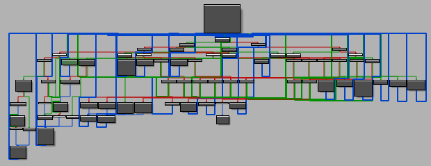

## 0CTF 2020 - J (Reversing 578)
##### 29/06 - 01/07/2020 (48hr)
___


### Description

-
___


### Solution

Let's start from `main`:
```c
int __cdecl main(int argc, const char **argv, const char **envp) {
  /* ... */
  u_init_anti_re_hook();
  puts("Give me your flag and I'll check it...");
  v3 = _iob_func();
  flag = glo_flag;
  fgets(glo_flag, 33, v3);
  memset(buf, 0, sizeof(buf));
  len = -1i64;
  do
    ++len;
  while ( glo_flag[len] );
  if ( len != 32 ) {
    puts("invalid length");
    exit(-1);
  }

  flOldProtect = 0;
  virmem = (void (__fastcall *)(const char *, char *, __int64))VirtualAlloc(0i64, 0x1000ui64, 0x1000u, 0x40u);
  shellcode = glo_shellcode;
  virmem0 = virmem;
  virmem1 = virmem;
  i = 13i64;
  do {                                          // copy 128 bytes from glo_shellcode into virtual memory
    tmp = *(_OWORD *)shellcode;
    virmem1 = (void (__fastcall *)(const char *, char *, __int64))((char *)virmem1 + 0x80);
    shellcode += 128;
    *((_OWORD *)virmem1 - 8) = tmp;
    *((_OWORD *)virmem1 - 7) = *((_OWORD *)shellcode - 7);
    *((_OWORD *)virmem1 - 6) = *((_OWORD *)shellcode - 6);
    *((_OWORD *)virmem1 - 5) = *((_OWORD *)shellcode - 5);
    *((_OWORD *)virmem1 - 4) = *((_OWORD *)shellcode - 4);
    *((_OWORD *)virmem1 - 3) = *((_OWORD *)shellcode - 3);
    *((_OWORD *)virmem1 - 2) = *((_OWORD *)shellcode - 2);
    *((_OWORD *)virmem1 - 1) = *((_OWORD *)shellcode - 1);
    --i;
  } while ( i );
  *(_WORD *)virmem1 = *(_WORD *)shellcode;      // copy leftovers
  *((_BYTE *)virmem1 + 2) = shellcode[2];
  VirtualProtect(virmem, 0x1000ui64, 0x10u, &flOldProtect);// PAGE_EXECUTE
  j = 0;
  tbl_A_p = glo_tbl_A;
  do                                            // parse tbl_A and insert it into a hashmap
  {
    pt0 = *tbl_A_p & 0xF;                       // get last digit (4 bits)
    pt1 = ((unsigned int)*tbl_A_p >> 4) & 0x1FFF;// next 3 digits (13 bits)
    pt3 = (unsigned int)*tbl_A_p >> 30;         // get 2 MSBits
    pt2 = ((unsigned int)*tbl_A_p >> 17) & 0x1FFF;// get 3rd part of the number (13 bits)
    pt0_ = ((unsigned int)*tbl_A_p >> 4) & 0x1FFF;// 1st part (KEY)
    v18 = glo_stl_obj->field_8;
    v19 = glo_stl_obj;
    while ( !v18->has_next ) {
      if ( *(_DWORD *)&v18->key >= (unsigned int)pt1 ) {
        v19 = v18;
        v18 = v18->right;
      } else{
        v18 = v18->left;
      }
    }

    if ( v19 == glo_stl_obj || (unsigned int)pt1 < *(_DWORD *)&v19->key ) {
      p_pt0 = &pt0_;
      obj = u_stl_alloc(pt1, (__int64)glo_stl_obj, &p_pt0);
      u_stl_map_insert(v21, &p_flOldProtect, (__int64)v19, (unsigned int *)&obj->key, obj);
      v19 = (struc_1 *)p_flOldProtect;
    }
    ++j;
    v19->val3 = pt2;
    ++tbl_A_p;
    v19->val2 = pt3;
    v19->val1 = pt0;
  }
  while ( (unsigned __int64)j < 0x3F );
  glo_virt_mem = virmem0;
  virmem0("TCTF_QUALS_2020_", buf, 16i64);      // invoke shellcode
  // func sets buf to "CTFTQ_AUSL2_20_0"
  VirtualFree(virmem0, 0x1000ui64, 0x1000u);    // clear mem after call
  v22 = glo_stl_obj;
  v23 = glo_stl_obj->field_8;
  v24 = v23;
  if ( !v23->has_next ) {
    do {
      u_delete_recursive((__int64)&glo_stl_obj, v24->left);
      v24 = v24->right;
      operator delete(v23);
      v23 = v24;
    } while ( !v24->has_next );
    v22 = glo_stl_obj;
  }
  v22->field_8 = v22;
  glo_stl_obj->right = glo_stl_obj;
  glo_stl_obj->left = glo_stl_obj;
  glo_stl_obj_count = 0i64;
  pt0_ = 0;
  
  /**
   * DO THE SAME WITH `glo_shellcode_stage2` and `glo_tbl_B`
   */
  v41 = lpAddress;
  glo_virt_mem = (void (__fastcall *)(const char *, char *, __int64))lpAddress;
  trg_cipher = glo_trg_cipher;
  jj = 4i64;
  is_flag_correct = 0;
  do {                                           // loop 4 times
    retv = shellcode_fun(flag, buf, trg_cipher);
    trg_cipher += 8;
    flag += 8;
    is_flag_correct |= retv;
    --jj;
  } while ( jj );

  VirtualFree(v41, 0x1000ui64, 0x1000u);
  goodbadboy = "Congrats, you got the flag.";
  if ( is_flag_correct )
    goodbadboy = "Try again~~";
  puts(goodbadboy);
  getchar();
  getchar();
  return 0;
}
```

Function begins by reading a flag from `stdin`. The flag must be **32** characters long. Then it
allocates some (virtual) memory and copies a shellcode (from `glo_shellcode`) to it. Then it does
something strange: It parses `glo_tbl_A`, which is a global table with DWORDs:
```python
tbl_A = [
    0x00A00400, 0x01400581, 0x81E00601, 0x832606C1, 0x85E80782, 0x86260843, 0x00A00924,
    0x00A009C0, 0x82800A62, 0x83C20B22, 0x86400BE3, 0x86720CA3, 0x80A00D84, 0x40840DE0,
    0x84620F62, 0x875E1023, 0x87FC10E3, 0x80A011C4, 0x40A01300, 0x85221462, 0x88A81523,
    0x80A01613, 0x80A016F4, 0x45AE18E0, 0x89581993, 0x89941A53, 0x80A01B34, 0x40A01DC0,
    0x89D01E73, 0x8A0C1F33, 0x80A02014, 0x40A022C0, 0x80842373, 0x8A6C2433, 0x80A02514,
    0x4AD428C0, 0x8B142973, 0x8B342A33, 0x80A02B14, 0x40A02EF0, 0x8B762FA3, 0x80A03084,
    0x4CEA30E0, 0x40A031B0, 0x40A03340, 0x8BDC36A3, 0x07003A84, 0x4BE03AA0, 0x8C4C3C63,
    0x07C03F74, 0x4C503F90, 0x40A044F0, 0x40A04A70, 0x40A04C50, 0x40A04E30, 0x40A05010,
    0x40A05310, 0x40A05850, 0x40A05950, 0x40A05B60, 0x40A05E90, 0x40A06210, 0x40A06700
]
```

Each DWORD is packed with **4** different fields, so the first task, is to unpack all fields and
insert them into a hashmap, `glo_stl_obj`:
```c
pt0 = *tbl_A_p & 0xF;                           // get last digit (4 bits)
pt1 = ((unsigned int)*tbl_A_p >> 4) & 0x1FFF;   // next 3 digits (13 bits) (KEY)
pt3 = (unsigned int)*tbl_A_p >> 30;             // get 2 MSBits
pt2 = ((unsigned int)*tbl_A_p >> 17) & 0x1FFF;  // get 3rd part of the number (13 bits)
```

`pt1` is the hash key and the tuple `(pt0, pt3, pt2)` is the value. We can infer that from
`u_stl_alloc` where the last argument passed is `p_pt0 = pt0_ = pt1`:
```c
struc_1 *__fastcall u_stl_alloc(__int64 a1, __int64 a2, _DWORD **a3) {
  struc_1 *result; // rax

  result = sub_13F9C25A0();
  *(_WORD *)&result->field_18 = 0;
  if ( result != (struc_1 *)0xFFFFFFFFFFFFFFE4i64 ) {
    *(_DWORD *)&result->key = **a3;
    *(_QWORD *)&result->val1 = 0i64;
    result->val3 = 0;
  }
  return result;
}
```

After that it invokes the shellcode:
```c
glo_virt_mem = virmem0;
virmem0("TCTF_QUALS_2020_", buf, 16i64);      // invoke shellcode  
```

This function takes **3** arguments and sets the contents of `buf`. Since this computation does not
depend of the flag, we can simply run the function and just use the result in `buf`
(we don't have to analyze it):
```python
buf = [
  0x43, 0x54, 0x46, 0x54, 0x51, 0x5F, 0x41, 0x55, 0x53, 0x4C,
  0x32, 0x5F, 0x32, 0x30, 0x5F, 0x30, 0xBE, 0x8C, 0xAA, 0xA2,
  0x98, 0x82, 0xBE, 0xA6, 0x60, 0x64, 0x60, 0x64, 0xA8, 0xBE,
  0xA8, 0x86, 0x05, 0x55, 0x4D, 0x31, 0xC8, 0x7C, 0xC8, 0xC0,
  0x7D, 0xC1, 0x0D, 0x51, 0x19, 0x51, 0x45, 0x7D, 0xF9, 0x9A,
  0x81, 0x91, 0x82, 0x91, 0xA2, 0xFA, 0xA2, 0x1A, 0xFA, 0x32,
  0xAA, 0x8A, 0x62, 0x0A, 0x23, 0x03, 0xF5, 0x05, 0x35, 0x44,
  0x65, 0x44, 0x15, 0xF5, 0x14, 0x54, 0x35, 0xC5, 0x23, 0xF3,
  0x88, 0xEA, 0x88, 0x6A, 0xEA, 0xCB, 0xA8, 0x2A, 0x8A, 0x29,
  0xE6, 0x6B, 0x06, 0x46, 0x0B, 0x46, 0x97, 0x11, 0x55, 0xD4,
  0x53, 0x50, 0xD7, 0x14, 0x8B, 0x48, 0xAB, 0x2B, 0xAD, 0xAF,
  0x2A, 0x28, 0x06, 0x46, 0x0B, 0x46, 0x3B, 0xF7, 0x76, 0xD6,
  0x58, 0xD5, 0x2F, 0xDD, 0x88, 0xEA, 0x88, 0x6A, 0xAC, 0xF7,
  0xCB, 0x3A, 0xEC, 0xAB, 0x4A, 0x2B, 0x35, 0x44, 0x65, 0x44,
  0x61, 0xB9, 0xDD, 0xFC, 0x9E, 0xF5, 0x0F, 0x65, 0xA2, 0x1A,
  0xFA, 0x32, 0x4F, 0xC4, 0x7E, 0x6E, 0x7F, 0x6E, 0x3F, 0x12,
  0x19, 0x51, 0x45, 0x7D, 0x6A, 0x47, 0x83, 0x3E, 0x38, 0x3F,
  0xC5, 0x9A, 0x05, 0x55, 0x4D, 0x31, 0x11, 0x6C, 0x58, 0x41,
  0xA0, 0x9B, 0xBD, 0x8C, 0x98, 0x82, 0xBE, 0xA6, 0xE7, 0x5A,
  0x42, 0x73, 0xA1, 0xCF, 0x95, 0x43, 0x53, 0x4C, 0x32, 0x5F,
  0xD4, 0xBD, 0xBA, 0xAB, 0xAF, 0xA0, 0x21, 0x04, 0xF2, 0x55,
  0xC5, 0x2D, 0x99, 0x2B, 0x00, 0x00, 0x47, 0x8E, 0x41, 0xFE,
  0xFE
]
```

After the calculation of `buf`, function releases the allocated memory and clears the hashmap.
Then, program repeats the same: It allocates another memory slot and drops a different shellcode
`glo_shellcode_stage2`. Then it creates a new hashmap using `glo_tbl_B`:
```python
tbl_B = [
    0x43200CC0, 0x856A19E4, 0x048A1FA1, 0x05002064, 0x04D82290, 0x04002432, 0x046024B3,
    0x8D402534, 0x048A2771, 0x04002790, 0x8D402864, 0x83482AF3, 0x8D842BA4, 0x07E83761,
    0x885C37D4, 0x083A3D60, 0x06F03F22, 0x07C03F93, 0x8D604004, 0x07E84271, 0x46F04290,
    0x8D604334, 0x09E84A41, 0x0A544AB4, 0x0A324D50, 0x094C4F22, 0x09C04F93, 0x8D805004,
    0x09E85231, 0x494C5250, 0x8D8052F4, 0x0C8A5FB1, 0x0CEE6034, 0x0CD06260, 0x0BFA6432,
    0x0C6064B3, 0x0D206534, 0x0C8A6731, 0x0BFA6750, 0x81A267D3, 0x0D206900, 0x0D406A00,
    0x0D606B00, 0x0D806C00, 0x0E606C74, 0x8F6A71B1, 0x0E987210, 0x0E607300, 0x0F6A74A1,
    0x0F9C7524, 0x0E7E79D0, 0x0E987B32, 0x0F407BB3, 0x8E647C33, 0x52007C90, 0x92007D44,
    0x12009000
]
```

After all initializations, it invokes the new shellcode:
```c
  v41 = lpAddress;
  glo_virt_mem = (void (__fastcall *)(const char *, char *, __int64))lpAddress;
  trg_cipher = glo_trg_cipher;
  jj = 4i64;

  is_flag_correct = 0;
  do {                                           // loop 4 times
    retv = shellcode_fun(flag, buf, trg_cipher);
    trg_cipher += 8;
    flag += 8;
    is_flag_correct |= retv;
    --jj;
  } while ( jj );
```

Flag is split into **4** parts of **8** characters each. `shellcode_fun` takes as input the flag
part, the `buf` that was generated from the previous shellcode and the next **8** bytes from `trg`:
```python
trg = [
  0x0F, 0xDA, 0x04, 0xD8, 0xD0, 0xAB, 0xF4, 0xE5, 0x3F, 0xBD, 
  0x61, 0x7C, 0x6B, 0x13, 0x7C, 0xC4, 0xF9, 0xA0, 0x54, 0x33, 
  0xA7, 0x60, 0x50, 0xDA, 0x20, 0xE2, 0x7E, 0xE1, 0x13, 0x0B, 
  0xB2, 0x25
]
```

Shellcode function returns a 32-bit number, which is ORed with the `is_flag_correct` flag. If this
flag is still **0** after the **4** executions, the goodboy message is printed:
```c
  goodbadboy = "Congrats, you got the flag.";
  if ( is_flag_correct )
    goodbadboy = "Try again~~";
  puts(goodbadboy);
```

Clearly our goal is to make the shellcode function return **0** for each different flag and `trg`
parts.


### Bypassing the Anti-Reversing protection

If we debug the program, we will see that the first shellcode does not make much sense:
```assembly
debug022:0000000000060000         push    rbp
debug022:0000000000060001         push    r15
debug022:0000000000060003         push    r14
debug022:0000000000060005         push    r13
debug022:0000000000060007         push    r12
debug022:0000000000060009         push    rbx
debug022:000000000006000A         test    rdx, rdx
debug022:000000000006000D         setz    byte ptr [rsp-26h]
debug022:0000000000060012         test    rcx, rcx
debug022:0000000000060015         setz    byte ptr [rsp-25h]
debug022:000000000006001A         cmp     r8, 10h
debug022:000000000006001E         mov     eax, 28F82A19h
debug022:0000000000060023         mov     r9d, 0ED432E50h
debug022:0000000000060029         cmovnz  r9d, eax
debug022:000000000006002D         mov     [rsp-8], rdx
debug022:0000000000060032         lea     rax, [rdx+68h]
debug022:0000000000060036         mov     [rsp-10h], rax
debug022:000000000006003B         mov     eax, 0BF0691A4h
debug022:0000000000060040         int     3                       ; Trap to Debugger
debug022:0000000000060041
debug022:0000000000060041 loc_60041:                              ; CODE XREF: debug022:000000000006006D↓j
debug022:0000000000060041         db      26h
debug022:0000000000060041         mov     eax, 6E674CF2h
debug022:0000000000060047         mov     r8d, 0FFFFFFFFh
debug022:000000000006004D         nop     dword ptr [rax]
debug022:0000000000060050         mov     edx, eax
debug022:0000000000060052         cmp     edx, 0F970E372h
debug022:0000000000060058         int     3                       ; Trap to Debugger
debug022:0000000000060059         mov     esi, 0F07BFA81h
debug022:000000000006005E         sub     eax, 4BABCC3Ch
debug022:0000000000060063         xchg    eax, ebp
debug022:0000000000060064         call    near ptr 0FFFFFFFFFC008224h
```

Having instructions such as `call near ptr 0FFFFFFFFFC008224h` means that the shellcode is packed.
The interesting part here is the `int 3` instruction that generates a **software interrupt** which
is usually used by debuggers to *temporarily replace an instruction in a running program to set
a code breakpoint*. This means that the execution control is transferred to the *interrupt handler*
when the processor hits the `int 3` instruction. Therefore, the interrupt handler should be the one
who is responsible for dynamically unpacking the next part of the shellcode. But where is this code?
To find out, we need to go back to the very first instruction of `main`:
```c
int __cdecl main(int argc, const char **argv, const char **envp) {
  /* ... */
  u_init_anti_re_hook();
  /* ... */
```

```c
void __stdcall u_init_anti_re_hook() {
  HMODULE ModuleHandleA; // rax
  FARPROC KiUserExceptionDispatcher; // rax
  __int64 v2; // rbx
  DWORD flOldProtect; // [rsp+20h] [rbp-18h] BYREF

  ModuleHandleA = GetModuleHandleA("ntdll.dll");
  KiUserExceptionDispatcher = GetProcAddress(ModuleHandleA, "KiUserExceptionDispatcher");
  v2 = (__int64)KiUserExceptionDispatcher + *((int *)KiUserExceptionDispatcher + 1) + 4;
  glo_KiUserExceptionDispatcher = KiUserExceptionDispatcher;
  flOldProtect = 0;
  VirtualProtect((LPVOID)(v2 + 4), 4ui64, 4u, &flOldProtect);// PAGE_READWRITE
  *(_QWORD *)(v2 + 4) = u_anti_re_hook_func;
  VirtualProtect((LPVOID)(v2 + 4), 4ui64, flOldProtect, &flOldProtect);// restore protections
}
```

This function locates the address of `KiUserExceptionDispatcher`, which contains the address of
the *user-mode exception dispatcher function*. Then it locates the interrupt table and sets the
address of `u_anti_re_hook_func` at the offset `v2 + 4` -which is the **4-th** entry in this
interrupt table. That is, when the `int 3` is executed, the processor invokes the **4-th** entry
from the interrupt table (remember we start from **0**), which is the `u_anti_re_hook_func`:
```c
void __fastcall __noreturn u_anti_re_hook_func(struct _EXCEPTION_RECORD *ExceptionRecord, PCONTEXT ContextRecord) {
  bool v2; // zf
  anti_re_struct a1; // [rsp+20h] [rbp-18h] BYREF

  v2 = (ExceptionRecord->ExceptionFlags & 2) == 0;
  a1.context = ContextRecord;
  a1.exception = ExceptionRecord;
  if ( v2 && u_fix_shellcode_jumps(&a1) == -1 )
    RtlRestoreContext(ContextRecord, ExceptionRecord);
  exit(-1);
}
```


Function verifies first the source of the interrupt and then invokes `u_fix_shellcode_jumps`. After
that, execution gets transferred back to the shellcode:
```c
int __fastcall u_fix_shellcode_jumps(anti_re_struct *a1) {
  /* ... */
  status = 0;
  if ( a1->exception->ExceptionCode == 0x80000003 ) {
    virmem = glo_virt_mem;
    a1->context->Dr0 = 0i64;
    a1->context->Dr1 = 0i64;
    a1->context->Dr2 = 0i64;
    a1->context->Dr3 = 0i64;
    context = a1->context;
    cur = glo_stl_obj->field_8;
    found = glo_stl_obj;
    off = LODWORD(context->Rip) - (_DWORD)virmem;// get offset of exception
    if ( cur->has_next )
      goto MOVE_ON;
    do {                                         // binary search of the offset
      if ( *(_DWORD *)&cur->key >= off ) {
        found = cur;
        cur = cur->right;
      } else {
        cur = cur->left;
      }
    }
    while ( !cur->has_next );
    if ( found == glo_stl_obj || (v11 = found, off < *(_DWORD *)&found->key) )
MOVE_ON:
      v11 = glo_stl_obj;
    if ( v11 != glo_stl_obj ) {
      val2 = v11->val2;
      val3 = v11->val3;
      status = -1;                              // error
      if ( val2 ) {                             // instruction size
        if ( val2 == 1 ) {
          val2 = 5;                             // unconditional long jump (5 bytes)
        } else if ( val2 == 2 ) {               // conditional long jump (6 bytes)
          val2 = 6;
        } else {
          status = 0;
        }
      } else {
        val2 = 2;                               // short jump (2 bytes)
      }

      // val2 can be 2, 5 or 6 (instruction length maybe?)
      EFlags = context->EFlags;
      if ( (EFlags & 0x100) != 0 )
        status = 0;
      if ( LOBYTE(v11->val1) ) {
        switch ( LOBYTE(v11->val1) ) {
          case 1:
            // https://en.wikipedia.org/wiki/FLAGS_register
            // http://unixwiz.net/techtips/x86-jumps.html

            // ZF = 0x40
            // SF = 0x80
            // OF = 0x0800  (flags >> 4) & 0x80
            if ( (EFlags & 0x40) != 0 || ((EFlags ^ (EFlags >> 4)) & 0x80u) != 0 )// ZF || (SF ^ OF) ~> JLE
              goto FINITO;
            break;
          case 2:
            if ( (EFlags & 0x40) == 0 && ((EFlags ^ (EFlags >> 4)) & 0x80u) == 0 )// ~ZF & (SF ^ OF) ~> JG
              goto FINITO;
            break;
          case 3:
            if ( (EFlags & 0x40) != 0 ) {        // JE
FINITO:
              context->Rip = (DWORD64)virmem + val3;
              return status;
            }
            break;
          case 4:
            if ( (EFlags & 0x40) == 0 )         // JNE
              goto FINITO;
            break;
          default:
            return 0;
        }
        context->Rip += val2;                   // jump not taken; go to the next instruction
        return status;
      }
      context->Rip = (DWORD64)virmem + val3;    // jump taken
    }
  }
  return status;
}
```

With some struct renaming we can easily understand what's going on what these `pt0`-`pt3` values
from the hash map mean. Handler first searches in `glo_stl_obj` to get the entry with the following
key:
```c
off = LODWORD(context->Rip) - virmem;
```

That is, it uses the offset of the `int 3` instruction in the shellcode as a key to locate the
values `(pt0, pt3, pt2)` and determine how to fix the shellcode. First it uses the value of 
`pt3` (or `v11->val2`) to determine the instruction size (before `int 3` was patched):
```c
if ( val2 ) {                             // instruction size
  if ( val2 == 1 ) {
    val2 = 5;                             // unconditional long jump (5 bytes)
  } else if ( val2 == 2 ) {               // conditional long jump (6 bytes)
    val2 = 6;
  } else {
    status = 0;
  }
} else {
  val2 = 2;                               // short jump (2 bytes)
}
```

Then it uses the value of `pt0` (or `v11->val1`) to determine the jump type. It also uses the flags
from **EFLAGS** register to determine if the jump should be taken or not:
```c
switch ( LOBYTE(v11->val1) ) {
  case 1:
    // ZF = 0x40
    // SF = 0x80
    // OF = 0x0800  (flags >> 4) & 0x80
    if ( (EFlags & 0x40) != 0 || ((EFlags ^ (EFlags >> 4)) & 0x80u) != 0 )// ZF || (SF ^ OF) ~> JLE
      goto FINITO;
    break;
  case 2:
    if ( (EFlags & 0x40) == 0 && ((EFlags ^ (EFlags >> 4)) & 0x80u) == 0 )// ~ZF & (SF ^ OF) ~> JG
      goto FINITO;
    break;
  /* ... */
```

Finally it uses `pt2` (or `v11->val3`) as a jump offset, in case that the jump should be taken:
```c
      context->Rip = (DWORD64)virmem + val3;    // jump taken
```

If jump should not be taken, the `rip` moves to the next instruction:
```c
  context->Rip += val2;                   // jump not taken; go to the next instruction
```

After `rip` is properly adjusted, execution is transferred back to the shellcode.

Now that we know how the anti-reversing protection works, we remove all these `int 3` instructions
and we replace them with the appropriate `jmp/jcc` ones. We write a small IDAPython script to do
that. We set a breakpoint, right before the shellcode is invoked and we run the script.
```assembly
.text:000000013F621937         jb      loc_13F621891
.text:000000013F62193D         lea     rdx, [rsp+158h+buf]     ; arg2
.text:000000013F621942         lea     rcx, aTctfQuals2020     ; arg1
.text:000000013F621949         mov     r8d, 10h                ; arg3
.text:000000013F62194F         mov     cs:glo_virt_mem, r13
.text:000000013F621956         call    r13                     ; <-- BREAKPOINT HERE
```

To deobfuscate the second shellcode we set another breakpoint at `call r13` and we rerun the
script (make sure the second time the `fix_shellcode(shellcode_stage_2, tbl_B)` is uncommented).
```assembly
.text:000000013F621B80 CRYPT_LOOP:                             ; CODE XREF: main+47B↓j
.text:000000013F621B80         lea     rdx, [rsp+158h+buf]
.text:000000013F621B85         mov     r8, rbx
.text:000000013F621B88         mov     rcx, r12
.text:000000013F621B8B         call    r13                     ; <-- BREAKPOINT HERE
.text:000000013F621B8E         add     rbx, 8
.text:000000013F621B92         add     r12, 8
.text:000000013F621B96         or      ebp, eax
.text:000000013F621B98         dec     rdi
.text:000000013F621B9B         jnz     short CRYPT_LOOP
```

For more details, please take a look at the [fix_shellcode](./fix_shellcode.py) script.


### Reversing the Shellcode

Now that we deobfuscated the shellcode we can finally analyze it. We start with the first shellcode,
which we do not analyze because it does not depend on the flag, so we can direcly use its output
(`buf`):
```c
__int64 __fastcall sub_D0000(__int64 a1, __int64 a2, __int64 a3) {
  /* ... */
  v34 = a2 == 0;
  v8 = -314364336;
  if ( a3 != 16 )
    v8 = 687352345;
  v38 = a2 + 104;
  for ( i = -1090088540; ; i = 1009643644 ) {
    while ( 1 ) {
      while ( 1 ) {
        while ( 1 ) {
          while ( 1 ) {
            v10 = i;
            if ( i > -110042254 )
              break;
            if ( i > -1051858847 ) {
              if ( i > -483208073 ) {
                if ( i == -483208072 ) {
                  i = 1032767371;
                  v4 = 8;
                } else if ( i == -314364336 ) {
                  v33 = a2;
                  v36 = v38;
                  i = 1009643644;
                  v6 = 0;
                } else {
                  v11 = *(_WORD *)(v33 + 2i64 * (v32 - 7));
                  v12 = v32 - 6;
LABEL_42:
                  LOWORD(v15) = *(_WORD *)(v33 + 2i64 * v12);
                  HIWORD(v15) = v11;
                  v7 = v15 >> 7;
                  i = 1124760828;
                }
              } else if ( i == -1051858846 ) {
                *(_WORD *)(v36 + 2i64 * (v31 + 4)) = *(_WORD *)(v33 + 2i64 * (46 - v31));
                *(_WORD *)(v36 + 2i64 * (v31 + 5)) = *(_WORD *)(v33 + 2i64 * (47 - v31));
                i = 674008513;
              } else {
                i = v8;
                if ( v10 != -1015328818 ) {
                  v11 = *(_WORD *)(v33 + 2i64 * (v32 - 7));
                  v12 = v32 - 14;
                  goto LABEL_42;
                }
              }
            } else if ( i > -1615964425 ) {
              if ( i == -1615964424 ) {
                v31 = v3;
                i = 1400087804;
                if ( v3 < 52 )
                  i = -110042253;
              } else if ( i == -1324491212 ) {
                v37 = v32 % 8;
                i = -2108256197;
                if ( v32 % 8 == 6 )
                  i = -736336806;
              } else {
                v13 = -1015328818;
                if ( (a1 == 0) != v34 )
                  v13 = -1672307686;
                i = v13;
                if ( !a1 )
                  i = -1672307686;
                if ( !v34 )
                  i = v13;
              }
            } else if ( i == -2108256197 ) {
              i = -162042793;
              if ( v37 == 7 )
                i = 338315905;
            } else if ( i == -1697720210 ) {
              *(_WORD *)(v36 + 2i64 * (v31 + 2)) = v5;
              LOWORD(v16) = *(_WORD *)(v33 + 2i64 * (51 - v31));
              if ( (_WORD)v16 ) {
                v17 = &unk_10001;
                v18 = 0;
                v19 = 1;
                do {
                  v20 = v19;
                  v21 = (unsigned __int16)v16;
                  v16 = (unsigned int)v17 % (unsigned __int16)v16;
                  v19 = v18 - v19 * ((unsigned int)v17 / v21);
                  v18 = v20;
                  LODWORD(v17) = v21;
                } while ( (_WORD)v16 );
              } else {
                v20 = 0;
              }
              *(_WORD *)(v36 + 2i64 * (v31 + 3)) = (v20 >> 31) + v20;
              i = 674008513;
              if ( v31 < 48 )
                i = -1051858846;
            } else {
LABEL_4:
              i = 1852263666;
              LODWORD(a3) = -1;
            }
          }
          if ( i > 1009643643 )
            break;
          if ( i > 687352344 ) {
            if ( i == 687352345 )
              goto LABEL_4;
            if ( i == 690532649 ) {
              *(_WORD *)(v36 + 2i64 * (v31 + 1)) = -*(_WORD *)(v33 + 2i64 * (50 - v31));
              v14 = 49;
            } else {
              *(_WORD *)(v36 + 2i64 * (v31 + 1)) = -*(_WORD *)(v33 + 2i64 * (49 - v31));
              v14 = 50;
            }
            v5 = -*(_WORD *)(v33 + 2i64 * (v14 - v31));
            i = -1697720210;
          } else if ( i == -110042253 ) {
            LOWORD(v22) = *(_WORD *)(v33 + 2i64 * (48 - v31));
            if ( (_WORD)v22 ) {
              v23 = &unk_10001;
              v24 = 0;
              v25 = 1;
              do {
                v26 = v25;
                v27 = (unsigned __int16)v22;
                v22 = (unsigned int)v23 % (unsigned __int16)v22;
                v25 = v24 - v25 * ((unsigned int)v23 / v27);
                v24 = v26;
                LODWORD(v23) = v27;
              } while ( (_WORD)v22 );
            } else {
              v26 = 0;
            }
            *(_WORD *)(v36 + 2i64 * v31) = (v26 >> 31) + v26;
            v29 = 690532649;
            if ( (v31 == 0) != (v31 == 48) )
              v29 = 879512668;
            i = v29;
            if ( v31 == 48 )
              i = 879512668;
            if ( v31 )
              i = v29;
          } else if ( i == 338315905 ) {
            v28 = *(unsigned __int16 *)(v33 + 2i64 * (v32 - 14)) >> 7;
            v7 = ~(*(_WORD *)(v33 + 2i64 * (v32 - 15)) << 9) & 0xFED5 ^ (~(_WORD)v28 & 0xFED5 | v28 & 0x12A);
            i = 1124760828;
          } else {
            v3 = v31 + 6;
            i = -1615964424;
          }
        }
        if ( i > 1400087803 )
          break;
        if ( i == 1009643644 ) {
          v35 = v6;
          i = -483208072;
          if ( v6 < 8 )
            i = 1905251594;
        } else if ( i == 1032767371 ) {
          v32 = v4;
          i = 1790763051;
          if ( v4 < 52 )
            i = -1324491212;
        } else {
          *(_WORD *)(v33 + 2i64 * v32) = v7;
          v4 = v32 + 1;
          i = 1032767371;
        }
      }
      if ( i > 1852263665 )
        break;
      if ( i == 1400087804 ) {
        i = 1852263666;
        LODWORD(a3) = 0;
      } else {
        i = -1615964424;
        v3 = 0;
      }
    }
    if ( i != 1905251594 )
      break;
    *(_WORD *)(v33 + 2i64 * v35) = _byteswap_ushort(*(_WORD *)(a1 + 2i64 * v35));
    v6 = v35 + 1;
  }
  return (unsigned int)a3;
}
```

As you might have guessed, there is a **Control Flow Flattening** obfuscation on the shellcode:




Let's move on the second shellcode:
```assembly
debug025:0000000000070FF0 sub_70FF0 proc near
debug025:0000000000070FF0         push    rdi
debug025:0000000000070FF1         push    rsi
debug025:0000000000070FF2         call    sub_70000
debug025:0000000000070FF7         pop     rsi
debug025:0000000000070FF8         pop     rdi
debug025:0000000000070FF9         retn
debug025:0000000000070FF9 sub_70FF0 endp
```

This simply invokes function `sub_70000` (we do some renaming):
```c
int __fastcall sub_70000(unsigned __int8 *a1_flag, char *a2_buf, char *a3_trg) {
  /* ... */
  fl1 = _byteswap_ushort(*(_WORD *)a1_flag);
  fl2 = (~(a1_flag[2] << 8) & 0xE99E | (a1_flag[2] << 8) & 0x1600) ^ (~a1_flag[3] & 0xE99E | a1_flag[3] & 0x61);
  r1 = ~a1_flag[5] & 0x562A;
  fl3 = (~(a1_flag[4] << 8) & 0x562A | (a1_flag[4] << 8) & 0xA900) ^ (r1 | a1_flag[5] & 0xD5);
  fl4 = (~(a1_flag[6] << 8) & 0x5089 | (a1_flag[6] << 8) & 0xAF00) ^ (~a1_flag[7] & 0x5089 | a1_flag[7] & 0x76);
  trg1 = *(_DWORD *)a3_trg;
  trg2 = *((_DWORD *)a3_trg + 1);
  buf = a2_buf;
  VAL = 0x104D9AF0;
  for ( i = 0; ; i = i_ + 1 ) {
    r5 = fl1;
    i_ = i;
    v47 = a2_buf;
    buf01 = *(unsigned __int16 *)a2_buf;
    intmA = buf01 * fl1;
    cff_var = 0x8A3DF722;
    // if (!intmA) {
    //   r1 = 0x7226 - fl1 - buf12 - 0x7225;
    // } else {
    //   LODWORD(v14) = buf01 * fl1;
    //   HIDWORD(v14) = v14;
    //   r1 = (((unsigned int)(v14 >> 16) - intmA) >> 16) + 1;
    // }
    do {
      if ( cff_var != 0x8A3DF722 ) {
        r1 = 0x7226 - fl1 - buf01 - 0x7225;
        goto LABEL_10;
      }
      cff_var = 0x87B93273;
      if ( intmA )
        cff_var = 0xC791D148;
    } while ( cff_var <= (int)0xC791D147 );
    while ( cff_var == 0xC791D148 ) {
      LODWORD(v15) = buf01 * fl1;
      HIDWORD(v15) = v15;
      r1 = (((unsigned int)(v15 >> 16) - intmA) >> 16) + 1;
LABEL_10:
      cff_var = 0x401DC0CC;
    }
    v46 = r1;
    v48 = *((unsigned __int16 *)a2_buf + 1);
    cff_var2 = 0x60F0F8CC;
    if ( i < 8 )                    // BREAK AFTER 8 ITERATIONS
      cff_var2 = 0xFD89A3BA;
    if ( cff_var2 != 0xFD89A3BA )
      break;
    v17 = fl2 + v48;
    v18 = fl3 + *((_WORD *)a2_buf + 2);
    v19 = ((~(trg1 >> 5) & 0x568C210F | (trg1 >> 5) & 0x173DEF0) ^ (~(16 * trg1) & 0x568C210F | (16 * trg1) & 0xA973DEF0))
        + trg1;
    v20 = VAL + *(_DWORD *)&buf[4 * ((VAL >> 11) & ((unsigned int)&unk_1FFFFC ^ (VAL >> 11)))];
    trg2 -= v19 & ~v20 | v20 & ~v19;
    v42 = *((unsigned __int16 *)v47 + 3);
    // same as above (r1)
    intmB = v42 * (unsigned __int16)fl4;
    cff_var3 = 0x8A3DF722;
    do {
      if ( cff_var3 != 0x8A3DF722 ) {
        fl4 = 0xF1F - fl4 - v42 - 0xF1E;
        goto MOVE_ON;
      }
      cff_var3 = 0x87B93273;
      if ( intmB )
        cff_var3 = 0xC791D148;
    } while ( cff_var3 <= (int)0xC791D147 );
    while ( cff_var3 == 0xC791D148 ) {
      *(_DWORD *)&fl4 = ((((~HIWORD(intmB) & 0x334DAD1A | HIWORD(intmB) & 0x52E5) ^ (~(intmB << 16) & 0x334DAD1A | (intmB << 16) & 0xCCB20000))
                        - intmB) >> 16)
                      + 1;
MOVE_ON:
      cff_var3 = 0x401DC0CC;
    }
    VAL += 0x3DF64CA2;
    E = (~r1 & 0xA212 | r1 & 0x5DED) ^ (~v18 & 0xA212 | v18 & 0x5DED);
    buf01a = *((unsigned __int16 *)v47 + 4);
    intmC = buf01a * E;
    cff_var4 = 0x8A3DF722;
    do {
      if ( cff_var4 != 0x8A3DF722 ) {
        LOWORD(E) = 0x493D - E - buf01a - 0x493C;
        goto LABEL_31;
      }
      cff_var4 = 0x87B93273;
      if ( intmC )
        cff_var4 = 0xC791D148;
    } while ( cff_var4 <= (int)0xC791D147 );
    while ( cff_var4 == 0xC791D148 ) {
      LODWORD(v24) = intmC;
      HIDWORD(v24) = intmC;
      E = (((unsigned int)(v24 >> 16) - intmC) >> 16) + 1;
LABEL_31:
      cff_var4 = 0x401DC0CC;
    }
    trg1 -= (~(*(_DWORD *)&buf[4 * (VAL & (VAL ^ 0xFFFFFFFC))] + VAL) & 0x6D1A24E8 | (*(_DWORD *)&buf[4 * (VAL & (VAL ^ 0xFFFFFFFC))]
                                                                                    + VAL) & 0x92E5DB17) ^ (~(((trg2 >> 5) & ~(16 * trg2) | (16 * trg2) & ~(trg2 >> 5)) + trg2) & 0x6D1A24E8 | (((trg2 >> 5) & ~(16 * trg2) | (16 * trg2) & ~(trg2 >> 5)) + trg2) & 0x92E5DB17);
    LOWORD(v25) = E + ((~fl4 & 0xFE0E | fl4 & 0x1F1) ^ (~v17 & 0xFE0E | v17 & 0x1F1));
    buf01b = *((unsigned __int16 *)v47 + 5);
    intmD = buf01b * (unsigned __int16)v25;
    cff_var5 = 0x8A3DF722;
    do {
      if ( cff_var5 != 0x8A3DF722 ) {
        LOWORD(v25) = -18404 - (E + ((~fl4 & 0xFE0E | fl4 & 0x1F1) ^ (~v17 & 0xFE0E | v17 & 0x1F1))) - buf01b + 18405;
        goto LABEL_40;
      }
      cff_var5 = 0x87B93273;
      if ( intmD )
        cff_var5 = 0xC791D148;
    } while ( cff_var5 <= (int)0xC791D147 );
    while ( cff_var5 == 0xC791D148 ) {
      LODWORD(v27) = buf01b * (unsigned __int16)(E + ((~fl4 & 0xFE0E | fl4 & 0x1F1) ^ (~v17 & 0xFE0E | v17 & 0x1F1)));
      HIDWORD(v27) = v27;
      v25 = (((unsigned int)(v27 >> 16) - intmD) >> 16) + 1;
LABEL_40:
      cff_var5 = 0x401DC0CC;
    }
    v12 = v25 + E;
    fl1 = (~(_WORD)v25 & 0x8EC5 | v25 & 0x713A) ^ (~r1 & 0x8EC5 | r1 & 0x713A);
    r1 = ~v12 & 0x3E72;
    fl4 = (r1 | v12 & 0xC18D) ^ (~fl4 & 0x3E72 | fl4 & 0xC18D);
    fl3 = ~v12 & v17 | ~v17 & v12;
    fl2 = (~(_WORD)v25 & 0xA438 | v25 & 0x5BC7) ^ (~v18 & 0xA438 | v18 & 0x5BC7);
    a2_buf = v47 + 12;
  }
  v28 = fl3 + v48;
  buf01c = *((unsigned __int16 *)a2_buf + 3);
  intmE = buf01c * (unsigned __int16)fl4;
  cff_var6 = 0x8A3DF722;
  while ( cff_var6 == 0x8A3DF722 ) {
    cff_var6 = 0x87B93273;
    if ( intmE )
      cff_var6 = 0xC791D148;
    if ( cff_var6 > (int)0xC791D147 )
      goto LABEL_44;
  }

  for ( r5 = 1 - (unsigned __int16)fl4 - buf01c;
        ;
        r5 = ((((~HIWORD(intmE) & 0x258A1540 | HIWORD(intmE) & 0xEABF) ^ (~(intmE << 16) & 0x258A1540 | (intmE << 16) & 0xDA750000))
             - intmE) >> 16)
           + 1 ) {
    cff_var6 = 1075691724;
LABEL_44:
    if ( cff_var6 != 0xC791D148 )
      break;
  }
  v30 = (~(v46 << 8) & 0x6000 | 0xC0CC0073 | (v46 << 8) & 0x9F00) ^ (~HIBYTE(v46) & 0xC0CC6073 | HIBYTE(v46) & 0x8C);
  v31 = ((~(unsigned __int16)((v28 & (v28 ^ 0xFFFF0000)) >> 8) & 0xE170 | ((v28 & (v28 ^ 0xFFFF0000)) >> 8) & 0x1E8F) ^ (~((v28 & (v28 ^ 0xFFFF0000)) << 8) & 0xE170 | ((v28 & (v28 ^ 0xFFFF0000)) << 8) & 0x1E00) | ~(~((v28 & (v28 ^ 0xFFFF0000)) << 8) | ~((v28 & (v28 ^ 0xFFFF0000)) >> 8))) << 16;
  v32 = v30 & ~(v31 & ~trg1 | trg1 & ~v31) | (v31 & ~trg1 | trg1 & ~v31) & ~v30;
  HIDWORD(v33) = ((r5 & (r5 ^ 0xFFFF0000)) << 8) & ((r5 & (r5 ^ 0xFFFF0000)) >> 8) | ((r5 & (r5 ^ 0xFFFF0000)) >> 8) ^ ((r5 & (r5 ^ 0xFFFF0000)) << 8);
  LODWORD(v33) = _byteswap_ulong((unsigned __int16)(fl2 + *((_WORD *)a2_buf + 2)));
  v34 = (~(unsigned int)(v33 >> 16) & 0x7E3841F4 | (v33 >> 16) & 0x81C7BE0B) ^ (~trg2 & 0x7E3841F4 | trg2 & 0x81C7BE0B);
  return (~v32 & 0x996215AF | v32 & 0x669DEA50) ^ (~v34 & 0x996215AF | v34 & 0x669DEA50) | ~(~v34 | ~v32);
}
```

Although the control flow is also flattened, we can understand how it works without writing a script
to unflatten it. Let's look at an example:
```c
intmE = buf01c * (unsigned __int16)fl4;
cff_var6 = 0x8A3DF722;
while ( cff_var6 == 0x8A3DF722 ) {
  cff_var6 = 0x87B93273;
  if ( intmE )
    cff_var6 = 0xC791D148;
  if ( cff_var6 > (int)0xC791D147 )
    goto LABEL_44;
}

for ( r5 = 1 - (unsigned __int16)fl4 - buf01c;
      ;
      r5 = ((((~HIWORD(intmE) & 0x258A1540 | HIWORD(intmE) & 0xEABF) ^ (~(intmE << 16) & 0x258A1540 | (intmE << 16) & 0xDA750000))
           - intmE) >> 16)
         + 1 ) {
  cff_var6 = 0x401DC0CC;
LABEL_44:
  if ( cff_var6 != 0xC791D148 )
    break;
  }
```

We start by assigning `intmE` and we enter the `while` loop. `cff_var6` is initialized to
`0x87B93273`. If `intmE` is zero, we don't enter the `if ( intmE )` statement and neither the
`if ( cff_var6 > (int)0xC791D147 )`, so we loop back. `while ( cff_var6 == 0x8A3DF722 )` becomes
false (`cff_var6` is still `0x87B93273`) and we enter the `for` loop, where `r5` becomes:
```c
r5 = 1 - (unsigned __int16)fl4 - buf01c;
```

Then `cff_var6` becomes `0x401DC0CC` and the `if ( cff_var6 != 0xC791D148 )` becomes true, so we
break the loop.

Now consider the case that `intmE` is not zero. This means that `cff_var6` becomes `0xC791D148`
(because we enter `if ( intmE )`), so `if ( cff_var6 > (int)0xC791D147 )` is true and execution
jumps to `LABEL_44`. Then `if ( cff_var6 != 0xC791D148 )` is false so we loop back to update
the `r5` variable in the `for` loop. That is, `r5` becomes:
```c
r5 = ((((~HIWORD(intmE) & 0x258A1540 | HIWORD(intmE) & 0xEABF) ^ (~(intmE << 16) & 0x258A1540 | (intmE << 16) & 0xDA750000))
```

After that `cff_var6` becomes `0x401DC0CC` and we enter `if ( cff_var6 != 0xC791D148 )` so we 
break the loop. We can simplify the above code as follows:
```c
intmE = buf01c * (unsigned __int16)fl4;
if ( intmE ) {
  r5 = (~HIWORD(intmE) & 0x258A1540 | HIWORD(intmE) & 0xEABF) ^ (~(intmE << 16) & 0x258A1540 | (intmE << 16) & 0xDA750000)
} else {
  r5 = 1 - (unsigned __int16)fl4 - buf01c;
}
```

We can work similarly with the rest of the code to simplify it and remove the obfuscation.


### Understanding the Algorithm

Once we remove the flattening, and clean up the code we get something like the following, which
looks like a custom encryption algorithm:
```python
def hash_flag(flag, off = 0, dbg=True):
    """Generates a hash using 8 `flag` characters starting from `off` offset in target."""
    global trg, buf

    assert len(flag) == 8

    if dbg:
        print(f"[+] Hashing flag part: '{flag}' at offset: {off}")
    flag = [ord(c) for c in flag]

    fl1 = (flag[0] << 8) | flag[1]
    fl2 = (~(flag[2] << 8) & 0xE99E | (flag[2] << 8) & 0x1600) ^ (~flag[3] & 0xE99E | flag[3] & 0x61)
    fl3 = (~(flag[4] << 8) & 0x562A | (flag[4] << 8) & 0xA900) ^ (~flag[5] & 0x562A | flag[5] & 0xD5)
    fl4 = (~(flag[6] << 8) & 0x5089 | (flag[6] << 8) & 0xAF00) ^ (~flag[7] & 0x5089 | flag[7] & 0x76)

    if dbg:
        print(f'[+] Initial: fl1:0x{fl1:04X}, fl2:0x{fl2:04X}, fl3:0x{fl3:04X}, fl4:0x{fl4:04X}')

    trg1 = DWORD(trg[8*off:])
    trg2 = DWORD(trg[8*off + 4:])
    VAL = 0x104D9AF0

    for i in range(9):
        # Part 1.
        buf01 = WORDB(buf[12*i:])
        v1 = buf01 * fl1
        if not v1:
            # This is just fl1 - buf01 - 1!
            r1 = (0x7226 - fl1 - buf01 - 0x7225) & 0xFFFF
        else:
            r1 = (((((v1 | (v1 << 32)) >> 16) - v1) >> 16) + 1) & 0xFFFF
        
        if i == 8: break

        # Part 2.
        buf67 = WORDB(buf[12*i + 6:])
        v2 = buf67 * fl4
        if not v2:
           r2 = (0xF1F - fl4 - buf67 - 0xF1E) & 0xFFFF
        else:
           r2 = (((((~(v2 >> 16) & 0x334DAD1A | (v2 >> 16) & 0x52E5) ^ 
                    (~(v2 << 16) & 0x334DAD1A | (v2 << 16) & 0xCCB20000))
                                - v2) >> 16) + 1) & 0xFFFF
        # Part 3.
        buf23 = WORDB(buf[12*i + 2:])
        buf45 = (fl3 + WORDB(buf[12*i + 4:])) & 0xFFFF
        buf89 = WORDB(buf[12*i + 8:])

        x1 = (~r1 & 0xA212 | r1 & 0x5DED) ^ (~buf45 & 0xA212 | buf45 & 0x5DED)
        v3 = buf89 * x1
        if not v3:
            r3 = (0x493D - x1 - buf89 - 0x493C) & 0xFFFF
        else:
            r3 = (((((v3 | (v3 << 32)) >> 16) - v3) >> 16) + 1) & 0xFFFF

        # Part 4.
        bufAB = WORDB(buf[12*i + 10:])
        x0 = (fl2 + buf23) & 0xFFFF
        x2 = (r3 + ((~r2 & 0xFE0E | r2 & 0x1F1) ^ (~x0 & 0xFE0E | x0 & 0x1F1))) & 0xFFFF
        v4 = bufAB * x2 
        if not v4:
            x3 = (r3 + ((~r2 & 0xFE0E | r2 & 0x1F1) ^ (~buf23 & 0xFE0E | buf23 & 0x1F1)))
            r4 = (0xB81C - x3 - bufAB + 18405) & 0xFFFF
        else:
            r4 = (((((v4 | (v4 << 32)) >> 16) - v4) >> 16) + 1) & 0xFFFF

        H = (r4 + r3) & 0xFFFF
        fl1 = (~r4 & 0x8EC5 | r4 & 0x713A) ^ (~r1 & 0x8EC5 | r1 & 0x713A)
        fl2 = (~r4 & 0xA438 | r4 & 0x5BC7) ^ (~buf45 & 0xA438 | buf45 & 0x5BC7)
        fl3 = ~H & x0 | ~x0 & H
        fl4 = (~H & 0x3E72 | H & 0xC18D) ^ (~r2 & 0x3E72 | r2 & 0xC18D)

        # The rest is independent of the flag value.
        off2 = 4*((VAL >> 11) & (0x1FFFFC ^ (VAL >> 11)))
        t1 = (((~(trg1 >> 5) & 0x568C210F | (trg1 >> 5) & 0x173DEF0) ^ 
               (~(trg1 << 4) & 0x568C210F | (trg1 << 4) & 0xA973DEF0)) + trg1) & 0xFFFFFFFF
        t2 = (VAL + DWORD(buf[off2:])) & 0xFFFFFFFF
        trg2 = (trg2 - (t1 & ~t2 | t2 & ~t1)) & 0xFFFFFFFF

        VAL = (VAL + 0x3DF64CA2) & 0xFFFFFFFF

        off1 = 4 * (VAL & (VAL ^ 0xFFFFFFFC))
        t3 = ((~(DWORD(buf[off1:]) + VAL) & 0x6D1A24E8 | 
                (DWORD(buf[off1:]) + VAL) & 0x92E5DB17) ^ 
              (~(((trg2 >> 5) & ~(trg2 << 4) | (trg2 << 4) & ~(trg2 >> 5)) + trg2) & 0x6D1A24E8 | 
                (((trg2 >> 5) & ~(trg2 << 4) | (trg2 << 4) & ~(trg2 >> 5)) + trg2) & 0x92E5DB17))
        trg1 = (trg1 - t3) & 0xFFFFFFFF

        # buf = buf[12:]
        
        if dbg:
            print(f'[+] Round {i}: fl1:0x{fl1:04X}, fl2:0x{fl2:04X}, fl3:0x{fl3:04X}, fl4:0x{fl4:04X}')

    # Final shuffle.
    buf23 = WORDB(buf[12*i + 2:])
    buf45 = WORDB(buf[12*i + 4:]) 
    buf67 = WORDB(buf[12*i + 6:])
    
    v5 = buf67 * fl4    
    if not v5:
        r5 = (1 - fl4 - buf67) & 0xFFFF
    else:        
        r5 = (((((~(v5 >> 16) & 0x258A1540 | (v5 >> 16) & 0xEABF) ^ 
                 (~(v5 << 16) & 0x258A1540 | (v5 << 16) & 0xDA750000)) - v5) >> 16) + 1) & 0xFFFF

    # Hash computation.
    M = fl3 + buf23
    X = ((~(r1 << 8) & 0x6000 | 0xC0CC0073 | (r1 << 8) & 0x9F00) ^
         (~(r1 >> 8) & 0xC0CC6073 | (r1 >> 8) & 0x8C))
    Y =  ((~((M & (M ^ 0xFFFF0000)) >> 8) & 0xE170 | ((M & (M ^ 0xFFFF0000)) >> 8) & 0x1E8F) ^
          (~((M & (M ^ 0xFFFF0000)) << 8) & 0xE170 | ((M & (M ^ 0xFFFF0000)) << 8) & 0x1E00) | 
         ~(~((M & (M ^ 0xFFFF0000)) << 8)          | ~((M & (M ^ 0xFFFF0000)) >> 8))) << 16
    Z = X & ~(Y & ~trg1 | trg1 & ~Y) | (Y & ~trg1 | trg1 & ~Y) & ~X
    hi_W = (((r5 & (r5 ^ 0xFFFF0000)) << 8) & ((r5 & (r5 ^ 0xFFFF0000)) >> 8) | 
            ((r5 & (r5 ^ 0xFFFF0000)) >> 8) ^ ((r5 & (r5 ^ 0xFFFF0000)) << 8))
    lo_W = _byteswap_ulong((fl2 + buf45) & 0xFFFF)
    W = (hi_W << 32) | lo_W
    Q = (~(W >> 16) & 0x7E3841F4 | (W >> 16) & 0x81C7BE0B) ^ (~trg2 & 0x7E3841F4 | trg2 & 0x81C7BE0B)
    res = (~Z & 0x996215AF | Z & 0x669DEA50) ^ (~Q & 0x996215AF | Q & 0x669DEA50) | ~(~Q | ~Z)

    if dbg:
        print(f'[+] Final Hash: 0x{res:08X}')

    return res
```

Code makes much more sense now, despite the fact it's quite complicated. Function takes **8** bytes
from the flag, it performs **8** rounds on them (except the first part that takes **9** rounds)
and then uses the next **8** bytes from from `trg` buffer to generate a **32-bit** hash value, which
must be **0**.

We try the above code using the input buffer:
```python
buf = [
  0x43, 0x54, 0x46, 0x54, 0x51, 0x5F, 0x41, 0x55, 0x53, 0x4C,
  0x32, 0x5F, 0x32, 0x30, 0x5F, 0x30, 0xBE, 0x8C, 0xAA, 0xA2,
  0x98, 0x82, 0xBE, 0xA6, 0x60, 0x64, 0x60, 0x64, 0xA8, 0xBE,
  0xA8, 0x86, 0x05, 0x55, 0x4D, 0x31, 0xC8, 0x7C, 0xC8, 0xC0,
  0x7D, 0xC1, 0x0D, 0x51, 0x19, 0x51, 0x45, 0x7D, 0xF9, 0x9A,
  0x81, 0x91, 0x82, 0x91, 0xA2, 0xFA, 0xA2, 0x1A, 0xFA, 0x32,
  0xAA, 0x8A, 0x62, 0x0A, 0x23, 0x03, 0xF5, 0x05, 0x35, 0x44,
  0x65, 0x44, 0x15, 0xF5, 0x14, 0x54, 0x35, 0xC5, 0x23, 0xF3,
  0x88, 0xEA, 0x88, 0x6A, 0xEA, 0xCB, 0xA8, 0x2A, 0x8A, 0x29,
  0xE6, 0x6B, 0x06, 0x46, 0x0B, 0x46, 0x97, 0x11, 0x55, 0xD4,
  0x53, 0x50, 0xD7, 0x14, 0x8B, 0x48, 0xAB, 0x2B, 0xAD, 0xAF,
  0x2A, 0x28, 0x06, 0x46, 0x0B, 0x46, 0x3B, 0xF7, 0x76, 0xD6,
  0x58, 0xD5, 0x2F, 0xDD, 0x88, 0xEA, 0x88, 0x6A, 0xAC, 0xF7,
  0xCB, 0x3A, 0xEC, 0xAB, 0x4A, 0x2B, 0x35, 0x44, 0x65, 0x44,
  0x61, 0xB9, 0xDD, 0xFC, 0x9E, 0xF5, 0x0F, 0x65, 0xA2, 0x1A,
  0xFA, 0x32, 0x4F, 0xC4, 0x7E, 0x6E, 0x7F, 0x6E, 0x3F, 0x12,
  0x19, 0x51, 0x45, 0x7D, 0x6A, 0x47, 0x83, 0x3E, 0x38, 0x3F,
  0xC5, 0x9A, 0x05, 0x55, 0x4D, 0x31, 0x11, 0x6C, 0x58, 0x41,
  0xA0, 0x9B, 0xBD, 0x8C, 0x98, 0x82, 0xBE, 0xA6, 0xE7, 0x5A,
  0x42, 0x73, 0xA1, 0xCF, 0x95, 0x43, 0x53, 0x4C, 0x32, 0x5F,
  0xD4, 0xBD, 0xBA, 0xAB, 0xAF, 0xA0, 0x21, 0x04, 0xF2, 0x55,
  0xC5, 0x2D, 0x99, 0x2B, 0x00, 0x00, 0x47, 0x8E, 0x41, 0xFE,
  0xFE
]
```

And the target buffer (we use the first **8** bytes):
```python
trg = [
  0x0F, 0xDA, 0x04, 0xD8, 0xD0, 0xAB, 0xF4, 0xE5, 0x3F, 0xBD, 
  0x61, 0x7C, 0x6B, 0x13, 0x7C, 0xC4, 0xF9, 0xA0, 0x54, 0x33, 
  0xA7, 0x60, 0x50, 0xDA, 0x20, 0xE2, 0x7E, 0xE1, 0x13, 0x0B, 
  0xB2, 0x25
]
```

So, the flag `ISPOLEET` gives the hash: `0xbcfd31b7`.


**UPDATE:** After solving the challenge, I realized that it must be too hard to come up with a
custom crypto algorithm that has an 1-1 mapping from an **8-byte** flag into a **4-byte** hash
value, such that a hash is **0**, maps back to a unique flag, without any conflicts. That is, this
must be some well-known algorithm. Searching by constants did not help, but after looking at various
block ciphers I found that this is actually the
[IDEA](https://www.oryx-embedded.com/doc/idea_8c_source.html) encryption algorithm.


### Cracking the Code

So, all we have to do here is to find which input flag gives a hash value of **0**. We have to 
repeat this **4** times. We will use an SMT solver. Since z3 is too slow finding the flag just from
the constraint that the hash must be **0**, we break this down into multiple steps. The first step
is to find the final values of `fl1`, `fl2`, `fl3` and `fl4` after the `for` loop
(which are **16-bits**) given that the hash is **0**. We make `fl*` values symbolic variables
and we feed the equations into z3. After a few seconds we get a unique solution:
```
  fl1:0x70C4, fl2:0x0A0E, fl3:0x549A, fl4:0x2A40
```

Using that we can **move backwards** and find the `fl*` values at the beginning of the **8-th**
round, by following the same approach (make `fl*` symbolic, run one iteration of the loop and 
add constraints like `smt.add(fl1_symbolic == fl1_value)` at the end of the loop. We do this 
**8** times and we get the original `fl*` values before we enter the loop:
```
[+] Cracking round 8 to move backwards ...
[+] FOUND: fl1:0x4F8E, fl2:0xDEA3, fl3:0x3F1A, fl4:0xB952
[+] Cracking round 7 to move backwards ...
[+] FOUND: fl1:0xCE97, fl2:0x4FD2, fl3:0x797B, fl4:0x17ED
[+] Cracking round 6 to move backwards ...
[+] FOUND: fl1:0x634F, fl2:0xDE0D, fl3:0xD0C6, fl4:0xF050
[+] Cracking round 5 to move backwards ...
[+] FOUND: fl1:0x3ACC, fl2:0x49E7, fl3:0xE815, fl4:0xCD8D
[+] Cracking round 4 to move backwards ...
[+] FOUND: fl1:0xB5CD, fl2:0xDE25, fl3:0xC72A, fl4:0x31B5
[+] Cracking round 3 to move backwards ...
[+] FOUND: fl1:0xB15C, fl2:0xFB64, fl3:0x8876, fl4:0x6F15
[+] Cracking round 2 to move backwards ...
[+] FOUND: fl1:0xD785, fl2:0x118F, fl3:0x0892, fl4:0xAB1A
[+] Cracking round 1 to move backwards ...
[+] FOUND: fl1:0x666C, fl2:0x6167, fl3:0x7B33, fl4:0x6E6A
```

Then we have one last step: To recover the actual flag from the initial `fl*` values:
`0x666C, 0x6167, 0x7B33, 0x6E6A`. We use z3 for one more time and we recover the first
part of the flag! `flag{3nj`. We repeat the same process remaining **3** **8-byte** parts of the
flag and we recover the whole flag.

So the flag is: `flag{3nj0y_y0u2_R3A1_jcc_0c34n!}`

For more details, please take a look at the [j_crack.py](./j_crack.py) script.

___
