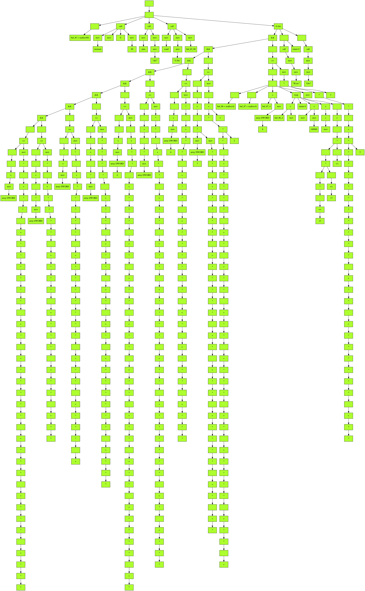

## 0CTF 2020 - Happy Tree (Reversing 407)
##### 29/06 - 01/07/2020 (48hr)
___


### Description

-

___


### Solution



Initially, prorgram builds an "execution" tree (in `.ctors` function `too_big_565554A0`).
Each tree node has 5 fields (`arg0`, `arg1`, `execution function`, `number of children` and
`a pointer to an array of all children:
```Assembly
.bss:5657C1D0 first_node_5657C1D0 dd 0                ; DATA XREF: too_big_565554A0+4DBF↑o
.bss:5657C1D0                                         ; too_big_565554A0+5F3C↑o ...
.bss:5657C1D4         dd 0
.bss:5657C1D8         dd offset sub_56570370
.bss:5657C1DC         dd 1
.bss:5657C1E0         dd offset off_56580D70
```

In main, code simply invokes the function from the first node, with the node itself being
passed as an argument:
```Assembly
.text:56570200 ; int __cdecl main_56570200(int argc, const char **argv, const char **envp)
.text:56570200 main_56570200 proc near                 ; DATA XREF: .got:off_56572FF4↓o
.text:56570200
.text:56570200 argc    = dword ptr  4
.text:56570200 argv    = dword ptr  8
.text:56570200 envp    = dword ptr  0Ch
.text:56570200
.text:56570200 ; __unwind {
.text:56570200         lea     ecx, [esp+argc]
.text:56570204         and     esp, 0FFFFFFF0h
.text:56570207         call    load_eip_56570893
.text:5657020C         add     eax, (offset got_entry_56572FC8 - $)
.text:56570211         push    dword ptr [ecx-4]
.text:56570214         push    ebp
.text:56570215         mov     ebp, esp
.text:56570217         push    ecx
.text:56570218         sub     esp, 0Ch
.text:5657021B         lea     eax, (first_node_5657C1D0 - 56572FC8h)[eax]
.text:56570221         push    0
.text:56570223         push    eax
.text:56570224         call    dword ptr [eax+8]
.text:56570227         mov     ecx, [ebp-4]
.text:5657022A         add     esp, 10h
.text:5657022D         xor     eax, eax
.text:5657022F         leave
.text:56570230         lea     esp, [ecx-4]
.text:56570233         retn
.text:56570233 ; } // starts at 56570200
```

The first node that is being invoked is `visit_children_56570370`, where it iterates
over all children and invokes their functions one by one:
```Assembly
.text:56570370 visit_children_56570370 proc near       ; DATA XREF: too_big_565554A0+5F0A↑o
.text:56570370                                         ; .bss:5657C1D8↓o
.text:56570370 ; __unwind {
.text:56570370         push    esi
.text:56570371         push    ebx
.text:56570372         sub     esp, 4
.text:56570375         mov     esi, [esp+0Ch+arg_0]
.text:56570379         mov     eax, [esi+node.nchildren_C] ; 0xC: upper bound
.text:5657037C         test    eax, eax
.text:5657037E         jz      short NO_CHILDREN_565703B0
.text:56570380         xor     ebx, ebx                ; ebx = iterator
.text:56570382         lea     esi, [esi+0]            ; nop
.text:56570388
.text:56570388 LOOP_56570388:                          ; CODE XREF: visit_children_56570370+30↓j
.text:56570388         mov     eax, [esi+node.child_ptrs_10]
.text:5657038B         sub     esp, 8
.text:5657038E         mov     eax, [eax+ebx*4]        ; get i-th child and execute it's function
.text:56570391         push    0
.text:56570393         add     ebx, 1                  ; ++i
.text:56570396         push    eax
.text:56570397         call    [eax+node.func_ptr_8]
.text:5657039A         add     esp, 10h
.text:5657039D         cmp     [esi+node.nchildren_C], ebx
.text:565703A0         ja      short LOOP_56570388
.text:565703A2         add     esp, 4
.text:565703A5         pop     ebx
.text:565703A6         pop     esi
.text:565703A7         retn
.text:565703B0
.text:565703B0 NO_CHILDREN_565703B0:                   ; CODE XREF: visit_children_56570370+E↑j
.text:565703B0         add     esp, 4
.text:565703B3         mov     eax, 0FFFFFFFFh
.text:565703B8         pop     ebx
.text:565703B9         pop     esi
.text:565703BA         retn
.text:565703BA ; } // starts at 56570370
```

In total, there are **17** different functions that can be assigned to the nodes and their
execution order is determine on the tree layout:
```
    0x56570370: 'visit children',
    0x565703C0: 'visit 1st child',
    0x565703E0: 'read symbol table',
    0x56570400: 'read symbol table',
    0x56570420: 'get 1st arg',
    0x56570430: 'visit children',
    0x56570480: 'return 0',
    0x56570490: 'loop',
    0x565704F0: 'visit 1st child',
    0x56570510: 'visit 1st child',
    0x56570530: 'return 0',
    0x56570540: 'alloc',
    0x56570570: 'make call',
    0x56570670: 'emulate instruction',
    0x56570760: 'get array index',
    0x565707E0: 'mov',
    0x56570850: 'if else'
```

Let's see at the most interesing. Function `read_symbol_tbl2_56570400` uses `arg1` 
field from the node to load a symbol from a special symbol table:
```Assembly
.text:56570400 read_symbol_tbl2_56570400 proc near     ; DATA XREF: too_big_565554A0+7E6C↑o
.text:56570400                                         ; too_big_565554A0+AAA0↑o ...
.text:56570400 ; __unwind {
.text:56570400         mov     edx, [esp+arg_0]
.text:56570404         call    load_eip_56570893
.text:56570409         add     eax, (offset got_entry_56572FC8 - $)
.text:5657040E         mov     edx, [edx+4]            ; node->arg1 (index)
.text:56570411         lea     eax, (symbol_tbl_56579A20 - 56572FC8h)[eax]
.text:56570417         mov     eax, ds:(got_entry_56572FC8 - 56572FC8h)[eax+edx*4]
.text:5657041A         retn
.text:5657056C ; } // starts at 56570540
```

Symbol table contains the following values:
```Assembly
.bss:56579A20 symbol_tbl_56579A20 dd offset unk_F7F13970 ; memset
.bss:56579A24         dd offset __isoc99_scanf
.bss:56579A28         dd offset _IO_puts
.bss:56579A2C         dd 56581780h
.bss:56579A30         dd offset aAh                   ; "Ah?"
.bss:56579A34         dd offset a36s                  ; "%36s"
.bss:56579A38         dd 0
.bss:56579A3C         dd 0
.bss:56579A40         dd offset aWow                  ; "Wow!"
.bss:56579A44         dd offset aOw                   ; "Ow!"
```


Function `alloc_56570540` allocates some memory and stores the pointer
into symbol table:
```Assembly
.text:56570540 alloc_56570540 proc near                ; DATA XREF: too_big_565554A0+7FA3↑o
.text:56570540                                         ; too_big_565554A0+A1C6↑o ...
.text:56570540 ; __unwind {
.text:56570540         push    esi
.text:56570541         push    ebx
.text:56570542         call    load_eip_56570270
.text:56570547         add     ebx, (offset got_entry_56572FC8 - $)
.text:5657054D         sub     esp, 10h
.text:56570550         mov     esi, [esp+18h+arg_0]
.text:56570554         push    dword ptr [esi]         ; node->arg0 (size)
.text:56570556         call    _malloc
.text:5657055B         lea     edx, (symbol_tbl_56579A20 - 56572FC8h)[ebx]
.text:56570561         mov     ecx, [esi+4]
.text:56570564         mov     [edx+ecx*4], eax        ; node->arg1 (index in sym_tbl)
.text:56570567         add     esp, 14h
.text:5657056A         pop     ebx
.text:5657056B         pop     esi
.text:5657056C         retn
.text:5657056C ; } // starts at 56570540
```

Function `loop_56570490` simulates a loop. It executes the 1st child to perorm
any initialization and invokes the 3rd child to check the exit condition of the loop.
Inisde the loop it repeatedly invokes the 4th and 5th children:
```Assembly
.text:56570490 loop_56570490 proc near                 ; DATA XREF: too_big_565554A0+802B↑o
.text:56570490                                         ; too_big_565554A0+A365↑o ...
.text:56570490 ; __unwind {
.text:56570490         push    ebx
.text:56570491         sub     esp, 10h
.text:56570494         mov     ebx, [esp+14h+arg_0]
.text:56570498         mov     eax, [ebx+10h]
.text:5657049B         mov     eax, [eax]
.text:5657049D         push    0
.text:5657049F         push    eax
.text:565704A0         call    dword ptr [eax+8]       ; visit 1st child (initialization)
.text:565704A3         add     esp, 10h
.text:565704A6         jmp     short END_OF_LOOP_565704D0
.text:565704A6 ; ---------------------------------------------------------------------------
.text:565704A8         align 10h
.text:565704B0
.text:565704B0 LOOP_565704B0:                          ; CODE XREF: loop_56570490+54↓j
.text:565704B0         mov     eax, [ebx+10h]
.text:565704B3         sub     esp, 8
.text:565704B6         mov     eax, [eax+10h]          ; visit 5th child
.text:565704B9         push    0
.text:565704BB         push    eax
.text:565704BC         call    dword ptr [eax+8]
.text:565704BF         mov     eax, [ebx+10h]
.text:565704C2         pop     edx
.text:565704C3         pop     ecx
.text:565704C4         mov     eax, [eax+0Ch]          ; visit 4th child
.text:565704C7         push    0
.text:565704C9         push    eax
.text:565704CA         call    dword ptr [eax+8]
.text:565704CD         add     esp, 10h
.text:565704D0
.text:565704D0 END_OF_LOOP_565704D0:                   ; CODE XREF: loop_56570490+16↑j
.text:565704D0         mov     eax, [ebx+10h]
.text:565704D3         sub     esp, 8
.text:565704D6         mov     eax, [eax+8]            ; visit 3rd child (exit condition)
.text:565704D9         push    0
.text:565704DB         push    eax
.text:565704DC         call    dword ptr [eax+8]
.text:565704DF         add     esp, 10h
.text:565704E2         test    eax, eax
.text:565704E4         jnz     short LOOP_565704B0
.text:565704E6         add     esp, 8
.text:565704E9         pop     ebx
.text:565704EA         retn
.text:565704EA ; } // starts at 56570490
.text:565704EB ; ---------------------------------------------------------------------------
.text:565704EB         nop
.text:565704EC         lea     esi, [esi+0]
.text:565704EC loop_56570490 endp ; sp-analysis failed
```


In a similar way, function `if_else_56570850` simulates an if/else condition: Based on
the return value of execution of the first child, either the second or the third child is
executed:
```Assembly
.text:56570850 if_else_56570850 proc near              ; CODE XREF: .text:56570841↑j
.text:56570850                                         ; DATA XREF: too_big_565554A0+9DF4↑o
.text:56570850 ; __unwind {
.text:56570850         push    ebx
.text:56570851         sub     esp, 10h
.text:56570854         mov     ebx, [esp+14h+arg_0]
.text:56570858         mov     eax, [ebx+10h]
.text:5657085B         mov     eax, [eax]
.text:5657085D         push    0
.text:5657085F         push    eax
.text:56570860         call    dword ptr [eax+8]       ; visit 1st child
.text:56570863         add     esp, 10h
.text:56570866         test    eax, eax                ; check child's return value
.text:56570868         mov     eax, [ebx+10h]
.text:5657086B         jnz     short IF_56570888       ; move on 2nd child
.text:5657086D         mov     eax, [eax+8]            ; move on 3rd child
.text:56570870
.text:56570870 ELSE_56570870:                          ; CODE XREF: if_else_56570850+3B↓j
.text:56570870         sub     esp, 8
.text:56570873         push    0
.text:56570875         push    eax
.text:56570876         call    dword ptr [eax+8]       ; invoke that child
.text:56570879         add     esp, 10h
.text:5657087C         add     esp, 8
.text:5657087F         pop     ebx
.text:56570880         retn
.text:56570888
.text:56570888 IF_56570888:                            ; CODE XREF: if_else_56570850+1B↑j
.text:56570888         mov     eax, [eax+4]            ; move on 2nd child
.text:5657088B         jmp     short ELSE_56570870
.text:5657088B ; } // starts at 56570850
.text:5657088B if_else_56570850 endp ; sp-analysis failed
.text:5657088B


Another interesting node function is `make_call_56570570`, where it performs a function
call. The first child determines the function to invoke and the remaining children the
arguments being passed to that function:  
```Assembly
.text:56570570 make_call_56570570 proc near            ; DATA XREF: too_big_565554A0+65AB↑o
.text:56570570                                         ; too_big_565554A0+A3EB↑o ...
.text:56570570 ; __unwind {
.text:56570570         push    ebp
.text:56570571         push    edi
.text:56570572         push    esi
.text:56570573         push    ebx
.text:56570574         call    load_eip_56570270
.text:56570579         add     ebx, (offset got_entry_56572FC8 - $)
.text:5657057F         sub     esp, 14h
.text:56570582         mov     edi, [esp+24h+arg_0]
.text:56570586         mov     eax, [edi+0Ch]          ; eax = #children
.text:56570589         lea     esi, [eax-1]
.text:5657058C         mov     eax, [edi+10h]
.text:5657058F         mov     eax, [eax]              ; eax = 1st child
.text:56570591         push    0
.text:56570593         push    eax
.text:56570594         call    dword ptr [eax+8]
.text:56570597         add     esp, 10h
.text:5657059A         cmp     esi, 1                  ; esi == number of children - 1
.text:5657059D         mov     ebp, eax                ; visit 1st child to determine function to call
.text:5657059F         jz      ESI_IS_1_56570650
.text:565705A5         jb      NO_MORE_CHILDREN_56570640 ; call func()
.text:565705AB         cmp     esi, 2
.text:565705AE         jz      short ESI_IS_2_56570600
.text:565705B0         cmp     esi, 3
.text:565705B3         jnz     short EXIT_56570630
.text:565705B5         mov     eax, [edi+10h]          ; esi == 3
.text:565705B8         sub     esp, 8
.text:565705BB         mov     eax, [eax+0Ch]          ; visit 4th child
.text:565705BE         push    0
.text:565705C0         push    eax
.text:565705C1         call    dword ptr [eax+8]
.text:565705C4         mov     ebx, eax
.text:565705C6         mov     eax, [edi+10h]
.text:565705C9         pop     edx
.text:565705CA         pop     ecx
.text:565705CB         mov     eax, [eax+8]            ; visit 3rd child
.text:565705CE         push    0
.text:565705D0         push    eax
.text:565705D1         call    dword ptr [eax+8]
.text:565705D4         mov     esi, eax
.text:565705D6         mov     eax, [edi+10h]
.text:565705D9         pop     edi
.text:565705DA         pop     edx
.text:565705DB         mov     eax, [eax+4]            ; visit 2nd child
.text:565705DE         push    0
.text:565705E0         push    eax
.text:565705E1         call    dword ptr [eax+8]
.text:565705E4         add     esp, 0Ch
.text:565705E7         push    ebx
.text:565705E8         push    esi
.text:565705E9         push    eax
.text:565705EA         call    ebp                     ; call func(rv1, rv2, rv3)
.text:565705EC         add     esp, 10h
.text:565705EF         add     esp, 0Ch
.text:565705F2         pop     ebx
.text:565705F3         pop     esi
.text:565705F4         pop     edi
.text:565705F5         pop     ebp
.text:565705F6         retn
.text:565705F6 ; ---------------------------------------------------------------------------
.text:56570600
.text:56570600 ESI_IS_2_56570600:                      ; CODE XREF: make_call_56570570+3E↑j
....
.text:56570623         call    ebp                     ; call func(rv1, rv2)
....
.text:56570640 NO_MORE_CHILDREN_56570640:              ; CODE XREF: make_call_56570570+35↑j
.text:56570640         call    eax                     ; call func()
....
.text:56570650 ESI_IS_1_56570650:                      ; CODE XREF: make_call_56570570+2F↑j
.text:56570662         call    ebp                     ; call func(rv1)
.text:5657066E ; } // starts at 56570570
```

Finally, function `emu_insn_56570670` emulates an operator:
```Assembly
.text:56570670 emu_insn_56570670 proc near             ; DATA XREF: too_big_565554A0+5C34↑o
.text:56570670                                         ; too_big_565554A0+7338↑o ...
.text:56570670 ; __unwind {
.text:56570670         push    edi
.text:56570671         push    esi
.text:56570672         push    ebx
.text:56570673         mov     esi, [esp+0Ch+arg_0]
.text:56570677         call    load_eip_56570270
.text:5657067C         add     ebx, (offset got_entry_56572FC8 - $)
.text:56570682         sub     esp, 8
.text:56570685         mov     eax, [esi+10h]
.text:56570688         mov     eax, [eax]              ; visit 1st child
.text:5657068A         push    0
.text:5657068C         push    eax
.text:5657068D         call    dword ptr [eax+8]
.text:56570690         mov     edi, eax                ; edi = return value from 1st child
.text:56570692         mov     eax, [esi+10h]
.text:56570695         pop     edx
.text:56570696         pop     ecx
.text:56570697         mov     eax, [eax+4]            ; visit 2nd child
.text:5657069A         push    0
.text:5657069C         push    eax
.text:5657069D         call    dword ptr [eax+8]
.text:565706A0         add     esp, 10h                ; eax = return value from 2ndchild
.text:565706A3         cmp     dword ptr [esi], 9      ; switch 10 cases
.text:565706A6         ja      EXIT_565706B5           ; jumptable 565706B5 default case
.text:565706AC         mov     edx, [esi]
.text:565706AE         add     ebx, ds:(jpt_565706B5 - 56572FC8h)[ebx+edx*4]
.text:565706B5         jmp     ebx                     ; switch jump
.text:565706B5 ; ---------------------------------------------------------------------------
.text:565706B7         align 10h
.text:565706C0
.text:565706C0 LESS_THAN_565706C0:                     ; CODE XREF: emu_insn_56570670+45↑j
...
.text:565706C8 RETURN_565706C8:                        ; CODE XREF: emu_insn_56570670+64↓j
...
.text:565706D0 STORE_565706D0:                         ; CODE XREF: emu_insn_56570670+45↑j
...
.text:565706E0 EQUAL_565706E0:                         ; CODE XREF: emu_insn_56570670+45↑j
...
.text:565706F0 LEFT_SHIFT_565706F0:                    ; CODE XREF: emu_insn_56570670+45↑j
...
.text:56570700 RIGHT_SHIFT_56570700:                   ; CODE XREF: emu_insn_56570670+45↑j
...
.text:56570710 XOR_56570710:                           ; CODE XREF: emu_insn_56570670+45↑j
...
.text:56570718 ADD_56570718:                           ; CODE XREF: emu_insn_56570670+45↑j
...
.text:56570720 SUB_56570720:                           ; CODE XREF: emu_insn_56570670+45↑j
...
.text:56570730 MUL_56570730:                           ; CODE XREF: emu_insn_56570670+45↑j
...
.text:56570738 LOGIC_AND_56570738:                     ; CODE XREF: emu_insn_56570670+45↑j
.text:56570738                                         ; DATA XREF: .rodata:jpt_565706B5↓o
.text:56570738         test    edi, edi                ; jumptable 565706B5 case 7
.text:5657073A         setnz   dl
.text:5657073D         test    eax, eax
.text:5657073F         setnz   al
.text:56570742         movzx   eax, al
.text:56570745         and     eax, edx
.text:56570747         jmp     RETURN_565706C8
.text:56570750
.text:56570750 EXIT_565706B5:                          ; CODE XREF: emu_insn_56570670+36↑j
.text:56570750         sub     esp, 0Ch                ; jumptable 565706B5 default case
.text:56570753         push    0                       ; status
.text:56570755         call    _exit
.text:56570755 ; } // starts at 56570670
```

Program supports **10** different operators: `==`, `<<`, `>>`, `^`, `+`, `-`, `*`, `&&`, `<`, `=`.

Once we have that, we can visualize the happy tree (I did not include edges to existing
nodes otherwise the tree becomes a spaghetti graph):


### Dumping the emulated code

To dump emulated program we use recursion: At each step, we generate the emulated code for the whole
subtree underneath each child and based on the current node (if it's a loop or a mov) we construct
a bigger code snippet. At the end we can recover the whole emulated program.

To keep things simple we use many `temp` variables to assign the results of previous nodes.

The IDA python script [happy_tree_disasm.py](./happy_tree_disasm.py) disassembles the code
from the tree. 

Below is code snippet from the emulated program (the full dissassembly listing is shown at
[happy_tree_disassembled.asm](./happy_tree_disassembled.asm):
```c
buf_#3_80 = malloc(80)
call memset(buf_#3_80, 0, 80)
call puts("Ah?")
call scanf("%36s", buf_#3_80)
buf_#6_4 = malloc(4)
buf_#7_4 = malloc(4)
*buf_#7_4 = *(int*)(int)buf_#3_80[0]  
*buf_#6_4 = 0
t_16 = *(int*)buf_#6_4  < 100000

while (t_16) {
    t_1 = *(int*)buf_#7_4  << 13
    t_2 = *(int*)buf_#7_4  ^ t_1
    t_3 = *(int*)buf_#7_4  << 13
    t_4 = *(int*)buf_#7_4  ^ t_3
    t_5 = t_4 >> 17
    t_6 = t_2 ^ t_5
    t_7 = *(int*)buf_#7_4  << 13
    t_8 = *(int*)buf_#7_4  ^ t_7
    t_9 = *(int*)buf_#7_4  << 13
    t_10 = *(int*)buf_#7_4  ^ t_9
    t_11 = t_10 >> 17
    t_12 = t_8 ^ t_11
    t_13 = t_12 << 5
    t_14 = t_6 ^ t_13
    *buf_#7_4 = t_14
    t_15 = *(int*)buf_#6_4  + 1
    *buf_#6_4 = t_15
    t_16 = *(int*)buf_#6_4  < 100000
}

t_17 = 1 * 2
t_18 = t_17 * 2
t_19 = t_18 * 2
t_20 = t_19 * 5
/* more constant assignments */
t_47 = t_46 + 1
t_48 = t_47 * 2
t_49 = *(int*)buf_#7_4 == t_48

buf_#6_4 = malloc(4)
buf_#7_4 = malloc(4)
t_50 = 1 * 2
t_51 = t_50 * 3
t_53 = t_52 * 2
/* more constant assignments */
t_83 = t_82 * 5
t_84 = *(int*)(int)buf_#3_80[1]   ^ t_83

/* repeat the same while loop */

t_572 = *(int*)buf_#7_4  == t_571
t_573 = t_527 && t_572
if (t_573) {
    call puts("Wow!")
    return 0
} else {
    call puts("Ow!")
    return 0
}
```

### Cracking the code

From the above code we can understand how the flag is being checked. We have 9 rounds.
On each round, the next **4** characters from the flag are processed. A while loop
encrypts these characters and they are checked agains a constant that is being generated
progressively. If the there is a match we move on. If not we still move on but the end
condition will be false (that way side channel attacks are prevented).

We can also infer this execution flow if we look at the layout of the tree.

We know the end constants (or at least we can calculate them), so the goal is to
move backwards and recover the flag, 4 bytes at a time.

The encryption on each loop is shown below:
```Python
    buf_1 = flag[i:i+4]
    for i in range(100000):
        a = (buf_1 ^ (buf_1 << 13)) 
        b = a ^ (a >> 17)
        buf_1 = b ^ (b << 5)

    return buf_1 
```

We can reverse this into 3 stages: First we recover `b` then `a` and then `buf_i` of the
previous round. All inversions follow the same principle: We know that `buf_1 = b ^ (b << 5)`.
That is, a value is shifted and XORed with itself. So, the 2nd number has `0s` in its **5**
LSBits. Therefore we can recover the **5** LSBits of `b` just by XORing this number with `buf_i`.

If we know the last **5** LSBits of `b`, means that **we know the last 10 LSBits of b << 5**.
Hence, we can use these **10** bits to XOR them with `buf_1` and recover the **10** LSBits of `b`.
This process continues, recovering **5** bits of `b` at a time until we crack the whole number.

We work similarly to recover `a` and `buf_i-1` and then we advance to the previous round until
we hit 0 and recover the original DWORD. The reversed algorithm is shown below:
```Python
def crack_dword(buf_i):
    for i in range(100000):
        # Recover b
        chunk = buf_i & 0x1F
        b = chunk 
        for pos in range(5, 31, 5):
            chunk = ((buf_i ^ (chunk << pos)) >> pos) & 0x1F
            b |= chunk << pos

        b &= 0xFFFFFFFF

        # Recover a
        a = b ^ (b >> 17) 

        # Recover buf_i-1
        chunk = a & 0x1FFF
        buf_i = chunk 
        for pos in range(13, 31, 13):
            chunk = ((a ^ (chunk << pos)) >> pos) & 0x1FFF
            buf_i |= chunk << pos

        buf_i &= 0xFFFFFFFF


    return buf_i
```

By doing this for each DWORD, we can recover the flag: `flag{HEY!Lumpy!!W@tcH_0ut_My_TrEe!!}`

For more details please take a look at the [happy_tree_crack.py](./happy_tree_crack.py)

___

