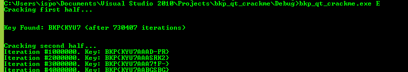
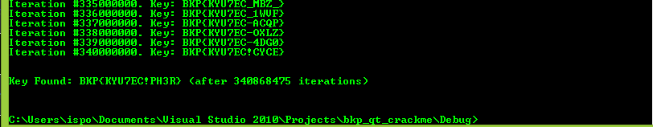

## BostonKeyParty CTF 2017 - qt crackme (Reversing 250pt)
##### 25/02 - 27/02/2017 (48hr)
___
### Description: 
-
___
### Solution

##### Part 1: Reversing

The first thing is to get rid of the fancy GUI and focus on the actual keygen algorithm. So, we start by 
dumping all strings hoping that we'll find something interesting... And we find it: "YES!". This string 
is located within function 0x00B6247F:
```assembly
.....
.text:00B625AA     call    VALIDATE_KEY_A11D50
.text:00B625AF     test    al, al
.text:00B625B1     lea     ecx, [esp+48h+var_10]
.text:00B625B5     lea     eax, [esp+48h+var_30]
.text:00B625B9     push    eax
.text:00B625BA     push    0
.text:00B625BC     push    0
.text:00B625BE     push    0
.text:00B625C0     jz      short WRONG_KEY_A125ED
.text:00B625C2     call    ds:??0QMessageLogger@@QAE@PBDH0@Z     ; QMessageLogger::QMessageLogger(char const *,int,char const *)
.text:00B625C8     mov     ecx, eax
.text:00B625CA     call    ebp ; QMessageLogger::debug(void)     ; QMessageLogger::debug(void)
.text:00B625CC     push    offset aYes                           ; "YES!"
.text:00B625D1     mov     ecx, eax
.text:00B625D3     mov     byte ptr [esp+5Ch+var_4], 3
.text:00B625D8     call    ds:??6QDebug@@QAEAAV0@PBD@Z           ; QDebug::operator<<(char const *)
.text:00B625DE     lea     ecx, [esp+58h+var_40]
.text:00B625E2     mov     byte ptr [esp+58h+var_4], 1
.text:00B625E7     call    edi ; QDebug::~QDebug(void)           ; QDebug::~QDebug(void)
.text:00B625E9     push    0
.text:00B625EB     jmp     short loc_B62616
.text:00B625ED ; ---------------------------------------------------------------------------
.text:00B625ED
.text:00B625ED WRONG_KEY_A125ED:                                 ; CODE XREF: CHECK_KEY_A12490+130j
.text:00B625ED     call    ds:??0QMessageLogger@@QAE@PBDH0@Z     ; QMessageLogger::QMessageLogger(char const *,int,char const *)
.text:00B625F3     mov     ecx, eax
.text:00B625F5     call    ebp ; QMessageLogger::debug(void)     ; QMessageLogger::debug(void)
.text:00B625F7     push    offset aNope                          ; "NOPE :("
.text:00B625FC     mov     ecx, eax
.text:00B625FE     mov     byte ptr [esp+5Ch+var_4], 4
.text:00B62603     call    ds:??6QDebug@@QAEAAV0@PBD@Z           ; QDebug::operator<<(char const *)
.text:00B62609     lea     ecx, [esp+58h+var_40]
.text:00B6260D     mov     byte ptr [esp+58h+var_4], 1
.text:00B62612     call    edi ; QDebug::~QDebug(void)           ; QDebug::~QDebug(void)
.text:00B62614     push    0FFFFFFFFh
.text:00B62616
.text:00B62616 loc_B62616:                                       ; CODE XREF: CHECK_KEY_A12490+15Bj
.....
```

Obviously our goal is to make VALIDATE_KEY_A11D50 return 1. Function uses QString instead of regular
strings, so it's a little bit tricky to find out the actual characters of the string. Let's take a look
at function VALIDATE_KEY_A11D50:

```assembly
.text:00B61D50 VALIDATE_KEY_A11D50 proc near                     ; CODE XREF: CHECK_KEY_A12490+11Ap
.text:00B61D50
.....
.text:00B61D8C     mov     eax, [esp+124h+arg_0]
.text:00B61D93     mov     [esp+124h+var_4], 0
.text:00B61D9E     cmp     dword ptr [eax+4], 10h
.text:00B61DA2     jnz     WRONG_A11E53                          ; strlen(key) must be 16
.text:00B61DA8     push    ecx
.text:00B61DA9     lea     eax, [esp+128h+arg_0]
.text:00B61DB0     mov     ecx, esp
.text:00B61DB2     push    eax
.text:00B61DB3     call    ds:??0QString@@QAE@ABV0@@Z            ; QString::QString(QString const &)
.text:00B61DB9     mov     ecx, ebx
.text:00B61DBB     call    XOR_KEY_A11EA0                        ;  B = unicode_key ^ constant_unicode_string
.text:00B61DC0     push    eax
.text:00B61DC1     lea     ecx, [esp+128h+arg_0]
.text:00B61DC8     call    ds:??4QString@@QAEAAV0@ABV0@@Z        ; QString::operator=(QString const &)
.text:00B61DCE     push    ecx
.text:00B61DCF     lea     eax, [esp+12Ch]
.text:00B61DD6     mov     ecx, esp
.text:00B61DD8     push    eax                                   ; eax = copy of B
.text:00B61DD9     call    ds:??0QString@@QAE@ABV0@@Z            ; QString::QString(QString const &)
.text:00B61DDF     mov     ecx, ebx                              ; another copy of B!
.text:00B61DE1     call    SHUFFLE_A12660
.text:00B61DE6     mov     esi, eax                              ; C = *SHUFFLE( B )
.text:00B61DE8     lea     edi, [esp+124h+C_copy_110]
.text:00B61DEC     mov     ecx, 20h
.text:00B61DF1     rep movsd                                     ; copy table to stack
.text:00B61DF3     push    80h                                   ; unsigned int
.text:00B61DF8     call    ??2@YAPAXI@Z                          ; operator new(uint)
.text:00B61DFD     add     esp, 4
.text:00B61E00     test    eax, eax
.text:00B61E02     jz      short NULL_A11E0F                     ; C = NULL
.text:00B61E04     mov     ecx, eax                              ; __fastcall
.text:00B61E06     call    INIT_A11BB0                           ; initialize a table D
.text:00B61E0B     mov     edi, eax                              ; edi = D
.text:00B61E0D     jmp     short SKIP_A11E11
.text:00B61E0F ; ---------------------------------------------------------------------------
.text:00B61E0F
.text:00B61E0F NULL_A11E0F:                                      ; CODE XREF: VALIDATE_KEY_A11D50+B2j
.text:00B61E0F     xor     edi, edi                              ; C = NULL
.text:00B61E11
.text:00B61E11 SKIP_A11E11:                                      ; CODE XREF: VALIDATE_KEY_A11D50+BDj
.text:00B61E11     push    dword ptr [ebx+8]                     ; arg4: C_prime
.text:00B61E14     lea     eax, [esp+128h+C_copy_110]
.text:00B61E18     push    eax                                   ; arg3: C
.text:00B61E19     lea     eax, [esp+12Ch+var_90]
.text:00B61E20     push    eax                                   ; arg2: const?
.text:00B61E21     call    MUL_A11A30                            ; E = MUL(C)
.text:00B61E26     mov     esi, eax
.text:00B61E28     mov     ecx, 20h
.text:00B61E2D     rep movsd                                     ; copy
.text:00B61E2F     add     esp, 0Ch
.text:00B61E32     lea     edi, [esp+124h+C_copy_110]
.text:00B61E36     mov     esi, eax
.text:00B61E38     mov     ecx, 20h
.text:00B61E3D     rep movsd                                     ; copy
.text:00B61E3F     push    dword ptr [ebx+0Ch]                   ; arg2: const_E
.text:00B61E42     lea     ecx, [esp+128h+C_copy_110]            ; arg1: E
.text:00B61E46     call    COMPARE_A11C50                        ; if E == const_E key is correct
.text:00B61E4B     test    al, al
.text:00B61E4D     jnz     short WRONG_A11E53
.text:00B61E4F     mov     bl, 1                                 ; correct!
.text:00B61E51     jmp     short loc_B61E55
.text:00B61E53 ; ---------------------------------------------------------------------------
.text:00B61E53
.text:00B61E53 WRONG_A11E53:                                     ; CODE XREF: VALIDATE_KEY_A11D50+52j
.text:00B61E53                                                   ; VALIDATE_KEY_A11D50+FDj
.text:00B61E53     xor     bl, bl
.text:00B61E55
.text:00B61E55 loc_B61E55:                                       ; CODE XREF: VALIDATE_KEY_A11D50+101j
.....
.text:00B61E95     retn    4
.text:00B61E95 VALIDATE_KEY_A11D50 endp
```

The first thing to note here is that key must be _exactly_ 16 characters. If not key is discarded.
Otherwise a number of functions are being applied in the input key. Note that key is in unicode.
XOR_KEY_A11EA0 is the first function that XORs key with a constant array. 

```assembly
.....
.text:00B61F00 LOOP_A11F00:                                      ; CODE XREF: XOR_KEY_A11EA0+A8j
.....
.text:00B61F15     call    ds:?at@QString@@QBE?BVQChar@@H@Z      ; QString::at(int)
.text:00B61F1B     mov     ecx, 0FFh                             ; get next char of the key
.text:00B61F20     cmp     [eax], cx
.text:00B61F23     jbe     short loc_B61F29                      ; al = key[i]
.text:00B61F25     xor     al, al
.text:00B61F27     jmp     short loc_B61F2B                      ; ecx = A[i]
.text:00B61F29 ; ---------------------------------------------------------------------------
.text:00B61F29
.text:00B61F29 loc_B61F29:                                       ; CODE XREF: XOR_KEY_A11EA0+83j
.text:00B61F29     mov     al, [eax]                             ; al = key[i]
.text:00B61F2B
.text:00B61F2B loc_B61F2B:                                       ; CODE XREF: XOR_KEY_A11EA0+87j
.text:00B61F2B     movzx   ecx, word ptr [ebx]                   ; ecx = A[i]
.text:00B61F2E     movsx   eax, al
.text:00B61F31     xor     ecx, eax                              ; ecx = A[i] ^ key[i]
.text:00B61F33     push    ecx
.text:00B61F34     mov     eax, esp
.text:00B61F36     push    1
.text:00B61F38     push    esi
.text:00B61F39     mov     [eax], cx
.text:00B61F3C     mov     ecx, edi
.text:00B61F3E     call    ebp ; QString::replace(int,int,QChar) ; QString::replace(int,int,QChar)
.text:00B61F40     mov     ebx, [esp+2Ch+var_14]
.text:00B61F44     inc     esi                                   ; esi = counter
.text:00B61F45     cmp     esi, 10h
.text:00B61F48     jl      short LOOP_A11F00
.....
```

Let's call this array A. This is a word array, so each element is 16bits:
```c
uint A[] = { 
	0x90DF, 0x70BC, 0xEF57, 0x5A96, 0xCFEE, 0x5509, 0x80CE, 0x0D20,
	0xE14F, 0x070E, 0xA446, 0x2FC6, 0xECF0, 0x5355, 0x782B, 0x6457 
};
```

Each character of the input is XORed with the LSB of each A[i]. The result is a new array,
called B, which is passed to the next function.
The next function is SHUFFLE_A12660. The name "shuffle" might be misleading, as at the time of naming
I wasn't sure what exactly it does. This huge function performs a series of shuffling and 
transformations to B:

```assembly
.....
.text:00B626D9     mov     [esp+144h+B_8_FC], eax                ; eax = xored key = B
.text:00B626DD     mov     [esp+144h+var_F8], 3
.text:00B626E5     call    ds:?unicode@QCharRef@@QAEAAGXZ        ; QCharRef::unicode(void)
.text:00B626EB     lea     ecx, [esp+144h+B_14_118]
.text:00B626EF     movzx   eax, word ptr [eax]                   ; eax = B[0]
.text:00B626F2     cdq
.text:00B626F3     mov     esi, eax
.text:00B626F5     mov     edi, edx
.text:00B626F7     shld    edi, esi, 10h
.text:00B626FB     shl     esi, 10h                              ; B[0] << 16
.text:00B626FE     call    ds:?unicode@QCharRef@@QAEAAGXZ        ; QCharRef::unicode(void)
.text:00B62704     lea     ecx, [esp+144h+B_10_E4]
.text:00B62708     movzx   eax, word ptr [eax]                   ; eax = B[1]
.text:00B6270B     cdq
.text:00B6270C     mov     ebx, eax
.text:00B6270E     mov     ebp, edx
.text:00B62710     or      ebx, esi                              ; ebx = (B[0] << 16) | B[1]
.text:00B62712     or      ebp, edi
.text:00B62714     shld    ebp, ebx, 10h
.text:00B62718     shl     ebx, 10h
.text:00B6271B     call    ds:?unicode@QCharRef@@QAEAAGXZ        ; QCharRef::unicode(void)
.text:00B62721     lea     ecx, [esp+144h+B_8_FC]
.text:00B62725     movzx   eax, word ptr [eax]                   ; eax = B[2]
.text:00B62728     cdq
.text:00B62729     mov     esi, eax
.text:00B6272B     mov     edi, edx
.text:00B6272D     or      esi, ebx                              ; esi = (B[1] << 16) | B[2]
.text:00B6272F     or      edi, ebp                              ; edi = B[0]
.text:00B62731     shld    edi, esi, 10h
.text:00B62735     shl     esi, 10h
.text:00B62738     call    ds:?unicode@QCharRef@@QAEAAGXZ        ; QCharRef::unicode(void)
.text:00B6273E     lea     ecx, [esp+144h+arg0_110]
.text:00B62742     movzx   eax, word ptr [eax]                   ; eax = B[3]
.text:00B62745     cdq
.text:00B62746     or      eax, esi                              ; eax = (B[2] << 16) | B[3];   (and edi = (B[0] << 16) | B[1])
.text:00B62748     mov     [esp+144h+var_10C], 8
.text:00B62750     mov     [esp+144h+var_B4], eax
.text:00B62757     or      edx, edi                              ; edx = B[0] << 16) | B[1]
.text:00B62759     lea     eax, [esp+144h+arg_0]
.text:00B62760     mov     [esp+144h+ebp_bkp_108], edx
.text:00B62764     mov     [esp+144h+arg0_110], eax
.text:00B62768     mov     [esp+144h+B_14_118], eax
.text:00B6276C     mov     [esp+144h+var_114], 9
.text:00B62774     mov     [esp+144h+B_10_E4], eax
.text:00B62778     mov     [esp+144h+var_E0], 0Ah
.text:00B62780     mov     [esp+144h+B_8_FC], eax
.text:00B62784     mov     [esp+144h+var_F8], 0Bh
.text:00B6278C     call    ds:?unicode@QCharRef@@QAEAAGXZ        ; QCharRef::unicode(void)
.text:00B62792     lea     ecx, [esp+144h+B_14_118]
.text:00B62796     movzx   eax, word ptr [eax]                   ; eax = B[8]
.text:00B62799     cdq
.text:00B6279A     mov     esi, eax
.text:00B6279C     mov     edi, edx
.text:00B6279E     shld    edi, esi, 10h
.text:00B627A2     shl     esi, 10h
.text:00B627A5     call    ds:?unicode@QCharRef@@QAEAAGXZ        ; QCharRef::unicode(void)
.text:00B627AB     lea     ecx, [esp+144h+B_10_E4]
.text:00B627AF     movzx   eax, word ptr [eax]
.text:00B627B2     cdq
.text:00B627B3     mov     ebx, eax
.text:00B627B5     mov     ebp, edx
.text:00B627B7     or      ebx, esi
.text:00B627B9     or      ebp, edi
.text:00B627BB     shld    ebp, ebx, 10h
.text:00B627BF     shl     ebx, 10h
.text:00B627C2     call    ds:?unicode@QCharRef@@QAEAAGXZ        ; QCharRef::unicode(void)
.text:00B627C8     movzx   eax, word ptr [eax]
.text:00B627CB     cdq
.text:00B627CC     mov     esi, eax
.text:00B627CE     mov     edi, edx
.text:00B627D0     or      esi, ebx
.text:00B627D2     or      edi, ebp
.text:00B627D4     lea     ecx, [esp+144h+B_8_FC]
.text:00B627D8     shld    edi, esi, 10h
.text:00B627DC     shl     esi, 10h
.text:00B627DF     call    ds:?unicode@QCharRef@@QAEAAGXZ        ; QCharRef::unicode(void)
.text:00B627E5     lea     ecx, [esp+144h+arg0_110]
.text:00B627E9     mov     dword ptr [esp+144h+var_F4+4], 6
.text:00B627F1     mov     [esp+144h+var_D8], 7
.text:00B627F9     movzx   eax, word ptr [eax]
.text:00B627FC     cdq
.text:00B627FD     or      eax, esi                              ; eax = (B[10] << 16) | B[11];   (and edi = (B[8] << 16) | B[9])
.text:00B627FF     mov     [esp+144h+var_10C], 4
.text:00B62807     mov     [esp+144h+B_10_E4], eax
.text:00B6280B     or      edx, edi
.text:00B6280D     lea     eax, [esp+144h+arg_0]
.text:00B62814     mov     [esp+144h+B_8_FC], edx
.text:00B62818     mov     [esp+144h+arg0_110], eax
.text:00B6281C     mov     [esp+144h+B_14_118], eax
.text:00B62820     mov     [esp+144h+var_114], 5
.text:00B62828     mov     dword ptr [esp+144h+var_F4], eax
.text:00B6282C     mov     [esp+144h+B_4_DC], eax
.text:00B62830     call    ds:?unicode@QCharRef@@QAEAAGXZ        ; QCharRef::unicode(void)
.text:00B62836     lea     ecx, [esp+144h+B_14_118]
.text:00B6283A     movzx   eax, word ptr [eax]
.text:00B6283D     cdq
.text:00B6283E     mov     esi, eax
.text:00B62840     mov     edi, edx
.text:00B62842     shld    edi, esi, 10h
.text:00B62846     shl     esi, 10h
.text:00B62849     call    ds:?unicode@QCharRef@@QAEAAGXZ        ; QCharRef::unicode(void)
.text:00B6284F     lea     ecx, [esp+144h+var_F4]
.text:00B62853     movzx   eax, word ptr [eax]
.text:00B62856     cdq
.text:00B62857     mov     ebx, eax
.text:00B62859     mov     ebp, edx
.text:00B6285B     or      ebx, esi
.text:00B6285D     or      ebp, edi
.text:00B6285F     shld    ebp, ebx, 10h
.text:00B62863     shl     ebx, 10h
.text:00B62866     call    ds:?unicode@QCharRef@@QAEAAGXZ        ; QCharRef::unicode(void)
.text:00B6286C     lea     ecx, [esp+144h+B_4_DC]
.text:00B62870     movzx   eax, word ptr [eax]
.text:00B62873     cdq
.text:00B62874     mov     esi, eax
.text:00B62876     mov     edi, edx
.text:00B62878     or      esi, ebx
.text:00B6287A     or      edi, ebp
.text:00B6287C     shld    edi, esi, 10h
.text:00B62880     shl     esi, 10h
.text:00B62883     call    ds:?unicode@QCharRef@@QAEAAGXZ        ; QCharRef::unicode(void)
.text:00B62889     lea     ecx, [esp+144h+var_A0]
.text:00B62890     mov     [esp+144h+var_9C], 0Ch
.text:00B6289B     mov     [esp+144h+var_A4], 0Dh
.text:00B628A6     mov     [esp+144h+var_94], 0Eh
.text:00B628B1     movzx   eax, word ptr [eax]
.text:00B628B4     cdq
.text:00B628B5     or      eax, esi                              ; eax = (B[6] << 16) | B[7];   (and edi = (B[4] << 16) | B[5])
.text:00B628B7     mov     [esp+144h+var_AC], 0Fh
.text:00B628C2     mov     dword ptr [esp+144h+var_F4], eax
.text:00B628C6     or      edx, edi
.text:00B628C8     lea     eax, [esp+144h+arg_0]
.text:00B628CF     mov     [esp+144h+B_4_DC], edx
.text:00B628D3     mov     [esp+144h+var_A0], eax
.text:00B628DA     mov     [esp+144h+var_A8], eax
.text:00B628E1     mov     [esp+144h+var_98], eax
.text:00B628E8     mov     [esp+144h+var_B0], eax
.text:00B628EF     call    ds:?unicode@QCharRef@@QAEAAGXZ        ; QCharRef::unicode(void)
.text:00B628F5     lea     ecx, [esp+144h+var_A8]
.text:00B628FC     movzx   eax, word ptr [eax]
.text:00B628FF     cdq
.text:00B62900     mov     esi, eax
.text:00B62902     mov     edi, edx
.text:00B62904     shld    edi, esi, 10h
.text:00B62908     shl     esi, 10h
.text:00B6290B     call    ds:?unicode@QCharRef@@QAEAAGXZ        ; QCharRef::unicode(void)
.text:00B62911     movzx   eax, word ptr [eax]
.text:00B62914     cdq
.text:00B62915     mov     ebx, eax
.text:00B62917     mov     ebp, edx
.text:00B62919     or      ebx, esi
.text:00B6291B     or      ebp, edi
.text:00B6291D     shld    ebp, ebx, 10h
.text:00B62921     lea     ecx, [esp+144h+var_98]
.text:00B62928     shl     ebx, 10h
.text:00B6292B     call    ds:?unicode@QCharRef@@QAEAAGXZ        ; QCharRef::unicode(void)
.text:00B62931     lea     ecx, [esp+144h+var_B0]
.text:00B62938     movzx   eax, word ptr [eax]
.text:00B6293B     cdq
.text:00B6293C     mov     esi, eax
.text:00B6293E     mov     edi, edx
.text:00B62940     or      esi, ebx
.text:00B62942     or      edi, ebp
.text:00B62944     shld    edi, esi, 10h
.text:00B62948     shl     esi, 10h
.text:00B6294B     call    ds:?unicode@QCharRef@@QAEAAGXZ        ; QCharRef::unicode(void)
.text:00B62951     mov     ebp, [esp+144h+ebp_bkp_108]
.text:00B62955     xorps   xmm0, xmm0
.text:00B62958     mov     ebx, dword ptr [esp+144h+var_F4]
.text:00B6295C     movlpd  [esp+144h+counter_120], xmm0
.text:00B62962     movzx   eax, word ptr [eax]
.text:00B62965     cdq
.text:00B62966     or      eax, esi                              ; eax = (B[14] << 16) | B[15];   (and edi = (B[13] << 16) | B[12])
.text:00B62968     mov     ecx, edx
.text:00B6296A     mov     esi, [esp+144h+B_4_DC]                ; esi = B[4:5]
.text:00B6296E     or      ecx, edi
.text:00B62970     mov     [esp+144h+B_14_118], eax
.text:00B62974     mov     eax, [esp+144h+v_124]
.text:00B62978     mov     [esp+144h+v_104], ecx
.text:00B6297C     mov     ecx, [eax+1Ch]                        ; internal variables
.text:00B6297F     mov     edx, [eax+18h]
.text:00B62982     mov     [esp+144h+v_100], ecx
.text:00B62986     mov     [esp+144h+v_E8], ecx                  ; v_E8 = 0x16D856AF
.text:00B6298A     mov     ecx, [eax+20h]
.text:00B6298D     mov     edi, ecx
.text:00B6298F     mov     eax, [eax+24h]
.text:00B62992     mov     [esp+144h+v_124], eax
.text:00B62996     mov     [esp+144h+v_EC], eax                  ; v_EC = 0xD8E8367C
.text:00B6299A     mov     eax, dword ptr [esp+144h+counter_120+4]
.text:00B6299E     mov     [esp+144h+counter_2_130], eax         ; v_130 = 0
.text:00B629A2     mov     eax, dword ptr [esp+144h+counter_120]
.text:00B629A6     mov     [esp+144h+v_12C], edx
.text:00B629AA     mov     [esp+144h+v_128], edx                 ; v_128 = 0x880F0E3A
.text:00B629AE     mov     edx, [esp+144h+var_B4]
.text:00B629B5     mov     [esp+144h+arg0_110], ecx
.text:00B629B9     mov     dword ptr [esp+144h+counter_120], eax
.text:00B629BD     lea     ecx, [ecx+0]
.text:00B629C0 ----------------------------------------------------------------
.text:00B629C0 ebx = (B[6] << 16) + B[7] = __b
.text:00B629C0 edx = (B[2] << 16) + B[3] = __d
.text:00B629C0 esi = (B[4] << 16) + B[5] = __s
.text:00B629C0 edi = _x = 0x058ff310
.text:00B629C0 ebp = (B[0] << 16) + B[1] = __p
.text:00B629C0 ----------------------------------------------------------------
.text:00B629C0
.text:00B629C0
.text:00B629C0 LOOP_1_A129C0:                                    ; CODE XREF: SHUFFLE_A12660+409j
.text:00B629C0     xor     eax, eax                              ; eax = 0
.text:00B629C2     mov     ecx, edx                              ; ecx = __d
.text:00B629C4     shrd    edx, ebp, 8                           ; edx = ((__p & 0xff) << 24) | (__d >> 8)
.text:00B629C8     shl     ecx, 18h                              ; ecx = __d << 24
.text:00B629CB     shr     ebp, 8                                ; ebp = __p >> 8
.text:00B629CE     or      edx, eax                              ; eax is 0
.text:00B629D0     or      ebp, ecx                              ; ebp = (__p >> 8) | (__d << 24)
.text:00B629D2     add     edx, ebx                              ; edx = (((__p & 0xff) << 24) | (__d >> 8)) + __b = _y
.text:00B629D4     mov     ecx, esi                              ; ecx = __s
.text:00B629D6     adc     ebp, esi                              ; ebp = ((__d << 24) | (__p >> 8)) + __s (with carry) = _z
.text:00B629D8     shr     ecx, 1Dh                              ; ecx = __s >> 29
.text:00B629DB     xor     ebp, [esp+144h+v_EC]                  ; ebp = _z ^ v_EC
.text:00B629DF     xor     edx, edi                              ; edx = _x ^ _y
.text:00B629E1     shld    esi, ebx, 3                           ; esi = (__s << 3) | (__b >> 29)
.text:00B629E5     mov     [esp+144h+ebp_bkp_108], ebp           ; v_108 = _z ^ v_EC
.text:00B629E9     or      esi, eax
.text:00B629EB     mov     [esp+144h+c1_7_C8], ebp               ; ==>   C1[7:8] = _z ^ v_EC
.text:00B629EF     xor     esi, ebp                              ; esi = ((__s << 3) | (__b >> 29)) ^ _z ^ v_EC
.text:00B629F1     shl     ebx, 3                                ; ebx = __b << 3
.text:00B629F4     mov     ebp, [esp+144h+v_E8]                  ; ebp = v_E8
.text:00B629F8     or      ebx, ecx                              ; ebx = (__b << 3) | (__s >> 29)
.text:00B629FA     mov     ecx, [esp+144h+v_128]                 ; ecx = v_128
.text:00B629FE     xor     ebx, edx                              ; ebx = ( (__b << 3) | (__s >> 29)) ^ _x  ^ _y
.text:00B62A00     shrd    [esp+144h+v_128], ebp, 8              ; v_128_2 = (v_E8 << 24) | (v_128 >> 8)
.text:00B62A06     or      eax, [esp+144h+v_128]                 ; eax = v_128_2
.text:00B62A0A     shl     ecx, 18h                              ; ecx = v_128 << 24
.text:00B62A0D     shr     ebp, 8                                ; ebp = v_E8 >> 8
.text:00B62A10     or      ecx, ebp                              ; ecx = (v_128 << 24) | (v_E8 >> 8)
.text:00B62A12     mov     [esp+144h+c1_4_5_CC], edx             ; ==>   C1[4:5] = _x ^ _y
.text:00B62A16     mov     ebp, [esp+144h+v_EC]                  ; ebp = v_EC
.text:00B62A1A     add     eax, edi                              ; eax = v_128_2 + _x
.text:00B62A1C     mov     [esp+144h+c1_2_3_D0], esi             ; ==>   C1[2:3] = ((__s << 3) | (__b >> 29)) ^ _z ^ v_EC
.text:00B62A20     adc     ecx, ebp                              ; ecx = ((v_128 << 24) | (v_E8 >> 8)) + v_EC (with carry) = _w
.text:00B62A22     xor     eax, dword ptr [esp+144h+counter_120] ; eax = (v_128_2 + _x) ^ counter
.text:00B62A26     xor     ecx, [esp+144h+counter_2_130]         ; ecx = _w ^ v_130 = _w
.text:00B62A2A     mov     [esp+144h+v_128], eax                 ; v_128 = (v_128_2 + _x) ^ counter
.text:00B62A2E     xor     eax, eax
.text:00B62A30     mov     [esp+144h+v_E8], ecx                  ; v_E8 = _w ^ v_130 = _w
.text:00B62A34     mov     ecx, ebp
.text:00B62A36     shld    ebp, edi, 3                           ; ebp = (v_EC << 3) | (_x >> 29)
.text:00B62A3A     shr     ecx, 1Dh                              ; ecx = v_EC >> 29
.text:00B62A3D     or      eax, ebp                              ; eax = (v_EC << 3) | (_x >> 29)
.text:00B62A3F     shl     edi, 3                                ; edi = _x << 3
.text:00B62A42     xor     eax, [esp+144h+v_E8]                  ; eax = ((v_EC << 3) | (_x >> 29)) ^ v_E8
.text:00B62A46     or      edi, ecx                              ; edi = (_x << 3) | (v_EC >> 29)
.text:00B62A48     xor     edi, [esp+144h+v_128]                 ; edi = ((_x << 3) | (v_EC >> 29)) ^ v_128 = _x
.text:00B62A4C     mov     ebp, [esp+144h+ebp_bkp_108]           ; ebp = v_108 = _z ^ v_EC
.text:00B62A50     mov     [esp+144h+v_EC], eax                  ; v_EC = ((v_EC << 3) | (_x >> 29)) ^ v_E8
.text:00B62A54     mov     eax, dword ptr [esp+144h+counter_120] ; counter
.text:00B62A58     add     eax, 1                                ; counter++
.text:00B62A5B     mov     dword ptr [esp+144h+counter_120], eax
.text:00B62A5F     adc     [esp+144h+counter_2_130], 0           ; v_130 += 0 (with carry)   => no carry => counter never overflows
.text:00B62A64     jnz     short LOOP_1_END_A12A6F               ; edi = (B[14] << 16) | B[15]
.text:00B62A66     cmp     eax, 20h                              ; if counter < 32 loop
.text:00B62A69     jb      LOOP_1_A129C0                         ; eax = 0
.text:00B62A6F ----------------------------------------------------------------
.text:00B62A6F __b = ( (__b << 3) | (__s >> 29)) ^ _x  ^ _y;
.text:00B62A6F __d = C1[4];
.text:00B62A6F __s = C1[2];
.text:00B62A6F __p = v_108;
.text:00B62A6F _x  = ((_x << 3) | (v_EC >> 29)) ^ v_128
.text:00B62A6F ----------------------------------------------------------------
.text:00B62A6F
.text:00B62A6F
.text:00B62A6F LOOP_1_END_A12A6F:                                ; CODE XREF: SHUFFLE_A12660+404j
.text:00B62A6F     mov     edi, [esp+144h+B_14_118]              ; edi = (B[14] << 16) | B[15]
.text:00B62A73     xorps   xmm0, xmm0
.text:00B62A76     mov     edx, [esp+144h+v_104]                 ; edx = B[12:13]
.text:00B62A7A     mov     ebp, [esp+144h+arg0_110]
.text:00B62A7E     movlpd  [esp+144h+var_F4], xmm0
.text:00B62A84     mov     eax, dword ptr [esp+144h+var_F4+4]
.text:00B62A88     mov     dword ptr [esp+144h+counter_120], eax ; counter = 0
.text:00B62A8C     mov     eax, dword ptr [esp+144h+var_F4]
.text:00B62A90     mov     [esp+144h+var_D4], ebx                ; ==>   C1[0:1] = _b
.text:00B62A94     mov     ebx, [esp+144h+B_8_FC]
.text:00B62A98     mov     [esp+144h+B_4_DC], esi
.text:00B62A9C     mov     esi, [esp+144h+B_10_E4]
.text:00B62AA0     mov     [esp+144h+counter_2_130], eax
.text:00B62AA4
.text:00B62AA4 LOOP_2_A12AA4:                                    ; CODE XREF: SHUFFLE_A12660+4F6j
.text:00B62AA4     xor     eax, eax
.text:00B62AA6     mov     ecx, esi                              ; ecx = __s
.text:00B62AA8     shl     ecx, 18h                              ; ecx = __s << 24
.text:00B62AAB     shrd    esi, ebx, 8                           ; esi = (__b << 24) | (__s >> 8)
.text:00B62AAF     or      esi, eax
.text:00B62AB1     shr     ebx, 8
.text:00B62AB4     or      ebx, ecx                              ; ebx = (__s << 24) | (__b >> 8)
.text:00B62AB6     add     esi, edi                              ; esi = ((__b << 24) | (__s >> 8)) + _x
.text:00B62AB8     mov     ecx, edx                              ; ecx = __d
.text:00B62ABA     adc     ebx, edx                              ; ebx = ((__s << 24) | (__b >> 8)) + __d + carry = _y
.text:00B62ABC     shr     ecx, 1Dh                              ; ecx = __d >> 29
.text:00B62ABF     xor     ebx, [esp+144h+v_124]                 ; ebx = _y ^ v_124 = __b
.text:00B62AC3     xor     esi, ebp                              ; esi = (((__b << 24) | (__s >> 8)) + _x) ^ __p = __s
.text:00B62AC5     shld    edx, edi, 3                           ; edx = (__d << 3) | (_x >> 29)
.text:00B62AC9     mov     [esp+144h+c1_12_BC], esi              ; ==>   C1[12:13] = (((__b << 24) | (__s >> 8)) + _x) ^ __p
.text:00B62AD0     or      edx, eax
.text:00B62AD2     shl     edi, 3                                ; edi = _x << 3
.text:00B62AD5     xor     edx, ebx                              ; edx = ((__d << 3) | (_x >> 29)) ^ _y ^ v_124
.text:00B62AD7     mov     [esp+144h+c1_14_B8], ebx              ; ==>   C1[14:15] = _y ^ v_124
.text:00B62ADE     or      edi, ecx                              ; edi = (_x << 3) | (__d >> 29)
.text:00B62AE0     mov     [esp+144h+v_104], edx                 ; v_104 = ((_x << 3) | (__p >> 29)) ^ _y ^ v_124
.text:00B62AE4     mov     ecx, [esp+144h+v_12C]                 ; ecx = v_12C
.text:00B62AE8     xor     edi, esi                              ; edi = ((_x << 3) | (__d >> 29)) ^ C1[12:13] = _x
.text:00B62AEA     mov     [esp+144h+v_C0], edx                  ; ==>    C1[10:11] = ((_x << 3) | (__p >> 29)) ^ _y ^ v_124
.text:00B62AF1     mov     edx, [esp+144h+v_100]                 ; edx = v_100
.text:00B62AF5     shrd    [esp+144h+v_12C], edx, 8              ; v_12c_2 = (v_100 << 24) | (v_12c >> 8)
.text:00B62AFB     or      eax, [esp+144h+v_12C]                 ; eax = v_12C_2
.text:00B62AFF     shl     ecx, 18h
.text:00B62B02     shr     edx, 8
.text:00B62B05     or      ecx, edx                              ; ecx = (v_12C << 24) | (v_100 >> 8)
.text:00B62B07     mov     edx, [esp+144h+v_124]                 ; edx = v_124
.text:00B62B0B     add     eax, ebp                              ; eax = v_12C_2 + __p
.text:00B62B0D     adc     ecx, edx                              ; ecx = ((v_12C << 24) | (v_100 >> 8)) + v_124 + carry = _z
.text:00B62B0F     xor     eax, [esp+144h+counter_2_130]         ; eax = (v_12C_2 + __p) ^ counter = _w
.text:00B62B13     xor     ecx, dword ptr [esp+144h+counter_120] ; ecx = _z
.text:00B62B17     mov     [esp+144h+v_12C], eax                 ; v_12C = (v_12C_2 + __p) ^ counter
.text:00B62B1B     xor     eax, eax
.text:00B62B1D     mov     [esp+144h+v_100], ecx                 ; v_100 = _z ^ counter = _z
.text:00B62B21     mov     ecx, edx                              ; ecx = v_124
.text:00B62B23     shld    edx, ebp, 3                           ; edx = (v_124 << 3) | (__p >> 29)
.text:00B62B27     shr     ecx, 1Dh                              ; ecx = v_124 >> 29
.text:00B62B2A     or      eax, edx                              ; eax = (v_124 << 3) | (__p >> 29)
.text:00B62B2C     shl     ebp, 3                                ; ebp = __p << 3
.text:00B62B2F     xor     eax, [esp+144h+v_100]                 ; eax = ((v_124 << 3) | (__p >> 29)) ^ v_100
.text:00B62B33     or      ebp, ecx                              ; ebp = (__p << 3) | (v_124 >> 29)
.text:00B62B35     xor     ebp, [esp+144h+v_12C]                 ; ebp = ((__p << 3) | (v_124 >> 29)) ^ v_12C
.text:00B62B39     mov     edx, [esp+144h+v_104]                 ; edx = v_104
.text:00B62B3D     mov     [esp+144h+v_124], eax                 ; v_124 = ((v_124 << 3) | (__p >> 29)) ^ v_100
.text:00B62B41     mov     eax, [esp+144h+counter_2_130]         ; counter++
.text:00B62B45     add     eax, 1
.text:00B62B48     mov     [esp+144h+counter_2_130], eax
.text:00B62B4C     adc     dword ptr [esp+144h+counter_120], 0   ; always zero
.text:00B62B51     jnz     short LOOP_2_END_A12B5C
.text:00B62B53     cmp     eax, 20h
.text:00B62B56     jb      LOOP_2_A12AA4
.text:00B62B5C
.text:00B62B5C LOOP_2_END_A12B5C:                                ; CODE XREF: SHUFFLE_A12660+4F1j
.text:00B62B5C     movzx   eax, word ptr [esp+144h+c1_7_C8+2]    ; permute C1 and extend it to qword
.text:00B62B61     cdq
.text:00B62B62     mov     dword ptr [esp+144h+var_90], eax      ; C2[0] = C1[7]
.text:00B62B69     movzx   eax, word ptr [esp+144h+c1_2_3_D0+2]
.text:00B62B6E     mov     ecx, [esp+144h+v_104]
.text:00B62B72     mov     ebp, [esp+144h+ebp_bkp_108]
.text:00B62B76     mov     dword ptr [esp+144h+var_90+4], edx    ; zero out high bytes
.text:00B62B7D     cdq
.text:00B62B7E     mov     dword ptr [esp+144h+var_88], eax      ; C2[1] = C1[3]
.text:00B62B85     mov     eax, ebx
.text:00B62B87     shr     eax, 10h
.text:00B62B8A     mov     dword ptr [esp+144h+var_88+4], edx
.text:00B62B91     cdq
.text:00B62B92     mov     dword ptr [esp+144h+var_80], eax      ; C2[2] = C1[15]
.text:00B62B99     mov     eax, ecx
.text:00B62B9B     shr     eax, 10h
.text:00B62B9E     mov     dword ptr [esp+144h+var_80+4], edx
.text:00B62BA5     cdq
.text:00B62BA6     mov     dword ptr [esp+144h+var_78], eax      ; C2[3] = C1[11]
.text:00B62BAD     mov     dword ptr [esp+144h+var_78+4], edx
.text:00B62BB4     movzx   eax, bp
.text:00B62BB7     cdq
.text:00B62BB8     mov     dword ptr [esp+144h+var_70], eax      ; C2[4] = C1[6]
.text:00B62BBF     mov     dword ptr [esp+144h+var_70+4], edx
.text:00B62BC6     mov     edx, [esp+144h+B_4_DC]
.text:00B62BCA     movzx   eax, dx
.text:00B62BCD     cdq
.text:00B62BCE     mov     dword ptr [esp+144h+var_68], eax      ; C2[5] = C1[2]
.text:00B62BD5     movzx   eax, word ptr [esp+144h+c1_14_B8]
.text:00B62BDD     mov     dword ptr [esp+144h+var_68+4], edx
.text:00B62BE4     cdq
.text:00B62BE5     mov     dword ptr [esp+144h+var_60], eax      ; C2[6] = C1[14]
.text:00B62BEC     movzx   eax, word ptr [esp+144h+v_C0]
.text:00B62BF4     mov     dword ptr [esp+144h+var_60+4], edx
.text:00B62BFB     cdq
.text:00B62BFC     mov     dword ptr [esp+144h+var_58], eax      ; C2[7] = C1[10]
.text:00B62C03     movzx   eax, word ptr [esp+144h+c1_4_5_CC+2]
.text:00B62C08     mov     dword ptr [esp+144h+var_58+4], edx
.text:00B62C0F     cdq
.text:00B62C10     mov     dword ptr [esp+144h+var_50], eax      ; C2[8] = C1[5]
.text:00B62C17     movzx   eax, word ptr [esp+144h+var_D4+2]
.text:00B62C1C     mov     dword ptr [esp+144h+var_50+4], edx
.text:00B62C23     cdq
.text:00B62C24     mov     dword ptr [esp+144h+var_48], eax      ; C2[9] = C1[1]
.text:00B62C2B     shrd    esi, ebx, 10h
.text:00B62C2F     mov     dword ptr [esp+144h+var_48+4], edx
.text:00B62C36     mov     [esp+144h+var_C4], edi                ; ==>   C1[8:9] = _x
.text:00B62C3D     movzx   eax, si
.text:00B62C40     cdq
.text:00B62C41     mov     dword ptr [esp+144h+var_40], eax      ; C2[10] = C1[13]
.text:00B62C48     shrd    edi, ecx, 10h
.text:00B62C4C     mov     dword ptr [esp+144h+var_40+4], edx
.text:00B62C53     movzx   eax, di
.text:00B62C56     cdq
.text:00B62C57     mov     dword ptr [esp+144h+var_38], eax      ; C2[11] = C1[9]
.text:00B62C5E     movzx   eax, word ptr [esp+144h+c1_4_5_CC]
.text:00B62C63     mov     [esp+144h+var_30], eax                ; C2[12] = C1[4]
.text:00B62C6A     movzx   eax, word ptr [esp+144h+var_D4]
.text:00B62C6F     mov     [esp+144h+var_28], eax                ; C2[13] = C1[0]
.text:00B62C76     movzx   eax, word ptr [esp+144h+c1_12_BC]
.text:00B62C7E     mov     [esp+144h+var_20], eax                ; C2[14] = C1[12]
.text:00B62C85     movzx   eax, word ptr [esp+144h+var_C4]
.text:00B62C8D     shr     ecx, 10h
.text:00B62C90     push    80h                                   ; unsigned int
.text:00B62C95     shr     ebx, 10h
.text:00B62C98     mov     dword ptr [esp+148h+var_38+4], edx
.text:00B62C9F     mov     [esp+148h+var_2C], 0
.text:00B62CAA     mov     [esp+148h+var_24], 0
.text:00B62CB5     mov     [esp+148h+var_1C], 0
.text:00B62CC0     mov     [esp+148h+var_18], eax                ; C2[15] = C1[8]
.text:00B62CC7     mov     [esp+148h+var_14], 0
.text:00B62CD2     call    ??2@YAPAXI@Z                          ; operator new(uint)
.text:00B62CD7     mov     esi, eax
.text:00B62CD9     add     esp, 4
.text:00B62CDC     test    esi, esi
.text:00B62CDE     jz      short NULL_A12D4B
.text:00B62CE0     xor     edx, edx
.text:00B62CE2     lea     eax, [esi+10h]
.text:00B62CE5     jmp     short PERMUTE_TABLE_A12CF0
.text:00B62CE5 ; ---------------------------------------------------------------------------
.text:00B62CE7     align 10h
.text:00B62CF0
.text:00B62CF0 PERMUTE_TABLE_A12CF0:                             ; CODE XREF: SHUFFLE_A12660+685j
.text:00B62CF0                                                   ; SHUFFLE_A12660+6E7j
.text:00B62CF0     mov     ecx, dword ptr [esp+edx*8+144h+var_90]
.text:00B62CF7     lea     eax, [eax+20h]
.text:00B62CFA     mov     [eax-30h], ecx                        ; C[i*4+0] = C2[i+0]
.text:00B62CFD     mov     ecx, dword ptr [esp+edx*8+144h+var_90+4]
.text:00B62D04     mov     [eax-2Ch], ecx
.text:00B62D07     mov     ecx, dword ptr [esp+edx*8+144h+var_70]
.text:00B62D0E     mov     [eax-28h], ecx                        ; C[i*4+1] = C2[i+4]
.text:00B62D11     mov     ecx, dword ptr [esp+edx*8+144h+var_70+4]
.text:00B62D18     mov     [eax-24h], ecx
.text:00B62D1B     mov     ecx, dword ptr [esp+edx*8+144h+var_50]
.text:00B62D22     mov     [eax-20h], ecx                        ; C[i*4+2] = C2[i+8]
.text:00B62D25     mov     ecx, dword ptr [esp+edx*8+144h+var_50+4]
.text:00B62D2C     mov     [eax-1Ch], ecx
.text:00B62D2F     mov     ecx, [esp+edx*8+144h+var_30]
.text:00B62D36     mov     [eax-18h], ecx                        ; C[i*4+3] = C2[i+12]
.text:00B62D39     mov     ecx, [esp+edx*8+144h+var_2C]
.text:00B62D40     inc     edx
.text:00B62D41     mov     [eax-14h], ecx
.text:00B62D44     cmp     edx, 4
.text:00B62D47     jl      short PERMUTE_TABLE_A12CF0
.text:00B62D49     jmp     short loc_B62D4D
.text:00B62D4B ; ---------------------------------------------------------------------------
.text:00B62D4B
.text:00B62D4B NULL_A12D4B:                                      ; CODE XREF: SHUFFLE_A12660+67Ej
.text:00B62D4B     xor     esi, esi
.text:00B62D4D
.text:00B62D4D loc_B62D4D:                                       ; CODE XREF: SHUFFLE_A12660+6E9j
.text:00B62D4D     lea     ecx, [esp+144h+arg_0]
.text:00B62D54     mov     [esp+144h+var_4], 0FFFFFFFFh
.text:00B62D5F     call    ds:??1QString@@QAE@XZ                 ; QString::~QString(void)
.text:00B62D65     mov     eax, esi
.text:00B62D67     mov     ecx, [esp+144h+var_C]
.text:00B62D6E     mov     large fs:0, ecx
.text:00B62D75     pop     ecx
.text:00B62D76     pop     edi
.text:00B62D77     pop     esi
.text:00B62D78     pop     ebp
.text:00B62D79     pop     ebx
.text:00B62D7A     mov     ecx, [esp+130h+var_10]
.text:00B62D81     xor     ecx, esp
.text:00B62D83     call    @__security_check_cookie@4            ; __security_check_cookie(x)
.text:00B62D88     add     esp, 130h
.text:00B62D8E     retn    4
.text:00B62D8E SHUFFLE_A12660 endp
.text:00B62D8E
.text:00B62D8E ; ---------------------------------------------------------------------------
```

The above code with my comments may not make sense, but the decompiled code might be better:
```c
	// PHASE 1: use the first 8 characters from input	
	__b = (B[6] << 16) + B[7];						// set registers
	__d = (B[2] << 16) + B[3];
	__s = (B[4] << 16) + B[5];
	__p = (B[0] << 16) + B[1];

	_x    = 0x058ff310;								// set variables
	v_E8  = 0x16D856AF;
	v_EC  = 0xD8E8367C;
	v_128 = 0x880F0E3A;

	for( i=0; i<32; i++ )							// fill up first half of array C1
	{
		_y = ((__p << 24) | (__d >> 8)) + __b;
		
		carry = (uint64)((__p << 24) | (__d >> 8)) + __b;
		_z = ((__d << 24) | (__p >> 8)) + __s + (carry & 0x100000000 ? 1 : 0);

		v_108 = _z ^ v_EC;		
		v_128_2 = (v_E8 << 24) | (v_128 >> 8);

		C1[2] = ((__s << 3) | (__b >> 29)) ^ _z ^ v_EC;
		C1[4] = _x ^ _y;
		C1[6] = _z ^ v_EC;

		carry = (uint64)v_128_2 + _x;
		_w = ((v_128 << 24) | (v_E8 >> 8)) + v_EC + (carry & 0x100000000 ? 1 : 0);

		v_128 = (v_128_2 + _x) ^ i;
		v_E8 = _w;
		
		__b = ( (__b << 3) | (__s >> 29)) ^ _x  ^ _y;
		__d = C1[4];
		__s = C1[2];
		__p = v_108;
		_x2 = ((_x << 3) | (v_EC >> 29)) ^ v_128;
	
		v_EC = ((v_EC << 3) | (_x >> 29)) ^ v_E8;
		_x = _x2;
	}

	C1[0] = __b;
	
	// PHASE 2: use the rest of the characters from input	
	__b = (B[8]  << 16) + B[9];						// set registers
	__d = (B[12] << 16) + B[13];
	__s = (B[10] << 16) + B[11];
	_x  = (B[14] << 16) + B[15];
	__p = 0x058ff310;

	v_100 = 0x16D856AF;								// set variables
	v_124 = 0xD8E8367C;
	v_12C = 0x880F0E3A;

	for( i=0; i<32; i++ )							// fill up second half of array C1
	{
		carry = (uint64)((__b << 24) | (__s >> 8)) + _x;

		_y = ((__s << 24) | (__b >> 8)) + __d + (carry & 0x100000000 ? 1 : 0);		
		__b2 = _y ^ v_124;

		C1[12] = (((__b << 24) | (__s >> 8)) + _x) ^ __p;
		C1[14] = _y ^ v_124;
		C1[10] = ((__d << 3) | (_x >> 29)) ^ _y ^ v_124;

		v_104 = C1[10];
		v_12C_2 = (v_100 << 24) | (v_12C >> 8);

		carry =  (uint64)v_12C_2 + __p;
		_z =  ((v_12C << 24) | (v_100 >> 8)) + v_124 + (carry & 0x100000000 ? 1 : 0);

		v_12C = (v_12C_2 + __p) ^ i;
		v_100 = _z;
		v_124_2 = ((v_124 << 3) | (__p >> 29)) ^ v_100;

		__s = (((__b << 24) | (__s >> 8)) + _x) ^ __p;
		__b = __b2;
		_x  = ((_x << 3) | (__d >> 29)) ^ C1[12];
		__d = v_104;
		__p = ((__p << 3) | (v_124 >> 29)) ^ v_12C;
		
		v_124 = v_124_2;
	}

	C1[8] = _x;

	// Now split C1 to 2 words
	for(i=0; i<8; i++) {
		uint v = C1[2*i];
				
		C1[2*i]   = v & 0xffff;
		C1[2*i+1] = v >> 16;		
	}

	// shuffle C1
	C2[0]  = C1[7];
	C2[1]  = C1[3];
	C2[2]  = C1[15];
	C2[3]  = C1[11];
	C2[4]  = C1[6];
	C2[5]  = C1[2];
	C2[6]  = C1[14];
	C2[7]  = C1[10];
	C2[8]  = C1[5];
	C2[9]  = C1[1];
	C2[10] = C1[13];
	C2[11] = C1[9];
	C2[12] = C1[4];
	C2[13] = C1[0];
	C2[14] = C1[12];
	C2[15] = C1[8];

	// rotate C2 90 degrees 
	for( i=0; i<4; ++i ) {
		 C[i*4 + 0] = C2[i + 0];
		 C[i*4 + 1] = C2[i + 4];
		 C[i*4 + 2] = C2[i + 8];
		 C[i*4 + 3] = C2[i + 12];
	}
```

So, what this code does? It takes the first 8 elements of B, it performs some heavy computations
and sets the first 8 elements of a new array, named C1. Then it takes the last 8 elements of B,
perfroms some similar computation and sets the last 8 elements of C1. Then array C1 is permuted
(mapping is 1-1 of course) and C2 is generated. Finally C2 is rotated by 90 degrees and array C
is created and returned.

The next function is INIT_A11BB0 which initializes a new array D, which is not used anywhere.
Hence we skip this function. MUL_A11A30, is the last part of the computation:

```assembly
.....
.text:00B61A60 OUTER_LOOP_A11A60:                                ; CODE XREF: MUL_A11A30+101j
.text:00B61A60     mov     ecx, [esi+20h]                        ; ecx = C[i+12]
.text:00B61A63     mov     ebp, ebx
.text:00B61A65     mov     edx, [esi-40h]                        ; edx = C[i]
.text:00B61A68     mov     [esp+44h+var_18], ecx
.text:00B61A6C     mov     ecx, [esi+24h]
.text:00B61A6F     mov     [esp+44h+var_1C], ecx
.text:00B61A73     mov     ecx, [esi]                            ; eax = C[i+8]
.text:00B61A75     mov     [esp+44h+var_10], ecx
.text:00B61A79     mov     ecx, [esi+4]
.text:00B61A7C     mov     [esp+44h+var_14], ecx
.text:00B61A80     mov     ecx, [esi-20h]                        ; ecx = C[i+4]
.text:00B61A83     mov     [esp+44h+USE_20], ecx
.text:00B61A87     mov     ecx, [esi-1Ch]
.text:00B61A8A     mov     [esp+44h+var_24], ecx
.text:00B61A8E     mov     ecx, [esi-3Ch]
.text:00B61A91     mov     esi, eax
.text:00B61A93     mov     [esp+44h+var_8], edx
.text:00B61A97     mov     [esp+44h+var_C], ecx
.text:00B61A9B     mov     [esp+44h+counter_2_34], 4
.text:00B61AA3
.text:00B61AA3 INNER_LOOP_A11AA3:                                ; CODE XREF: MUL_A11A30+E1j
.text:00B61AA3     push    ecx
.text:00B61AA4     push    edx
.text:00B61AA5     push    dword ptr [ebp-0Ch]
.text:00B61AA8     push    dword ptr [ebp-10h]
.text:00B61AAB     call    QMUL_A130F0                           ; multiply 2 qwords
.text:00B61AB0     push    [esp+44h+var_24]
.text:00B61AB4     mov     edi, eax                              ; edi = C[i] * Cp[j]
.text:00B61AB6     mov     ebx, edx
.text:00B61AB8     push    [esp+48h+USE_20]
.text:00B61ABC     push    dword ptr [ebp-4]
.text:00B61ABF     push    dword ptr [ebp-8]
.text:00B61AC2     call    QMUL_A130F0
.text:00B61AC7     push    [esp+44h+var_1C]
.text:00B61ACB     add     edi, eax                              ; edi += C[i+4] * Cp[j+1]
.text:00B61ACD     push    [esp+48h+var_18]
.text:00B61AD1     adc     ebx, edx
.text:00B61AD3     push    dword ptr [ebp+0Ch]
.text:00B61AD6     push    dword ptr [ebp+8]
.text:00B61AD9     call    QMUL_A130F0
.text:00B61ADE     push    dword ptr [ebp+4]
.text:00B61AE1     add     edi, eax                              ; edi += C[i+12] * Cp[j+3]
.text:00B61AE3     push    dword ptr [ebp+0]
.text:00B61AE6     adc     ebx, edx
.text:00B61AE8     push    [esp+4Ch+var_14]
.text:00B61AEC     push    [esp+50h+var_10]
.text:00B61AF0     call    QMUL_A130F0
.text:00B61AF5     mov     ecx, [esp+44h+var_C]
.text:00B61AF9     lea     ebp, [ebp+20h]                        ; j += 4
.text:00B61AFC     add     edi, eax                              ; edi += C[i+8] * Cp[j+2] = prod_sum
.text:00B61AFE     lea     esi, [esi+20h]
.text:00B61B01     mov     [esi-20h], edi                        ; E[i + j] = prod_sum
.text:00B61B04     adc     ebx, edx
.text:00B61B06     dec     [esp+44h+counter_2_34]
.text:00B61B0A     mov     edx, [esp+44h+var_8]
.text:00B61B0E     mov     [esi-1Ch], ebx                        ; zero out high bytes
.text:00B61B11     jnz     short INNER_LOOP_A11AA3
.text:00B61B13     mov     esi, [esp+44h+var_30]
.text:00B61B17     mov     eax, [esp+44h+arg_1_2C]
.text:00B61B1B     add     esi, 8
.text:00B61B1E     mov     ebx, [esp+44h+var_4]
.text:00B61B22     add     eax, 8
.text:00B61B25     dec     [esp+44h+counter_28]                  ; counter--
.text:00B61B29     mov     [esp+44h+var_30], esi
.text:00B61B2D     mov     [esp+44h+arg_1_2C], eax
.text:00B61B31     jnz     OUTER_LOOP_A11A60                     ; ecx = C[i+12]
.....
```

The decompiled code, looks like the following:
```c
// multiply with Cp and generate E
for( i=0; i<4; ++i )
	for( j=0; j<16; j+=4 )
		E[i + j] = C[i]*Cp[j] + C[i+4]*Cp[j+1] + C[i+12]*Cp[j+3] + C[i+8]*Cp[j+2];
```

where, Cp is a constant array of words, which is defined as follows:
```c
uint Cp[] = { 
	0x1380, 0x25FA, 0x0CAA, 0x00E2, 0x04E4, 0x56DA, 0x1A61, 0x123F,
	0x2709, 0x0103, 0x0E07, 0x00C0, 0x2035, 0x1531, 0x0020, 0x0DC7 
};
```

After all these computations, we have generated an array of dwords, called E. COMPARE_A11C50
is the last part of VALIDATE_KEY_A11D50 function which does the obvious: it compares E with
a target array E_trg:

```assembly
.....
.text:00B61C60 OUTER_LOOP_A11C60:                                ; CODE XREF: COMPARE_A11C50+34j
.text:00B61C60     xor     edx, edx
.text:00B61C62     mov     eax, ebx
.text:00B61C64
.text:00B61C64 INNER_LOOP_A11C64:                                ; CODE XREF: COMPARE_A11C50+2Bj
.text:00B61C64     mov     ecx, [eax]
.text:00B61C66     cmp     ecx, [esi+eax]
.text:00B61C69     jnz     short FAILURE_A11C8E
.text:00B61C6B     mov     ecx, [eax+4]
.text:00B61C6E     cmp     ecx, [esi+eax+4]
.text:00B61C72     jnz     short FAILURE_A11C8E
.text:00B61C74     inc     edx
.text:00B61C75     add     eax, 20h
.text:00B61C78     cmp     edx, 4
.text:00B61C7B     jl      short INNER_LOOP_A11C64
.text:00B61C7D     inc     edi
.text:00B61C7E     add     ebx, 8
.text:00B61C81     cmp     edi, 4
.text:00B61C84     jl      short OUTER_LOOP_A11C60
.text:00B61C86     pop     edi
.text:00B61C87     pop     esi
.text:00B61C88     xor     al, al                                ; success!
.text:00B61C8A     pop     ebx
.text:00B61C8B     retn    4
.text:00B61C8E ; ---------------------------------------------------------------------------
.text:00B61C8E
.text:00B61C8E FAILURE_A11C8E:                                   ; CODE XREF: COMPARE_A11C50+19j
.text:00B61C8E                                                   ; COMPARE_A11C50+22j
.text:00B61C8E     pop     edi
.text:00B61C8F     pop     esi
.text:00B61C90     mov     al, 1                                 ; failure
.text:00B61C92     pop     ebx
.text:00B61C93     retn    4
....
```

E_trg is defined as follows:
```c
uint E_trg[] = { 
	0x146FC26A, 0x10766B04, 0x2AE5CE6C, 0x2DF5FCE4, 0x2434019A, 0x1F67E99D, 0x4048AA7F, 0x4C26C74C,
	0x16B2964E, 0x13905802, 0x33CF9B5F, 0x2CD5980F, 0x1DFCC164, 0x14A99DA3, 0x2C101662, 0x2BA9DEDB 
};
```

As you can guess, if E is equal with E_trg, then function returns 0 and then VALIDATE_KEY_A11D50 
returns 1, which gives us the goodboy message.

___

##### Part 2: Cracking

Ok, so far so good. But how we can break this? Let's recall what the algorithm does:
```
	key -> B -> C1 -> C2 -> C -> E
```

Key is 16 bytes, which makes a straight brute force impossible. Thus a different approach is needed.
My plan is to start from E, reversing the algorithm until I get the desired C1 and then brute 
force key until I get a value that generates the desired C1. This is a "meet in the middle"
approach. C1 is computed in two independent parts using 8 bytes from key each time. So, if we can 
recover the target C1 array, we can brute force the first 8 bytes of the key and then the rest. 
Search space can be reduced a lot, if we notice that lowercase letters are appeared as uppercase and 
we if assume that flag starts with "BKP{" and ends with "}".

So, let's start from target E. We know E and Cp and we want to find C. This is a linear system
of 16 equations with 16 unknown variables. To solve it, we use z3 solver (see qt_reverse_tbl.py).

The target C array is:
```c
uint C[] = {33886, 22552, 63741, 55411, 14063, 7267, 20053, 33082,  
			8501, 26295, 61677, 51450, 41721, 34152, 29188, 26814};
```

(many thanks to my friend @nurfed for recovering C array). From there we can easily recover C2 
and C1. C1 is what we need:
```c
uint C1_trg[] = { 
	0x4e55813a, 0x00000000, 0x36ef1c63, 0x00000000, 0xf8fdd873, 0x00000000, 0x845e5818, 0x00000000,
	0x720468be, 0x00000000, 0xa2f98568, 0x00000000, 0xf0edc8fa, 0x00000000, 0x213566b7, 0x00000000 
};
```

Having C1 in our hands, we can start brute forcing. We know the first 4 characters: "BKP{", so
we brute force the rest 4. As a character set we use following one:
```
char charset[] = { "ABCDEFGHIJKLMNOPQRSTUVWXYZ1234567890_-!@$" };
```

So, we start cracking it and very soon we get the first 8 bytes of the key: "BKP{KYU7"



The next part is harder as we only know the last byte "}". We have 41 possible characters to
fill up 7 bytes. This gives us 41^7 = 194.754.273.881 attempts, which is pretty large, but 
still feasible.

If we assume that we know the first byte of the 2nd half, then we only have to try 
41^6 = 4.750.104.241 keys, which can take ~10mins to finish. Now we need some 
computational power. I changed the crack to take 1 argument: The first byte of the 2nd
half and brute force the remaining 6. Then I used 41 of my lab machines (one for each
character in the set) and after a while I cracked the second part:



Flag is "BKP{KYU7EC!PH3R}" and it's worth for 250 points. Based on the number of solves (14) and the 
difficulty compared to the other challenges, this challenge, should had more points IMHO.

A funny thing is that flag does not get accepted by the binary! It seems that we can recover
key from array E, but the other way around (key -> E) does not work. But who cares? :P
___
