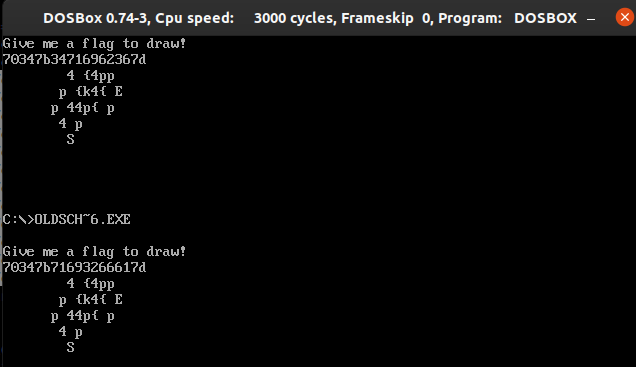

## Teaser CONFidence CTF 2019 - oldschool (Reversing 128)
##### 16/03 - 17/03/2019 (24hr)
___

### Description: 

Gynvael did a survey lately to see what kind of assembly is taught in Polish universities,
and if any of them is still teaching the old 8086. Let us extend this question to the CTF scene!

___

### Solution

We have a DOS binary and a flag file. First we use DOSBOX to run it. Program accepts 
an **18 hex digit** flag and generates a drawing. Our goal is to recover the flag from the
target drawing:
```
        4 {4pp   
       p {k4{ E  
      p 44p{ p   
       4 p       
        S        
                 
                 
                 
                 
```

Binary is quite simple. We start from `start`, where it reads the flag and creates the drawing:
```Assembly
seg001:0000         public start
...
seg001:000F         assume ds:seg000
seg001:000F         mov     si, 0                   ; print a '$' terminated string: "Give me a flag to draw!"
seg001:0012         mov     ah, 9
seg001:0014         mov     dx, 0A2h ; 'ó'
seg001:0017         int     21h                     ; DOS - PRINT STRING
seg001:0017                                         ; DS:DX -> string terminated by "$"
seg001:0019         call    draw_10148
seg001:001C         mov     di, si                  ; di = last index
seg001:001E         call    decode_seg0_10215
seg001:0021         mov     al, 45h ; 'E'
seg001:0023         mov     [di], al                ; buf[di] = 0x45
seg001:0025         mov     si, 0
seg001:0028         mov     al, 53h ; 'S'
seg001:002A         mov     [si+50h], al            ; buf[0x50] = 0x53
seg001:002D         call    print_flag_10124
seg001:0030
seg001:0030 EXIT_10120:                             ; CODE XREF: draw_10148+73j
...
```

Then we have `draw_10148` which generates the actual drawing in `seg0`:
```assembly
seg001:0058 draw_10148 proc near                    ; CODE XREF: start+19p
seg001:0058         mov     si, 0
seg001:005B         add     si, 50h ; 'P'           ; si = 0x50
seg001:005E         mov     cx, 9
seg001:0061
seg001:0061 MAIN_LOOP_10151:                        ; CODE XREF: draw_10148+4Dj
seg001:0061         push    cx
seg001:0062         mov     cx, 2
seg001:0065         xor     dl, dl
seg001:0067         mov     bl, 10h
seg001:0069
seg001:0069 READ_NXT_DIGIT_10159:                   ; CODE XREF: draw_10148+29j
seg001:0069         mov     ah, 1
seg001:006B         int     21h                     ; DOS - KEYBOARD INPUT
seg001:006B                                         ; Return: AL = character read
seg001:006D         cmp     al, 3Ah ; ':'
seg001:006F         jb      short IS_NUMBER_10198
seg001:0071         cmp     al, 47h ; 'G'
seg001:0073         jb      short IS_UPPERCASE_101AA
seg001:0075         cmp     al, 67h ; 'g'
seg001:0077         jb      short IS_LOWERCASE_101A0
seg001:0079         jmp     short INVALID_101B4     ; print "Invalid input, bye bye!"
seg001:007B ; ---------------------------------------------------------------------------
seg001:007B
seg001:007B PROC_DIGIT_1016B:                       ; CODE XREF: draw_10148+56j
seg001:007B                                         ; draw_10148+60j ...
seg001:007B         mul     bl                      ; multiply digit by 16
seg001:007D         add     dl, al
seg001:007F         mov     bl, 1
seg001:0081         loop    READ_NXT_DIGIT_10159    ; cx = 2 -> Read a little endian WORD into dx
seg001:0083         mov     cx, 4
seg001:0086
seg001:0086 CHECK_LSB_10176:                        ; CODE XREF: draw_10148+4Aj
seg001:0086         mov     al, dl
seg001:0088         and     al, 1
seg001:008A         jz      short LSBIT_EVEN_101DF
seg001:008C         jmp     short LSBIT_ODD_101F8
seg001:008E ; ---------------------------------------------------------------------------
seg001:008E
seg001:008E CHECK_LSB2_1017E:                       ; CODE XREF: draw_10148+9Cj
seg001:008E                                         ; draw_10148+A7j ...
seg001:008E         mov     al, dl
seg001:0090         and     al, 2
seg001:0092         jz      short LSBIT2_EVEN_101BE
seg001:0094         jmp     short LSBIT2_ODD_101CE
seg001:0096 ; ---------------------------------------------------------------------------
seg001:0096
seg001:0096 loc_10186:                              ; CODE XREF: draw_10148:loc_101CCj
seg001:0096                                         ; draw_10148:loc_101DDj
seg001:0096         push    cx
seg001:0097         mov     cl, 2
seg001:0099         shr     dl, cl                  ; move on the next pair of bits
seg001:009B         pop     cx
seg001:009C         mov     bl, [si]
seg001:009E         inc     bl                      ; increment element
seg001:00A0         mov     [si], bl
seg001:00A2         loop    CHECK_LSB_10176
seg001:00A4         pop     cx
seg001:00A5         loop    MAIN_LOOP_10151
seg001:00A7         retn
seg001:00A8 ; ---------------------------------------------------------------------------
seg001:00A8
seg001:00A8 IS_NUMBER_10198:                        ; CODE XREF: draw_10148+17j
seg001:00A8         cmp     al, 2Fh ; '/'
seg001:00AA         jb      short INVALID_101B4     ; print "Invalid input, bye bye!"
seg001:00AC         sub     al, 30h ; '0'           ; subtract '0' (ASCII to int)
seg001:00AE         jmp     short PROC_DIGIT_1016B  ; multiply digit by 16
seg001:00B0 ; ---------------------------------------------------------------------------
seg001:00B0
seg001:00B0 IS_LOWERCASE_101A0:                     ; CODE XREF: draw_10148+1Fj
seg001:00B0         cmp     al, 60h ; '`'
seg001:00B2         jb      short INVALID_101B4     ; print "Invalid input, bye bye!"
seg001:00B4         sub     al, 61h ; 'a'
seg001:00B6         add     al, 0Ah                 ; subtract 'a' and add 10 (ASCII to hex digit)
seg001:00B8         jmp     short PROC_DIGIT_1016B  ; multiply digit by 16
seg001:00BA ; ---------------------------------------------------------------------------
seg001:00BA
seg001:00BA IS_UPPERCASE_101AA:                     ; CODE XREF: draw_10148+1Bj
seg001:00BA         cmp     al, 40h ; '@'
seg001:00BC         jb      short INVALID_101B4     ; print "Invalid input, bye bye!"
seg001:00BE         sub     al, 41h ; 'A'
seg001:00C0         add     al, 0Ah
seg001:00C2         jmp     short PROC_DIGIT_1016B  ; multiply digit by 16
seg001:00C4 ; ---------------------------------------------------------------------------
seg001:00C4
seg001:00C4 INVALID_101B4:                          ; CODE XREF: draw_10148+21j
seg001:00C4                                         ; draw_10148+52j ...
seg001:00C4         mov     dx, 0CAh ; '-'          ; print "Invalid input, bye bye!"
seg001:00C7         mov     ah, 9
seg001:00C9         int     21h                     ; DOS - PRINT STRING
seg001:00C9                                         ; DS:DX -> string terminated by "$"
seg001:00CB         jmp     EXIT_10120
seg001:00CE ; ---------------------------------------------------------------------------
seg001:00CE
seg001:00CE LSBIT2_EVEN_101BE:                      ; CODE XREF: draw_10148+3Aj
seg001:00CE         mov     bx, si
seg001:00D0         cmp     bx, 11h
seg001:00D3         ja      short loc_101C7
seg001:00D5         jmp     short loc_101CC
seg001:00D7 ; ---------------------------------------------------------------------------
seg001:00D7
seg001:00D7 loc_101C7:                              ; CODE XREF: draw_10148+7Bj
seg001:00D7         sub     bx, 12h
seg001:00DA         mov     si, bx
seg001:00DC
seg001:00DC loc_101CC:                              ; CODE XREF: draw_10148+7Dj
seg001:00DC         jmp     short loc_10186
seg001:00DE ; ---------------------------------------------------------------------------
seg001:00DE
seg001:00DE LSBIT2_ODD_101CE:                       ; CODE XREF: draw_10148+3Cj
seg001:00DE         mov     bx, si
seg001:00E0         cmp     bx, 8Fh ; 'Å'
seg001:00E4         jb      short loc_101D8
seg001:00E6         jmp     short loc_101DD
seg001:00E8 ; ---------------------------------------------------------------------------
seg001:00E8
seg001:00E8 loc_101D8:                              ; CODE XREF: draw_10148+8Cj
seg001:00E8         add     bx, 12h
seg001:00EB         mov     si, bx
seg001:00ED
seg001:00ED loc_101DD:                              ; CODE XREF: draw_10148+8Ej
seg001:00ED         jmp     short loc_10186
seg001:00EF ; ---------------------------------------------------------------------------
seg001:00EF
seg001:00EF LSBIT_EVEN_101DF:                       ; CODE XREF: draw_10148+32j
seg001:00EF         mov     di, 0
seg001:00F2         cmp     si, di
seg001:00F4         jz      short CHECK_LSB2_1017E
seg001:00F6         mov     ax, si
seg001:00F8         mov     bl, 12h
seg001:00FA         div     bl                      ; si / 18
seg001:00FC         cmp     ah, 0
seg001:00FF         jz      short CHECK_LSB2_1017E
seg001:0101         mov     bx, si
seg001:0103         dec     bx
seg001:0104         mov     si, bx                  ; --si
seg001:0106         jmp     short CHECK_LSB2_1017E
seg001:0108 ; ---------------------------------------------------------------------------
seg001:0108
seg001:0108 LSBIT_ODD_101F8:                        ; CODE XREF: draw_10148+34j
seg001:0108         mov     di, 0
seg001:010B         cmp     si, di                  ; si == 0 ?
seg001:010D         jz      short INC_SI_1020D
seg001:010F         mov     ax, si
seg001:0111         mov     bl, 12h
seg001:0113         div     bl                      ; si / 0x12
seg001:0115         cmp     ah, 10h                 ; si % 0x12 != 0x10
seg001:0118         jnz     short INC_SI_1020D
seg001:011A         jmp     CHECK_LSB2_1017E
seg001:011D ; ---------------------------------------------------------------------------
seg001:011D
seg001:011D INC_SI_1020D:                           ; CODE XREF: draw_10148+B5j
seg001:011D                                         ; draw_10148+C0j
seg001:011D         mov     bx, si
seg001:011F         inc     bx
seg001:0120         mov     si, bx                  ; ++si
seg001:0122         jmp     CHECK_LSB2_1017E
seg001:0122 draw_10148 endp
```

Function has a weird flow, but if we view it in CFG mode, we can follow much easier what's going
on. So function reads 2 characters from the input. Each character is casted to a hex digit and
its value is extracted. If we supply a non hex digit program halts. Then these 2 characters used
to form a byte. The byte is divided into 4 pairs of bits. register `si` is initialized to `0x50`.
On each iteration we get the LSBit and we increment or decrement `si` according to the bit value.
Then we get the second LSBit and we increment/decrement `si` by `18` according to the bit value.
There are also some bound checks, so we cannot always modify `si`.

After the update of `si`, we use `si` as an index in `seg0` and we increment the location. Then
we move on with the next pair of bits. This process continues until we read all 18 digits from
the input.

Once we create the drawing, `decode_seg0_10215` is used to convert the numbers into characters:
```assembly
seg001:0125 decode_seg0_10215 proc near             ; CODE XREF: start+1Ep
seg001:0125         mov     si, 0
seg001:0128         mov     cx, 0A1h ; 'í'          ; si <- ds:0 (seg0 ?)
seg001:012B
seg001:012B LOOP_1021B:                             ; CODE XREF: decode_seg0_10215+1Aj
seg001:012B         mov     al, [si]                ; read the next byte from ds
seg001:012D         cmp     al, 0Dh
seg001:012F         ja      short TOO_LARGE_10232
seg001:0131         push    si
seg001:0132         mov     si, 0BCh ; '+'
seg001:0135         xor     ah, ah
seg001:0137         add     si, ax                  ; si = BUF[i] + 0xBC
seg001:0139         mov     bl, [si]                ; bl = BUF[BUF[i] + 0xBC]
seg001:013B         pop     si                      ; bl is a character from ' p4{krule_ctf}'!
seg001:013C
seg001:013C CONTINUE_1022C:                         ; CODE XREF: decode_seg0_10215+1Fj
seg001:013C         mov     [si], bl                ; BUF[i] = BUF[BUF[i] + 0xBC], if BUF[i] <= 0x0D
seg001:013C                                         ;          0x5E,               otherwise
seg001:013E         inc     si                      ; ++i (0xA0 times)
seg001:013F         loop    LOOP_1021B              ; read the next byte from ds
seg001:0141         retn
seg001:0142 ; ---------------------------------------------------------------------------
seg001:0142
seg001:0142 TOO_LARGE_10232:                        ; CODE XREF: decode_seg0_10215+Aj
seg001:0142         mov     bl, 5Eh ; '^'
seg001:0144         jmp     short CONTINUE_1022C    ; BUF[i] = BUF[BUF[i] + 0xBC], if BUF[i] <= 0x0D
seg001:0144 decode_seg0_10215 endp    
```

Each number here is used as an index on the constant flag: ` p4{krule_ctf}` (we start from a 
whitespace) and if index is ahead we use the `^` character. This function essentially substitutes
the numbers with characters.

And finally, we have `print_flag_10124`, which  inserts a new line character every **17** characters 
and prints the final drawing:
```assembly
seg001:0034 print_flag_10124 proc near              ; CODE XREF: start+2Dp
seg001:0034         mov     dl, 0Ah
seg001:0036         mov     ah, 2                   ; print newline
seg001:0038         int     21h                     ; DOS - DISPLAY OUTPUT
seg001:0038                                         ; DL = character to send to standard output
seg001:003A         mov     cx, 8
seg001:003D         mov     dx, si
seg001:003F
seg001:003F ADD_NEWLINES_1012F:                     ; CODE XREF: print_flag_10124+13j
seg001:003F         add     si, 11h
seg001:0042         mov     al, 0Ah
seg001:0044         mov     [si], al                ; add a new line every 17 characters
seg001:0046         inc     si
seg001:0047         loop    ADD_NEWLINES_1012F
seg001:0049         add     si, 11h
seg001:004C         mov     al, 24h ; '$'           ; add the '$' on the last line to indicate EoS
seg001:004E         mov     [si], al
seg001:0050         mov     ah, 9
seg001:0052         int     21h                     ; DOS - PRINT STRING
seg001:0052                                         ; DS:DX -> string terminated by "$"
seg001:0054         mov     si, 0
seg001:0057         retn
seg001:0057 print_flag_10124 endp
```

Ok so what this binary actually do? It reads the flag and then uses it to "pace" an `9x17`
map. Program moves only on 4 diagonals `(-1, -1)`, `(-1, +1)`, `(+1, -1)`, `(+1, +1)`, unless
it hits a wall. Every time it visits a cell it increments it by one. At the end each cell count
is converted to a character (0 --> ` `, 1 --> `p`, 2 --> `4`, and so on), the start and end 
locations are marked with `S` and `E` and the final drawing is printed to stdout.


### Breaking the binary
To break the drawing and recover the flag all we have to do is to run a Depth First Search (DFS)
on the drawing with depth exactly **36** (`18` digits x `2` pairs of `2` bits). Start location is
always `(4, 8)`. If our algorithm visits all the cells exactly as many times as the count says and
end up on the end location then we have a solution.

However there are many solutions, so we have to narrow down the search. There's a hint for the
challenge:
```
The flag in Oldschool challenge should match p4{[0-9a-z]+}.
```

We can use this to narrow down the search and find the following valid flags:
```
[+]  0. Flag found! p4{4qib6} --> 70347b34716962367d
[+]  1. Flag found! p4{4qibc} --> 70347b34716962637d
[+]  2. Flag found! p4{4qi2f} --> 70347b34716932667d
[+]  3. Flag found! p4{tib61} --> 70347b74696236317d
[+]  4. Flag found! p4{tibc1} --> 70347b74696263317d
[+]  5. Flag found! p4{ti2f1} --> 70347b74693266317d
[+]  6. Flag found! p4{aqib6} --> 70347b61716962367d
[+]  7. Flag found! p4{aqibc} --> 70347b61716962637d
[+]  8. Flag found! p4{aqi2f} --> 70347b61716932667d
[+]  9. Flag found! p4{qib6a} --> 70347b71696236617d
[+] 10. Flag found! p4{qibca} --> 70347b71696263617d
[+] 11. Flag found! p4{qi2fa} --> 70347b71693266617d
```

Any of these flags results to the same drawing:



For more details take a look at [oldschool_crack.py](./oldschool_crack.py)

___