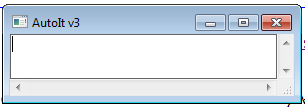
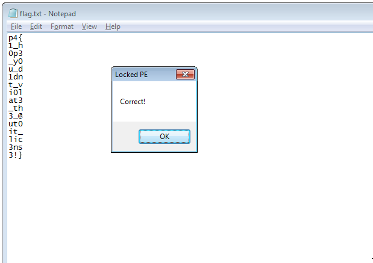

## Teaser CONFidence CTF 2020 - Locked PE (Reversing 168) - 22 solves
##### 14/03 - 15/03/2020 (24hr)
___

### Description: 

Every CTF needs a standard crackme. Well here's ours!

```
41ef61a53b18933648411e91fac633c3cedf8a4bf18c1037236f2ef251d37723_locked_pe.tar 980K
```

The flag format is: `p4{letters_digits_and_special_characters}`.
___

### Solution

A quick look at the binary reveals that it's an **AutoIt** program. AutoIt is a scripting language
for windows. Program also uses Uniscribe API for typograpgy scripts (more details available
[here](https://maxradi.us/documents/uniscribe)). When we run the program, nothing shows up but the
process still runs in the background. So we open the binary and first disable the anti-debugging
protections and make windows visible:
```Assembly
...
.text:000000013F87AB9F         xor     dil, dil
.text:000000013F87ABA2         call    cs:GetCurrentDirectoryW
.text:000000013F87ABA8         lea     r8, [rbp+1FF90h+var_s20]
.text:000000013F87ABAF         mov     rdx, rsi
.text:000000013F87ABB2         call    sub_13F87A624
.text:000000013F87ABB7         call    cs:IsDebuggerPresent
.text:000000013F87ABBD         test    eax, eax                ; PATCH: make it 0 (No debugger)
.text:000000013F87ABBF         jnz     DEBUGGER_FOUND_13FCEF0DA
...
.text:000000013F87AC80         call    sub_13F87AA30
.text:000000013F87AC85         call    make_windows_13F6DA95C
.text:000000013F87AC8A         cmp     cs:byte_13F944574, 0
.text:000000013F87AC91         jnz     short loc_13F87AC9F
.text:000000013F87AC93         lea     rcx, item
.text:000000013F87AC9A         call    add_icon_13FCA175C
...
.text:000000013F8AF0DA
.text:000000013F8AF0DA DEBUGGER_FOUND_13FCEF0DA:               ; CODE XREF: main_13FCBAB60+5Fj
.text:000000013F8AF0DA                                         ; DATA XREF: .pdata:000000013F94B498o
.text:000000013F8AF0DA         lea     r8, Caption             ; lpCaption
.text:000000013F8AF0E1         lea     rdx, Text               ; "This is a third-party compiled AutoIt s"...
.text:000000013F8AF0E8         mov     r9d, 10h                ; uType
.text:000000013F8AF0EE         xor     ecx, ecx                ; hWnd
.text:000000013F8AF0F0         call    cs:MessageBoxA
.text:000000013F8AF0F6         nop
.text:000000013F8AF0F7         jmp     RETURN_13FCBACDA
```

Function `make_windows_13F6DA95C` is responsible for rendering the application windows:
```Assembly
.text:000000013F87A95C make_windows_13F6DA95C proc near        ; CODE XREF: main_13FCBAB60+125p
.text:000000013F87A95C                                         ; DATA XREF: .pdata:000000013F9490B0o
.text:000000013F87A95C
.text:000000013F87A95C X       = dword ptr -48h
.text:000000013F87A95C Y       = dword ptr -40h
.text:000000013F87A95C nWidth  = dword ptr -38h
.text:000000013F87A95C nHeight = dword ptr -30h
.text:000000013F87A95C hWndParent= qword ptr -28h
.text:000000013F87A95C hMenu   = qword ptr -20h
.text:000000013F87A95C hInstance= qword ptr -18h
.text:000000013F87A95C var_10  = qword ptr -10h
.text:000000013F87A95C
.text:000000013F87A95C         mov     r11, rsp
.text:000000013F87A95F         sub     rsp, 68h
.text:000000013F87A963         and     qword ptr [r11-10h], 0
.text:000000013F87A968         mov     rax, cs:hInst
.text:000000013F87A96F         lea     rdx, WindowName         ; "AutoIt v3"
.text:000000013F87A976         mov     [r11-18h], rax
.text:000000013F87A97A         and     qword ptr [r11-20h], 0
.text:000000013F87A97F         and     qword ptr [r11-28h], 0
.text:000000013F87A984         mov     eax, 80000000h
.text:000000013F87A989         mov     [rsp+68h+nHeight], 64h  ; nHeight
.text:000000013F87A991         mov     [rsp+68h+nWidth], 12Ch  ; nWidth
.text:000000013F87A999         mov     [rsp+68h+Y], eax        ; Y
.text:000000013F87A99D         mov     r9d, 0CF0000h           ; dwStyle
.text:000000013F87A9A3         mov     r8, rdx                 ; lpWindowName
.text:000000013F87A9A6         xor     ecx, ecx                ; dwExStyle
.text:000000013F87A9A8         mov     [rsp+68h+X], eax        ; X
.text:000000013F87A9AC         call    cs:CreateWindowExW
.text:000000013F87A9B2         and     [rsp+68h+var_10], 0
.text:000000013F87A9B8         mov     rcx, cs:hInst
.text:000000013F87A9BF         mov     [rsp+68h+hInstance], rcx ; hInstance
.text:000000013F87A9C4         mov     [rsp+68h+hMenu], 1      ; hMenu
.text:000000013F87A9CD         mov     [rsp+68h+hWndParent], rax ; hWndParent
.text:000000013F87A9D2         and     [rsp+68h+nHeight], 0
.text:000000013F87A9D7         and     [rsp+68h+nWidth], 0
.text:000000013F87A9DC         and     [rsp+68h+Y], 0
.text:000000013F87A9E1         and     [rsp+68h+X], 0
.text:000000013F87A9E6         lea     rdx, aEdit              ; "edit"
.text:000000013F87A9ED         mov     r9d, 50B008C4h          ; dwStyle (PATCH: clear ES_READONLY 0x800) set to 50B000C4h
.text:000000013F87A9F3         xor     r8d, r8d                ; lpWindowName
.text:000000013F87A9F6         xor     ecx, ecx                ; dwExStyle
.text:000000013F87A9F8         mov     cs:hWndParent, rax
.text:000000013F87A9FF         call    cs:CreateWindowExW
.text:000000013F87AA05         mov     rcx, cs:hWndParent      ; hWnd
.text:000000013F87AA0C         xor     edx, edx                ; nCmdShow (PATCH: edx = 5 = SW_SHOW)
.text:000000013F87AA0E         mov     cs:qword_13F944508, rax
.text:000000013F87AA15         call    cs:ShowWindow
.text:000000013F87AA1B         mov     rcx, cs:hWndParent
.text:000000013F87AA22         xor     edx, edx                ; PATCH: edx = 5 = SW_SHOW
.text:000000013F87AA24         add     rsp, 68h
.text:000000013F87AA28         jmp     cs:ShowWindow
.text:000000013F87AA28 make_windows_13F6DA95C endp
```

To bypass the anti-debugging trick we have to patch the following line:
```Assembly
.text:000000013F87ABBD         test    eax, eax                ; PATCH: make it 0 (No debugger)
```

To make the application visible we have to patch the following lines:
```Assembly
.text:000000013F87A9ED         mov     r9d, 50B008C4h          ; dwStyle (PATCH: clear ES_READONLY 0x800) set to 50B000C4h

.text:000000013F87AA0C         xor     edx, edx                ; nCmdShow (PATCH: edx = 5 = SW_SHOW)

.text:000000013F87AA22         xor     edx, edx                ; PATCH: edx = 5 = SW_SHOW
```

After that, we can see the actual application:




### Tracing Function Calls

Before the windows are created there is an interesting initialization at `0x13F872D63`, where a
large table of function pointers is created:
```Assembly
.text:000000013F872D63 loc_13F872D63:                          ; CODE XREF: INIT_AUTOIT_FUNCS_13F3C2D30+11j
.text:000000013F872D63         mov     qword ptr [rbp+var_10+8], 0
.text:000000013F872D6B         lea     r8, ABS_13f3b8620
.text:000000013F872D72         or      eax, 1
.text:000000013F872D75         mov     qword ptr [rbp+var_10], r8
.text:000000013F872D79         lea     r8, aAcos               ; "ACOS"
.text:000000013F872D80         mov     cs:dword_13F93DA48, 1
.text:000000013F872D8A         movups  xmm0, [rbp+var_10]
.text:000000013F872D8E         mov     cs:ACOS_13f45e130, r8
.text:000000013F872D95         mov     qword ptr [rbp+var_10+8], 0
.text:000000013F872D9D         lea     r8, ACOS_13f435c70
.text:000000013F872DA4         movups  cs:xmmword_13F93DA38, xmm0
.text:000000013F872DAB         mov     qword ptr [rbp+var_10], r8
.text:000000013F872DAF         lea     r8, aAdlibregister      ; "ADLIBREGISTER"
...
.text:000000013F879C65         mov     cs:WINWAITCLOSE_13f45d010, r8
.text:000000013F879C6C         mov     qword ptr [rbp+var_10+8], 0
.text:000000013F879C74         lea     r8, WINWAITCLOSE_13f44defc
.text:000000013F879C7B         movaps  cs:xmmword_13F941930, xmm0
.text:000000013F879C82         mov     qword ptr [rbp+var_10], r8
.text:000000013F879C86         lea     r8, aWinwaitnotacti     ; "WINWAITNOTACTIVE"
.text:000000013F879C8D         mov     cs:dword_13F9418C8, 3
.text:000000013F879C97         movups  xmm0, [rbp+var_10]
.text:000000013F879C9B         mov     cs:WINWAITNOTACTIVE_13f45c298, r8
.text:000000013F879CA2         lea     r8, WINWAITNOTACTIVE_13f44df6c
.text:000000013F879CA9         mov     qword ptr [rbp+var_10+8], 0
```

This code initializes a table in `.data` section with all functions. For each function name
(`"ACOS"`, `...`, `"WINWAITNOTACTIVE"`), there is a function pointer, pointing to the equivalent
function:
```Assembly
.data:000000013F93DA28         align 10h
.data:000000013F93DA30 ABS_13f47c268 dq offset aAbs            ; DATA XREF: INIT_AUTOIT_FUNCS_13F3C2D30+22o
.data:000000013F93DA30                                         ; "ABS"
.data:000000013F93DA38 off_13F93DA38 dq offset ABS_13f3b8620   ; DATA XREF: INIT_AUTOIT_FUNCS_13F3C2D30+74w
.data:000000013F93DA40         dq 0
.data:000000013F93DA48 dword_13F93DA48 dd 1                    ; DATA XREF: INIT_AUTOIT_FUNCS_13F3C2D30+50w
.data:000000013F93DA4C dword_13F93DA4C dd 1                    ; DATA XREF: INIT_AUTOIT_FUNCS_13F3C2D30+B8w
.data:000000013F93DA50 byte_13F93DA50 db 0                     ; DATA XREF: INIT_AUTOIT_FUNCS_13F3C2D30+EEw
.data:000000013F93DA51         align 8
.data:000000013F93DA58 ACOS_13f45e130 dq offset aAcos          ; DATA XREF: INIT_AUTOIT_FUNCS_13F3C2D30+5Ew
.data:000000013F93DA58                                         ; "ACOS"
.data:000000013F93DA60 off_13F93DA60 dq offset ACOS_13f435c70  ; DATA XREF: INIT_AUTOIT_FUNCS_13F3C2D30+A6w
.data:000000013F93DA68         dq 0
.data:000000013F93DA70 dword_13F93DA70 dd 1                    ; DATA XREF: INIT_AUTOIT_FUNCS_13F3C2D30+121w
.data:000000013F93DA74 dword_13F93DA74 dd 1                    ; DATA XREF: INIT_AUTOIT_FUNCS_13F3C2D30+157w
.data:000000013F93DA78 byte_13F93DA78 db 0                     ; DATA XREF: INIT_AUTOIT_FUNCS_13F3C2D30+18Dw
.data:000000013F93DA79         align 20h
.data:000000013F93DA80 ADLIBREGISTER_13f45cbd0 dq offset aAdlibregister
.data:000000013F93DA80                                         ; DATA XREF: INIT_AUTOIT_FUNCS_13F3C2D30+90w
.data:000000013F93DA80                                         ; "ADLIBREGISTER"
.data:000000013F93DA88 off_13F93DA88 dq offset ADLIBREGISTER_13f3b8664
.data:000000013F93DA88                                         ; DATA XREF: INIT_AUTOIT_FUNCS_13F3C2D30+DCw
.data:000000013F93DA90         dq 0
.data:000000013F93DA98 dword_13F93DA98 dd 1                    ; DATA XREF: INIT_AUTOIT_FUNCS_13F3C2D30+1B9w
.d
```

If we follow the XREFs we can see the actual code for each function:
```Assembly
.text:000000013F868620 ABS_13f3b8620 proc near                 ; DATA XREF: INIT_AUTOIT_FUNCS_13F3C2D30+3Bo
.text:000000013F868620                                         ; .data:off_13F93DA38o ...
.text:000000013F868620
.text:000000013F868620 var_18  = xmmword ptr -18h
.text:000000013F868620
.text:000000013F868620         push    rbx                     ; ABS
.text:000000013F868622         sub     rsp, 30h
.text:000000013F868626         mov     rax, [rdx+8]
.text:000000013F86862A         movaps  [rsp+38h+var_18], xmm6
.text:000000013F86862F         mov     rbx, r8
.text:000000013F868632         mov     rcx, [rax]
.text:000000013F868635         call    sub_13F866D00
.text:000000013F86863A         call    fabs
.text:000000013F86863F         mov     rcx, rbx
.text:000000013F868642         movaps  xmm6, xmm0
.text:000000013F868645         call    free_mem_maybe_13FCA6890
.text:000000013F86864A         mov     dword ptr [rbx+10h], 3
.text:000000013F868651         movsd   qword ptr [rbx], xmm6
.text:000000013F868655         xor     eax, eax
.text:000000013F868657         movaps  xmm6, [rsp+38h+var_18]
.text:000000013F86865C         add     rsp, 30h
.text:000000013F868660         pop     rbx
.text:000000013F868661         retn
.text:000000013F868661 ABS_13f3b8620 endp
```

In [https://www.autoitscript.com/autoit3/docs/functions](https://www.autoitscript.com/autoit3/docs/functions)
you can find a detailed description of all these functions. Now it's time for our first script.
[hook_autoit_funcs.idc](hook_autoit_funcs.idc), renames the locations, the functions and adds
appropriate comments and break points to each function.

If we keep hitting `F9` we will see all the function that are invoked during program execution.
This is very useful, but we also need to know the arguments being passed to these function. After
a deeper look inside each function, we can infer that `edx + 8` contains the arguments:
```Assembly
.text:000000013F8F83B4 BINARYMID_13f4483b4 proc near           ; DATA XREF: INIT_AUTOIT_FUNCS_13F3C2D30+3E2o
.text:000000013F8F83B4                                         ; .pdata:000000013F94DFACo ...
.text:000000013F8F83B4
.text:000000013F8F83B4 arg_0   = qword ptr  8
.text:000000013F8F83B4 arg_8   = qword ptr  10h
.text:000000013F8F83B4 arg_10  = qword ptr  18h
.text:000000013F8F83B4
.text:000000013F8F83B4         mov     [rsp+arg_0], rbx        ; BINARYMID
.text:000000013F8F83B9         mov     [rsp+arg_8], rbp
.text:000000013F8F83BE         mov     [rsp+arg_10], rsi
.text:000000013F8F83C3         push    rdi
.text:000000013F8F83C4         push    r14
.text:000000013F8F83C6         push    r15
.text:000000013F8F83C8         sub     rsp, 20h
.text:000000013F8F83CC         mov     rax, [rdx+8]
.text:000000013F8F83D0         mov     r14, r8
.text:000000013F8F83D3         mov     rbp, rdx
.text:000000013F8F83D6         mov     rcx, [rax]
.text:000000013F8F83D9         call    sub_13F8D9458
```

`edx` points into an array of 4 elements (a function pointer, a pointer to the parameters,
the number of parameters and the size of the pointer):
```
000000000042E940  000000013F90B480 
000000000042E948  000000000058CB00 
000000000042E950  0000000000000003
000000000042E958  0000000000000008
```

The parameters pointer contains an entry for each parameter. Table ends with the magic dword
`0xBAADF00D`:
```Assembly
debug013:000000000058CB00 off_58CB00 dq offset off_58CB70         ; DATA XREF: Stack[000003B4]:000000000042E948o
debug013:000000000058CB08         dq offset unk_58CD00
debug013:000000000058CB10         dq offset unk_58CD50
debug013:000000000058CB18         dd 0BAADF00Dh
debug013:000000000058CB1C         dd 0BAADF00Dh
debug013:000000000058CB20         dd 0BAADF00Dh
debug013:000000000058CB24         dd 0BAADF00Dh
debug013:000000000058CB28         dd 0BAADF00Dh
```

Then the type of each parameter follows. 32-bit integers have the simplest format:
```Assembly
debug013:000000000058CD50 dword_58CD50 dd 1                       ; DATA XREF: debug013:000000000058CB10o
debug013:000000000058CD54         dd 0BAADF00Dh
debug013:000000000058CD58         dq 0
debug013:000000000058CD60         dd 1
debug013:000000000058CD64         dd 0BAADF00Dh
debug013:000000000058CD68         dq 0ABABABABABABABABh
debug013:000000000058CD70         dq 0ABABABABABABABABh
debug013:000000000058CD78         dq 0FEEEFEEEFEEEFEEEh
```

The first 4 bytes indicate the actual integer, then is magic constant `0xBAADF00D`, then is 
pointer (which is our case is NULL) and then is the identifier for 32-bit integers which is `1`.

For strings, the identifier is `4` and the format is a little bit different:
```Assembly
debug013:000000000058CC30 dword_58CC30 dd 0                       ; DATA XREF: debug013:000000000058CBC0o
debug013:000000000058CC34         dd 0BAADF00Dh
debug013:000000000058CC38         dq offset off_58CCC0
debug013:000000000058CC40         dd 4
debug013:000000000058CC44         dd 0BAADF00Dh
debug013:000000000058CC48         dq 0ABABABABABABABABh
debug013:000000000058CC50         dq 0ABABABABABABABABh
debug013:000000000058CC58         dq 0FEEEFEEEFEEEFEEEh
```

This time at offset `0x8` there is a pointer `off_58CCC0`:
```Assembly
debug013:000000000058CCC0 off_58CCC0 dq offset byte_577190        ; DATA XREF: debug013:off_58CB70o
debug013:000000000058CCC0                                         ; debug013:000000000058CC38o
debug013:000000000058CCC8         dq 8
debug013:000000000058CCD0         dq 10h
debug013:000000000058CCD8         dq offset dword_5771E0
debug013:000000000058CCE0         dq 0ABABABABABABABABh
debug013:000000000058CCE8         dq 0ABABABABABABABABh
debug013:000000000058CCF0         db    0
```

The first element is a pointer to the actual string while the second is the string length:
```Assembly
debug013:0000000000577190 byte_577190 db 6Fh                      ; DATA XREF: debug013:off_58CCC0o
debug013:0000000000577191         db    0
debug013:0000000000577192         db  4Fh ; O
debug013:0000000000577193         db    0
debug013:0000000000577194         db  6Fh ; o
debug013:0000000000577195         db    0
debug013:0000000000577196         db  4Fh ; O
debug013:0000000000577197         db    0
debug013:0000000000577198         db  6Fh ; o
debug013:0000000000577199         db    0
debug013:000000000057719A         db  6Fh ; o
debug013:000000000057719B         db    0
debug013:000000000057719C         db  4Fh ; O
debug013:000000000057719D         db    0
debug013:000000000057719E         db  4Fh ; O
```

`Array` and `Binary` formats are more complicated to handle, but we work similarly. Having all this
information, we write [trace_autoit_funcs.idc](trace_autoit_funcs.idc) to simulate execution and
trace all function calls along with their arguments:
```
  0: BITOR(0x1, 0x2)
  1: BITOR(0x1, 0x2, 0x4)
  2: BITOR(0x80000000, 0x40000000)
  3: STRINGTOASCIIARRAY("oOoOooOO")
  4: BINARY("0x3826011b061b232a222e1b2c0722202b0a")
  5: BINARYLEN({0x38, 0x26, 0x1, 0x1b, 0x6, 0x1b, 0x23, 0x2a, 0x22, 0x2e, 0x1b, 0x2c, 0x7, 0x22, 0x20, 0x2b, 0xa})
  6: UBOUND({0x6f /* o */, 0x4f /* O */, 0x6f /* o */, 0x4f /* O */, 0x6f /* o */, 0x6f /* o */, 0x4f /* O */, 0x4f /* O */})
  7: MOD(0x0, 0x8)
  8: BINARY("0x3826011b061b232a222e1b2c0722202b0a")
  9: BINARYMID({0x38, 0x26, 0x1, 0x1b, 0x6, 0x1b, 0x23, 0x2a, 0x22, 0x2e, 0x1b, 0x2c, 0x7, 0x22, 0x20, 0x2b, 0xa}, 0x1, 0x1)
 10: BITXOR(0x6f /* o */, {0x38})
 11: CHR(0x57 /* W */)
 12: UBOUND({0x6f /* o */, 0x4f /* O */, 0x6f /* o */, 0x4f /* O */, 0x6f /* o */, 0x6f /* o */, 0x4f /* O */, 0x4f /* O */})
 13: MOD(0x1, 0x8)
 14: BINARY("0x3826011b061b232a222e1b2c0722202b0a")
 15: BINARYMID({0x38, 0x26, 0x1, 0x1b, 0x6, 0x1b, 0x23, 0x2a, 0x22, 0x2e, 0x1b, 0x2c, 0x7, 0x22, 0x20, 0x2b, 0xa}, 0x2, 0x1)
 16: BITXOR(0x4f /* O */, {0x26})
 17: CHR(0x69 /* i */)
 18: UBOUND({0x6f /* o */, 0x4f /* O */, 0x6f /* o */, 0x4f /* O */, 0x6f /* o */, 0x6f /* o */, 0x4f /* O */, 0x4f /* O */})
 19: MOD(0x2, 0x8)
 20: BINARY("0x3826011b061b232a222e1b2c0722202b0a")
...
```

This loop repeats for many times, so we temporary disable all breakpoints for functions `UBOUND`,
`MOD`, `BINARY`, `BINARYMID`, `BITXOR` and `CHR` and we continue execution. Once program hits:
```Assembly
.text:000000013F5B9878         mov     rax, rsp                ; STRINGTOASCIIARRAY
```

We re-enable the breakpoints and we rerun the script. Then there is another loop. so we do the same
process control reaches `OPT`:
```Assembly
.text:000000013F868850         mov     [rsp-40h+arg_8], rdx    ; OPT
```

Then we rerun the script:
```
  0: OPT("WinTitleMatchMode", 0x2)
  1: CLIPPUT("")
  2: STRINGTOASCIIARRAY("oOoOooOO")
  3: BINARY("0x097e0b7609097f78582b5b7f5f582c780d775c7a0e5a7a78587a5e7a095b7a2e5b7c0c7d0b09297c0c765a295d0b2e790b7f587b58097f2a572c572b090b7b7c0e78572c5b572e7d5e7f5e7d5e5a792958760b7c590d7b7f0d2c5d7b585d78770a7b5e2c5c5a777c5f7e5e7b5d0c2b2a562e0b780b0d7b7d5b775a2c560a7b2e5c7f0b2d575f767d5b2a582e570a2e7d0929577c5b58787e0b7d582e56097e785b2a582a0e0e78790c2e59780a0b2d7d097e577b0d0b2b7e5e295f2e5a097e2e0b2b097b5a0a7b2e5b7f0e29560d767b0b2e0c7a565b297b0a7e5d7f095c76795d2a0e7e5a0e2a29097c572c575a7f7d5e7a0c295f0a2d7b0e2d0a7e0b0c7b2a5a29592c0a0b7e76587d5b77560e7c2a5e775e775e097a2b09295d7c5e092d780b7b5f78090c7d775d7c5f2958097a760d2d0e2c5d562a2b577e577a565c2e7c5f765d775b5c7d2d0c2e0e2a5f592a2a0c7d0d7c0b0b7d7c5a77582a5a59767a0e79562b5e092d2d5d785a7b0e097c7a0d79092c0a0c2b79097f097f57572e295b7b5a7a585f787c0a7c5e2a5b0b2d2b0d7b5b2d5d587c7b5e2e592a5d5c7b290d2e5f79590d7a7b0c7f0e7d575c7d79597f5b79595c772c587b5c7e0b0b7a7e5f2d5a78575b2b2d597b0a780d0e7e795d7b0976585a7a7e567c57785d562a2d0d2b0c290e577e2c587f0e775f0e2e7b09795a2d5c58292c5f765f7f58092978")
  4: BINARYLEN({0x9, 0x7e, 0xb, 0x76, 0x9, 0x9, 0x7f, 0x78, 0x58, 0x2b, 0x5b, 0x7f, 0x5f, 0x58, 0x2c, 0x78, 0xd, 0x77, 0x5c, 0x7a, 0xe, 0x5a, 0x7a, 0x78, 0x58, 0x7a, 0x5e, 0x7a, 0x9, 0x5b, 0x7a, 0x2e, 0x5b, 0x7c, 0xc, 0x7d, 0xb, 0x9, 0x29, 0x7c, 0xc, 0x76, 0x5a, 0x29, 0x5d, 0xb, 0x2e, 0x79, 0xb, 0x7f, 0x58, 0x7b, 0x58, 0x9, 0x7f, 0x2a, 0x57, 0x2c, 0x57, 0x2b, 0x9, 0xb, 0x7b, 0x7c, 0xe, 0x78, 0x57, 0x2c, 0x5b, 0x57, 0x2e, 0x7d, 0x5e, 0x7f, 0x5e, 0x7d, 0x5e, 0x5a, 0x79, 0x29, 0x58, 0x76, 0xb, 0x7c, 0x59, 0xd, 0x7b, 0x7f, 0xd, 0x2c, 0x5d, 0x7b, 0x58, 0x5d, 0x78, 0x77, 0xa, 0x7b, 0x5e, 0x2c, 0x5c, 0x5a, 0x77, 0x7c, 0x5f, 0x7e, 0x5e, 0x7b, 0x5d, 0xc, 0x2b, 0x2a, 0x56, 0x2e, 0xb, 0x78, 0xb, 0xd, 0x7b, 0x7d, 0x5b, 0x77, 0x5a, 0x2c, 0x56, 0xa, 0x7b, 0x2e, 0x5c, 0x7f, 0xb, 0x2d, 0x57, 0x5f, 0x76, 0x7d, 0x5b, 0x2a, 0x58, 0x2e, 0x57, 0xa, 0x2e, 0x7d, 0x9, 0x29, 0x57, 0x7c, 0x5b, 0x58, 0x78, 0x7e, 0xb, 0x7d, 0x58, 0x2e, 0x56, 0x9, 0x7e, 0x78, 0x5b, 0x2a, 0x58, 0x2a, 0xe, 0xe, 0x78, 0x79, 0xc, 0x2e, 0x59, 0x78, 0xa, 0xb, 0x2d, 0x7d, 0x9, 0x7e, 0x57, 0x7b, 0xd, 0xb, 0x2b, 0x7e, 0x5e, 0x29, 0x5f, 0x2e, 0x5a, 0x9, 0x7e, 0x2e, 0xb, 0x2b, 0x9, 0x7b, 0x5a, 0xa, 0x7b, 0x2e, 0x5b, 0x7f, 0xe, 0x29, 0x56, 0xd, 0x76, 0x7b, 0xb, 0x2e, 0xc, 0x7a, 0x56, 0x5b, 0x29, 0x7b, 0xa, 0x7e, 0x5d, 0x7f, 0x9, 0x5c, 0x76, 0x79, 0x5d, 0x2a, 0xe, 0x7e, 0x5a, 0xe, 0x2a, 0x29, 0x9, 0x7c, 0x57, 0x2c, 0x57, 0x5a, 0x7f, 0x7d, 0x5e, 0x7a, 0xc, 0x29, 0x5f, 0xa, 0x2d, 0x7b, 0xe, 0x2d, 0xa, 0x7e, 0xb, 0xc, 0x7b, 0x2a, 0x5a, 0x29, 0x59, 0x2c, 0xa, 0xb, 0x7e, 0x76, 0x58, 0x7d, 0x5b, 0x77, 0x56, 0xe, 0x7c, 0x2a, 0x5e, 0x77, 0x5e, 0x77, 0x5e, 0x9, 0x7a, 0x2b, 0x9, 0x29, 0x5d, 0x7c, 0x5e, 0x9, 0x2d, 0x78, 0xb, 0x7b, 0x5f, 0x78, 0x9, 0xc, 0x7d, 0x77, 0x5d, 0x7c, 0x5f, 0x29, 0x58, 0x9, 0x7a, 0x76, 0xd, 0x2d, 0xe, 0x2c, 0x5d, 0x56, 0x2a, 0x2b, 0x57, 0x7e, 0x57, 0x7a, 0x56, 0x5c, 0x2e, 0x7c, 0x5f, 0x76, 0x5d, 0x77, 0x5b, 0x5c, 0x7d, 0x2d, 0xc, 0x2e, 0xe, 0x2a, 0x5f, 0x59, 0x2a, 0x2a, 0xc, 0x7d, 0xd, 0x7c, 0xb, 0xb, 0x7d, 0x7c, 0x5a, 0x77, 0x58, 0x2a, 0x5a, 0x59, 0x76, 0x7a, 0xe, 0x79, 0x56, 0x2b, 0x5e, 0x9, 0x2d, 0x2d, 0x5d, 0x78, 0x5a, 0x7b, 0xe, 0x9, 0x7c, 0x7a, 0xd, 0x79, 0x9, 0x2c, 0xa, 0xc, 0x2b, 0x79, 0x9, 0x7f, 0x9, 0x7f, 0x57, 0x57, 0x2e, 0x29, 0x5b, 0x7b, 0x5a, 0x7a, 0x58, 0x5f, 0x78, 0x7c, 0xa, 0x7c, 0x5e, 0x2a, 0x5b, 0xb, 0x2d, 0x2b, 0xd, 0x7b, 0x5b, 0x2d, 0x5d, 0x58, 0x7c, 0x7b, 0x5e, 0x2e, 0x59, 0x2a, 0x5d, 0x5c, 0x7b, 0x29, 0xd, 0x2e, 0x5f, 0x79, 0x59, 0xd, 0x7a, 0x7b, 0xc, 0x7f, 0xe, 0x7d, 0x57, 0x5c, 0x7d, 0x79, 0x59, 0x7f, 0x5b, 0x79, 0x59, 0x5c, 0x77, 0x2c, 0x58, 0x7b, 0x5c, 0x7e, 0xb, 0xb, 0x7a, 0x7e, 0x5f, 0x2d, 0x5a, 0x78, 0x57, 0x5b, 0x2b, 0x2d, 0x59, 0x7b, 0xa, 0x78, 0xd, 0xe, 0x7e, 0x79, 0x5d, 0x7b, 0x9, 0x76, 0x58, 0x5a, 0x7a, 0x7e, 0x56, 0x7c, 0x57, 0x78, 0x5d, 0x56, 0x2a, 0x2d, 0xd, 0x2b, 0xc, 0x29, 0xe, 0x57, 0x7e, 0x2c, 0x58, 0x7f, 0xe, 0x77, 0x5f, 0xe, 0x2e, 0x7b, 0x9, 0x79, 0x5a, 0x2d, 0x5c, 0x58, 0x29, 0x2c, 0x5f, 0x76, 0x5f, 0x7f, 0x58, 0x9, 0x29, 0x78})
  5: UBOUND({0x6f /* o */, 0x4f /* O */, 0x6f /* o */, 0x4f /* O */, 0x6f /* o */, 0x6f /* o */, 0x4f /* O */, 0x4f /* O */})
  6: MOD(0x0, 0x8)
  7: BINARY("0x097e0b...978")
  8: BINARYMID({0x9, 0x7e, ...0x29, 0x78}, 0x1, 0x1)
  9: BITXOR(0x6f /* o */, {0x9})
 10: CHR(0x66 /* f */)
 11: UBOUND({0x6f /* o */, 0x4f /* O */, 0x6f /* o */, 0x4f /* O */, 0x6f /* o */, 0x6f /* o */, 0x4f /* O */, 0x4f /* O */})
 12: MOD(0x1, 0x8)
 ...
```

Still nothing interesting and a long useless loop. However on the next run, we get something really
interesting traces:
```
  0: OPT("WinTitleMatchMode", 0x2)
  1: CLIPPUT("")
  2: STRINGTOASCIIARRAY("oOoOooOO")
  3: BINARYLEN({0x9, 0x7e, 0xb, 0x76, 0x9, 0x9, 0x7f, 0x78, 0x58, 0x2b, 0x5b, 0x7f, 0x5f, 0x58, 0x2c, 0x78, 0xd, 0x77, 0x5c, 0x7a, 0xe, 0x5a, 0x7a, 0x78, 0x58, 0x7a, 0x5e, 0x7a, 0x9, 0x5b, 0x7a, 0x2e, 0x5b, 0x7c, 0xc, 0x7d, 0xb, 0x9, 0x29, 0x7c, 0xc, 0x76, 0x5a, 0x29, 0x5d, 0xb, 0x2e, 0x79, 0xb, 0x7f, 0x58, 0x7b, 0x58, 0x9, 0x7f, 0x2a, 0x57, 0x2c, 0x57, 0x2b, 0x9, 0xb, 0x7b, 0x7c, 0xe, 0x78, 0x57, 0x2c, 0x5b, 0x57, 0x2e, 0x7d, 0x5e, 0x7f, 0x5e, 0x7d, 0x5e, 0x5a, 0x79, 0x29, 0x58, 0x76, 0xb, 0x7c, 0x59, 0xd, 0x7b, 0x7f, 0xd, 0x2c, 0x5d, 0x7b, 0x58, 0x5d, 0x78, 0x77, 0xa, 0x7b, 0x5e, 0x2c, 0x5c, 0x5a, 0x77, 0x7c, 0x5f, 0x7e, 0x5e, 0x7b, 0x5d, 0xc, 0x2b, 0x2a, 0x56, 0x2e, 0xb, 0x78, 0xb, 0xd, 0x7b, 0x7d, 0x5b, 0x77, 0x5a, 0x2c, 0x56, 0xa, 0x7b, 0x2e, 0x5c, 0x7f, 0xb, 0x2d, 0x57, 0x5f, 0x76, 0x7d, 0x5b, 0x2a, 0x58, 0x2e, 0x57, 0xa, 0x2e, 0x7d, 0x9, 0x29, 0x57, 0x7c, 0x5b, 0x58, 0x78, 0x7e, 0xb, 0x7d, 0x58, 0x2e, 0x56, 0x9, 0x7e, 0x78, 0x5b, 0x2a, 0x58, 0x2a, 0xe, 0xe, 0x78, 0x79, 0xc, 0x2e, 0x59, 0x78, 0xa, 0xb, 0x2d, 0x7d, 0x9, 0x7e, 0x57, 0x7b, 0xd, 0xb, 0x2b, 0x7e, 0x5e, 0x29, 0x5f, 0x2e, 0x5a, 0x9, 0x7e, 0x2e, 0xb, 0x2b, 0x9, 0x7b, 0x5a, 0xa, 0x7b, 0x2e, 0x5b, 0x7f, 0xe, 0x29, 0x56, 0xd, 0x76, 0x7b, 0xb, 0x2e, 0xc, 0x7a, 0x56, 0x5b, 0x29, 0x7b, 0xa, 0x7e, 0x5d, 0x7f, 0x9, 0x5c, 0x76, 0x79, 0x5d, 0x2a, 0xe, 0x7e, 0x5a, 0xe, 0x2a, 0x29, 0x9, 0x7c, 0x57, 0x2c, 0x57, 0x5a, 0x7f, 0x7d, 0x5e, 0x7a, 0xc, 0x29, 0x5f, 0xa, 0x2d, 0x7b, 0xe, 0x2d, 0xa, 0x7e, 0xb, 0xc, 0x7b, 0x2a, 0x5a, 0x29, 0x59, 0x2c, 0xa, 0xb, 0x7e, 0x76, 0x58, 0x7d, 0x5b, 0x77, 0x56, 0xe, 0x7c, 0x2a, 0x5e, 0x77, 0x5e, 0x77, 0x5e, 0x9, 0x7a, 0x2b, 0x9, 0x29, 0x5d, 0x7c, 0x5e, 0x9, 0x2d, 0x78, 0xb, 0x7b, 0x5f, 0x78, 0x9, 0xc, 0x7d, 0x77, 0x5d, 0x7c, 0x5f, 0x29, 0x58, 0x9, 0x7a, 0x76, 0xd, 0x2d, 0xe, 0x2c, 0x5d, 0x56, 0x2a, 0x2b, 0x57, 0x7e, 0x57, 0x7a, 0x56, 0x5c, 0x2e, 0x7c, 0x5f, 0x76, 0x5d, 0x77, 0x5b, 0x5c, 0x7d, 0x2d, 0xc, 0x2e, 0xe, 0x2a, 0x5f, 0x59, 0x2a, 0x2a, 0xc, 0x7d, 0xd, 0x7c, 0xb, 0xb, 0x7d, 0x7c, 0x5a, 0x77, 0x58, 0x2a, 0x5a, 0x59, 0x76, 0x7a, 0xe, 0x79, 0x56, 0x2b, 0x5e, 0x9, 0x2d, 0x2d, 0x5d, 0x78, 0x5a, 0x7b, 0xe, 0x9, 0x7c, 0x7a, 0xd, 0x79, 0x9, 0x2c, 0xa, 0xc, 0x2b, 0x79, 0x9, 0x7f, 0x9, 0x7f, 0x57, 0x57, 0x2e, 0x29, 0x5b, 0x7b, 0x5a, 0x7a, 0x58, 0x5f, 0x78, 0x7c, 0xa, 0x7c, 0x5e, 0x2a, 0x5b, 0xb, 0x2d, 0x2b, 0xd, 0x7b, 0x5b, 0x2d, 0x5d, 0x58, 0x7c, 0x7b, 0x5e, 0x2e, 0x59, 0x2a, 0x5d, 0x5c, 0x7b, 0x29, 0xd, 0x2e, 0x5f, 0x79, 0x59, 0xd, 0x7a, 0x7b, 0xc, 0x7f, 0xe, 0x7d, 0x57, 0x5c, 0x7d, 0x79, 0x59, 0x7f, 0x5b, 0x79, 0x59, 0x5c, 0x77, 0x2c, 0x58, 0x7b, 0x5c, 0x7e, 0xb, 0xb, 0x7a, 0x7e, 0x5f, 0x2d, 0x5a, 0x78, 0x57, 0x5b, 0x2b, 0x2d, 0x59, 0x7b, 0xa, 0x78, 0xd, 0xe, 0x7e, 0x79, 0x5d, 0x7b, 0x9, 0x76, 0x58, 0x5a, 0x7a, 0x7e, 0x56, 0x7c, 0x57, 0x78, 0x5d, 0x56, 0x2a, 0x2d, 0xd, 0x2b, 0xc, 0x29, 0xe, 0x57, 0x7e, 0x2c, 0x58, 0x7f, 0xe, 0x77, 0x5f, 0xe, 0x2e, 0x7b, 0x9, 0x79, 0x5a, 0x2d, 0x5c, 0x58, 0x29, 0x2c, 0x5f, 0x76, 0x5f, 0x7f, 0x58, 0x9, 0x29, 0x78})
  4: STRINGTOASCIIARRAY("oOoOooOO")
  5: BINARYLEN({0x9, 0x23, 0xe, 0x28, 0x41, 0x1b, 0x37, 0x3b})
  6: WINACTIVATE("flag.txt")
  7: STRINGTOASCIIARRAY("oOoOooOO")
  8: BINARYLEN({0x9, 0x23, 0xe, 0x28, 0x41, 0x1b, 0x37, 0x3b})
  9: WINWAITACTIVE("flag.txt")
 10: STRINGTOASCIIARRAY("oOoOooOO")
 11: BINARYLEN({0x31, 0x34, 0x27, 0x0, 0x22, 0x2a, 0x32})
```

Here program looks for a window that has `flag.txt` as part of the title and then waits until it 
becomes an active window. Then it sends some simulated keystrokes to the active window. They
sequence of keys is: `Ctl+Home`, `Shift+Right Arrow`, `Shift+Right Arrow`, `Shift+Right Arrow`,
`Ctrl+C` and `Right Arrow`:
``` 
 12: SEND("^{HOME}")
 13: STRINGTOASCIIARRAY("oOoOooOO")
 14: BINARYLEN({0x44, 0x34, 0x3d, 0x6, 0x28, 0x27, 0x1b, 0x32})
 15: SEND("+{RIGHT}")
 16: STRINGTOASCIIARRAY("oOoOooOO")
 17: BINARYLEN({0x44, 0x34, 0x3d, 0x6, 0x28, 0x27, 0x1b, 0x32})
 18: SEND("+{RIGHT}")
 19: STRINGTOASCIIARRAY("oOoOooOO")
 20: BINARYLEN({0x44, 0x34, 0x3d, 0x6, 0x28, 0x27, 0x1b, 0x32})
 21: SEND("+{RIGHT}")
 22: STRINGTOASCIIARRAY("oOoOooOO")
 23: BINARYLEN({0x31, 0x2c})
 24: SEND("^c")
 25: STRINGTOASCIIARRAY("oOoOooOO")
 26: BINARYLEN({0x14, 0x1d, 0x26, 0x8, 0x27, 0x3b, 0x32})
 27: SEND("{RIGHT}")
 28: STRINGTOASCIIARRAY("oOoOooOO")
 29: BINARYLEN({0x5f, 0x37})
```

This sequence of keystrokes essentially goes to the beginning of the line, selects 3 characters,
copies them to the clipboard and moves on the next line.

Then code invokes `CryptCreateHash` with `ALG_ID == 0x8003`, which corresponds to `CALG_MD5`, and
calculates the MD5 hash for the first 3 characters of the flag. Then it compares it against a
constant hash and if they are not the same it prints the *badboy* message:
```
 30: STRINGMID("f1d9ff077d4007c7b835a5577515f45a43c2dff3c95f2da6d0747f0e8c8dfd43a78c48a21012156f79d36b40bc247278e41c358301142cde9ad7db42485c9e4a30db80924e7a8ea2ff834771d27a9f174e7eaa76ca67edb2f184bdd11f0a5f1addf45e4a40af9b94dac594f4e120f3962ea15aeff38c850215cf0eb4abe1dc4e5f6ced1972489a3e18181f5dff231fb7d407fc28230f7f59bbac29ed818593a30928432bcaae06eec2b3dd23587e5695a69d1fbb2754af35b6fcecd6f0f088af44557073e31e4dbdb44b27341a6e234fba066b54c0a283266046638c7431dd510b5784db64e7ba1624f97551938729ebbdcfa81c70a80aa4f65b37fc09007ff7", 0x1, 0x20 /*   */)
 31: CLIPGET()
 32: DLLOPEN("Advapi32.dll")
 33: DLLCALL(0x1, "bool", "CryptAcquireContext", "handle*", 0x0, "ptr", 0x0, "ptr", 0x0, "dword", 0x18, "dword", 0xf0000000)
 34: DLLCALL(0x1, "bool", "CryptCreateHash", "handle", U_757150, "uint", 0x8003, "ptr", 0x0, "dword", 0x0, "handle*", 0x0)
 35: BINARYLEN("ISP")
 36: DLLSTRUCTCREATE("byte[3]")
 37: DLLSTRUCTSETDATA(U_757010, 0x1, "ISP")
 38: DLLSTRUCTGETSIZE(U_757100)
 39: DLLCALL(0x1, "bool", "CryptHashData", "handle", U_759370, "struct*", U_759460, "dword", 0x3, "dword", 0x1)
 40: DLLCALL(0x1, "bool", "CryptGetHashParam", "handle", U_759410, "dword", 0x4, "dword*", 0x0, "dword*", 0x4, "dword", 0x0)
 41: DLLSTRUCTCREATE("byte[16]")
 42: DLLCALL(0x1, "bool", "CryptGetHashParam", "handle", U_759070, "dword", 0x2, "struct*", U_757130, "dword*", U_75ab70, "dword", 0x0)
 43: DLLSTRUCTGETDATA(U_75b2d0, 0x1)
 44: DLLCALL(0x1, "bool", "CryptDestroyHash", "handle", U_759880)
 45: DLLCALL(0x1, "bool", "CryptReleaseContext", "handle", U_757090, "dword", 0x0)
 46: DLLCLOSE(0x1)
 47: SETERROR(0x0, 0x0, {0xa5, 0xe9, 0xad, 0xa, 0x63, 0xd0, 0xaf, 0x14, 0x3a, 0x58, 0x6a, 0x7d, 0x3e, 0x86, 0x87, 0xf8})
 48: STRINGTOASCIIARRAY("oOoOooOO")
 49: BINARYLEN({0x23, 0x20, 0xc, 0x24, 0xa, 0xb, 0x6f, 0x1f, 0x2a})
 50: STRINGTOASCIIARRAY("oOoOooOO")
 51: BINARYLEN({0x26, 0x21, 0xc, 0x20, 0x1d, 0x1d, 0x2a, 0x2c, 0x1b, 0x6e})
 52: MSGBOX(0x0, "Locked PE", "Incorrect!")
 ```

The interesting part here is `STRINGMID` function. First argument is a long hex string, second
argument is start location (we start from 1) and third one is the number of characters to select
(here `32`). That is, `STRINGMID` gets a 32 character substring from starting from position `i`.

We see that `DLLSTRUCTSETDATA(U_757010, 0x1, "ISP")` selects the first 3 characters from the flag
and hashes them. THen it compar3es them using the first 32 characters from the `STRINGMID`:
`f1d9ff077d4007c7b835a5577515f45a`.


We use [hash killer](https://hashes.com/decrypt/basic) to break the first hash:
`f1d9ff077d4007c7b835a5577515f45a`, which results in `p4{` which is indeed the first part of the
flag. Assuming that the hashes are checked in order, we break the `STRINGMID` argument into MD5
hashes, and we break each one individually:

```
f1d9ff077d4007c7b835a5577515f45a:p4{:MD5
43c2dff3c95f2da6d0747f0e8c8dfd43:1_h:MD5
a78c48a21012156f79d36b40bc247278:0p3:MD5
e41c358301142cde9ad7db42485c9e4a:_y0:MD5
30db80924e7a8ea2ff834771d27a9f17:u_d:MD5
4e7eaa76ca67edb2f184bdd11f0a5f1a:1dn:MD5
ddf45e4a40af9b94dac594f4e120f396:t_v:MD5
2ea15aeff38c850215cf0eb4abe1dc4e:i0l:MD5
5f6ced1972489a3e18181f5dff231fb7:at3:MD5
d407fc28230f7f59bbac29ed818593a3:_th:MD5
0928432bcaae06eec2b3dd23587e5695:3_@:MD5
a69d1fbb2754af35b6fcecd6f0f088af:ut0:MD5
44557073e31e4dbdb44b27341a6e234f:it_:MD5
ba066b54c0a283266046638c7431dd51:lic:MD5
0b5784db64e7ba1624f97551938729eb:3ns:MD5
bdcfa81c70a80aa4f65b37fc09007ff7:3!}:MD5
```

We concatenate them and we reconstruct the flag: `p4{1_h0p3_y0u_d1dnt_vi0lat3_th3_@ut0it_lic3ns3!}`.

We can verify that the flag is indeed the correct one:



___
