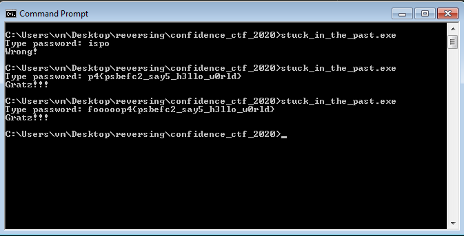

## Teaser CONFidence CTF 2020 - Stuck In The Past (Reversing 102) - 38 solves
##### 14/03 - 15/03/2020 (24hr)
___

### Description: 

Few days ago I was checking some old backups and found a weird program that was written by me
long time ago.

It was compiler... kind of... actually I really can't believe it works.

I've also found some sample programs "compiled" by this abomination, unfortunately without
the sources. One of them looks to be pretty complicated and asks for password.

Could you find the password for me?

```
ecb15f6e30b15c1b16eb240cb7018fa29c6dc7696fa722c37c7df76a9ec022c1_stuck_in_the_past.tar 20K
```

The flag format is: `p4{letters_digits_and_special_characters}`.

___

### Solution

A quick look at the binary indicates that it's a VM. Program starts at `0x401000`:
```Assembly
.text:00401000 ; FUNCTION CHUNK AT .text:004013DE SIZE 0000000B BYTES
.text:00401000
.text:00401000        push    0FFFFFFF6h               ; nStdHandle
.text:00401002        call    GetStdHandle             ; STD_INPUT_HANDLE
.text:00401007        mov     hStdin, eax
.text:0040100C        push    0FFFFFFF5h               ; nStdHandle
.text:0040100E        call    GetStdHandle             ; STD_OUTPUT_HANDLE
.text:00401013        mov     hStdout, eax
.text:00401018        call    init_chars_404AC8
.text:0040101D        call    init_func_tbl_404B2B
.text:00401022        jmp     START_EMU_ENTR_4013DE
.text:00401022 start  endp
```

`START_EMU_ENTR_4013DE` is a very long sequence of code chunks. Each chunk is exactly `11` bytes
long and has the following 4 formats:
```Assembly
; FORMAT #1
nop
nop
nop
nop
mov     eax, offset INSTRUCTION_ADDRESS
jmp     eax

; FORMAT #2
nop
nop
push    1_BYTE_VAL
mov     eax, offset INSTRUCTION_ADDRESS
jmp     eax

; FORMAT #3
xchg    ax, ax
push    1_BYTE_VAL
mov     eax, offset INSTRUCTION_ADDRESS
jmp     eax

; FORMAT #4
push    1_BYTE_VAL
push    1_BYTE_VAL
mov     eax, offset INSTRUCTION_ADDRESS
jmp     eax
```

After every instruction the following code is executed:
```Assembly
.text:00401027 NEXT_CMD_401027:                                 ; CODE XREF: .text:0040114Ej
.text:00401027                                                  ; .text:0040115Aj ...
.text:00401027         push    1
.text:00401029         push    70h
.text:0040102B         jmp     CHANGE_PACE_4010F6

...

.text:004010F6 CHANGE_PACE_4010F6:                              ; CODE XREF: .text:0040102Bj
.text:004010F6                                                  ; .text:00401105j ...
.text:004010F6         call    near ptr dispatch_401030         ; eax = ret addr
.text:004010FB         pop     eax
.text:004010FC         jmp     eax
```

After executing `dispatch_401030`, `eax` contains the address of the next instruction under
`START_EMU_ENTR_4013DE`. The interesting part about this VM is that the instructions are not
executed in a regular top-down order. Let's take a look at `dispatch_401030`:
```Assembly
.text:00401030 dispatch_401030 proc far                         ; CODE XREF: .text:CHANGE_PACE_4010F6p
.text:00401030                                                  ; .text:004013B4p
.text:00401030         pop     eax
.text:00401031         pop     ebx
.text:00401032         pop     ecx
.text:00401033         push    eax
.text:00401034         push    ecx
.text:00401035         push    ebx
.text:00401036         pop     eax
.text:00401037         cmp     al, 70h
.text:00401039         jz      short DONT_SET_401042
.text:0040103B         mov     pace_mode_406008, al
.text:00401040         jmp     short SELECT_401047
.text:00401042 ; ---------------------------------------------------------------------------
.text:00401042
.text:00401042 DONT_SET_401042:                                 ; CODE XREF: dispatch_401030+9j
.text:00401042         mov     al, pace_mode_406008
.text:00401047
.text:00401047 SELECT_401047:                                   ; CODE XREF: dispatch_401030+10j
.text:00401047         add     eax, offset STEP_CIRCULAR_INC_40104E
.text:0040104C         jmp     eax
.text:0040104E ; ---------------------------------------------------------------------------
.text:0040104E
.text:0040104E STEP_CIRCULAR_INC_40104E:                        ; DATA XREF: dispatch_401030:SELECT_401047o
.text:0040104E         mov     ax, index_406000
.text:00401054         pop     ebx
.text:00401055         add     ax, bx
.text:00401058         mov     bx, page_406004
.text:0040105F         cmp     ax, bx
.text:00401062         jl      short loc_401067
.text:00401064         sub     ax, bx
.text:00401067
.text:00401067 loc_401067:                                      ; CODE XREF: dispatch_401030+32j
.text:00401067         mov     index_406000, ax
.text:0040106D         jmp     short END_4010CD
.text:0040106F ; ---------------------------------------------------------------------------
.text:0040106F
.text:0040106F STEP_CIRCULAR_DEC_40106F:
.text:0040106F         mov     ax, index_406000
.text:00401075         pop     ebx
.text:00401076         sub     ax, bx
.text:00401079         jns     short loc_401085
.text:0040107B         mov     bx, page_406004
.text:00401082         add     ax, bx
.text:00401085
.text:00401085 loc_401085:                                      ; CODE XREF: dispatch_401030+49j
.text:00401085         mov     index_406000, ax
.text:0040108B         jmp     short END_4010CD
.text:0040108B ; ---------------------------------------------------------------------------
.text:0040108D         align 10h
.text:00401090
.text:00401090 PAGE_CIRCULAR_INC_401090:
.text:00401090         mov     ax, page_406002
.text:00401096         pop     ebx
.text:00401097         add     ax, bx
.text:0040109A         mov     bx, word_406006
.text:004010A1         cmp     ax, bx
.text:004010A4         jl      short loc_4010A9
.text:004010A6         sub     ax, bx
.text:004010A9
.text:004010A9 loc_4010A9:                                      ; CODE XREF: dispatch_401030+74j
.text:004010A9         mov     page_406002, ax
.text:004010AF         jmp     short END_4010CD
.text:004010B1 ; ---------------------------------------------------------------------------
.text:004010B1
.text:004010B1 PAGE_CIRCULAR_DEC_4010B1:
.text:004010B1         mov     ax, page_406002
.text:004010B7         pop     ebx
.text:004010B8         sub     ax, bx
.text:004010BB         jns     short loc_4010C7
.text:004010BD         mov     bx, word_406006
.text:004010C4         add     ax, bx
.text:004010C7
.text:004010C7 loc_4010C7:                                      ; CODE XREF: dispatch_401030+8Bj
.text:004010C7         mov     page_406002, ax
.text:004010CD
.text:004010CD END_4010CD:                                      ; CODE XREF: dispatch_401030+3Dj
.text:004010CD                                                  ; dispatch_401030+5Bj ...
.text:004010CD         mov     eax, 0
.text:004010D2         mov     ax, page_406002
.text:004010D8         mul     page_406004                      ; read only
.text:004010DF         add     ax, index_406000
.text:004010E6         mov     bx, 0Bh
.text:004010EA         mul     bx
.text:004010ED         add     eax, offset START_EMU_ENTR_4013DE
.text:004010F2         pop     ebx
.text:004010F3         push    eax
.text:004010F4         push    ebx
.text:004010F5         retn
.text:004010F5 dispatch_401030 endp ; sp-analysis failed
```

Function maintain 3 global variables: `index_406000`, `page_406002` and `word_406004` which is
initialized to `0x47` and is never modified. `dispatch_401030` takes 2 arguments (`direction`
and `step`) and does the following:
```
    if direction == 0x00 then index_406000 = (0x47 + index_406000 + step) % 0x47
    if direction == 0x21 then index_406000 = (0x47 + index_406000 - step) % 0x47
    if direction == 0x42 then page_406002  = (0x12 + page_406002  + step) % 0x12
    if direction == 0x63 then page_406002  = (0x12 + page_406002  + step) % 0x12
    if direction == 0x70 then update index_406000/page_406002 based on the previous direction
```

That is, VM is actually a 2D matrix with `0x47` rows and `0x12` columns. `index_406000` represents
the rows and `page_406002` represents the columns. We'll refer to these columns as "pages".
Also note that matrix is circular: If`direction` is `0` and `index` is `0` then index becomes
`0x46`. When `direction` is `0x70` then directions continues based on the previous direction
of the execution flow. For instance if direction is `0x42` (move on the next page), program will
executes instructions on the same row but on the next page, in circular order, unless `direction`
changes. Notice the `NEXT_CMD_401027` label where it executes the next instruction on the same
direction with the previous one (arguments are always `0x70` and `1`). That is the VM can
execute instructions backwards!


Then we have the following instructions:
```Assembly
.text:004010F6 CHANGE_PACE_4010F6:                              ; CODE XREF: .text:0040102Bj
.text:004010F6                                                  ; .text:00401105j ...
.text:004010F6         call    near ptr dispatch_401030         ; eax = ret addr
.text:004010FB         pop     eax
.text:004010FC         jmp     eax
.text:004010FE
.text:004010FE ; ---------------------------------------------------------------------------
.text:004010FE JCC_4010FE:                                      ; DATA XREF: .text:00401789o
.text:004010FE                                                  ; .text:00402016o ...
.text:004010FE         pop     ecx
.text:004010FF         push    1
.text:00401101         jecxz   short loc_40110A
.text:00401103         push    21h
.text:00401105         jmp     CHANGE_PACE_4010F6
.text:0040110A
.text:0040110A loc_40110A:                                      ; CODE XREF: .text:00401101j
.text:0040110A         push    0
.text:0040110C         jmp     CHANGE_PACE_4010F6
.text:00401111
.text:00401111 ; ---------------------------------------------------------------------------
.text:00401111 JCC_PAGE_401111:                                 ; DATA XREF: .text:004029CCo
.text:00401111                                                  ; .text:00402C97o ...
.text:00401111         pop     ecx
.text:00401112         push    1
.text:00401114         jecxz   short loc_40111D
.text:00401116         push    63h
.text:00401118         jmp     CHANGE_PACE_4010F6
.text:0040111D
.text:0040111D loc_40111D:                                      ; CODE XREF: .text:00401114j
.text:0040111D         push    42h
.text:0040111F         jmp     CHANGE_PACE_4010F6
.text:00401124
.text:00401124 ; ---------------------------------------------------------------------------
.text:00401124 ARITHMETIC_OP_401124:                            ; DATA XREF: SECRET_PUSH_4012BB:NOT_CHANGE_PACE_401355o
.text:00401124                                                  ; .text:00401D8Do ...
.text:00401124         pop     ecx
.text:00401125         pop     ebx
.text:00401126         pop     eax
.text:00401127         add     ecx, offset SELECT_OP_40112F
.text:0040112D         jmp     ecx
.text:0040112F
.text:0040112F ; ---------------------------------------------------------------------------
.text:0040112F SELECT_OP_40112F:                                ; DATA XREF: .text:00401127o
.text:0040112F         add     eax, ebx
.text:00401131         jmp     short loc_40114D
.text:00401133
.text:00401133         sub     eax, ebx
.text:00401135         jmp     short loc_40114D
.text:00401137
.text:00401137         mul     ebx
.text:00401139         jmp     short loc_40114D
.text:0040113B
.text:0040113B         mov     edx, 0
.text:00401140         div     ebx
.text:00401142         jmp     short loc_40114D
.text:00401144
.text:00401144         mov     edx, 0
.text:00401149         div     ebx
.text:0040114B         mov     eax, edx
.text:0040114D
.text:0040114D loc_40114D:                                      ; CODE XREF: .text:00401131j
.text:0040114D                                                  ; .text:00401135j ...
.text:0040114D         push    eax
.text:0040114E         jmp     NEXT_CMD_401027
.text:00401153
.text:00401153 ; ---------------------------------------------------------------------------
.text:00401153 NOT_401153:                                      ; DATA XREF: .text:00404024o
.text:00401153                                                  ; .text:00404578o ...
.text:00401153         pop     eax
.text:00401154         and     eax, 1
.text:00401157         not     eax
.text:00401159         push    eax
.text:0040115A         jmp     NEXT_CMD_401027
.text:0040115F ; ---------------------------------------------------------------------------
.text:0040115F
.text:0040115F DUP_TOP_40115F:                                  ; DATA XREF: .text:00401537o
.text:0040115F                                                  ; .text:00401D6Co ...
.text:0040115F         pop     eax
.text:00401160         push    eax
.text:00401161         push    eax
.text:00401162         jmp     NEXT_CMD_401027
.text:00401167
.text:00401167 ; ---------------------------------------------------------------------------
.text:00401167 SWAP_401167:                                     ; DATA XREF: .text:00402478o
.text:00401167                                                  ; .text:004032C7o ...
.text:00401167         pop     eax
.text:00401168         pop     ebx
.text:00401169         push    eax
.text:0040116A         push    ebx
.text:0040116B         jmp     NEXT_CMD_401027
.text:00401170
.text:00401170 ; ---------------------------------------------------------------------------
.text:00401170 POP_401170:                                      ; DATA XREF: .text:00401AB7o
.text:00401170                                                  ; .text:00401DC4o ...
.text:00401170         pop     eax
.text:00401171         jmp     NEXT_CMD_401027
.text:00401176
.text:00401176 ; ---------------------------------------------------------------------------
.text:00401176 RAND_CHANGE_PACE_401176:                         ; DATA XREF: .text:00401D2Ao
.text:00401176                                                  ; .text:00401D35o ...
.text:00401176         mov     bx, 4
.text:0040117A         call    GetTickCount
.text:0040117F         mov     dx, 0
.text:00401183         div     bx                               ; dx = GetTickCount() % 4
.text:00401186         mov     eax, 0
.text:0040118B         mov     ax, dx
.text:0040118E         mov     bx, 21h
.text:00401192         mul     bx                               ; set pace to (0, 21, 42, 63)
.text:00401195         push    1                                ; by one
.text:00401197         push    eax
.text:00401198         jmp     CHANGE_PACE_4010F6
.text:0040119D
.text:0040119D ; ---------------------------------------------------------------------------
.text:0040119D EXIT_40119D:                                     ; DATA XREF: .text:004048F3o
.text:0040119D                                                  ; init_func_tbl_404B2B+19Ao ...
.text:0040119D         push    0                                ; uExitCode
.text:0040119F         call    ExitProcess
.text:004011A4
.text:004011A4 ; ---------------------------------------------------------------------------
.text:004011A4 READ_CHAR_4011A4:                                ; DATA XREF: .text:00401D14o
.text:004011A4                                                  ; init_func_tbl_404B2B+1AAo ...
.text:004011A4         push    0                                ; lpOverlapped
.text:004011A6         push    offset NumberOfBytesWritten      ; lpNumberOfBytesRead
.text:004011AB         push    1                                ; nNumberOfBytesToRead
.text:004011AD         push    offset io_buf_406015             ; lpBuffer
.text:004011B2         push    hStdin                           ; hFile
.text:004011B8         call    ReadFile
.text:004011BD         mov     eax, 0
.text:004011C2         mov     al, io_buf_406015
.text:004011C7         push    eax
.text:004011C8         jmp     NEXT_CMD_401027
.text:004011CD
.text:004011CD ; ---------------------------------------------------------------------------
.text:004011CD PRINT_NUM_4011CD:                                ; DATA XREF: .text:00402386o
.text:004011CD                                                  ; init_func_tbl_404B2B+1BAo ...
.text:004011CD         pop     eax
.text:004011CE         mov     ebx, 0Ah
.text:004011D3         mov     ecx, 0Fh
.text:004011D8
.text:004011D8 PRINT_LOOP_4011D8:                               ; CODE XREF: .text:004011EDj
.text:004011D8         mov     edx, 0
.text:004011DD         div     ebx                              ; divide eax with 10
.text:004011DF         add     dl, 30h                          ; add '0' (int to char)
.text:004011E2         mov     io_buf_406015[ecx], dl
.text:004011E8         dec     cx                               ; repeat 15 times
.text:004011EA         cmp     eax, 0                           ; up to 15 times
.text:004011ED         jnz     short PRINT_LOOP_4011D8
.text:004011EF         inc     cx
.text:004011F1         mov     ebx, 10h
.text:004011F6         sub     bx, cx
.text:004011F9         lea     edi, io_buf_406015[ecx]
.text:004011FF         push    0                                ; lpOverlapped
.text:00401201         push    offset NumberOfBytesWritten      ; lpNumberOfBytesWritten
.text:00401206         push    ebx                              ; nNumberOfBytesToWrite
.text:00401207         push    edi                              ; lpBuffer
.text:00401208         push    hStdout                          ; hFile
.text:0040120E         call    WriteFile
.text:00401213         jmp     NEXT_CMD_401027
.text:00401218
.text:00401218 ; ---------------------------------------------------------------------------
.text:00401218 PRINT_CHAR_401218:                               ; DATA XREF: .text:004013F8o
.text:00401218                                                  ; .text:00401403o ...
.text:00401218         pop     eax
.text:00401219         mov     io_buf_406015, al
.text:0040121E         push    0                                ; lpOverlapped
.text:00401220         push    offset NumberOfBytesWritten      ; lpNumberOfBytesWritten
.text:00401225         push    1                                ; nNumberOfBytesToWrite
.text:00401227         push    offset io_buf_406015             ; lpBuffer
.text:0040122C         push    hStdout                          ; hFile
.text:00401232         call    WriteFile
.text:00401237         jmp     NEXT_CMD_401027
.text:0040123C
.text:0040123C ; ---------------------------------------------------------------------------
.text:0040123C SELF_MODIFY_40123C:                              ; DATA XREF: .text:004014BEo
.text:0040123C                                                  ; .text:004014DFo ...
.text:0040123C         mov     eax, 0
.text:00401241         pop     ecx
.text:00401242         mov     eax, ecx
.text:00401244         mul     page_406004
.text:0040124B         pop     ecx
.text:0040124C         add     eax, ecx
.text:0040124E         mov     bx, 0Bh
.text:00401252         mul     bx                               ; eax = & target instruction
.text:00401255         add     eax, offset START_EMU_ENTR_4013DE
.text:0040125A         pop     ecx                              ; ecx = index
.text:0040125B         mov     edx, ecx
.text:0040125D         add     ecx, offset tbl_406600
.text:00401263         xor     ebx, ebx
.text:00401265         mov     bl, [ecx]                        ; bl = tbl[index]
.text:00401267         cmp     ebx, 0
.text:0040126A         jnz     short NON_ZERO_401297            ; bl = tbl[idx] - 1
.text:0040126C         mov     ecx, edx                         ; tbl[idx] is 0
.text:0040126E         sub     dl, 30h
.text:00401271         cmp     dl, 9
.text:00401274         ja      short NOT_DIGIT_401280           ; no action
.text:00401276         add     edx, 6A906600h
.text:0040127C         mov     ecx, edx                         ; cast ASCII digit to digit (0-9)
.text:0040127E         jmp     short loc_401286
.text:00401280
.text:00401280 NOT_DIGIT_401280:                                ; CODE XREF: .text:00401274j
.text:00401280         add     ecx, 6A909000h                   ; no action
.text:00401286
.text:00401286 loc_401286:                                      ; CODE XREF: .text:0040127Ej
.text:00401286         ror     ecx, 8
.text:00401289         mov     [eax], ecx
.text:0040128B         mov     dword ptr [eax+5], offset NEXT_CMD_401027
.text:00401292         jmp     NEXT_CMD_401027
.text:00401297
.text:00401297 NON_ZERO_401297:                                 ; CODE XREF: .text:0040126Aj
.text:00401297         dec     bl                               ; bl = tbl[idx] - 1
.text:00401299         push    eax
.text:0040129A         mov     eax, ebx
.text:0040129C         mov     ecx, 8
.text:004012A1         mul     ecx                              ; eax = (tbl[idx] - 1) * 8
.text:004012A3         mov     ebx, eax
.text:004012A5         pop     eax
.text:004012A6         add     ebx, offset func_tbl_406700
.text:004012AC         mov     edx, [ebx]                       ; edx = func_tbl[tbl[idx] - 1]
.text:004012AE         mov     [eax], edx                       ; replace operands
.text:004012B0         mov     edx, [ebx+4]
.text:004012B3         mov     [eax+5], edx                     ; replace instruction
.text:004012B6         jmp     NEXT_CMD_401027
....
.text:004013A6 ; ---------------------------------------------------------------------------
.text:004013A6 SECRET_PUSH_4013A6:                              ; DATA XREF: .text:00401E48o
.text:004013A6                                                  ; .text:004029B6o ...
.text:004013A6         call    SECRET_PUSH_4012BB
.text:004013AB         jmp     NEXT_CMD_401027
.text:004013B0
.text:004013B0 ; ---------------------------------------------------------------------------
.text:004013B0 SECRET_LOOP_4013B0:                              ; CODE XREF: .text:004013D6j
.text:004013B0                                                  ; DATA XREF: .text:0040149Do ...
.text:004013B0         push    1
.text:004013B2         push    70h
.text:004013B4         call    near ptr dispatch_401030         ; eax = ret addr
.text:004013B9
.text:004013B9         pop     eax                              ; get to the next instruction (can be up/down or in another page)
.text:004013BA         mov     eax, 0
.text:004013BF         mov     ax, index_406000
.text:004013C5         push    eax
.text:004013C6         mov     ax, page_406002
.text:004013CC         push    eax
.text:004013CD         call    SECRET_PUSH_4012BB
.text:004013D2         cmp     dword ptr [esp], 22h             ; loop till u hit double quote "
.text:004013D6         jnz     short SECRET_LOOP_4013B0
.text:004013D8         pop     eax
.text:004013D9         jmp     NEXT_CMD_401027
.text:004013DE ; ---------------------------------------------------------------------------
.text:004013DE ; START OF FUNCTION CHUNK FOR start
```

As you can see from the instructions, we have a stack machine. Conditional jumps can change
rows or pages according to the value of the top of the stack. The intersting part is the
`SELF_MODIFY_40123C` instruction which takes 3 arguments `(index, page, val)` and modifies an
instruction at location `(index, page)` with value `val`. **So, yes, it is a self-modifying VM!!!**.

Another interesting instruction is `SECRET_PUSH_4013A6` where it takes 2 arguments `(index, page)`,
parses the instruction at that location and transforms it into an 1-byte value where it pushes
it to the stack:
```Assembly
.text:004012BB
.text:004012BB ; =============== S U B R O U T I N E =======================================
.text:004012BB
.text:004012BB
.text:004012BB SECRET_PUSH_4012BB proc near                     ; CODE XREF: .text:SECRET_PUSH_4013A6p
.text:004012BB                                                  ; .text:004013CDp
.text:004012BB         pop     ebx
.text:004012BC         mov     eax, 0
.text:004012C1         pop     ecx
.text:004012C2         mov     ax, cx
.text:004012C5         mul     page_406004
.text:004012CC         pop     ecx
.text:004012CD         add     ax, cx
.text:004012D0         push    ebx
.text:004012D1         mov     bx, 0Bh
.text:004012D5         mul     bx                               ; read target instruction
.text:004012D8         add     eax, offset START_EMU_ENTR_4013DE
.text:004012DD         mov     edx, [eax+5]
.text:004012E0         cmp     edx, offset NEXT_CMD_401027      ; not a push instr
.text:004012E6         jnz     short NOT_PUSH_401320
.text:004012E8         mov     ecx, 0
.text:004012ED         mov     cl, [eax+2]
.text:004012F0         cmp     cl, 90h
.text:004012F3         jnz     short NOT_NOP_4012FC
.text:004012F5         push    20h                              ; nop/nop -> push 0x20 ' '
.text:004012F7         jmp     END_4013A1
.text:004012FC ; ---------------------------------------------------------------------------
.text:004012FC
.text:004012FC NOT_NOP_4012FC:                                  ; CODE XREF: SECRET_PUSH_4012BB+38j
.text:004012FC         mov     ecx, 0
.text:00401301         mov     cl, [eax]
.text:00401303         nop
.text:00401304         cmp     cl, 66h                          ; 66 opcode for xchg
.text:00401307         jnz     short NOT_XCHG_401312
.text:00401309         mov     cl, [eax+3]
.text:0040130C         add     cl, 30h                          ; xchg/push -> op1 += 0x30 (int 2 ASCII)
.text:0040130F         jmp     short loc_40131A                 ; push op1 (or op1 + 30h)
.text:00401311 ; ---------------------------------------------------------------------------
.text:00401311         nop
.text:00401312
.text:00401312 NOT_XCHG_401312:                                 ; CODE XREF: SECRET_PUSH_4012BB+4Cj
.text:00401312         mov     ecx, 0
.text:00401317         mov     cl, [eax+3]                      ; no op
.text:0040131A
.text:0040131A loc_40131A:                                      ; CODE XREF: SECRET_PUSH_4012BB+54j
.text:0040131A         push    ecx                              ; push op1 (or op1 + 30h)
.text:0040131B         jmp     END_4013A1
.text:00401320 ; ---------------------------------------------------------------------------
.text:00401320
.text:00401320 NOT_PUSH_401320:                                 ; CODE XREF: SECRET_PUSH_4012BB+2Bj
.text:00401320         cmp     edx, offset CHANGE_PACE_4010F6
.text:00401326         jnz     short NOT_CHANGE_PACE_401355
.text:00401328         mov     ecx, [eax]
.text:0040132A         shr     ecx, 18h
.text:0040132D         cmp     ecx, 0
.text:00401330         jnz     short loc_401336
.text:00401332         push    3Eh                              ; if pace "++" then push '>'
.text:00401334         jmp     short END_4013A1
.text:00401336 ; ---------------------------------------------------------------------------
.text:00401336
.text:00401336 loc_401336:                                      ; CODE XREF: SECRET_PUSH_4012BB+75j
.text:00401336         cmp     ecx, 21h
.text:00401339         jnz     short loc_40133F
.text:0040133B         push    3Ch                              ; if pace "--" then push '<'
.text:0040133D         jmp     short END_4013A1
.text:0040133F ; ---------------------------------------------------------------------------
.text:0040133F
.text:0040133F loc_40133F:                                      ; CODE XREF: SECRET_PUSH_4012BB+7Ej
.text:0040133F         cmp     ecx, 42h
.text:00401342         jnz     short loc_401348
.text:00401344         push    76h                              ; if pace "page++" then push 'v'
.text:00401346         jmp     short END_4013A1
.text:00401348 ; ---------------------------------------------------------------------------
.text:00401348
.text:00401348 loc_401348:                                      ; CODE XREF: SECRET_PUSH_4012BB+87j
.text:00401348         cmp     ecx, 63h
.text:0040134B         jnz     short loc_401351
.text:0040134D         push    5Eh                              ; if pace "page--" then push '^'
.text:0040134F         jmp     short END_4013A1
.text:00401351 ; ---------------------------------------------------------------------------
.text:00401351
.text:00401351 loc_401351:                                      ; CODE XREF: SECRET_PUSH_4012BB+90j
.text:00401351         push    23h
.text:00401353         jmp     short END_4013A1
.text:00401355 ; ---------------------------------------------------------------------------
.text:00401355
.text:00401355 NOT_CHANGE_PACE_401355:                          ; CODE XREF: SECRET_PUSH_4012BB+6Bj
.text:00401355         cmp     edx, offset ARITHMETIC_OP_401124
.text:0040135B         jnz     short NOT_ARITHMETIC_OP_401391
.text:0040135D         mov     ecx, 0
.text:00401362         mov     cx, [eax+2]
.text:00401366         shr     ecx, 8
.text:00401369         cmp     ecx, 0
.text:0040136C         jnz     short loc_401372
.text:0040136E         push    2Bh                              ; if add then push '+'
.text:00401370         jmp     short END_4013A1
.text:00401372 ; ---------------------------------------------------------------------------
.text:00401372
.text:00401372 loc_401372:                                      ; CODE XREF: SECRET_PUSH_4012BB+B1j
.text:00401372         cmp     ecx, 4
.text:00401375         jnz     short loc_40137B
.text:00401377         push    2Dh                              ; if sub then push '-'
.text:00401379         jmp     short END_4013A1
.text:0040137B ; ---------------------------------------------------------------------------
.text:0040137B
.text:0040137B loc_40137B:                                      ; CODE XREF: SECRET_PUSH_4012BB+BAj
.text:0040137B         cmp     ecx, 8
.text:0040137E         jnz     short loc_401384
.text:00401380         push    2Ah                              ; if mul then push '*'
.text:00401382         jmp     short END_4013A1
.text:00401384 ; ---------------------------------------------------------------------------
.text:00401384
.text:00401384 loc_401384:                                      ; CODE XREF: SECRET_PUSH_4012BB+C3j
.text:00401384         cmp     ecx, 0Ch
.text:00401387         jnz     short loc_40138D                 ; if mod then push '%'
.text:00401389         push    2Fh                              ; if div then push '/'
.text:0040138B         jmp     short END_4013A1
.text:0040138D ; ---------------------------------------------------------------------------
.text:0040138D
.text:0040138D loc_40138D:                                      ; CODE XREF: SECRET_PUSH_4012BB+CCj
.text:0040138D         push    25h                              ; if mod then push '%'
.text:0040138F         jmp     short END_4013A1
.text:00401391 ; ---------------------------------------------------------------------------
.text:00401391
.text:00401391 NOT_ARITHMETIC_OP_401391:                        ; CODE XREF: SECRET_PUSH_4012BB+A0j
.text:00401391         add     edx, 5100h
.text:00401397         mov     ecx, 0
.text:0040139C         mov     cl, [edx]
.text:0040139E         push    ecx
.text:0040139F         jmp     short $+2
.text:004013A1 ; ---------------------------------------------------------------------------
.text:004013A1
.text:004013A1 END_4013A1:                                      ; CODE XREF: SECRET_PUSH_4012BB+3Cj
.text:004013A1                                                  ; SECRET_PUSH_4012BB+60j ...
.text:004013A1         pop     eax
.text:004013A2         pop     ebx
.text:004013A3         push    eax
.text:004013A4         push    ebx
.text:004013A5         retn
.text:004013A5 SECRET_PUSH_4012BB endp ; sp-analysis failed
.text:004013A5
```

The decompiled version will look like this:
```C++
static decode_secret_single(addr) {
    auto insn_addr;
    auto secret_val;

    insn_addr = Dword(addr + 5);

    if (insn_addr == 0x401027) {
        if (Byte(addr + 2) == 0x90) secret_val = ' ';
        else {
            if (Byte(addr) == 0x66) secret_val = Byte(addr + 3) + 0x30;
            else secret_val = Byte(addr + 3);
        }
    }

    else if (insn_addr == 0x4010F6) {
             if (Byte(addr + 3) == 0x00) secret_val = '>';
        else if (Byte(addr + 3) == 0x21) secret_val = '<';
        else if (Byte(addr + 3) == 0x42) secret_val = 'v';
        else if (Byte(addr + 3) == 0x63) secret_val = '^';
        else                             secret_val = '#';
    }

    else if (insn_addr == 0x401124) {
             if (Byte(addr + 3) == 0x00) secret_val = '+';
        else if (Byte(addr + 3) == 0x04) secret_val = '-';
        else if (Byte(addr + 3) == 0x08) secret_val = '*';
        else if (Byte(addr + 3) == 0x0C) secret_val = '/';
        else                             secret_val = '%';
    }

    else {
        insn_addr = insn_addr + 0x5100;

             if (insn_addr == 0x4061FE) secret_val = '_';
        else if (insn_addr == 0x406211) secret_val = '|';
        else if (insn_addr == 0x406253) secret_val = '!';
        else if (insn_addr == 0x40625F) secret_val = ':';
        else if (insn_addr == 0x406267) secret_val = '\\';
        else if (insn_addr == 0x406270) secret_val = '$';
        else if (insn_addr == 0x406276) secret_val = '?';
        else if (insn_addr == 0x40629D) secret_val = '@';
        else if (insn_addr == 0x4062A4) secret_val = '~';
        else if (insn_addr == 0x4062CD) secret_val = '.';
        else if (insn_addr == 0x406318) secret_val = ',';
        else if (insn_addr == 0x40633C) secret_val = 'p';
        else if (insn_addr == 0x4064A6) secret_val = 'g';
        else if (insn_addr == 0x4064B0) secret_val = '"';
        else {
            secret_val = -1;
        }
    }

    if (secret_val >= 0x20 && secret_val <= 0x7e) {
        Message("\tSecret Value: 0x%02x or '%c'\n", secret_val, secret_val);            
    } else {
        Message("\tSecret Value: 0x%02x\n", secret_val);    
    }
       
    return secret_val;
}
```

So we can see the `SELF_MODIFY_40123C` and `SECRET_PUSH_4013A6` as way to read and write to
`.text` section of the emulated program (`SELF_MODIFY_40123C` uses `func_tbl_406700` tables to
make sure that instructions are modified in the right way).


So after all, VM supports the following instructions:
```
nop              : no operation
change pace      : change direction (next/prev row or column)
jz               : if top of the stack is 0 set direction to index-forward and pop
                 : else                     set direction to index-backward and pop
jz page          : if top of the stack is 0 set direction to page-forward and pop
                 : else                     set direction to page-backward and pop
add              : add the 2 top elements of the stack and store the result back to the stack
sub              : same with subtraction
mul              : same with multiplication
div              : same with division
mod              : same with modulo
not              : flip the bits of the top of the stack
dup              : duplicate the top of the stack
swap             : swap the 2 top elements of the stack
pop              : pop from the stack
chnage pace rand : randomly change the direction using GetTickCount
getch            : read 1 character from stdin
exit             : terminate VM
print int        : print an integer to stdout
print            : print 1 character to stdout
mem read         : parse a VM instruction into a integer and add it to the stack
mem write        : modify a VM instruction using a value
rep mem read     : parse a VM instruction into integers till you hit 0x22 ('"')
```

Given this we create an IDC script called [disassemble_straight.idc](./disassemble_straight.idc),
to get a straight disassembly listing of the VM instructions. However this is not very useful
as it's very hard to keep track of the page changes. Hence we create another IDC script
[disassemble_matrix.idc](./disassemble_matrix.idc), to generate a 2D matrix of the instructions.
That way we can easily keep track of the pages changes.

#### Reversing the matrix VM

Before we start we can use [set_bpt.idc](./set_bpt.idc) that sets breakpoints to every instruction
in the matrix (except `nop` and `change pace`). This is useful for debugging as we can trace the
executed instructions.

Program starts with **page 0** and pace is set to backwards, so it runs the instructions in reverse
order starting from `0`, then going to `0x46`, `0x45` and so on:
```
|   Page:  0    |
| pace ^ 1      |
| pace > 1      |
| print         |
| print         |
| print         |
| print         |
| print         |
| print         |
| print         |
| print         |
| print         |
| print         |
| print         |
| print         |
| print         |
| print         |
| print         |
| secret_loop   |
| push 0x54 'T' |
| push 0x79 'y' |
| self_modify   |
| push 0x65 'e' |
| nop           |
| self_modify   |
| push 0x61 'a' |
| push 0x73 's' |
| push 0x73 's' |
| push 0x77 'w' |
| push 0x6f 'o' |
| push 0x72 'r' |
| push 0x64 'd' |
| dup           |
| nop           |
| secret_loop   |
| nop           |
| nop           |
| nop           |
| nop           |
| nop           |
| nop           |
| nop           |
| push 0x48 'H' |
| push 0x65 'e' |
| push 0x6c 'l' |
| push 0x6c 'l' |
| push 0x6f 'o' |
| push 0        |
| push 0        |
| push 0x41 'A' |
| push 0        |
| push 0        |
| push 0        |
| push 0x46 'F' |
| push 0x52 'R' |
| push 0x45 'E' |
| push 0x45 'E' |
| push 8        |
| push 1        |
| push 17       |
| push 0        |
| push 144      |
| push 0x62 'b' |
| push 17       |
| push 0        |
| push 0x43 'C' |
| push 0x29 ')' |
| nop           |
| push 2        |
| push 0        |
| push 1        |
| push 2        |
```

The first `secret_loop` instruction decodes the next instructions and pushes a value to the stack,
until the decoded value is `0x22` or `"`. We use [secret_decode.idc](./secret_decode.idc) script
to decode the values:
```
Decoding secret values for address 0x401533 with step 0xffffffff:
    Secret Value: 0x3a or ':'
    Secret Value: 0x64 or 'd'
    Secret Value: 0x72 or 'r'
    Secret Value: 0x6f or 'o'
    Secret Value: 0x77 or 'w'
    Secret Value: 0x73 or 's'
    Secret Value: 0x73 or 's'
    Secret Value: 0x61 or 'a'
    Secret Value: 0x70 or 'p'
    Secret Value: 0x20 or ' '
    Secret Value: 0x65 or 'e'
    Secret Value: 0x70 or 'p'
    Secret Value: 0x79 or 'y'
    Secret Value: 0x54 or 'T'
    Secret Value: 0x22 or '"'
```

This is the `Type password:` message displayed at the beginning. Characters appear in the reverse
order as they pushed in the stack.


Then program reads the password character by character:
```
|   Page:  1    |   Page:  2    |   Page:  3    |   Page:  4    |
| pace > 1      | nop           | pace v 1      | jz            |
| pace ^ 1      | nop           | getch         | push 0x61 'a' |
| nop           | nop           | pace v 1      | nop           |
| nop           | pace > 1      | pace rand 1   | pace < 1      |
| nop           | pace > 1      | pace rand 1   | pace < 1      |
| nop           | pace > 1      | pace rand 1   | pace < 1      |
| nop           | pace > 1      | pace rand 1   | pace < 1      |
| nop           | pace > 1      | pace rand 1   | pace < 1      |
| nop           | pace > 1      | pace rand 1   | pace < 1      |
| nop           | nop           | dup           | nop           |
| nop           | nop           | push 2        | nop           |
| nop           | nop           | push 5        | nop           |
| nop           | nop           | mul           | nop           |
| nop           | nop           | sub           | nop           |
| jz            | nop           | pace < 1      | nop           |
| nop           | nop           | nop           | nop           |
| nop           | nop           | nop           | nop           |
| pace > 1      | pop           | pop           | nop           | push 0x61 'a' | nop           |
```

The `pace rand 1` instructions move the PC on a random direction based on the value of `GetTickCount`.
If move is on page 3, then the next instruction is always `pace > 1` to move you back to page 3.
If move is on page 4, then the next instruction is always `pace < 1` to move you back to page 3
again. If pace move you backwards on page 3, it will hit at some point a `pace v 1`, so it will
force execution flow to go forward again. Eventually we'll execute the `dup` instruction on page 3.
This trick is used to add randomness ad thwart side channel attacks (maybe they are possible if we
patch `GetTickCount` to always return `0`).

After a character is read the instruction sequence is:
```
getch                           ; Stack: pw[i]
dup                             ; Stack: pw[i], pw[i]
push 2                          ; Stack: pw[i], pw[i], 2
push 5                          ; Stack: pw[i], pw[i], 2, 5
mul                             ; Stack: pw[i], pw[i], 10
sub                             ; Stack: pw[i], (pw[i] - 10)
jz (if not go back to getch)    ; Stack: pw[0], pw[1], ..., pw[N-1], \r, \n
pop                             ; Stack: pw[0], pw[1], ..., pw[N-1], \r
pop                             ; Stack: pw[0], pw[1], ..., pw[N-1]
push 'a'                        ; Stack: pw[0], pw[1], ..., pw[N-1], 'a'
```

So as long as the top of the stack is non zero (e.g., entered character is a newline), code
keeps reading more characters. Then it drops `\r\n` and moves on. At this point, password is on
stack.


The execution flow goes to the right:
```
|   Page:  5    |   Page:  6    |   Page:  7    |   Page:  8    |   Page:  9    |   Page: 10    |
| push 0x61 'a' | nop           | nop           | nop           | nop           | swap          |
```

And then enters the main loop:
```
  |   Page: 11    |   Page: 12    |   Page: 13    |   Page: 14    |   Page: 15    |   Page: 16    |   Page: 17    |
  | jz page       | nop           | nop           | nop           | nop           | pace ^ 1      |               |
  |               |               |               |               |               | nop           |               |
  |               |               |               |               |               | pace > 1      | pace v 1      |
  |               |               |               |               |               | print         | nop           |
  |               |               |               |               |               | print         | nop           |
  |               |               |               |               |               | print         | nop           |
  |               |               |               |               |               | print         | nop           |
  |               |               |               |               |               | print         | nop           |
  |               |               |               |               |               | print         | nop           |
  |               |               |               |               |               | print         | nop           |
  |               |               |               |               |               | print         | nop           |
  |               |               |               |               |               | print         | nop           |
  |               |               |               |               |               | secret_loop   | nop           |
  |               |               |               |               |               | push 0x47 'G' | nop           |
  |               |               |               |               |               | push 0x72 'r' | nop           |
  | pace v 1      | nop           | pace < 1      | nop           | nop           | push 0x61 'a' | nop           |
  | nop           |               | nop           | nop           | nop           | push 0x74 't' | nop           |
->| nop           | pace v 1      | nop           | nop           | nop           | push 0x7a 'z' | nop           |
  | push 2        | swap          | nop           | nop           | nop           | not           | nop           |
  | push 5        | push 5        | nop           | nop           | nop           | not           | nop           |
  | secret_push   | mod           | nop           | nop           | nop           | not           | nop           |
  | dup           | pace v 1      | nop           | nop           | pace < 1      | secret_loop   | nop           |
  | push 0        | push 9        | nop           | nop           | nop           | nop           | nop           |
  | push 2        | push 2        | nop           | pace > 1      | nop           | nop           | pace v 1      |
  | secret_push   | add           | nop           | print         | nop           | nop           | push 5        |
  | sub           | dup           | nop           | print         | nop           | nop           | push 5        |
  | nop           | push 7        | nop           | print         | nop           | nop           | add           |
  | nop           | add           | nop           | print         | nop           | nop           | print         |
  | nop           | swap          | nop           | print         | nop           | nop           | exit          |
  | nop           | self_modify   | nop           | print         | add           | ...           |
  | nop           | pace > 1      | pace ^ 1      | secret_loop   | push 1        | ...           |
  | [... to top]  |
```

The most important part is the first instruction on page 11: `jz page`. If the top of the stack
is `0`, it will print a message, then a new line and then it will exit. We use the
[secret_decode.idc](./secret_decode.idc) script again to decode the secret loop:
```
Decoding secret values for address 0x40458a with step 0xffffffff:
    Secret Value: 0x21 or '!'
    Secret Value: 0x21 or '!'
    Secret Value: 0x21 or '!'
    Secret Value: 0x7a or 'z'
    Secret Value: 0x74 or 't'
    Secret Value: 0x61 or 'a'
    Secret Value: 0x72 or 'r'
    Secret Value: 0x47 or 'G'
    Secret Value: 0x22 or '"'
```

Which is the goodboy message. Let's write down the instructions in a line:
```
push 61h                            ; Stack: pw[0], ... pw[N], 'a'
swap                                ;
swap                                ;

; page 12 (initialization)
push 5                              ; Stack: pw[0], ... pw[N], 'a', 5
mod                                 ; Stack: pw[0], ... pw[N], 'a' % 5 = 2
push 9                              ;
push 2                              ; Stack: pw[0], ... pw[N], 2, 9, 2
add                                 ; Stack: pw[0], ... pw[N], 2, 11
dup                                 ; Stack: pw[0], ... pw[N], 2, 11, 11
push 7                              ; Stack: pw[0], ... pw[N], 2, 11, 11, 7
add                                 ; Stack: pw[0], ... pw[N], 2, 11, 18
swap                                ; Stack: pw[0], ... pw[N], 2, 18, 11
self_modify                         ; Write: *(18, 11) = 2

; page 11 - POINT A (main loop)
push 2                              ; This is v18_11! (starts from 2 goes on) !!!
push 5                              ; 
secret_push                         ; Read (v18_11, 5) v2_5 = '<' = 0x3C ?
dup                                 ; Stack: pw[0], ... pw[N], '<', <'
push 0                              ; 
push 2                              ; 
secret_push                         ; Read (0, 2) v0_2 = ' ' = 0x20
sub                                 ; Stack: pw[0], ... pw[N], v2_5, (v2_5, - v0_2)
jz (if top is 0, print "Gratz!!!")  ; if v2_5 == v0_2 print the goodboy
```

Else if `v2_5 != v0_2 (0x20)` then the following code is executed:
```
; page 8
dup                                 ; Stack: pw[0], ... pw[N], v2_5, v2_5
push 0                              ; 
push 4                              ; 
secret_push                         ; Read (0, 4) v0_4 = '_' = 0x5F
sub                                 ; Stack: pw[0], ... pw[N], v2_5, (v2_5 - v0_4)
jz page                             ; Check if v2_5 == v0_4
```

If `v2_5 != v0_4 (0x5F)` (i.e., character is not an underscore) then the following code is executed:
```
; page 7
dup                                 ; Stack: pw[0], ... pw[N], v2_5, v2_5
push 1                              ;
push 4                              ;
secret_push                         ; Read (1, 4) v1_4 = 'a' = 0x61
sub                                 ; Stack: pw[0], ... pw[N], v2_5, v1_4
jz page                             ; Check if v2_5 != v1_4
```

If `v2_5 != v1_4` (character is not an `a`) then the following code is executed:
```
; page 10
dup                                 ; Stack: pw[0], ... pw[N], v2_5, v2_5
push 2                              ;
mod                                 ; Stack: pw[0], ... pw[N], v2_5, v2_5 % 2
push 1                              ;
add                                 ; Stack: pw[0], ... pw[N], v2_5, (v2_5 % 2 + 1)
push 2                              ;
mod                                 ; Stack: pw[0], ... pw[N], v2_5, (v2_5 % 2 + 1) % 2 = A
swap                                ; Stack: pw[0], ... pw[N], A, v2_5
push 2                              ;
div                                 ; Stack: pw[0], ... pw[N], A, v2_5 / 2
dup                                 ; Stack: pw[0], ... pw[N], A, v2_5 / 2, v2_5 / 2
push 0                              ;
push 2                              ;
secret_push                         ; Read (0, 2) v0_2 = ' ' = 0x20
mod                                 ; Stack: pw[0], ... pw[N], A, v2_5 / 2, (v2_5 / 2) % v0_2 = B
swap                                ; Stack: pw[0], ... pw[N], A, B, v2_5 / 2
push 0                              ;
push 2                              ;
secret_push                         ; Read (0, 2)
div                                 ; Stack: pw[0], ... pw[N], A, B, (v2_5 / 2) / v0_2
push 1                              ;
add                                 ; Stack: pw[0], ... pw[N], A, B, (v2_5 / 2) / v0_2 + 1

; page 5, 4
push 2                              ;
mod                                 ; Stack: pw[0], ... pw[N], A, B, ((v2_5 / 2) / v0_2 + 1) % 2 = C

; page 3
push 2                              ; Stack: pw[0], ... pw[N], A, B, C, 2
push 0                              ;
push 2                              ;
secret_push                         ; Read (0, 2)
mul                                 ; Stack: pw[0], ... pw[N], A, B, C, v0_2 * 2

; page 4, 5
mul                                 ; Stack: pw[0], ... pw[N], A, B, C * (v0_2 * 2)
swap                                ; Stack: pw[0], ... pw[N], A, C * (v0_2 * 2), B

; page 10
push 2                              ;
mul                                 ; Stack: pw[0], ... pw[N], A, C * (v0_2 * 2), B * 2
add                                 ;
add                                 ; Stack: pw[0], ... pw[N], A + C * (v0_2 * 2) + B * 2
; page 10 - POINT B
sub                                 ; Stack: pw[0], ... (pw[N] - A + C * (v0_2 * 2) + B * 2

; page 14
jz                                  ; if pw[N] != A + C * (v0_2 * 2) + B * 2
```

So, if `pw[N] != A + C * (v0_2 * 2) + B * 2` (i.e., character is not equal) the badboy message is
displayed:
```
|   Page: 14    |   Page: 15    |
| pace > 1      | nop           | --> ... exit
| print         |
| print         |
| print         |
| print         |
| print         |
| print         |
| secret_loop   |
| push 0x57 'W' |
| push 0x72 'r' |
| push 0x6f 'o' |
| push 0x6e 'n' |
| secret_push   |
| not           |
| secret_loop   |
| jz            |
| pace > 1      |
```

Again, using our [secret_decode.idc](./secret_decode.idc) script, we can get the exact string:
```
Decoding secret values for address 0x404020 with step 0xffffffff:
    Secret Value: 0x21 or '!'
    Secret Value: 0x67 or 'g'
    Secret Value: 0x6e or 'n'
    Secret Value: 0x6f or 'o'
    Secret Value: 0x72 or 'r'
    Secret Value: 0x57 or 'W'
    Secret Value: 0x22 or '"'
```

Bingo! The last character of the password must be:
```
    pw[N] =   (v2_5 % 2 + 1)    % 2 +
              (v2_5 / 2) % v0_2 * 2 +
            (((v2_5 / 2) / v0_2 + 1) % 2) * (v0_2 * 2)

    where, 
        v2_5 = Array element
        v0_2 = 0x20

```

Which results to `0x7D` or `}`. As long as the character is correct then we increment the iterator:
```
; page 15
push 9                              ; Stack: pw[0], ... pw[N-1], 9
push 2                              ; Stack: pw[0], ... pw[N-1], 9, 2
add                                 ; Stack: pw[0], ... pw[N-1], 11
dup                                 ; Stack: pw[0], ... pw[N-1], 11, 11
push 7                              ; Stack: pw[0], ... pw[N-1], 11, 11, 7
add                                 ; Stack: pw[0], ... pw[N-1], 11, 18
swap                                ; Stack: pw[0], ... pw[N-1], 18, 11
secret_push                         ; Decode at (18, 11) = 2
push 1                              ; Stack: pw[0], ... pw[N-1], v18_11, 1
add                                 ; Stack: pw[0], ... pw[N-1], v18_11+1

; page 12
push 9                              ;
push 2                              ;
add                                 ;
dup                                 ;
push 7                              ;
add                                 ; 
swap                                ; Stack: pw[0], ... pw[N-1], (v18_11 + 1), 18, 11
self_modify                         ; Write *(18, 11) = 3

; go to page 11 at POINT A!
```

Now if `v2_5 == v0_4` then go to `page 10 - POINT B`.

Finally, if `v2_5 == v1_4` then go again to `page 10 - POINT B`.

**NOTE: Comparison happens character by character, so a side channel attack is indeed possible**.

Now that we have everythin we can use the [secret_decode.idc](./secret_decode.idc) script again
to dump the characters from `(2, 5)` to `(30, 5)` which are assigned to `v2_5`:
```
    Secret Value: 0x3c or '<'
    Secret Value: 0x25 or '%'
    Secret Value: 0x2d or '-'
    Secret Value: 0x33 or '3'
    Secret Value: 0x71 or 'q'
    Secret Value: 0x36 or '6'
    Secret Value: 0x5f or '_'
    Secret Value: 0x2e or '.'
    Secret Value: 0x2d or '-'
    Secret Value: 0x2d or '-'
    Secret Value: 0x72 or 'r'
    Secret Value: 0x29 or ')'
    Secret Value: 0x5f or '_'
    Secret Value: 0x74 or 't'
    Secret Value: 0x38 or '8'
    Secret Value: 0x61 or 'a'
    Secret Value: 0x32 or '2'
    Secret Value: 0x5f or '_'
    Secret Value: 0x73 or 's'
    Secret Value: 0x22 or '"'
    Secret Value: 0x27 or '''
    Secret Value: 0x24 or '$'
    Secret Value: 0x23 or '#'
    Secret Value: 0x32 or '2'
    Secret Value: 0x31 or '1'
    Secret Value: 0x3a or ':'
    Secret Value: 0x75 or 'u'
    Secret Value: 0x31 or '1'
    Secret Value: 0x20 or ' '
```

**NOTE:** Be careful when dumping these values. If breakpoints are used, instructions are replaced
with `int 3` instructions or `0xcc` and `SECRET_PUSH_4012BB` fails to properly decode the
instruction, so it returns incorrect values.

Finally we write the following Python script to get the flag:
```Python
v0_2 = 0x20
flag = ''

for v2_5 in "<%-3q6_.--r)_t8a2_s\"'$#21:u1":
    if v2_5 == '_' or v2_5 == 'a':
      flag += v2_5
      continue

    v2_5 = ord(v2_5)
    pw = ((v2_5 % 2 + 1)    % 2 +
          (v2_5 // 2) % v0_2 * 2 +
          (((v2_5 // 2) // v0_2 + 1) % 2) * (v0_2 * 2))

    flag += chr(pw)

    print('Decoding character: %x (%c)' % (pw, pw))

print('Final flag:', flag[::-1])
```

Which gives us:
```
Decoding character: 7d (})
Decoding character: 64 (d)
Decoding character: 6c (l)
Decoding character: 72 (r)
Decoding character: 30 (0)
Decoding character: 77 (w)
Decoding character: 6f (o)
Decoding character: 6c (l)
Decoding character: 6c (l)
Decoding character: 33 (3)
Decoding character: 68 (h)
Decoding character: 35 (5)
Decoding character: 79 (y)
Decoding character: 73 (s)
Decoding character: 32 (2)
Decoding character: 63 (c)
Decoding character: 66 (f)
Decoding character: 65 (e)
Decoding character: 62 (b)
Decoding character: 73 (s)
Decoding character: 70 (p)
Decoding character: 7b ({)
Decoding character: 34 (4)
Decoding character: 70 (p)
Final flag: p4{psbefc2_say5_h3llo_w0rld}
```

That is the final flag is `p4{psbefc2_say5_h3llo_w0rld}`. We verify it:



___
