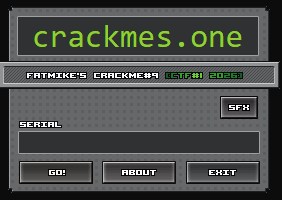
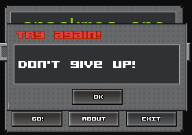
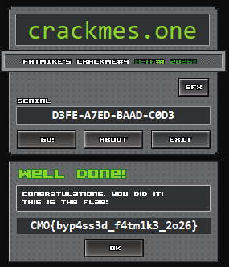

## Crackmes One CTF 2026 - Crackme #9 - (Hard - 916)
### 14-21/02/2026 (7d)
___

## Description

*Hello everyone!*

*I am excited to share my 9th crackme, created for the very first CTF hosted by crackmes.one.*
*Your mission is to find the correct serial number, to unlock the hidden flag-*
*Good luck!*

*Supported OS: Tested on Windows 10 and Windows 11.*
*Due to weird behavior on one specific Windows 11 25H2 computer, i added "administrator required" as manifest.*
*This fixed the issue.*

*Architecture: x86*

*Language: C/C++*  
___


### Solution

This challenge is an old-school crackme:



Our goal is to enter the correct serial. When entering the wrong serial we get the appropriate
message:



Let's start with the main event handler function:
```c
int __userpurge sub_405536@<eax>(int a1@<ecx>, int a2@<ebx>, __int16 a3, int a4) {
  HINSTANCE v6; // esi
  LPARAM v7[8]; // [esp-18h] [ebp-54h] BYREF
  LPARAM dwInitParam[13]; // [esp+8h] [ebp-34h] BYREF

  switch ( a3 )
  {
    case 1001:
      u_go_button_clicked(a1, a2);
      break;
    case 1002:
      v6 = *(a1 + 4);
      sub_4025EC(v7, &unk_40B3CD);
      sub_40574D(v6, 132, v7[0], v7[1], v7[2], v7[3], v7[4], v7[5]);
      u_DialogBoxParamA(dwInitParam, *(a1 + 8));
      sub_4057DA(dwInitParam);
      break;
    case 1003:
      EndDialog(*(a1 + 8), 0);
      break;
    case 1007:
      sub_405702();
      break;
    case 1010:
      ShellExecuteA(0, "open", "https://crackmes.one", 0, 0, 3);
      break;
    default:
      return 0;
  }
  return 1;
}
```

The important function is `405399h`:
```c
void __usercall u_go_button_clicked(int a1@<ecx>, int a2@<ebx>) {
  /* ... */
  memset(serial, 0, sizeof(serial));
  GetDlgItemTextA(*(a1 + 8), 1006, serial, 255);
  if ( u_VALIDATE_SERIAL(*(a1 + 20), a2, a1, serial) ) {
    // Good boy :)
    sub_4025EC(v14, serial);
    sub_40268B(v15, v14);
    sub_405724(v14);
    sub_402876(v15, Src, v16);
    v3 = *(a1 + 4);
    sub_40515A(&v5, Src);
    sub_40574D(dwInitParam, v3, 134, v5, v6, v7, v8, v9, v10);
    u_DialogBoxParamA(dwInitParam, *(a1 + 8));
    sub_4057DA(dwInitParam);
    sub_405724(Src);
    u_destroy_win_crypto_2(v15);
  } else {
    // Bad boy :(
    v4 = *(a1 + 4);
    sub_4025EC(&v5, &unk_40B3CE);
    sub_40574D(dwInitParam, v4, 136, v5, v6, v7, v8, v9, v10);
    u_DialogBoxParamA(dwInitParam, *(a1 + 8));
    sub_4057DA(dwInitParam);
  }
}
```

This function calls `u_VALIDATE_SERIAL()` at `4030A5h` and based on the return value it either
displays the goodboy or the badboy windows:
```c
char __thiscall u_VALIDATE_SERIAL(int *a1, char *a4_SERIAL) {
  /* ... */
  if ( !a4_SERIAL )
    return 0;
  v4 = u_system_info();
  u_decrypt_serial_checker(v4, *a1, a1[1], a1[2], a1[3]);
  buf = operator new(0x14u);
  if ( buf ) {
    *buf = 0;
    buf[1] = 0;
    buf[2] = 0;
    buf[3] = 0;
    buf[4] = 0;
    u_ENCRYPTED_INIT_HASHES(buf);
    v7 = v6;                                    // this is in .pc section!
  } else {
    v7 = 0;
  }
  is_valid = u_ENCRYPTED_VALIDATOR(a4_SERIAL);
  u_free(v7);
  v9 = u_system_info();
  sub_404732(v9);
  return is_valid;
}
```

All the work is done at `u_ENCRYPTED_INIT_HASHES()` (`.pc:0040A000`) and `u_ENCRYPTED_VALIDATOR()`
(`.pc:0040A025`). However both of these functions (in `.pc` segment) are encrypted. Let's see how.

Inside `u_decrypt_serial_checker()` at `4046C8h` there is a call to `u_debug_trap():`
```c
void __thiscall u_decrypt_serial_checker(obj *this, int flOldProtect, char *a3, int a4, jmp_tbl *a5) {
  /* ... */
  v5 = flOldProtect;
  inited = 0;
  flOldProtect = 0;
  this->VirtualFree = v5;
  this->VirtualAlloc = a3;
  this->GetSystemInfo = a4;
  u_get_KERNEL32_base();
  // VirtualProtect(0x40A000, 0x5B9, PAGE_EXECUTE_READWRITE, &old)
  VirtualProtect(*this->VirtualAlloc, *(this->VirtualAlloc + 2), 0x40u, &flOldProtect);
  u_build_hash_map(this, a5);
  this->USER32_dll_base = 0;                    // this might be wrong
  tinybuf = operator new(2u);
  if ( tinybuf )
    inited = u_init_tiny_buf(tinybuf);
  this->NtQueryInformationProcess = inited;
  // The "int 3" inside triggers a SEH.
  // We can't just nop it.
  u_debug_trap(inited);
}
```

The `u_debug_trap()` causes an `int 3` exception:
```assembly
.text:004037C2 u_debug_trap    proc near               ; CODE XREF: u_decrypt_serial_checker+5F↓p
.text:004037C2       mov     byte ptr [ecx+1], 1
.text:004037C6       int     3               ; Trap to Debugger
.text:004037C7       nop
.text:004037C8       retn
```

This interrupt is obviously handled by the program so we cannot ignore it. The `.pc` segment
gets `RWX` permissions from `VirtualProtect()` before the call to `u_debug_trap()`, so the
logic says that this handler is responsible for decrypting the functions at `.pc`.
___


### Finding the Exception Handler

At first I search the SEH chain to look for the exception handler, but I didn't find
anything. Then I did something smart: We know that `int 3` triggers an `EXCEPTION_BREAKPOINT`,
which is a macro for the constant `0x80000003`. The handler needs to check if the exception is
indeed `EXCEPTION_BREAKPOINT`, so there much be a comparison with this constant. So I searched
for the bytes `03 00 00 80` and I found the `u_exception_handler()` function at `404562h`:
```c
// To find this function: Search for the constant 03 00 00 80
void __thiscall u_exception_handler(obj *this, _EXCEPTION_RECORD *pRecord, _CONTEXT *pContext) {
  if ( !this->USER32_dll_base ) {
    switch ( pRecord->ExceptionCode )
    {
      case 0x80000003:
        // This is for conditional instructions (int 3)
        u_EXCEPTION_BREAKPOINT_handler(this, pContext);
        break;
      case 0x80000004:
        u_EXCEPTION_SINGLE_STEP_handler(this, pContext);
        break;
      case 0x80000001:
        u_EXCEPTION_GUARD_PAGE_handler(this, pRecord, pContext);
        break;
    }
  }
}
```

Now we work backwards to see where this is called from (`402E1Ch`):
```c
void __cdecl __noreturn u_CUSTOM_SEH_HANDLER(_CONTEXT *pContext)
{
  _SYSTEM_INFO *sysinfo; // eax
  _EXCEPTION_RECORD *retaddr; // [esp+0h] [ebp+0h]

  glo_pContext = pContext;
  glo_pRecord = retaddr;
  sysinfo = u_system_info();
  u_exception_handler(sysinfo, glo_pRecord, glo_pContext);
  u_get_KERNEL32_base();
  u_call_NtContinue();
  __debugbreak();
}
```

The `u_CUSTOM_SEH_HANDLER()` is called from `u_REVERSE_ME()` at `402E5Ah`. This function
cannot be decompiled so we will work directly with its assembly:
```assembly
.text:00402E5A u_REVERSE_ME    proc near               ; DATA XREF: .text:loc_402DAE↑o
.text:00402E5A

.....

.text:00402E72        call    u_NtQueryInformationProcess_wrapper
.text:00402E77        movzx   eax, al
.text:00402E7A        test    eax, eax
.text:00402E7C        jnz     short DEBUGGER_DETECTED_SKIP_SEH
.text:00402E7E        mov     eax, offset loc_402E87
.text:00402E83        push    eax
.text:00402E84        retn
.text:00402E85 ; ---------------------------------------------------------------------------
.text:00402E85        nop
.text:00402E86        nop
.text:00402E87
.text:00402E87 loc_402E87:                    ; DATA XREF: u_REVERSE_ME+24↑o
.text:00402E87        call    sub_402CAC
.text:00402E8C        mov     [ebp+var_4], eax
.text:00402E8F        push    offset unk_40D24C
.text:00402E94        push    offset u_CUSTOM_SEH_HANDLER
.text:00402E99        mov     ecx, [ebp+var_4]
.text:00402E9C        call    u_add_KiUserExceptionDispatcher_trampoline
.text:00402EA1        nop
.text:00402EA2        jmp     short loc_402EBE
.text:00402EA4 ; ---------------------------------------------------------------------------
.text:00402EA4
.text:00402EA4 DEBUGGER_DETECTED_SKIP_SEH:     ; CODE XREF: u_REVERSE_ME+22↑j
.text:00402EA4        xor     eax, eax
.text:00402EA6        dec     eax
.text:00402EA7        jz      short loc_402EAF
.text:00402EA9        push    offset loc_402EB1
.text:00402EAE        retn
.text:00402EAF ; ---------------------------------------------------------------------------
.text:00402EAF
.text:00402EAF loc_402EAF:                    ; CODE XREF: u_REVERSE_ME+4D↑j
.text:00402EAF        nop
.text:00402EB0        nop
.text:00402EB1
.text:00402EB1 loc_402EB1:                    ; CODE XREF: u_REVERSE_ME+54↑j
.text:00402EB1                       ; DATA XREF: u_REVERSE_ME+4F↑o
.text:00402EB1        call    sub_402CAC
.text:00402EB6        mov     ecx, eax
.text:00402EB8        call    u_FAKE_SEH_HANDLER_AVOID
.text:00402EBD        nop
.text:00402EBE
.text:00402EBE loc_402EBE:                    ; CODE XREF: u_REVERSE_ME+48↑j
.text:00402EBE        xor     eax, eax

.....

.text:00402EEC        pop     edi
.text:00402EED        pop     esi
.text:00402EEE        pop     ebx
.text:00402EEF        leave
.text:00402EF0        retn    14h
.text:00402EF0 ; END OF FUNCTION CHUNK FOR u_REVERSE_ME
```

First of all there is an **anti-debugging** check in `u_NtQueryInformationProcess_wrapper()`:
```c
char u_NtQueryInformationProcess_wrapper()
{
  void *KERNEL32_base; // eax

  if ( sub_402BC7() )
    return 1;
  u_get_KERNEL32_base();
  GetCurrentProcess_0();
  KERNEL32_base = u_get_KERNEL32_base();
  if ( u_call_NtQueryInformationProcess(KERNEL32_base) )// patch this!
    return 0;                          // set breakpoint that executes the script: set_reg_value(0, 'al')
  else
    return 0;
}
```

This function calls `NtQueryInformationProcess()` to detect debugger presence (this is
an undocumented call). It is important to patch this function to return **0**:
```assembly
.text:00402BB9        jnz     short loc_402BC3
.text:00402BBB        cmp     [ebp-4], eax    ; PATCH ME!
.text:00402BBE        setnz   al
.text:00402BC1        leave
.text:00402BC2        retn
```

> [!NOTE]
> I wasted several hours because I've missed this check.

Once we bypass the check, the SEH handler is passed to
`u_add_KiUserExceptionDispatcher_trampoline()` at `402C24h`:
```c
void __thiscall u_add_KiUserExceptionDispatcher_trampoline(_BYTE *this, int sub_402E1C, int a3) {
  /* ... */
  if ( !*this ) {
    InitGDIPlusInstance = ATL::CImage::GetInitGDIPlusInstance();
    // get dispatcher and add a trampoline
    v5 = u_KiUserExceptionDispatcher_addr(InitGDIPlusInstance);
    flOldProtect = 0;
    u_get_KERNEL32_base();
    VirtualProtect(v5, 6u, 0x40u, &flOldProtect);
    u_safe_copy(this + 1, 6u, v5, 6u);
    // 0:  68 11 22 33 44          push   0x44332211
    // 5:  c3                      ret
    trampoline[0] = 0x68;
    trampoline[5] = 0xC3;
    *&trampoline[1] = sub_402E1C;  // u_CUSTOM_SEH_HANDLER !!!
    if ( v5 ) {
      memcpy(v5, trampoline, 6u);
    } else {
      *errno() = 22;
      invalid_parameter_noinfo();
    }
    *this = 1;
  }
}
```

```c
int __thiscall u_KiUserExceptionDispatcher_addr(obj *this) {
  /* ... */
  v8 = this;
  if ( !this->ntdll_KiUserExceptionDispatcher )
  {
    v7 = 0x23A2D386;
    v5 = v8->size;
    v6 = u_ntdll_dll_base(v8);
    v2 = u_GetProcAddressByHash_wrap(v4, v6, 0x23A2D386);
    v3 = get_this(v2);                          // returns: ntdll_KiUserExceptionDispatcher
    v8->ntdll_KiUserExceptionDispatcher = v3;
  }
  return v8->ntdll_KiUserExceptionDispatcher;
}
```

This is very interesting: Function patches the first bytes of the `KiUserExceptionDispatcher()`
undocumented ntdll function and inserts a trampoline to the `u_CUSTOM_SEH_HANDLER()` function!

This explains why I couldn't find the exception handler. It is registered on-the-fly and it is
called right before `KiUserExceptionDispatcher()`.
___


### Anti-Disassembly Tricks 

Something that I forgot to mention is there are many anti-disassembly tricks. Take a look
here for example:
```assembly
.text:00401897 loc_401897:           ; CODE XREF: u_KiUserExceptionDispatcher_addr+13↑j
.text:00401897        xor     eax, eax
.text:00401899        cmp     eax, 0A7h
.text:0040189E        jz      short loc_4018A6
.text:004018A0        push    (offset loc_4018A6+1)
.text:004018A5        retn
.text:004018A6 ; ---------------------------------------------------------------------------
.text:004018A6
.text:004018A6 loc_4018A6:           ; CODE XREF: u_KiUserExceptionDispatcher_addr+24↑j
.text:004018A6                       ; u_KiUserExceptionDispatcher_addr+2B↑j
.text:004018A6                       ; DATA XREF: ...
.text:004018A6        mov     ds:86F845C7h, al
.text:004018AB        shl     dword ptr [edx-3BA74DDh], cl
.text:004018B1        mov     eax, [eax]
.text:004018B3        mov     [ebp+var_10], eax
.text:004018B6        mov     ecx, [ebp+var_4]
```

Function takes a jump to `4018A7h` and screws the disassembler. We can easily fix that:
```assembly
.text:00401897 loc_401897:                    ; CODE XREF: u_KiUserExceptionDispatcher_addr+13↑j
.text:00401897        xor     eax, eax
.text:00401899        cmp     eax, 0A7h
.text:0040189E        jz      short near ptr unk_4018A6
.text:004018A0        push    offset loc_4018A7
.text:004018A5        retn
.text:004018A5 ; ---------------------------------------------------------------------------
.text:004018A6 unk_4018A6      db 0A2h        ; CODE XREF: u_KiUserExceptionDispatcher_addr+24↑j
.text:004018A7 ; ---------------------------------------------------------------------------
.text:004018A7
.text:004018A7 loc_4018A7:                    ; CODE XREF: u_KiUserExceptionDispatcher_addr+2B↑j
.text:004018A7                       ; DATA XREF: u_KiUserExceptionDispatcher_addr+26↑o
.text:004018A7        mov     [ebp+var_8], 23A2D386h
.text:004018AE        mov     eax, [ebp+var_4]
.text:004018B1        mov     eax, [eax]
.text:004018B3        mov     [ebp+var_10], eax
.text:004018B6        mov     ecx, [ebp+var_4]
```

There are not many places like this, so we fix the code manually (it will take more to write
-and debug- a script).


### Reversing the Exception Handler

Now that we understand what is going on, we can go back to `u_exception_handler()`
at `404562h`:
```c
// To find this function: Search for the constant 03 00 00 80
void __thiscall u_exception_handler(obj *this, _EXCEPTION_RECORD *pRecord, _CONTEXT *pContext) {
  if ( !this->USER32_dll_base ) {
    switch ( pRecord->ExceptionCode )
    {
      case 0x80000003:
        // This is for conditional instru_exception_handleructions (int 3)
        u_EXCEPTION_BREAKPOINT_handler(this, pContext);
        break;
      case 0x80000004:
        u_EXCEPTION_SINGLE_STEP_handler(this, pContext);
        break;
      case 0x80000001:
        u_EXCEPTION_GUARD_PAGE_handler(this, pRecord, pContext);
        break;
    }
  }
}
```

Let's start with the `u_EXCEPTION_BREAKPOINT_handler()`:
```c
int __thiscall u_EXCEPTION_BREAKPOINT_handler(obj_seh *this, _CONTEXT *pContext) {
  /* ... */
  if ( u_check_tiny_buf(this->tiny_buf) ) {
    u_incr_eip_n_flush_icache(this, &pContext);
    u_set_context_flags(&pContext);
  } else {
    v3 = pContext;
    if ( u_eip_in_ENCRYPTED_FUNC(this, pContext->Eip) ) {
      u_calc_next_eip(this, v3);
      Eip = pContext->Eip;
      ctx = pContext;
      this->eip = Eip;
      decrypt_next_insns(this, ctx, Eip);
    }
  }
  return -1;
}
```

Indeed, there are same checks to see if the interrupt comes from `u_decrypt_serial_checker()`
(remember the call to `u_init_tiny_buf()`?). If so, the `u_set_context_flags()` at `4037FAh`
is called to clear the **debug registers**:
```c
void __stdcall u_set_context_flags(_CONTEXT **pContext)
{
  (*pContext)->Dr7 = 0;
  (*pContext)->Dr6 = 0;
  (*pContext)->Dr0 = 0;
  (*pContext)->EFlags |= 0x100u;
}
```

Then there is another check to see if the `int 3` is inside the `.pc` segment
(by checking the value of `eip`). If the instruction is inside the encrypting function, then
`decrypt_next_insns()` at `40413Bh` is called:
```c
void __thiscall decrypt_next_insns(obj_seh *this, _CONTEXT *pContext, void *eip) {
  char *v4; // eax

  v4 = u_decrypt_code_at_eip(this, eip);
  u_set_eip(this, &pContext, v4);
  u_set_context_flags(&pContext);
}
```

This function is responsible for decrypting the next instruction from the code. Let's look
at `u_decrypt_code_at_eip()` at `403FBAh`:
```c
char *__thiscall u_decrypt_code_at_eip(obj_seh *this, char *EIP) {
  /* ... */
  u_some_dtor(this);
  sub_40464A(this);                             // ignore me
  eip = EIP;
  decr_buf = u_decrypt_code(this, EIP);
  if ( u_is_normal_insn(decr_buf) ) {
    new_buf = u_alloc_rand_mem(this, this->field_4, 0x3000u, 0x40u);
    this->new_buf = new_buf;
    EIP = new_buf;
    u_std_map_insert_maybe(&this->field_30, v7, &EIP);
    memcpy(this->new_buf, decr_buf, this->sz);  // patch code!
    eip = this->new_buf;
  } else {
    memcpy(eip, decr_buf, this->sz);
    EIP = &eip[-*this->encr_func];
    sub_4039D4(&this->field_28, v7, &EIP);
  }
  j_j_free_0(decr_buf);
  return eip;
}
```

There is something very interesting here: The instruction is decrypted into a new allocated
memory region locating at a random address and executed from there. After the execution,
the memory is released. Therefore we cannot "dump" the decrypted instructions from the runtime
memory (well, maybe we can if we monitor calls to `VirtualFree()`).

However, there is an exception to this rule: **instructions with relative addresses**:
A `call` instruction for example uses a relative offset for the call target, so it has to be
executed inside the `.pc` segment. The decision is made from `u_is_normal_insn()` at `40477Eh`:
```c
BOOL __stdcall u_is_normal_insn(char *insn) {
  return *insn != 0xCC && !u_is_control_insn(insn);
}
```

```c
BOOL __stdcall u_is_control_insn(char *a1) {
  char v1; // cl

  v1 = *a1;
  return *a1 == 0xE8                            // call
      || v1 == 0xE9                             // jmp
      || v1 == 0xEB                             // jmp short
      || v1 == 0xE3                             // jecxz
      || v1 == 0xE0                             // loop
      || v1 == 0xE1                             // loope
      || v1 == 0xE2                             // loopne
      || (v1 - 0x70) <= 0xFu                    // jcc
      || v1 == 0xF && (a1[1] + 0x80) <= 0xFu;   // jcc near
}
```

Now let's move on to the actual decryption at `u_decrypt_code()` at `404059h`:
```c
void *__thiscall u_decrypt_code(obj_seh *this, char *encr_code) {
  void *buf; // ebx
  char *v4; // edi
  HCRYPTPROV *crypt_obj; // eax
  HCRYPTPROV *DECR_KEY; // eax
  int v7; // edx
  chacha20_state state; // [esp+Ch] [ebp-8Ch] OVERLAPPED BYREF

  buf = u_alloc(this->sz);
  memcpy(buf, encr_code, this->sz);
  v4 = &encr_code[-*this->encr_func];           // eip offset?
  state.ecrypted[0] = 0xD0C0B0A;
  state.ecrypted[1] = 0x11100F0E;
  crypt_obj = u_get_chacha_key_obj();
  DECR_KEY = u_access_chacha_key(crypt_obj);
  u_chacha_init(&state, DECR_KEY, state.ecrypted, 0, 0);
  u_chacha_gen_keystream(&state, v4);
  u_decrypt_code_chacha(&state, v7, buf, 0x10u);
  return buf;
}
```

There are many functions here, but it is easy to understand what is going on:
```c
void __thiscall u_chacha_gen_keystream(chacha20_state *state, unsigned __int64 a2) {
  *state->block_cnt = a2 >> 6;
  u_gen_chacha_keystream_internal(state, HIDWORD(a2) >> 6, state->keystream);
  state->idx_cnt = a2 & 0x3F;
}
```

```c
void __fastcall u_gen_chacha_keystream_internal(chacha20_state *a1, int a2_unused, int *a3) {
  unsigned int i; // esi
  int v4[16]; // [esp+8h] [ebp-40h] BYREF

  u_do_chacha_key_gen(a1->const, a2_unused, v4);
  for ( i = 0; i < 0x10; ++i )
    u_chacha20_set_buf(v4[i], &a3[i]);
}
```

```c
int __fastcall u_do_chacha_key_gen(int *a1, int a2, int *a3) {
  /* ... */
  v4 = a3 + 15;
  if ( a3 > a1 + 15 || v4 < a1 ) {
    qmemcpy(a3, a1, 0x40u);
  } else {
    /* ... */
  }
  v8 = a3[4];
  /* ... */
  v54 = a3[11];
  v53 = 10;
  do {
    v13 = v8 + v69;
    v14 = __ROR4__((v8 + v69) ^ v12, 16);
    v15 = v14 + v67;
    v16 = __ROR4__(v70 ^ (v14 + v67), 20);
    v51 = v16 + v13;
    v68 = __ROR4__(v14 ^ (v16 + v13), 24);
    v48 = v15 + v68;
    v46 = __ROR4__(v16 ^ (v15 + v68), 25);
    v17 = __ROR4__((v9 + v66) ^ v10, 16);
    v18 = v17 + v64;
    v19 = __ROR4__(v9 ^ (v17 + v64), 20);
    /* ... */
    v59 = __ROR4__(v38, 24);
    v64 = v59 + v36;
    v8 = __ROR4__(v37 ^ (v59 + v36), 25);
    v39 = v53-- == 1;
    v70 = v8;
  } while ( !v39 );
  v40 = a3;
  a3[13] = v50;
  /* ... */
  a3[3] = v55;
  v41 = 16;
  do {
    result = *(v40 + a1 - a3);
    *v40++ += result;
    --v41;
  } while ( v41 );
  v39 = a1[12]++ == -1;
  if ( v39 )
    ++a1[13];
  return result;
}
```

```c
void __thiscall u_chacha_init(chacha20_state *this, int32_t *a2, int32_t *a3, int a4, int a5) {
  u_init_chacha_state(this, a2, a3);
  this->block_cnt[0] = a4;
  this->block_cnt[1] = a5;
  this->idx_cnt = 64;
}
```

```c
chacha20_state *__thiscall u_init_chacha_state(chacha20_state *this, int32_t *a2_key, int32_t *a3_nonce) {
  /* ... */
  p[0] = 0xB979379E;
  p[1] = 0x157C4A7F;
  p[2] = 0x60C09CF3;
  p[3] = 0x34C8ED5C;
  this->const[0] = ResourceReader_ReadUnalignedI4(p, v18);
  this->const[1] = ResourceReader_ReadUnalignedI4(&p[1], v17);
  this->const[2] = ResourceReader_ReadUnalignedI4(&p[2], v16);
  this->const[3] = ResourceReader_ReadUnalignedI4(&p[3], v15);
  this->key[0] = ResourceReader_ReadUnalignedI4(a2_key, v14);
  this->key[1] = ResourceReader_ReadUnalignedI4(a2_key + 1, v13);
  this->key[2] = ResourceReader_ReadUnalignedI4(a2_key + 2, v12);
  this->key[3] = ResourceReader_ReadUnalignedI4(a2_key + 3, v11);
  this->key[4] = ResourceReader_ReadUnalignedI4(a2_key + 4, v10);
  this->key[5] = ResourceReader_ReadUnalignedI4(a2_key + 5, v9);
  this->key[6] = ResourceReader_ReadUnalignedI4(a2_key + 6, v8);
  this->key[7] = ResourceReader_ReadUnalignedI4(a2_key + 7, v7);
  this->block_cnt[0] = 0;
  this->block_cnt[1] = 0;
  this->nonce[0] = ResourceReader_ReadUnalignedI4(a3_nonce, v6);
  this->nonce[1] = ResourceReader_ReadUnalignedI4(a3_nonce + 1, v5);
  return this;
}
```

```c
void __fastcall u_decrypt_code_chacha(chacha20_state *this, int a2_unused, char *a2_cipher, unsigned int a3_len)
{
  unsigned int i; // edi
  unsigned int idx_cnt; // eax

  for ( i = 0; i < a3_len; ++i )
  {
    idx_cnt = this->idx_cnt;
    if ( idx_cnt >= 0x40 )                      // new block?
    {
      u_gen_chacha_keystream_internal(this->const, a2_unused, this->keystream);
      this->idx_cnt = 0;
      idx_cnt = 0;
    }
    a2_cipher[i] ^= this->keystream[idx_cnt];
    ++this->idx_cnt;
  }
}
```

Okay, there are many functions here, but if you have reversed a
[Salsa20](https://en.wikipedia.org/wiki/Salsa20) algorithm before, it is easy to understand
what is going on. This is a **ChaCha** variant (a **Salsa20** with different initial state)
that uses custom constants (because it is very easy to identify the algorithm from the
`expand 32-byte k` constant). Furthermore, in `u_do_chacha_key_gen()` at `401FCCh`, we use
`ROR` instead of `ROL` (e.g., `ROR(x, 25)` instead of `ROL(x, 7)`).


So, the `.pc` segment is encrypted using `ChaCha` with custom constants. But we are
still missing the decryption key.

Finally, we have **2** more exception handler for single step execution and when
accessing guard pages. The concepts here is the same: Instructions are being decrypted
on-the-fly:
```c
int __thiscall u_EXCEPTION_SINGLE_STEP_handler(obj_seh *this, _CONTEXT *a2) {
  /* ... */
  Eip = a2->Eip;
  v5 = u_eip_in_ENCRYPTED_FUNC(this, Eip);
  v6 = this;
  v11 = Eip;
  if ( v5 ) {
    this->eip = Eip;
LABEL_5:
    decrypt_next_insns(v6, v2, v11);
    return -1;
  }
  flag = eip_in_new_region(this, Eip);          // check if in newly allocated page
  v6 = this;
  if ( flag ) {
    v8 = this->eip + (LOBYTE(v2->Eip) - LOBYTE(this->new_buf));
    this->eip = v8;
    v11 = v8;
    goto LABEL_5;
  }
  tiny_buf = this->tiny_buf;
  if ( u_eip_in_401000_409888(this, Eip) ) {
    u_set_context_flags(&a2);
  }
  else if ( !*tiny_buf ) {
    u_guard_rwx_page(tiny_buf, *this->encr_func, *(this->encr_func + 8));
  }
  return -1;
}
```

```c
int __thiscall u_EXCEPTION_GUARD_PAGE_handler(obj *this, _EXCEPTION_RECORD *pRecord, _CONTEXT *pContext) {
  /* ... */
  NtQueryInformationProcess = this->NtQueryInformationProcess;
  if ( *NtQueryInformationProcess ) {
    sub_4037C9(NtQueryInformationProcess);
    if ( pRecord->NumberParameters ) {
      v5 = pRecord->ExceptionInformation[0];
      if ( v5 < 2 ) {
        u_guard_rwx_page(this->NtQueryInformationProcess, *this->VirtualAlloc, *(this->VirtualAlloc + 2));
      } else if ( v5 == 8 ) {
        ctx = pContext;
        Eip = pContext->Eip;
        if ( u_eip_in_ENCRYPTED_FUNC(this, Eip) ) {
          this->CallWindowProcA = Eip;
          decrypt_next_insns(this, ctx, Eip);
        } else {
          u_set_context_flags(&pContext);
        }
      }
    }
  }
  return -1;
}
```

> [!NOTE]
> This technique is called [nanomites](https://github.com/Fatmike-GH/Nanomites).
___


### Integrity Check

The decryption key is taken from the `glo_crypt_provider + 4` at `40D268h`:
```c
void **u_get_chacha_key_obj() {
  if ( (dword_40D290 & 1) == 0 )
  {
    dword_40D290 |= 1u;
    u_call_CryptAcquireContextA(&glo_crypt_provider);
    u_atexit(sub_409875);
  }
  return &glo_crypt_provider;
}
```

At first I tried to use it as it is, but it was wrong. So let's see how it is being
calculated. During program start it is initialized to **0**. I noticed it is modified
during the call to `u_create_chacha20_key()`:
```assembly
.text:00403319 u_create_chacha20_key:                  ; CODE XREF: .text:00403237↑p
.text:00403319                 push    ebp             ; IMPORTANT: DECRYPTION KEY CALC
.text:0040331A                 mov     ebp, esp
.text:0040331C                 sub     esp, 38h
.text:0040331F                 push    ebx

.....

.text:004033A5
.text:004033A5 loc_4033A5:                             ; DATA XREF: .text:0040339C↑o
.text:004033A5                 call    u_get_KERNEL32_base
.text:004033AA                 mov     [ebp-14h], eax
.text:004033AD                 mov     eax, [ebp-8]
.text:004033B0                 mov     eax, [eax]
.text:004033B2                 mov     [ebp-10h], eax
.text:004033B5                 lea     eax, [ebp-0Ch]
.text:004033B8                 push    eax
.text:004033B9                 push    0
.text:004033BB                 push    0
.text:004033BD                 push    800Ch           ; CALG_SHA_256
.text:004033C2                 push    dword ptr [ebp-10h]
.text:004033C5                 mov     ecx, [ebp-14h]
.text:004033C8                 call    CryptCreateHash
.text:004033CD                 test    eax, eax
.text:004033CF                 jz      loc_403470
.text:004033D5                 mov     eax, offset loc_4033DE
.text:004033DA                 push    eax
.text:004033DB                 retn
.text:004033DB ; ---------------------------------------------------------------------------
.text:004033DC                 db 0C7h, 86h
.text:004033DE ; ---------------------------------------------------------------------------
.text:004033DE
.text:004033DE loc_4033DE:                             ; DATA XREF: .text:004033D5↑o
.text:004033DE                 call    u_get_KERNEL32_base
.text:004033E3                 mov     [ebp-24h], eax
.text:004033E6                 mov     eax, [ebp-0Ch]
.text:004033E9                 mov     [ebp-20h], eax
.text:004033EC                 push    0
.text:004033EE                 push    dword ptr [ebp-18h]
.text:004033F1                 push    dword ptr [ebp-1Ch]
.text:004033F4                 push    dword ptr [ebp-20h]
.text:004033F7                 mov     ecx, [ebp-24h]
.text:004033FA                 call    CryptHashData
.text:004033FF                 test    eax, eax
.text:00403401                 jz      short loc_403449
.text:00403403                 mov     eax, 1
.text:00403408                 inc     eax
.text:00403409                 jnz     short loc_40340C
.text:0040340B                 movsb
.text:0040340C
.text:0040340C loc_40340C:                             ; CODE XREF: .text:00403409↑j
.text:0040340C                 mov     dword ptr [ebp-28h], 20h ; ' '
.text:00403413                 xor     eax, eax
.text:00403415                 dec     eax
.text:00403416                 jz      short near ptr unk_40341E
.text:00403418                 push    offset loc_403420
.text:0040341D                 retn
.text:0040341D ; ---------------------------------------------------------------------------
.text:0040341E unk_40341E      db 0C7h                 ; CODE XREF: .text:00403416↑j
.text:0040341F                 db  83h
.text:00403420 ; ---------------------------------------------------------------------------
.text:00403420
.text:00403420 loc_403420:                             ; CODE XREF: .text:0040341D↑j
.text:00403420                                         ; DATA XREF: .text:00403418↑o
.text:00403420                 call    u_get_KERNEL32_base
.text:00403425                 mov     [ebp-30h], eax
.text:00403428                 mov     eax, [ebp-0Ch]
.text:0040342B                 mov     [ebp-2Ch], eax
.text:0040342E                 push    0
.text:00403430                 lea     eax, [ebp-28h]
.text:00403433                 push    eax
.text:00403434                 mov     eax, [ebp-8]
.text:00403437                 add     eax, 4
.text:0040343A                 push    eax
.text:0040343B                 push    2
.text:0040343D                 push    dword ptr [ebp-2Ch]
.text:00403440                 mov     ecx, [ebp-30h]
.text:00403443                 call    CryptGetHashParam
.text:00403448                 nop
.text:00403449
.text:00403449 loc_403449:                             ; CODE XREF: .text:00403401↑j
.text:00403449                 xor     eax, eax
.text:0040344B                 inc     eax
.text:0040344C                 jz      short near ptr unk_403454
.text:0040344E                 push    offset loc_403456
.text:00403453                 retn
.text:00403453 ; ---------------------------------------------------------------------------
.text:00403454 unk_403454      db 0C7h                 ; CODE XREF: .text:0040344C↑j
.text:00403455                 db  86h
.text:00403456 ; ---------------------------------------------------------------------------
.text:00403456
.text:00403456 loc_403456:                             ; CODE XREF: .text:00403453↑j
.text:00403456                                         ; DATA XREF: .text:0040344E↑o
.text:00403456                 call    u_get_KERNEL32_base
.text:0040345B                 mov     [ebp-38h], eax
.text:0040345E                 mov     eax, [ebp-0Ch]
.text:00403461                 mov     [ebp-34h], eax
.text:00403464                 push    dword ptr [ebp-34h]
.text:00403467                 mov     ecx, [ebp-38h]
.text:0040346A                 call    CryptDestroyHash
.text:0040346F                 nop
.text:00403470
.text:00403470 loc_403470:                             ; CODE XREF: .text:004033CF↑j
.text:00403470                 pop     edi
.text:00403471                 pop     esi
.text:00403472                 pop     ebx
.text:00403473                 leave
.text:00403474                 retn    8
```

The key is modified when `CryptGetHashParam()` is called. Before that there is a call to
`CryptCreateHash()` with a parameter `800Ch` or `CALG_SHA_256`. So we calculate the **SHA256**
digest of something. We set a breakpoint at `4033FAh` to see the arguments to `CryptHashData()`.
The arguments are **0x401000** and **0x8A00**, which correspond to the base address and the
size of the `.text` section.

This is very important because if we add breakpoints in IDA, we will essentially modify
the bytes of the `.text` section so the digest will be different and we will not be able
to decrypt the code.

To get the correct digest, we run the program and we attack a debugger **afterwards**. Then
we grab the key from `40D268h`. Once we get the correct, key we can patch it back:
```python
key = [
  0xF6, 0x30, 0xAA, 0x38, 0xD5, 0x72, 0x97, 0x37, 0x5D, 0x64, 
  0x55, 0x59, 0xC3, 0x34, 0xFD, 0x50, 0xD5, 0x5C, 0xA1, 0xD1, 
  0x77, 0xD2, 0x65, 0x5A, 0x04, 0x23, 0x51, 0xCF, 0x69, 0x24, 
  0x4B, 0xF2]

for i, k in enumerate(key):
	ida_bytes.patch_byte(0x40D268 + i, k)
```
___


### Decrypting the Serial Algorithm

We now have everything so we can start decrypting the `.pc` segment. We start
by decrypting the first function at `.pc`
```assembly
.pc:0040A000             u_ENCRYPTED_FUNC:                       ; CODE XREF: u_VALIDATE_SERIAL+3F↑p
.pc:0040A000 C7 01 47 BB 5D 86        mov     dword ptr [ecx], 865DBB47h
.pc:0040A006 8B C1                    mov     eax, ecx
.pc:0040A008 C7 41 04 90 B1 6E 0A     mov     dword ptr [ecx+4], 0A6EB190h
.pc:0040A00F C7 41 08 33 6C 47 20     mov     dword ptr [ecx+8], 20476C33h
.pc:0040A016 C7 41 0C 93 76 8A 1C     mov     dword ptr [ecx+0Ch], 1C8A7693h
.pc:0040A01D C7 41 10 FB BD FE 59     mov     dword ptr [ecx+10h], 59FEBDFBh
.pc:0040A024 C3                       retn
```

Then we move on and we decrypt the first chunk of the serial validator.
We get the following bytes:
```
  55 8B EC 83 EC 20 53 56 57 89 4D EC 83 7D 08 00 CC
```

We disassemble them and we get a nice function prolog:
```
0:  55                      push   ebp
1:  8b ec                   mov    ebp,esp
3:  83 ec 20                sub    esp,0x20
6:  53                      push   ebx
7:  56                      push   esi
8:  57                      push   edi
9:  89 4d ec                mov    DWORD PTR [ebp-0x14],ecx
c:  83 7d 08 00             cmp    DWORD PTR [ebp+0x8],0x0
10: cc                      int3
```

We follow the same process and we decrypt the whole segment.

For more details, please refer to the [crackme_9_func_decryptor.py](./crackme_9_func_decryptor.py) script.

We have to do some manual work to fix some of the jumps, so the **correct** decrypted
code is:
```
# decr_correct = [ida_bytes.get_byte(i) for i in range(0x40A000, 0x40A600)]
# print(' '.join(f'{x:02X}' for x in decr_correct))

C7 01 47 BB 5D 86 8B C1 C7 41 04 90 B1 6E 0A C7 41 08 33 6C 47 20 C7 41 0C 93 76 8A 1C C7 41 10 FB BD FE 59 C3 55 8B EC 83 EC 20 53 56 57 89 4D EC 83 7D 08 00 74 0E FF 75 08 E8 F2 F6 FF FF 59 83 F8 13 74 07 32 C0 E9 7B 01 00 00 C7 45 FC 00 00 00 00 C7 45 F8 00 00 00 00 C7 45 F0 00 00 00 00 C7 45 F4 BE BA FE CA E8 0A 94 FF FF 8B C8 E8 41 04 00 00 33 C0 83 F8 00 74 01 90 83 7D FC 00 75 14 33 C0 83 F8 21 75 01 CC C7 45 FC 01 00 00 00 E9 2C 01 00 00 83 7D FC 01 75 7F B8 A4 A0 40 00 90 90 90 8B 45 F8 8B 4D 08 0F B6 04 01 50 FF 75 F4 8B 4D EC E8 14 01 00 00 89 45 F4 8B 45 F8 40 89 45 F8 90 90 90 90 90 90 90 8B 45 F8 25 03 00 00 80 79 05 48 83 C8 FC 40 85 C0 75 11 B8 E6 A0 40 00 90 90 90 C7 45 FC 02 00 00 00 EB 27 83 7D F8 13 75 12 B8 01 00 00 00 40 75 01 CC C7 45 FC 03 00 00 00 EB 0F 33 C0 83 F8 00 74 01 CC C7 45 FC 01 00 00 00 E9 A7 00 00 00 83 7D FC 02 75 53 8B 45 F8 99 83 E2 03 03 C2 C1 F8 02 48 89 45 E8 8B 45 E8 8B 4D EC 8B 04 81 89 45 E4 B8 01 00 00 00 40 75 01 CC 8B 45 F4 33 45 E4 8B 4D F0 0B C8 89 4D F0 33 C0 83 F8 48 75 01 CC 69 45 F8 33 22 11 00 2D 42 45 01 35 89 45 F4 C7 45 FC 01 00 00 00 EB 4E 83 7D FC 03 75 38 6A 04 58 C1 E0 02 8B 4D EC 8B 04 01 89 45 E0 90 90 90 90 90 90 90 8B 45 F4 33 45 E0 8B 4D F0 0B C8 89 4D F0 75 09 C7 45 FC 04 00 00 00 EB 07 C7 45 FC 05 00 00 00 EB 10 83 7D FC 04 75 06 B0 01 EB 0B EB 04 32 C0 EB 05 E9 A1 FE FF FF 5F 5E 5B C9 C2 04 00 55 8B EC 83 EC 14 53 56 57 89 4D EC 0F B6 45 0C 89 45 FC B8 E9 A1 40 00 90 90 90 8B 45 08 83 E0 01 0F 85 C1 00 00 00 83 7D FC 40 73 5F 33 C0 83 F8 6C 75 01 CC 8B 45 FC 83 E0 02 74 1E 33 C0 83 F8 00 74 01 CC 8B 45 08 35 AA 55 AA 55 89 45 08 8B 45 08 03 45 FC 89 45 08 EB 2F B8 31 A2 40 00 90 90 90 8B 45 FC C1 E0 04 8B 4D 08 2B C8 89 4D 08 83 7D FC 30 75 13 33 C0 83 F8 79 75 01 CC 8B 45 08 0D F0 F0 F0 F0 89 45 08 EB 57 8B 45 FC 33 D2 6A 02 59 F7 F1 85 D2 75 25 90 90 90 90 90 90 90 39 45 08 C1 E0 03 8B 4D 08 C1 E9 1D 0B C1 89 45 08 8B 45 08 05 78 56 34 12 89 45 08 EB 24 B8 95 A2 40 00 90 90 90 8B 45 08 C1 E8 05 8B 4D 08 C1 E1 1B 0B C1 89 45 08 8B 45 08 35 21 43 65 87 89 45 08 E9 B0 00 00 00 B8 BE A2 40 00 90 90 90 8B 45 08 33 45 FC 3D 00 00 00 80 76 2C B8 D3 A2 40 00 90 90 90 8B 45 08 2D 11 41 52 21 89 45 08 83 7D FC 60 76 11 90 90 90 90 90 90 90 6B 45 FC 21 33 45 08 89 45 08 EB 6F 33 C0 3D 9D 00 00 00 75 01 CC 83 7D FC 61 72 11 83 7D FC 7A 77 0B 8B 45 08 2B 45 FC 89 45 08 EB 4E 83 7D FC 41 72 37 83 7D FC 5A 77 31 B8 01 00 00 00 40 75 01 CC 8B 45 08 03 45 FC 89 45 08 8B 45 08 25 00 01 00 00 74 13 33 C0 83 F8 00 74 01 CC 8B 45 08 35 37 13 37 13 89 45 08 EB 11 33 C0 3D AE 00 00 00 75 01 CC 6B 45 08 09 89 45 08 B8 01 00 00 00 40 75 01 CC 8B 45 FC 33 D2 6A 05 59 F7 F1 42 42 89 55 F0 C7 45 F4 00 00 00 00 EB 07 8B 45 F4 40 89 45 F4 8B 45 F4 3B 45 F0 7D 7E B8 9E A3 40 00 90 90 90 8B 45 08 25 00 00 00 80 74 16 90 90 90 90 90 90 90 8B 45 08 D1 E0 35 B7 1D C1 04 89 45 08 EB 10 B8 C6 A3 40 00 90 90 90 8B 45 08 D1 E0 89 45 08 33 C0 3D C4 00 00 00 75 01 CC 8B 45 F4 25 01 00 00 80 79 05 48 83 C8 FE 40 85 C0 75 13 33 C0 83 F8 00 74 01 CC 8B 45 08 33 45 FC 89 45 08 EB 11 90 90 90 90 90 90 90 6B 45 F4 0A 03 45 08 89 45 08 E9 73 FF FF FF 8B 45 08 89 45 F8 8B 45 F8 C1 E8 10 33 45 F8 89 45 F8 8B 45 F8 C1 E8 08 33 45 F8 89 45 F8 B8 3A A4 40 00 90 90 90 8B 45 F8 83 E0 0F 83 F8 07 76 13 B8 01 00 00 00 40 75 01 CC 8B 45 08 F7 D0 89 45 08 EB 17 83 7D 08 00 75 11 33 C0 3D DD 00 00 00 75 01 CC C7 45 08 0D F0 AD 0B 8B 45 08 5F 5E 5B C9 C2 08 00 55 8B EC 83 EC 10 89 4D F8 C6 45 FF 90 8B 45 F8 8B 40 24 8B 4D F8 8B 49 28 8D 44 08 FF 89 45 F0 8B 45 F0 89 45 F4 8B 45 F4 8A 00 88 45 FE 8B 45 F4 8A 4D FF 88 08 0F B6 45 FE C9 C3 55 8B EC 83 EC 38 89 4D FC 8B 45 FC 8B 40 24 89 45 E8 8B 45 FC 8B 40 28 89 45 EC C7 45 F8 00 00 00 00 8B 4D FC E8 9A FF FF FF 88 45 C8 E8 57 6C FF FF 89 45 F0 8B 45 FC 8B 00 89 45 F4 8D 45 F8 50 6A 00 6A 00 68 0C 80 00 00 FF 75 F4 8B 4D F0 E8 18 6B FF FF 85 C0 74 6F E8 2B 6C FF FF 89 45 E0 8B 45 F8 89 45 E4 6A 00 FF 75 EC FF 75 E8 FF 75 E4 8B 4D E0 E8 5F 6B FF FF 85 C0 74 30 C7 45 DC 20 00 00 00 E8 FF 6B FF FF 89 45 D4 8B 45 F8 89 45 D8 6A 00 8D 45 DC 50 8B 45 FC 83 C0 04 50 6A 02 FF 75 D8 8B 4D D4 E8 1A 6B FF FF 90 E8 D6 6B FF FF 89 45 CC 8B 45 F8 89 45 D0 FF 75 D0 8B 4D CC E8 DC 6A FF FF 90 FF 75 C8 8B 4D FC E8 03 00 00 00 90 C9 C3 55 8B EC 83 EC 0C 89 4D FC 8B 45 FC 8B 40 24 8B 4D FC 8B 49 28 8D 44 08 FF 89 45 F8 8B 45 F8 89 45 F4 8B 45 F4 8A 4D 08 88 08 C9 C2 04 00 00 00 00 00 00 00 00 00 00 00 00 00 00 00 00 00 00 00 00 00 00 00 00 00 00 00 00 00 00 00 00 00 00 00 00 00 00 00 00 00 00 00 00 00 00 00 00 00 00 00 00 00 00 00 00 00 00 00 00 00 00 00 00 00 00 00 00 00 00 00 00
```

After we decrypt everything, we can patch the decrypted code directly back to IDA:
```python
decr = bytes.fromhex('C7 01 47 BB 5D 86 8B C1 C7 41 04 90 B1 6E 0A C7 41 08 33 6C 47 20 C7 41 0C 93 76 8A 1C C7 41 10 FB BD FE 59 C3 55 8B EC 83 EC 20 53 56 57 89 4D EC 83 7D 08 00 74 0E FF 75 08 E8 F2 F6 FF FF 59 83 F8 13 74 07 32 C0 E9 7B 01 00 00 C7 45 FC 00 00 00 00 C7 45 F8 00 00 00 00 C7 45 F0 00 00 00 00 C7 45 F4 BE BA FE CA E8 0A 94 FF FF 8B C8 E8 41 04 00 00 33 C0 83 F8 00 74 01 90 83 7D FC 00 75 14 33 C0 83 F8 21 75 01 CC C7 45 FC 01 00 00 00 E9 2C 01 00 00 83 7D FC 01 75 7F B8 A4 A0 40 00 90 90 90 8B 45 F8 8B 4D 08 0F B6 04 01 50 FF 75 F4 8B 4D EC E8 14 01 00 00 89 45 F4 8B 45 F8 40 89 45 F8 90 90 90 90 90 90 90 8B 45 F8 25 03 00 00 80 79 05 48 83 C8 FC 40 85 C0 75 11 B8 E6 A0 40 00 90 90 90 C7 45 FC 02 00 00 00 EB 27 83 7D F8 13 75 12 B8 01 00 00 00 40 75 01 CC C7 45 FC 03 00 00 00 EB 0F 33 C0 83 F8 00 74 01 CC C7 45 FC 01 00 00 00 E9 A7 00 00 00 83 7D FC 02 75 53 8B 45 F8 99 83 E2 03 03 C2 C1 F8 02 48 89 45 E8 8B 45 E8 8B 4D EC 8B 04 81 89 45 E4 B8 01 00 00 00 40 75 01 CC 8B 45 F4 33 45 E4 8B 4D F0 0B C8 89 4D F0 33 C0 83 F8 48 75 01 CC 69 45 F8 33 22 11 00 2D 42 45 01 35 89 45 F4 C7 45 FC 01 00 00 00 EB 4E 83 7D FC 03 75 38 6A 04 58 C1 E0 02 8B 4D EC 8B 04 01 89 45 E0 90 90 90 90 90 90 90 8B 45 F4 33 45 E0 8B 4D F0 0B C8 89 4D F0 75 09 C7 45 FC 04 00 00 00 EB 07 C7 45 FC 05 00 00 00 EB 10 83 7D FC 04 75 06 B0 01 EB 0B EB 04 32 C0 EB 05 E9 A1 FE FF FF 5F 5E 5B C9 C2 04 00 55 8B EC 83 EC 14 53 56 57 89 4D EC 0F B6 45 0C 89 45 FC B8 E9 A1 40 00 90 90 90 8B 45 08 83 E0 01 0F 85 C1 00 00 00 83 7D FC 40 73 5F 33 C0 83 F8 6C 75 01 CC 8B 45 FC 83 E0 02 74 1E 33 C0 83 F8 00 74 01 CC 8B 45 08 35 AA 55 AA 55 89 45 08 8B 45 08 03 45 FC 89 45 08 EB 2F B8 31 A2 40 00 90 90 90 8B 45 FC C1 E0 04 8B 4D 08 2B C8 89 4D 08 83 7D FC 30 75 13 33 C0 83 F8 79 75 01 CC 8B 45 08 0D F0 F0 F0 F0 89 45 08 EB 57 8B 45 FC 33 D2 6A 02 59 F7 F1 85 D2 75 25 90 90 90 90 90 90 90 39 45 08 C1 E0 03 8B 4D 08 C1 E9 1D 0B C1 89 45 08 8B 45 08 05 78 56 34 12 89 45 08 EB 24 B8 95 A2 40 00 90 90 90 8B 45 08 C1 E8 05 8B 4D 08 C1 E1 1B 0B C1 89 45 08 8B 45 08 35 21 43 65 87 89 45 08 E9 B0 00 00 00 B8 BE A2 40 00 90 90 90 8B 45 08 33 45 FC 3D 00 00 00 80 76 2C B8 D3 A2 40 00 90 90 90 8B 45 08 2D 11 41 52 21 89 45 08 83 7D FC 60 76 11 90 90 90 90 90 90 90 6B 45 FC 21 33 45 08 89 45 08 EB 6F 33 C0 3D 9D 00 00 00 75 01 CC 83 7D FC 61 72 11 83 7D FC 7A 77 0B 8B 45 08 2B 45 FC 89 45 08 EB 4E 83 7D FC 41 72 37 83 7D FC 5A 77 31 B8 01 00 00 00 40 75 01 CC 8B 45 08 03 45 FC 89 45 08 8B 45 08 25 00 01 00 00 74 13 33 C0 83 F8 00 74 01 CC 8B 45 08 35 37 13 37 13 89 45 08 EB 11 33 C0 3D AE 00 00 00 75 01 CC 6B 45 08 09 89 45 08 B8 01 00 00 00 40 75 01 CC 8B 45 FC 33 D2 6A 05 59 F7 F1 42 42 89 55 F0 C7 45 F4 00 00 00 00 EB 07 8B 45 F4 40 89 45 F4 8B 45 F4 3B 45 F0 7D 7E B8 9E A3 40 00 90 90 90 8B 45 08 25 00 00 00 80 74 16 90 90 90 90 90 90 90 8B 45 08 D1 E0 35 B7 1D C1 04 89 45 08 EB 10 B8 C6 A3 40 00 90 90 90 8B 45 08 D1 E0 89 45 08 33 C0 3D C4 00 00 00 75 01 CC 8B 45 F4 25 01 00 00 80 79 05 48 83 C8 FE 40 85 C0 75 13 33 C0 83 F8 00 74 01 CC 8B 45 08 33 45 FC 89 45 08 EB 11 90 90 90 90 90 90 90 6B 45 F4 0A 03 45 08 89 45 08 E9 73 FF FF FF 8B 45 08 89 45 F8 8B 45 F8 C1 E8 10 33 45 F8 89 45 F8 8B 45 F8 C1 E8 08 33 45 F8 89 45 F8 B8 3A A4 40 00 90 90 90 8B 45 F8 83 E0 0F 83 F8 07 76 13 B8 01 00 00 00 40 75 01 CC 8B 45 08 F7 D0 89 45 08 EB 17 83 7D 08 00 75 11 33 C0 3D DD 00 00 00 75 01 CC C7 45 08 0D F0 AD 0B 8B 45 08 5F 5E 5B C9 C2 08 00 55 8B EC 83 EC 10 89 4D F8 C6 45 FF 90 8B 45 F8 8B 40 24 8B 4D F8 8B 49 28 8D 44 08 FF 89 45 F0 8B 45 F0 89 45 F4 8B 45 F4 8A 00 88 45 FE 8B 45 F4 8A 4D FF 88 08 0F B6 45 FE C9 C3 55 8B EC 83 EC 38 89 4D FC 8B 45 FC 8B 40 24 89 45 E8 8B 45 FC 8B 40 28 89 45 EC C7 45 F8 00 00 00 00 8B 4D FC E8 9A FF FF FF 88 45 C8 E8 57 6C FF FF 89 45 F0 8B 45 FC 8B 00 89 45 F4 8D 45 F8 50 6A 00 6A 00 68 0C 80 00 00 FF 75 F4 8B 4D F0 E8 18 6B FF FF 85 C0 74 6F E8 2B 6C FF FF 89 45 E0 8B 45 F8 89 45 E4 6A 00 FF 75 EC FF 75 E8 FF 75 E4 8B 4D E0 E8 5F 6B FF FF 85 C0 74 30 C7 45 DC 20 00 00 00 E8 FF 6B FF FF 89 45 D4 8B 45 F8 89 45 D8 6A 00 8D 45 DC 50 8B 45 FC 83 C0 04 50 6A 02 FF 75 D8 8B 4D D4 E8 1A 6B FF FF 90 E8 D6 6B FF FF 89 45 CC 8B 45 F8 89 45 D0 FF 75 D0 8B 4D CC E8 DC 6A FF FF 90 FF 75 C8 8B 4D FC E8 03 00 00 00 90 C9 C3 55 8B EC 83 EC 0C 89 4D FC 8B 45 FC 8B 40 24 8B 4D FC 8B 49 28 8D 44 08 FF 89 45 F8 8B 45 F8 89 45 F4 8B 45 F4 8A 4D 08 88 08 C9 C2 04 00 00 00 00 00 00 00 00 00 00 00 00 00 00 00 00 00 00 00 00 00 00 00 00 00 00 00 00 00 00 00 00 00 00 00 00 00 00 00 00 00 00 00 00 00 00 00 00 00 00 00 00 00 00 00 00 00 00 00 00 00 00 00 00 00 00 00 00 00 00 00 00')
for i, d in enumerate(decr):
    ida_bytes.patch_byte(0x40A000 + i, d)
```
___


### Serial Algorithm

At this point we have fully recovered the serial verification algorithm. We start with the
(decrypted) function at `40A000h`:
```c
_DWORD *__thiscall u_set_target_hashes(_DWORD *this) {
  _DWORD *result; // eax

  *this = 0x865DBB47;
  result = this;
  this[1] = 0xA6EB190;
  this[2] = 0x20476C33;
  this[3] = 0x1C8A7693;
  this[4] = 0x59FEBDFB;
  return result;
}
```

This function initializes an object with the target hashes. Then we have the validator at `40A025h`:
```c
bool __thiscall u_ENCRYPTED_VALIDATOR(_DWORD *this, char *serial) {
  /* ... */
  if ( !serial || strlen(serial) != 19 )
    return 0;
  status = 0;
  i = 0;
  must_be_0 = 0;
  hash = 0xCAFEBABE;
  while ( 1 ) {
    while ( 1 ) {
      while ( 1 ) {
        while ( 1 ) {
          // This is decoy.
          chacha_key_obj = u_get_chacha_key_obj();
          u_sha256_integrity_check(chacha_key_obj);
          if ( status )
            break;
          status = 1;
        }
        if ( status != 1 )
          break;
        hash = u_hash_char(hash, serial[i++]);
        if ( i % 4 ) {
          if ( i == 19 )
            status = 3;
          else
            status = 1;
        } else {
          status = 2;
        }
      }
      if ( status != 2 )
        break;
      must_be_0 |= this[i / 4 - 1] ^ hash;
      hash = 0x112233 * i - 0x35014542;
      status = 1;
    }
    if ( status != 3 )
      break;
    must_be_0 |= this[4] ^ hash;
    if ( must_be_0 )
      status = 5;
    else
      status = 4;
  }
  return status == 4;
}
```

The serial must be **19** bytes long. Function processes the serial in chunks of **4** bytes
(except the last chunk which is **3** bytes). In each chunk, the hash is initialized to:
```c
hash = 0x112233 * i - 0x35014542
```

and it is updated for each character:
```c
    hash = u_hash_char(hash, serial[i++]);
```

At the end it is compared with the target hash:
```c
    must_be_0 |= this[i / 4 - 1] ^ hash;
```

Now let's see how the hash is updated based on the current char:
```c
unsigned int __stdcall u_hash_char(unsigned int a3_hash, unsigned __int8 a4_char) {
  signed int i; // [esp+14h] [ebp-Ch]
  unsigned int hash; // [esp+28h] [ebp+8h]
  unsigned int B; // [esp+28h] [ebp+8h]

  if ( (a3_hash & 1) != 0 ) {
    if ( (a4_char ^ a3_hash) <= 0x80000000 ) {
      if ( a4_char < 'a' || a4_char > 'z' ) {
        if ( a4_char < 'A' || a4_char > 'Z' ) {
          hash = 9 * a3_hash;
        } else {
          hash = a4_char + a3_hash;
          if ( (hash & 0x100) != 0 )
            hash ^= 0x13371337u;
        }
      } else {
        hash = a3_hash - a4_char;
      }
    } else {
      hash = a3_hash - 0x21524111;
      if ( a4_char > 0x60u )
        hash ^= 33 * a4_char;
    }
  } else if ( a4_char >= 0x40u ) {
    if ( a4_char % 2u )
      hash = ((a3_hash << 27) | (a3_hash >> 5)) ^ 0x87654321;
    else
      // WARNING!!!!!!

      // Decompiler IS WRONG:
      // THIS IS NOT: ((a3_hash >> 29) | (8 * (a4_char / 2u))) + 0x12345678

      // In reality is it is: rol32(hash, 3) + 0x12345678
      //  
      //     .pc:0040A272 C1 E0 03        shl     eax, 3
      //     .pc:0040A275 8B 4D 08        mov     ecx, [ebp+a3_hash]
      //     .pc:0040A278 C1 E9 1D        shr     ecx, 1Dh
      //     .pc:0040A27B 0B C1           or      eax, ecx
      //     .pc:0040A27D 89 45 08        mov     [ebp+a3_hash], eax
      //     .pc:0040A280 8B 45 08        mov     eax, [ebp+a3_hash]
      //     .pc:0040A283 05 78 56 34 12  add     eax, 12345678h
      //     .pc:0040A288 89 45 08        mov     [ebp+a3_hash], eax         
      hash = ((a3_hash >> 29) | (8 * (a4_char / 2u))) + 0x12345678;
  } else if ( (a4_char & 2) != 0 ) {
    hash = a4_char + (a3_hash ^ 0x55AA55AA);
  } else {
    hash = a3_hash - 16 * a4_char;
    if ( a4_char == '0' )
      hash |= 0xF0F0F0F0;
  }

  for ( i = 0; i < (a4_char % 5u + 2); ++i ) {
    if ( (hash & 0x80000000) == 0 )
      B = 2 * hash;
    else
      B = (2 * hash) ^ 0x4C11DB7;
    if ( i % 2 )
      hash = B + 10 * i;
    else
      hash = a4_char ^ B;
  }

  if ( (((hash ^ BYTE2(hash)) ^ ((hash ^ HIWORD(hash)) >> 8)) & 0xFu) > 7 )
    return ~hash;
  if ( !hash )
    return 0xBADF00D;
  return hash;
}
```

> [!NOTE]
> The decompiler incorrectly shows `hash = ((a3_hash >> 29) | (8 * (a4_char / 2u))) + 0x12345678;`.
> The time I spent to find this bug was more than reversing and solving the challenge.

Because the hash is built using **4** characters, we do not have to reverse the algorithm; we can
easily bruteforce the characters in each chunk.

For more details, please refer to the [crack.py](./crack.py) script.

This gives us the correct serial: `D3FE-A7ED-BAAD-C0D3`. We type it in and get get the flag:



So the flag is: `CMO{byp4ss3d_f4tm1k3_2o26}`
___
