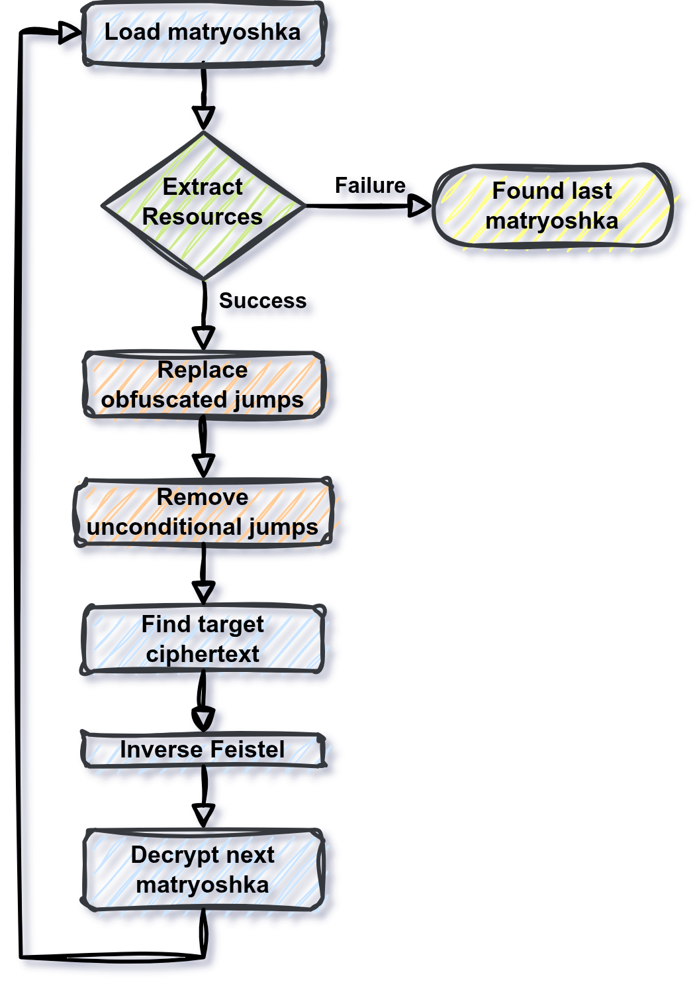
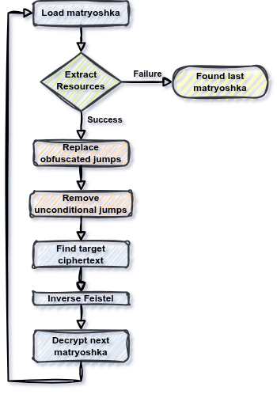

## Crackmes One CTF 2026 -  Matryoshka v2 - (Hard - 912)
### 14-21/02/2026 (7d)
___

## Description

*Just like the nested Russian dolls after which this challenge is named, the deeper you dig, the more layers you’ll uncover. `5Ecrets_WiThIn_Rus$14N_DOL1s`*
___


### Solution

We start from `main()` in `LicenseChecker.exe`:
```c
int __fastcall main(int argc, const char **argv, const char **envp) {
  /* ... */
  fp = fopen("license.bin", "rb");
  /* ... */
  license[fread(license, 1u, size, fp_)] = 0;
  fclose(fp_);
  LibraryA = LoadLibraryA("Doll.dll");
  CheckPassword = GetProcAddress(LibraryA, "CheckPassword");
  if ( CheckPassword ) {
    if ( (CheckPassword)(license_) == 1 ) {
      printf("Correct license\n");
      return 0;
    } else {
      printf("Wrong license\n");
      return 3;
    }
  } else {
    printf("Could not load Doll.dll\n");
    return 2;
  }
}
```

This is very easy to follow. The license file is loaded and is verified by the `CheckPassword()`.
Let's move on to the `CheckPassword()` of `Doll.dll`:
```c
__int64 __fastcall CheckPassword(char *a1_license) {
  /* ... */
  matryoshka[0] = 0;
  check = 0;
  Size = 0;
  status_1 = u_find_n_load_resource(a1_license, matryoshka, &Size + 1, L"MATRYOSHKA");
  status_2 = u_find_n_load_resource(v3, &check, &Size, L"CHECK");
  i = -1;
  do
    ++i;
  while ( a1_license[i] );                      // strlen
  if ( !i && status_1 && status_2 )
    return 1;
  v7 = Size;
  buf = VirtualAlloc(0, (Size + 1), 0x3000u, 0x40u);
  exec_CHECK_sc = buf;
  /* ... */
  memcpy(buf, check, v7);
  v11 = *a1_license;
  v12 = *(a1_license + 1);
  v25 = 0;
  v24[0] = v11;
  v24[1] = v12;
  lic_ok = exec_CHECK_sc(v24);
  VirtualFree(exec_CHECK_sc, 0, 0x8000u);
  if ( !lic_ok )
    return 0;

  v14 = HIDWORD(Size);
  v15 = malloc(HIDWORD(Size));
  memcpy(v15, matryoshka[0], v14);
  ModuleHandleA = GetModuleHandleA("advapi32");
  if ( !ModuleHandleA )
    ModuleHandleA = LoadLibraryA("advapi32");
  ProcAddress = GetProcAddress(ModuleHandleA, "SystemFunction033");
  if ( ProcAddress ) {
    matryoshka[1] = a1_license;
    LODWORD(matryoshka[0]) = 32;
    v22 = v15;
    LODWORD(check) = v14;
    (ProcAddress)(&check, matryoshka);          // cryptsp_SystemFunction032 ~> RC4 decrypt
  }
  nxt_doll = u_load_next_doll(v15, v14);
  free(v15);
  /* ... */
  v19 = sub_180001D48(nxt_doll);
  if ( !v19 )
    return 0;
  return v19(a1_license + 32);                  // use the next 32 bytes from license
}
```

First function loads **2** resources (`CHECK` and `MATRYOSHKA`) from the dll using function
`u_find_n_load_resource()` at `180001014h`. The `CHECK` resource is an -obfucated- shellcode.
Function executes this shellcode by passing the next **32** bytes from the license
(`lic_ok = exec_CHECK_sc(v24)`). If it returns **1**, then it decrypts the `MATRYOSHKA`
resource using RC4.

How do we know this is RC4? We search for `cryptsp_SystemFunction032` and we find:
[Alternative use cases for SystemFunction032](https://s3cur3th1ssh1t.github.io/SystemFunction032_Shellcode/).

By looking at `u_load_next_doll()` at `180001940h`, we expect the decrypted resource to be another
dll:
```c
char **__fastcall u_load_next_doll(int *Src, SIZE_T a2) {
  /* ... */
  if ( a2 < 0x40 )
    goto LABEL_4;
  if ( *Src != 'ZM' )
    goto LABEL_54;
  v6 = Src[15];
  /* ... */
  GetNativeSystemInfo(&SystemInfo);
  v14 = ~(SystemInfo.dwPageSize - 1LL);
  v15 = v14 & (*(v8 + 20) + SystemInfo.dwPageSize - 1LL);
  /* ... */
}
```

We do not have to look further into this function (e.g., how `sub_180001D48()` works).

Let's extract the resources and check the `CHECK`:
```
$ wrestool -l Doll.dll
--type=10 --name='CHECK' --language=0 [type=rcdata offset=0x70f4 size=1352414]
--type=10 --name='MATRYOSHKA' --language=0 [type=rcdata offset=0x1513d4 size=66775040]
--type=24 --name=2 --language=1033 [offset=0x40ffbd4 size=145]
```

```
$ wrestool -x --raw -o ./resources Doll.dll
```
___


### Shellcode Obfuscation

We now load the `CHECK` resource, which is essentially a 64-bit obfuscated shellcode.
The shellcode is full of jumps. The real instructions are scattered across the jump
mess:
```
    seg000:00000000         jmp     loc_451EA

    seg000:000451EA loc_451EA:
    seg000:000451EA         jmp     loc_111766

    [..... MANY MORE JUMPS .....]

    seg000:000689BD loc_689BD:
    seg000:000689BD         jmp     loc_FBFDF

    seg000:000FBFDF loc_FBFDF:
    seg000:000FBFDF         mov     [rsp+8], rcx   ; <---- FIRST INSN
    seg000:000FBFE4         jmp     loc_1434B9

    seg000:001434B9 loc_1434B9:
    seg000:001434B9         jmp     loc_C9997

    [..... MANY MORE JUMPS .....]

    seg000:0010C327 loc_10C327:
    seg000:0010C327         jmp     sub_11BDE4

    seg000:0011BDE4         sub     rsp, 68h   ; <---- SECOND INSN
    seg000:0011BDE8         jmp     loc_12A71A
```

Furthermore, many of these direct jumps are also obfuscated:
```
    seg000:000451EA         jge     loc_111766
    seg000:000451F0         push    rax
    seg000:000451F1         mov     rax, rdx
    seg000:000451F4         pop     rax
    seg000:000451F5         jl      loc_111766
```

```
    seg000:00111784         jg      loc_BD223
    seg000:0011178A         pushfq
    seg000:0011178B         cmp     rax, 0
    seg000:0011178F         popfq
    seg000:00111790         jle     loc_BD223
```

As you can see we have a blocks of **opposite conditional jumps**, so one of these jumps
will be taken. That is, this block is equivalent to a `jmp loc_111766`.

We will attack this obfuscation into two phases. In the first phase we will remove the
opposite jumps: We will scan the whole shellcode looking for blocks "opposite" conditional
jumps and we will replace them with a direct jump and a nop sled.

For more details, please refer to the [replace_jcc.py](./replace_jcc.py).

Then we are left with the obfuscation of the direct jumps only. This exact obfuscation was
used in the
[Where Am I? (10th Flare On)](https://github.com/ispoleet/flare-on-challenges/tree/master/flare-on-2023/05_where_am_i) challenge, so we can reuse the code as it is.

For more details, please refer to the [jmp_deobf.py](./jmp_deobf.py).
___


### Reversing the Shellcode

Let's now look at the clean, deobfuscated shellcode:
```c
bool __fastcall sub_0(__int64 a1, __int64 a2, __int64 a3, _BYTE *a4_license, int a5, int a6) {
  /* ... */
  lic_len = 0;
  for ( i = a4_license; *i; ++i )
    ++lic_len;
  if ( lic_len != 32 )
    return 0;
  for ( j = 0; j < 4; ++j )
    buf[j] = u_do_feistel(a1, a2, a3, *(_QWORD *)&a4_license[8 * j]);
  return u_bit_check_2F6(a1, a2, a3, buf[0])
      && (unsigned __int8)u_bit_check_34A(a1, a2, v7, buf[1], v8, v9, v16)
      && (unsigned __int8)u_bit_check_39D(a1, a2, v10, buf[2], v11, v12, v17)
      && (unsigned __int8)u_bit_check_3F0(a1, a2, v13, buf[3], v14, v15, v18);
}
```

```c
unsigned __int64 __fastcall u_do_feistel(__int64 a1, __int64 a2, __int64 a3, unsigned __int64 a4) {
  /* ... */
  buf[0] = 0xEFB1957A;
  buf[1] = 0x3BAECF7;
  buf[2] = 0x8C982983;
  buf[3] = 0x781BCDB6;
  for ( i = 0; i < 32; ++i )
    buf[i + 4] = i ^ buf[i % 4];
  for ( j = 0; j < 32; ++j )
    a4 = __PAIR64__(a4, (unsigned int)sub_444(a1, a2, buf[j + 4], a4) ^ HIDWORD(a4));
  return a4;
}
```

```c
__int64 __fastcall sub_444(__int64 a1, __int64 a2, int a3, unsigned int a4) {
  return a3 ^ ((a4 >> 25) | (a4 << 7));
}
```

At first we check if the license block is **32** bytes and then, we split it and we
pass it through a **32** round [Feistel Network](https://en.wikipedia.org/wiki/Feistel_cipher).

After the encryption of the license block, program verifies the ciphertext in a very unusual
(and smart) way. Let's look at the first `u_bit_check_34A()` function:
```c
__int64 __fastcall sub_34A(int a1, int a2, int a3, int a4, int a5, int a6, __int64 a7) {
  return sub_34E(a1, a2, a3, a4, a5, a6, a7);
}

char __fastcall sub_34E(__int64 a1, __int64 a2, __int64 a3, unsigned __int64 a4) {
  if ( (a4 & 1) != 0 )
    return 0;
  else
    return sub_4C5(a1, a2, a3, a4 >> 1);
}

char __fastcall sub_4C5(__int64 a1, __int64 a2, __int64 a3, unsigned __int64 a4) {
  return sub_4C6(a1, a2, a3, a4);
}

char __fastcall sub_4C6(__int64 a1, __int64 a2, __int64 a3, unsigned __int64 a4) {
  if ( (a4 & 1) != 0 )
    return 0;
  else
    return sub_606(a1, a2, a3, a4 >> 1);
}

/* ... */

bool __fastcall sub_5276(__int64 a1, __int64 a2, __int64 a3, __int64 a4) {
  return a4 == 1;
}
```

The ciphertext is verified **one bit at a time**. If the bit is correct, we advance to the
next function that checks the next bit.

Now we have to extract the target buffer from all these functions. Since the shellcode
is well formatted there are several ways to do it (statically, dynamically, or symbolically).
I chose the last option: I used [angr](https://angr.io/) to symbolically execute the shellcode
and extract the variables that cause `sub_0()` to return **1**. We run the script and we
get the following ciphertext:
```
FABBD91F04381F89
D13F557D1B36E7CC
501AEBA922F2C44C
857A1BEA6419CE73
```

For more details, please refer to the [bit_checks.py](./bit_checks.py).
___


### Decrypting the Next Matryoshka

At this point we have everything we need. The Feistel Network is invertible by definition,
so we can decrypt the ciphertext and find the correct license block:
```
M0Oo8zjHkcPSWFzCxmw6jrj1RgNPucTH
```

Then we can use this as a key to decrypt the next matryoshka.

For more details, please refer to the [crack.py](./crack.py).
___


### Automatic the Process

The next matryoshka is exactly the same with the `Doll.dll` (the obfuscation randomizes it
a lot, but the clean shellcode is the same, except the constants in `buf[0:4]`). So we can
repeat the same process for the next doll until we decrypt all of them:



We run the [main.py](./main.py) script and after **50** dolls we get the final dll which also
contains the flag:
```c
__int64 CheckPassword() {
  MessageBoxW(0, L"CMO{1NsiD3_EV3RY_stOrY_lIe$_an0TH3r_s70Ry_WAITiNG_7o_bE_oPEn3d}", L"Flag", 0);
  return 1;
}
```

The correct [license.bin](./license.bin) is:
```
M0Oo8zjHkcPSWFzCxmw6jrj1RgNPucTHnE0OSzTLiLdrMGsKxaP34YlM8LHyOVtB41PDnuoUhyOZQKi3VX9VBpSN1BwNwGgxYoGsu8zPTrtnnJaYUgs63QFnztGi9jb3mpkxi4CzyLpaplSNfCsiXPKcfgxmDNbefLMBmmOnGopH5ro5neXyk5XluG3MbAJwShXHN8qMc6UziZc5RtGnUMZt3JQSZmPUiQRXaq0qMGx56kRI3acoaASBfRKU9SklXShPoGDfsDGzSnVkFC8KjLrVPSFJvQqJjPXuUkfonwGxayY4l4mUZegwQaf4HYYFnZh0RIr3gJeDTNzft0hf7atapmHHEXDc8sVxrZ4p0HshMDnHD0us9WKc33OoQCAc8iiOy81uP5b5slU7HQ0sKaqoXxNsaIBAVqGeUSX9wZ4mup7ycXaCegjSwjdKLuxjSDORjMnc5IQ4EqLqStDNN4EvdoMWAlAgCLeloR0UCrASNtwNtGIYXokxEFiN0DjlKJtvgdSC5opwW6VFSWDiyAfIeq1l7QS22i1Q99efyBoFHtISp1qxyMIGNS6J4vTDXliSiSCD0L0w30mPcNtKGvVywYDasg73vSFPwBQXMlLicHX9PPCkW9o6b3fOfnqeoxBgg3YdQ6hPveSp6Xi5JEf4YrwwPHERCm7GwEiag3Z17NRj9M6dz96LMiUfXelXxJ63nXSQ0e9eELh5DyCU0nK7OKEfVT0fvoa5soVi7A5ABF1T7Wi0nMV15Fe7rT0OLV6UpefmBZD3JjAArjCvVXbHRYyZOuIf4qtihb4uCUCjFIprFfGr2LfBnnZghQskuavSfoRzMwRjQuDH5ubgWaNlBBMk5DrcFMNQl5KlqOmNEuB3yA1DYl1BAKu8eA3qKNVPPm4eaWAK0hYHPzYyDL187mwVm57DvTsab5bGTfzZlSPIdnXFTai2Nl218tQBxc1xVHRKLSOfVhvVu6QyVx5T7OJe6jgmqXqeN8rR9g3vGBC5SNriUwe8KilrIU0RnxTlpPL88qoSRpfJWYdk0dHfTn1Y3mP1MOJDyqoLbIHoUpNreDUXHwsvJ8OCH9qg34uOHadBAFvslwaJY6Kdq7AzJ6AFSPXMEXaT568QESzlVjYU1pjQENpMXy7qzuqX2ESzWkblV1unRFZTavYKo9jT2HD6zDB5E3CCo36S7IlnJDCoI15eR8aRewZlTg3dC3F3m4qlsK7Xnm6KvimfyBO7NcvYik5uflTDjMXSK0DGCakF2a9GAEgIAQkMwy8QNE6Y1DhvBl9c6s7SDrHkO0HIiOgWzZYJvuUtBqiN6I4eJdeRBiamjiyUJvoWazijTGSRK9rVcH8Z7CN03j1tx6tqfK7rFheKhGtuwlJqu0v49GrrFkqJsfjpaFmQK0qvOab8Ukhf4F2owFwdhzb9xwvg9Bnt3Wp60zrMTGICBbkYDCFHiyvH1N6SQiwdLKoboz4BdU3Yf4zLSQKVHFA1lAArgl7BJ8aClz1W04LzQH4rQ6c4V42oWpPbFiXpoNzWlP7rg4GuNYlCdlKnmNQtXtmrdUUy2sPG5CLjB3Jp7TDRYQWzMVSRtW9NFgRhOv2y
```

We use the license and we get the gooboy message:



For more details, please refer to the [main.py](./main.py).

So the flag is: `CMO{1NsiD3_EV3RY_stOrY_lIe$_an0TH3r_s70Ry_WAITiNG_7o_bE_oPEn3d}`
___
