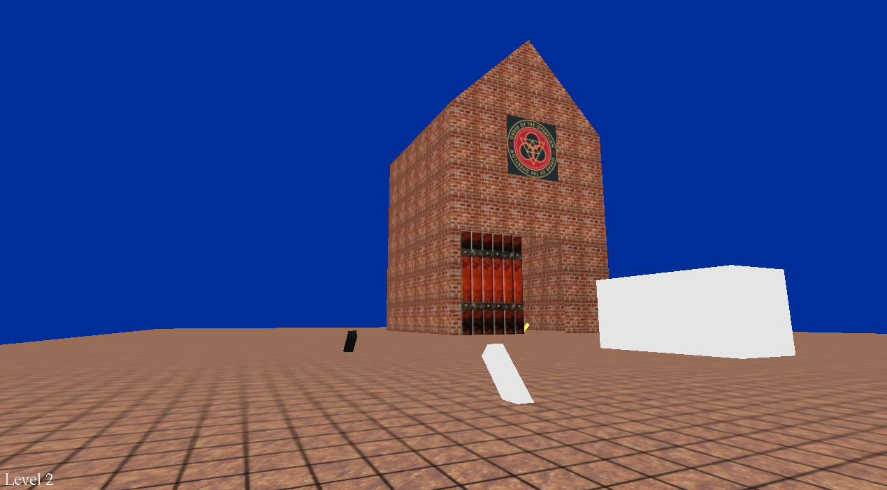

## DEF CON CTF Qualifier 2021 - Rick (RE 200)
##### 01-03/05/2021 (48hr)
___

### Description

*Don't Open The Door*
___

### Solution

The binary is written using OpenGL and C++ STL and it basically implements a game.
Player moves with the `a`, `s`, `d` and `w` keys and camera moves with the arrows:


It is very important to **understand what the game really does**. As the description says, we
"have to" open the door in the house. To do that, we move close to the black switch and we press
`e` (we can find that if look at the binary). Then the switch toggles and becomes white, the black
cube in the middle moves up and also becomes white and the door opens:


We move inside the house, where there is a yellow switch:


We toggle the yellow switch and games advances to `Level 2`. We have to do this fast though
(`< ~10` seconds); if we are too slow we will get a `Disconnected :-(` error and the game does
not proceed to the next level:


On `Level 2` we have **2** switches where any of them lifts the cube and opens the door:



So the game is clear now: We have to find out which switches to set in order to make the door open.
On each level we can have more and more switches and "walls" (the cubes in the middle).
*The correlation between the switches and the walls is unknown*; We do not really know which switch
activates which walls. Also **not all walls have to be up to open the door**. In fact,
**when the topmost wall is up the door opens**. We continue playing the game, but after `Level 11`
things start becoming unmanageable:


It is really impossible to properly set all the switches and get into the room without hitting the
timeout. Logic says that **if we pass a certain number of levels we will get the flag**.
It is now time to look at the binary.

___

### Reversing The Binary

Binary is implemented using OpenGL and contains C++ STL structures. Let's start from `main`
(I have renamed all functions to make code easier to follow):
```c
int __fastcall main(int argc, char **argv, char **envp) {
  game_state *state; // rbx

  u_initialize_glut(argc, argv);
  u_enable_gl_caps();
  u_register_callbacks();
  state = operator new(0x120uLL);
  u_init_game_state_struct(state);
  glo_game_state = state;
  u_talk_to_server(state);
  u_register_timer_init();
  glutMainLoop();                               // Once called, this routine will never return
  return 0;
}
```

`main` initializes the `glut` environment and then registers a few callback functions to handle
various the pressed keys and render the screen:
```c
void __fastcall u_register_callbacks() {
  glutDisplayFunc(u_callback_display);
  glutKeyboardFunc();
  glutKeyboardUpFunc(u_callback_keyboard_up);
  glutSpecialFunc();
  glutSpecialUpFunc(u_callback_special_up);
  glutReshapeFunc(u_callback_reshape);
  glutIgnoreKeyRepeat(1LL);
}
```

```c
void __fastcall u_register_timer_init() {
  // void glutTimerFunc(unsigned int msecs, void (*func)(int value), value);
  glutTimerFunc(0LL, u_callback_timer_func, 0LL);
}
```

```c
void __fastcall u_callback_timer_func(int a1_value) {
  glutTimerFunc(16LL, u_callback_timer_func, 0LL); // re-register itself after 16ms
  u_dispatch_pressed_key();
  u_render_game_state();
  glutPostRedisplay();
}
```

Inside `u_init_game_state_struct` at `555555567206h`, there is a call to `u_connect_to_server`
at `5555555651F0h`:
```c
void __fastcall u_init_game_state_struct(game_state *state) {
  /* ... */
  state->field_28 = 0LL;
  state->socket = u_connect_to_server();
  state->current_level = 0;
  /* ... */  
}
```

```c
int __fastcall u_connect_to_server() {
  /* ... */
  setsockopt(sock, 1, 20, &si128, 0x10u);
  if ( !gethostbyname("rick.challenges.ooo") )
    goto SOCK_ERROR;
  addr = 0LL;
  addr.sa_family = 2;
  __memmove_chk();
  *addr.sa_data = 0xF710;                       // 4343
  if ( connect(sock, &addr, 0x10u) < 0 )
    goto SOCK_ERROR;
  buf = 0;
  p_buf = &buf;
  do {                                          // check recv header ('RICK')
    if ( recv(sock, p_buf, 1uLL, 0) != 1 )
      goto SOCK_ERROR;
    ++p_buf;
  } while ( p_buf != &canary );
  if ( memcmp(&buf, "RICK", 4uLL) ) {
SOCK_ERROR:
    std::__ostream_insert<char,std::char_traits<char>>();
    std::endl<char,std::char_traits<char>>();
    goto LABEL_10;
  }
  return sock;
}
```

Function connects to `rick.challenges.ooo` at port `4343` and expects to read the word `RICK`.
Going back to `main`, another important function is called: `u_talk_to_server` at `55555555BC00h`
that receives the data for the current level from the server:
```c
void __fastcall u_talk_to_server(game_state *state) {
  /* ... */
  canary = __readfsqword(0x28u);
  // To find out that the field below is the level field do the following:
  // 1. Search for "Level" string follow XREF to see where it's used (inisde u_print_level)
  // 2. Toggle the first switch using `e` and move into the room
  // 3. Set a breakpoing when 'e' is pressed and toggle the second switch
  // 4. Set a breakpoint inside u_print_level and continue execution
  ++state->current_level;
  p_buf = &buf;
  do {
    nread = recv(state->socket, p_buf, 1uLL, 0);
    insert_left = nread;
    if ( nread != 1 || buf == 'OK' ) { // BAD!
      std::__ostream_insert<char,std::char_traits<char>>(std::cerr, "disconnected", 12LL);
      /* ... */
      return;
    }
    ++p_buf;
  } while ( &canary != p_buf );                   // read 4 bytes
  if ( !state->switch_output )
    return;
  buf_ = buf;
  key_RICK = 'KCIR';
  state->serv_buf_len = buf;
  // This is executed when we get the flag (it simply prints the flag to the screen)
  if ( buf_ == 'KCIR' ) {                       // This is probably when we get the flag?
    if ( u_recv_many(state->socket, &buf, 4u) == -1 )// read buffer length
    {
ERROR:
      state->switch_output = 0;
      return;
    }
    buf_len = buf;
    serv_buf = state->serv_buf;
    socket = state->socket;
    state->serv_buf_len = buf;
    if ( u_recv_many(socket, state->serv_buf, buf_len) == -1 )
      state->switch_output = 0;
    serv_buf_len = state->serv_buf_len;
    if ( serv_buf_len ) {
      state->serv_buf[0] ^= 'R';                // Do a Vigenere cipher with RICK as key (decrypt)
      if ( serv_buf_len > 1 ) {
        key_len = 1LL;
        do {
          state->serv_buf[key_len] ^= *(&key_RICK + (key_len & 3)); // flag decrypt
          ++key_len;
        } while ( key_len != serv_buf_len - 2 + 2LL );
      }
      flag = flag_;                             // flag
      v93 = serv_buf_len;
      /* ... */
      flag_len = v93;
      flag__ = flag;
    } else {
      flag_len = 0LL;
      flag = flag_;
      flag__ = flag_;
    }
STR_OK:
    /* ... */
    flag = flag_;
    cnt_str_contents = flag_;
END:
    /* ... */
  }
  // ----------------------------------------------------
  // ACTUAL CODE STARTS FROM HERE
  server_buffer = state->server_buffer;
  if ( server_buffer ) {
    free(server_buffer);
    buf_ = state->serv_buf_len;
  }
  buflen = 4 * buf_;
  serv_buf2 = malloc((4 * buf_));
  sock = state->socket;
  state->server_buffer = serv_buf2;
  if ( u_recv_many(sock, serv_buf2, buflen) == -1 )// read at least 3 DWORDS: A, B, Cs
    goto ERROR;
  switch_output = state->switch_output;
  if ( !switch_output )
    return;
  // clean up / reinitialize all structs
  u_initialize_player_pos_v2(state->player_pos_ptr);
  u_initialize_struct_5_v2(state->switch_obj_ptr);
  u_initialize_struct_1_v2(state->struct_1_ptr);
  u_initialize_struct_3_v2(state->struct_3_ptr);
  stl_ptr = state->some_stl_ptr;
  /* ... */  
  // initialize again
  glo_tree_size_maybe = 1;
  v16 = operator new(0x68uLL);
  server_buffer_1 = state->server_buffer;
  struc_3 = v16;
  A = *server_buffer_1;
  v20 = (v16 + 0x38);
  state->field_28 = v16;
  memset(v16, 0, 0x68uLL);
  *(v16 + 9) = v16 + 0x38;
  *(v16 + 3) = v16 + 8;
  *(v16 + 4) = v16 + 8;
  *(v16 + 0xA) = v16 + 0x38;
  x = (v16 + 8);
  root_node_op = A % 10;
  struct_5_maybe = operator new(0x30uLL);
  tmp = glo_tree_size_maybe;
  struct_5_maybe->begin = 0LL;
  *&struct_5_maybe->end = 0LL;
  prev_node = x;
  glo_tree_size_maybe = tmp + 1;
  curr_node = *(struc_3 + 16);
  struct_5_maybe->field_28 = 0LL;
  struct_5_maybe->size = tmp;
  struct_5_maybe->node_operation = root_node_op;
  struct_5_maybe->next = 0;
  struct_5_maybe->switch_output = 0;
  struct_5_maybe->struct_3 = struc_3;
  /* ... */
  cur_node = curr_struc_5;
  // LSB(B) = how many children node has
  if ( root_node_op && (B_lsb = server_buffer_1[4], server_buffer_1[4]) ) {
    ii = 0;
    headera = &curr_struc_5->begin;
    j = 8;
    do {                                         // insert all nums after first 2
      while ( 1 ) {
        inserted = u_rb_tree_insert_op_2(struc_3, &server_buffer_1[j], 1, &curr_struc_5);// Insert Cs
        v61 = *&cur_node->end;
        v93 = inserted;
        if ( v61 == cur_node->field_28 )
          break;
        *v61 = inserted;
        j += curr_struc_5;
        ++ii;
        *&cur_node->end = v61 + 8;
        if ( B_lsb == ii )
          goto BREAK_LOOP;
      }
      ++ii;
      u_vector_insert(headera, v61);
      j += curr_struc_5;
    }
    while ( B_lsb != ii );
BREAK_LOOP:
    *(struc_3 + 96) = cur_node;
  } else {
    *(struc_3 + 96) = curr_struc_5;
    if ( !cur_node )
      abort();
  }

  for ( last_child = cur_node->begin; *&cur_node->end != last_child; last_child = (last_child + 8) ) {
    v63 = *&last_child->size;
    u_recursive_func_1(v63);
  }
  // A % 10 = node operation
  switch ( cur_node->node_operation ) {
    case 0u:
      goto AFTER_SWITCH;
    case 1u:                                    // NOT
      cur_node->switch_output = *(*cur_node->begin + 12LL) ^ 1;
      goto AFTER_SWITCH;
    case 2u:                                    // AND
      val = cur_node->begin;
      cur_node->switch_output = 1;
      if ( val == last_child )
        goto AFTER_SWITCH;
      while ( *(*val + 12LL) )
      {
        val += 8LL;
        if ( last_child == val )
          goto AFTER_SWITCH;
      }
      goto SWITCH_OUTPUT_ZERO;
    case 3u:                                    // OR
      v76 = cur_node->begin;
      cur_node->switch_output = 0;
      if ( v76 == last_child )
        goto AFTER_SWITCH;
      while ( !*(*v76 + 12LL) )
      {
        v76 += 8LL;
        if ( last_child == v76 )
          goto AFTER_SWITCH;
      }
      cur_node->switch_output = 1;
      goto AFTER_SWITCH;
    case 4u:                                    // XOR
      begin = cur_node->begin;
      for ( cur_node->switch_output = 0; last_child != begin; begin = (begin + 8) )
      {
        if ( *(*&begin->size + 12LL) )
          cur_node->switch_output ^= 1u;
      }
      goto AFTER_SWITCH;
    case 5u:                                    // NAND
      v74 = cur_node->begin;
      cur_node->switch_output = 1;
      if ( v74 == last_child )
        goto SWITCH_OUTPUT_ZERO_;
      while ( *(*&v74->size + 12LL) )
      {
        v74 = (v74 + 8);
        if ( last_child == v74 )
          goto SWITCH_OUTPUT_ZERO_;
      }
      goto SET_SWITCH_OUTPUT;
    case 6u:                                    // NOR
      v72 = cur_node->begin;
      cur_node->switch_output = 0;
      if ( v72 == last_child )
        goto SET_SWITCH_OUTPUT;
      while ( !*(*v72 + 12LL) )
      {
        v72 += 8LL;
        if ( last_child == v72 )
          goto SET_SWITCH_OUTPUT;
      }
SWITCH_OUTPUT_ZERO_:
      switch_output = 0;
SET_SWITCH_OUTPUT:
      cur_node->switch_output = switch_output;
      goto AFTER_SWITCH;
    case 7u:                                    // ALTERNATE
      v67 = cur_node->begin;
      v68 = *v67;
      v69 = (v67 + 1);
      v70 = *(v68 + 12);
      cur_node->switch_output = 1;
      if ( v69 == last_child )
        goto AFTER_SWITCH;
      break;
    case 8u:                                    // 1st and last are 0
      first = cur_node->begin;
      if ( *(*first + 12LL) )
        goto SWITCH_OUTPUT_ZERO;
      if ( (last_child - first) != 8 )
        cur_node->switch_output = *(last_child[-1].field_28 + 12) == 0;
      goto AFTER_SWITCH;
    case 9u:                                    // 1st and last are 1
      first_ = cur_node->begin;
      if ( !*(*first_ + 12LL) )
        goto SWITCH_OUTPUT_ZERO;
      if ( (last_child - first_) != 8 )
        cur_node->switch_output = *(last_child[-1].field_28 + 12) != 0;
      goto AFTER_SWITCH;
    default:
      u_error_updateState(cur_node);
  }
  while ( 1 ) {
    v71 = v70;
    v70 = *(*&v69->size + 12LL);
    if ( v70 == v71 )
      break;
    v69 = (v69 + 8);
    if ( last_child == v69 )
      goto AFTER_SWITCH;
  }
SWITCH_OUTPUT_ZERO:
  cur_node->switch_output = 0;
AFTER_SWITCH:
  struct_1_ptr = state->struct_1_ptr;
  state->switch_obj_ptr->field_28 = state->field_28;
  u_initialize_struct_1_v2(struct_1_ptr);
  // Draw switches and walls
  sub_55555555EE60(&state->struct_1_ptr->struct_1, state, v1, v2, v3, v4);
  sub_55555556DFD0(&state->struct_3_ptr->field_0);
}
```

This function does quite a lot of things. First of all, it reads **4** bytes which is a little
endian number and corresponds to the number of (random) DWORDs that will follow. There are two
special cases however:
  * The **4** bytes are the word `KO` (or `KOKO`). That means we either have sent the wrong data
    to the server, or we got a timeout.
  * The **4**bytes are the word `RICK`. That means we have completed all levels and it's time to
    receive the flag.

The **random** numbers that we receive from the server look like this:
```
  0x99C9A710, 0x44E2AC02, 0xF00C81D9, 0xC1217502, 0x2C7C9F44, 0xFD499FE6, 0xB09214AB, 0xF0608702, 0x34C8AE04, 0xA5D62A18
```

However, for every number we either keep the **modulo 10** or the **LSB**, so even though each time
we receive different random numbers, the actual contents remain the same.

These numbers are actually correspond to a **pre-order tree traversal array notation**. The first
number (modulo **10**) corresponds to the **node operation** (we will see it later on). We have
**10** different operations according ot the last `switch` statement in the function. The next
number (modulo **256**) corresponds to the **number of children for that node**. Then, 
**there is a recursion**: the third number, corresponds to the node operation of the leftmost
child of the root node and so on. When the node operation becomes **0**, it means we have reached
a leaf node and recursion returns. Back to our example, the random numbers correspond to the 
following tree:
```
99C9A710, op:2, #2
F00C81D9, op:3, #2
2C7C9F44, op:0, #-1
FD499FE6, op:0, #-1
B09214AB, op:3, #2
34C8AE04, op:0, #-1
A5D62A18, op:0, #-1
[+] Root node: ['99C9A710']
    Curr node: 99C9A710, op:AND, #2, exp:1
      OR: i:0 Next:3
        Curr node: F00C81D9, op:OR, #2, exp:1
          None: i:0 Next:0
          None: i:1 Next:0
      OR: i:1 Next:3
        Curr node: B09214AB, op:OR, #2, exp:1
          None: i:0 Next:0
          None: i:1 Next:0
```

After the tree is set up, function draws the switches and the walls and the game starts.
Every time we press a key we end up calling `u_dispatch_pressed_key` at `55555555A570h` to
process the pressed keystroke:
```c
void __fastcall u_dispatch_pressed_key() {
  /* ... */
  switch_obj_ptr = glo_game_state->switch_obj_ptr;
  struct_3 = switch_obj_ptr->struct_3;
  if ( struct_3 != switch_obj_ptr->begin ) {
    while ( 1 ) {
      if ( u_REVERSE_ME_IMPORTANT(key_pressed) ) {// only 'e' returns 1 ?
        prev_key_down = switch_obj_ptr->begin;
        /* ... */
      }
      /* ... */
    }
    // update arrows
    player_pos_ptr = glo_game_state->player_pos_ptr;
    if ( !struct_5_get_next(glo_game_state->switch_obj_ptr) ) {
      key = key_pressed & 0x7FFFFFFF;
      if ( key == 'f' ) {
        u_turn_camera_left(player_pos_ptr, 5.0);
      } else if ( key > 'f' ) {
        if ( key == 'g' )
          u_turn_camera_down(player_pos_ptr, 2.0);
      } else if ( key == 'd' ) {
        u_turn_camera_right(player_pos_ptr, 5.0);
      } else if ( key == 'e' ) {
        u_turn_camera_up(player_pos_ptr, 2.0);
      }
    }
    goto LABEL_14;
  }
}
```

The most important function here is obviously the  `u_REVERSE_ME_IMPORTANT` at `555555559F20h`:
```c
bool __fastcall u_REVERSE_ME_IMPORTANT(char a1_key_pressed) {
  /* ... */
  canary = __readfsqword(0x28u);
  player_pos_struc = glo_game_state->player_pos_ptr;
  switch_obj_ptr = glo_game_state->switch_obj_ptr;
  struct_1_ptr = glo_game_state->struct_1_ptr;
  x = u_struct_2_get_x(player_pos_struc);
  y = u_struct_2_get_y(player_pos_struc);
  z = u_struct_2_get_z(player_pos_struc);
  if ( struct_5_get_next(switch_obj_ptr) )
    return 0;
  switch ( a1_key_pressed ) {
    case 'A':
    case 'a':
      v7 = 5;
      while ( 1 ) {
        u_move_left(player_pos_struc);
        if ( sub_55555555EA10(struct_1_ptr, player_pos_struc) )
          break;
        if ( !--v7 )
          goto EVERY_OTHER_KEY_PRESSED;
      }
      u_move_left(player_pos_struc);
      break;
    case 'D':
    case 'd':
      v5 = 5;
      while ( 1 ) {
        u_move_right(player_pos_struc);
        if ( sub_55555555EA10(struct_1_ptr, player_pos_struc) )
          break;
        if ( !--v5 )
          goto EVERY_OTHER_KEY_PRESSED;
      }
      u_move_right(player_pos_struc);
      break;
    case 'S':
    case 's':
      prev_key_down = switch_obj_ptr->begin;
      struct_3 = switch_obj_ptr->struct_3;
      a1._M_color = 32;
      v14 = 10;
      if ( switch_obj_ptr->begin != sub_55555555C8D0(struct_3, prev_key_down, &a1) )
        v14 = 40;
      v15 = 0;
      while ( 1 ) {
        u_move_down(player_pos_struc, 1.0);
        if ( sub_55555555EA10(struct_1_ptr, player_pos_struc) )
          break;
        if ( v14 == ++v15 )
          goto EVERY_OTHER_KEY_PRESSED;
      }
      u_move_down(player_pos_struc, -1.0);
      break;
    case 'W':
    case 'w':
      v8 = switch_obj_ptr->begin;
      v9 = switch_obj_ptr->struct_3;
      a1._M_color = 32;
      v10 = 40;
      if ( switch_obj_ptr->begin == sub_55555555C8D0(v9, v8, &a1) )
        v10 = 10;
      v11 = 0;
      while ( 1 ) {
        u_move_up(player_pos_struc, 1.0);
        if ( sub_55555555EA10(struct_1_ptr, player_pos_struc) )
          break;
        if ( v10 == ++v11 )
          goto EVERY_OTHER_KEY_PRESSED;
      }
      u_move_up(player_pos_struc, -1.0);
      break;
    default:
      break;
  }                                             // Check 'a', 's', 'd', 'w' keys and move to the 4 directions
EVERY_OTHER_KEY_PRESSED:
  if ( (a1_key_pressed & 0xDF) != 'E' )         // 0xDF = 1101 1111 (ignore 0x20 which is upper/lower case). Smart! ;)
  {
    result = 0;
    if ( a1_key_pressed == 0x1B )               // If escape was pressed, exit
      exit(0);
    return result;
  }
  // ------------------------- 'e' was pressed -------------------------
  // Toggle the switch
  game_state = glo_game_state;
  a3.begin = 0LL;
  *&a3.end = &a3.struct_3;
  v17 = glo_game_state->field_28;
  a3.field_28 = &a3.struct_3;
  LODWORD(a3.struct_3) = 0;
  v18 = *(v17 + 16);
  v51 = 0LL;
  if ( v18 ) {
    *&a1._M_color = &a3.next;
    v19 = u_rb_tree_clone(&a3.next, v18, &a3.struct_3);// recursive
    v20 = v19;
    /* ... */    
  }
  /* ... */
LABEL_33:
  if ( v21 != &a3.struct_3 ) {
    // This loop goes as many times as the number of switches
    while ( 1 ) {
      curr_switch = v21->field_28;
      if ( !curr_switch->node_operation )
      {
        M_left = a1._M_left;
        size = curr_switch->size;
        v29 = &a1._M_parent;
        if ( !a1._M_left )
          goto LABEL_42;
        do {
          while ( size <= M_left->end ) {
            v29 = M_left;
            M_left = M_left->struct_3;
            if ( !M_left )
              goto LABEL_40;
          }
          M_left = M_left->begin;
        }
        while ( M_left );
LABEL_40:
        if ( v29 == &a1._M_parent || size < v29->end ) {
LABEL_42:
          v48 = v29;
          v30 = operator new(0x30uLL);
          v30->end = size;
          v30->field_28 = 0LL;
          p = v30;
          v31 = sub_55555555C980(&a1, v48, &v30->end);
          v33 = v31;
          if ( v32 )
          {
            if ( v31 || &a1._M_parent == v32 )
              LOBYTE(v34) = 1;
            else
              v34 = p->val_1 < v32->val_1;
            std::_Rb_tree_insert_and_rebalance(v34, p, v32, &a1._M_parent);
            v29 = p;
            ++v54;
          }
          /* ... */
        }
        if ( u_is_touching_switch(v29->field_28, x, y, z) )
          break;
      }
      v21 = std::_Rb_tree_increment(v21);
      if ( v21 == &a3.struct_3 )
        goto SWITCH_MISSED;
    }
    u_toggle_switch(curr_switch);
    glo_game_state->field_38 = 1;
    goto TEARDOWN;
  }
SWITCH_MISSED:
  game_state = glo_game_state;
SWITCH_INSIDE_ROOM:
  if ( game_state->switch_output
    && u_is_touching_switch(game_state->struct_1_ptr->switch_pos, x, y, z)
    && *(*(glo_game_state->field_28 + 0x60) + 12LL) )
  {
    u_send_to_server(glo_game_state);
    u_talk_to_server(glo_game_state);
  }
TEARDOWN:
  /* ... */
  return 1;
}
```

The first part of this function dispatches keys `a`, `s`, `d` and `w` which simply move the player.
Then there is the special key `e`. First of all function checks if player is close to a switch using
`u_is_touching_switch` at `55555556B210h`, otherwise nothing happens. If player is close to a switch
then function `u_toggle_switch` at `55555556C110h` is called to activate/deactivate the switch.
Finally, if the activated switch is the special switch inside the room (label `SWITCH_INSIDE_ROOM`),
then code calls `u_send_to_server` at `55555555CD40h` to send the state of the switches to the
server:
```c
void __fastcall u_send_to_server(game_state *a1_ispo_struct) {
  /* ... */ 
  if ( a1._M_right != &a1._M_parent )           // build binary string for server
  {
    while ( 1 ) {
      M_parent = M_right[1]._M_parent;
      if ( *(M_parent + 1) )
        goto LABEL_10;
      // Build a string and add 0 or 1 based on the switch state.
      if ( *(M_parent + 12) ) {
        std::__ostream_insert<char,std::char_traits<char>>();
LABEL_10:
        M_right = std::_Rb_tree_increment(M_right);
        if ( M_right == &a1._M_parent )
          break;
      } else  {
        std::__ostream_insert<char,std::char_traits<char>>();
        M_right = std::_Rb_tree_increment(M_right);
        if ( M_right == &a1._M_parent )
          break;
      }
    }
  }
  /* ... */
  memset(v15, 0, n + 2);
  strncpy(send_buf, src, len);
  send_buf[len] = '\n';
  *key = 'KCIR';
  if ( len ) {                                   // Vigenere cipher
    *send_buf ^= 'R';
    i = 1;
    ii = 1LL;
    if ( len > 1 ) {
      do {
        send_buf[ii] ^= key[i++ & 3];
        ii = i;
      } while ( i < len );
    }
  }
  nsend = send(a1_ispo_struct->socket, send_buf, len + 1, 0);  
  /* ... */
}
```

`u_send_to_server` creates a binary string that encodes the state of every switch and sends it
to the server. Before sending it, it encrypts it with Vigenere cipher using `RICK` as key. The
response of the server is handled by `u_talk_to_server`. If the state all switches is correct,
server will reply with the tree layout of the next level. If not, it will reply with a `KO`.
Hence, it's not enough just activate the switch inside the room (even if we somehow bypass the
door); the switches must be in a correct state.

Finally, we have `u_toggle_switch` at `55555556C110h`, which is called to alternate the state of
a switch and move the walls:
```c
void __fastcall u_toggle_switch(switch_obj *a1) {
  /* ... */
  if ( a1->node_operation )
    goto ABORT;

  curr_switch_output = a1->switch_output;
  v2 = *(a1->struct_3 + 96);
  /* ... */
  a1->switch_output = 1;
  if ( !v2 )
    goto ABORT;
  for ( i = v2->begin; *&v2->end != i; ++i ) {
    v6 = *i;                                    // each is a number sequence
    u_recursive_func_1(v6);
  }
  switch ( v2->node_operation ) {               // this is A
    case 0u:
      return;
    case 1u:
LABEL_18:
      v2->switch_output = *(*v2->begin + 12LL) ^ 1;// NOT
      return;
    case 2u:                                    // AND
      v18 = v2->begin;
      v2->switch_output = 1;
      if ( v18 == i )
        return;
      while ( *(*v18 + 12LL) ) {                // if this becomes 0, then output is set to 0 ~> XOR!
        v18 += 8LL;
        if ( i == v18 )
          return;
      }
      goto SET_SWITCH_OUTPUT_TO_ZERO;
    case 3u:                                    // OR
      v19 = v2->begin;
      v2->switch_output = 0;
      if ( v19 == i )
        return;
      while ( !*(*v19 + 12LL) ) {               // stop when you hit the first one
        v19 += 8LL;
        if ( i == v19 )
          return;
      }
SET_SWITCH_OUTPUT_TO_ONE:
      v2->switch_output = 1;
      return;
    case 4u:                                    // odd number of switches ~> XOR
      v20 = v2->begin;
      v2->switch_output = 0;
      if ( v20 != i ) {
        do {
          if ( *(*v20 + 12LL) )
            v2->switch_output ^= 1u;
          v20 += 8LL;
        } while ( i != v20 );
      }
      return;
    case 5u:                                    // NAND
      v21 = v2->begin;
      v2->switch_output = 1;
      if ( v21 == i )
        goto POP_SWITCH_OUTPUT_VAL_N_RETN;
      while ( *(*v21 + 12LL) ) {
        v21 += 8LL;
        if ( i == v21 )
          goto POP_SWITCH_OUTPUT_VAL_N_RETN;
      }
      goto SET_TO_ONE;
    case 6u:                                    // NOR
      v22 = v2->begin;
      v2->switch_output = 0;
      if ( v22 == i )
        goto SET_TO_ONE;
      while ( !*(*v22 + 12LL) ) {
        v22 += 8LL;
        if ( i == v22 ) {
SET_TO_ONE:
          curr_switch_output = 1;
          break;
        }
      }
POP_SWITCH_OUTPUT_VAL_N_RETN:
      v2->switch_output = curr_switch_output;
      return;
    case 7u:
      v23 = v2->begin;
      curr = *v23;
      next = (v23 + 1);
      next_output = *(curr + 12);               // 0 or 1
      v2->switch_output = 1;
      if ( next == i )                          // i == end
        return;
      break;
    case 8u:
CASE_8:                                         // When 1st and last children are 0
      v7 = v2->begin;
      if ( *(*v7 + 12LL) )                      // if 1st child is nonzero ~> output = 0
        goto SET_SWITCH_OUTPUT_TO_ZERO;
      // if we reach here, 1st child is 0.
      if ( (i - v7) != 8 )                      // if we have >1 children
        v2->switch_output = (*(i - 1))->switch_output == 0;// the last child must be 0
      return;
    case 9u:
CASE_9:                                         // When 1st and last children are 1
      v5 = v2->begin;
      if ( !*(*v5 + 12LL) )                     // if 1st child is zero ~> output = 0
        goto SET_SWITCH_OUTPUT_TO_ZERO;
      if ( (i - v5) != 8 )
        v2->switch_output = (*(i - 1))->switch_output != 0;
      return;
    default:
      u_error_updateState_0();
  }
  while ( 1 ) {
    curr_output = next_output;
    next_output = (*next)->switch_output;
    if ( next_output == curr_output )
      break;                                    // if equal return 0 ~> they must be alternating (1-0-1-0-... or 0-1-0-1...)
    if ( i == ++next )
      return;
  }
SET_SWITCH_OUTPUT_TO_ZERO:
  v2->switch_output = 0;
}
```

**This function has the core logic of the whole challenge**. Based on the node operation (between
**0** and **9**) function sets `v2->switch_output`. Let's take for example case **2**. In order
to set `v2->switch_output` to **1**, then **all children nodes must be set (1)**. Otherwise, 
`v2->switch_output` becomes zero. That is exactly what an `AND` logic gate does. However, a child
node may have more nodes underneath, so the value of the child node may not be known. That's why
we have to work **recursively** and call `u_recursive_func_1` at `55555555ACB0h`:
```c
// positive sp value has been detected, the output may be wrong!
void __fastcall u_recursive_func_1(switch_obj *a1) {
  /* ... */
  for ( i = a1->begin; a1->end != i; ++i ) {
    v3 = *i;
    u_recursive_func_1(v3); // recursively solve the subtree
  }
  switch ( a1->node_operation ) {
    case 0u:
      return;
    case 1u:
      a1->switch_output = *(*a1->begin + 12LL) ^ 1;
      return;
    case 2u:
      prev_key_down = a1->begin;
      a1->switch_output = 1;
      if ( prev_key_down == i )
        return;
      while ( *(*prev_key_down + 12LL) ) {
        prev_key_down += 8LL;
        if ( i == prev_key_down )
          return;
      }
      goto LABEL_14;
    case 3u:
      /*
       * Logic is exactly the same as u_toggle_switch
       */      
    default:
      u_error_updateState(a1);
  }
  /* ... */
LABEL_14:
  a1->switch_output = 0;
}
```

The leaves of the tree are the switches which we control. The walls are the intermediate nodes.
If the `a1->switch_output` for the root node (i.e., the topmost wall) is set, then the door opens.
Below are the logic gates implemented for each node operation:
```
  0: None
  1: NOT
  2: AND
  3: OR
  4: XOR
  5: NAND
  6: NOR
  7: Alternate 1 and 0
  8: First and last are 0
  9: First and last are 1
```

After the tree is updated (i.e., the `a1->switch_output` for every node), we go back to 
`u_callback_timer_func` which calls `u_render_game_state`  at `55555555A690h`:
```c
void __fastcall u_render_game_state() {
  /* ... */
  if ( some_stl_ptr ) {
    v3 = u_rb_tree_clone2(&a1, some_stl_ptr, &a1._M_parent);
    v4 = v3;
    /* ... */
    if ( leftmost_node != &a1._M_parent ) {
      v9 = &v2->_M_parent;
      do {
        /* ... */
        M_parent = v12->dword_cnt;
        switch_output = *(M_parent + 12);
        // Check value of switch/wall output
        if ( *(M_parent + 1) ) {
          wall_height = node_counter->wall_height;
          if ( !switch_output ) {
            if ( *&wall_height <= -30.0 ) {
              u_move_object_wall_or_door(node_counter);// wall is already down
            } else {
              // When the wall goes down
              *&v29 = *&wall_height - 5.0;      // decrement wall height
              node_counter->wall_height = v29;
              if ( *&v29 < -30.0 )
                node_counter->wall_height = 3253731328;
              u_move_object_wall_or_door(node_counter);
              v35 = 0;
            }
            goto LABEL_52;
          }
          if ( *&wall_height < 50.0 ) {
            // When the wall goes up
            *&new_wall_height = *&wall_height + 5.0;
            node_counter->wall_height = new_wall_height;// increment wall height
            if ( *&new_wall_height > 50.0 )
              node_counter->wall_height = 1112014848;
            u_move_object_wall_or_door(node_counter);
            v35 = 0;
          } else {
            u_move_object_wall_or_door(node_counter);// wall is already up
          }
        } else {
          door_pos = node_counter->door_pos;
          if ( !switch_output ) {
            if ( *&door_pos > -45.0 ) {
              // close door (1 step)
              *&new_door_pos = *&door_pos - 1.0;
              v35 = 0;
              if ( *&new_door_pos < -45.0 )
                node_counter->door_pos = 0xC2340000;
              else
                node_counter->door_pos = new_door_pos;
            }
LABEL_52:
            v39 = v41;
            strcpy(v41, "0x111111");
            v40 = 8LL;
            u_some_string_ctor(node_counter, &v39);
            goto LABEL_28;
          }
          if ( *&door_pos < 45.0 ) {
            // open door (1 step)
            *&new_door_pos_ = *&door_pos + 1.0;
            v35 = 0;
            if ( *&new_door_pos_ > 45.0 )
              node_counter->door_pos = 0x42340000;
            else
              node_counter->door_pos = new_door_pos_;
          }
        }
        v39 = v41;
        strcpy(v41, "0xffffff");
        v40 = 8LL;
        u_some_string_ctor(node_counter, &v39);
LABEL_28:
        if ( v39 != v41 )
          operator delete(v39);
        leftmost_node = std::_Rb_tree_increment(leftmost_node);
      } while ( leftmost_node != &a1._M_parent );
    }
    game_state = glo_game_state;
    v2 = glo_game_state->field_28;
  }
  /* ... */
  if ( v24 >= 170.0 )
  {
    u_move_object_wall_or_door(struct_1);
    sub_55555556B3C0(v23, 0.0, 0.0, 0.0);
LABEL_63:
    if ( v35 )
      glo_game_state->field_38 = 0;
    goto LABEL_65;
  }
  *&v25 = v24 + 1.0;
  struct_1->field_58 = v25;
  if ( *&v25 > 170.0 )
    struct_1->field_58 = 0x432A0000;
  u_move_object_wall_or_door(struct_1);
  sub_55555556B3C0(v23, 0.0, 0.0, 0.0);
  /* ... */
}
```

By setting breakpoints to this function, we can see exactly which objects are moving in the game.
If you notice, the height of the wall does not change; it only moves up and now. If you look at
the picture below, you can see that the wall is initially underneath the floor and moves up
when it gets activated:


___

### Finding a Valid Tree Solution

At this point everything is clear: All we have to do is to find which switches to activate in
order to make the topmost wall move up. All we need is just one valid assignment of the switches
(for example to make an `OR` node return **1** we make every child node return **1**; there are
many other valid assignments e.g., first child node returns **1** and all nodes returns **0**
but any valid assignment is fine). However there is a caveat. Some nodes may need to return **0**
(for example if the topmost node is a `NOT` node with a single child, then the child node must
return **0**), so we make the node output a variable. Based on that, the following functions
find a valid switch assignment:
```python
def gen_correct_value(op, expected_result, idx=0):
    """Generate a correct value for a subtree given the `op` and `expected_result`."""
    # There can be many solutions. Just generate a valid one.
    return {
        0: None,
        # NOT
        #   If expected result is 1, then return 0. Otherwise return 1
        #   (NOTE: NOT nodes always have 1 child).
        1: 0 if expected_result == 1 else 1,
        # AND
        #   If expected result is 1, then make everything 1. Otherwise make everything 0.
        2: 1 if expected_result == 1 else 0,
        # OR
        #   If expected result is 1, then make everything 1. Otherwise make everything 0.
        3: 1 if expected_result == 1 else 0,
        # XOR
        #   If expected result is 1 set the first to 1 and everything else to 0. That
        #   way the XOR will always be 1 no matter how many nodes we have.
        #   If expected result is 0, simply set everything to 0.
        4: (1 if idx == 0 else 0) if expected_result == 1 else 0,
        # NAND
        #   If expected result is 1, then make everything 0. Otherwise make everything 1.
        5: 0 if expected_result == 1 else 1,
        # NOR
        #   If expected result is 1, then make everything 0. Otherwise make everything 1.
        6: 0 if expected_result == 1 else 1,
        # Alternate 1 and 0
        #   If expected result is 1, then set to 1 for even indices and 0 for odd.
        #   Otherwise, set everything to 0.
        7: (1 if idx % 2 == 0 else 0) if expected_result == 1 else 0,
        # First and last are 0
        #   If expected result is 1, then set everything to 0.
        #   Otherwise set everything to 1 (we keep things simple).
        8: 0 if expected_result == 1 else 1,
        # First and last are 1
        #   If expected result is 1, then set everything to 1.
        #   Otherwise set everything to 0.
        9: 1 if expected_result == 1 else 0
    }[op]


def find_tree_sol(tree, curr_node, expected_result=1):
    """Find a leaf assignment that makes a subtree return `expected_result`."""
    operation  = networkx.get_node_attributes(tree, 'op')[curr_node]
    n_children = networkx.get_node_attributes(tree, 'n' )[curr_node]

    sol = ''
    for i, n in enumerate(tree[curr_node]):
        nxt_op = networkx.get_node_attributes(tree, 'op')[n]
        val = gen_correct_value(operation, expected_result, i)

        if nxt_op == 0:
            # We have a leaf. Make correct value a string.
            sol += f'{val}'          
        else:
            # Recursively make the subtree return the expected value.
            sol += find_tree_sol(tree, n, val, depth + 1, dbg)  

    return sol    
```

After we pass **100** levels, we get the flag.

For more details, please refer to the [rick_crack.py](./rick_crack.py) script.

So, the flag is: `OOO{never_gooonna_give_yooou_up_but_Im_gooonna_give_yooou_this_flag}`
___
