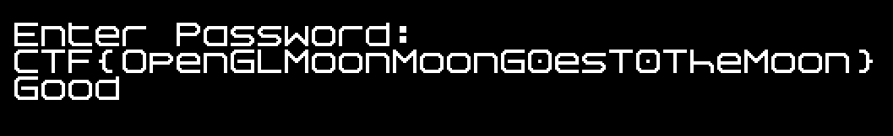

## Google CTF 2017 - moon (RE 500pt)
##### 17-18/06/2017 (48hr)
___
### Description

???


___
### Solution

The function that checks the password is PW_CHECK_498A10() (starts at 0x00498A10).
When password is 0x20 (32) characters long, then the actual verification takes place:
```assembly
.text:0000000000498CB4     mov     rax, cs:PASS_LEN_4CA088
.text:0000000000498CBB     cmp     rax, 1Fh
.text:0000000000498CBF     jbe     loc_498D50
.text:0000000000498CC5     cmp     rax, 20h
.text:0000000000498CC9     jz      loc_498D76
```

The 32 byte password is passed to HASH_401BF0() which generates a hash based on the password:
```assembly
.text:0000000000498D76 loc_498D76:                             ; CODE XREF: PW_CHECK_498A10+2B9j
.text:0000000000498D76     mov     rbx, [rsp+268h+var_228]
.text:0000000000498D7B     mov     [rsp+268h+Size], 0
.text:0000000000498D84     mov     rax, [rsp+268h+var_210]
.text:0000000000498D89     mov     [rsp+268h+var_1E8], 0
.text:0000000000498D91     mov     rcx, cs:PASSWORD_4CA080     ; Str
.text:0000000000498D98     mov     rdx, rbx
.text:0000000000498D9B     mov     [rsp+268h+Memory], rax
.text:0000000000498DA0     call    HASH_401BF0                 ; generate hash array (A) from password
.text:0000000000498DA5     test    al, al
```

Then the hash is converted to a hex string:
```assembly
.text:0000000000498DD0 ; This code converts raw array A to a hex string (512 bytes)
.text:0000000000498DD0
.text:0000000000498DD0 MAIN_LOOP_498DD0:                       ; CODE XREF: PW_CHECK_498A10+43Cj
.text:0000000000498DD0     mov     r8d, [rbx]                  ; for each 4 bytes of A (256)
.text:0000000000498DD3     xor     eax, eax
.text:0000000000498DD5     mov     rdx, r13
.text:0000000000498DD8     mov     rcx, rsi
.text:0000000000498DDB     mov     [rsp+268h+var_208], 0
.text:0000000000498DE4     mov     [rsp+268h+var_200], ax
.text:0000000000498DE9     call    SPRINTF_4016D0              ; cast 8 raw bytes to hex string
.text:0000000000498DEE     mov     r8, rsi
.....
.text:0000000000498E49     cmp     r12, rbx
.text:0000000000498E4C     jnz     short MAIN_LOOP_498DD0      ; for each 4 bytes of A (256)
.text:0000000000498E4E     mov     r8, [rsp+268h+Size]         ; Size
.text:0000000000498E53     cmp     r8, cs:qword_4CA068
.text:0000000000498E5A     mov     rbx, [rsp+268h+Memory]
.text:0000000000498E5F     jz      COMPARE_498F87
```

Then the hex hash is compared against a constant hash:
```assembly
.text:0000000000498F87 COMPARE_498F87:                         ; CODE XREF: PW_CHECK_498A10+44Fj
.text:0000000000498F87     test    r8, r8
.text:0000000000498F8A     jz      short loc_498FA3            ; correct!
.text:0000000000498F8C     mov     rdx, cs:Buf2                ; Buf2
.text:0000000000498F93     mov     rcx, rbx                    ; Buf1
.text:0000000000498F96     call    memcmp                      ; FINAL COMPARISON
.text:0000000000498F9B     test    eax, eax
.text:0000000000498F9D     jnz     WRONG_498E65
.text:0000000000498FA3
.text:0000000000498FA3 loc_498FA3:                             ; CODE XREF: PW_CHECK_498A10+57Aj
.text:0000000000498FA3     mov     cs:RESULT_4CA0AC, 2         ; correct!
.text:0000000000498FAD     jmp     END_498E6F

.....

.text:0000000000498E65
.text:0000000000498E65 WRONG_498E65:                           ; CODE XREF: PW_CHECK_498A10+58Dj
.text:0000000000498E65     mov     cs:RESULT_4CA0AC, 1
.text:0000000000498E6F
.text:0000000000498E6F END_498E6F:                             ; CODE XREF: PW_CHECK_498A10+572j
```

Obviously, if RESULT_4CA0AC is 2 then we get the "Good" message. Otherwise we get the "Nope" message.
The target hash is the following 512-byte hash:
```
30c7ead97107775969be4ba00cf5578f1048ab1375113631dbb6871dbe35162b
1c62e982eb6a7512f3274743fb2e55c818912779ef7a34169a838666ff3994bb
4d3c6e14ba2d732f14414f2c1cb5d3844935aebbbe3fb206343a004e18a092da
ba02e3c0969871548ed2c372eb68d1af41152cb3b61f300e3c1a8246108010d2
82e16df8ae7bff6cb6314d4ad38b5f9779ef23208efe3e1b699700429eae1fa9
3c036e5dcbe87d32be1ecfac2452ddfdc704a00ea24fbc2161b7824a968e9da1
db756712be3e7b3d3420c8f33c37dba42072a941d799ba2eebbf86191cb59aa4
9a80ebe0b61a79741888cb62341259f62848aad44df2b809383e09437928980f
```

The weird part of this crackme, is that inside HASH_401BF0() there's nothing really interesting.
If we look very carefully at the function, we'll see that the hash is generated during an indirect
call at ig75icd64.dll:
```assembly
.text:0000000000401D9C     mov     r8d, 3B9ACA00h
.text:0000000000401DA2     mov     edx, 1
.text:0000000000401DA7     mov     rcx, rax
.text:0000000000401DAA     mov     r12, rax
.text:0000000000401DAD     mov     rax, cs:off_4AB1E0
.text:0000000000401DB4     call    qword ptr [rax]
```

Then this hash is returned by the function. So what's going on here? If we enter inside the dll, 
IDA fails to give us the function name. So we start following the XREFs:
```assembly
.rdata:00000000004AB1E0 off_4AB1E0      dq offset qword_4CC528  ; DATA XREF: sub_401BF0+1BDr
```

```assembly
.bss:00000000004CC528 qword_4CC528    dq ?                    ; DATA XREF: sub_4032C0+568w
.bss:00000000004CC528                                         ; .rdata:off_4AB1E0o
```

```assembply
.text:0000000000403821                 lea     rcx, aGlclipcontrol ; "glClipControl"
.text:0000000000403828                 mov     cs:qword_4CC528, rax
.text:000000000040382F                 call    rbx
```

Nice! Function addresses are resolved (by name) at runtime. So, this function is glClipControl().
However there are many functions that are called indirectly. We should rename all functions to
make the reversing process easier. So to avoid renaming them manually, we write a small IDC 
script [rename.idc](./rename.idc) that does this for us. 


After renaming we can see what the code does:
```assembly
.text:0000000000401D65     mov     rbx, cs:glUnmapNamedBuffer_4AB3C0
.text:0000000000401D6C     mov     ecx, 90D2h
.text:0000000000401D71     call    qword ptr [rbx]
.text:0000000000401D73     mov     rax, cs:glDispatchComputeGroupSizeARB_4AB250
.text:0000000000401D7A     mov     r8d, 1
.text:0000000000401D80     mov     edx, 8
.text:0000000000401D85     mov     ecx, 8
.text:0000000000401D8A     call    qword ptr [rax]
.text:0000000000401D8C     mov     rax, cs:glFinish_4AB290
.text:0000000000401D93     xor     edx, edx
.text:0000000000401D95     mov     ecx, 9117h
.text:0000000000401D9A     call    qword ptr [rax]
.text:0000000000401D9C     mov     r8d, 3B9ACA00h
.text:0000000000401DA2     mov     edx, 1
.text:0000000000401DA7     mov     rcx, rax
.text:0000000000401DAA     mov     r12, rax
.text:0000000000401DAD     mov     rax, cs:glClipControl_4AB1E0
.text:0000000000401DB4     call    qword ptr [rax]
.text:0000000000401DB6     sub     eax, 911Bh
.text:0000000000401DBB     and     eax, 0FFFFFFFDh
.text:0000000000401DBE     jz      short loc_401E15
.text:0000000000401DC0     mov     rax, cs:glMemoryBarrierByRegion_4AB360
.text:0000000000401DC7     mov     ecx, 0FFFFFFFFh
.text:0000000000401DCC     call    qword ptr [rax]
.text:0000000000401DCE     mov     rax, cs:glDeleteTextures_4AB230
.text:0000000000401DD5     mov     rcx, r12
.text:0000000000401DD8     call    qword ptr [rax]
.text:0000000000401DDA     mov     edx, 88BAh
.text:0000000000401DDF     mov     ecx, 90D2h
.text:0000000000401DE4     call    qword ptr [rbp+0]
.text:0000000000401DE7     lea     rdx, [rax+100h]
.text:0000000000401DEE     mov     r8, rax
.text:0000000000401DF1     jmp     short loc_401E00
```

Here we have some execution using OpenGL. glDispatchComputeGroupSize() starts the execution, glFinish() 
waits for the execution to finish and glMemoryBarrierByRegion() fetches the results. Execution in the GPU
through OpenGL is done using shaders, so we should find these shaders. All we have to do is to set a 
breakpoint at the time that shaders are being registered:
```assembly
.text:0000000000401780     mov     rax, cs:glCreateShaderProgramEXT_4AB210
.text:0000000000401787     mov     rsi, r8
.text:000000000040178A     mov     edi, ecx
.text:000000000040178C     mov     ecx, edx
.text:000000000040178E     call    qword ptr [rax]
```

From here we can catch 3 shaders:
```c
#version 430

in vec3 vert_xyz;
in vec2 vert_uv;

out vec2 frag_uv;

void main() {
  frag_uv = vert_uv; 	// Rescale the scene so it's in pixels.
  
  gl_Position = vec4(
	(vert_xyz.x / 1280.0) * 2.0 - 1.0, -((vert_xyz.y / 720.0)* 2.0 - 1.0), vert_xyz.z /1024.0, 1.0);
}
```

```c
#version 430

in vec2 frag_uv;
out vec4 frag_colour;
uniform sampler2D tex;

void main() {
  frag_colour = vec4(1.0, 1.0, 1.0, 1.0) * texture(tex, frag_uv);
}
```

```c
#version 430
layout(local_size_x=8, local_size_y=8) in;
layout(std430, binding=0) 

buffer shaderExchangeProtocol { 
	uint state[64];
	uint hash[64];
	uint password[32];
};

vec3 calc(uint p) {
	float r = radians(p);
	float c = cos(r);
	float s = sin(r);

	mat3 m = mat3(c,  -s,   0.0, 
	              s,   c,   0.0, 
				  0.0, 0.0, 1.0);
				  
	vec3 pt  = vec3(1024.0, 0.0, 0.0);
	vec3 res = m * pt;
	
	res += vec3(2048.0,2048.0,0.0);	
	return res;
}

uint extend(uint e) {
	uint i;
	uint r = e^0x5f208c26;
	
	for(i=15; i<31; i+=3) {
		uint f=e<<i;
		r^=f;
	}
	return r;
}

uint hash_alpha(uint p) {
	vec3 res=calc(p);
	return extend(uint(res[0]));
}

uint hash_beta(uint p) {
	vec3 res=calc(p);
	return extend(uint(res[1]));
}

void main(){
	uint idx = gl_GlobalInvocationID.x + gl_GlobalInvocationID.y*8;
	uint final;
	
	if (state[idx]!=1){return;}
	
	if ((idx&1)==0) {
		final=hash_alpha(password[idx/2]);
	}
	else{ final=hash_beta(password[idx/2]); }
	
	uint i;
	
	for(i=0; i<32; i+=6) {
		final^=idx<<i;
	}
	
	uint h=0x5a;
	
	for(i=0; i<32; i++) {
		uint p = password[i];
		uint r = (i*3)&7;
		p = (p<<r)|(p>>(8-r));
		p &= 0xff;
		h ^= p;
	}
	
	final ^= (h | (h<<8) | (h<<16) | (h<<24));
	hash[idx] = final;
	state[idx] = 2;
	
	memoryBarrierShared();
}
```

These shaders register an 8x8 small region, and for each pixel the 3rd shader is invoked. Shader
uses the coordinates as an index to the password and to the hash.

##### Cracking the hash

At this point we know how the hash is generated and we have the target hash. All we have to do is
to crack it and extract the password. If we look at the shader, we'll see that it calculates only
a small part of the hash each time. Because we're in GPU, there are many instances of the shader that
are executed in parallel, so each part of the hash depends only on the password and not from the 
already calculated hashes (otherwise parallel execution wouldn't be possible). This simplyfies as 
lot the cracking process as we can break password character by character.


If we know `h` we can recover `final`. Because we know the `idx` we can easily recover the
result of `hash_alpha` and `hash_beta` functions. Recovering `e` from  `hash` it's easy 
because the 15 LSBits are only depended on e. Because the output of calc is in the range
`[1024, 3072]` we can only look at the 15 LSBits and get e. From there we can trivially
extract the character.

The last problem here is that `h` depends on the whole password, which we don't know. However,
`h` is invariant; it's the same among all hash calculations and it's only 1 byte long. So we 
can easily brute force it. By applying the crack, we get 2 solutions, which one of them is valid:
```
Flag found! 
Flag found! CTF{OpenGLMoonMoonG0esT0TheMoon}
```

We can try the flag to verify that it works:


For more details please take a look at [moon_crack.py](./moon_crack.py)
___
