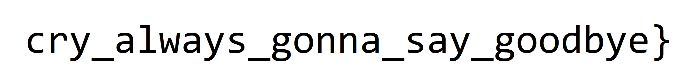

## HITCON CTF 2022 - gocrygo (RE 274)
##### 24-26/11/2022 (48hr)
___

### Description
 
> If your file system is encrypted clap your hands.
>
> If your file system is encrypted clap your hands.
>
> If your file system is encrypted and you really want to decrypt it.
>
> Then find the encryption key with your bare hands.

**Note:** *The flag provided in the directory is HITCON{...}. Please submit the flag in hitcon{...}.*

*There are three files in this challenge:*

*`gocrygo:` A crypto-ransomware.*

*`gocrygo_victim_directory:` The directory fucked up by this ransomware.*

*`core:` The ransomware's core dump when infecting gocrygo_victim_directory.*

*Unfortunately, no decryption service is available :(*

*Your goal is to:*

* Reverse gocrygo
* Figure out the encryption algorithm it uses
* Find the encryption key in the core dump
* Decrypt the entire infected directory.
* Find the flag in gocrygo_victim_directory.


**Note:** *The encryption algorithm is a common cryptographic algorithm (I'm too dumb to implement one myself). In other words, please don't waste your time figuring out the details of the algorithm. Once you know which algorithm it uses, you can move on to the next phase and try to excavate the encryption key from the core.*

**Attachment:** [https://storage.googleapis.com/hitconctf2022/gocrygo-ea6cb09b28eb26c415f74493bf651609149483c5.tar.gz](https://storage.googleapis.com/hitconctf2022/gocrygo-ea6cb09b28eb26c415f74493bf651609149483c5.tar.gz)

*Author: wxrdnx*
___


This is a stripped binary written in Go. Let's start from `main` at `0x221A61`
(it takes some effort to find it) and focus on the most important parts (we do some
renaming and cleanup):
```c
__int64 u_MAIN() {
  /* ... */
  v0 = u_base64_special_decode(                 // linux
         "Q2hbZDBHUQ==", 0xCuLL);
  v1 = 5LL;
  /* ... */
  if ( !u_strcmp("linux", 5uLL, v0, v2) ) {
    v98 = &loc_221B3F;
    v119 = u_base64_special_decode(             // Please run this binary on Linux
             "OmknXU9GKEhKN0ZgJj1EQlBETjFAVkteZ0VkOGRHREJNVmVES1Ux", 0x34uLL);
    /* ... */    
  }
  /* ... */
  v4 = sys_getcwd(cwd_buf, 0x1000uLL);          // Start from current dir
  /* ... */
  gocrygo_victim_directory = u_base64_special_decode(// gocrygo_victim_directory
                               "QjVfOiNIIlYmJkcla0guQmwuM2ZCbFtjcEZEbDJG", 0x28uLL);
  /* ... */
  if ( (sub_2100AB(v117, v15, &gFileDoesNotExists) & 1) != 0 ) {
    v98 = &loc_221D82;
    // Hey! I don't want to break your file system. Please create a directory './gocrygo_victim_directory' and place all the files you want to encrypt in it.
    v17 = u_base64_special_decode(
            "ODdkJmkrQSFcZERmLXFFK0VxNzNGPEdbRCtDXUEmQDtAITJEZnAoQ0FuYydtK0VNZ0xGQ2Y7QStBY2xjQDw2ISZAcmMtaEZDY1MnK0NvMixBUmZoI0VkOGNUL2healVAcmNqLURkUlslQHJ1RiU/WSFra0FSZmgjRWQ5I1RAO11UdUUsOHJtQUtZRHRDYG1oNUFLWVQhQ2g3WjFII0lnSkdAPkIyK0VWTkVBU3UhdUgjUmpKQmw1Ji1GPW0=", 0xFCuLL);
    /* ... */
  }
  v133 = u_some_alloc(16LL, v16);
  v98 = &loc_221E0F;
  v21 = v142;
  gocrygo = u_base64_special_decode(aL25dkjrfzds7oq, 0x10uLL);// .gocrygo
  /* ... */
  v125 = sub_220965(v153);                      // create $CWD/gocrypto_victim_directory/.gocrygo
  /* ... */
  if ( (v24 & 1) != 0 ) {
    v128 = *v105;
    v127 = v105[1];
    v98 = &loc_221F7F;
    v141 = u_create_file(v128, v127, 578LL, 438LL);
    v115 = v31;
    v109 = v32;
    v98 = &loc_221FD2;
    v138 = v31;
    v139 = v32;
    if ( (sub_2100AB(v31, v32, &gPermissionDenied) & 1) != 0 ) {
      v98 = &loc_22201C;
      v33 = u_base64_special_decode(            // Cannot access directory 'gocrygo_victim_directory': permission denied
              "Nlhha01EZmQrMUBxMChrRiEsIi1FYi9hJkRmVStHLVlJQC1FZDs7OT9acC1uRkQ1VCFBOC0ncUBydVgwR3BiV3FFK08nLEJsZT8wRGYtXC5BU3UzbkEs", 0x74uLL);
      /* ... */
    }
    /* ... */
    if ( v156 )
      v40 = sub_222930(v99, v101, 0LL, 0LL, v156, v157, v146);
    else
      v40 = u_search_dir_tree_maybe(v99, v101, v155[0], v155[1], v146);
    v44 = v40;
    v45 = v41;
    v46 = sub_213D32(v40, v41, 33765LL, &gSkipThisDirectory);
    /* ... */
    v129 = u_gen_pseudo_rnd_num(rnd_num, 0x18, 0x18uLL);
    /* ... */    
    for ( i = (*v50 + 8LL); ; i = v103 + 2 ) { // for each file
      /* ... */    
      sub_210387(u_REVERSE_ME_wrapper, v60);
      v56 = v102 + 1;
    }
    v30 = v104;
    v29 = &v107;
  }
  /* ... */    
  if ( *v106 )
  {
    sub_210317(v145 + 8, qword_2258C0);
    sub_210332();                               // Invoke REVERSE_ME
  }
  /* ... */    
LABEL_63:
  v98 = &loc_2226C3;
  v77 = u_base64_special_decode(                // Oops, your file system has been encrypted
          "Ok4oMm4vMEs0VkZgSlU6QmwlPydGKlZoS0FTaVEnQDwzUSNBUyNhJUFTdSF1SCNSazpBMWQ=", 0x48uLL);
  /* ... */    
  v81 = u_base64_special_decode(                // Sadly, 'gocrygo' currently does not provide any decryption services.
          "O2RqM1FHcTonY0I1XzojSCJWJUMrQ2ZQN0ViMC0xQ2pALjZEZTN1NERKc1Y+RSxvbD9CazFjdEA7Xj81QTddN2tII1JrPkRmLVw9QVREcy5AcUJeNg==", 0x74uLL);  
  /* ... */
  v85 = u_base64_special_decode("PWA4RjFFYi1BKERmOUsoQTFldXBEZjkvL0NpczYnK0ZY", 0x2CuLL);// You're doomed. Good luck
  v87 = v86;
  v88 = u_some_alloc(16LL, 44LL);
  *v88 = v85;
  *(v88 + 1) = v87;
  v149[0] = 34LL;
  v149[1] = v88;
  v98 = &loc_222874;
  result = sub_21FBB8(v149);
  sub_214930(v97, 44LL, v90, v91, v92);
  return result;
}
```


### Decoding Strings

Let's stat with the basics. Function `u_base64_special_decode` at `2214EBh` does a base64 decoding
followed by a second encoding (which turned out to be [ASCII85](https://en.wikipedia.org/wiki/Ascii85)):
```c
 while ( 1 ) {
    /* ... */
    nxt_b = b64_decoded[++v33];
    if ( nxt_b >= 0x21u ) {
      if ( nxt_b == 'z' && !v32 ) {
        decr = 0;
        goto LABEL_48;
      }
      if ( nxt_b >= 'v' ) {
        v28 = 588LL;
        goto LABEL_66;
      }
      decr = 85 * decr + (unsigned __int8)(nxt_b - 0x21);
      ++v32;
      --v30;
      if ( v32 != 5 )
        goto LABEL_37;
LABEL_48:
      if ( v25 <= v29
        || (out[v29] = HIBYTE(decr), (v29 | 1) >= v25)
        || (out[v29 | 1] = BYTE2(decr), (v29 | 2) >= v25)
        || (out[v29 | 2] = BYTE1(decr), (v29 | 3) >= v25) )
      {
LABEL_81:
        u_index_out_of_range_err();
      }
      out[v29 | 3] = decr;
      v29 += 4LL;
      goto LABEL_36;
    }
  }
  /* ... */

  else { // do the leftovers
    while ( v30-- != 0 )
      decr = 85 * decr + 84;
    v37 = v32 - 1;
    v28 = 0LL;
    v38 = v25 - v29;
    if ( v25 < v29 )
      v38 = 0LL;
    for ( i = 0LL; v37 != i; ++i )
    {
      if ( v38 == i )
        goto LABEL_81;
      out[v29 + i] = HIBYTE(decr);
      decr <<= 8;
    }
    v27 = 0LL;
  }
```

Function can be simplified as follows:
```python
def enchanced_base64_decode(enc_str):
    """Base64 decodes and custom decodes an encoded string `enc_str."""
    b64dec = base64.b64decode(enc_str)

    plain = []
    leftover = 0

    # Decode in groups of 5.
    for i in range(0, len(b64dec), 5):
        decr = 0

        for k in range(5):
            if i + k >= len(b64dec):
                leftover = 1
                break
            decr = decr*85 + ((b64dec[i + k] - 0x21) & 0xFF)
    
        if leftover:
            # We have leftovers. Decode them too.
            for j in range(k, 5):
                decr = decr*85 + 84

            for j in range(0, k-1):
                plain.append((decr >> 24) & 0xFF)
                decr <<= 8
        else:
            plain += list(struct.pack('>L', decr))

    return plain
```

Using that we can decode all strings, which are very useful understanding the program:
```
Q2hbZDBHUQ==                                ~> linux
QjVfOiNIIlYmJkcla0gu...QmwuM2ZCbFtjcEZEbDJG ~> gocrygo_victim_directory
OmknXU9GKEhKN0ZgJj1E...Z0VkOGRHREJNVmVES1Ux ~> Please run this binary on Linux
ODdkJmkrQSFcZERmLXFF...dUgjUmpKQmw1Ji1GPW0= ~> Hey! I don't want to break your file system. Please create a directory './gocrygo_victim_directory' and place all the files you want to encrypt in it.
Nlhha01EZmQrMUBxMChr...ZT8wRGYtXC5BU3UzbkEs ~> Cannot access directory 'gocrygo_victim_directory': permission denied
N1VeIklBUmxwKkRdaVYv...cjZdQHIkPzRII0loU0lL ~> Failed to encrypt %v: lucky you~~
Ok4oMm4vMEs0VkZgSlU6...JUFTdSF1SCNSazpBMWQ= ~> Oops, your file system has been encrypted.
O2RqM1FHcTonY0I1Xzoj...LVw9QVREcy5AcUJeNg== ~> Sadly, 'gocrygo' currently does not provide any decryption services.
PWA4RjFFYi1BKERmOUso...dXBEZjkvL0NpczYnK0ZY ~> You're doomed. Good luck ~
L25dKjRFZDs7OQ==                            ~> .gocrygo
```

Furthermore, to fix Golang strings in IDA we use the following script:
```python
# Make all QWORDS
for addr in range(0x205A10, 0x206258, 8):
    ida_bytes.create_qword(addr, 8)

for off in range(0x205A10+8, 0x206258, 16):
    sptr = ida_bytes.get_qword(off )
    slen = ida_bytes.get_qword(off + 8)
    ida_bytes.create_strlit(sptr, slen, STRTYPE_C)
```

### Encryption Algorithm

Moving back to `main` there is function `u_gen_pseudo_rnd_num` at `0x21FCCB` that reads **0x18**
(or **3x8** bytes from `/dev/urandom`).

Then program searches recursively for all files under the `gocrygo_victim_directory` and 
creates a list of all unencrypted (that do not end with `.qq`) file names. Please note
that the root directory should not contain the `.gocrygo` empty file. For each filename
program invokes `u_REVERSE_ME` at `222A30h` that does the actual encryption:
```c
__int128 *__fastcall u_REVERSE_ME(char *a1_path, size_t a2_pathlen, __int64 a3, __int64 *a4) {
  /* ... */
  u_read_file_contents(&filedata.data, path, pathlen);
  v253 = filedata.field_10;
  plaintext = filedata.data;
  plainlen = filedata.size;
  /* ... */
  if ( (v203 & 0x1000000000000LL) == 0 )
  {
    v72 = pathlen;
    v73 = path;
    v74 = path;
    u_is_absolute_path(v264, path, pathlen);
    if ( v264[0] )
    {
      v77 = v266;
      v78 = filename;
      if ( v264[0] != 0x4DF && v264[0] != 0x9BE5 )
LABEL_203:
        u_NULL_ptr_deref();
      v79 = u_unlinkat(filename, v266, 0LL, v75, v76);// delete original file
      /* ... */
    }
    /* ... */
    if ( v240 == 24 )
    {
      orig_keystream___ = 384;
      orig_keystream = u_some_alloc(384LL, 24LL);
      if ( v96 < 8 )
        goto LABEL_204;
      orig_keystream_ = orig_keystream;
      orig_keystream__ = orig_keystream;
      orig_keystream___ = orig_keystream;
      cipher_ = urandom_seed;
      // Triple DES ?
      u_DES_128byte_keygen(orig_keystream, urandom_seed);
      if ( v96 < 0x10 )
        goto LABEL_204;
      orig_keystream___ = orig_keystream_ + 128;
      cipher_ = urandom_seed + 8;
      u_DES_128byte_keygen(orig_keystream_ + 128, urandom_seed + 8);
      if ( v96 < 0x18 )
        goto LABEL_204;
      u_DES_128byte_keygen(orig_keystream_ + 256, urandom_seed + 16);
      v101 = 35813LL;
      v102 = 0LL;
      orig_keystream____ = orig_keystream__;
      cipher_ = 0LL;
    }
    /* ... */
    IV_ = IV;
    u_gen_pseudo_rnd_num(IV, 8uLL, 8uLL);
    /* ... */
    if ( plainlen && v249 != plaintext && &plainlen[plaintext - 1] >= v249 && &plainlen[v249 - 1] >= plaintext )
      {
        v202 = &off_2014F0;                     // crypto/cipher: invalid buffer overlap
LABEL_207:
        u_show_error(34LL, v202, jj, keystream, v14);
      }
      /* ... */
      for ( i = v213; ; v117 = i ) {
          /* ... */
          v248 = sub_214C67(IV_, v259, 8LL, 8LL, plainlen__1, 1LL);
          v247 = v193;
          v224 = &loc_223C78;
          qq_ext = u_base64_special_decode(aL29iaw, 8uLL);// .qq
          newfilename = u_mk_str_maybe(path, pathlen, qq_ext, v195);
          v232 = v196;
          v224 = &loc_223CC9;
          fd = u_create_file(newfilename, v196, 577, 420);
          if ( !v198 )
          {
            v199 = v248;
            fd_ = fd;
            u_write_file_contents(fd, v248, v247);
            u_close_file(fd_, v199);
          }
  
          v201 = 0LL;
          v186 = plainlen;
          v188 = 0LL;
          if ( plainlen > 0 )
            v201 = plainlen;
          for ( j = v261; ; *(j + v188++) = 0 ) // Zero out plaintext from memory
          {
            /* ... */
          }

          /* ... */
        }
        /* ... */        
        if ( plainlen__ )
        {
          if ( plainlen__ - 1 >= v125 )
            goto LABEL_201;
          plainlen_ = 0LL;
          ii = 0LL;
          if ( plainlen__ > 0 )
            plainlen_ = plainlen__;
          while ( plainlen_ != ii )             // XOR plaintext with keystream
          {
            if ( v125 == ii || v124 == ii || orig_keystream___ == ii )
              goto LABEL_201;
            cipher_ = cipher;
            ii[cipher] = ii[plain] ^ keystream[jj + ii];
            ++ii;
          }
        }
        /* ... */
  }
  v5 = pathlen;
  v6 = path;
  encr_failed = u_base64_special_decode(        // Failed to encrypt %v: lucky you~~
                  "N1VeIklBUmxwKkRdaVYvQHJjajZGPERsUTNacjZdQHIkPzRII0loU0lLOk4oMm4vMEs0VkZgSlU6QmwlPydGKlZoS0FTaVEnQDwzUSNBUyNhJUFTdSF1SCNSazpBMWQ=", 0x38uLL);
  /* ... */
}
```

Function reads a file into memory, it deletes it from disk, it uses a
**Triple DES (3DES) in Counter Mode (CTR)** to encrypt it and writes it back to the encrypted
(`.qq`) file. Finally, it zeroes out the memory with the plaintext. The **3** encryption keys
are the ones taken from `/dev/urandom`. The **IV** is also taken from `/dev/urandom` and is
prepended into the file (the first **8** bytes of each encrypted file are the IV).

To verify that, we create a file `ispo2.txt` and we write some data to it. We also set
breakpoints to control the data from `/dev/urandom`. We set the IV to `AAAAAAAA` and
the **3** keys to `ABCDEFGH`, `12345678` and `ISPOLEET`:
```
$ echo 'ispoleetmorebaby!' > ispo2.txt
$ hexdump -C ispo2.txt.qq 
  00000000  41 41 41 41 41 41 41 41  85 21 4a 85 83 46 67 16  |AAAAAAAA.!J..Fg.|
  00000010  d2 9b 74 26 78 51 3b 16  45 61                    |..t&xQ;.Ea|
  0000001a
```

### Recovering Encryption Keys

To recover the encryption keys we need to look at the `core` dump. While I was patching
the values taken from `urandom` I noticed that the string `/dev/urandom` was allocated
right after the keys, so I used that to find the stack location of the keys:
```
(gdb) find $rsp, $rsp+0x10000, "/dev/urandom"
    0x7fecc3580060
    1 pattern found.
(gdb) x/8xg 0x7fecc3580060-0x20
    0x7fecc3580040: 0xbd349a8f52ae89b3  0x1b8566979b593598
    0x7fecc3580050: 0x18a320b78025b482  0x00706f746b736544
    0x7fecc3580060: 0x6172752f7665642f  0x000000006d6f646e
    0x7fecc3580070: 0x0000000000000000  0x0000000000000000
(gdb) x/24xb 0x7fecc3580040
    0x7fecc3580040: 0xb3  0x89  0xae  0x52  0x8f  0x9a  0x34  0xbd
    0x7fecc3580048: 0x98  0x35  0x59  0x9b  0x97  0x66  0x85  0x1b
    0x7fecc3580050: 0x82  0xb4  0x25  0x80  0xb7  0x20  0xa3  0x18
```

That is our encryption keys are:
```
  Key #1: 0xb3,0x89,0xae,0x52,0x8f,0x9a,0x34,0xbd,
  Key #2: 0x98,0x35,0x59,0x9b,0x97,0x66,0x85,0x1b,
  Key #3: 0x82,0xb4,0x25,0x80,0xb7,0x20,0xa3,0x18
```

### Decrypting the Files

At this point, decrypting the files is easy: We know the symmetric keys for
3DES and the IVs. We first decrypt the `flag.txt.qq`:
```  
Cyrillic letters are fun right?
First part: `HITCON{always_gonna_make_you_`
Hint: The second part is at `Pictures/rickroll.jpg`
 _    _.--.____.--._
( )=.-":;:;:;;':;:;:;"-._
 \\\:;:;:;:;:;;:;::;:;:;:\
  \\\:;:;:;:;:;;:;:;:;:;:;\
   \\\:;::;:;:;:;:;::;:;:;:\
    \\\:;:;:;:;:;;:;::;:;:;:\
     \\\:;::;:;:;:;:;::;:;:;:\
      \\\;;:;:_:--:_:_:--:_;:;\
       \\\_.-"             "-._\
        \\
         \\
          \\
           \\
            \\
             \\
```

Then we decrypt the `rickroll.jpg.qq` to get the rest of the flag:



For more details, please take a look at the [gocrygo_crack.py](gocrygo_crack.py) script.

The source code of the challenge is also available in [gocrygo.go](decrypted_files/gocrygo.go).

So the flag is: `hitcon{always_gonna_make_you_cry_always_gonna_say_goodbye}`
___
