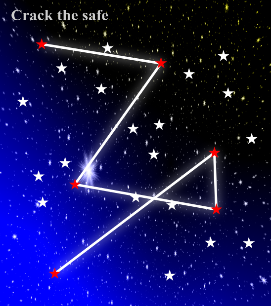
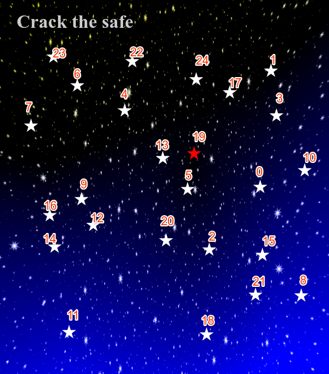
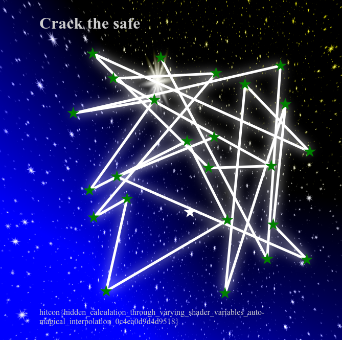

## HITCON CTF 2024 - Revisual (Reversing 255)
##### 12/07 - 14/07/2024 (48hr)
___

### Description

*Try to break into this beautiful starry vault.*

**http://revisual.chal.hitconctf.com/**


**Attachment: https://storage.googleapis.com/hitcon-ctf-2024-qual-attachment/revisual/revisual-8acf90164f9aed0ce5e4018b3e9ea66a203022e5.tar.gz**
___

### Solution

For this challenge, we' are given a website with **25** stars, where you can connect the stars
with a pattern, just like the phone unlock patterns:



The goal is to find which pattern "unlocks" the flag.

The code is implemented in javascript which is (obviously) obfuscated. To deobfuscate the code,
we first use the [JavaScript Deobfuscator](https://deobfuscate.io/) and then the
[Obfuscator.io Deobfuscator](https://obf-io.deobfuscate.io/). After that we get a reasonable
javascript code. After some renaming and cleaning up, we get the following code:
```javascript
const func_1 = function () {
  let glo_flag = true;
  return function (p1, p2) {
    const _0x1bb18e = glo_flag ? function () {
      if (p2) {
        const _0x2d8886 = p2.apply(p1, arguments);
        p2 = null;
        return _0x2d8886;
      }
    } : function () {};
    glo_flag = false;
    return _0x1bb18e;
  };
}();

const func_2 = func_1(this, function () {
  return func_2.toString().search("(((.+)+)+)+$").toString().constructor(func_2).search("(((.+)+)+)+$");
});
func_2();

window.addEventListener("load", _0xe99c5d);
var canvasObj;
var canvasCalcObj;
function _0xe99c5d() {
  canvasObj = new _0x36ee9a("canvas", 0, 0, "\n  attribute vec3 position;\n  uniform   mat4 mvpMatrix;\n  varying   vec2 vPosition;\n\n  void main(void){\n      gl_Position = mvpMatrix * vec4(position, 1.0);\n      vPosition = position.xy;\n  }\n  ", "\n#ifdef GL_ES\nprecision mediump float;\n#endif            \n\nuniform float u_time;\nuniform vec2 u_resolution;\nvarying vec2 vPosition;\n\nvec3 hash(vec2 seed){\n    vec3 p3 = fract(float(seed.x + seed.y*86.) * vec3(.1051, .1020, .0983));\n\tp3 += dot(p3, p3.yzx + 33.33);\n    return fract(p3);\n}\n\nvec3 layer(float scale, vec2 uv, float time){\n    // uv coord in cell\n    vec2 scaled_uv = uv * scale - 0.5;\n    vec2 uv0 = fract( scaled_uv ) - 0.5;\n    // cell id\n    vec2 cell_id = scaled_uv - fract(scaled_uv);\n    \n    \n    vec3 col = vec3(0);\n    float speed = 1.5;\n    // distance to a spinning random point in the cell (also surrounding cells)\n    vec3 seed = hash(cell_id);\n\n    float radiance = seed.x + time * seed.y;\n    vec2 center_of_star = vec2(sin(radiance), cos(radiance))*0.3;\n\n    // radial distort effect for star shine\n    vec2 v_to_star = uv0 - center_of_star;\n    float star_radiance = atan(v_to_star.x/v_to_star.y);\n    float star_spark_1 = sin(star_radiance*14.+radiance*6.);\n    float star_spark_2 = sin(star_radiance*8.-radiance*2.);\n    float stars = length(v_to_star) * (5.+star_spark_1+star_spark_2) * 0.03;\n    col += smoothstep(length(seed) * 0.01, 0., stars);\n    return col;\n}\nvoid main()\n{    // center global uv from -1 to 1\n    vec2 virtual_resolution = vec2(2.0, 2.0);\n    vec2 uv = (vPosition * 2. - virtual_resolution.xy) / virtual_resolution.y;\n    vec3 col = vec3(0.);//vColor.xyz;\n    \n    const float layer_count = 6.5;\n    for(float i = 0.0; i < layer_count; i+=1.){\n        float rotate_speed = u_time*0.4;\n        float scale = mod(i - rotate_speed, layer_count)*1.5;\n        vec2 offseted_uv = uv + vec2(sin(rotate_speed), cos(rotate_speed));\n        vec3 layer_col = layer(scale, offseted_uv, u_time + i*1.5);\n        \n        // we want the star to smoothly show up\n        float max_scale = layer_count * 1.5;\n        float color_amp = smoothstep(0., 1., smoothstep(max_scale, 0., scale));\n        col += layer_col * color_amp;\n    }\n    // blue background\n    col += vec3(0., 0., -0.15) * (uv.y - 0.7) * pow(length(uv), 0.5);\n    gl_FragColor = vec4(col, 1.);\n}\n  ", true);
  canvasObj.render();
  canvasCalcObj = new _0x36ee9a("canvas-calc", 650, 650, "\n  attribute vec3 position;\n  varying   float owO;\n  \n  void main(void){\n      gl_Position = vec4(position.xy, 0.0, 1.0);\n      owO = position.z;\n  }\n  ", "\n#ifdef GL_ES\nprecision highp float;\n#endif            \nvarying float owO;\n#define OvO 255.0\n#define Ovo 128.0\n#define OVO 23.0\n\nfloat OwO (float Owo, float OWO, float owO) { \n    OWO = floor(OWO + 0.5); owO = floor(owO + 0.5); \n    return mod(floor((floor(Owo) + 0.5) / exp2(OWO)), floor(1.0*exp2(owO - OWO) + 0.5)); \n}\nvec4 oWo (float Ow0) { \n    if (Ow0 == 0.0) return vec4(0.0); \n    float Owo = Ow0 > 0.0 ? 0.0 : 1.0; \n    Ow0 = abs(Ow0); \n    float OWO = floor(log2(Ow0)); \n    float oWo = OWO + OvO - Ovo; \n    OWO = ((Ow0 / exp2(OWO)) - 1.0) * pow(2.0, OVO);\n    float owO = oWo / 2.0; \n    oWo = fract(owO) + fract(owO); \n    float oWO = floor(owO); \n    owO = OwO(OWO, 0.0, 8.0) / OvO; \n    Ow0 = OwO(OWO, 8.0, 16.0) / OvO; \n    OWO = (oWo * Ovo + OwO(OWO, 16.0, OVO)) / OvO; \n    Owo = (Owo * Ovo + oWO) / OvO; \n    return vec4(owO, Ow0, OWO, Owo); \n}\n\nvoid main()\n{\n    gl_FragColor = oWo(owO);\n}\n  ", false);
  canvasCalcObj.render();
  let patternContainer = document.getElementById("pattern-container");
  let lines = document.getElementById("lines"); // the box iwth the stars
  let _0x49f825 = null;
  let starElement = null;
  let _0x316e9f = false;
  let _0x1d7494 = [];
  patternContainer.childNodes.forEach(_0x230366 => {
    if (!_0x230366.classList) {
      return;
    }
    if (!_0x230366.classList.contains("dot")) {
      return;
    }
    _0x230366.addEventListener("mousedown", _0x5be741 => {
      _0x1d7494.forEach(p1 => {
        p1.classList.remove("selected");
        p1.classList.remove("select");
        p1.classList.remove("lose");
        p1.classList.remove("win");
      });
      lines.innerHTML = "";
      _0x1d7494 = [];
      _0x316e9f = true;
      _0x230366.classList.add("select");
      starElement = document.createElementNS("http://www.w3.org/2000/svg", "line");
      starElement.setAttribute("x1", _0x230366.offsetLeft + _0x230366.offsetWidth / 2); // star coordinates
      starElement.setAttribute("y1", _0x230366.offsetTop + _0x230366.offsetHeight / 2);
      starElement.setAttribute("x2", _0x230366.offsetLeft + _0x230366.offsetWidth / 2);
      starElement.setAttribute("y2", _0x230366.offsetTop + _0x230366.offsetHeight / 2);
      starElement.setAttribute("stroke", "white");
      starElement.setAttribute("stroke-width", "5");
      lines.appendChild(starElement);
      console.log("ISPO:" + p1 + " ~> " + _0x230366)
      _0x1d7494.push(_0x230366);
      _0x49f825 = _0x230366;
    });
    _0x230366.addEventListener("mouseover", _0x1cae46 => {
      if (!_0x316e9f) {
        return;
      }
      if (_0x230366.classList.contains("selected")) {
        return;
      }
      if (_0x230366.classList.contains("select")) {
        return;
      }
      if (starElement) {
        starElement.setAttribute("x2", _0x230366.offsetLeft + _0x230366.offsetWidth / 2);
        starElement.setAttribute("y2", _0x230366.offsetTop + _0x230366.offsetHeight / 2);
        _0x49f825.classList.add("selected");
        _0x49f825.classList.remove("select");
      }
      _0x230366.classList.add("select");
      starElement = document.createstarElementNS("http://www.w3.org/2000/svg", "line");
      starElement.setAttribute("x1", _0x230366.offsetLeft + _0x230366.offsetWidth / 2);
      starElement.setAttribute("y1", _0x230366.offsetTop + _0x230366.offsetHeight / 2);
      starElement.setAttribute("x2", _0x230366.offsetLeft + _0x230366.offsetWidth / 2);
      starElement.setAttribute("y2", _0x230366.offsetTop + _0x230366.offsetHeight / 2);
      starElement.setAttribute("stroke", "white");
      starElement.setAttribute("stroke-width", "5");
      lines.appendChild(starElement);
      _0x1d7494.push(_0x230366);
      _0x49f825 = _0x230366;
    });
  });
  patternContainer.addEventListener("mousemove", _0x3c10fa => {
    if (!_0x316e9f) {
      return;
    }
    if (_0x49f825 && starElement) {
      starElement.setAttribute("x2", _0x3c10fa.clientX - patternContainer.getBoundingClientRect().left);
      starElement.setAttribute("y2", _0x3c10fa.clientY - patternContainer.getBoundingClientRect().top);
    }
  });
  patternContainer.addEventListener("mouseup", _0x3584c1 => {
    if (_0x49f825 && starElement) {
      starElement.setAttribute("x2", _0x49f825.offsetLeft + _0x49f825.offsetWidth / 2);
      starElement.setAttribute("y2", _0x49f825.offsetTop + _0x49f825.offsetHeight / 2);
      _0x49f825.classList.add("selected");
      _0x49f825 = null;
      // get UID of stars
      let flagText = computeFlag(_0x1d7494.map(_0x2b09ea => parseInt(_0x2b09ea.dataset.number)));
      if (flagText !== null) {
        _0x1d7494.forEach(_0x3de332 => {
          _0x3de332.classList.add("win");
        });
        let flag = document.getstarElementById("flag");
        flag.innerText = flagText;
      } else {
        _0x1d7494.forEach(_0x58e683 => {
          _0x58e683.classList.add("lose");
        });
      }
    }
    _0x316e9f = false;
  });
}
function _0x9b7c28(_0x11d161) {
  return Math.abs(_0x11d161);
}
function computeFlag(p1) {
  // p1 is an array of star UIDs
  let i_19_03_05 = canvasCalcObj.wtf(p1[19], p1[3],  p1[5])  * 25;
  let i_07_20_18 = canvasCalcObj.wtf(p1[7],  p1[20], p1[18]) * 25;
  let i_11_22_18 = canvasCalcObj.wtf(p1[11], p1[22], p1[18]) * 25;
  let i_05_17_02 = canvasCalcObj.wtf(p1[5],  p1[17], p1[2])  * 25;
  let i_20_13_05 = canvasCalcObj.wtf(p1[20], p1[13], p1[5])  * 25;
  let i_11_01_21 = canvasCalcObj.wtf(p1[11], p1[1],  p1[21]) * 25;
  let i_08_11_01 = canvasCalcObj.wtf(p1[8],  p1[11], p1[1])  * 25;
  let i_09_05_04 = canvasCalcObj.wtf(p1[9],  p1[5],  p1[4])  * 25;
  let i_17_09_21 = canvasCalcObj.wtf(p1[17], p1[9],  p1[21]) * 25;
  let i_23_09_20 = canvasCalcObj.wtf(p1[23], p1[9],  p1[20]) * 25;
  let i_16_05_04 = canvasCalcObj.wtf(p1[16], p1[5],  p1[4])  * 25;
  let i_16_14_13 = canvasCalcObj.wtf(p1[16], p1[14], p1[13]) * 25;
  let i_05_06_10 = canvasCalcObj.wtf(p1[5],  p1[6],  p1[10]) * 25;
  let i_02_11_05 = canvasCalcObj.wtf(p1[2],  p1[11], p1[5])  * 25;
  let i_11_03_01 = canvasCalcObj.wtf(p1[11], p1[3],  p1[1])  * 25;
  let i_12_03_10 = canvasCalcObj.wtf(p1[12], p1[3],  p1[10]) * 25;
  let i_14_01_09 = canvasCalcObj.wtf(p1[14], p1[1],  p1[9])  * 25;
  let i_18_11_17 = canvasCalcObj.wtf(p1[18], p1[11], p1[17]) * 25;
  let i_12_15_02 = canvasCalcObj.wtf(p1[12], p1[15], p1[2])  * 25;
  let i_22_00_19 = canvasCalcObj.wtf(p1[22], p1[0],  p1[19]) * 25;

  let _0x5c13fb = 0;
  // All these should be 0
  _0x5c13fb += Math.abs(0.3837876686390533  - canvasCalcObj.gtfo(i_11_01_21, i_14_01_09, i_17_09_21, 16, 21));
  _0x5c13fb += Math.abs(0.21054889940828397 - canvasCalcObj.gtfo(i_11_03_01, i_11_01_21, i_08_11_01, 8, 2));
  _0x5c13fb += Math.abs(0.475323349112426   - canvasCalcObj.gtfo(i_11_01_21, i_18_11_17, i_05_06_10, 0, 20));
  _0x5c13fb += Math.abs(0.6338370887573964  - canvasCalcObj.gtfo(i_05_17_02, i_07_20_18, i_05_06_10, 8, 4));
  _0x5c13fb += Math.abs(0.4111607928994082  - canvasCalcObj.gtfo(i_11_22_18, i_11_03_01, i_12_03_10, 23, 1));
  _0x5c13fb += Math.abs(0.7707577751479291  - canvasCalcObj.gtfo(i_18_11_17, i_05_17_02, i_16_14_13, 20, 6));
  _0x5c13fb += Math.abs(0.7743081420118344  - canvasCalcObj.gtfo(i_23_09_20, i_02_11_05, i_05_17_02, 9, 10));
  _0x5c13fb += Math.abs(0.36471487573964495 - canvasCalcObj.gtfo(i_17_09_21, i_19_03_05, i_20_13_05, 18, 8));
  _0x5c13fb += Math.abs(0.312678449704142   - canvasCalcObj.gtfo(i_12_03_10, i_23_09_20, i_18_11_17, 0, 17));
  _0x5c13fb += Math.abs(0.9502808165680473  - canvasCalcObj.gtfo(i_12_15_02, i_23_09_20, i_05_17_02, 22, 10));
  _0x5c13fb += Math.abs(0.5869052899408282  - canvasCalcObj.gtfo(i_05_06_10, i_09_05_04, i_11_22_18, 14, 10));
  _0x5c13fb += Math.abs(0.9323389467455623  - canvasCalcObj.gtfo(i_18_11_17, i_11_22_18, i_05_06_10, 12, 7));
  _0x5c13fb += Math.abs(0.4587118106508875  - canvasCalcObj.gtfo(i_08_11_01, i_02_11_05, i_11_22_18, 4, 21));
  _0x5c13fb += Math.abs(0.14484472189349107 - canvasCalcObj.gtfo(i_12_03_10, i_23_09_20, i_11_03_01, 7, 15));
  _0x5c13fb += Math.abs(0.7255550059171598  - canvasCalcObj.gtfo(i_11_01_21, i_18_11_17, i_12_15_02, 9, 23));
  _0x5c13fb += Math.abs(0.5031261301775147  - canvasCalcObj.gtfo(i_05_17_02, i_11_22_18, i_11_03_01, 7, 1));
  _0x5c13fb += Math.abs(0.1417352189349112  - canvasCalcObj.gtfo(i_08_11_01, i_11_03_01, i_17_09_21, 16, 14));
  _0x5c13fb += Math.abs(0.5579334437869822  - canvasCalcObj.gtfo(i_11_03_01, i_11_22_18, i_12_15_02, 19, 11));
  _0x5c13fb += Math.abs(0.48502262721893485 - canvasCalcObj.gtfo(i_16_05_04, i_20_13_05, i_09_05_04, 23, 18));
  _0x5c13fb += Math.abs(0.5920916568047336  - canvasCalcObj.gtfo(i_09_05_04, i_17_09_21, i_07_20_18, 19, 6));
  _0x5c13fb += Math.abs(0.7222713017751479  - canvasCalcObj.gtfo(i_14_01_09, i_11_22_18, i_20_13_05, 8, 16));
  _0x5c13fb += Math.abs(0.12367382248520711 - canvasCalcObj.gtfo(i_16_05_04, i_12_03_10, i_05_06_10, 9, 5));
  _0x5c13fb += Math.abs(0.4558028402366864  - canvasCalcObj.gtfo(i_16_14_13, i_16_05_04, i_11_22_18, 10, 2));
  _0x5c13fb += Math.abs(0.8537692426035504  - canvasCalcObj.gtfo(i_18_11_17, i_23_09_20, i_02_11_05, 4, 11));
  _0x5c13fb += Math.abs(0.9618170650887574  - canvasCalcObj.gtfo(i_05_06_10, i_12_15_02, i_18_11_17, 15, 2));
  _0x5c13fb += Math.abs(0.22088933727810647 - canvasCalcObj.gtfo(i_19_03_05, i_09_05_04, i_14_01_09, 10, 5));
  _0x5c13fb += Math.abs(0.4302783550295858  - canvasCalcObj.gtfo(i_14_01_09, i_16_14_13, i_11_01_21, 14, 2));
  _0x5c13fb += Math.abs(0.6262803313609467  - canvasCalcObj.gtfo(i_22_00_19, i_11_03_01, i_11_22_18, 17, 22));
  if (_0x5c13fb > 0.00001) {
    return null;
  }
  s = "";
  s += Math.round(canvasCalcObj.wtf(p1[4], p1[2], p1[22]) * 1e5).toString();
  s += Math.round(canvasCalcObj.wtf(p1[17], p1[9], p1[14]) * 1e5).toString();
  s += Math.round(canvasCalcObj.wtf(p1[4], p1[13], p1[7]) * 1e5).toString();
  s += Math.round(canvasCalcObj.wtf(p1[4], p1[20], p1[23]) * 1e5).toString();
  s += Math.round(canvasCalcObj.wtf(p1[5], p1[7], p1[12]) * 1e5).toString();
  s += Math.round(canvasCalcObj.wtf(p1[20], p1[19], p1[4]) * 1e5).toString();
  s += Math.round(canvasCalcObj.wtf(p1[17], p1[6], p1[19]) * 1e5).toString();
  s += Math.round(canvasCalcObj.wtf(p1[6], p1[21], p1[18]) * 1e5).toString();
  s += Math.round(canvasCalcObj.wtf(p1[4], p1[3], p1[8]) * 1e5).toString();
  s += Math.round(canvasCalcObj.wtf(p1[11], p1[7], p1[14]) * 1e5).toString();
  s += Math.round(canvasCalcObj.wtf(p1[9], p1[2], p1[13]) * 1e5).toString();
  s += Math.round(canvasCalcObj.wtf(p1[22], p1[10], p1[3]) * 1e5).toString();
  s += Math.round(canvasCalcObj.wtf(p1[15], p1[22], p1[13]) * 1e5).toString();
  s += Math.round(canvasCalcObj.wtf(p1[16], p1[12], p1[9]) * 1e5).toString();
  s += Math.round(canvasCalcObj.wtf(p1[14], p1[8], p1[17]) * 1e5).toString();
  s += Math.round(canvasCalcObj.wtf(p1[1], p1[18], p1[6]) * 1e5).toString();
  s += Math.round(canvasCalcObj.wtf(p1[10], p1[11], p1[3]) * 1e5).toString();
  s += Math.round(canvasCalcObj.wtf(p1[8], p1[12], p1[5]) * 1e5).toString();
  s += Math.round(canvasCalcObj.wtf(p1[1], p1[3], p1[12]) * 1e5).toString();
  s += Math.round(canvasCalcObj.wtf(p1[9], p1[13], p1[7]) * 1e5).toString();
  s += Math.round(canvasCalcObj.gtfo(p1[22], p1[13], p1[5], p1[4], p1[7]) * 1e5).toString();
  s += Math.round(canvasCalcObj.gtfo(p1[10], p1[14], p1[17], p1[23], p1[11]) * 1e5).toString();
  s += Math.round(canvasCalcObj.gtfo(p1[23], p1[20], p1[6], p1[1], p1[3]) * 1e5).toString();
  s += Math.round(canvasCalcObj.gtfo(p1[15], p1[12], p1[2], p1[13], p1[9]) * 1e5).toString();
  s += Math.round(canvasCalcObj.gtfo(p1[16], p1[20], p1[6], p1[5], p1[18]) * 1e5).toString();
  s += Math.round(canvasCalcObj.gtfo(p1[3], p1[6], p1[7], p1[8], p1[23]) * 1e5).toString();
  s += Math.round(canvasCalcObj.gtfo(p1[21], p1[9], p1[10], p1[3], p1[22]) * 1e5).toString();
  s += Math.round(canvasCalcObj.gtfo(p1[14], p1[6], p1[15], p1[12], p1[19]) * 1e5).toString();
  s += Math.round(canvasCalcObj.gtfo(p1[13], p1[19], p1[22], p1[23], p1[1]) * 1e5).toString();
  s += Math.round(canvasCalcObj.gtfo(p1[21], p1[2], p1[9], p1[0], p1[19]) * 1e5).toString();
  s += Math.round(canvasCalcObj.gtfo(p1[5], p1[19], p1[21], p1[14], p1[6]) * 1e5).toString();
  s += Math.round(canvasCalcObj.gtfo(p1[16], p1[15], p1[20], p1[13], p1[3]) * 1e5).toString();
  s += Math.round(canvasCalcObj.gtfo(p1[20], p1[15], p1[10], p1[21], p1[6]) * 1e5).toString();
  s += Math.round(canvasCalcObj.gtfo(p1[7], p1[1], p1[21], p1[20], p1[3]) * 1e5).toString();
  s += Math.round(canvasCalcObj.gtfo(p1[9], p1[20], p1[1], p1[10], p1[6]) * 1e5).toString();
  s += Math.round(canvasCalcObj.gtfo(p1[10], p1[2], p1[1], p1[16], p1[4]) * 1e5).toString();
  s += Math.round(canvasCalcObj.gtfo(p1[15], p1[5], p1[20], p1[19], p1[8]) * 1e5).toString();
  s += Math.round(canvasCalcObj.gtfo(p1[20], p1[8], p1[21], p1[10], p1[12]) * 1e5).toString();
  s += Math.round(canvasCalcObj.gtfo(p1[19], p1[5], p1[4], p1[2], p1[22]) * 1e5).toString();
  s += Math.round(canvasCalcObj.gtfo(p1[10], p1[20], p1[14], p1[9], p1[7]) * 1e5).toString();
  let _0x16a9e1 = aes_decrypt(s);
  s += Math.round(canvasCalcObj.gtfo(p1[5], p1[15], p1[9], p1[13], p1[16]) * 1e5).toString();
  s += Math.round(canvasCalcObj.gtfo(p1[20], p1[8], p1[11], p1[22], p1[23]) * 1e5).toString();
  s += Math.round(canvasCalcObj.gtfo(p1[22], p1[3], p1[1], p1[17], p1[15]) * 1e5).toString();
  s += Math.round(canvasCalcObj.gtfo(p1[4], p1[8], p1[14], p1[3], p1[17]) * 1e5).toString();
  s += Math.round(canvasCalcObj.gtfo(p1[12], p1[6], p1[11], p1[10], p1[15]) * 1e5).toString();
  s += Math.round(canvasCalcObj.gtfo(p1[13], p1[5], p1[2], p1[4], p1[9]) * 1e5).toString();
  s += Math.round(canvasCalcObj.gtfo(p1[21], p1[12], p1[19], p1[11], p1[20]) * 1e5).toString();
  s += Math.round(canvasCalcObj.gtfo(p1[13], p1[11], p1[18], p1[12], p1[20]) * 1e5).toString();
  s += Math.round(canvasCalcObj.gtfo(p1[11], p1[2], p1[8], p1[3], p1[16]) * 1e5).toString();
  s += Math.round(canvasCalcObj.gtfo(p1[16], p1[1], p1[5], p1[4], p1[22]) * 1e5).toString();
  s += Math.round(canvasCalcObj.gtfo(p1[0], p1[3], p1[12], p1[10], p1[1]) * 1e5).toString();
  s += Math.round(canvasCalcObj.gtfo(p1[19], p1[22], p1[17], p1[14], p1[13]) * 1e5).toString();
  s += Math.round(canvasCalcObj.gtfo(p1[14], p1[2], p1[10], p1[18], p1[16]) * 1e5).toString();
  s += Math.round(canvasCalcObj.gtfo(p1[21], p1[0], p1[18], p1[19], p1[4]) * 1e5).toString();
  s += Math.round(canvasCalcObj.gtfo(p1[22], p1[12], p1[9], p1[16], p1[17]) * 1e5).toString();
  s += Math.round(canvasCalcObj.gtfo(p1[4], p1[18], p1[15], p1[0], p1[14]) * 1e5).toString();
  s += Math.round(canvasCalcObj.gtfo(p1[9], p1[5], p1[19], p1[20], p1[12]) * 1e5).toString();
  s += Math.round(canvasCalcObj.gtfo(p1[10], p1[6], p1[20], p1[11], p1[5]) * 1e5).toString();
  s += Math.round(canvasCalcObj.gtfo(p1[1], p1[11], p1[22], p1[13], p1[9]) * 1e5).toString();
  s += Math.round(canvasCalcObj.gtfo(p1[1], p1[19], p1[10], p1[0], p1[18]) * 1e5).toString();
  return _0x16a9e1;
}
function aes_decrypt(p1) {
  let _key = CryptoJS.enc.Hex.parse(CryptoJS.SHA256(p1).toString(CryptoJS.enc.Hex));
  let _iv = CryptoJS.enc.Hex.parse("fd3cb6c1be89457ba82919a33f02707c");
  let _ciphertext = CryptoJS.enc.Hex.parse("4f6b9161b29e59e2d94fa90529d745601473cb4203c02d9549eea6e322908d71e0472241d86f3821b3c96dd82937b04dcef80b9f68b23dd2371d2a56ef873ce857563eefc6f9057aa0cc5b41ff87477256f6b56ef342da815099d1217d301d03b76e4fae675d27bf95ca43154015b964");
  let _plaintext = CryptoJS.AES.decrypt({
    ciphertext: _ciphertext
  },
  _key,
  {
    iv: _iv,
    padding: CryptoJS.pad.Pkcs7,
    mode: CryptoJS.mode.CBC,
    hasher: CryptoJS.algo.SHA256
  });
  return _plaintext.toString(CryptoJS.enc.Utf8);
}
class _0x36ee9a {
  constructor(p_elementName, p_width, p_height, p_vertexShader, p_fragmentShader, p_someBoolean) {
    this.canvas = document.getElementById(p_elementName);
    if (p_width != 0 && p_height != 0) {
      this.canvas.width = p_width;
      this.canvas.height = p_height;
    } else {
      this.canvas.width = window.innerWidth;
      this.canvas.height = window.innerHeight;
    }

    this.w = this.canvas.width;
    this.h = this.canvas.height;
    this.d = [4, 20, 23, 13, 11, 0, 15, 1, 14, 21, 9, 19, 8, 3, 17, 24, 16, 6, 22, 10, 7, 18, 2, 5, 12];
    this.timeLoad = performance.now();
    this.gl = this.canvas.getContext("webgl2");
    this.gl.getExtension("EXT_color_buffer_float");
    this.v_shader = this.create_shader(p_vertexShader, "OuO"); // VERTEX_SHADER
    this.f_shader = this.create_shader(p_fragmentShader, ">w<"); // FRAGMENT_SHADER
    this.prg = this.create_program(this.v_shader, this.f_shader);
    let _this = this;
    function callback() {
      _this.render();
      _this.animationFrameRequest = window.requestAnimationFrame(callback);
    }

    if (p_someBoolean) {
      callback();
    }

    return this;
  }
  ["wtf"](p1, p2, p3) {
    this.gl.clearColor(0, 0, 0, 1);
    this.gl.clearDepth(1);
    this.gl.clear(this.gl.COLOR_BUFFER_BIT | this.gl.DEPTH_BUFFER_BIT);
    const _0x4b856b = this.gl.getAttribLocation(this.prg, "position");
    const _0x413a4a = [ // draw 2 triangles
      -1, -1, (p1 % 1 + this.d[p1]) / 25,  // (fract(p1) + this.d[p1]) / 25
      -1,  1, (p2 % 1 + this.d[p2]) / 25,  // all values are normalized in range: [-1, 1]
       1,  1, (p2 % 1 + this.d[p2]) / 25,

      -1, -1, (p1 % 1 + this.d[p1]) / 25,
       1,  1, (p2 % 1 + this.d[p2]) / 25,
       1, -1, (p1 % 1 + this.d[p1]) / 25
    ];

    const _0x3e2e26 = this.create_vbo(_0x413a4a);
    this.gl.bindBuffer(this.gl.ARRAY_BUFFER, _0x3e2e26);
    this.gl.enableVertexAttribArray(_0x4b856b);
    this.gl.vertexAttribPointer(_0x4b856b, 3, this.gl.FLOAT, false, 0, 0);
    this.gl.useProgram(this.prg);
    this.gl.drawArrays(this.gl.TRIANGLES, 0, 6); // gl.TRIANGLES: Draws a triangle for a group of three vertices.
    this.gl.flush();

    const _0x2fa9a7 = new Uint8Array(4);
    this.gl.readPixels(
        this.w / 2,                             // x
        (p3 % 1 + this.d[~~p3]) * this.h / 25,  // y
        1,                                      // width
        1,                                      // height
        this.gl.RGBA,                           // format
        this.gl.UNSIGNED_BYTE,                  // type (RGBA = Red, green, blue and alpha components are read from the color buffer)
        _0x2fa9a7);                             // pixels
    let _0x511406 = new Float32Array(_0x2fa9a7.buffer);
    return _0x511406[0].toFixed(15);    // Return color. keep 15 decimals
  }
  ["gtfo"](p1, p2, p3, p4, p5) {
    this.gl.clearColor(0, 0, 0, 1);
    this.gl.clearDepth(1);
    this.gl.clear(this.gl.COLOR_BUFFER_BIT | this.gl.DEPTH_BUFFER_BIT);
    const _0x16760a = this.gl.getAttribLocation(this.prg, "position");
    const _0x13e5e0 = [
       -1, -1, (p1 % 1 + this.d[p1]) / 25, // possible p1, p2, p3 in range [0, 24) ~> z in [0,1]
        3, -1, (p2 % 1 + this.d[p2]) / 25,
       -1,  3, (p3 % 1 + this.d[p3]) / 25
    ];
    const _0x49be08 = this.create_vbo(_0x13e5e0);
    this.gl.bindBuffer(this.gl.ARRAY_BUFFER, _0x49be08);
    this.gl.enableVertexAttribArray(_0x16760a);
    this.gl.vertexAttribPointer(_0x16760a, 3, this.gl.FLOAT, false, 0, 0);
    this.gl.useProgram(this.prg);
    this.gl.drawArrays(this.gl.TRIANGLES, 0, 3);
    this.gl.flush();

    const _0x3da8ae = new Uint8Array(4);
    this.gl.readPixels(
        (p4 % 1 + this.d[p4]) * this.w / 25,
        (p5 % 1 + this.d[p5]) * this.h / 25,
        1,
        1,
        this.gl.RGBA,
        this.gl.UNSIGNED_BYTE,
        _0x3da8ae);
    let _0x2e76ac = new Float32Array(_0x3da8ae.buffer);
    return _0x2e76ac[0].toFixed(15); // keep 15 decimals
  }
  ["render"]() {
    this.gl.clearColor(0, 0, 0, 1);
    this.gl.clearDepth(1);
    this.gl.clear(this.gl.COLOR_BUFFER_BIT | this.gl.DEPTH_BUFFER_BIT);
    let _0x39f658 = performance.now();
    this.timeDelta = (_0x39f658 - this.timePrev) / 1e3;
    this.timePrev = _0x39f658;
    const _0x18111e = new Array(2);
    _0x18111e[0] = this.gl.getAttribLocation(this.prg, "position");
    const _0x15ddf2 = new Array(2);
    _0x15ddf2[0] = 3;
    _0x15ddf2[1] = 4;
    const _0x2626af = [3, 8, 0, 7, -3, 5, 3, -8, 0, 3, 8, 0, 7, -3, 5, 7, 3, 5, 3, 8, 0, -3, -8, 0, 3, -8, 0, 3, 8, 0, -3, -8, 0, -3, 8, 0, -3, 8, 0, -7, -3, 5, -3, -8, 0, -3, 8, 0, -7, -3, 5, -7, 3, 5];
    const _0x1ebfe3 = this.create_vbo(_0x2626af);
    this.gl.bindBuffer(this.gl.ARRAY_BUFFER, _0x1ebfe3);
    this.gl.enableVertexAttribArray(_0x18111e[0]);
    this.gl.vertexAttribPointer(_0x18111e[0], _0x15ddf2[0], this.gl.FLOAT, false, 0, 0);
    const _0x570653 = new matIV();
    const _0x5a4b24 = _0x570653.identity(_0x570653.create());
    const _0x5f594b = _0x570653.identity(_0x570653.create());
    const _0x15df66 = _0x570653.identity(_0x570653.create());
    const _0x28d80f = _0x570653.identity(_0x570653.create());
    const _0xf54bc7 = (_0x39f658 - this.timeLoad) / 1e3;
    const _0x404188 = [Math.sin(Math.sin(_0xf54bc7) / 3), Math.cos(Math.sin(_0xf54bc7) / 3), 0];
    _0x570653.lookAt([0, 0, 5], [0, 0, 0], _0x404188, _0x5f594b);
    _0x570653.perspective(90, this.canvas.width / this.canvas.height, 0.1, 100, _0x15df66);
    _0x570653.multiply(_0x15df66, _0x5f594b, _0x28d80f);
    _0x570653.multiply(_0x28d80f, _0x5a4b24, _0x28d80f);
    const _0x4d0a27 = this.gl.getUniformLocation(this.prg, "mvpMatrix");
    this.gl.uniformMatrix4fv(_0x4d0a27, false, _0x28d80f);
    const _0x504e76 = this.gl.getUniformLocation(this.prg, "u_time");
    this.gl.uniform1f(_0x504e76, _0xf54bc7);
    const _0x15e050 = this.gl.getUniformLocation(this.prg, "u_resolution");
    this.gl.uniform2f(_0x15e050, this.canvas.width, this.canvas.height);
    this.gl.useProgram(this.prg);
    this.gl.drawArrays(this.gl.TRIANGLES, 0, 18);
    this.gl.flush();
  }
  ["create_shader"](_0x217f95, _0x50b1bf) {
    let _0x333f8e;
    switch (_0x50b1bf) {
      case "OuO":
        _0x333f8e = this.gl.createShader(this.gl.VERTEX_SHADER);
        break;
      case ">w<":
        _0x333f8e = this.gl.createShader(this.gl.FRAGMENT_SHADER);
        break;
      default:
        return;
    }
    this.gl.shaderSource(_0x333f8e, _0x217f95);
    this.gl.compileShader(_0x333f8e);
    if (this.gl.getShaderParameter(_0x333f8e, this.gl.COMPILE_STATUS)) {
      return _0x333f8e;
    } else {
      alert(this.gl.getShaderInfoLog(_0x333f8e));
    }
  }
  ["create_program"](_0x4d159e, _0x135a44) {
    const _0x171a80 = this.gl.createProgram();
    this.gl.attachShader(_0x171a80, _0x4d159e);
    this.gl.attachShader(_0x171a80, _0x135a44);
    this.gl.linkProgram(_0x171a80);
    if (this.gl.getProgramParameter(_0x171a80, this.gl.LINK_STATUS)) {
      this.gl.useProgram(_0x171a80);
      return _0x171a80;
    } else {
      alert(this.gl.getProgramInfoLog(_0x171a80));
    }
  }
  ["create_vbo"](_0xbcae1c) {
    const _0x9500e2 = this.gl.createBuffer();
    this.gl.bindBuffer(this.gl.ARRAY_BUFFER, _0x9500e2);
    this.gl.bufferData(this.gl.ARRAY_BUFFER, new Float32Array(_0xbcae1c), this.gl.STATIC_DRAW);
    this.gl.bindBuffer(this.gl.ARRAY_BUFFER, null);
    return _0x9500e2;
  }
}
```

Let's focus on the most important parts. First of all each star has a UID (between **0** and **24**)
as shown below:
```html
<div id="pattern-container">
    <svg id="lines"></svg>
    <svg id="lines"></svg>
    <div class="dot" style="left: 399.224px; top: 226.124px;" data-number="0"></div>
    <div class="dot" style="left: 417.437px; top: 30.0244px;" data-number="1"></div>
    <div class="dot" style="left: 313.181px; top: 331.827px;" data-number="2"></div>
    <div class="dot" style="left: 426.689px; top: 105.679px;" data-number="3"></div>
    <div class="dot" style="left: 170.326px; top: 97.0249px;" data-number="4"></div>
    <div class="dot" style="left: 276.509px; top: 229.738px;" data-number="5"></div>
    <div class="dot" style="left: 90.1581px; top: 54.922px;" data-number="6"></div>
    <div class="dot" style="left: 11.9092px; top: 122.761px;" data-number="7"></div>
    <div class="dot" style="left: 468.594px; top: 409.419px;" data-number="8"></div>
    <div class="dot" style="left: 97.218px; top: 246.861px;" data-number="9"></div>
    <div class="dot" style="left: 474.489px; top: 198.084px;" data-number="10"></div>
    <div class="dot" style="left: 76.2379px; top: 471.045px;" data-number="11"></div>
    <div class="dot" style="left: 117.125px; top: 290.302px;" data-number="12"></div>
    <div class="dot" style="left: 234.579px; top: 177.456px;" data-number="13"></div>
    <div class="dot" style="left: 51.7672px; top: 326.866px;" data-number="14"></div>
    <div class="dot" style="left: 402.986px; top: 340.723px;" data-number="15"></div>
    <div class="dot" style="left: 43.5805px; top: 273.83px;" data-number="16"></div>
    <div class="dot" style="left: 347.768px; top: 66.6313px;" data-number="17"></div>
    <div class="dot" style="left: 308.64px; top: 475.112px;" data-number="18"></div>
    <div class="dot" style="left: 287.494px; top: 169.583px;" data-number="19"></div>
    <div class="dot" style="left: 240.157px; top: 316.249px;" data-number="20"></div>
    <div class="dot" style="left: 391.32px; top: 408.142px;" data-number="21"></div>
    <div class="dot" style="left: 183.0512px; top: 14.065px;" data-number="22"></div>
    <div class="dot" style="left: 49.8177px; top: 6.27686px;" data-number="23"></div>
    <div class="dot" style="left: 291.1px; top: 44.6761px;" data-number="24"></div>
</div>
<p id="flag"></p>
```

When we draw a pattern and we connect some stars, we essentially create a permutation of the star
UIDs. Then this permutation is passed to `computeFlag` to do the verification. For the verification
program creates a *canvas object* using OpenGL, draws some triangles and then reads the `RGBA` value
of a specific pixel, which will have to match a given constant. If the verification is successful,
program uses the permutation as an AES key to decrypt the flag.

More specifically, there are **2** functions that draw to the canvas. `wtf` and `gtfo`. The first
function (`wtf`) takes as input **3** points in the range `[0, 24]` and draws 2 triangles in the
in the **3D** space (using the first two points) with the following coordinates:
```javascript
const _0x413a4a = [ // draw 2 triangles
  -1, -1, (p1 % 1 + this.d[p1]) / 25,  // all values are normalized in range: [-1, 1]
  -1,  1, (p2 % 1 + this.d[p2]) / 25,
   1,  1, (p2 % 1 + this.d[p2]) / 25,

  -1, -1, (p1 % 1 + this.d[p1]) / 25,
   1,  1, (p2 % 1 + this.d[p2]) / 25,
   1, -1, (p1 % 1 + this.d[p1]) / 25
];
```

After that it runs the shaders (we will later what they do) and reads the pixel at position
`(this.w / 2, (p3 % 1 + this.d[p3]) * this.h / 25)` (from a line in the middle of the canvas; the
last point specifies the height in the line), which then converts it to a floating point.

The second function (`gtfo`) is very similar but instead it takes **5** points. Function uses
the first **3** points to draw another triangle:
```javascript
const _0x13e5e0 = [
   -1, -1, (p1 % 1 + this.d[p1]) / 25, // possible p1, p2, p3 in range [0, 24) ~> z in [0,1]
    3, -1, (p2 % 1 + this.d[p2]) / 25,
   -1,  3, (p3 % 1 + this.d[p3]) / 25
];
```

Similar to `wtf` function then reads the color of a pixel from a small 25x25 window in the middle
of the canvas at position:
```
    ((p4 % 1 + this.d[p4]) * this.w / 25, (p5 % 1 + this.d[p5]) * this.h / 25)
```

### The Shaders

Before we delve into the shaders, I'd recommend going through
[Shader Basics - Vertex Shader](https://shader-tutorial.dev/basics/vertex-shader/) to better
understand how shaders work. Program uses **2** shaders. First is the **vertex shader**:
```c
attribute vec3 position;
varying   float owO;

void main(void){
  gl_Position = vec4(position.xy, 0.0, 1.0);
  owO = position.z;
}
```

Then is the **fragment shader**:
```c
#ifdef GL_ES
precision highp float;
#endif            
varying float owO;
#define OvO 255.0
#define Ovo 128.0
#define OVO 23.0

float OwO (float Owo, float OWO, float owO) { 
    OWO = floor(OWO + 0.5); owO = floor(owO + 0.5); 
    return mod(floor((floor(Owo) + 0.5) / exp2(OWO)), floor(1.0*exp2(owO - OWO) + 0.5)); 
}

vec4 oWo (float Ow0) { 
    if (Ow0 == 0.0) return vec4(0.0); 
    float Owo = Ow0 > 0.0 ? 0.0 : 1.0; 
    Ow0 = abs(Ow0); 
    float OWO = floor(log2(Ow0)); 
    float oWo = OWO + OvO - Ovo; 
    OWO = ((Ow0 / exp2(OWO)) - 1.0) * pow(2.0, OVO);
    float owO = oWo / 2.0; 
    oWo = fract(owO) + fract(owO); 
    float oWO = floor(owO); 
    owO = OwO(OWO, 0.0, 8.0) / OvO; 
    Ow0 = OwO(OWO, 8.0, 16.0) / OvO; 
    OWO = (oWo * Ovo + OwO(OWO, 16.0, OVO)) / OvO; 
    Owo = (Owo * Ovo + oWO) / OvO; 
    return vec4(owO, Ow0, OWO, Owo); 
}

void main() {
    gl_FragColor = oWo(owO);
}  
```

Let's do some renaming:
```c
attribute vec3 position;
varying   float z_position;

void main(void){
  gl_Position = vec4(position.xy, 0.0, 1.0);  // set the position of the current vertex (make it 2D)
  z_position = position.z;
}
```

```c
#ifdef GL_ES
precision highp float;
#endif
varying float z_position;
#define C_255 255.0
#define C_128 128.0
#define C_23 23.0

float func (float p1, float p2, float p3) {
    p2 = floor(p2 + 0.5);   // round to int
    p3 = floor(p3 + 0.5);

    return mod(
            floor((floor(p1) + 0.5) / exp2(p2)),    // p1+0.5 / 2^int(p2)
            floor(1.0*exp2(p3 - p2) + 0.5)          // 2^(int(p3) - int(p2))  (int)
    );
}

vec4 calc_color (float arg) { 
    if (arg == 0.0) {
        return vec4(0.0);
    }

    float sign = arg > 0.0 ? 0.0 : 1.0; // get sign (1 if negative)

    arg = abs(arg);
    
    float arg_log = floor(log2(arg));
    float arg_log_p127 = arg_log + 255.0 - 128.0;    // arg_log + 127.0

    arg_log = ((arg / exp2(arg_log)) - 1.0) * pow(2.0, 23.0);
    float half2 = arg_log_p127 / 2.0;

    arg_log_p127 = fract(half2) + fract(half2);  // fract(x) = x - floor(x)

    float oWO = floor(half2);

    red   = func(arg_log, 0.0, 8.0) / 255.0;
    green = func(arg_log, 8.0, 16.0) / 255.0;
    blue  = (arg_log_p127 * 128.0 + func(arg_log, 16.0, 23.0)) / 255.0;
    alpha = (sign * 128.0 + oWO) / 255.0;

    return vec4(red, green, blue, alpha);
}

void main() {
    gl_FragColor = calc_color(z_position);
}
```

Now it is fairly easy to understand what's going on; The shaders convert the 3D triangle into a
2D and they encode the z-dimension as a color. Please note that the encoding is loose (e.g., it
looses information during transformation, so `calc_color` is not invertible).

### Brute-Forcing the Solution

To solve this challenge, we have to find the original points of the triangle, given a random color
value at some (known) location inside the triangle. However `calc_color` is not invertible so, we
will use brute force (maybe there's a better way to do it, but idk).

The goal is to find which permutation (i.e., sequence of points) produces values which are
"very close" (i.e., `if (_0x5c13fb > 0.00001) { return null; }`) to the original constants
(e.g., **0.21054889940828397**). Obviously, the order of the `gtfo` calls does not matter,
so we can bruteforce them in any order.

We start from `wtf`. This function takes **3** points in the range `[0, 25)` so we can easily
bruteforce it and cache the results as there are only **25^3 = 15625** possible values.

Then we move onto the `gtfo`. This function takes **5** points. The first **3** come from `wtf` so
they can be **15625** possible values for each. The last **2** are always constants.

Directly bruteforcing `gtfo` is not possible so we have to optimize it. The observation here is that
**each of the 3 points in gtfo comes from 3 points in the range [0, 25). However, we may use less
than 9 distinct values for a computation**. Let's see the following example from `computeFlag`:
```javascript
let i_11_03_01 = canvasCalcObj.wtf(p1[11], p1[3],  p1[1])  * 25;
let i_11_01_21 = canvasCalcObj.wtf(p1[11], p1[1],  p1[21]) * 25;
let i_08_11_01 = canvasCalcObj.wtf(p1[8],  p1[11], p1[1])  * 25;

_0x5c13fb += Math.abs(0.21054889940828397 - canvasCalcObj.gtfo(i_11_03_01, i_11_01_21, i_08_11_01, 8, 2));
```

To bruteforce this call to `gtfo` you only need **5** points: `{p1[1], p1[3], p1[21], p1[8], p1[11]}`,
which only requires **25^5 = 9765625** iterations. After we find the solution(s) (yes, we get a few
dozen solutions), we can move on and choose another `gtfo` call, since we now know **5** points.

We write a small script, [revisual_find_equation_sequence.py](./revisual_find_equation_sequence.py),
to find the sequence of the `gtfo` calls to bruteforce. The goal is to choose a call that has at most
**4** unknown variables (this is a good tradeoff as bruteforce takes a few minutes only and you
recover **4** new variables). Below is the equation sequence to recover all **25** points:
```
[+] EQUATION LIST:
[+]       Math.abs(0.21054889940828397 - canvasCalcObj.gtfo(i_11_03_01, i_11_01_21, i_08_11_01, 8,  2 )); ~> {1, 3, 21, 8, 11}
[+]       Math.abs(0.3837876686390533  - canvasCalcObj.gtfo(i_11_01_21, i_14_01_09, i_17_09_21, 16, 21)); ~> {9, 14, 17}
[+]       Math.abs(0.475323349112426   - canvasCalcObj.gtfo(i_11_01_21, i_18_11_17, i_05_06_10, 0,  20)); ~> {10, 18, 5, 6}
[+]       Math.abs(0.5579334437869822  - canvasCalcObj.gtfo(i_11_03_01, i_11_22_18, i_12_15_02, 19, 11)); ~> {2, 12, 22, 15}
[+]       Math.abs(0.48502262721893485 - canvasCalcObj.gtfo(i_16_05_04, i_20_13_05, i_09_05_04, 23, 18)); ~> {16, 20, 4, 13}
[+]       Math.abs(0.6262803313609467  - canvasCalcObj.gtfo(i_22_00_19, i_11_03_01, i_11_22_18, 17, 22)); ~> {0, 19}
[+]       Math.abs(0.6338370887573964  - canvasCalcObj.gtfo(i_05_17_02, i_07_20_18, i_05_06_10, 8,  4 )); ~> {7}
[+]       Math.abs(0.7743081420118344  - canvasCalcObj.gtfo(i_23_09_20, i_02_11_05, i_05_17_02, 9,  10)); ~> {23}
[+] Program finished. Bye bye :)
```

The [revisual_crack.js](./revisual_crack.js) does the bruteforcing. Script takes ~5hrs to run, but
we cache all possible solutions for each successful bruteforce of a `gtfo` call, so code runs faster.

After the bruteforcing is complete, we end up with a single, valid permutation:
```
    19,9,8,15,3,18,17,10,23,5,0,6,24,14,12,11,2,13,16,4,7,1,21,22
```

We call `computeFlag` to get the flag directly:
```javascript
    computeFlag([19,9,8,15,3,18,17,10,23,5,0,6,24,14,12,11,2,13,16,4,7,1,21,22])
````

Alternatively, with some patience, we can draw the correct pattern with the stars. First we
assign their UIDs:



And then we draw the pattern, which we get the flag:



So, the flag is: `hitcon{hidden_calculation_through_varying_shader_variables_auto-magical_interpolation_0c4ea0d9d4d9518}`
___
