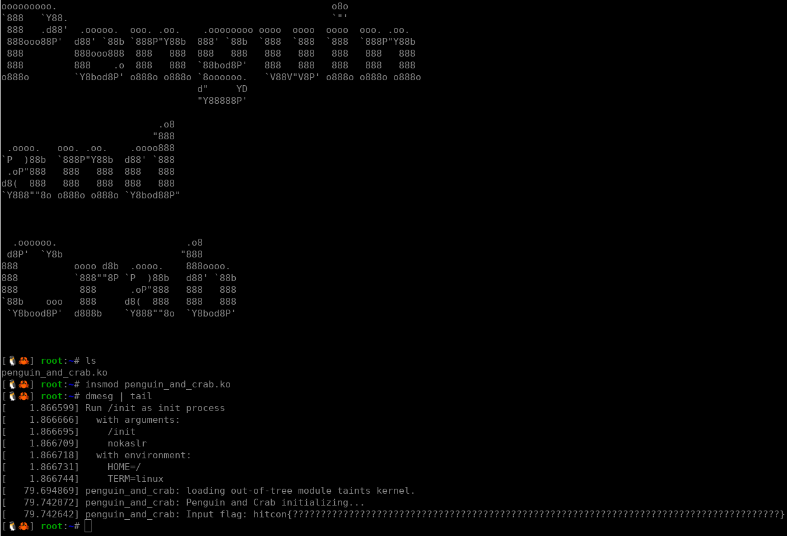

## HITCON CTF 2024 - penguin and crab (Reversing 268)
##### 12/07 - 14/07/2024 (48hr)
___

### Description

🐧https://www.youtube.com/watch?v=sCszdeWTzKs&t=0s

🦀https://www.youtube.com/watch?v=qElvTW-8-W8&t=0s.

```
https://storage.googleapis.com/hitcon-ctf-2024-qual-attachment/penguin-and-crab/penguin-and-crab-276719eb79c08d95ecaa6075e317b0641fb15d1f.tar.gz
```
___

### Solution

For this challenge we are given a kernel module, `penguin_and_crab.ko`, written in Rust.
We run the program and it prints the badboy message:




The flag is hardcoded in the binary:
```
hitcon{????????????????????????????????????????????????????????????????????????????????????????????}
```

The flag is being checked in the following function:
```c
void __fastcall RNvXs_Csh0k1DozyW36_16penguin_and_crabNtB4_13RustOutOfTreeNtNtNtCsd7thgd03LAQ_4core3ops4drop4Drop4drop(
        penguin_and_crab::RustOutOfTree *self);
```

To make our lives simpler, we will debug the code. First, we modify `run.sh` to add the
`-gdb tcp::1234` option, so we can attach gdb. Then we load the module and we dump the
function addresses:


Then we unload the module, set the appropriate breakpoints on gdb and reload the module
(make sure ASLR is disabled). Now we can debug the code.


The decompiled code is a mess, so we work directly with assembly.

The function initializes several vectors with constants, so most of the code looks like this:
```assembly
.text:00000000000005CF         mov     rax, [rsp+208h+var_1E8.ptr.pointer.pointer]
.text:00000000000005D4         mov     dword ptr [rax+rsi*4], 0AEC4F08Ch
.text:00000000000005DB         inc     rsi                     ; len
.text:00000000000005DE         jz      loc_2104
.text:00000000000005E4         mov     [rsp+208h+var_1D8], rsi
.text:00000000000005E9
.text:00000000000005E9 loc_5E9:                                ; CODE XREF: _RNvXs_Csh0k1DozyW36_16penguin_and_crabNtB4_13RustOutOfTreeNtNtNtCsd7thgd03LAQ_4core3ops4drop4Drop4drop+AD↑j
.text:00000000000005E9         cmp     rsi, [rsp+208h+var_1E8.cap.__0]
.text:00000000000005EE         jnz     short loc_604
.text:00000000000005F0         lea     rdi, [rsp+208h+var_1E8] ; self
.text:00000000000005F5         call    _RNvMs0_NtCslOnzLKEK2s9_5alloc7raw_vecINtB5_6RawVecmE20try_reserve_for_pushCsh0k1DozyW36_16penguin_and_crab
.text:00000000000005FA         mov     rsi, [rsp+208h+var_1D8]
.text:00000000000005FF         cmp     rax, r14
.text:0000000000000602         jnz     short loc_61E
.text:0000000000000604
.text:0000000000000604 loc_604:                                ; CODE XREF: _RNvXs_Csh0k1DozyW36_16penguin_and_crabNtB4_13RustOutOfTreeNtNtNtCsd7thgd03LAQ_4core3ops4drop4Drop4drop+CE↑j
.text:0000000000000604         mov     rax, [rsp+208h+var_1E8.ptr.pointer.pointer]
.text:0000000000000609         mov     dword ptr [rax+rsi*4], 642C04ACh
.text:0000000000000610         inc     rsi                     ; len
.text:0000000000000613         jz      loc_2104
.text:0000000000000619         mov     [rsp+208h+var_1D8], rsi
.text:000000000000061E
.text:000000000000061E loc_61E:                                ; CODE XREF: _RNvXs_Csh0k1DozyW36_16penguin_and_crabNtB4_13RustOutOfTreeNtNtNtCsd7thgd03LAQ_4core3ops4drop4Drop4drop+E2↑j
.text:000000000000061E         cmp     rsi, [rsp+208h+var_1E8.cap.__0]
.text:0000000000000623         jnz     short loc_639
.text:0000000000000625         lea     rdi, [rsp+208h+var_1E8] ; self
.text:000000000000062A         call    _RNvMs0_NtCslOnzLKEK2s9_5alloc7raw_vecINtB5_6RawVecmE20try_reserve_for_pushCsh0k1DozyW36_16penguin_and_crab
.text:000000000000062F         mov     rsi, [rsp+208h+var_1D8]
.text:0000000000000634         cmp     rax, r14
.text:0000000000000637         jnz     short loc_653
.text:0000000000000639
.text:0000000000000639 loc_639:                                ; CODE XREF: _RNvXs_Csh0k1DozyW36_16penguin_and_crabNtB4_13RustOutOfTreeNtNtNtCsd7thgd03LAQ_4core3ops4drop4Drop4drop+103↑j
.text:0000000000000639         mov     rax, [rsp+208h+var_1E8.ptr.pointer.pointer]
.text:000000000000063E         mov     dword ptr [rax+rsi*4], 0A3607854h
.text:0000000000000645         inc     rsi                     ; len
.text:0000000000000648         jz      loc_2104
.text:000000000000064E         mov     [rsp+208h+var_1D8], rsi
......
```

You can see here the values `AEC4F08Ch`, `642C04ACh` and `A3607854h` are pushed to the vector.

The most interesting parts of the encryption are the following:

**Stage #4**:
```assembly
.text:00000000000014F9 result = rdi                            ; u64
.text:00000000000014F9 a = r8                                  ; u64
.text:00000000000014F9         align 20h
.text:0000000000001500
.text:0000000000001500 LOOP_BACK:                              ; CODE XREF: _RNvXs_Csh0k1DozyW36_16penguin_and_crabNtB4_13RustOutOfTreeNtNtNtCsd7thgd03LAQ_4core3ops4drop4Drop4drop+1007↓j
.text:0000000000001500                                         ; _RNvXs_Csh0k1DozyW36_16penguin_and_crabNtB4_13RustOutOfTreeNtNtNtCsd7thgd03LAQ_4core3ops4drop4Drop4drop+101E↓j
.text:0000000000001500         imul    a, a                    ; r8 = a * a
.text:0000000000001504         mov     rax, r8
.text:0000000000001507         mul     r10                     ; rax = a * a * 0x8EF2C4468D568FF5
.text:000000000000150A         shr     rdx, 1Fh                ; rdx = (high 64 bits) >> 31 = a * a * 0x8EF2C4468D568FF5 >> 95
.text:000000000000150E         imul    rdx, r11                ; rdx = (a * a * 0x8EF2C4468D568FF5 >> 95) * 0xE53ACEB5
.text:0000000000001512         sub     r8, rdx                 ; r8 = a*a - (a * a * 0x8EF2C4468D568FF5 >> 95) * 0xE53ACEB5
.text:0000000000001515 a = r8                                  ; u64
.text:0000000000001515         mov     rax, x                  ; rax = mod
.text:0000000000001518         shr     rax, 1
.text:000000000000151B x = rax                                 ; u64
.text:000000000000151B         cmp     rcx, 2                  ; if mod < 2 break
.text:000000000000151F         mov     rcx, x                  ; mod /= 2
.text:0000000000001522         jb      short LOOP_END
.text:0000000000001524
.text:0000000000001524 loc_1524:                               ; CODE XREF: _RNvXs_Csh0k1DozyW36_16penguin_and_crabNtB4_13RustOutOfTreeNtNtNtCsd7thgd03LAQ_4core3ops4drop4Drop4drop+FD7↑j
.text:0000000000001524 x = rcx                                 ; u64
.text:0000000000001524         test    cl, 1
.text:0000000000001527         jz      short LOOP_BACK         ; if mod & 1 != 0
.text:0000000000001529         imul    result, a               ; result *= a
.text:000000000000152D         mov     rax, rdi
.text:0000000000001530         mul     r10                     ; rax = result * a * 0x8EF2C4468D568FF5
.text:0000000000001533         shr     rdx, 1Fh                ; rdx = (result * a * 0x8EF2C4468D568FF5) >> 95
.text:0000000000001537         imul    rdx, r11                ; rdx = (result * a * 0x8EF2C4468D568FF5) >> 95 * 0xE53ACEB5
.text:000000000000153B         sub     rdi, rdx                ; result = result*a - (result*a * 0x8EF2C4468D568FF5) >> 95 * 0xE53ACEB5
.text:000000000000153E result = rdi                            ; u64
.text:000000000000153E         jmp     short LOOP_BACK         ; r8 = a * a
```

**Stage #5**:
```assembly
.text:0000000000001F70 LOOP_FINAL:                             ; CODE XREF: _RNvXs_Csh0k1DozyW36_16penguin_and_crabNtB4_13RustOutOfTreeNtNtNtCsd7thgd03LAQ_4core3ops4drop4Drop4drop+1AC0↓j
.text:0000000000001F70         test    rdi, rdi
.text:0000000000001F73         jz      PANIC
.text:0000000000001F79         xor     r9d, r9d                ; r9 = 0
.text:0000000000001F7C         bt      r13d, r8d               ; CF = set r8-th bit of r13 (=tbl[12])
.text:0000000000001F80         setb    r9b                     ; r9 = r8-th bit of R13 (move it from CF to r9)
.text:0000000000001F84         mov     r10, [rcx-8]            ; r10 = high 64 bits = 0 ?
.text:0000000000001F88         imul    r10, r9                 ; r10 = 0
.text:0000000000001F8C         imul    r9, [rcx-10h]           ; r9 = bit * fin_tbl[i]
.text:0000000000001F91         add     rax, r9                 ; final
.text:0000000000001F94 result = rdx                            ; u128
.text:0000000000001F94         adc     result, r10             ; rdx += 0?
.text:0000000000001F97         jb      PANIC_2
.text:0000000000001F9D         mov     r9, i
.text:0000000000001FA0         or      r9, 1                   ; r9 = r8 | 1 = r8++ (r8 incremented by 2 so LSBit = always 1)
.text:0000000000001FA4 i = r9                                  ; usize
.text:0000000000001FA4         cmp     i, rsi
.text:0000000000001FA7         jz      PANIC
.text:0000000000001FAD         xor     r10d, r10d              ; r10 = 0
.text:0000000000001FB0         bt      r13d, r9d               ; CF = (r8+1)-th bit of tbl[12]
.text:0000000000001FB4         setb    r10b                    ; r10 = (r8+1)-th bit of tbl[12]
.text:0000000000001FB8         mov     i, [rcx+8]              ; r9 = 0 (+8 is always 0)
.text:0000000000001FBC         imul    r9, r10                 ; r9 = 0
.text:0000000000001FC0         imul    r10, [rcx]              ; r10 = bit * fin_tbl[i+1]
.text:0000000000001FC4         add     rax, r10                ; final += bit * fin_tbl[i+1]
.text:0000000000001FC7 result = rdx                            ; u128
.text:0000000000001FC7         adc     result, r9
.text:0000000000001FCA         jb      PANIC_2
.text:0000000000001FD0         add     r8, 2                   ; r8 += 2
.text:0000000000001FD4         add     rcx, 20h ; ' '          ; eat 2 128-bit words
.text:0000000000001FD8         add     rdi, 0FFFFFFFFFFFFFFFEh ; rdi -= 2
.text:0000000000001FDC         cmp     r8, 20h ; ' '           ; 16 iterations
.text:0000000000001FE0         jnz     short LOOP_FINAL
.text:0000000000001FE2         mov     rcx, 0B3312EC731522288h
.text:0000000000001FEC         xor     rax, rcx                ; final
.text:0000000000001FEF result = rdx                            ; u128
.text:0000000000001FEF         xor     result, 6
.text:0000000000001FF3         or      rdx, rax                ; rdx = iter
.text:0000000000001FF6         jnz     short BADBOY
```

Below is the complete decompiled version of the function (separated in **5** functions):
```py

tbl = [
    0xaec4f08c, 0x642c04ac, 0xa3607854, 0x2d393934,
    0x8e2c4f5a, 0xddd67d14, 0x7e005496, 0x3ed14a02,
    0x0a56a772, 0x466a4076, 0xd3a352a9, 0x495e93e3,
    0x67c44adf, 0x3aebe5ba, 0xed850da8, 0xd4b77198,
    0x51bdb6b2, 0x3a5f2448, 0x807889ca, 0x5b9d4d6e,
    0x8320efd6, 0x9e68e874, 0xba7fbea1, 0x827bc7e4,
    0x129f824a
]

rol = lambda a, b: ((a << b) | (a >> (32 - b))) & 0xffffffff

# ----------------------------------------------------------------------------------------
def stage_1(flag_vec):
    """Stage #1: encryption with XOR and ROL."""
    print('[+] Encryption stage #1 ...')

    new_tbl = [0]*25
    for i, v in enumerate(flag_vec):
        r = 0xdeadbeef ^ v
        for j in range(0x19 + 1):
            r = rol(r, 0x19) ^ 0x14530451
        
        new_tbl[i] = tbl[i] ^ rol(r, 0x19) ^ 0xcafebabe
        print(f'[+]     v:{v:08x}, tbl[{i:2d}] = {tbl[i]:08x} ~> {new_tbl[i]:08x}')

    return new_tbl


# ----------------------------------------------------------------------------------------
def stage_2(new_tbl):
    """Stage #2: encryption to produce giant (64-bit) vecs."""
    print('[+] Encryption stage #2 ...')
    giant = [0]*12

    # Use the first 12 elements of `tbl`.
    for i in range(6):
        if new_tbl[2*i] >= new_tbl[2*i + 1]:
            pass  # Go to badboy message.

        giant[i] = new_tbl[2*i] * new_tbl[2*i + 1]
        print(f'[+]    giant[{i:2d}] = {giant[i]:016x}')

    # Use the last 12 elements of `tbl` (25 in total).
    for i in range(6):
        if tbl[0x1a - 2 - 2*i] >= tbl[0x1a - 2 - 2*i - 1]:
            pass  # Go to badboy message.

        giant[6 + i] = tbl[0x1a - 2 - 2*i] * tbl[0x1a - 2 - 2*i - 1]
        print(f'[+]    giant[{6 + i:2d}] = {giant[6 + i]:016x}')

    return giant


# ----------------------------------------------------------------------------------------
def stage_3(giant, tbl_12):
    """Stage #3: verification of `giant` (first part)."""
    print('[+] Verification stage #1 (div giant) ...')

    div_giant = [giant[i] // tbl_12 for i in range(12)]

    expected_div_giant = [
        0x000000001be3b694, 0x000000000ad42f89,
        0x00000001003913b7, 0x0000000037c23eb4,
        0x0000000064c07ef5, 0x000000000d7b4785,
        0x0000000049115944, 0x000000005241f45e,
        0x00000000829722e9, 0x000000006801ca71,
        0x00000000165020cf, 0x00000000e45f7ab1
    ]

    for a, b in zip(div_giant, expected_div_giant):
        if a != b:
            pass  # Go to badboy message.
            
        print(f'[+]    DIV giant: {a:016x} != {b:016x} (expected)')        

    return div_giant


# ----------------------------------------------------------------------------------------
def stage_4(giant, tbl_12):
    """Stage #4: verification of `giant` (second part)."""
    print('[+] Verification stage #2 (mod giant) ...')

    mod_giant = [0]*12

    for i in range(12):
        mod = giant[i] % tbl_12
        #print(f'init mod:{mod:08x}, giant:{giant[i]:016x}, tbl[12]:{tbl_12:08x}')
        if mod == 0:
            print('[+] Perfect modulo!')
            result = 1
        else:
            a = 0x56361E32
            result = 1
            old_mod = mod
            while old_mod >= 2:
                old_mod = mod
                if (mod & 1) != 0:
                    #print('mod 1!')
                    result = result*a - ((result*a * 0x8EF2C4468D568FF5) >> 95) * 0xE53ACEB5

                a = a*a - (a * a * 0x8EF2C4468D568FF5 >> 95) * 0xE53ACEB5
                mod >>= 1
                #print(f'a:{a:016x}, mod:{mod:016x} ~> result:{result:016x}')

            mod_giant[i] = result

    expected_mod_giant = [    
        0x00000000a2cc3f37, 0x00000000b8b0e2e6,
        0x000000009dea4fd6, 0x00000000897da0d6,
        0x0000000052b660e5, 0x000000007dbcdc09,
        0x00000000588e7836, 0x000000003ea786e5,
        0x000000005bc7bb33, 0x00000000a3959e86,
        0x000000005ab05a2f, 0x00000000b09e4a8c
    ]

    for a, b in zip(mod_giant, expected_mod_giant):
        if a != b:
            pass  # Go to badboy message.
            
        print(f'[+]    MOD giant: {a:016x} != {b:016x} (expected)')        
   
    return mod_giant 


# ----------------------------------------------------------------------------------------
def stage_5(tbl_12):
    """Stage #5: verification of tbl[12] .

        (remote) gef> x/64xg $rax
            0xffff88813bdbe800:	0x38ed550c61366b19	0x0000000000000000
            0xffff88813bdbe810:	0xa368d7f6f944ef95	0x0000000000000000
            .....
            0xffff88813bdbe9d0:	0x000154d52272bf8f	0x0000000000000000
            0xffff88813bdbe9e0:	0x7e416b359a0655cc	0x0000000000000000
            0xffff88813bdbe9f0:	0x6858e18b590d1a8f	0x0000000000000000
    """
    print('[+] Verification stage #3 (tbl[12]) ...')

    fin_tbl = [  # Final table.
        0x38ed550c61366b19, 0xa368d7f6f944ef95,
        0x7730e544811b003b, 0x0ba7b915f29478b8,
        0x4cf3c7a1444ddcd5, 0x6a1ee5d1cb932edd,
        0x1c653d0faa75cd04, 0x5129602cebb27cd3,
        0x8d3e0ddb822d166c, 0x7743085c81b563ca,
        0x1fd73d5b1682bec1, 0x49ca0c91d932e680,
        0x10ac7806fd7dc9e2, 0x939cb3d71dc3703e,
        0x3719c10efed548af, 0x091aad1f7fe14e4b,
        0x8fe8985576b03857, 0x376937bc0af64e77,
        0x26190529fd5f0437, 0x12cf894f2af71bf3,
        0x22e8f33e31870d59, 0x6842e8d2ed57a1f1,
        0x189ebe5a06e8334f, 0x591cea928108d643,
        0x4914740091a11c11, 0x3b1a8bb8cd64fae1,
        0x48009c01b6dc47ba, 0x6cc80ed5a2d94b80,
        0x3a41f29b470b9346, 0x000154d52272bf8f,
        0x7e416b359a0655cc, 0x6858e18b590d1a8f
    ]

    expected_chksum = 0x6b3312ec731522288  # Target number.
    
    # If i-th bit of tbl[12] is 1, then multiply `chksum` with fin_tbl[i].
    print(f'[+]    tbl[12] = {tbl_12:08x} = {bin(tbl_12)}')

    chksum = 0
    for i, bit in enumerate(bin(tbl_12)[2:][::-1]):  # Inverse bits.
        if bit == '1':
            chksum += fin_tbl[i]
            print(f'[+]    Use fin_tbl[{i:2d}] ~> {fin_tbl[i]:016x}')

    
    print(f'[+] Final    checksum: {chksum:016x}')
    print(f'[+] Expected checksum: {expected_chksum:016x}')

    if chksum != expected_chksum:
        pass  # Go to badboy message.

    # Else, print goodboy message.
```

Now that we know the encryption, our goal is to work backwards and recover the flag from the 
"expected" tables. We can use bruteforce and integer factorization. Using multithreading, we
can get the flag in **~3hrs**.

For more details, please refer to the [penguin_and_crab_crack.py](./penguin_and_crab_crack.py)
script, which contains all the details of how we crack the flag.

So, the flag is: `hitcon{<https://www.youtube.com/watch?v=FrX0ZfX8Dqs>&&<https://www.youtube.com/watch?v=LDU_Txk06tM>}`
___
