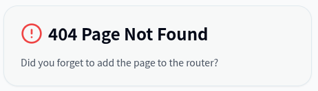

## HITCON CTF 2025 - Homo OS (Reversing 310)
##### 22/08 - 24/08/2025 (48hr)
___

### Description

待ちきれないよ、早く出してくれ


```
https://github.com/hitconctf/ctf2025.hitcon.org/releases/download/v1.0.0/homo_os_chall-91a4eb5338397e6f25aa267683a3942b98d94237.tar.gz
```
___

### Solution

This was a special challenge. We are given a custom OS running in qemu (`run.sh`):
```bash
export QEMU_MAC_ADDRESS=52:54:00:12:34:AD
qemu-system-arm -machine mps2-an385 -cpu cortex-m3 \
    -kernel ./build/homo_final.elf \
    -netdev tap,id=mynet0,ifname=virbr0-nic,script=no \
    -net nic,macaddr=$QEMU_MAC_ADDRESS,model=lan9118,netdev=mynet0 \
    -display gtk -m 16M  -nographic -serial stdio \
    -monitor null -semihosting -semihosting-config enable=on,target=native 
```

When we run it, it prints `Homo OS v114.514 start` followed by an ASCII Art banner and then waits.
Given the network configuration and the creation of a virtual interface `virbr0-nic` in `ifup.sh`
there is probably some server listening.

We search for strings (e.g., `Homo OS v114.514 start`) but we do not find anything, as they are
encrypted. Instead, we start the program in the debugger and we run it until it decrypts all of its
strings. Then we can inspect them. We add the `-s -S` options on `run.sh` so we can attach gdb
(or IDA):
```bash
export QEMU_MAC_ADDRESS=52:54:00:12:34:AD
qemu-system-arm -machine mps2-an385 -cpu cortex-m3 \
    -kernel ./build/homo_final.elf \
    -netdev tap,id=mynet0,ifname=virbr0-nic,script=no \
    -net nic,macaddr=$QEMU_MAC_ADDRESS,model=lan9118,netdev=mynet0 \
    -display gtk -m 16M  -nographic -serial stdio \
    -monitor null -semihosting -semihosting-config enable=on,target=native -s -S
```

We can now see all decrypted strings. There are plenty of them, but let's focus on the most
important ones:
```assembly
rodata:0001D084 aHomoOsV114514S DCB "Homo OS v114.514 start",0
rodata:0001D084                                         ; DATA XREF: u_print_intros+2↑o
rodata:0001D084                                         ; text:off_630↑o
rodata:0001D09B ; const char glo_banner[]
rodata:0001D09B glo_banner      DCB "################################################################"
rodata:0001D09B                                         ; DATA XREF: u_print_intros+8↑o
rodata:0001D09B                                         ; text:off_634↑o
rodata:0001D0DB                 DCB "######%%%%%%%%%%%%%%%%%%%%@@@@@@%%%%%",0xA
rodata:0001D101                 DCB "################################################################"
rodata:0001D141                 DCB "####%%%%%##**++++++=====++*##%%%@@@%%",0xA
rodata:0001D167                 DCB "################################################################"
rodata:0001D1A7                 DCB "#######*++===++**+=-:::::::--=+*##%%%",0xA
[..... BANNER ASCII ART .....]
rodata:0001E929                 DCB "------------------:::::::::::::::::::",0xA
rodata:0001E94F                 DCB "****************************########*++==========---------------"
rodata:0001E98F                 DCB "------------------::-::::::::::::::::",0
rodata:0001E9B5 aMountFailure   DCB "mount failure !!!",0
rodata:0001E9B5                                         ; DATA XREF: u_print_intros+18↑o
rodata:0001E9B5                                         ; text:off_63C↑o
rodata:0001E9C7 aSankai         DCB "/sankai",0
rodata:0001E9CF                 DCB "/*",0
rodata:0001E9D2 aServerPublic   DCB "/server/public",0
rodata:0001E9E1 aHomoKey        DCB "HOMO-KEY",0        ; DATA XREF: u_search_HOMO_KEY_value+72↑o
rodata:0001E9E1                                         ; handle_http_frame_headers+152↑o ...
rodata:0001E9EA aServer         DCB "/server",0
rodata:0001E9F2 a5zcj5ogp44cc5q DCB "5ZCJ5oGp44CC5q24",0
rodata:0001EA03 a5bcp6lgs5y2a6z DCB "5bCP6LGs5Y2a6Z2I",0

[.....]

rodata:0001EC41 aZephyr         DCB "zephyr",0          ; DATA XREF: net_hostname_init↑o
rodata:0001EC41                                         ; net_hostname_init+4↑r ...
rodata:0001EC48 aIpv6           DCB "IPv6",0
rodata:0001EC4D aIpv4           DCB "IPv4",0

[.....]

rodata:0001EC62 aWlanD          DCB "wlan%d",0          ; DATA XREF: net_if_init+104↑o
rodata:0001EC62                                         ; text:off_5394↑o
rodata:0001EC69 aEthD           DCB "eth%d",0           ; DATA XREF: net_if_init+12E↑o
rodata:0001EC69                                         ; text:off_539C↑o ...
rodata:0001EC6F aNetD           DCB "net%d",0           ; DATA XREF: net_if_init+138↑o
rodata:0001EC6F                                         ; text:off_53A0↑o
rodata:0001EC75 aNetOk          DCB "NET_OK",0
rodata:0001EC7C aNetContinue    DCB "NET_CONTINUE",0
rodata:0001EC89 aNetDrop        DCB "NET_DROP",0
rodata:0001EC92 aUnknown        DCB "<unknown>",0       ; DATA XREF: net_sprint_ll_addr_buf:loc_541C↑o
rodata:0001EC92                                         ; text:off_5420↑o ...
rodata:0001EC9C aNetMgmt        DCB "net_mgmt",0        ; DATA XREF: net_mgmt_event_init+C↑o
rodata:0001EC9C                                         ; text:off_5910↑o
rodata:0001ECA5 dword_1ECA5     DCD 0                   ; DATA XREF: net_rx_priority2tc+6↑o
rodata:0001ECA5                                         ; net_rx_priority2tc+8↑r ...
rodata:0001ECA9                 DCD 0
rodata:0001ECAD aTcpWork        DCB "tcp_work",0        ; DATA XREF: net_tcp_init+30↑o
rodata:0001ECAD                                         ; text:off_A480↑o
rodata:0001ECB6 ; const char src[]
rodata:0001ECB6 src             DCB "10.211.55.87",0    ; DATA XREF: u_IP_check+64↑o
rodata:0001ECB6                                         ; text:off_A76C↑o
rodata:0001ECC3 ; const char a2552552550[]
rodata:0001ECC3 a2552552550     DCB "255.255.255.0",0   ; DATA XREF: u_IP_check+7C↑o
rodata:0001ECC3                                         ; text:off_A770↑o
rodata:0001ECD1 ; const char a10211551[]
rodata:0001ECD1 a10211551       DCB "10.211.55.1",0     ; DATA XREF: u_IP_check+92↑o
rodata:0001ECD1                                         ; text:off_A774↑o
rodata:0001ECDD aInitializingNe DCB "Initializing network",0
rodata:0001ECDD                                         ; DATA XREF: u_init_network+2↑o
rodata:0001ECDD                                         ; text:off_A7D0↑o

[.....]

rodata:0001ED56                                         ; u_parse_HTTP_value_maybe:off_B95C↑o
rodata:0001ED5C aHpeOk          DCB "HPE_OK",0
rodata:0001ED63 aSuccess        DCB "success",0
rodata:0001ED6B aHpeCbMessageBe DCB "HPE_CB_message_begin",0
rodata:0001ED80 aTheOnMessageBe DCB "the on_message_begin callback failed",0
rodata:0001EDA5 aHpeCbUrl       DCB "HPE_CB_url",0
rodata:0001EDB0 aTheOnUrlCallba DCB "the on_url callback failed",0

[.....]

rodata:0001F75D aTextHtml       DCB "text/html",0       ; DATA XREF: sub_C664+38↑o
rodata:0001F75D                                         ; sub_C664:loc_C6EE↑o ...
rodata:0001F767 aContentType    DCB "Content-Type: ",0  ; DATA XREF: sub_C664+4C↑o
rodata:0001F767                                         ; sub_C664+9E↑o ...
rodata:0001F776 aHttp11200OkSSC DCB "HTTP/1.1 200 OK",0xD,0xA
rodata:0001F776                                         ; DATA XREF: sub_C664+44↑o
rodata:0001F776                                         ; text:off_C714↑o
rodata:0001F787                 DCB "%s%s",0xD,0xA
rodata:0001F78D                 DCB "Content-Length: %d",0xD,0xA
rodata:0001F7A1                 DCB "Content-Encoding: %s",0xD,0xA
rodata:0001F7B7                 DCB 0xD,0xA,0
rodata:0001F7BA aHttp11200OkSSC_0 DCB "HTTP/1.1 200 OK",0xD,0xA

[.....]

rodata:0001F8F2                 DCB 0xD,0xA,0
rodata:0001F8F5 aH2c_0          DCB "h2c",0xD,0xA,0     ; DATA XREF: handle_http1_request+132↑o
rodata:0001F8F5                                         ; text:off_D13C↑o
rodata:0001F8FB aHttp11500Inter DCB "HTTP/1.1 500 Internal Server Error",0xD,0xA
```

Very, very interesting. First of all, the string `zephyr` indicates that we have a
[Zephyr](https://en.wikipedia.org/wiki/Zephyr_(operating_system)) RTOS instance. The `10.211.55.87`
and `10.211.55.1` IP addresses, are probably (i.e., for sure) the IP addresses of the host and VM
respectively. Strings like `HPE_CB_url` indicate the presence of the zephyr's
[http](https://elixir.bootlin.com/zephyr/v1.13.0/source/subsys/net/lib/http) module.
Finally, we have several **HTTP** response messages, so we are sure the binary starts an HTTP 
server. So we need to connect to it.

Now let's analyze the binary to see where strings are decrypted. We start from `start` :P
```assembly
text:00000F68
text:00000F68                 EXPORT start
text:00000F68 start                                   ; DATA XREF: _24:off_4↑o
text:00000F68                 MOVS    R0, #0x20 ; ' '
text:00000F6A                 MSR.W   BASEPRI, R0
text:00000F6E                 LDR     R0, =0x20063D68
text:00000F70                 MOV.W   R1, #0x800
text:00000F74                 ADDS    R0, R0, R1
text:00000F76                 MSR.W   PSP, R0
text:00000F7A                 MRS.W   R0, CONTROL
text:00000F7E                 MOVS    R1, #2
text:00000F80                 ORRS    R0, R1
text:00000F82                 MSR.W   CONTROL, R0
text:00000F86                 ISB.W   SY
text:00000F8A                 BL      loc_1074
[...]
text:00001074 loc_1074                                ; CODE XREF: text:00000F8A↑p
text:00001074                 PUSH    {R3,LR}
text:00001076                 LDR     R3, =0
text:00001078                 LDR     R2, =unk_E000ED00
text:0000107A                 BIC.W   R3, R3, #0xC0000000
text:0000107E                 BIC.W   R3, R3, #0x7F
text:00001082                 STR     R3, [R2,#(unk_E000ED08 - 0xE000ED00)]
text:00001084                 DSB.W   SY
text:00001088                 ISB.W   SY
text:0000108C                 BL      u_bzero_bss
text:00001090                 BL      u_decrypt_segments
text:00001094                 BL      z_arm_interrupt_init
text:00001098                 BL      u_main_probably
```

The important function is `u_decrypt_segments()` at `0x470`:
```c
void __fastcall u_decrypt_segments()
{
  u_memcpy(glo_datas_segm, unk_24060, 0x20018AAC - glo_datas_segm);
  u_decrypt_segment(glo_yajyuu_segm, 0x24060 - glo_yajyuu_segm);
  u_decrypt_segment(glo_datas_segm, &dword_20018806 - glo_datas_segm);
  u_decrypt_segment(glo__931_segm, &off_3CB1C - glo__931_segm);
  u_memcpy(glo_datas_segm, unk_24060, 0);
}
```

This function decrypts whole segments (including `rodata`) using `u_decrypt_segment()` at `0x3E8`.
Here's how:
```c
void __fastcall u_decrypt_segment(_BYTE *a1, int a2)
{
  _DWORD a3[3]; // [sp+Ch] [bp-F4h] BYREF
  int key[8]; // [sp+18h] [bp-E8h] BYREF
  int v6[50]; // [sp+38h] [bp-C8h] BYREF

  u_memset(&key[1], 0, 28);
  key[0] = 0xE38482E3;
  key[1] = 0x81E38A82;
  key[2] = 0x9981E3BE;
  key[3] = 0xE3AD81E3;
  key[4] = 0x82E38482;
  key[5] = 0xBE81E38A;
  key[6] = 0xE39981E3;
  LOWORD(key[7]) = 0xAD81;
  memset(a3, 0, sizeof(a3));
  u_chacha_init_key(v6, key, a3, 0, 0, 0);      // Chacha ??
  u_DECRYPT_BUF(v6, a1, a2);
}
```

Segments are decrypted using [ChaCha](https://en.wikipedia.org/wiki/Salsa20) algorithm and a fixed
key. We can easily recognize the algorithm from the `expand 32-byte k` constant:
```c
void __fastcall chacha20_init(int a1, int *a2, _DWORD *a3, int a4, int a5, int a6) {
  /* ... */
  u_memset(a1, 0, 184);
  v9 = a2;
  v10 = (a1 + 68);
  do {
    v11 = *v9++;
    *v10++ = v11;
  } while ( v9 != a2 + 8 );
  *(a1 + 100) = *a3;
  *(a1 + 104) = a3[1];
  *(a1 + 108) = a3[2];
  qmemcpy(v15, "expand 32-byte k", 16);
  *(a1 + 120) = u_deref_a1(v15);
  *(a1 + 124) = u_deref_a1(&v15[1]);
  /* ... */
}
```

After segment decryption execution goes to `u_main_probably()` at `0xF198` to initialize the RTOS.
Let's try to import some signatures. We download the
[HTTP Server sample](https://github.com/zephyrproject-rtos/zephyr/tree/main/samples/net/sockets/http_server)
from the official github repo and we build it to get some signatures:
```
wget https://github.com/zephyrproject-rtos/sdk-ng/releases/download/v0.17.4/zephyr-sdk-0.17.4_linux-x86_64.tar.xz
tar xvf zephyr-sdk-0.17.4_linux-x86_64.tar.xz
mv zephyr-sdk-0.17.4 zephyr-sdk
./zephyr-sdk/setup.sh

west init
west update
west build -p auto -b mps2/an385 samples/net/sockets/http_server -name "http_sig"

# Binary located at: build/zephyr/zephyr.elf
```

We add `build/zephyr/zephyr.elf` on IDA and we generate a signature file. We also export the data
structures using the `Dump typeinfo to IDC file...` option. We import the signature file into the
other database and we recognize **~500** functions. That's a very important step as we can
recognize many library functions related to networking.

However, we are still missing many important functions as the signatures are probably from a
different version. We can identify more functions manually using **2** tricks:

* We check the (decrypted) strings and follow their XREFs TO to find which functions are using them. 
Then we go to the [source code](https://elixir.bootlin.com/zephyr/v1.13.0/source/) and we look
which functions use the same strings.

* We check the XREFs TO from a known function to match the caller function. For example, function
`tcp_data_len()` is recognized. This function has **2** XREFs TO `net_tcp_reply_rst()` and 
`tcp_recv()`. The `tcp_recv()` is significantly larger than `net_tcp_reply_rst()` so we can easily
recognize both in the challenge binary.

By doing this, we can find the most important functions in the binary.

Now let's try to find the port that the HTTP server is listening to. Port numbers are converted
to Big Endian using `z_impl_zsock_inet_pton()` function. This function is used only in 
`http_server_init()` at `0xBFB8`:
```c
int __fastcall http_server_init(http_server_ctx *ctx)
{
  /* ... */
    u_memset(&addr_storage, 0, 24);
    if ( v7->host && z_impl_zsock_inet_pton(2, v7->host, v18) == 1
      || !v7->host
      || (v9 = z_impl_zsock_inet_pton(1, v7->host, v18), v9 != 1) )
    {
      addr_storage = 2;
      port = v7->port;
      v14 = 24;
      v9 = 2;
      port_ = __rev16(*port);
    }
  /* ... */
}
```

> **NOTE:** Running an **nmap scan** does not work as all ports are filtered.

We set a breakpoint and we get the port number: **1919**.
We then create a virtual TUN/TAP interface and we send a simple HTTP request:
```
┌─[:(]─[00:24:47]─[✗:1]─[ispo@ispo-glaptop2]─[~/ctf/hitcon_ctf_2025/Homo_OS]
└──> echo -e 'GET /index.html HTTP/1.0\r\n\r\n' | nc -v 10.211.55.87 1919
Connection to 10.211.55.87 1919 port [tcp/*] succeeded!
HTTP/1.1 200 OK
Content-Length: 856
Content-Type: text/html
Content-Encoding: gzip

D ����w�v�����t���I�������(��$R.y8�f���)!53
                                           ^�HyHӚ��﫪�����G�.�Xz�D.��c��G$S���5�R���\@ц�0��$
�Ъ                                                                                          ��9c�P�U�f��&�Bw��@�1/7�h�
  U�X����V'�-T�1��0�]�5�D��T>���\��(K�#a�
                                         .�/_�<BF�����щCd�(<��E��/6'�P� &}  A�R=Ib6q7~��G�B�$ ��3  ���Z�᷐�V�Z�%0#l� �߷�9�g33
                                                                                                                           �ϼ4���wZ,r|��>q�){���3�v���W�o���V�z|z�f*ٷ�µ�V.��l�>3^�uC  6pG����2䪃�I��-�(�d6�R4m���`u
                                                                      �T�Z��!P&eQ&(d%�NBc��g���dk/��߲��l�y��
��ܰ4g*�d}����<K�M7G[?g�w㭕��f��xr?7��md����<0��"kB,1r�DŽdM s�s��ON�1޼=������[/�_mO���ߏ?�6�����ѽ�,}��O���у�v~]���z��;�|(�leu&G�uC����s�Sٺ�Yl&K��7�,��bԼ�.^^z��u�r^՛���\����h�rf�O-s�O�#a  ~
                                            ��8u���#�8�MM�M�����8m�n�am����6��c� ���  ���:+�_����D���7^�UG;��J�wp␦�0E��nS��v�T�#�_:|$�uZ�����␦nʔ
```

Perfect! We got a **gzip** encoded page. We decoded with `gunzip`:
```html
<!DOCTYPE html>
<html lang="en">
  <head>
    <script src="https://unpkg.com/react@18/umd/react.production.min.js" crossorigin="anonymous"></script>
    <script src="https://unpkg.com/react-dom@18/umd/react-dom.production.min.js" crossorigin="anonymous"></script>

    <meta charset="UTF-8" />
    <meta name="viewport" content="width=device-width, initial-scale=1.0, maximum-scale=1" />
    <link rel="preconnect" href="https://fonts.googleapis.com">
    <link rel="preconnect" href="https://fonts.gstatic.com" crossorigin>
    <link href="https://fonts.googleapis.com/css2?family=Noto+Sans+JP:wght@400;700;900&family=Inter:wght@400;600;800&display=swap" rel="stylesheet">
    <link rel="stylesheet" href="https://cdnjs.cloudflare.com/ajax/libs/font-awesome/6.0.0/css/all.min.css">
  
    <title>野獣レストラン 114514 - いいよ！こいよ！</title>
    <meta name="description" content="野獣先輩の聖地で最高の料理体験を！Beast Day Special Available! MAD動画文化と本格的な日本料理を融合させた唯一無二のレストラン。">
  
    <script type="module" crossorigin src="/assets/index-BQgLFxKI.js"></script>
    <link rel="stylesheet" crossorigin href="/assets/index-BhbUtGKP.css">
  </head>
  <body>
    <div id="root"></div>
    <!-- This is a replit script which adds a banner on the top of the page when opened in development mode outside the replit environment -->
    <script type="text/javascript" src="https://replit.com/public/js/replit-dev-banner.js"></script>
  </body>
</html>
```

There are **2** imported files `/assets/index-BQgLFxKI.js` and `/assets/index-BhbUtGKP.css`, which
are based on [React](https://react.dev/). We can deobfuscate them using
[deobfuscate.relative.im](https://deobfuscate.relative.im/), but they are not important. The 
webpage displays just an error message:



> **NOTE:** If you get an error like `index-BQgLFxKI.js from origin 'null' has been blocked by CORS policy: ...`
> run chrome as: `google-chrome --disable-web-security --user-data-dir=/tmp/chrome_dev_session`


### Locating the Flag check.

Ok where is the flag? There is obviously something hidden. If we go back to the (decrypted) strings,
we see this:
```assembly
rodata:0001E9C7 aSankai         DCB "/sankai",0
rodata:0001E9CF                 DCB "/*",0
rodata:0001E9D2 aServerPublic   DCB "/server/public",0
rodata:0001E9E1 aHomoKey        DCB "HOMO-KEY",0        ; DATA XREF: sub_C9E8+72↑o
rodata:0001E9E1                                         ; handle_http_frame_headers+152↑o ...
rodata:0001E9EA aServer         DCB "/server",0
rodata:0001E9F2 a5zcj5ogp44cc5q DCB "5ZCJ5oGp44CC5q24",0
rodata:0001EA03 a5bcp6lgs5y2a6z DCB "5bCP6LGs5Y2a6Z2I",0
rodata:0001EA14 asc_1EA14       DCB "/",0               ; DATA XREF: sub_64C:loc_674↑o
rodata:0001EA14                                         ; text:off_68C↑o
```

Let's try to get `/sankai`:
```
┌─[00:42:03]─[✗:1]─[ispo@ispo-glaptop2]─[~/ctf/hitcon_ctf_2025/Homo_OS]
└──> echo -e 'GET /sankai HTTP/1.0\r\n\r\n' | nc -v 10.211.55.87 1919
Connection to 10.211.55.87 1919 port [tcp/*] succeeded!
HTTP/1.1 418
Transfer-Encoding: chunked
Content-Type: text/html

0
```

That's a strange error code and it seems to come from strings
`HTTP/1.1 %d\r\nTransfer-Encoding: chunked\r\n` and `0\r\n\r\n`. The last string is found in
`sub_CAFC()` which is called from `handle_http1_request()` at `0xCF7C`:
```c
int __fastcall sub_CAFC(unsigned int *a1, int a2)
{
  /* ... */
    if ( ((v5 >> v8) & 1) != 0 )
    {
      v11 = a1[2] + 2844 + a2;
      for ( i = strlen(v11); ; i = 0 )
      {
        u_memset(result, 0, 24);
        sub_1A144(v16, v11, i);
        key_ok = (a1[5])(a2, 1, v16, result, a1[7]);// CALL FLAG!!
        if ( key_ok < 0 )
          break;
        key_ok = u_craft_HTTP_response(a2, result, a1);// send http response
        if ( key_ok < 0 )
          break;
        if ( http_response_is_final(result, 1) )
        {
          a1[6] = 0;
          v13 = http_server_sendall(a2, "0\r\n\r\n", 5);
          return v13 & (v13 >> 31);
        }
      }
      return key_ok;
    }
  /* ... */
}
```

The most important part is the function call `a1[5]` which takes us to `0x12254`:
```c
int __fastcall u_FLAG_IMPORTANT(int a1, int a2, _DWORD *a3, int http_status)
{
  int v6; // r3
  char *homo_key; // r6
  unsigned int len; // r3
  _BYTE *v10; // r3

  if ( a3[3]
    && (homo_key = *(a3[2] + 4), strlen(homo_key) == 5)// from HOMO-KEY => 5 bytes!!
    && (len = a3[1], len > 6)                   // after /sankai/.... (including /)
    && (u_do_RC4(homo_key, *a3, *a3, len), v10 = *a3, **a3 == 'h')
    && v10[1] == 'i'
    && v10[2] == 't'
    && v10[3] == 'c'
    && v10[4] == 'o'
    && v10[5] == 'n' )
  {
    *http_status = 200;
    *(http_status + 12) = *a3;
    v6 = a3[1];
  }
  else
  {
    *http_status = 418;
    v6 = 0;
  }
  *(http_status + 16) = v6;
  *(http_status + 20) = 1;
  return 0;
}
```

`u_do_RC4()` at `0x12232` implements an [RC4](https://en.wikipedia.org/wiki/RC4) decryption:
```c
int __fastcall u_do_RC4(char *key, char *ciphertext, char *plaintext, int plaintext_len)
{
  char S[272]; // [sp+0h] [bp-110h] BYREF

  u_RC4_key_schedule(key, S);
  u_RC4_crypt(S, ciphertext, plaintext, plaintext_len);
  return 0;
}
```

We can easily tell it's **RC4** from `u_RC4_key_schedule()` at `0x121B4`:
```c
int __fastcall u_RC4_key_schedule(char *key, char *S)
{
  unsigned int keylen; // r0
  int i; // r3
  unsigned int ii; // r3
  int v7; // r2
  char *v8; // r1
  char v9; // t1

  keylen = strlen(key);
  for ( i = 0; i != 256; ++i )                  // RC4 !!!
    S[i] = i;
  ii = 0;
  LOBYTE(v7) = 0;
  v8 = S - 1;
  do
  {
    v9 = *++v8;
    v7 = (v7 + v9 + key[ii % keylen]);
    ++ii;
    *v8 = S[v7];
    S[v7] = v9;
  }
  while ( ii != 256 );
  return 0;
}
```

So, when requesting `/sankai` an **RC4** decryption is triggered. If the plaintext does not start
with `hitcon` (among the other checks) a **0** is returned. However, the `*(a3[2] + 4)` is `NULL`.
We play a little bit with the HTTP request (there is also the `HOMO-KEY` constant string which we
should use, and a subpath after `/sankai`. We make the following request:
```bash
echo -e 'GET /sankai/ispoleet HTTP/1.0\r\nHOMO-KEY:31337\r\n' | nc -v 10.211.55.87 1919
```

Here `31337` is the **RC4** decryption key and `ispoleet` is the ciphertext. 

Okay but what to decrypt? Where is the flag? At this point we go back to check the filesystem. It
is very likely that there is another file there. We follow the path from `handle_http1_request()`
to see where the file is being read from the filesystem. We find `http_server_find_file()` at
`0xC5A0`:
```c
int __fastcall  http_server_find_file(
        char *fname,
        size_t fname_size,
        size_t *file_size,
        uint8_t supported_compression,
        http_compression *chosen_compression)
{
  /* ... */
  v8 = supported_compression;
  v9 = fs_stat(fname, &dirent, file_size);
  if ( v9 < 0 )
  {
    v10 = strlen(fname);
    u_snprintf(&fname[v10], fname_size - v10, ".gz");
    v9 = fs_stat(fname, &dirent, v11);
    *v8 = v9 == 0;
  }
  if ( v9 )
    return -2;
  *file_size = v14;
  return v9;
}
```

> **NOTE:** `http_server_find_file()` and `fs_stat()` functions were recognized from
> `http_server` sample. They are not official library functions.


This function uses `fs_stat()` to search for a file in the filesystem. We get into the internals
of this function until we find all file names of the "disk" in memory:
``` 
datas:20017D93                 DCB    0
datas:20017D94 aPublic         DCB "public",0
datas:20017D9B aAssets         DCB "assets",0
datas:20017DA2 aIndexBhbutgkpC DCB "index-BhbUtGKP.css.gz",0
datas:20017DB8 aIndexBqglfxkiJ DCB "index-BQgLFxKI.js.gz",0
datas:20017DCD aIndexHtmlGz    DCB "index.html.gz",0
datas:20017DDB aFlagEnc        DCB "flag.enc",0
datas:20017DE4                 DCB    0
```

The mounting point of the filesystem is `/server`. We make some experiments and we recover the
file structure:
```
/server
    /public
        index.html.gz
        assets/
            index-BhbUtGKP.css.gz
            index-BQgLFxKI.js.gz
    flag.enc
```

`flag.enc` is outside of the `/public` directory so we cannot fetch with an HTTP request. However,
we can go to `http_search_file()` and patch the path to remove `/public` and get flag.enc:
```
201D0750  66 6C 61 67 2E 65 6E 63  00 00 00 00 00 00 00 00  flag.enc........
201D0760  03 00 00 00 0D 00 00 00  59 92 06 A7 4D 99 1E B4  ........Y...M...
201D0770  B5 8E 47 48 48 3B 7D 7B  DA 37 B6 0C C4 86 4A 4C  ..GHH;}{....Ć JL
201D0780  3D F5 E0 DF 59 55 8A 82  45 73 B6 B7 00 00 00 00  =....U..Es......
201D0790  06 00 00 00 1A BE 08 00  67 5F 00 00 67 5F 00 00  ........g_..g_..
201D07A0  00 00 00 00 00 00 00 00  00 00 00 00 00 00 00 00  ................
```

That is the encrypted flag is:
```python
flag_enc = [
    0x59, 0x92, 0x06, 0xA7, 0x4D, 0x99, 0x1E, 0xB4, 0xB5, 0x8E, 
    0x47, 0x48, 0x48, 0x3B, 0x7D, 0x7B, 0xDA, 0x37, 0xB6, 0x0C, 
    0xC4, 0x86, 0x4A, 0x4C, 0x3D, 0xF5, 0xE0, 0xDF, 0x59, 0x55, 
    0x8A, 0x82, 0x45, 0x73, 0xB6, 0xB7
]
```

But we are not done yet. If we go back to `handle_http1_static_fs_resource()` at `0xCD70`, we can
see that the `flag.enc` is being decrypted using
**[Rijndael](https://en.wikipedia.org/wiki/Advanced_Encryption_Standard)** in
**[CBC](https://en.wikipedia.org/wiki/Block_cipher_mode_of_operation#Cipher_block_chaining_(CBC))**
mode:
```c
int __fastcall handle_http1_static_fs_resource(
        http_resource_detail_static_fs *static_fs_detail,
        http_client_ctx *client) {
  /* ... */
  v13 = 0;
  strcpy(content_type, "text/html");
  u_memset(&content_type[10], 0, 16374);
  if ( *(client[14].streams + 16) != 1 )
  {
    v4 = 73;
    v5 = "HTTP/1.1 405 Method Not Allowed\r\nContent-Length: 18\r\n\r\nMethod Not Allowed";
    return send_http1_error_common(client, v5, v4);
  }
  if ( strlen(&client[2].buffer[132]) == 1 )    // len(get file)
  {
    u_snprintf(v17, 0x100u, "%s/index.html", static_fs_detail->fs_path);
  }
  else
  {
    (http_server_get_content_type_from_extension)(&client[2].buffer[132], content_type, 0x4000);
    u_snprintf(v17, 0x100u, "%s%s", static_fs_detail->fs_path, &client[2].buffer[132]);
  }
  if ( (http_server_find_file)(v17, 0x100, &v14, &v13) < 0 )
  {
    v4 = 54;
    v5 = "HTTP/1.1 404 Not Found\r\nContent-Length: 9\r\n\r\nNot Found";
    return send_http1_error_common(client, v5, v4);
  }
  v15[0] = 0;
  v15[1] = 0;
  v16 = 0;
  v6 = sub_13784(v15, v17, 1);
  if ( v6 >= 0 )
  {
    v8 = "";
    if ( v13 )
      v8 = "\r\nContent-Encoding: gzip";
    v9 = u_snprintf(
           v19,
           0x407Du,
           "HTTP/1.1 200 OK\r\nContent-Length: %zd\r\nContent-Type: %s%s\r\n\r\n",
           v14,
           content_type,
           v8);
    v6 = http_server_sendall(client, v19, v9);
    if ( v6 >= 0 )
    {
      v10 = v14;
      LOBYTE(client[14].streams[3].current_detail) |= 2u;
      while ( v10 > 0 )
      {
        v11 = (sub_13852)(v15, v19, 0x407D);    // Rijndael!!!
        v12 = v11;
        if ( v11 < 0 )
          goto LABEL_17;
        v6 = http_server_sendall(client, v19, v11);
        if ( v6 < 0 )
          goto LABEL_17;
        v10 -= v12;
      }
      v6 = http_server_sendall(client, "\r\n\r\n", 4);
    }
LABEL_17:
    sub_1382E(v15);
  }
  return v6;
}
```

`sub_13852()` ends up calling indirectly `u_Rijndael_decrypt()` at `0x12436`:
```c
unsigned int __fastcall u_Rijndael_decrypt(_DWORD *a1, int a2, unsigned int a3) {
  /* ... */

  v4 = *a1;
  v5 = *(a1[1] + 20);
  clen = sub_127EE(*(*a1 + 4));
  v8 = *v4;
  clen_ = clen;
  v10 = *v4 + a3;
  if ( v10 > clen )
    *v4 = clen;
  else
    *v4 = v10;
  if ( !*(v5 + 8) )
    return u_load_flag_file_from_fs(*(v4 + 4), a2, a3, v8);
  v12 = sub_142C(clen);
  u_load_flag_file_from_fs(*(v4 + 4), v12, clen_, 0);
  u_Rijndael_key_exp(v16, *(v5 + 8), *(v5 + 12));
  v13 = -clen_ & 0xF;
  v14 = clen_ & 0xF;
  if ( clen_ <= 0 )
    v14 = -v13;
  u_Rijndael_CBC(v16, v12, clen_ - v14, v13);
  v15 = clen_ - v8;
  if ( v15 >= a3 )
    v15 = a3;
  u_memcpy(a2, (v12 + v8), v15);
  sub_1488(v12);
  return v15;
}
```

The decryption key is `5ZCJ5oGp44CC5q24`, and the IV is `5bCP6LGs5Y2a6Z2I`. We let the debugger
decrypt the file and we get the decrypted `flag.enc`:
```python
flag_decr = [
    0x57, 0x45, 0x7D, 0xC3, 0xCC, 0x80, 0x39, 0x9B, 0xCA, 0xB5,
    0x33, 0x80, 0x50, 0x2E, 0x90, 0xDF, 0x5E, 0x90, 0x57, 0x5A,
    0x29, 0x9A, 0x24, 0x5B, 0xDA, 0x0B, 0x65, 0xEE, 0xC3, 0xC2,
    0xA4, 0x0D, 0x45, 0x73, 0xB6, 0xB7
]
```

### Bruteforcing the Key

We know from `u_FLAG_IMPORTANT()` that `flag_decr` is encrypted using **RC4** and that the key
(which passed in `HOMO-KEY`) is **5** characters long, so we can bruteforce it. I initially tried
the `rockyou.txt` dictionary but nothing was found. Then I tried all lowercase letters, but still
nothing was found. Finally, I tried all digits:

```python
    from Crypto.Cipher import ARC4

    flag_decr = [
        0x57, 0x45, 0x7D, 0xC3, 0xCC, 0x80, 0x39, 0x9B, 0xCA, 0xB5,
        0x33, 0x80, 0x50, 0x2E, 0x90, 0xDF, 0x5E, 0x90, 0x57, 0x5A,
        0x29, 0x9A, 0x24, 0x5B, 0xDA, 0x0B, 0x65, 0xEE, 0xC3, 0xC2,
        0xA4, 0x0D, 0x45, 0x73, 0xB6, 0xB7,
    ]
    
    fst = 0x30
    lst = 0x39

    for i in range(fst, lst):
        for j in range(fst, lst):
            for k in range(fst, lst):
                for l in range(fst, lst):
                    for m in range(fst, lst):
                        rc4_key = bytes([i, j, k, l, m])
                        rc4_cipher = ARC4.new(rc4_key)
                        plaintext = rc4_cipher.decrypt(bytes(flag_decr))
                        if plaintext.startswith(b'hitcon'):
                            print(f'[+] key FOUND: {rc4_key}')
                            print(f'[+] Flag: {plaintext!r}') 
                            exit()
```

And I immediately got the solution:
```
[+] key FOUND: b'48763'
[+] Flag: b'hitcon{h0m0_h473_R70S_1145141919810}'
```

So, the flag is: `hitcon{h0m0_h473_R70S_1145141919810}`
___
