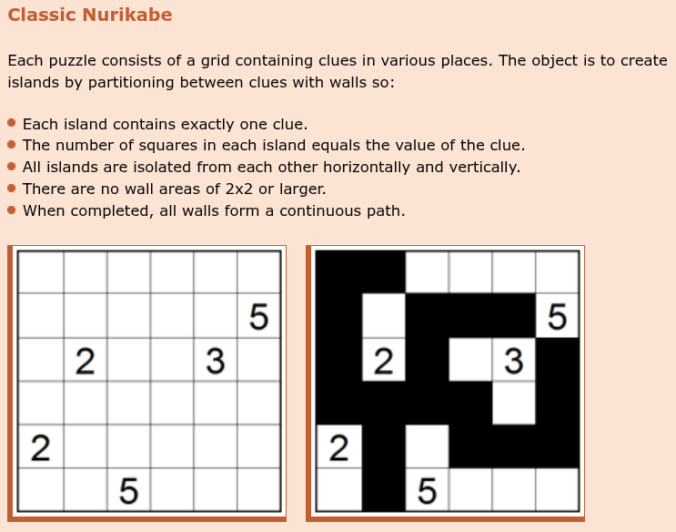
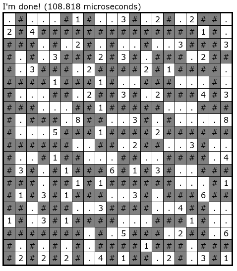

## HITCON CTF 2015 - npc (RE 400)
##### 17-19/10/2015 (48 hr)
___

### Description: 

*NPC says "I am NPC."*

```
npc-4bc7ebfe94c8fdc93832bc0e7af1279b
```

**Hint: Check the black/white connected components in 2D grid of cells.**
___

### Solution:

> [!NOTE]
> I've tried this challenge during the original CTF, but I couldn't solve it. **10** years later,
> I decided to give it another try (within **2** days), without using any LLMs for help.

The code is not obfuscated (but it is optimized) and everything is in `main()`. The hard part is
to understand what exactly is going on. Let's start from the beginning:
```c
int __fastcall main(int argc, char **argv, char **argp) {
  /* variable decls */

  if ( argc != 2 ) {
    __printf_chk(1LL, "Usage: %s flag\n", *argv);
    exit(1);
  }
  flag_ = strdup(argv[1]);
  flag = flag_;
  if ( !flag_ ) {
    puts("OOM?!");
    exit(1);
  }
  flaglen = strlen(flag_);
  if ( !u_check_flag_len_88(flaglen) )          // Must be 88 bytes
    goto BADBOY;
```

After reading the flag from `argv[1]`, program first calls checks the flag length using
`u_check_flag_len_88()` at `402980h`. If the length is incorrect, program goes to badboy function
at `401FB0h`:
```c
void __fastcall __noreturn u_badboy() {
  puts("invalid :(");
  exit(1);
}
```

We do not really have to analyze this function --we can simply bruteforce its argument
(*flag length*) and see with which value the function returns **1**. But let's look at it, as it is interesting:
```c
bool __fastcall u_check_flag_len_88(int a1_len) {
  /* ... */
  quotient = a1_len;
  if ( a1_len > 1000000 )
    return 0;
  memset(vector, 0, 24);
  vec_div[0] = 2;
  divisor = 2;
  if ( a1_len > 1 ) {
    do {
      divisor_ = divisor;
      if ( !(quotient % divisor) )              // find a number that divides flag len
      {
        do {
          while ( 1 ) {
            last_ = vector[0].curr;
            if ( vector[0].curr != vector[0].end )
              break;
            u_stl_vector_push_back(vector, vec_div);// append divisor to the vector
            divisor_ = vec_div[0];
            v6 = (quotient / vec_div[0]) >> 31; // check MSBit (for negatives) ~> ignore
            quotient /= vec_div[0];
            // if result still divisible by the same number, repeat
            if ( (__SPAIR64__(v6, quotient) % vec_div[0]) )
              goto INCR_DIV;
          }
          if ( vector[0].curr ) {
            *vector[0].curr = divisor_;
            divisor_ = vec_div[0];
          }
          vector[0].curr = last_ + 1;
          v4 = (quotient / divisor_) >> 31;
          quotient /= divisor_;
        } while ( !(__SPAIR64__(v4, quotient) % divisor_) );
      }
INCR_DIV:
      divisor = divisor_ + 1;
      vec_div[0] = divisor_ + 1;
    } while ( divisor_ + 1 <= quotient );
  }
  buf = operator new(0x10uLL);
  v8 = 0;
  *buf = 0x200000002LL;                         // expected values: 2, 2, 2, 11
  first = vector[0].begin;
  *(buf + 1) = 0xB00000002LL;
  cnt = vector[0].curr - first;
  if ( cnt != 4 ) {
    begin = first;
    if ( !buf )
      goto EPILOG;
    goto CLEANUP_BUF;
  }
  LOBYTE(cnt) = 16;
  begin = first;
  // To pass we need the flag len to be divisible by 2, 2, 2 and 11
  // => flag len = 11 * 2 * 2 * 2 = 88
  res = memcmp(first, buf, cnt) == 0;

  /* cleanup */
  return result;
}
```

```c
void __fastcall u_stl_vector_push_back(stl_vector *a1_vec, int *a2_pval) { // At 4028A0h
  /* ... */
  alloc_sz = 4LL;
  sz = (a1_vec->curr - a1_vec->begin) >> 2;     // current size
  if ( sz ) {
    /* update alloc_sz */
  }
  buf = operator new(alloc_sz);                 // allocate space for new vector 
  begin = a1_vec->begin;
  buf_ = buf;
  sz2 = (a1_vec->curr - a1_vec->begin) >> 2;
  REAL_VAL = *a2_pval;
  v10 = &buf_[4 * sz2];
  if ( v10 )
    *v10 = REAL_VAL;                            // copy value at the end
  v11 = begin;
  if ( sz2 ) {
    memmove(buf_, begin, 4 * sz2);              // move the existing vector data
    v11 = a1_vec->begin;
  }
  v12 = (v10 + 4);
  if ( v11 )
    operator delete(v11);
  a1_vec->begin = buf_;
  a1_vec->curr = v12;
  a1_vec->end = &buf_[alloc_sz];
}
```

Function takes the flag length and **breaks it into its prime factors**: First, it divides length by
**2**. As long as the flag length is divisible by **2**, the loop continues and the result is
pushed into a vector. Then function tries the next divisor, **3**. Then **4** (which is pointless
because at this point, function has already tried to divide it by powers of **2**).

At the end it compares the generated vector with the expected one: `2, 2, 2, 11` and if they match
function returns true.

Therefore the flag length must consist of the following prime factors:
**2**, **2**, **2** and **11**. Thus the expected length is `2 * 2 * 2 * 11 = 88` bytes.

Now let's continue back to `main()`. The next step is to convert the flag into **400** bits:
```c
  // Map characters to numbers [0, 32)

  // chmap = [-1]*130
  // c = 42
  // for i in range(32):
  //     while chmap[c] != -1 or (c - 32) & 0xFF > 94:
  //         c = 7*c % 127
  //     chmap[c] = i 

  // charset = ''.join(chr(i) for i, b in enumerate(chmap) if b != -1)
  // print(f'charset: {charset!r}')
  memset(charmap, 0xFF, 508);                   // fill map with ones
  neg = 10;
  do {
    while ( neg > 94 || charmap[gen] != -1 )    // stop when finding empty (-1) entry or negative (<32)
    {
      gen = 7 * gen % 127;                      // generator: Goes through all values [0, 126]
      neg = gen - 32;                           // this is unsigned, cant be 0xFFF...
    }
    charmap[gen] = ii++;
  } while ( ii != 32 );                         // set 32 values 

  if ( memcmp(flag, "hitcon{", 7uLL) || flag[flaglen - 1] != '}' )
    goto BADBOY;

  if ( flaglen > 8 ) {
    fl_7 = flag[7];                             // first char of actual flag
    // all flag character need to point to a valid entry (not FF) otherwise they are unmapped. Valid charset:
    //     "(*+-./137=ADEFIJOSVY[^_bdfgimos
    if ( (fl_7 - 32) <= 94u && charmap[fl_7] != -1 ) {
      jj = 0LL;
      while ( jj != flaglen - 9 ) {
        pos = flag[jj + 8];
        if ( (pos - 32) <= 94u ) {
          ++jj;
          if ( charmap[pos] != -1 )
            continue;
        }
        goto BADBOY;
      }
      upper_i = 5 * jj + 5;                     // 400 (jj must be 79)
      memset(flag_buf, 0, 56uLL);
      v12 = 0LL;
      flag_idx = flag + 7;
      // Convert flag into bits 5*80 = 400 bits
      // The 1st character fills the 5 LSBits from buf1[0]
      // The 2nd character fills the 3 MSBtis from buf1[0] and the 2 LSBits from buf1[1]
      // .....
      for ( i = 0LL; ; v12 = flag_buf[i >> 6] ) {
        bitmask1 = 1LL << (i & 0x3F);
        ch = charmap[*flag_idx];                // between 0 and 31 ~> 5 bits
        val1 = (ch & 1) != 0 ? v12 | bitmask1 : v12 & ~bitmask1;
        flag_buf[i >> 6] = val1;                // set or clear bit
        idx2 = (i + 1) >> 6;
        ch2 = ch / 2;
        // set i-th bit or clear i-th bit
        bitmask2 = 1LL << ((i + 1) & 0x3F);
        val2 = (ch2 & 1) != 0 ? flag_buf[idx2] | bitmask2 : flag_buf[idx2] & ~bitmask2;
        flag_buf[idx2] = val2;
        ch3 = ch2 / 2;
        bitmask3 = 1LL << ((i + 2) & 0x3F);
        idx3 = (i + 2) >> 6;
        val3 = (ch3 & 1) != 0 ? flag_buf[idx3] | bitmask3 : flag_buf[idx3] & ~bitmask3;
        flag_buf[idx3] = val3;
        idx4 = (i + 3) >> 6;
        ch4 = ch3 / 2;
        bitmask4 = 1LL << ((i + 3) & 0x3F);
        val4 = (ch4 & 1) != 0 ? flag_buf[idx4] | bitmask4 : flag_buf[idx4] & ~bitmask4;
        flag_buf[idx4] = val4;
        idx5 = (i + 4) >> 6;
        bitmask5 = 1LL << ((i + 4) & 0x3F);
        val5 = (((ch4 < 0) + ch4) & 2) != 0 ? flag_buf[idx5] | bitmask5 : flag_buf[idx5] & ~bitmask5;
        i += 5LL;                               // work in chunks of 5 bits
        ++flag_idx;
        flag_buf[idx5] = val5;
        if ( i == upper_i )
          break;
      }
      goto MOVE_ON;
    }
BADBOY:
    u_badboy();
  }
  // if flag too small, zero out 14*4 = 56 bytes (entire buf1)
  buf_1 = flag_buf;
  for ( j = 14LL; j; --j )
  {
    *buf_1 = 0;
    buf_1 = (buf_1 + 4);
  }
MOVE_ON:
  /* ... */
```

First, program generates `charmap`, a mapping between **32** ASCII characters and the numbers **0**
to **31**. 

Then program checks the flag format: It should start with `hitcon{` and end with `}`.

Then it extracts the inner part of the flag (**80** characters) and for each character it finds its
**5-bit** mapping from `charmap`. Any character not in this mapping, causes program to jump to the
badboy message.

Finally all these **5-bit** mappings are packed into `QWORD`s and pushed onto `flag_buf`, which is
a `QWORD` array.

Let's decompile this:
```python
# Random flag:
flag = b'hitcon{1ADE37=ADEFIJOSVY___bdfgimos1ADE37=ADEFIJOSVY___bdfgimos1ADE37=ADEFIJOSVY___bdfg}'

chmap = [-1]*130
c = 42
for i in range(32):
    while chmap[c] != -1 or (c - 32) & 0xFF > 94:
        c = 7*c % 127
    chmap[c] = i
    print(f'{i:05b} ~> {chr(c)}')

charset = ''.join(chr(i) for i, b in enumerate(chmap) if b != -1)
print(f'charset: {charset!r}')

flag_buf = []
q = 0  # Make it a huge number
for j, f in enumerate(flag[7:-1]):
    q |= chmap[f] << (j * 5)

while q > 0:  # Split it into QWORDs
    flag_buf.append(q & 0xFFFFFFFFFFFFFFFF)
    q >>= 64
```
___


### The Puzzle Input

Let's continue in `main()`:
```c
MOVE_ON:
  // This step does not depend on the flag ~> just use the results
  weird_ascii = glo_weird_ascii;
  end = 0LL;
  curr = 0LL;
  l = 0LL;
  memset(&fixed_vec, 0, sizeof(fixed_vec));
  if ( *(glo_weird_ascii - 24) ) {
    // weird_ascii = b",+))(((()(+.$+\"(\"))).))(+),(.).(.(++#+)+8(()(().+)\"+;\".)-\"./)+.(;(.)-+$.+))+),+++)&+++ ++++)++/)/, ),..+()++ +'/.(),&+\"(+(+((.++)(()++"
    // nums = [w ^ 0x2A for w in weird_ascii]

    // 134 numbers between 1 and 18: [6, 1, 3, 3, 2, 2, 2, ..., 2, 3, 1, 1]
    // We process them in pairs (x, y)
    // Append x zeros to the vector and then append y
    // Final vector: [0, 0, 0, 0, 0, 0, 1, 0, 0, 0, 3, 0, 0, 2, ...]
    while ( 1 ) {
      C = weird_ascii[l] ^ 0x2A;
      if ( C ) {                                // always nonzero
        iii = 0LL;
        C_ = (C - 1) + 1LL;                     // ?
        do {
          while ( 1 ) {
            LODWORD(obj) = 0;
            if ( curr != end )                  // if there is enough room for the new element do not extend
              break;
            u_stl_vector_push_back_SAME(&fixed_vec, &obj);// append 0
            ++iii;
            curr = fixed_vec.curr;
            end = fixed_vec.end;
            if ( iii == C_ )
              goto BREAK;
          }
          if ( curr )
            *curr = 0;                          // set new element to the vector
          ++iii;
          fixed_vec.curr = ++curr;
        } while ( iii != C_ );
BREAK:
        weird_ascii = glo_weird_ascii;
      }

      D = weird_ascii[l + 1] ^ 0x2A;
      LODWORD(obj) = D;
      if ( curr == end ) {                      // need to extend vector?
        u_stl_vector_push_back(&fixed_vec, &obj);// add next num
        weird_ascii = glo_weird_ascii;
        l += 2LL;
        if ( l >= *(glo_weird_ascii - 24) )
          break;
      } else {                                 // no need to extend. Just append at curr
        if ( curr )
          *curr = D;
        l += 2LL;                              // next pair
        v43 = l < *(weird_ascii - 3);
        fixed_vec.curr = curr + 1;
        if ( !v43 )
          break;
      }
      curr = fixed_vec.curr;
      end = fixed_vec.end;
    }
  }
```

This snippet decrypts an array from an "weird" ASCII string, which is like:
```
  [6, 1, 3, 3, 2, 2, 2, ..., 2, 3, 1, 1]
```

Then it process input in pairs: The first number denotes the number of zeros that will append to
a new vector (we call it `fixed_vec`), and the second number is appended as it is. The result looks
like below (and it has exactly **400** elements):
```
  [0, 0, 0, 0, 0, 0, 1, 0, 0, 0, 3, 0, 0, 2, ...]
```

```python
def gen_fixed_vec():
    """Generates the fixed vector."""
    weird_ascii = b",+))(((()(+.$+\"(\"))).))(+),(.).(.(++#+)+8(()(().+)\"+;\".)-\"./)+.(;(.)-+$.+))+),+++)&+++ ++++)++/)/, ),..+()++ +'/.(),&+\"(+(+((.++)(()++"
    nums = [w ^ 0x2A for w in weird_ascii]
    fixed_vec = []
    for i in range(0, len(nums), 2):
        fixed_vec += [0]*nums[i] + [nums[i + 1]]

    print(f'[+] Fixed vec ({len(fixed_vec)}): {fixed_vec[:20]}')

    return fixed_vec
```
___


### Understanding the Nurikabe Logic

After all the preparation steps, we enter on the actual logic of the challenge, which is also the
hardest part. Understanding this and the next steps are crucial to solve it. I have added some
comments on the code to make it easier to follow:
```c
 // outer loop: for each row in flag_buf (row_A)
  do {
    tmp = 4 * row_A_;                           // tmp used for many things
    row_A = row_A_;
    col_A = 0LL;
    outer_loop_cnt_ = outer_loop_cnt;
    p_fixed_vec_ = p_fixed_vec;
    arr1_row = tmp;
    // intermediate loop: for each column in flag_buf (col_A)
    do {
      curr_idx = col_A + row_A;
      *pairs = si128;                           // This gets the [1, 0, 0, 1] list
      pair = pairs;
      col_A_ = col_A;
      // For each of the 400 bits:
      // Check if the next bit from (modified) flag is set
      LOBYTE(tmp) = ((1LL << (col_A + row_A)) & flag_buf[(row_A + col_A) >> 6]) != 0;
      // Inner loop: Do 2 iterations for pairs (1, 0) and (0, 1)
      // pairs added to row/col ~> check element below (row+1) and right (col+1)
      do {
        // Choose a row and a columnt from loop_p vector
        row_B = outer_loop_cnt_ + pair->row;
        if ( row_B <= 19 ) {                    // check for overflows!
          col_B = col_A_ + pair->col;
          if ( col_B <= 19 ) {
            idx_B = col_B + 20 * row_B;         // ROWS OF SIZE 20!
            idx_B_ = idx_B;
            // Check if these 2 bits from bit map are the same (0-0 or 1-1)
            if ( tmp == (((1LL << (col_B + 20 * row_B)) & flag_buf[idx_B >> 6]) != 0) ) {
              idx_A = curr_idx;
              ARRAY1 = obj1__->array_1;
              ROW = (obj1__->array_1 + arr1_row);// a 20 DWORD row from array 1
              hop1 = *ROW;                      // this is ROW[0]
              // this follows a list
              // j = ARRAY[i]
              // k = ARRAY[j]
              // l = ARRAY[k]
              // ...
              // Hop around array. Make sure there are no circles!
              // Try to make 10 hops
              if ( *ROW != curr_idx )
              {
                idx_A = *ROW;                   // path entry
                hop2 = &ARRAY1[hop1];
                nxt = *hop2;
                if ( hop1 != *hop2 )            // hop1 != ARRAY[hop1]
                {
                  hop3 = &ARRAY1[nxt];
                  nxt_ = *hop3;
                  if ( nxt != *hop3 )           // hop2 != ARRAY[hop2]
                  {
                    hop4 = &ARRAY1[nxt_];
                    nxt = *hop4;
                    if ( nxt_ != *hop4 )        // hop3 != ARRAY[hop3]
                    {
                      hop5 = &ARRAY1[nxt];
                      hop5_ = *hop5;
                      if ( nxt != *hop5 )
                      {
                        hop6 = &ARRAY1[hop5_];
                        nxt = *hop6;
                        if ( hop5_ != *hop6 )
                        {
                          hop7 = &ARRAY1[nxt];
                          hop7_ = *hop7;
                          if ( nxt != *hop7 )
                          {
                            hop8 = &ARRAY1[hop7_];
                            nxt = *hop8;
                            if ( hop7_ != *hop8 )
                            {
                              hop9 = &ARRAY1[nxt];
                              if ( nxt != *hop9 )
                              {
                                nxt = *hop9;
                                hop10 = &ARRAY1[*hop9];
                                hop10_ = *hop10;
                                if ( *hop9 != *hop10 )
                                {
                                  // if you have a path with >10 hops, continue recursively
                                  v244 = p_fixed_vec_;
                                  LODWORD(v243) = tmp; // ignore all these assignments
                                  row_A__ = outer_loop_cnt_;
                                  col_A__ = col_A;
                                  v239.m128i_i64[0] = ROW;
                                  si128_ = si128;
                                  v224 = idx_B;
                                  nxt = u_claim_bigger_path_RECURSIVE(obj1__, hop10_);
                                  p_fixed_vec_ = v244;
                                  LODWORD(tmp) = v243;
                                  outer_loop_cnt_ = row_A__;
                                  col_A = col_A__;
                                  ARRAY1 = obj1__->array_1;
                                  ROW = v239.m128i_i64[0];
                                  idx_B = v224;
                                  *hop10 = nxt;
                                  si128 = _mm_load_si128(&si128_);
                                }
                                *hop9 = nxt;    // set all previous hops to entry
                              }
                              *hop8 = nxt;
                            }
                            *hop7 = nxt;
                          }
                          *hop6 = nxt;
                        }
                        *hop5 = nxt;
                      }
                      *hop4 = nxt;
                    }
                    *hop3 = nxt;
                  }
                  idx_A = nxt;
                  *hop2 = nxt;
                }
                *ROW = idx_A;
              }
              // same story but start from idx_B_ this time
              v114 = &ARRAY1[idx_B_];
              v115 = *v114;
              if ( idx_B != *v114 )
              {
                /*
                 * Same set of 9 nested hops ending up in u_claim_bigger_path_RECURSIVE()
                 * exactly as above.
                 */
                *v114 = idx_B;
              }
              // update
              if ( idx_A != idx_B ) {
                idx_B__ = idx_B;                // convert to DWORD
                // array2 counts wins
                array_2 = obj1__->array_2;      // array2 = all 1's
                A = &array_2[idx_A];
                B = &array_2[idx_B__];
                if ( *A > *B ) {
                  grt = A;                      // A is greater
                } else {
                  grt = B;                      // B is greater
                  idx_B__ = idx_A;              // swap A <-> B, idx_A <-> idx_B
                  B = A;
                  idx_A = idx_B;
                }
                // array1 contains paths
                obj1__->array_1[idx_B__] = idx_A;
                *grt += *B;                     // add the value of the smaller to the greater
              }
            }
          }
        }
        ++pair;                                 // move on to the next pair
      } while ( p_fixed_vec_ != pair );
      ++col_A;
      arr1_row += 4LL;
    } while ( col_A != 20 );
    p_fixed_vec = p_fixed_vec_;
    outer_loop_cnt = outer_loop_cnt_ + 1;
    row_A_ = row_A + 20;                        // move on to the next row
  } while ( outer_loop_cnt != 20 );
```

First of all, the **400-bit** input is treated as **20x20** binary array/matrix/grid. We can easily
infer this from the outer loops. At each step we are working on the cell `(r, c)` (or `r*20 + c`).

The **3rd** nested loop makes **2** iterations and adds the coordinates `(1, 0)`, `(0, 1)` to the 
current cell (as long as they are not out of bounds). In other words, program **compares the current
cell (`A`) against the cell below (down) and the cell to the right (`B`)**. 

In order to start the processing, both cells `A` and `B` must have the same value
(either both are **0**, or both are **1**). The bits are extracted using the following code:
```c
((1LL << (col_A + row_A)) & flag_buf[(row_A + col_A) >> 6]) != 0
```

We also have the `obj1__` of an unknown type:
```
00000000 stl_wtf         struc ; (sizeof=0x30, copyof_20)
00000000 array_1         dq ?                    ; offset
00000008 arr1_curr       dq ?                    ; offset
00000010 arr1_end        dq ?                    ; offset
00000018 array_2         dq ?                    ; offset
00000020 arr2_curr       dq ?                    ; offset
00000028 arr2_end        dq ?                    ; offset
00000030 stl_wtf         ends
```

The important parts here are the `array_1` which is initialized to `[0, 1, 2, ..., 399]` and the
`array_2` which is initialized to all **1**'s.

If both bits are equal, we enter a long set of **10** nested `if` statements where we
*"extract the longest path"* of cell `A` from `array_1`. More specifically:

  1. Start from position `(r, c)`, or `i = r*20 + c`, or `idx_A`
  2. Check if `array_1[i]` == `i`.
  3. If yes, stop. Let `l = i` and go to step **6**.
  4. Otherwise let, `j = array_1[i]`.
  5. Check if `array_1[j]` == `j` and repeat accordingly (set `i = j` and go back to step **2**).
  6. Travel the path backwards and set `array_1[p] = l` for each `p` in the current path.

If the path reaches a length of **10**, then `u_claim_bigger_path_RECURSIVE()` at `401FD0h` is
called:
```c
int __fastcall u_claim_bigger_path_RECURSIVE(stl_wtf *a1, int a2) {
  /* ... */
  array_1 = a1->array_1;
  hop1 = &a1->array_1[a2];
  nxt = *hop1;
  if ( a2 != *hop1 ) {
    hop2 = &array_1[nxt];
    v6 = *hop2;
    if ( nxt != *hop2 ) {
      hop3 = &array_1[v6];
      nxt = *hop3;
      if ( v6 != *hop3 ) {
        hop4 = &array_1[nxt];
        v9 = *hop4;
        if ( nxt != *hop4 ) {
          hop5 = &array_1[v9];
          nxt = *hop4;
          if ( v9 != *hop5 ) {                   // if you have >5 matches, recursively follow the path
            nxt = u_claim_bigger_path_RECURSIVE(a1, *hop5);
            *hop5 = nxt;
          }
          *hop4 = nxt;
        }
        *hop3 = nxt;
      }
      *hop2 = nxt;
    }
    *hop1 = nxt;
  }
  return nxt;
}
```

This is exactly the same logic, but in recursive fashion, so it can cover paths of any length.
The reason that the paths of length up to **10** are handled directly is due to the compiler
optimizations.

Then the exact same process repeats for the adjacent cell `B`, (`(r + 1, c)` or `(r, c + 1)`)
(we call it `idx_B = (r + 1)*20 + c`). Finally we have the "update" process of these **2** paths:
```c
// update
if ( idx_A != idx_B ) {
  idx_B__ = idx_B;                // convert to DWORD
  // array2 counts wins
  array_2 = obj1__->array_2;      // array2 = all 1's
  A = &array_2[idx_A];
  B = &array_2[idx_B__];
  if ( *A > *B ) {
    grt = A;                      // A is greater
  } else {
    grt = B;                      // B is greater
    idx_B__ = idx_A;              // swap A <-> B, idx_A <-> idx_B
    B = A;
    idx_A = idx_B;
  }
  // array1 contains paths
  obj1__->array_1[idx_B__] = idx_A;
  *grt += *B;                     // add the value of the smaller to the greater
}
```

Here we compare the values of `array_2[idx_A]` and `array_2[idx_B]` (recall that at the beginning
`array_2` is set to **1**). If the `array_2[idx_A]` is greater, then `A` "claims" the path from
`B` (`array_1[idx_B] = array_1[idx_A]`) so the "next" hop from `B` is `A`. Furthermore, `A` 
aggregates the path length of `B` (`array_2[idx_A] += array_2[idx_B]`).

We still do not know exactly what is going on, but let's rewrite it in python, so we can do
some tests:
```python
flag_buf_bit = lambda x, y: 1 if ((1 << ((x + y) % 64)) & flag_buf[(x + y) // 64]) else 0

def claim_max_path(hop):
    """Finds the maximum paht starting from `hop`."""
    path = []
    for p in range(400): # >10, can be infinity
        nxt = arr1[hop]
        if nxt == hop: break

        path.append(hop)
        hop = nxt

    for p in path:
        arr1[p] = hop

    return hop

# Scan the whole 20x20 bit array.
for row in range(20):
    print(f'[+] ==================== ROW: #{row} ====================')
    for col in range(20):
        bit1 = flag_buf_bit(row*20, col)

        for dx, dy in [(1, 0), (0, 1)]:  # Move down, then move right
            if row + dx > 19 or col + dy > 19:
                continue  # Out of bounds

            print(f'[+] ~ ~ ~ ~ ~ ~ row:{row}, col:{col}, pair({dx}, {dy})')                

            bit2 = flag_buf_bit((row + dx)*20, col + dy)
            if bit1 != bit2:
                continue

            idxA = row*20 + col
            idxB = (row + dx)*20 + col + dy
            
            v1 = claim_max_path(idxA)
            v2 = claim_max_path(idxB)
            if v1 != v2:
                # Check the lengthd (v1 or v2)
                # If v1 has higher count, it takes the count of v2 and sets the cells to v2
                if arr2[v1] > arr2[v2]:
                    arr2[v1] += arr2[v2]
                    arr1[v2] = arr1[v1]
                else:
                    arr2[v2] += arr2[v1]
                    arr1[v1] = arr1[v2]

            print(f'[+] * * * array_1 * * *')
            pprint(arr1, nrows=10)
            print(f'[+] * * * array_2 * * *')
            pprint(arr2, nrows=10)
```                

The full script can be found in [npc_test_grid](./npc_test_grid.py).

After this code, the `main()` performs the first check:
```c
  // CHECK #1
  LOBYTE(col_A) = 0;
  j1 = col_A;
  obj1___ = obj1__;
  fixed_vec_begin = fixed_vec.begin;
  do {
    j1_ = j1;
    for ( k = 0LL; k != 20; ++k ) {             // the column inside the row
      idx1 = k + j1;
      second_val = fixed_vec_begin[j1_];
      if ( second_val ) {                       // find non-zero elements from fixed_vec
        // bit can't be 1
        // => The nonzero entries in fixed_vec show the 0's in the grid
        // (we may have more 0's, but these are the required zeros)
        // => We know 67 / 400 bits
        if ( ((1LL << idx1) & flag_buf[(j1 + k) >> 6]) != 0 )
          u_badboy();
        array_1 = obj1___->array_1;
        j1_int = j1_ * 4;
        v71 = &obj1___->array_1[j1_];
        nxt2 = *v71;
        if ( *v71 != idx1 )                     // same as before!
        {
          fixed_vec_2nd_val = &fixed_vec_begin[j1_];
          j1_int = 4LL * nxt2;
          v74 = (array_1 + j1_int);
          v75 = *(&array_1->array_1 + j1_int);
          /*
           *
           * Same path claiming code with 10 nested if's ending up calling u_claim_bigger_path_RECURSIVE()
           *
           */
          *v71 = nxt2;
          second_val = *fixed_vec_2nd_val;
        }
        // this entry with "1" also need to have exactly k "wins"
        if ( *(obj1___->array_2 + j1_int) != second_val )
          u_badboy();
      }
      ++j1_;
    }
    j1 += 20LL;                                 // next row
  } while ( j1 != 400 );                        // for all rows (20x)
```

This check uses the `fixed_vec` we generated before. We iterate over each cell `(r, c)` again.
The first requirement is that **every nonzero value of `fixed_vec` needs to map on a zero value in
`flag_buf`**. The second requirement is that **the path length (in `array_2`) for this cell needs
to match this nonzero value of `fixed_vec`**. However, based on the "winning" cells, the value of
`j1_int` is updated each time we encounter a connected cell with a greater length, so at the end
we compare the target length against the length of the connected cell that holds the longest path.
We explain this better in the next section.

In other words, **we inspect all path lengths of all cells that are connected together and we
return the longest path, which is the length of the path that connects all these cells together**.


#### Forcing Lengths on Flag Grids

Let's pause here and try to see how we can build a grid such that cell `(r, c)` is **0** and has
an entry in `array_2` equal to `X` (so we can pass both checks).

First things first, if the grid is full of alternating `1`'s and `0`'s then every entry in `array_2`
will remain one. Then we can start manipulating the cells as follows:
```
* # * # RULES # * # *

1: The non-zero values from `fixed_vec`, indicate the target path length.
2: The `flag_grid` in this cell must be 0.

One way to preserve the length of (r, c) to 1:
    * (r, c) must be 0 (by definition)
    * (r, c) must "lose":
        * (r,   c-1) must be 1, AND
        * (r-1, c  ) must be 1
    * (r+1, c) must be 0 AND
    * (r, c+1) must be 0.

One way to preserve the length of (r, c) to X (where X > 1)
    * (r, c) must be 0 (by definition)
    * (r, c) must "win":
        * (r,   c-1) must be 0, OR
        * (r-1, c  ) must be 0
    
    # Case 1: (r, c-1) is 0. This cell must not "win" anything, so (r, c) can claim it:
        * (r,   c-2) must be 1
        * (r-1, c-1) must be 1

    # Case 2: (r-1, c) is 0. This cell must not "win" anything, so (r, c) can claim it:
        * (r-2, c)   must be 1
        * (r-1, c-1) must be 1

    * Once we have that, we start building a connected area of X-1 cells (because (r,c) is has
      alredy a length of 2) to the right/down directions. (r, c) has a length of 2 already, so
      he's going to "win" every other cell.


However, this is **NOT** the only way to force a path length on a given cell:
  
    Let's say we want length of (r, c) to be 1. According to our rules, (r, c-1) must be 1,
    otherwise (r, c) will "win".

    But if (r, c-1) is already 0 and has a length of e.g., 10, then (r, c) will "lose" and 
    its length will remain 1. However the "j1_int" will be updated so program will use the
    length of (r, c-1) for the final comparson against X.
```

Having these rules in mind, we can craft a grid where cell `(0, 6)` has a length of **6** and
cell `(4, 8)` has a length of **7**:
```
#   0  1  2  3  4  5  6  7  8  9  10 11 12 13 14 15 16 17 18 19  
    #                 x <- score: 6 
    1, 0, 1, 0, 1, 0, 0, 0, 1, 1, 0, 1, 0, 1, 0, 1, 0, 1, 0, 1,
    1, 0, 1, 0, 1, 1, 0, 0, 1, 0, 1, 0, 1, 0, 1, 0, 1, 0, 1, 0,
    0, 1, 0, 1, 0, 1, 0, 1, 0, 1, 0, 1, 0, 1, 0, 1, 0, 1, 0, 1,
    1, 0, 1, 0, 1, 0, 1, 1, 1, 0, 1, 0, 1, 0, 1, 0, 1, 0, 1, 0,
    #                       x <- set to 7
    0, 1, 0, 1, 0, 1, 1, 0, 0, 1, 0, 1, 0, 1, 0, 1, 0, 1, 0, 1,
    1, 0, 1, 0, 1, 0, 1, 1, 0, 0, 1, 0, 1, 0, 1, 0, 1, 0, 1, 0,
    0, 1, 0, 1, 0, 1, 0, 1, 0, 0, 1, 1, 0, 1, 0, 1, 0, 1, 0, 1,
    1, 0, 1, 0, 1, 0, 1, 0, 1, 0, 1, 0, 1, 0, 1, 0, 1, 0, 1, 0,
    0, 1, 0, 1, 0, 1, 0, 1, 0, 1, 0, 1, 0, 1, 0, 1, 0, 1, 0, 1,
    1, 0, 1, 0, 1, 0, 1, 0, 1, 0, 1, 0, 1, 0, 1, 0, 1, 0, 1, 0,
    0, 1, 0, 1, 0, 1, 0, 1, 0, 1, 0, 1, 0, 1, 0, 1, 0, 1, 0, 1,
    1, 0, 1, 0, 1, 0, 1, 0, 1, 0, 1, 0, 1, 0, 1, 0, 1, 0, 1, 0,
    0, 1, 0, 1, 0, 1, 0, 1, 0, 1, 0, 1, 0, 1, 0, 1, 0, 1, 0, 1,
    1, 0, 1, 0, 1, 0, 1, 0, 1, 0, 1, 0, 1, 0, 1, 0, 1, 0, 1, 0,
    0, 1, 0, 1, 0, 1, 0, 1, 0, 1, 0, 1, 0, 1, 0, 1, 0, 1, 0, 1,
    1, 0, 1, 0, 1, 0, 1, 0, 1, 0, 1, 0, 1, 0, 1, 0, 1, 0, 1, 0,
    0, 1, 0, 1, 0, 1, 0, 1, 0, 1, 0, 1, 0, 1, 0, 1, 0, 1, 0, 1,
    1, 0, 1, 0, 1, 0, 1, 0, 1, 0, 1, 0, 1, 0, 1, 0, 1, 0, 1, 0,
    0, 1, 0, 1, 0, 1, 0, 1, 0, 1, 0, 1, 0, 1, 0, 1, 0, 1, 0, 1,
    1, 0, 1, 0, 1, 0, 1, 0, 1, 0, 1, 0, 1, 0, 1, 0, 1, 0, 1, 0,
```

This gives us:
```
[+] * * * array_1 * * *
[+]  #0  14 15 16 17 18 06 06 06 1C 1C 0A 0B 0C 0D 0E 0F 10 11 12 13
[+]  #1  14 15 16 17 18 18 06 06 1C 1D 1E 1F 20 21 22 23 24 25 26 27
[+]  #2  28 29 2A 2B 2C 18 06 43 30 31 32 33 34 35 36 37 38 39 3A 3B
[+]  #3  3C 3D 3E 3F 40 41 56 43 43 45 46 47 48 49 4A 4B 4C 4D 4E 4F
[+]  #4  50 51 52 53 54 43 43 58 58 59 5A 5B 5C 5D 5E 5F 60 61 62 63
[+]  #5  64 65 66 67 68 69 43 43 58 58 82 6F 70 71 72 73 74 75 76 77
[+]  #6  78 79 7A 7B 7C 7D 7E 43 58 58 82 82 84 85 86 87 88 89 8A 8B
[+]  #7  8C 8D 8E 8F 90 91 92 93 94 58 82 97 98 99 9A 9B 9C 9D 9E 9F
[+]  #8  A0 A1 A2 A3 A4 A5 A6 A7 A8 A9 AA AB AC AD AE AF B0 B1 B2 B3
[+]  #9  B4 B5 B6 B7 B8 B9 BA BB BC BD BE BF C0 C1 C2 C3 C4 C5 C6 C7


[+] * * * array_2 * * *
[+]  #0  01 01 01 01 01 01 06 01 01 01 01 01 01 01 01 01 01 01 01 01
[+]  #1  02 02 02 02 04 01 01 01 03 01 01 01 01 01 01 01 01 01 01 01
[+]  #2  01 01 01 01 01 01 01 01 01 01 01 01 01 01 01 01 01 01 01 01
[+]  #3  01 01 01 01 01 01 01 09 01 01 01 01 01 01 01 01 01 01 01 01
[+]  #4  01 01 01 01 01 01 02 01 07 01 01 01 01 01 01 01 01 01 01 01
[+]  #5  01 01 01 01 01 01 01 01 01 01 01 01 01 01 01 01 01 01 01 01
[+]  #6  01 01 01 01 01 01 01 01 01 01 04 01 01 01 01 01 01 01 01 01
[+]  #7  01 01 01 01 01 01 01 01 01 01 01 01 01 01 01 01 01 01 01 01
[+]  #8  01 01 01 01 01 01 01 01 01 01 01 01 01 01 01 01 01 01 01 01
[+]  #9  01 01 01 01 01 01 01 01 01 01 01 01 01 01 01 01 01 01 01 01
```

Okay, after all this, what this code **really** does? Well, program looks for a connected "area"
that contains the cell `(r, c)` (it does not have to start from there) and has a total length of 
`fixed_vec[r*20 + c]`. However, the total length might not be in `array_2[r*20 + c]` but in an
connected cell `(r', c')` which is **before** `(r, c)`, i.e., `array_2[r'*20 + c']`.

I quickly realized that forcing all cells (according to `fixed_vec`) to have a specific `array_2`
value, is hard as there are several naunces and tweaks around it.

But even worse, the problem has more constraints. Let's move on with the rest of the checks:
```c
  // CHECK #2
  /* ... */
  while ( 1 ) {                                // double loop (rows, cols)
    v87 = i_80;
    j_20 = 0LL;
    while ( 1 ) {
      nxt3 = i_20 + j_20;
      // We still work with the nonzeros in fixed_vec[i*20 + j]
      if ( *(fixed_vec_ + v87) )
      {
        ARRAY1_ = obj1____->array_1;            // do another path claim
        v91 = (obj1____->array_1 + v87);
        v92 = *v91;
        if ( *v91 != nxt3 )
        {
          /*
           *
           * Same path claiming code with 10 nested if's ending up calling u_claim_bigger_path_RECURSIVE()
           *
           */
          *v91 = nxt3;
        }
        rb_obj_ = ZERO.field_8;
        v245[0] = nxt3;
        if ( ZERO.field_8 ) {
          p_ZERO = &ZERO;
          do {
            while ( nxt3 <= rb_obj_->value ) {
              p_ZERO = rb_obj_;
              rb_obj_ = rb_obj_->left;
              if ( !rb_obj_ )
                goto BREAK_;
            }
            rb_obj_ = rb_obj_->right;
          }
          while ( rb_obj_ );
BREAK_:
          if ( p_ZERO != &ZERO && nxt3 >= p_ZERO->value )
            u_badboy();
        }
        u_insert_into_tree(&obj, v245);         //  insert into a binary search tree (set maybe?)
      }
      ++j_20;
      v87 += 4LL;
      if ( j_20 == 20 )
        break;
      fixed_vec_ = fixed_vec.begin;
    }
    i_80 += 80LL;
    i_20 += 20;
    if ( i_80 == 1600 )
      break;
    fixed_vec_ = fixed_vec.begin;
  }
```

```c  
  // CHECK #3
  row__ = 0LL;
  LOWORD(i_80) = 1;
  obj1_____ = obj1____;
  do
  {
    row_1 = row__;
    for ( m = 0LL; m != 20; ++m )
    {
      nxt4 = m + row__;
      // now check the zeros of original grid
      if ( ((i_80 << (m + row__)) & flag_buf[(m + row__) >> 6]) == 0 )
      {
        v135 = obj1_____->array_1;
        v136 = &obj1_____->array_1[row_1];      // path claim for the row
        v137 = *v136;
        if ( *v136 != nxt4 )
        {
          /*
           *
           * Same path claiming code with 10 nested if's ending up calling u_claim_bigger_path_RECURSIVE()
           *
           */
          *v136 = nxt4;
        }
        node = ZERO.field_8;
        if ( !ZERO.field_8 )
          goto BADBOY4;
        v149 = &ZERO;
        do {                                    // binary search!!!
          while ( nxt4 <= node->value )         // search for the value in the set
          {
            v149 = node;
            node = node->left;
            if ( !node )
              goto NULL_NODE;
          }
          node = node->right;
        } while ( node );
NULL_NODE:
        if ( v149 == &ZERO || nxt4 < v149->value )
BADBOY4:
          u_badboy();
      }
      ++row_1;
    }
    row__ += 20LL;
  } while ( row__ != 400 );
```

```c
  // CHECK #4
  v150 = obj1_____;
  row = 0LL;
  v152 = -1;
  v153 = 1LL;
  v154 = v150;
  do {
    v155 = row;
    for ( n = 0LL; n != 20; ++n ) {
      while ( 1 ) {
        idx_ = n + row;
        // work with zeros again
        if ( ((v153 << (n + row)) & flag_buf[(n + row) >> 6]) != 0 )
          break;
LABEL_206:
        ++n;
        ++v155;
        if ( n == 20 )
          goto LABEL_232;
      }
      v158 = v154->array_1;
      v159 = &v154->array_1[v155];              // yet another path claim
      v160 = *v159;
      if ( idx_ != *v159 ) {
        /*
         *
         * Same path claiming code with 10 nested if's ending up calling u_claim_bigger_path_RECURSIVE()
         *
         */
        *v159 = idx_;
      }
      if ( v152 != -1 ) {
        if ( idx_ != v152 )
          u_badboy();
        goto LABEL_206;
      }
      ++v155;
      v152 = idx_;
    }
LABEL_232:
    row += 20LL;
  } while ( row != 400 );
```

```c
  // CHECK #5
  nxt_row = 20LL;
  LOWORD(row) = 0;
  do {
    row_p1 = row + 1;
    N = flag_buf[row >> 6];
    N_down = flag_buf[nxt_row >> 6];
    col = 0LL;
    // 4 bits in a square cannot be all 1s
    while ( 1 )  {                              // for each column
      N_right = flag_buf[(row + 1 + col) >> 6];
      bitcnt = (((1LL << (nxt_row + col)) & N_down) != 0)// bit on the row below is 1?
             + (((1LL << row_p1) & N_right) != 0)// bit on the next column is 1?
             + (((1LL << (row + col)) & N) != 0);// current bit is 1?
      N_down = flag_buf[(nxt_row + 1 + col) >> 6];
      if ( (((1LL << (nxt_row - row + row_p1)) & N_down) != 0) + bitcnt == 4 )// bit on the diagonal (row+1, col+1) is 1?
        u_badboy();                             // if all bits are 1, go to badboy
      ++col;
      ++row_p1;                                 // move across diagonal
      if ( col == 19 )
        break;
      N = N_right;
    }
    row += 20LL;
    nxt_row += 20LL;
  } while ( row != 380 );
  __printf_chk(1LL, "ok! flag is %s\n", flag);
  u_some_dtor(&obj, ZERO.field_8);
  if ( fixed_vec.begin )
    operator delete(fixed_vec.begin);
  return 0;
}
```

I did not emphasized on checks #2, #3 and #4, but they do some `set` operations (`stl::set` is
implemented using binary search trees). The last check does not allow us to have a "group"
of **4** ones forming a square.

All this checks make the problem hard. Building "connected areas" on the grid in a such a way to
pass all the checks, looks like this it is some known puzzle. We also have the challenge hint:
```
Hint: Check the black/white connected components in 2D grid of cells.
```

Hence, I started to look online for "puzzles" that look similar to what we have here.
I searched `"list of puzzlers like sudoku"` in Google and found the following website:
[puzzle names](https://www.conceptispuzzles.com/index.aspx?uri=info/puzzlenames)

After scrolling down a bit I found the
[nurikabe](https://www.conceptispuzzles.com/index.aspx?uri=puzzle/nurikabe) puzzle!
(in wiki: [Nurikabe](https://de.wikipedia.org/wiki/Nurikabe)). This matches perfectly with our code:


___


### Finding a solution

Okay now things are easy. We know we have to solve a
[Nurikabe](https://de.wikipedia.org/wiki/Nurikabe) puzzle, given by `fixed_vec`. That was indeed
hard to solve it manually, but there are already tools for solving it.

I start searching online for `"Nurikabe Solvers"` and found this:
[Nurikabe Puzzle Solver](https://github.com/microsoft/nurikabe). I transformed the `fixed_vec`,
updated its source code and run the program:
```c
    const array<Puzzle, 1> puzzles = { {   
        {
            "ispo", 20, 20,
            "      1   3  2  2   \n"
            "2 4              1  \n"
            "      2        3   3\n"
            "    3   2 3      2  \n"
            "  3    2    2 1     \n"
            "    1   1           \n"
            "       2  3  2   4 3\n"
            "        1           \n"
            "      8    3       8\n"
            "    5   1    2      \n"
            "           2    3   \n"
            "    1              4\n"
            " 3   1   6 1 3      \n"
            "      1 1          1\n"
            " 1 3 1     3     6  \n"
            "        3      4    \n"
            "1  3 1          1   \n"
            "          5    2   6\n"
            "            1       \n"
            " 2 2 2  4 1   2  3 1\n"
        },
    } };
```

I run the program and it produces a file called [ispo.html](./ispo.html). At the end of the file
there is the solution:



Using vim, I quickled converted it to `0` and `1` (dots and numbers are substituted with `0` and
`#` are substituted with `1`):
```
01000101000100100110
01011111111111111010
11101001010010001110
10100111010101110011
10011100111101011110
11110111010011100010
10001100110100111010
11100011011111000111
10111001100010100000
10000111011110111111
11111100110011000100
10010110001100111100
10101011101010100111
11101101011111100010
10101011100010111011
11011100011110001100
01001011110001110100
11111110100111001100
10101010111101110111
10101010010110010010
```

Now the last step is to convert this back to the flag:
```python           
# Build inverse character map.
chmap   = [-1]*130
i_chmap = [-1]*130
c = 42
for i in range(32):
    while chmap[c] != -1 or (c - 32) & 0xFF > 94:
        c = 7*c % 127
    chmap[c] = i
    i_chmap[i] = chr(c)
    print(f'{i:05b} ~> {chr(c)}')

charset = ''.join(chr(i) for i, b in enumerate(chmap) if b != -1)
print(f'charset: {charset!r}')

grid_sol = '0100010100010010011001011111111111111010111010010100100011101010011101010111001110011100111101011110111101110100111000101000110011010011101011100011011111000111101110011000101000001000011101111011111111111100110011000100100101100011001111001010101110101010011111101101011111100010101010111000101110111101110001111000110001001011110001110100111111101001110011001010101011110111011110101010010110010010'

flag = ''
for i in range(0, 400, 5):
    d = grid_sol[i:i + 5][::-1]
    flag += i_chmap[int(d, 2)]

print(f'[+] Flag: hitcon{0x7B:c}{flag}{0x7D:c}')
```

This gives us the flag. We test it out:
```
$ ./npc-4bc7ebfe94c8fdc93832bc0e7af1279b 'hitcon{7O^Im//SAofbOAmFFFS33AY.VF^S=d3YsIo*(AA//FIfDE"=ibiYAi/.ibo11V=-^+JO/Sb-im1si^-D}'
ok! flag is hitcon{7O^Im//SAofbOAmFFFS33AY.VF^S=d3YsIo*(AA//FIfDE"=ibiYAi/.ibo11V=-^+JO/Sb-im1si^-D}
```

So the flag is: `hitcon{7O^Im//SAofbOAmFFFS33AY.VF^S=d3YsIo*(AA//FIfDE"=ibiYAi/.ibo11V=-^+JO/Sb-im1si^-D}`
___
