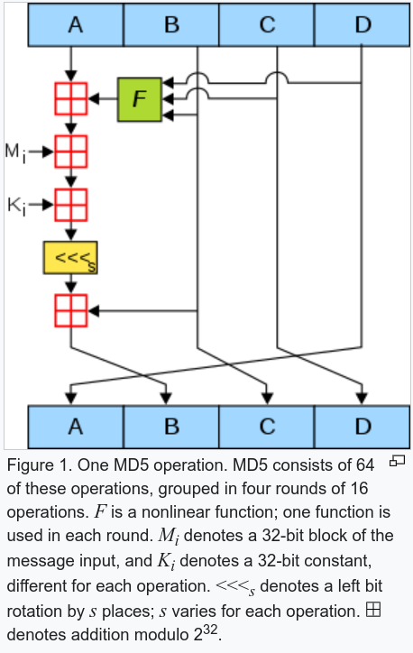

## HXP CTF 2020 - restless (Reversing 833)
##### 18/12 - 20/12/2020 (48hr)
___

### Description

**Difficulty estimate:** `hard`

**Points:** `round(1000 · min(1, 10 / (9 + [3 solves]))) = 833 points`


*I’ve been waiting anxiously for a package… Do you know what I bought?*

*Note: If the binary segfaults, try using a newer kernel (we verified that it works on Linux 5.0 and later). Sorry about that!*

*Note 2: Please download the challenge again (or change the byte at file offset 0x9058 from 0x07 to 0x0f), we fixed an alignment issue on some versions of Ubuntu (thank you to Redford for reporting that one)!*

```
Download: restless-ba52b83c100b1ec2.tar.xz (25.8 KiB)
```
___

### Solution

This was a very complex binary implementing a VM using co-routines. Program has a function in
`.init_array` section that initializes some global variables:
```c
void __fastcall u_init_func_tbl() {
  /* ... */
  glo_cpuid = u_do_cpuid();
  if ( glo_is_fnc_tbl_complete )
    v0 = (u_func_00)();
  else
    v0 = u_add_func_to_tbl(u_func_00);
  glo_var_00 = v0;
  if ( glo_is_fnc_tbl_complete )
    v1 = (u_func_01)();
  else
    v1 = u_add_func_to_tbl(u_func_01);
  glo_var_01 = v1;
  /* ... */  
  if ( glo_is_fnc_tbl_complete )
    v34 = u_func_34();
  else
    v34 = u_add_func_to_tbl(u_func_34);
  glo_var_34 = v34;
  if ( glo_is_fnc_tbl_complete )
    v35 = u_func_35();
  else
    v35 = u_add_func_to_tbl(u_func_35);
  glo_var_35 = v35;
  glo_goodboy_addr = "\x1B[32;1m:)\x1B[0m\n" & 0xFFFFFFFFFFFFLL | glo_goodboy_addr & 0xFFFF000000000000LL;
  HIWORD(glo_goodboy_addr) = 0xC000;
  glo_badboy_addr = "\x1B[31;1m:(\x1B[0m\n" & 0xFFFFFFFFFFFFLL | glo_badboy_addr & 0xFFFF000000000000LL;
  HIWORD(glo_badboy_addr) = 0xC000;
  if ( glo_is_fnc_tbl_complete )
    v36 = u_func_36();
  else
    v36 = u_add_func_to_tbl(u_func_36);
  glo_var_36 = v36;
  /* ... */
  if ( glo_is_fnc_tbl_complete )
    v56 = u_func_56();
  else
    v56 = u_add_func_to_tbl(u_func_56);
  glo_var_56 = v56;
  if ( glo_is_fnc_tbl_complete )
    v57 = (u_func_57)();
  else
    v57 = u_add_func_to_tbl(u_func_57);
  glo_var_57 = v57;
}
```

Function `u_add_func_to_tbl` appends a function pointer to `glo_func_tbl`:
```c
__int64 __fastcall u_add_func_to_tbl(void (*a1)(void)) {
  if ( glo_func_tbl_ctr > 0x7FF )
    BUG();
  ctr = glo_func_tbl_ctr++;
  glo_func_tbl[ctr] = a1;
  return 0LL;
}
```

Program initializes `glo_func_tbl` by appending `58` function pointers to it (function pointers
point to `u_func_*` functions). At the same time, the `glo_var_*` variables are initialized
to **0**.
It's also worth mentioning the `glo_goodboy_addr` and `glo_badboy_addr` variables which are 
initialized to `\x1B[32;1m:)\x1B[0m\n` and `\x1B[31;1m:(\x1B[0m\n` (the goodboy and badboy messages)
respectively.

Let's move on to `main`:
```c
int __fastcall main(int argc, char **argv, char **argp) {
  /* ... */
  if ( !getrlimit(RLIMIT_STACK, &rlimits) && rlimits.rlim_cur <= 0x3FFFFFF ) {
    rlimits.rlim_cur = 0x4000000LL;             // extend process stack
    setrlimit(RLIMIT_STACK, &rlimits);
  }
  u_init_r15();                                 // r15 is initialized to rsp - 0x6000
  
  frm1 = u_alloc_frame10();
  bound = (r15_ - 0x18 - (r15_ & 7));
  if ( (r15_ & 7) == 0 )                        // ensure address is multiple of 8
    bound = (r15_ - 0x18);
  bound->addr = 0LL;
  frm = bound;
  bound->field_8 = 0LL;
  bound->field_10 = 0LL;
  addr = bound->addr;
  bound->field_10 = 0LL;
  bound->addr = r8_ & u_BUG | addr & 0xFFFF000000000000LL;
  bound->field_8 = 0x2000DEADDEADDEADLL;
  HIWORD(bound->addr) = 0x2000;                 // no args (0x2000)
  v9 = frm1->first & 0xFFFF000000000000LL;
  frm1->second = 0LL;
  frm1->first = v9 | r8_ & bound;
  ctr = glo_func_tbl_ctr;
  HIWORD(frm1->first) = 0x2000;
  glo_is_fnc_tbl_complete = 1;
  if ( ctr ) {
    do
      glo_func_tbl[--glo_func_tbl_ctr]();
    while ( glo_func_tbl_ctr );
  }

  nargs = argc - 1;
  if ( argc - 1 < 0 ) {
    LOWORD(v12) = 0;
    v13 = 0LL;
    v14 = 0;
  } else {
    *&nargs = nargs;
    LOWORD(v12) = 0;
    v13 = 0LL;
    v14 = 0;
    do {                                        // for each argv[i]    
      nxt_arg = argv[*&nargs] & 0xFFFFFFFFFFFFLL;
      ops = (frm - (frm & 7) + 0x17FFFFFFF0LL);
      if ( (frm & 7) == 0 )
        ops = (frm + 0xFFFFFFF0);
      --*&nargs;
      ops->addr = 0LL;
      frm = ops;
      ops->field_8 = 0LL;
      v17 = ops->addr & 0xFFFF000000000000LL | v13;
      ops->field_8 = nxt_arg | ops->field_8 & 0xFFFF000000000000LL;
      HIWORD(ops->field_8) = 0xC000;
      ops->addr = v17;
      HIWORD(ops->addr) = v14 | (v12 << 13);
      // push argv[i] on VM stack
      v18 = u_emu_insn(glo_var_11, ops & 0xFFFFFFFFFFFFLL | 0x4002000000000000LL);
      v13 = v18 & 0xFFFFFFFFFFFFLL;
      v12 = v18 >> 61;
      v14 = HIWORD(v18) & 0x1FFF;
    } while ( nargs >= 0 );
  }

  v26 = v13;
  vm_57 = glo_var_57;
  arg_rsi = u_alloc_frame8();
  v21 = *arg_rsi & 0xFFFF000000000000LL;
  *arg_rsi = v21 | v26;
  *(arg_rsi + 6) = v14 | (v12 << 13);
  u_emu_func(vm_57, arg_rsi & 0xFFFFFFFFFFFFLL | 0x4001000000000000LL, v21, rcx_, v21 | v26, r9_);
  return 0;
}
```

Program first extends the stack limit to ensure it will fit all stack frames from co-routines.
Register `r15` is the VM stack pointer -and `r14` is the co-routine stack pointer.
Then program invokes all function pointers from `glo_func_tbl` array, starting from the end
(order does not matter actually):
```c
      glo_func_tbl[--glo_func_tbl_ctr]();
```

The functions that are invoked are the `u_func_*` functions. After that, the `argv` array is parsed
and its contents are pushed into the VM stack with the `u_emu_insn(glo_var_11, ...)` instruction
(VM instruction **#11** is PUSH). Then program invokes `u_emu_func(vm_57, ...` to starts the actual
emulation (`vm_57 is the VM main()`).

That is, if program wants to invoke VM instruction **4**, it takes the object from `glo_var_04`
and passes it to `u_emu_insn`. If program wants to invoke VM coroutine **57**, it takes the object
from `glo_var_57` and passes it to `u_emu_func`.


### Understanding the VM Architecture

Now let's analyze the VM architecture. We start with *data types*. If you have already noticed
from `main`, the data occupy only the **48** LSBits, while the **16** MSBits are set to some
weird constants (e.g., **2000h** or **C000h**). These constants indicate the type of the object.
That is, when the VM parses a pointer, it checks the first **16** bits to determine the object type
and parse it accordingly. Below are the different data types:
```
    20XX ~> Execute VM instruction (u_exec_*) with XX operands (arguments)
    40XX ~> List of length XX
    6000 ~> VM instruction (0x18 bytes frame)
    8000 ~> VM coroutine (0x30 bytes frame)
    A000 ~> Constant number
    C000 ~> Pointer to string
```

The `u_func_*` functions (from `glo_func_tbl` array), prepare the VM instruction objects and
initialize the `glo_var_*` globals:
```c
void __fastcall u_func_00() {
  /* ... */
  frm = (r15_ - 0x18);                          // alloc frame
  if ( (r15_ & 7) != 0 )                        // check alignment
    frm = (r15_ - 0x18 - (r15_ & 7));
  frm->addr = 0LL;
  frm->field_8 = 0LL;
  frm->field_10 = 0LL;
  frm->addr = u_exec_00 & 0xFFFFFFFFFFFFLL | frm->addr & 0xFFFF000000000000LL;
  HIWORD(frm->addr) = 0x2001;
  frm->field_10 = 0x4000000000000000LL;
  glo_var_00 = glo_var_00 & 0xFFFF000000000000LL | frm & 0xFFFFFFFFFFFFLL;
  HIWORD(glo_var_00) = 0x6000;
}
```

Function creates an object of **24** bytes (we call it **VM instruction frame**). The first field
contains the address of `u_exec_00` which is the wrapper for the VM instruction **#0**.
Please note that the **16** MSBits are set to `0x2001`. The `0x2000` means the pointer is a pointer
to a VM instruction. the `0x0001` means this VM function takes **1** argument (i.e., we have a VM 
instruction with a single operand). The other **2** fields are used to chain co-routines together
during execution. Finally, a pointer to this object is a assigned to `glo_var_00`. since this is a regular VM instruction (with a **24** byte object), the high bits of this pointer are set to
`0x6000`.


All these `u_func_*` are the same (their number of operands can be different, so the
instruction `HIWORD(frm->addr) = 0x200?` can have a different constant). VM co-routines are the
same, except they additionally invoke `u_prepare_func_frame`:
```c
void __fastcall u_func_57() {
  /* ... */
  frm = (r15_ - 0x18);
  if ( (r15_ & 7) != 0 )
    frm = (r15_ - 0x18 - (r15_ & 7));
  frm->addr = 0LL;
  frm->field_8 = 0LL;
  frm->field_10 = 0LL;
  frm->addr = u_exec_57 & 0xFFFFFFFFFFFFLL | frm->addr & 0xFFFF000000000000LL;
  HIWORD(frm->addr) = 0x2001;
  frm->field_10 = 0x4000000000000000LL;
  glo_var_57 = u_prepare_func_frame((frm & 0xFFFFFFFFFFFFLL | 0x6000000000000000LL));
}
```

Now let's check the VM core and how it that emulates the instructions:
```c
__int64 __fastcall u_emu_insn(unsigned __int64 a1_insn, unsigned __int64 a2_args) {
  /* ... */
  if ( (HIBYTE(a1_insn) & 0xE0) != 0x60 )       // must be type #1 (0x6000)
    goto ABORT;
  vm_arg1 = rbx_;
  while ( 1 ) {                                 // 1 iteration for each instruction operand
    if ( (HIBYTE(a2_args) & 0xE0) != 0x40 )     // must be 0x4000
      goto ABORT;
    insn = a1_insn & 0xFFFFFFFFFFFFLL;
    n_ops = HIWORD(a2_args) & 0x1FFF;           // number of operands (1, 2, 3)
    n_ops_ = HIWORD(a2_args) & 0x1FFF;
    // (HIWORD(*(a1_insn & 0xFFFFFFFFFFFFLL)) & 0x1FFF) ~> get number of args
    if ( (HIWORD(*(a1_insn & 0xFFFFFFFFFFFFLL)) & 0x1FFF) > (n_ops
                                                           + (HIWORD(*((a1_insn & 0xFFFFFFFFFFFFLL) + 0x10)) & 0x1FFF)) )
      break;
    n_ops_zero = *((a1_insn & 0xFFFFFFFFFFFFLL) + 0x16) & 0x1FFF;
    num_ops = (*((a1_insn & 0xFFFFFFFFFFFFLL) + 6) & 0x1FFF) - n_ops_zero;
    if ( num_ops > n_ops_ )
      goto ABORT;
    newfrm = 0LL;
    v64 = n_ops_ + n_ops_zero - (*((a1_insn & 0xFFFFFFFFFFFFLL) + 6) & 0x1FFF);
    num_ops_ = num_ops;
    alloc_space = 8LL * num_ops;
    if ( alloc_space ) {                         // allocate a stack frame to hold insn arguments
      v13 = r15_ - alloc_space;
      if ( (r15_ & 7) != 0 )
        v13 = r15_ - alloc_space - (r15_ & 7);
      ii = 0LL;
      r15_ = v13;
      do {                                       // clear stack frame
        *&v13[ii] = 0LL;
        ii += 8LL;
      } while ( alloc_space > ii );
      alloc_space = v13;
      newfrm = v13;
    }
    /* ... */
    jj = 0LL;
    if ( num_ops ) {                             // copy arguments to VM stack
      while ( a2_args >> 61 == 2 && (HIWORD(a2_args) & 0x1FFF) > jj ) {
        *&newfrm[8 * jj] = *((a2_args & 0xFFFFFFFFFFFFLL) + 8 * jj);
        if ( num_ops <= ++jj )
          goto COMPLETE;
      }
      goto ABORT;                               // smth went wrong
    }
    /* ... */
    r15_ = frm;
    frm->addr = 0LL;
    frm->field_8 = 0LL;
    frm->field_10 = 0LL;
    frm->field_10 = *r14_;                      // store old
    *r14_ = frm & 0xFFFFFFFFFFFFLL | *r14_ & 0xFFFF000000000000LL;
    *(r14_ + 6) = 0x2000;
    vm_arg1 = v38 & 0xFFFFFFFFFFFFLL | v40 & 0x1FFFFFFFFFFFFFFFLL | 0x4000000000000000LL;
    if ( *(insn + 8) >> 61 )
      a1_insn = u_call_vm_insn_2args(*(insn + 8) & 0xFFFFFFFFFFFFLL, vm_arg1, vm_fun, frm);
    else
      a1_insn = u_call_vm_insn_1arg(vm_arg1, vm_fun, frm);
    if ( (v67 & 0x1FFF000000000000LL) == 0 )
      return a1_insn;
    // There is a return value
    a2_args = v67;
    if ( (HIBYTE(a1_insn) & 0xE0) != 0x60 )
      goto ABORT;
  }
  /* ... */
}
```

```c
// positive sp value has been detected, the output may be wrong!
__int64 __fastcall u_call_vm_insn_2(__int64 a1_arg1, __int64 (__fastcall *a2_vm_func)(__int64), frame18 *a3_frm) {
  /*... */
  a3_frm->addr = v4;
  a3_frm->field_8 = &retaddr;
  a3_frm->field_8 |= 0x2000000000000000uLL;
  a3_frm->addr |= 0x2000000000000000uLL;
  return a2_vm_func(a1_arg1);
}
```

Function performs pushes the arguments to the stack and then invokes `u_call_vm_insn_2args` or
`u_call_vm_insn_1arg` to invoke the corresponding `u_exec_*` function.


VM also supports co-routines. `u_emu_func` is responsible for doing the context switch and calling
the corresponding co-routine:
```c
__int64 __fastcall u_emu_func(
        frame30 *a1_frm,
        __int64 a2_rsi,
        __int64 a3_unused,
        __int64 a4_rcx,
        __int64 a5_r8,
        __int64 a6_r9) {
  /* ... */
  if ( (HIBYTE(a1_frm) & 0xE0) != 0x80 || (HIBYTE(a2_rsi) & 0xE0) != 0x40 )
    BUG();
  v12 = r14_->field_8;                          // field 8 used to keep track of frames
  if ( a1_frm != v12 ) {
    if ( v12 >> 61 ) {
      v7 = r14_->field_8;
      if ( u_store_ctx(
             (*(v12 & 0xFFFFFFFFFFFFLL) & 0xFFFFFFFFFFFFLL),
             a2_rsi,
             0LL,                               // rdx is 0
             a4_rcx,
             a5_r8,
             a6_r9) ) {
        return *((r14_->field_8 & 0xFFFFFFFFFFFFLL) + 0x20);
      }
      *((v7 & 0xFFFFFFFFFFFFLL) + 0x10) = 0LL;
    }
    ctx = (a1_frm & 0xFFFFFFFFFFFFLL);
    for ( i = *((a1_frm & 0xFFFFFFFFFFFFLL) + 0x17) & 0xE0; i == 0x80; i = HIBYTE(ctx->r13_) & 0xE0 )
      ctx = (ctx->r13_ & 0xFFFFFFFFFFFFLL);
    v11 = ctx->field_0;
    if ( i == 0x60 ) {
      *((v11 & 0xFFFFFFFFFFFFLL) + 0x80) = u_emu_before_ctx_switch;// ret_val
      *((v11 & 0xFFFFFFFFFFFFLL) + 0x70) = ctx->r13_;// rdi
      *((v11 & 0xFFFFFFFFFFFFLL) + 0x68) = a2_rsi;// rsi
    }
    else if ( u_emu_before_ctx_switch == *((v11 & 0xFFFFFFFFFFFFLL) + 0x80) ) {
      *((v11 & 0xFFFFFFFFFFFFLL) + 0x68) = a2_rsi;// rsi
    }
    ctx->rbp_ = a2_rsi;
    ctx->r12_ = v12;
    u_do_ctx_switch((ctx->field_0 & 0xFFFFFFFFFFFFLL));
  }
  return a2_rsi;
}
```

Please note the `r14_->field_8` is used to keep track of the co-routine states. At the end there is
a context switch:
```c
void __fastcall __noreturn u_do_ctx_switch(ctx *a1) {
  /* ... */
  _xrstor(&a1->states, 0xFFFFFFFFuLL);          // Restore Processor Extended States
  ret_val = a1->ret_addr;
  // Decompilation is failing here: Restore registers from ctx  
  __writeeflags(a1->eflags);
  _mm_mfence();                                 // memory fence?
}
```

For a better view:
```assembly
.text:000055555555C030 ; void __fastcall __noreturn u_do_ctx_switch(ctx *a1)
.text:000055555555C030 u_do_ctx_switch proc near               ; CODE XREF: u_vm_35_F_print_and_func_ret_maybe+36C↓p
.text:000055555555C030                                         ; u_vm_35_F_print_and_func_ret_maybe+4F8↓p ...
.text:000055555555C030 ; __unwind {
.text:000055555555C030                 mov     eax, 0FFFFFFFFh
.text:000055555555C035                 mov     edx, 0FFFFFFFFh
.text:000055555555C03A                 xrstor  byte ptr [rdi+0D8h]
.text:000055555555C042                 mov     rsp, [rdi+98h]
.text:000055555555C049                 mov     rax, [rdi+80h]
.text:000055555555C050                 mov     [rsp+0], rax
.text:000055555555C054                 push    qword ptr [rdi+90h]
.text:000055555555C05A                 mov     rsi, [rdi+68h]
.text:000055555555C05E                 mov     rdx, [rdi+60h]
.text:000055555555C062                 mov     rcx, [rdi+58h]
.text:000055555555C066                 mov     rax, [rdi+50h]
.text:000055555555C06A                 mov     r8, [rdi+48h]
.text:000055555555C06E                 mov     r9, [rdi+40h]
.text:000055555555C072                 mov     r10, [rdi+38h]
.text:000055555555C076                 mov     r11, [rdi+30h]
.text:000055555555C07A                 mov     rbx, [rdi+28h]
.text:000055555555C07E                 mov     rbp, [rdi+20h]
.text:000055555555C082                 mov     r12, [rdi+18h]
.text:000055555555C086                 mov     r13, [rdi+10h]
.text:000055555555C08A                 mov     r14, [rdi+8]
.text:000055555555C08E                 mov     rdi, [rdi+70h]
.text:000055555555C092                 popfq
.text:000055555555C093                 cld
.text:000055555555C094                 mfence
.text:000055555555C097                 retn
```

The `rsp` is overwritten (`mov rsp, [rdi+98h]`), so `retn` jumps to the emulated instruction.


Now let's move to the `u_exec_*` functions. These are actually *wrappers*. They extract the operands (they are packed into a list) into registers and they invoke the real `u_vm_*` instruction:
```c
void __fastcall u_exec_00(__int64 a1) {
  unsigned __int64 v1; // rdi

  if ( (HIBYTE(a1) & 0xE0) != 0x40 || (HIWORD(a1) & 0x1FFF) != 1 )
    BUG();
  v1 = *(a1 & 0xFFFFFFFFFFFFLL);
  u_vm_00_getlist_1st(v1);  
}
```

Some VM instructions have **2** operands:
```c
void __fastcall __noreturn u_exec_31_copy_flag(__int64 a1) {
  if ( (HIBYTE(a1) & 0xE0) != 0x40 || (HIWORD(a1) & 0x1FFF) != 2 )
    BUG();
  u_vm_31_strchr_maybe(*(a1 & 0xFFFFFFFFFFFFLL), *((a1 & 0xFFFFFFFFFFFFLL) + 8));
}
```

Please note the sanity checks at the beginning. They reveal the type of the input (**0x40** means
it is a list and **2** means that the list has **2** elements).


### Reversing VM Instructions

Now let's look at some of the actual VM instructions. VM instruction **#2** takes a list
where each element is an object with **2** fields, and returns `a1->second->first`:
```c
// input : A list with 2-field elements
// output: a1->second->first
// 
// b = *(a1 + 8)
// return *b
void __fastcall __noreturn u_vm_02_getlist_2nd_1st(__int64 a1) {
  /* ... */
  if ( (a1 & 0xE000000000000000LL) != 0 && HIWORD(a1) != 0x4002
    || (f1 = u_alloc_frame8(),
        *f1 = a1,
        v3 = u_emu_insn(glo_var_01, f1 & 0xFFFFFFFFFFFFLL | 0x4001000000000000LL),
        f2 = u_alloc_frame8(),
        *f2 = v3,
        u_emu_insn(glo_var_00, f2 & 0xFFFFFFFFFFFFLL | 0x4001000000000000LL),
        v5 = (*r14_ & 0xFFFFFFFFFFFFLL),
        !(v5[2] >> 61))
    || (HIBYTE(*((*r14_ & 0xFFFFFFFFFFFFLL) + 0x10)) & 0xE0) != 0x20 )
  {
    BUG();
  }
  *r14_ = *((*r14_ & 0xFFFFFFFFFFFFLL) + 0x10);
  ((*v5 & 0xFFFFFFFFFFFFLL))();
}
```

As you can see, instructions can be based on simpler instructions (`u_emu_insn(glo_var_01, ...`
and `u_emu_insn(glo_var_00, ...`).

VM instruction **#8** takes as input a list and computes its length:
```c
// input : A list with 2-field elements
// output: The number of elements in the list
int __fastcall u_vm_08_list_length_maybe(frame10 *a1) {
  _QWORD *v1; // r14
  __int64 v2; // r15
  unsigned __int64 elt; // rax
  _QWORD *top; // rax
  int ii; // r12d
  __int64 frm; // rcx
  _QWORD *v8; // rdx

  elt = a1;
  if ( (HIBYTE(a1) & 0xE0) != 0 && HIWORD(a1) != 0x4002 )// a1: list with 2 elements
    goto ABORT;
  if ( !(a1 >> 61) )                            // is list empty?
  {
    top = (*v1 & 0xFFFFFFFFFFFFLL);
    if ( top[2] >> 61 && (HIBYTE(*((*v1 & 0xFFFFFFFFFFFFLL) + 0x10)) & 0xE0) == 0x20 )
    {
      *v1 = *((*v1 & 0xFFFFFFFFFFFFLL) + 0x10);
      return ((*top & 0xFFFFFFFFFFFFLL))();
    }
ABORT:
    BUG();
  }
  ii = 0;
  do
  {
    ++ii;                                       // <~~ decompiler sucks. We're returning this
    frm = v2 - 8 - (v2 & 7);                    // alloc
    if ( (v2 & 7) == 0 )
      frm = v2 - 8;
    *frm = 0LL;
    v2 = frm;
    *frm = elt;
    // elt = frm->second (i.e., get next element from the list)
    elt = u_emu_insn(glo_var_01, frm & 0xFFFFFFFFFFFFLL | 0x4001000000000000LL);
  }
  while ( elt >> 61 );
  v8 = (*v1 & 0xFFFFFFFFFFFFLL);
  if ( !(v8[2] >> 61) || (HIBYTE(*((*v1 & 0xFFFFFFFFFFFFLL) + 0x10)) & 0xE0) != 0x20 )
    goto ABORT;
  *v1 = *((*v1 & 0xFFFFFFFFFFFFLL) + 0x10);
  return ((*v8 & 0xFFFFFFFFFFFFLL))();
}
```

VM instruction **#16** is the Python's `reduce()`. It applies a VM instruction to every element
in a list and accumulates the results:
```c
// Python reduce()
// 
// Apply function a2 to the first 2 elements.
// Then apply the result to the next list
// 
// arg1: insn to execute after
// arg2: list of lists
// 
void __fastcall u_vm_16_array_reduce(unsigned __int64 a1, __int64 a2) {
  /* ... */
  if ( (HIBYTE(a2) & 0xE0) != 0x40 || (HIBYTE(a1) & 0xE0) != 0x60 || (HIWORD(a2) & 0x1FFFu) <= 1 )
    goto ABORT;
  v4 = u_alloc_frame10();
  v4->first = *(a2 & 0xFFFFFFFFFFFFLL);
  v4->second = *((a2 & 0xFFFFFFFFFFFFLL) + 8);
  acc = u_emu_insn(a1, v4 & 0xFFFFFFFFFFFFLL | 0x4002000000000000LL);
  if ( (HIWORD(a2) & 0x1FFF) != 2 )
  {
    ii = 2LL;
    while ( 1 )
    {
      frm = (r15_ - 0x10 - (r15_ & 7));
      if ( (r15_ & 7) == 0 )
        frm = (r15_ - 0x10);
      frm->first = 0LL;
      r15_ = frm;
      frm->second = 0LL;
      frm->first = acc;
      frm->second = *((a2 & 0xFFFFFFFFFFFFLL) + 8 * ii);
      acc = u_emu_insn(a1, frm & 0xFFFFFFFFFFFFLL | 0x4002000000000000LL);
      if ( ((HIWORD(a2) & 0x1FFF) - 1) == ii )
        break;
      if ( (HIWORD(a2) & 0x1FFF) == ++ii )
        goto ABORT;
    }
  }
  v8 = (*r14_ & 0xFFFFFFFFFFFFLL);
  if ( !(v8[2] >> 61) || (HIBYTE(*((*r14_ & 0xFFFFFFFFFFFFLL) + 0x10)) & 0xE0) != 0x20 )
ABORT:
    BUG();
  *r14_ = *((*r14_ & 0xFFFFFFFFFFFFLL) + 0x10);
  ((*v8 & 0xFFFFFFFFFFFFLL))();
}
```

Please notice the sanity checks: The first operand `a1` must be a VM instruction so the MSByte
needs to be **0x60**. The second operand `a2` needs to be list so the MSByte needs to be **0x40**.

Let's look at another one:
```c
void __fastcall __noreturn u_vm_45_add(__int64 a1, __int64 a2) {
  /* ... */
  res = u_ADD(a1, a2);
  u_AND(res, 0xA0000000FFFFFFFFLL);
  v4 = (*r14_ & 0xFFFFFFFFFFFFLL);
  if ( !(v4[2] >> 61) || (HIBYTE(*((*r14_ & 0xFFFFFFFFFFFFLL) + 0x10)) & 0xE0) != 0x20 )
    BUG();
  *r14_ = *((*r14_ & 0xFFFFFFFFFFFFLL) + 0x10);
}
```

```c
unsigned __int64 __fastcall u_ADD(__int64 a1, __int64 a2) {
  if ( (HIBYTE(a1) & 0xE0) != 0xA0 || (a1 & 0x1FFF000000000000LL) != 0
    || (HIBYTE(a2) & 0xE0) != 0xA0 || (a2 & 0x1FFF000000000000LL) != 0 ) {
    BUG();
  }
  return ((a1 & 0xFFFFFFFFFFFFLL) + (a2 & 0xFFFFFFFFFFFFLL)) & 0xFFFFFFFFFFFFLL | 0xA000000000000000LL;
}
```

```c
unsigned __int64 __fastcall u_AND(__int64 a1, __int64 a2) {
  if ( (HIBYTE(a1) & 0xE0) != 0xA0 || (a1 & 0x1FFF000000000000LL) != 0
    || (HIBYTE(a2) & 0xE0) != 0xA0 || (a2 & 0x1FFF000000000000LL) != 0 ) {
    BUG();
  }
  return a1 & 0xFFFFFFFFFFFFLL & a2 & 0xFFFFFFFFFFFFLL & 0xFFFFFFFFFFFFLL | 0xA000000000000000LL;
}
```

This is addition. The operands are numbers, so their MSByte is **0xA0**. Now the `strlen`:
```c
void __fastcall u_vm_28_strlen(__int64 a1) {
  /* ... */
  if ( (HIBYTE(a1) & 0xE0) != 0xC0 )
    goto ABORT;
  for ( i = (a1 & 0xFFFFFFFFFFFFLL); *i; ++i )  // strlen
    ;
  v3 = (*v1 & 0xFFFFFFFFFFFFLL);
  if ( !(v3[2] >> 61) || (HIBYTE(*((*v1 & 0xFFFFFFFFFFFFLL) + 0x10)) & 0xE0) != 0x20 )
ABORT:
    BUG();
  *v1 = *((*v1 & 0xFFFFFFFFFFFFLL) + 0x10);
  ((*v3 & 0xFFFFFFFFFFFFLL))();
}
```

Operand `a1` is a pointer to a string to its MSByte is **0xC0**.

We work similarly to reverse the other VM instructions (I won't analyze all of them, it will take
forever :P). The list of all VM instructions and co-routines (marked with `F_`) is shown below:
```
u_vm_00_getlist_1st
u_vm_01_getlist_2nd
u_vm_02_getlist_2nd_1st
u_vm_03_getlist_2nd_2nd
u_vm_04_getlist_2nd_2nd_1st
u_vm_05_getlist_2nd_2nd_2nd
u_vm_06_getlist_2nd_2nd_2nd_1st
u_vm_07_getlist_2nd_2nd_2nd_2nd
u_vm_08_list_length_maybe
u_vm_09_list_concat
u_vm_10_list_append
u_vm_11_push_2field_elt
u_vm_12_list_split 
u_vm_13_list_split_negative
u_vm_14_array_map_ignore_retv
u_vm_15_array_map_to_new_array 
u_vm_16_array_reduce 
u_vm_17_list_map_ignore_retv 
u_vm_18_list_map_to_new_list 
u_vm_19_list_reduce_2args
u_vm_20_map_array_of_lists 
u_vm_21_list_merge 
u_vm_22_list_index 
u_vm_23_list_chop
u_vm_24_list_to_stack_arr
u_vm_25_mk_list_init_with_a1 
u_vm_26_check_if_zero
u_vm_27_compare
u_vm_28_strlen 
u_vm_29_printf 
u_vm_30_printf_with_newline
u_vm_31_strchr_maybe 
u_vm_32_list_to_stack_char_arr 
u_vm_33_string_push_to_stack 
u_vm_34_call_func
u_vm_35_F_print_and_func_ret_maybe 
u_vm_36_F_chk_n_print_goodbadboy 
u_vm_37
u_vm_38_F_extract_flag_maybe 
u_vm_39_list_OR
u_vm_40_num_to_byte_list 
u_vm_41_list_chop_n_OR 
u_vm_42_F_prepare_input_for_md5
u_vm_43_list_reduce_2args_wrapper
u_vm_44_wrapper
u_vm_45_add
u_vm_46_wrapper
u_vm_47_nop
u_vm_48_rol
u_vm_49_wrapper
u_vm_50_smth_w_double
u_vm_51_sqrt 
u_vm_52_sine 
u_vm_53_md5
u_vm_54_num_to_4_elt_list
u_vm_55_F_MD5
u_vm_56_F_real_algo
u_vm_57_F_main 
```

### Reversing the VM Program

Now that we understand all VM the instructions we can understand the actual emulated program.
Program starts with co-routine **#57** which is actuall a wrapper for co-routine **56**:
```c
void __fastcall u_vm_57_F_main(__int64 a1) {
  /* ... */
  // a1->next->value
  addr_flag = u_emu_insn(glo_var_02, v3 & 0xFFFFFFFFFFFFLL | 0x4001000000000000LL);
  if ( !(addr_flag >> 61) ) {                   // addr is NULL
    v16 = v4 - 8;
    var_36 = glo_var_36;
    v18 = v4 & 7;
    f1 = v4 - 8 - v18;
    if ( (v4 & 7) == 0 )
      f1 = v4 - 8;
    *f1 = 0LL;
    v4 = f1;
    *f1 = glo_A000000000000000;                 // set to 0 and call print_goodbadboy
    u_emu_func(var_36, f1 & 0xFFFFFFFFFFFFLL | 0x4001000000000000LL, v16, v18, v6, v7);
  }
  v8 = v4 - 8;
  // invoke function vm_56
  insn_56 = glo_var_56;
  /* ... */
  if ( v23 != insn_56 ) {
    if ( v23 >> 61 ) {
      v14 = *(v1 + 8);
      if ( u_store_ctx((*(v23 & 0xFFFFFFFFFFFFLL) & 0xFFFFFFFFFFFFLL), v12, v8, v10, v6, v7) )
        return;
      *((v14 & 0xFFFFFFFFFFFFLL) + 0x10) = glo_0;
    }
    nxt_56 = (insn_56 & 0xFFFFFFFFFFFFLL);
    for ( i = *((insn_56 & 0xFFFFFFFFFFFFLL) + 0x17) & 0xE0; i == 0x80; i = HIBYTE(nxt_56->field_10) & 0xE0 )
      nxt_56 = (nxt_56->field_10 & 0xFFFFFFFFFFFFLL);
    ctx = nxt_56->ctx;
    if ( i == 0x60 ) {
      *((ctx & 0xFFFFFFFFFFFFLL) + 0x80) = u_emu_before_ctx_switch;
      *((ctx & 0xFFFFFFFFFFFFLL) + 0x70) = nxt_56->field_10;
      *((ctx & 0xFFFFFFFFFFFFLL) + 0x68) = v13;
    } else if ( u_emu_before_ctx_switch == *((ctx & 0xFFFFFFFFFFFFLL) + 0x80) ) {
      *((ctx & 0xFFFFFFFFFFFFLL) + 0x68) = v13;
    }
    nxt_56->x4000000000000000 = v13;
    nxt_56->field_18 = v23;
    u_do_ctx_switch((nxt_56->ctx & 0xFFFFFFFFFFFFLL));
  }
  /* ... */
}
```

Co-routine **#56** does all the work:
```c
void __fastcall u_vm_56_F_real_algo(__int64 a1) {
  /* ... */
  // Decompiler sucks :(
  // There's a: "mov     r8, cs:glo_var_38"
  v8 = u_alloc_frame10_init(&a1_, &funfrm);
  md5_flag = u_emu_func(r8_, v8, rdx_, rcx_, r8_, r9_);// glo_var_38 extract flag from hxp{}
                                                // then return to glo_var_56
  f10 = u_alloc_frame10_init(&glo_var_34, &md5_flag);
  flag_lst = u_emu_insn(glo_var_14, f10);       // array map()
  var_55 = glo_var_55;
  v17 = v7 - 8;
  v18 = flag_lst;
  v19 = v7 & 7;
  v20 = v7 - 8 - v19;
  if ( (v7 & 7) == 0 )
    v20 = v7 - 8;
  *v20 = 0LL;
  v21 = v20;
  *v20 = v18;
  // both lists are produced here
  md5_flag_lst = u_emu_func(var_55, v20 & 0xFFFFFFFFFFFFLL | 0x4001000000000000LL, v17, v19, v18, v15);// md5
  md5_flag_lst_ = md5_flag_lst;

  
  const_34 = glo_trg_md5 & 0xFFFFFFFFFFFFLL | const_34 & 0xFFFF000000000000LL;
  HIWORD(const_34) = 0xC000;
  v23 = v21 - 8 - (v21 & 7);
  if ( (v21 & 7) == 0 )
    v23 = v21 - 8;
  *v23 = 0LL;
  v24 = v23;
  *v23 = md5_flag_lst;
  md5_flag = u_emu_insn(glo_var_00, v23 & 0xFFFFFFFFFFFFLL | 0x4001000000000000LL);
  v25 = u_alloc_frame10_init(&md5_flag, &const_34);
  v26 = u_emu_insn(glo_var_27, v25);            // compare
  v27 = v24 - 8 - (v24 & 7);
  if ( (v24 & 7) == 0 )
    v27 = v24 - 8;
  *v27 = 0LL;
  v28 = v27;
  *v27 = v26;
  eq = u_emu_insn(glo_var_26, v27 & 0xFFFFFFFFFFFFLL | 0x4001000000000000LL);// check if 0
  var_56_or_36 = glo_var_56;
  if ( !(eq >> 61) )
    var_56_or_36 = glo_var_36;
  v34 = v28 - 8;
  v35 = v28 - 8 - (v28 & 7);
  if ( (v28 & 7) == 0 )
    v35 = v28 - 8;
  *v35 = 0LL;
  v36 = v35;
  *v35 = glo_A000000000000000;
  u_emu_func(var_56_or_36, v35 & 0xFFFFFFFFFFFFLL | 0x4001000000000000LL, v30, v34, v31, v32);

  /* ... */
  md5_flag = 0xA000000000000033LL;
  const_34 = 0xA0000000000003F1LL;
  const_33 = 0xA00000000000002FLL;
  v220 = 0xA000000000000176LL;
  const_32 = 0xA00000000000037DLL;
  const_31 = 0xA00000000000036FLL;
  const_30 = 0xA0000000000000BALL;
  const_29 = 0xA0000000000002CCLL;
  const_28 = 0xA00000000000031BLL;
  const_27 = 0xA00000000000022FLL;
  const_26 = 0xA0000000000001EELL;
  const_25 = 0xA000000000000363LL;
  const_24 = 0xA0000000000001B4LL;
  const_23 = 0xA0000000000002A7LL;
  const_22 = 0xA00000000000030BLL;
  const_21 = 0xA000000000000165LL;
  const_20 = 0xA000000000000186LL;
  const_19 = 0xA000000000000001LL;
  const_18 = 0xA0000000000003E4LL;
  const_12 = 0xA000000000000100LL;
  const_17 = 0xA000000000000104LL;
  const_11 = 0xA000000000000073LL;
  const_16 = 0xA0000000000003A8LL;
  const_10 = 0xA000000000000245LL;
  const_15 = 0xA00000000000038DLL;
  const_08 = 0xA000000000000287LL;
  const_14 = 0xA0000000000002E7LL;
  v203 = 0xA0000000000000AELL;
  const_35 = 0xA00000000000011CLL;
  const_13 = 0xA0000000000002C2LL;
  const_09 = 0xA0000000000001DCLL;
  const_37 = 0LL;
  const_07 = 0xA000000000000275LL;
  v201 = 0xA0000000000002C2LL;
  const_04 = 0xA000000000000329LL;
  v200 = 0xA000000000000087LL;
  const_03 = 0xA000000000000026LL;
  const_06 = 0xA000000000000082LL;
  const_02 = 0xA00000000000036BLL;
  const_05 = 0xA000000000000339LL;
  const_01 = 0xA0000000000003ADLL;
  list = 0LL;
  v37 = u_alloc_frame10_init(&const_01, &list);
  v38 = (v36 - 16 - (v36 & 7));
  if ( (v36 & 7) == 0 )
    v38 = (v36 - 16);
  v38->first = 0LL;
  v39 = v38;
  v38->second = 0LL;
  v38->first = 0xA000000000000153LL;
  v38->second = v37;                            // next
  list = (list & 0xFFFF000000000000LL | v38 & 0xFFFFFFFFFFFFLL);
  HIWORD(list) = 0x4002;
  /**
   *   Add all objects from const_* into a list
   */
  v141 = u_alloc_frame10_init(&const_29, v139);
  v143 = v140 - 16 - (v140 & 7);
  if ( (v140 & 7) == 0 )
    v143 = v140 - 16;
  *v143 = 0LL;
  v144 = v143;
  *(v143 + 8) = 0LL;
  *v143 = v142;
  *(v143 + 8) = v141;
  const_29 = const_29 & 0xFFFF000000000000LL | v143 & 0xFFFFFFFFFFFFLL;
  HIWORD(const_29) = 16386;
  v147 = u_alloc_frame10_init(&const_30, &const_29);
  v148 = v144 - 16 - (v144 & 7);
  if ( (v144 & 7) == 0 )
    v148 = v144 - 16;
  *v148 = 0LL;
  v149 = v148;
  *(v148 + 8) = 0LL;
  *v148 = v146;
  *(v148 + 8) = v147;
  const_30 = v148 & 0xFFFFFFFFFFFFLL | const_30 & 0xFFFF000000000000LL;
  HIWORD(const_30) = 0x4002;
  v150 = u_alloc_frame10_init(&const_31, v145);
  v152 = v151;
  const_31 = v150;
  const_31 = u_alloc_frame10_init(&const_32, v151);
  v154 = u_alloc_frame10_init(v153, v152);
  v156 = v155;
  v220 = v154;
  v220 = u_alloc_frame10_init(&const_33, v155);
  v157 = u_alloc_frame10_init(&const_34, v156);
  v159 = v158;
  const_34 = v157;
  const_34 = u_alloc_frame10_init(&const_35, v158);
  md5_flag = u_alloc_frame10_init(&md5_flag, v159);
  md5_flag = u_alloc_frame10_init(&const_37, &md5_flag);// 64 items in the list
  /* ... */
  // <---
  if ( (HIBYTE(fret) & 0xE0) != 64 || (fret & 0x1FFF000000000000LL) == 0 )
    BUG();
  final = u_alloc_frame10_init((fret & 0xFFFFFFFFFFFFLL), &md5_flag);
  v172 = u_emu_insn(glo_var_27, final);         // compare!
  var_36 = glo_var_36;
  v175 = v172;
  v176 = v169 & 7;
  v177 = v169 - 8 - v176;
  if ( (v169 & 7) == 0 )
    v177 = v169 - 8;
  *v177 = 0LL;
  *v177 = v175;
  // check and print good/bad boy
  u_emu_func(var_36, v177 & 0xFFFFFFFFFFFFLL | 0x4001000000000000LL, v169 - 8, v176, v175, v173);
}
```

Co-routine **#56** strips off the `hxp{` and `}` from the flag, it computes its MD5 hash and
compares it with `glo_trg_md5`:
```
.rodata:0000555555569018 glo_trg_md5     db 30h, 6Fh, 3, 6, 0BCh, 6Bh, 9Bh, 57h, 1Ah, 52h, 0F0h
.rodata:0000555555569023                 db 59h, 67h, 98h, 0AEh, 42h
```

However, there is another check that takes pplace if this check is passed: 
Function creates a list of **64** elements that contain some small constants
(**0x033**, **0x3F1** and so on) and compares it with a list that is computed
during the MD5 calculation (`u_emu_func(var_55, ...`).


If both checks are passed (`u_vm_27_compare` compares **2** objects of the same type and if they
are equal it pushes an **1** on top of the VM stack; otherwise it pushes a **0**). Then
instruction **#36** (`u_emu_func(var_36, ...`) is called to print the final goodboy (or badboy)
message:
```c
void __fastcall __noreturn u_vm_36_F_chk_n_print_goodbadboy(__int64 a1) {
  /* ... */
  v1 = u_alloc_frame8();
  *v1 = a1;
  boymsg = &glo_goodboy_addr;
  result = u_emu_insn(glo_var_26, v1 & 0xFFFFFFFFFFFFLL | 0x4001000000000000LL);
  var_35 = glo_var_35;
  if ( !(result >> 61) )                        // result is 0
    boymsg = &glo_badboy_addr;                  // select badboy
  v5 = u_alloc_frame8();
  v6 = *boymsg;
  *v5 = *boymsg;
  u_emu_func(var_35, v5 & 0xFFFFFFFFFFFFLL | 0x4001000000000000LL, v6, v7, v8, v9);
  exit(0);                                      // last VM instruction!
}
```

### Getting the MD5 Leaks

The last part is to figure out how the **64** numbers from this list are computed during the MD5
calculation. This is quite hard as they are buried deep inside the code:
```c
void __fastcall u_vm_55_F_MD5(__int64 a1) {
  /* ... */
  v5 = u_emu_insn(glo_var_46, 0x4000000000000000uLL);
  v6 = v2 - 16 - (v2 & 7);
  if ( (v2 & 7) == 0 )
    v6 = v2 - 16;
  *v6 = 0LL;
  *(v6 + 8) = 0LL;
  *(v6 + 8) = 0LL;
  *v6 = 0xA000000010325476LL;                   // init MD5
  v7 = v6 & 0xFFFFFFFFFFFFLL;
  v8 = v6 - 16;
  v9 = v6 & 7;
  v10 = v6 - 16 - v9;
  if ( !v9 )
    v10 = v8;
  *v10 = 0LL;
  *(v10 + 8) = 0LL;
  v11 = *(v10 + 8);
  *v10 = 0xA000000098BADCFELL;
  /* ... */
  v26 = u_emu_insn(glo_var_53, v24 & 0xFFFFFFFFFFFFLL | 0x4001000000000000LL);// do MD5
  /* ... */
}
```

```c
void __fastcall u_vm_53_md5(__int64 a1) {
  /* ... */
  args = u_alloc_frame10();
  args->first = a1;
  args->second = r8_;
  v4 = args & 0xFFFFFFFFFFFFLL;
  frm = u_alloc_frame18();
  frm->field_10 = 0x4000000000000000LL;
  v6 = frm->field_8 & 0xFFFF000000000000LL;
  frm->addr = u_md5_wrapper & 0xFFFFFFFFFFFFLL | frm->addr & 0xFFFF000000000000LL;
  frm->field_8 = v6 | v4;
  HIWORD(frm->addr) = 0x2002;
  HIWORD(frm->field_8) = 0x2002;
  u_prepare_func_frame((frm & 0xFFFFFFFFFFFFLL | 0x6000000000000000LL));
  v7 = (*r14_ & 0xFFFFFFFFFFFFLL);
  if ( !(v7->field_10 >> 61) || (HIBYTE(*((*r14_ & 0xFFFFFFFFFFFFLL) + 0x10)) & 0xE0) != 0x20 )
    BUG();
  *r14_ = *((*r14_ & 0xFFFFFFFFFFFFLL) + 0x10);
  ((v7->addr & 0xFFFFFFFFFFFFLL))();
}
```

```c
void __fastcall __noreturn u_md5_wrapper(frame18 *a1, __int64 a2) {
  if ( (HIBYTE(a2) & 0xE0) == 0x40 && (HIWORD(a2) & 0x1FFF) == 2 )
    u_do_md5_probably(a1, *(a2 & 0xFFFFFFFFFFFFLL), *((a2 & 0xFFFFFFFFFFFFLL) + 8));
  BUG();
}
```

Please focus on the `KILL_IT_VALUE` value:
```c
void __fastcall __noreturn u_do_md5_probably(frame18 *a1, __int64 a2_vm_arg1, __int64 a3_vm_arg2) {
  /* ... */
  while ( 1 ) {
    /* ... */
      v173 = u_emu_insn(var_48, v170 & 0xFFFFFFFFFFFFLL | 0x4002000000000000LL);// rol
      v174 = v171 - 16 - (v171 & 7);
      if ( (v171 & 7) == 0 )
        v174 = v171 - 16;
      *v174 = 0LL;
      v175 = v174;
      *(v174 + 8) = 0LL;
      *v174 = v173;
      *(v174 + 8) = B;
      KILL_IT_VALUE = u_emu_insn(glo_var_45, v174 & 0xFFFFFFFFFFFFLL | 0x4002000000000000LL);// add
      if ( (HIBYTE(KILL_IT_VALUE) & 0xE0) != 0xA0 || (KILL_IT_VALUE & 0x1FFF000000000000LL) != 0 )
        goto ABORT;
      v177 = (v175 - 8 - (v175 & 7));
      v122 = a1->addr;
      if ( (v175 & 7) == 0 )
        v177 = (v175 - 8);
      v177->addr = 0LL;
      v129 = v177;
      v131 = v177->addr & 0xFFFF000000000000LL;
      v129->addr = v131 | KILL_IT_VALUE & 0x3FF;// keep 10 bits 
      HIWORD(v129->addr) = -24576;
      v127 = v238 & 0xFFFF000000000000LL;
      v178 = v129 & 0xFFFFFFFFFFFFLL | 0x4001000000000000LL;
      v238 = v178;
      if ( (HIBYTE(v122) & 0xE0) != 0x80
        || !((v127 & 0xFFFFFFFFFFFFLL | v129 & 0xFFFFFFFFFFFFLL | 0x4001000000000000LL) >> 56)
        || v229 && (HIBYTE(glo_0) & 0xE0) != 96 )
      {
        goto ABORT;
      }
    /* ... */      
      v253 = *(r14_ + 8);
      if ( v122 == v253 ) {
    
        /* ... */
      } else {        
        /* ... */
          // INVOKE u_vm_func_46 to push KILL_IT_VALUE to stack
          u_do_ctx_switch((*v220 & 0xFFFFFFFFFFFFLL));       
        /* ... */
      }
      v235 = D;                                 // shuffle inputs
      D = C;
      Ctmp = B;
      B = KILL_IT_VALUE;
      C = Ctmp;
      v133 = v232 & 0xFFFFFFFFFFFFLL;
      v232 = ((v232 & 0xFFFFFFFFFFFFLL) + 1) & 0xFFFFFFFFFFFFLL;
      if ( (HIBYTE(v234) & 0xE0) != 0x80 )
        goto ABORT;
    }
  /* ... */
```

```c
void __fastcall u_vm_func_46(__int64 a1, __int64 a2) {
  /* ... */
    v10->first = 0LL;
    frm = v10;
    v10->second = 0LL;
    v11 = v10->first & 0xFFFF000000000000LL;
    frm->first = v11 | v7;
    v12 = HIWORD(v11) & 0xE000 | v5;
    HIWORD(frm->first) = v12;
    HIBYTE(frm->first) = (32 * v6) | HIBYTE(v12) & 0x1F;
    var_11 = glo_var_11;
    frm->second = *REALVAL;
    // push other nums
    v14 = u_emu_insn(var_11, frm & 0xFFFFFFFFFFFFLL | 0x4002000000000000LL);// push
    v5 = HIWORD(v14);
    v7 = v14 & 0xFFFFFFFFFFFFLL;
    v6 = v14 >> 61;
    LOWORD(v5) = HIWORD(v14) & 0x1FFF;
  /* ... */
}
```

The most important instruction is:
```c
  v129->addr = v131 | KILL_IT_VALUE & 0x3FF;  // keep 10 bits 
```

To better understand this code, let's look at how an MD5 round works:




The `KILL_IT_VALUE` is a copy of the variable `B`. Then `v129->addr` 
takes the output of the **10** LSBits of that variable. That is, in every round, we take
the **10** LSBits from the `B` variable and we push them to stack using `u_vm_func_46`.
We essentially have a **leak** of the MD5 rounds.


### Cracking the Code

Our task is now straight forward: We need to find a flag that its MD5 checksum is
`306f0306bc6b9b571a52f0596798ae42`. The additional information we have are the **10**
LSBits of the value `B` from each of the **64** rounds. For more details, please refer to the
[MD5 implementation](https://en.wikipedia.org/wiki/MD5#Pseudocode).
```
    0x033, 0x11C, 0x3F1, 0x02F, 0x176, 0x37D, 0x36F, 0x11C, 0x0BA, 0x1DC,
    0x2CC, 0x31B, 0x3FF, 0x22F, 0x1EE, 0x159, 0x363, 0x1B4, 0x2A7, 0x2CB,
    0x30B, 0x165, 0x0C6, 0x25B, 0x186, 0x2C9, 0x2E8, 0x360, 0x001, 0x3E4,
    0x104, 0x32C, 0x3A8, 0x1A8, 0x38D, 0x3CA, 0x2E7, 0x2C2, 0x1DA, 0x100,
    0x32F, 0x13C, 0x073, 0x399, 0x355, 0x245, 0x1DC, 0x0B1, 0x287, 0x19E,
    0x0AE, 0x275, 0x1D1, 0x082, 0x339, 0x0B7, 0x2C2, 0x329, 0x087, 0x026,
    0x01C, 0x36B, 0x153, 0x3AD
```

To do that, we use an SMT solver: We implement the MD5 algorithm, but we replace the input message
with symbolic variables. We also constraint the output `B` of each rounds so that the **10** LSBits match with the leaked ones:
```python
def crack_md5(cand_len, b_values):
    """Symbolic implementation of MD5 . """
    global s, K  # `s` and `K` are global

    slv = z3.Solver()
    
    inp = [z3.BitVec(f'inp_{i}', 32) for i in range(16)]

    add_inp_constraint(cand_len, inp, slv)

    # MD5 implementation using symbolic variables.
    a0 = 0x67452301  # A
    b0 = 0xefcdab89  # B
    c0 = 0x98badcfe  # C
    d0 = 0x10325476  # D

    A, B, C, D = a0, b0, c0, d0
   
    for i in range(64):
        if 0 <= i and i <= 15:
            F = (B & C) | (~B & D)
            g = i
        elif 16 <= i and i <= 31:
            F = (D & B) | (~D & C)
            g = (5*i + 1) % 16
        elif 32 <= i and i <= 47:
            F = B ^ C ^ D
            g = (3*i + 5) % 16
        elif 48 <= i <= 63:
            F = C ^ (B | ~D)
            g = (7*i) % 16

        F &= 0xFFFFFFFF
        F = (F + A + K[i] + inp[g]) & 0xFFFFFFFF 
        A = D
        D = C
        C = B

        # NOTE: rol DOES NOT WORK! WE HAVE TO USE z3's `RotateLeft`.
        B = (B + z3.RotateLeft(F, s[i])) & 0xFFFFFFFF

        slv.add(B & 0x3FF == b_values[i])
```

To further reduce the search space we apply function `add_inp_constraint` to reduce the set of
allowed values for each byte of the input:
```python
def add_inp_constraint(inp_len, inp, slv):
    """Adds constraints to flag bytes."""
    # Allowed characters for the flag.
    charset = 'ABCDEFGHIJKLMNOPQRSTUVWXYZabcdefghijklmnopqrstuvwxyz0123456789_'

    # Add constraints to whitelist each character from `charset`.
    def whitelist(inp, slv):
        return z3.Or([inp == ord(x) for x in charset])

    # The MD5 input is flag + 0x80 + zero padding + flag length in bits.
    #
    # Based on the flag length, add the appropriate constraints.
    for g in range(16):
        if g < inp_len // 4:
            slv.add(
                z3.And([
                    whitelist(inp[g] & 0xFF, slv),
                    whitelist(z3.LShR(inp[g], 8) & 0xFF, slv),
                    whitelist(z3.LShR(inp[g], 16) & 0xFF, slv),
                    whitelist(z3.LShR(inp[g], 24) & 0xFF, slv),
            ]))
        elif g == inp_len // 4:
            if inp_len % 4 == 0:
                slv.add(
                    z3.And([                    
                        (inp[g] & 0xFF) == 0x80,
                        (inp[g] >> 8) & 0xFF == 0,
                        (inp[g] >> 16) & 0xFF == 0,
                        (inp[g] >> 24) & 0xFF == 0
                ]))
            elif inp_len % 4 == 1:
                slv.add(
                    z3.And([                    
                        whitelist(inp[g] & 0xFF, slv),
                        (inp[g] >> 8) & 0xFF == 0x80,
                        (inp[g] >> 16) & 0xFF == 0,
                        (inp[g] >> 24) & 0xFF == 0
                ]))
            elif inp_len % 4 == 2:
                slv.add(
                    z3.And([
                        whitelist(inp[g] & 0xFF, slv),
                        whitelist((inp[g] >> 8) & 0xFF, slv),
                        (inp[g] >> 16) & 0xFF == 0x80,
                        (inp[g] >> 24) & 0xFF == 0
                ]))
            elif inp_len % 4 == 3:
                slv.add(
                    z3.And([
                        whitelist(inp[g] & 0xFF, slv),
                        whitelist((inp[g] >> 8) & 0xFF, slv),
                        whitelist((inp[g] >> 16) & 0xFF, slv),
                        (inp[g] >> 24) & 0xFF == 0x80
                ]))
        elif g == 14:
            slv.add(inp[g] == inp_len*8)
        elif g == 15:
            slv.add(inp[g] == 0x0)
        elif g > inp_len // 4:
            slv.add(inp[g] == 0x0)
```

The only problem we have is that we do not know the length of the flag to know from which byte the
zero padding starts. However, we can brute force it and try to find a solution for each possible
flag length. The only flag length that yields to a solution is **30**:
```
ispo@ispo-glaptop2:~/ctf/hxp_2020/restless$ time ./restless_crack.py
[+] Restless crack started.
[+] Trying flag length 20 ...
[+] Cannot find satisfiable solution :\
[+] Trying flag length 21 ...
[+] Cannot find satisfiable solution :\
[+] Trying flag length 22 ...
[+] Cannot find satisfiable solution :\
[+] Trying flag length 23 ...
[+] Cannot find satisfiable solution :\
[+] Trying flag length 24 ...
[+] Cannot find satisfiable solution :\
[+] Trying flag length 25 ...
[+] Cannot find satisfiable solution :\
[+] Trying flag length 26 ...
[+] Cannot find satisfiable solution :\
[+] Trying flag length 27 ...
[+] Cannot find satisfiable solution :\
[+] Trying flag length 28 ...
[+] Cannot find satisfiable solution :\
[+] Trying flag length 29 ...
[+] Cannot find satisfiable solution :\
[+] Trying flag length 30 ...
[+] Solution FOUND!
[+]  0 ~~> 72305F69 ~~> 'i_0r'
[+]  1 ~~> 33723364 ~~> 'd3r3'
[+]  2 ~~> 30635F64 ~~> 'd_c0'
[+]  3 ~~> 74753072 ~~> 'r0ut'
[+]  4 ~~> 53336E31 ~~> '1n3S'
[+]  5 ~~> 3072665F ~~> '_fr0'
[+]  6 ~~> 31775F6D ~~> 'm_w1'
[+]  7 ~~> 00806873 ~~> 'sh\x80\x00'
[+]  8 ~~> 00000000 ~~> '\x00\x00\x00\x00'
[+]  9 ~~> 00000000 ~~> '\x00\x00\x00\x00'
[+] 10 ~~> 00000000 ~~> '\x00\x00\x00\x00'
[+] 11 ~~> 00000000 ~~> '\x00\x00\x00\x00'
[+] 12 ~~> 00000000 ~~> '\x00\x00\x00\x00'
[+] 13 ~~> 00000000 ~~> '\x00\x00\x00\x00'
[+] 14 ~~> 000000F0 ~~> 'ð\x00\x00\x00'
[+] 15 ~~> 00000000 ~~> '\x00\x00\x00\x00'
```

So the flag is: `hxp{i_0rd3r3d_c0r0ut1n3S_fr0m_w1sh}`

We can also verify it:
```
ispo@ispo-glaptop2:~/ctf/hxp_2020/restless$ ./restless hxp{ispo}
:(

ispo@ispo-glaptop2:~/ctf/hxp_2020/restless$ ./restless hxp{i_0rd3r3d_c0r0ut1n3S_fr0m_w1sh}
:)
```

For more details, please take a look at the [restless_crack.py](./restless_crack.py) script.
___
