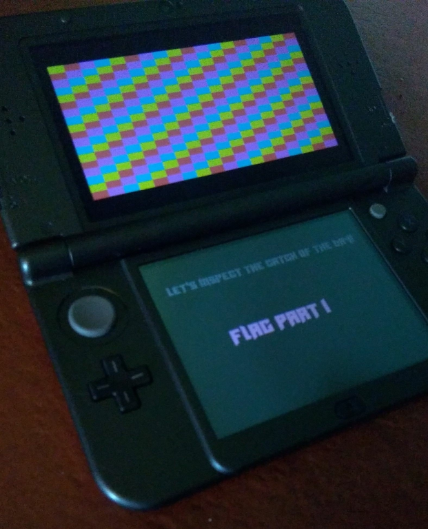
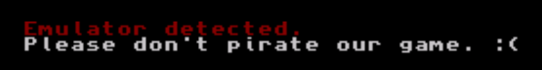
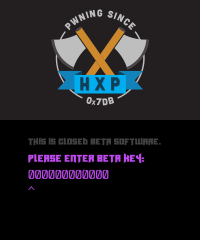
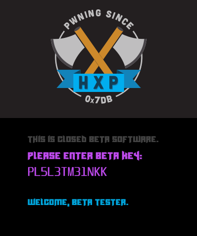
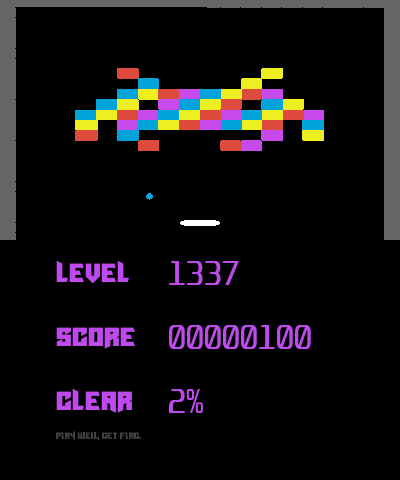
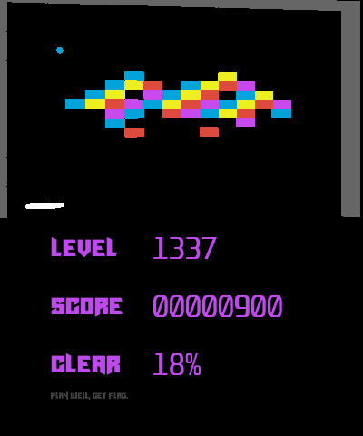
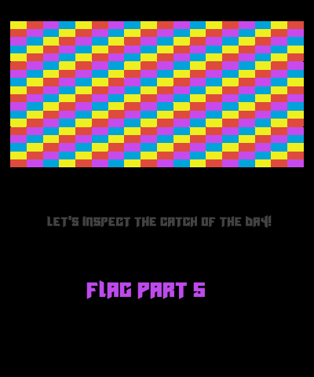

## HXP CTF 2021 - hxp3drm (RE 714)
##### 17-19/12/2021 (48hr)
___

### Description
 
**Difficulty estimate:** medium - medium

**Points:** round(1000 · min(1, 10 / (9 + [5 solves]))) = 714 points

*I was invited to a private beta by hxp’s (not so) secret game development lab.*
*After a lot of suffering I managed to beat the game, but my olden eyes just cannot pick up the flag. Can you?*



**Note:** Convert all flag characters to lower case before submitting your flag.

Download:
```
hxp3drm-97e6665a131c8727.tar.xz (154.4 KiB)
```
___

### Solution

Here, we have to deal with Nintendo 3DS challenge. The first task is to run the program in the
emulator. We use [citra](https://flathub.org/apps/details/org.citra_emu.citra):
```
flatpak run org.citra_emu.citra
```

#### Bypassing emulator checks

Shortly after we run the program, we get an error that the emulator was detected:



To find where this check comes from, we look at the XREFs to the `Emulator detected.` string:
```assembly
RODATA:00146314 aEmulatorDetect DCB "Emulator detected.",0xA
RODATA:00146314                 DCB "Please don't pirate our game. :(",0
```

However, there are no XREFs to it. To fix this, we search for `LDR` instructions that contain an
offset that corresponds (or it is very close) to `aEmulatorDetect`:
```assembly
CODE:0010BA08         MOV             R9, #0
CODE:0010BA0C         LDR             R4, =0x146313   ; <---- THIS
CODE:0010BA10         LDR             R7, =0x5F5E100
CODE:0010BA14         ADD             R5, R4, #1
CODE:0010BA18         ADD             R6, R4, #0x12
CODE:0010BA1C
....
CODE:0010BA60         BL              sub_1398A0
CODE:0010BA64         MOV             R9, #0
CODE:0010BA68         LDR             R4, =0x146325   ; <---- AND THIS
CODE:0010BA6C         LDR             R6, =0x5F5E100
....
CODE:0010BAC0 dword_10BAC0 DCD 0x146313
CODE:0010BAD0 dword_10BAD0 DCD 0x146325
```

Addresses `146313h` and `146325h` are the ones we are looking for, so we tell IDA to treat them as
XREFs. After that, the code is fixed:
```assembly
RODATA:00146314 aEmulatorDetect DCB "Emulator detected.",0xA
RODATA:00146314                                         ; DATA XREF: u_detect_emulator:loc_10BA1C↑r
RODATA:00146314                 DCB "Please don't pirate our game. :(",0
RODATA:00146348 glo_WHITE       DCB 0x1B,"[39m",0       ; DATA XREF: u_detect_emulator+1F8↑o


CODE:0010BA0C         LDR             R4, =0x146313
CODE:0010BA10         LDR             R7, =0x5F5E100
CODE:0010BA14         ADD             R5, R4, #1
CODE:0010BA18         ADD             R6, R4, #0x12
CODE:0010BA1C
CODE:0010BA1C loc_10BA1C                              ; CODE XREF: sub_10B848+1F4↓j
CODE:0010BA1C         LDRB            R0, [R4,#1]!    ; "Emulator detected.\nPlease don't pirate"...
CODE:0010BA20         BL              sub_123B40
....
CODE:0010BA64         MOV             R9, #0
CODE:0010BA68         LDR             R4, =(aEmulatorDetect+0x11) ; ".\nPlease don't pirate our game. :("
CODE:0010BA6C         LDR             R6, =0x5F5E100
CODE:0010BA70         ADD             R5, R5, #0x33 ; '3'
CODE:0010BA74
CODE:0010BA74 loc_10BA74                              ; CODE XREF: sub_10B848+24C↓j
CODE:0010BA74         LDRB            R0, [R4,#1]!    ; "\nPlease don't pirate our game. :("
CODE:0010BA78         BL              sub_123B40
....
CODE:0010BAC0 off_10BAC0 DCD 0x146313                 ; DATA XREF: sub_10B848+1C4↑r
....
CODE:0010BAD0 off_10BAD0 DCD aEmulatorDetect+0x11     ; DATA XREF: sub_10B848+220↑r
CODE:0010BAD0                                         ; ".\nPlease don't pirate our game. :("
```

**NOTE:** We follow the same approach for the other strings that have no XREFs to, to quickly locate
the interesting parts of the program.

Following the XREFs to, we see that function `u_detect_emulator` at `0010B848h`, is where emulator
checks are made:
```c
void u_detect_emulator() { // XREF from sub_122B50
    /* var decls */
    /* ... random code ...*/
    svc_SendSyncRequest();
    if ( v3 >= 0 ) {
      u_memset(hash, 0, 0x68u);
      hash[2] = 0x67452301;
      hash[5] = 0x10325476;
      hash[3] = 0xEFCDAB89;
      hash[4] = 0x98BADCFE;
      u_md5_hash(hash, input, 8u);
      u_md5_last_chunk(hash);
      // if MD5 hash starts with
      // hashlib.md5(b'\0'*8).hexdigest() gives target hash
      if ( hash[22] == 0x2B36EA7D ) {           // MD5: 7dea362b3fac8e00956a4952a3d4f474
        sub_116164();
        sub_11554C(1, v22);
        sub_114898(v22);
        u_change_font_color(glo_RED);
        emulator_detected_str = 0x146313;
        // print emulator detected string character by character
        do {
          v11 = *++emulator_detected_str;
          sub_123B40(v11);
          v19 = 0;
          v20 = 0;
          v21 = 100000000;
          sub_1398A0(&v19, 0);
        } while ( emulator_detected_str != 0x146325 );// 0x146325 end of "Emulator detected.\n" string
        u_change_font_color(glo_WHITE);
        v18[0] = 0;
        v18[1] = 0;
        v18[2] = 1000000000;
        sub_1398A0(v18, 0);
        v12 = &aEmulatorDetect[17];
        do {
          v13 = *++v12;
          sub_123B40(v13);
          v19 = 0;
          v20 = 0;
          v21 = 100000000;
          sub_1398A0(&v19, 0);
        } while ( v12 != &aEmulatorDetect[0x33] );// 0x146347 end of "Please don't pirate our game. :(" string

        while ( 1 )                               // spin loop!
          ;
      }
      /* ... */
}
```

All we have to do, is to patch the check condition. We open in binary in a hex editor and we search
for `7D EA 38 2B` and we change this value to any other value that we want. We save the program and
reload in the emulator. It now shows the beta key screen:




#### Beta Key Algorithm

Function `u_beta_key_screen` at `0010C1ACh` is where it program loops until we enter the correct
beta key:
```c
void __cdecl u_beta_key_screen() {
    /* decls */
    /* initialization code */
    while ( sub_11B55C() ) {                    // loop forever
    v8 = sub_11BB38();
    v9 = (sub_11BDDC)(v8);
    v10 = v9;
    if ( beta_key_hash == 0xA11466A75557A46Fui64 )
      break;

    if ( (v9 & 0x40000040) != 0 ) {              // CHANGE LETTER VALUE UP
      v22 = 32 - 5 * idx_loc;
      v23 = 5 * idx_loc - 32;
      v24 = ((((glo_beta_key_val >> (5 * idx_loc)) | (BYTE4(glo_beta_key_val) << v22)) | (HIDWORD(glo_beta_key_val) >> v23))
           + 1) & 0x1F;
      LODWORD(glo_beta_key_val) = glo_beta_key_val & ~(31 << (5 * idx_loc)) | (v24 << (5 * idx_loc));
      HIDWORD(glo_beta_key_val) = (v24 << v23) | (v24 >> v22) | HIDWORD(glo_beta_key_val) & ~((31 << v23) | (0x1Fu >> v22));
      u_crypt_beta_key_val(&beta_key_hash, &glo_beta_key_val, &aPleaseEnterBet[0xD]);
    }

    if ( (v10 & 0x80000080) != 0 ) {              // CHANGE LETTER VALUE DOWN
      v19 = 32 - 5 * idx_loc;
      v20 = 5 * idx_loc - 32;
      v21 = ((((glo_beta_key_val >> (5 * idx_loc)) | (BYTE4(glo_beta_key_val) << v19)) | (HIDWORD(glo_beta_key_val) >> v20))
           - 1) & 0x1F;
      LODWORD(glo_beta_key_val) = glo_beta_key_val & ~(31 << (5 * idx_loc)) | (v21 << (5 * idx_loc));
      HIDWORD(glo_beta_key_val) = (v21 << v20) | (v21 >> v19) | HIDWORD(glo_beta_key_val) & ~((31 << v20) | (0x1Fu >> v19));
      u_crypt_beta_key_val(&beta_key_hash, &glo_beta_key_val, &aPleaseEnterBet[0xD]);
    }

    if ( (v10 & 0x20000020) != 0 )              // MOVE LEFT
      idx_loc = (idx_loc + 11) % 0xC;
    if ( (v10 & 0x10000010) != 0 )              // MOVE RIGHT
      idx_loc = (idx_loc + 13) % 0xC;
    v11 = (sub_1101CC)(1);                      // do the actual print
    (sub_1096AC)(v11);

    sub_109918(v4, 0xFF000000);
    sub_10977C();
    sub_1102B0(v4);
    sub_1097B8(*(v4 + 16), *(v4 + 18), *(v4 + 27));
    sub_10DEC8(dword_197FE8);
    u_local_copy_maybe(&v31, aThisIsClosedBe, iter / 5);// print 1 character from str
    v32[iter / 5 - 3] = 0;
    sub_10E098(glo_A, dword_197FEC, dword_197FE8);
    sub_10E140(glo_A);
    u_unknown_A(glo_A, 2, 0x41800000, 0x42000000, 0x3F000000, 0.66, 0x3F28F5C3, 0xFF424242);
    if ( iter <= 0x190 ) {
      if ( ++iter <= 0x12C )
        goto SKIP;
      sub_10E098(glo_A, dword_197FEC, dword_197FE8);
      sub_10E140(glo_A);
      u_unknown_A(glo_A, 2, 0x41800000, 0x42800000, 0x3F000000, 0.75, 0x3F400000, 0xFFED4ABE);
      if ( iter != 0x191 )
        goto SKIP;
    } else {
      sub_10E098(glo_A, dword_197FEC, dword_197FE8);
      sub_10E140(glo_A);
      u_unknown_A(glo_A, 2, 0x41800000, 0x42800000, 0x3F000000, 0.75, 0x3F400000, 0xFFED4ABE);
    }
    shl = 0;
    beta_key = glo_beta_key_val;
    ptr = v26;
    // 0xA11466A75557A46F
    // ''.join('0123456789ABCDEFGHJKLMNPRTUVWXYZ'[(0xA11466A75557A46F >> a) & 0x1F] for a in range(0, 60, 5))

    // Beta Key: F39FMAXL6352
    do {                                         // print beta key
      ch = a0123456789abcd[(beta_key >> shl) & 0x1F];// character set
      shl += 5;
      *ptr++ = ch;
    } while ( shl != 60 );
    sub_10E098(glo_A, dword_197FF0, dword_197FE8);
    sub_10E140(glo_A);
    u_unknown_A(glo_A, 2, 0x41800000, 0x42C00000, 0x3F000000, 0.75, 0x3F400000, 0xFFED4ABE);
    u_memset(result, 0x20u, idx_loc);
    result[idx_loc] = '^';                      // the mark underneath the key
    u_memset(&result[idx_loc + 1], 0x20u, 11 - idx_loc);
    sub_10E098(glo_A, dword_197FF0, dword_197FE8);
    sub_10E140(glo_A);
    u_unknown_A(glo_A, 2, 0x41800000, 0x43000000, 0x3F000000, 0.75, 0x3F400000, 0xFFED4ABE);
SKIP:
    sub_110350(0);
  }
  /* ... */
}
```

The up/down arrows used to change letters in beta key. Every time we change a letter, the beta key
is updated and converted to a 64-bit value (let us call it `beta_key_int` as follows:
```c
v22 = 32 - 5 * idx_loc;
v23 = 5 * idx_loc - 32;
v24 = ((((glo_beta_key_val >> (5 * idx_loc)) | (BYTE4(glo_beta_key_val) << v22)) | (HIDWORD(glo_beta_key_val) >> v23))
     + 1) & 0x1F;
LODWORD(glo_beta_key_val) = glo_beta_key_val & ~(31 << (5 * idx_loc)) | (v24 << (5 * idx_loc));
HIDWORD(glo_beta_key_val) = (v24 << v23) | (v24 >> v22) | HIDWORD(glo_beta_key_val) & ~((31 << v23) | (0x1Fu >> v22));
```

Or simpler:
```python
def beta_key_to_int(key):
    n = 0
    for i in key[::-1]:
        n = (n << 5) | '0123456789ABCDEFGHJKLMNPRTUVWXYZ'.index(i)
    return n
```

Once the `glo_beta_key_val` is computed, main encryption takes place:
```c
u_crypt_beta_key_val(&beta_key_hash, &glo_beta_key_val, &aPleaseEnterBet[0xD]);
```

To move on to the next screen, the encrypted beta key that is stored in `beta_key_hash` must be `A11466A75557A46Fh`:
```c
 if ( beta_key_hash == 0xA11466A75557A46Fui64 )
      break;
```

Function `u_crypt_beta_key_val` at `0010BAD4h` implements the main encryption algorithm of the program.
First, it uses a fake flag `hxp{certainlynotaflag}` to generate a random map `rnd_map` of **88**
bytes and then uses the first **8** bytes to XOR them with `beta_key_int` and with the constant `11h`:
```c
void __fastcall u_calc_beta_key_val(unsigned __int64 *a1_out, unsigned __int64 *a2_betakey, const char *a3_str) {
    /* var decls */
    u_local_copy_maybe(sbox, glo_s_box, 0x100u);
    strcpy(fakeflag, "hxp{certainlynotaflag}");
    u_memset(rnd_map, 0, 88u);
    fakeflag_ = fakeflag;
    v8 = &v75;
    while ( 1 ) {                                 // 11 * 8 iterations
        j = a3_str - 1;
        buf = v8;
        do {
          b = *++j;
          *++buf = (((b ^ a) + (i >> 3)) >> (8 - (i & 7))) | (((b ^ a) + (i >> 3)) << (i & 7));
        } while ( j != a3_str + 7 );                  // "Beta Key" / "get flag" (8 chars)
        ++i;
        v8 += 8;
        if ( i == 11 )
          break;
        nxt_flag_ch = *++fakeflag_;
        a = nxt_flag_ch;
    }

    u_local_copy_maybe(v73, glo_str, 0x58u);
    v13 = *(a2_betakey + 1);
    p_beta_key = &beta_key;
    LODWORD(beta_key) = *a2_betakey;
    HIDWORD(beta_key) = v13;
    v15 = rnd_map;
    do {
        v16 = *v15++;
        *p_beta_key++ ^= v16;
    } while ( fakeflag != p_beta_key );
    rnd_map_2nd_half = &rnd_map[7];
    beta_key ^= 0x1111111111111111ui64;
```
 
The simplified version in python is shown below:
```python
    # Generate random map.
    # For `rnd_seed` = 'Beta Key' the expected value for `rnd_map is:
    #
    #    2A 0D 1C 09 48 23 0D 11 74 3A 18 32 B0 66 3A 02
    #    C8 54 10 44 41 EC 54 24 C9 F0 78 D0 DA 81 F0 10
    #    12 60 71 20 34 82 60 A1 E4 00 22 80 A8 C5 00 83
    #    0C C5 81 C4 94 4E C5 C2 1B 88 00 8A 2A 9F 88 86
    #    24 05 16 01 42 2B 05 19 58 1A 3C 12 94 46 1A 22
    #    B4 30 6C 40 3D 98 30 60
    rnd_map = []
    for i, a in enumerate('hxp{certainlynotaflag}'[:11]):
        for b in rnd_seed[:8]:
            rnd_map.append(((((ord(b) ^ ord(a)) + (i >> 3)) >> (8 - (i & 7))) | 
                            (((ord(b) ^ ord(a)) + (i >> 3)) << (i & 7))) & 0xFF)

    beta_key = beta_key_int.to_bytes(8, 'little')
    beta_key = [b ^ r ^ 0x11 for b, r in zip(beta_key, rnd_map)]    
```

Then what follows, are **11** rounds of some weird computations:
```c
  do {
    nb = &beta_key;
    do {
      *nb = sbox[*nb];
      ++nb;
    } while ( fakeflag != nb );
    // ----------------------------------------------------
    // 1 round of GF(LO(beta_key), LO(beta_key)) = A
    a2 = 0;
    if ( (beta_key & 0x8000) != 0 )
      a2 = -1;
    a1 = beta_key & 0x80;
    if ( (beta_key & 0x80) != 0 )
      a1 = -1;
    b2 = 0;
    if ( (beta_key & 0x800000000000i64) != 0 )
      b2 = -1;
    b1 = BYTE4(beta_key) & 0x80;
    if ( (beta_key & 0x8000000000i64) != 0 )
      b1 = -1;
    a3 = 0;
    if ( (beta_key & 0x800000) != 0 )
      a3 = -1;
    b3 = 0;
    if ( (beta_key & 0x80000000000000i64) != 0 )
      b3 = -1;
    round1 = (a1 | (a2 << 8) | (a3 << 16) | ((beta_key >> 31) << 24)) & 0x1D1D1D1D ^ ((2 * beta_key) & 0xFE000000 | (2 * beta_key) & 0xFE0000 | (2 * beta_key) & 0xFE00 | (2 * beta_key) & 0xFE);// & higher precedense than ^
    // ----------------------------------------------------
    // 1 round of GF(HI(beta_key), HI(beta_key)) = B
    v25 = (b1 | (b2 << 8) | (b3 << 16) | (SHIDWORD(beta_key) >> 31 << 24)) & 0x1D1DFFFF;
    c1 = round1 & 0x80;
    if ( (round1 & 0x80) != 0 )
      c1 = -1;
    c2 = 0;
    if ( (round1 & 0x8000) != 0 )
      c2 = -1;
    v28 = v25 & 0x1FFF1DFF;                     // v28 = v25 & 0x1D1D1DFF
    c3 = 0;
    if ( (round1 & 0x800000) != 0 )
      c3 = -1;
    round2 = v28 & 0xFFFFFF1D ^ ((2 * HIDWORD(beta_key)) & 0xFE000000 | (2 * HIDWORD(beta_key)) & 0xFE0000 | (2 * WORD2(beta_key)) & 0xFE00 | (2 * BYTE4(beta_key)));
    // ----------------------------------------------------
    // 1 round of GF(A, A) = C
    d1 = round2 & 0x80;
    if ( (round2 & 0x80) != 0 )
      d1 = -1;
    d2 = 0;
    if ( (round2 & 0x8000) != 0 )
      d2 = -1;
    d3 = 0;
    if ( (round2 & 0x800000) != 0 )
      d3 = -1;
    round3 = (c1 | (c2 << 8) | (c3 << 16) | ((round1 >> 31) << 24)) & 0x1D1D1D1D ^ ((2 * round1) & 0xFE000000 | (2 * round1) & 0xFE0000 | (2 * round1) & 0xFE00 | (2 * round1));
    p_xor13 = round1 ^ round3;
    // ----------------------------------------------------
    // 1 round of GF(B, B) = D
    round4 = (d1 | (d2 << 8) | (d3 << 16) | (round2 >> 31 << 24)) & 0x1D1D1D1D ^ ((2 * round2) & 0xFE000000 | (2 * round2) & 0xFE0000 | (2 * round2) & 0xFE00 | (2 * round2));
    // ----------------------------------------------------
    // 1 round of GF(C, C) = E
    f1 = round4 & 0x80;
    if ( (round4 & 0x80) != 0 )
      f1 = -1;
    f2 = 0;
    if ( (round4 & 0x8000) != 0 )
      f2 = -1;
    e1 = round3 & 0x80;
    if ( (round3 & 0x80) != 0 )
      e1 = -1;
    e2 = 0;
    if ( (round3 & 0x8000) != 0 )
      e2 = -1;
    f3 = 0;
    if ( (round4 & 0x800000) != 0 )
      f3 = -1;
    e3 = 0;
    if ( (round3 & 0x800000) != 0 )
      e3 = -1;
    round3_ = round3;
    e12 = e1 | (e2 << 8);
    f123 = f1 | (f2 << 8) | (f3 << 16);
    pxor_hi_2 = round2 ^ HIDWORD(beta_key);
    round3_byte1 = BYTE1(round3);
    pxor_lo_3 = beta_key ^ round3;
    pxor_lo_1 = round1 ^ beta_key;
    pxor_lo_1_3 = pxor_lo_1 ^ round3;
    round3_12 = BYTE2(round3) | (HIBYTE(round3) << 8);
    round5 = (e12 | (e3 << 16) | (round3 >> 31 << 24)) & 0x1D1D1D1D ^ ((BYTE2(round3) << 17) & 0xFE0000 | (BYTE1(round3) << 9) | (2 * round3) | (HIBYTE(round3) << 25));
    // ----------------------------------------------------
    // 1 round of GF(D, D) = F
    round3_all = round3_12 | (round3_ << 16) | (round3_byte1 << 24);
    round6 = ((BYTE2(round4) << 17) & 0xFE0000 | (BYTE1(round4) << 9) | (2 * round4) | (HIBYTE(round4) << 25)) ^ (f123 | (round4 >> 31 << 24)) & 0x1D1D1D1D;
    // ----------------------------------------------------
    pxor_b1b = (BYTE1(pxor_lo_1) | (pxor_lo_1 << 8) | (HIBYTE(pxor_lo_1) << 16) | (HIWORD(pxor_lo_1) << 24)) ^ beta_key;// change byte order as well
    pxor_b15 = pxor_lo_1 ^ round5;
    pxor_b24 = (BYTE2(round4) | (HIBYTE(round4) << 8) | (round4 << 16) | (BYTE1(round4) << 24)) ^ (((round2 ^ WORD2(beta_key)) >> 8) | ((round2 ^ BYTE4(beta_key)) << 8) | ((round2 ^ HIDWORD(beta_key)) >> 24 << 16) | ((round2 ^ HIDWORD(beta_key)) >> 16 << 24)) ^ HIDWORD(beta_key);
    rnd_map_2nd_half_ = rnd_map_2nd_half;
    pxor_b4 = HIDWORD(beta_key) ^ round4;
    v54 = ((pxor_lo_3 << 8) & 0xFF0000 | (pxor_lo_3 >> 8) & 0xFF00 | HIBYTE(pxor_lo_3) | (pxor_lo_3 << 24)) ^ pxor_b1b ^ round3_all ^ round2 ^ round4;
    v55 = ((HIDWORD(beta_key) ^ round4) << 8) & 0xFF0000 | ((HIDWORD(beta_key) ^ round4) >> 8) & 0xFF00 | ((HIDWORD(beta_key) ^ round4) >> 24);
    v56 = round4 ^ pxor_hi_2;
    LO = (((pxor_hi_2 ^ round6) << 16) | ((pxor_hi_2 ^ round6) >> 16) | ((pxor_hi_2 ^ round6) >> 8 << 24)) ^ v54 ^ ((v56 << 8) & 0xFF0000 | (v56 >> 8) & 0xFF00 | HIBYTE(v56) | (v56 << 24)) ^ (BYTE1(round6) | (round6 << 8) | (HIBYTE(round6) << 16) | (HIWORD(round6) << 24));
    HI = ((pxor_b15 << 16) | HIWORD(pxor_b15) | (pxor_b15 >> 8 << 24)) ^ ((pxor_lo_1_3 << 8) & 0xFF0000 | (pxor_lo_1_3 >> 8) & 0xFF00 | HIBYTE(pxor_lo_1_3) | (pxor_lo_1_3 << 24)) ^ pxor_b24 ^ (v55 | (pxor_b4 << 24)) ^ p_xor13 ^ (BYTE1(round5) | (round5 << 8) | (HIBYTE(round5) << 16) | (HIWORD(round5) << 24));
    nb_ = &beta_key;
    beta_key = __PAIR64__(HI, LO);
    do {
      rnd = *++rnd_map_2nd_half_;
      *nb_++ ^= rnd;
    } while ( fakeflag != nb_ );
    beta_key ^= *v64;                           // XOR with 22222, 33333, .... BBBBB
    v61 = rnd_map == (v64 + 8);
    v64 += 8;
    rnd_map_2nd_half += 8;
  } while ( !v61 );
```

To understand what is going on here, let us focus on the first part:
```c
    a2 = 0;
    if ( (beta_key & 0x8000) != 0 )
      a2 = -1;
    a1 = beta_key & 0x80;
    if ( (beta_key & 0x80) != 0 )
      a1 = -1;
    b2 = 0;
    if ( (beta_key & 0x800000000000i64) != 0 )
      b2 = -1;
    b1 = BYTE4(beta_key) & 0x80;
    if ( (beta_key & 0x8000000000i64) != 0 )
      b1 = -1;
    a3 = 0;
    if ( (beta_key & 0x800000) != 0 )
      a3 = -1;
    b3 = 0;
    if ( (beta_key & 0x80000000000000i64) != 0 )
      b3 = -1;
    round1 = (a1 | (a2 << 8) | (a3 << 16) | ((beta_key >> 31) << 24)) & 0x1D1D1D1D ^ ((2 * beta_key) & 0xFE000000 | (2 * beta_key) & 0xFE0000 | (2 * beta_key) & 0xFE00 | (2 * beta_key) & 0xFE);// & higher precedense than ^
```

Let `a1`, `a2`, `a3` and `a4` be masks for the **4** LSBytes of `beta_key_int` and `b1`, `b2`, `b3` and `b4`
be masks for the **4** MSBytes respectively. The very first part is:
```c
    a1 = beta_key & 0x80;
    if ( (beta_key & 0x80) != 0 )
      a1 = -1;
```

If the MSBit of the LSByte of `beta_key` is `0` then `a1 = 0`. Otherwise, `a1 = 0xFF`. The same
applies for the other `a`s and `b`s. Then we have the `round1` assignment:
```c
    round1 = (a1 | (a2 << 8) | (a3 << 16) | ((beta_key >> 31) << 24)) & 0x1D1D1D1D ^ 
             ((2 * beta_key) & 0xFE000000 | (2 * beta_key) & 0xFE0000 | (2 * beta_key) & 0xFE00 | (2 * beta_key) & 0xFE)
```

Let us start with the first part: `(a1 | (a2 << 8) | (a3 << 16) | ((beta_key >> 31) << 24)) & 0x1D1D1D1D`.
Depending on the value of `a1`, the LSByte can be either `0` or `1Dh`. The same applies for `a2`, `a3` and `a4`.
Then, the result in the MSByte is XORed with `(2 * beta_key) & 0xFE)`. Overall the computation for
the LSByte of `round1` is:
```c
    if ((beta_key & 0x80) != 0)  {
        beta_key = beta_key*2 ^ 0x1D
    } else {
        beta_key = beta_key*2
    }
```

This pattern is actually a [Galois Fields](https://en.wikipedia.org/wiki/Finite_field) multiplication
between `beta_key` and `2` in `GF(2^8)` using modulo polynomial `x^8 + x^4 + x^3 + x^2 + 1`
(or `0x1D`, or `1 0001 1011`). However, the above operation applies the above computation in parallel
for all **4** LSBytes of `beta_key_int`.

This pattern continues, with the result being feed into new Galois Field multiplications again and again.
If we write down all equations, the encryption round looks like this:
```python
    def xor(aa, bb): return [a ^ b for a, b in zip(aa, bb)]
    def galois_1_round(lo):
        n = []
        for l in lo:
            if l & 0x80: l = (l << 1) ^ 0x11D
            else:        l =  l << 1
            n.append(l & 0xFF)
        return n

    lo, hi = beta_key[:4], beta_key[4:]

    A = galois_1_round(lo)    
    B = galois_1_round(hi)
    C = galois_1_round(A)
    D = galois_1_round(B)
    E = galois_1_round(C)
    F = galois_1_round(D)

    qxor_lo_1_lo = [
        lo[1]^A[1] ^ lo[0],
        lo[0]^A[0] ^ lo[1],
        lo[3]^A[3] ^ lo[2],
        lo[2]^A[2] ^ lo[3],
    ]

    qxor_b24 = [
        D[2] ^  B[1] ^ hi[1] ^ hi[0],
        D[3] ^  B[0] ^ hi[0] ^ hi[1],
        D[0] ^  B[3] ^ hi[3] ^ hi[2],
        D[1] ^  B[2] ^ hi[2] ^ hi[3],
    ]

    v54 = [
        lo[3] ^ C[3] ^ qxor_lo_1_lo[0] ^ B[0] ^ C[2] ^ D[0],
        lo[2] ^ C[2] ^ qxor_lo_1_lo[1] ^ B[1] ^ C[3] ^ D[1],
        lo[1] ^ C[1] ^ qxor_lo_1_lo[2] ^ B[2] ^ C[0] ^ D[2],
        lo[0] ^ C[0] ^ qxor_lo_1_lo[3] ^ B[3] ^ C[1] ^ D[3]
    ]

    v55 = [
        hi[3] ^ D[3],
        hi[2] ^ D[2],
        hi[1] ^ D[1],
        hi[0] ^ D[0]
    ]

    pxor_hi_2_4 = xor(xor(hi, B), D)

    LO = [
        hi[2]^B[2]^F[2] ^ v54[0]  ^  pxor_hi_2_4[3] ^ F[1],
        hi[3]^B[3]^F[3] ^ v54[1]  ^  pxor_hi_2_4[2] ^ F[0],
        hi[0]^B[0]^F[0] ^ v54[2]  ^  pxor_hi_2_4[1] ^ F[3],
        hi[1]^B[1]^F[1] ^ v54[3]  ^  pxor_hi_2_4[0] ^ F[2],
    ]

    HI = [
        lo[2]^A[2]^E[2]  ^ lo[3]^A[3]^C[3] ^ qxor_b24[0] ^ v55[0] ^ A[0]^C[0] ^ E[1],
        lo[3]^A[3]^E[3]  ^ lo[2]^A[2]^C[2] ^ qxor_b24[1] ^ v55[1] ^ A[1]^C[1] ^ E[0],
        lo[0]^A[0]^E[0]  ^ lo[1]^A[1]^C[1] ^ qxor_b24[2] ^ v55[2] ^ A[2]^C[2] ^ E[3],
        lo[1]^A[1]^E[1]  ^ lo[0]^A[0]^C[0] ^ qxor_b24[3] ^ v55[3] ^ A[3]^C[3] ^ E[2],
    ]

    beta_key = LO + HI   # These are lists!
    beta_key = [b ^ r for b, r in zip(beta_key, rnd_map[8:])]
    beta_key = [b ^ 0x11*i for b in beta_key]
    rnd_map = rnd_map[8:]
```

Let us simplify and re-order the equations:
```python
        # Galois Fields helper routines (K rounds of multiplication).
        galois_1_round = lambda lo: \
            [((a << 1) ^ 0x1D if a & 0x80 else a << 1) & 0xFF for a in lo]

        galois_2_rounds = lambda lo: \
            galois_1_round(galois_1_round(lo))

        galois_3_rounds = lambda lo: \
            galois_1_round(galois_1_round(galois_1_round(lo)))

        A = galois_1_round(lo)   # lo*2 
        B = galois_1_round(hi)   # hi*2
        C = galois_2_rounds(lo)  # lo*4, or C = galois_1_round(A)
        D = galois_2_rounds(hi)  # hi*4, or D = galois_1_round(B)
        E = galois_3_rounds(lo)  # lo*8, or E = galois_1_round(C)
        F = galois_3_rounds(hi)  # hi*8, or F = galois_1_round(D)

        lo_nxt = [
            lo[0]^lo[1]^lo[3] ^ A[1] ^ B[0]^B[2]^B[3] ^ C[2]^C[3] ^ D[0]^D[3] ^ F[1]^F[2] ^ hi[2]^hi[3],
            lo[0]^lo[1]^lo[2] ^ A[0] ^ B[1]^B[2]^B[3] ^ C[2]^C[3] ^ D[1]^D[2] ^ F[0]^F[3] ^ hi[2]^hi[3],
            lo[1]^lo[2]^lo[3] ^ A[3] ^ B[0]^B[1]^B[2] ^ C[0]^C[1] ^ D[1]^D[2] ^ F[0]^F[3] ^ hi[0]^hi[1],
            lo[0]^lo[2]^lo[3] ^ A[2] ^ B[0]^B[1]^B[3] ^ C[0]^C[1] ^ D[0]^D[3] ^ F[1]^F[2] ^ hi[0]^hi[1],
        ]

        # Exactly the same as lo_nxt with substitutions:
        #       lo ~> hi, hi ~> lo, A ~> B, B ~> A, C ~> D, D ~> C, E ~> F, F ~> E
        hi_nxt = [
            lo[2]^lo[3] ^ A[0]^A[2]^A[3] ^ B[1] ^ C[0]^C[3] ^ D[2]^D[3] ^ E[1]^E[2] ^ hi[0]^hi[1]^hi[3],
            lo[2]^lo[3] ^ A[1]^A[2]^A[3] ^ B[0] ^ C[1]^C[2] ^ D[2]^D[3] ^ E[0]^E[3] ^ hi[0]^hi[1]^hi[2],
            lo[0]^lo[1] ^ A[0]^A[1]^A[2] ^ B[3] ^ C[1]^C[2] ^ D[0]^D[1] ^ E[0]^E[3] ^ hi[1]^hi[2]^hi[3],
            lo[0]^lo[1] ^ A[0]^A[1]^A[3] ^ B[2] ^ C[0]^C[3] ^ D[0]^D[1] ^ E[1]^E[2] ^ hi[0]^hi[2]^hi[3],
        ]
```

Let us do it one more time:
```python
    def GFadd(a, b): return a ^ b
    def GFmul(a, b):
        p = 0
        while a != 0 and b != 0:
            if (b & 1):
                p ^= a;

            if a & 0x80:
                a = (a << 1) ^ 0x11D
            else:
                a <<= 1 
            b >>= 1
        
        return p
  
    GFop = lambda lo, c1, c2, c3, c4: \
            GFmul(lo[0], c1) ^ GFmul(lo[1], c2) ^ GFmul(lo[2], c3) ^ GFmul(lo[3], c4)

    for i in range(2, 0xB+1):  # Repeat for 10 rounds.
        beta_key = [sbox[b] for b in beta_key]

        lo, hi = beta_key[:4], beta_key[4:]

        lo_nxt = [
            GFop(lo, 0b001, 0b011, 0b100, 0b101) ^ GFop(hi, 0b0110, 0b1000, 0b1011, 0b0111),
            GFop(lo, 0b011, 0b001, 0b101, 0b100) ^ GFop(hi, 0b1000, 0b0110, 0b0111, 0b1011),
            GFop(lo, 0b100, 0b101, 0b001, 0b011) ^ GFop(hi, 0b1011, 0b0111, 0b0110, 0b1000),
            GFop(lo, 0b101, 0b100, 0b011, 0b001) ^ GFop(hi, 0b0111, 0b1011, 0b1000, 0b0110),
        ]

        hi_nxt = [
            GFop(lo, 6, 8, 11, 7)                    ^ GFop(hi, 1, 3, 4, 5),
            GFop(lo, 0b1000, 0b0110, 0b0111, 0b1011) ^ GFop(hi, 0b011, 0b001, 0b101, 0b100),
            GFop(lo, 0b1011, 0b0111, 0b0110, 0b1000) ^ GFop(hi, 0b100, 0b101, 0b001, 0b011),
            GFop(lo, 0b0111, 0b1011, 0b1000, 0b0110) ^ GFop(hi, 0b101, 0b100, 0b011, 0b001),
        ]
```

At this point it is clear what encryption does. It uses all **8** bytes of the `beta_key_int`, each
one multiplied by a different constant, to derive the value for the LSByte of the `beta_key_int`
for the next round. To derive the 2nd LSByte, algorithm uses a different set of constants, and so on.
The encryption for a random beta key (e.g., `1ZY00000010Z`) looks like this (we verified the result
in the debugger):
```
[+] Encrypting beta key value: 0F80200000007BE1
[+] Random map: 2A-0D-1C-09-48-23-0D-11-74-3A-18-32-B0-66-3A-02-C8-54-10-44-41-EC-54-24-C9-F0-78-D0-DA-81-F0-10-12-60-71-20-34-82-60-A1-E4-00-22-80-A8-C5-00-83-0C-C5-81-C4-94-4E-C5-C2-1B-88-00-8A-2A-9F-88-86-24-05-16-01-42-2B-05-19-58-1A-3C-12-94-46-1A-22-B4-30-6C-40-3D-98-30-60
[+] Beta key as list: E1-7B-00-00-00-20-80-0F
[+] Beta key after XOR : DA-67-0D-18-59-12-9C-0F
[+]    Beta key after SBOX: AB-1C-0C-ED-B7-6B-09-41
[+] Round  2: Beta Key: LO=AB-1C-0C-ED, HI=B7-6B-09-41 ~> LO=A2-2B-C1-87, HI=86-D7-60-3C
[+]    Beta key after XOR : F4-33-FB-97-14-93-78-1C
[+]    Beta key after SBOX: BB-CA-F4-DB-45-48-24-1D
[+] Round  3: Beta Key: LO=BB-CA-F4-DB, HI=45-48-24-1D ~> LO=64-DE-9F-AF, HI=0E-60-C6-48
[+]    Beta key after XOR : 9F-B9-BC-D8-7C-BF-A1-5F
[+]    Beta key after SBOX: 94-96-13-D4-60-2E-5C-D7
[+] Round  4: Beta Key: LO=94-96-13-D4, HI=60-2E-5C-D7 ~> LO=CD-C7-82-4D, HI=F3-B5-07-84
[+]    Beta key after XOR : 40-73-BE-D9-6D-70-B3-D0
[+]    Beta key after SBOX: 8B-B2-63-25-18-FE-26-78
[+] Round  5: Beta Key: LO=8B-B2-63-25, HI=18-FE-26-78 ~> LO=A1-37-41-3B, HI=9F-5C-18-F0
[+]    Beta key after XOR : E6-02-65-4E-FE-8B-2D-04
[+]    Beta key after SBOX: AC-2C-1B-84-80-95-C5-B3
[+] Round  6: Beta Key: LO=AC-2C-1B-84, HI=80-95-C5-B3 ~> LO=EB-ED-EC-0D, HI=A8-6D-E6-B8
[+]    Beta key after XOR : 69-8B-A8-EB-66-CE-80-5D
[+]    Beta key after SBOX: 0F-95-73-68-11-B4-AA-17
[+] Round  7: Beta Key: LO=0F-95-73-68, HI=11-B4-AA-17 ~> LO=B9-7C-FF-94, HI=D8-59-7C-CA
[+]    Beta key after XOR : C2-CE-09-27-3B-60-CE-7F
[+]    Beta key after SBOX: A7-B4-85-CE-D6-14-B4-50
[+] Round  8: Beta Key: LO=A7-B4-85-CE, HI=D6-14-B4-50 ~> LO=52-13-E2-07, HI=AF-73-F6-F0
[+]    Beta key after XOR : C1-13-6A-05-0D-64-F6-FE
[+]    Beta key after SBOX: 79-93-9C-27-0C-DE-43-80
[+] Round  9: Beta Key: LO=79-93-9C-27, HI=0C-DE-43-80 ~> LO=F6-F1-5E-88, HI=E7-BF-9F-56
[+]    Beta key after XOR : 4B-6D-D1-10-3C-0D-03-D6
[+]    Beta key after SBOX: 20-18-98-23-51-0C-EC-71
[+] Round 10: Beta Key: LO=20-18-98-23, HI=51-0C-EC-71 ~> LO=36-2E-9D-80, HI=92-9F-5D-16
[+]    Beta key after XOR : C4-9E-0B-38-AC-73-ED-9E
[+]    Beta key after SBOX: 9F-DD-35-D9-9D-B2-38-DD
[+] Round 11: Beta Key: LO=9F-DD-35-D9, HI=9D-B2-38-DD ~> LO=87-A0-A2-E3, HI=24-80-6D-CB
[+]    Beta key after XOR : 88-2B-75-18-A2-A3-E6-10
[+] Final ciphertext: 88-2B-75-18-A2-A3-E6-10
[+] Galois_Fields_Encryption(1ZY00000010Z) = 88-2B-75-18-A2-A3-E6-10
```

#### Cracking Beta Key Algorithm

The goal here, is to find which value of beta key, produces a hash of `A11466A75557A46Fh`, or
`6F-A4-57-55-A7-66-14-A1`. If take a look at the encryption algorithm, we need to work backwards.
Starting from `lo_nxt` and `hi_nxt`, the goal is to find the original `lo` and `hi` values. The
other substitutions are easily invertible.

What we really have here, is a linear system in `GF(2^8)` with **8** equations and **8** unknown variables.
Let us start from the last round of the previous example:
```
[+] Round 11: Beta Key: LO=9F-DD-35-D9, HI=9D-B2-38-DD ~> LO=87-A0-A2-E3, HI=24-80-6D-CB
```
Starting from `87-A0-A2-E3-24-80-6D-CB`, we want to recover `9F-DD-35-D9-9D-B2-38-DD`. The easiest
way to solve this linear system in Galois Fields is to use [Sage Math](https://sagecell.sagemath.org/):
```python
F.<x> = GF(2^8, modulus=GF(2^9).fetch_int(0x11D))

a = [
    [0b001, 0b011, 0b100, 0b101, 0b0110, 0b1000, 0b1011, 0b0111],
    [0b011, 0b001, 0b101, 0b100, 0b1000, 0b0110, 0b0111, 0b1011],
    [0b100, 0b101, 0b001, 0b011, 0b1011, 0b0111, 0b0110, 0b1000],
    [0b101, 0b100, 0b011, 0b001, 0b0111, 0b1011, 0b1000, 0b0110],
    [6, 8, 11, 7,                1, 3, 4, 5],
    [0b1000, 0b0110, 0b0111, 0b1011, 0b011, 0b001, 0b101, 0b100],
    [0b1011, 0b0111, 0b0110, 0b1000, 0b100, 0b101, 0b001, 0b011],
    [0b0111, 0b1011, 0b1000, 0b0110, 0b101, 0b100, 0b011, 0b001]   
]

A = Matrix(F, 8, 8)
B = vector([F.fetch_int(i) for i in [0x87, 0xA0, 0xA2, 0xE3, 0x24, 0x80, 0x6D, 0xCB]])

for i in range(8):    
    A.set_row(i, [F.fetch_int(a[i][j]) for j in range(8)])

x = A.solve_right(B)

print(f'A:\n{A}')
print(f'Solution: {x}')
print(f'Eval: {"-".join("%02X" % i.integer_representation() for i in x)}')
```

As we can see in the output, we can recover the beta key in the previous round:
```
A:
[          1       x + 1         x^2     x^2 + 1     x^2 + x         x^3 x^3 + x + 1 x^2 + x + 1]
[      x + 1           1     x^2 + 1         x^2         x^3     x^2 + x x^2 + x + 1 x^3 + x + 1]
[        x^2     x^2 + 1           1       x + 1 x^3 + x + 1 x^2 + x + 1     x^2 + x         x^3]
[    x^2 + 1         x^2       x + 1           1 x^2 + x + 1 x^3 + x + 1         x^3     x^2 + x]
[    x^2 + x         x^3 x^3 + x + 1 x^2 + x + 1           1       x + 1         x^2     x^2 + 1]
[        x^3     x^2 + x x^2 + x + 1 x^3 + x + 1       x + 1           1     x^2 + 1         x^2]
[x^3 + x + 1 x^2 + x + 1     x^2 + x         x^3         x^2     x^2 + 1           1       x + 1]
[x^2 + x + 1 x^3 + x + 1         x^3     x^2 + x     x^2 + 1         x^2       x + 1           1]
Solution: (x^7 + x^4 + x^3 + x^2 + x + 1, x^7 + x^6 + x^4 + x^3 + x^2 + 1, x^5 + x^4 + x^2 + 1, x^7 + x^6 + x^4 + x^3 + 1, x^7 + x^4 + x^3 + x^2 + 1, x^7 + x^5 + x^4 + x, x^5 + x^4 + x^3, x^7 + x^6 + x^4 + x^3 + x^2 + 1)
Eval: 9F-DD-35-D9-9D-B2-38-DD
```

Having that as a building block, we can implement the crack for the beta key: `A11466A75557A46Fh`:
```python
isbox = [  # inverse sbox
    0x92, 0x39, 0xA3, 0x99, 0x5E, 0x57, 0xD2, 0xE1, 0x79, 0x9C, 0xE7, 0x2E, 0x0D, 0x41, 0x19, 0x69,
    0x90, 0x66, 0x49, 0xBC, 0x60, 0xF8, 0x6B, 0x5D, 0x6D, 0x15, 0x2F, 0x65, 0x67, 0x1C, 0x8A, 0x26,
    0x4B, 0x17, 0x6F, 0x10, 0x78, 0xD9, 0xB3, 0x05, 0xF1, 0xC8, 0xEA, 0x4A, 0x02, 0x47, 0xBF, 0xCC,
    0x29, 0x5B, 0x68, 0xA7, 0x54, 0x0B, 0xE8, 0xB5, 0xED, 0x32, 0x62, 0xB7, 0xEC, 0x37, 0x28, 0x9D,
    0xF0, 0x0F, 0xDB, 0xF6, 0x71, 0x14, 0xD5, 0x35, 0x93, 0xE9, 0xA5, 0xBB, 0x51, 0x3F, 0x1B, 0x1A,
    0x7F, 0x3C, 0xB0, 0x6C, 0x88, 0xE3, 0x3D, 0x0A, 0x61, 0xCF, 0x3A, 0x89, 0xA1, 0x36, 0x2C, 0x2B,
    0x7C, 0x63, 0x86, 0xBE, 0x8E, 0x1D, 0x43, 0xA9, 0xEB, 0x7E, 0xD3, 0x12, 0x3E, 0x58, 0xC5, 0xBA,
    0x00, 0xD6, 0xE0, 0xA8, 0x48, 0x96, 0x56, 0xFC, 0xD0, 0xC1, 0x76, 0xF3, 0x24, 0x83, 0x55, 0xAD,
    0xFE, 0xB8, 0x01, 0xA2, 0x4E, 0x09, 0x20, 0xA0, 0xDC, 0x85, 0x98, 0x40, 0xC3, 0xDE, 0xC7, 0x23,
    0xA6, 0x77, 0x1E, 0x13, 0x9F, 0x8B, 0xB9, 0x87, 0xD1, 0x4F, 0x42, 0xB1, 0x6A, 0xAC, 0xFF, 0xC4,
    0x82, 0x84, 0xDD, 0x94, 0xEF, 0x16, 0x30, 0xC2, 0x7B, 0x5A, 0x80, 0xDA, 0xE6, 0xFA, 0x0E, 0x22,
    0x46, 0x4D, 0x73, 0x04, 0xCE, 0x75, 0xCB, 0x59, 0x21, 0xE2, 0xD7, 0xF4, 0xC6, 0x1F, 0xBD, 0xAE,
    0x06, 0xF7, 0x53, 0x74, 0x91, 0x2D, 0xB6, 0xFD, 0xB4, 0xF5, 0x33, 0x52, 0x45, 0xA4, 0x27, 0x72,
    0x81, 0x5C, 0x8F, 0xF2, 0xD8, 0x34, 0x3B, 0x5F, 0xB2, 0x38, 0x9B, 0x97, 0x2A, 0x9E, 0x64, 0x50,
    0x8C, 0x31, 0xAF, 0xF9, 0x08, 0x07, 0x9A, 0xD4, 0x7A, 0xC0, 0x0C, 0x25, 0x03, 0x18, 0xE5, 0x11,
    0x4C, 0xEE, 0x6E, 0xAB, 0xFB, 0xC9, 0xAA, 0x95, 0xE4, 0xCA, 0xDF, 0x44, 0x7D, 0xCD, 0x70, 0x8D
]

rnd_map = [
    0x2A, 0x0D, 0x1C, 0x09, 0x48, 0x23, 0x0D, 0x11, 0x74, 0x3A, 0x18, 0x32, 0xB0, 0x66, 0x3A, 0x02,
    0xC8, 0x54, 0x10, 0x44, 0x41, 0xEC, 0x54, 0x24, 0xC9, 0xF0, 0x78, 0xD0, 0xDA, 0x81, 0xF0, 0x10,
    0x12, 0x60, 0x71, 0x20, 0x34, 0x82, 0x60, 0xA1, 0xE4, 0x00, 0x22, 0x80, 0xA8, 0xC5, 0x00, 0x83,
    0x0C, 0xC5, 0x81, 0xC4, 0x94, 0x4E, 0xC5, 0xC2, 0x1B, 0x88, 0x00, 0x8A, 0x2A, 0x9F, 0x88, 0x86,
    0x24, 0x05, 0x16, 0x01, 0x42, 0x2B, 0x05, 0x19, 0x58, 0x1A, 0x3C, 0x12, 0x94, 0x46, 0x1A, 0x22,
    0xB4, 0x30, 0x6C, 0x40, 0x3D, 0x98, 0x30, 0x60
]

F.<x> = GF(2^8, modulus=GF(2^9).fetch_int((2^8) + 0x1D))

a = [
        [0b001, 0b011, 0b100, 0b101, 0b0110, 0b1000, 0b1011, 0b0111],
        [0b011, 0b001, 0b101, 0b100, 0b1000, 0b0110, 0b0111, 0b1011],
        [0b100, 0b101, 0b001, 0b011, 0b1011, 0b0111, 0b0110, 0b1000],
        [0b101, 0b100, 0b011, 0b001, 0b0111, 0b1011, 0b1000, 0b0110],
        [6, 8, 11, 7,                1, 3, 4, 5],
        [0b1000, 0b0110, 0b0111, 0b1011, 0b011, 0b001, 0b101, 0b100],
        [0b1011, 0b0111, 0b0110, 0b1000, 0b100, 0b101, 0b001, 0b011],
        [0b0111, 0b1011, 0b1000, 0b0110, 0b101, 0b100, 0b011, 0b001]   
]
A = Matrix(F, 8, 8)

to_str = lambda A: '-'.join('%02X' % a for a in A)


for i in range(8):
    A.set_row(i, [F.fetch_int(a[i][j]) for j in range(8)]) 

final = [0x6F, 0xA4, 0x57, 0x55, 0xA7, 0x66, 0x14, 0xA1]

beta_key = final
for i in range(0xB, 1, -1):
    beta_key = [b ^^ (0x11*i) for b in beta_key]
    beta_key = [b ^^ r for b, r in zip(beta_key, rnd_map[8*(i-1):])]
    print(f'[+] Before: {to_str(beta_key)}')

    B = vector([F.fetch_int(i) for i in beta_key])
    x = A.solve_right(B)
    prv = [i.integer_representation() for i in x]
    beta_key = [isbox[x] for x in prv]

    print(f'[+] After : {to_str(prv)}')
    print(f'[+] #{i} Moving 1 round back: {to_str(beta_key)}')

beta_key = [b ^^ (0x11) for b in beta_key]
beta_key = [b ^^ r for b, r in zip(beta_key, rnd_map)]

print(f'[+] Original Beta Key Value: {to_str(beta_key)}')

def int_to_beta_key_to(n):
    return ''.join('0123456789ABCDEFGHJKLMNPRTUVWXYZ'[(n >> a) & 0x1F] for a in range(0, 60, 5))

n, i = 0, 0
for b in beta_key:
    n |= b << i
    i += 8

print(f'[+] Converting to int: {hex(n)}')
print(f'[+] Cracked Beta Key: {int_to_beta_key_to(n)}')
```

Crack script gives us the following output:
```
[+] Before: 60-2F-80-AE-21-45-9F-7A
[+] After : 98-A2-43-C5-9B-9E-AD-F4
[+] #11 Moving 1 round back: D1-DD-F6-2D-B1-FF-FA-FB
[+] Before: 23-6D-60-95-8F-13-4A-73
[+] After : 9F-3C-6D-49-E3-04-79-07
[+] #10 Moving 1 round back: C4-EC-58-E9-F9-5E-C1-E1
[+] Before: 79-70-D7-71-22-EC-5D-61
[+] After : CA-D3-39-35-EE-D6-43-33
[+] #9 Moving 1 round back: 33-F2-32-0B-E5-3B-F6-A7
[+] Before: A0-F2-BA-09-47-2C-F6-A9
[+] After : 3A-96-26-DC-8A-5F-0E-58
[+] #8 Moving 1 round back: 62-B9-B3-2A-98-2B-19-61
[+] Before: 19-0B-45-99-7B-12-AB-D4
[+] After : 9A-58-8F-2E-43-EB-8C-9F
[+] #7 Moving 1 round back: 42-61-23-BF-F6-25-C3-C4
[+] Before: C0-07-67-59-38-86-A5-21
[+] After : E8-01-7C-F7-02-2C-39-B6
[+] #6 Moving 1 round back: 7A-39-24-95-A3-02-32-CB
[+] Before: 3D-0C-00-E0-C2-D5-07-3F
[+] After : B2-C7-16-53-0B-DA-0A-15
[+] #5 Moving 1 round back: 73-FD-6B-6C-2E-9B-E7-F8
[+] Before: FE-49-57-F8-B0-5E-53-AC
[+] After : 22-F3-B0-6B-C0-2D-59-B7
[+] #4 Moving 1 round back: 6F-AB-46-12-06-47-CF-59
[+] Before: 94-CC-65-65-74-98-A8-4E
[+] After : 12-1F-12-E3-C7-D3-12-A8
[+] #3 Moving 1 round back: 49-26-49-F9-FD-F2-49-7B
[+] Before: 1F-3E-73-E9-6F-B6-51-5B
[+] After : 9D-57-3D-9C-FB-7B-06-85
[+] #2 Moving 1 round back: AC-0A-37-6A-44-F3-D2-09
[+] Original Beta Key Value: 97-16-3A-72-1D-C1-CE-09
[+] Converting to int: 0x9cec11d723a1697
[+] Cracked Beta Key: PL5L3TM31NKK
```

The cracked beta key is `PL5L3TM31NKK`. We try it and it works :)




#### Winning the Arkanoid

After we successfully enter the main screen, an [Arkanoid](https://en.wikipedia.org/wiki/Arkanoid)
game starts:



As we hit the bricks, the screen starts tilting, so it becomes very hard to win the game:




Arkanoid loop is handled inside `u_main_arkanoid_screen` at `0010C8A8h`. Function starts with some
initializations. The most important one, is the creation of the "brick" objects:
```c
void __cdecl u_main_arkanoid_screen() {
    /* var decls */
    /* initialization routines */

    jj = 18;
    kk = 2;
    v11 = ' ';
    for ( ptr = &v92; ; ptr += 18 ) {
        v13 = ptr;
        ii = 0;
        while ( 1 ) {
            if ( v11 == '#' )
                // create object with (addr, ii, jj) and return pointer to it
                *(brick_map + 4 * ii) = glo_add_brick(ii, jj);// x, y
            if ( ++ii == 18 )
                break;
            v15 = *++v13;
            v11 = v15;
        }
        --jj;
        ++kk;
        brick_map -= 0x48;                          // 0x12 * 4 = 0x48
        if ( !jj )
          break;
        v16 = ptr[18];
        v11 = v16;
    }

    for ( i = -1; i != 19; ++i ) {
        v18 = dword_1986AC++;
        v19 = glo_add_brick(i, 21);                 // add bricks at the top
        glo_corner_bricks[v18] = v19;
    }

    for ( j = -2; j != 21; ++j ) {
        v21 = dword_1986AC++;
        v22 = glo_add_brick(-1, j);                 // add bricks at the left
        v23 = dword_1986AC++;
        glo_corner_bricks[v21] = v22;
        v24 = glo_add_brick(18, j);                 // add bricks at the right
        glo_corner_bricks[v23] = v24;
    }
```


The brick map is an `18x18` array that contains just spaces and `#` characters. Function iterates
over it and creates a brick object at the appropriate coordinates when it encounters a pound sign.
The brick map is shown below (please note that `y` coordinates are in the opposite order):
```
..................   20
..................   19
..................   18
..................   17
..................   16
..................   15
.....#......#.....   14
......#....#......   13
.....########.....   12
....##.####.##....   11
...############...   10
...#.########.#...   9
...#.#......#.#...   8
......##..##......   7
..................   6
..................   5
..................   4
..................   3 
..................   2
..................   1

0123456789ABCDEFGH
```

Function also adds some special bricks that denote the **3** walls (left, top, right).

Then we have the main game loop:
```c
score = 0;
while ( 1 ) {                                 // main game loop
    v85 = sub_11B55C();
    if ( !v85 )
        break;

    /* more work */
    if ( glo_score <= 4999 ) {
        // We haven't scored 5000 points, so keep looping
        v40 = glo_score / 4800.0;
        v41 = sub_11FAC0();
        v42 = v40;
        v43 = ((v27 / 450.0) + (v27 / 450.0)) * 3.14159265;
        sub_11F730(v41);
        unk_1980D0 = (v42 * 0.2) * v43;
        v44 = 0x1980DC;
        LABEL_27:
        while ( 2 ) {
            v45 = v44;
            v46 = 0;
            while ( 1 ) {
                v47 = *(v45 + 4);
                v45 += 4;
                if ( sub_10A3BC(dword_1988B4[0], v47) )
                    break;
                if ( ++v46 == 18 ) {
                    ++v39;
                    v44 += 72;
                    if ( v39 != 20 )
                        goto LABEL_27;
                    goto SKIP;
                }
            }

            // We hit a block!
            obj = dword_1980E0[18 * v39 + v46];
            get_x = dword_198D90 + 0x197FE8;
            get_y = dword_198D90 + 2;
            *(dword_198D90 + 0x198D95) = v46;
            *(get_x + 3500) = v39;
            v68 = dword_1988B4[0];
            *(obj + 60) = get_y;
            dword_198D90 = get_y;
            sub_10A4A0(v68);
            *(*dword_1980E0[18 * v39 + v46] + 1) = 0;
            *beta_key_or_score_str_or_prng = 0;
            *&beta_key_or_score_str_or_prng[4] = 0;

            u_crypt_beta_key_val(
                beta_key_or_score_str_or_prng,
                (&unk_198D94 + dword_198D90 - 2),     // GF(y | x coordinates)
                &aPlayWellGetFla[11]);

            score += 100;
            new_beta_key_ = beta_key_or_score_str_or_prng;
            brick_coords_hash = glo_prev_score_cipher;

            do {
              nbk = *new_beta_key_++;
              *brick_coords_hash++ ^= nbk;
            } while ( brick_coords_hash != byte_198D84 );

            ++v39;
            v44 += 72;
            if ( v39 != 20 )
              continue;
            break;
        }

        /* move ball */
        if ( !v49 )
            continue;                               // break loop once you score 5000 points
    }
    break;
}
```

First of all, we can easily patch the target score `if ( glo_score <= 4999 ) {`, as we did before
to bypass the anti-emulation check and easily win the game. If we win, a new screen comes out
that has **142** flag parts. However nothing is really visible:




#### Recovering the Flag

Going back to the Arkanoid screen,
every time we hit a brick, the coordinates of that brick (encoded as a `16-bit` word) get encrypted
(same algorithm for beta key encryption but the initial seed is `get flag` instead of `Beta Key`)
and then XORed with `glo_prev_score_cipher` that contains the XOR of all ciphertexts of the brick
coordinates that we have hit so far. Clearly, the order that we hit the bricks does not matter.

If we score **5000** points (e.g., hit **50** bricks), or if we lose, the `while` loop breaks and
the following code is executed:
```c
    // Game has finished (either missed the ball or hit all bricks):

    // Algorithm:
    // md5 = MD5(.text)
    // A = md5[0:8]  ^ beta_key_value
    // B = md5[9:16] ^ score_gf_hashes
    u_memset(md5_obj, 0, 0x68u);
    init_hash[0] = 0x67452301;                    // md5?
    init_hash[1] = 0xEFCDAB89;
    init_hash[2] = 0x98BADCFE;
    init_hash[3] = 0x10325476;

    u_md5_hash(md5_obj, 0x100020, 0x32234u);      // calc MD5 of all memory code (to ensure it's not tampered)  
    // MEMORY:08007E4C a10 DCB "10%",0
    // MEMORY:08007E50 a0500 DCB "0500",0
    u_md5_last_chunk(md5_obj);                    // last chunk with padding
    score_cipher_ = glo_prev_score_cipher;
    md5_hash[0] ^= glo_beta_key_val;              // 0x723A1697 ^ final_hash[0] (value of beta key)
    v73 = md5_hash + 7;                           // 0x09CEC11D ^ final_hash[1]
    do {                                          // xor score GF hashes with the remaining of MD5 digest
        sh = *score_cipher_++;
        sh_ = sh;
        v76 = *++v73;
        *v73 = sh_ ^ v76;                         // remaining of the hash maybe?
    } while ( score_cipher_ != byte_198D84 );

    u_memset(beta_key_or_score_str_or_prng, 0, 0xC0u);// contains score ("20%\x00"+ "0905\x00") followed by brick map
    u_Rijndael_key_schedule(beta_key_or_score_str_or_prng, md5_hash);
    u_Rijndael_decrypt(beta_key_or_score_str_or_prng, glo_Rijndael_ciphertext, 0xA00u);// Fill in the bottom (last 16 bytes) of prng

    // TEARDOWN STARTS FROM HERE (?)  
```

The XOR of all ciphertexts of all **50** brick coordinates is combined with the beta key value and
the MD5 digest of (almost all) `CODE` segment (`32234h` bytes long starting from `100020`) which
is `6003eb1327902438c4fefe49cd93a64a`, to derive a decryption key.

**NOTE:** If you try to dump the bytes to compute the MD5, when the program does not you will get an
incorrect result due to the relocations that take place at runtime. To get the correct MD5 digest,
start with a new, clean instance in the emulator, attach IDA to it and then we dump the `CODE`
segment as follows:
```python
    open('code.segm', 'wb').write(bytes(ida_bytes.get_byte(0x100020+i) for i in range(0x32234)))
```

Once we combine the above keys, we get the final decryption key:
```
F7-15-D1-61-3A-51-EA-31-22-D5-8F-44-FB-EC-0E-BC
```

The last **2** functions (`u_Rijndael_key_schedule` at `00108F10h` and `u_Rijndael_decrypt` at `00108F10h`)
implement a classic **128** bit Rijndael using Galois Fields:
```c
void __fastcall u_AES_decrypt(char *a1_out, _BYTE *a2_prng, unsigned int a3_prng_len) {
    /* ... more code ... */
    do {
        v24 = v23[1];
        v25 = v23[2];
        v26 = v23[3];
        v27 = (0x1B * (*v23 >> 7)) ^ (2 * *v23);
        v28 = ((0x1B * (v24 >> 7)) ^ (2 * v24));
        v29 = ((0x1B * (v26 >> 7)) ^ (2 * v26));
        v30 = (0x1B * (v25 >> 7)) ^ (2 * v25);
        v31 = *v23 ^ v24;
        v32 = *v23 ^ v25 ^ v26;
        v33 = v24 ^ v25 ^ v26 ^ v27;
        v34 = ((0x1B * (v27 >> 7)) ^ (2 * v27));
        v35 = (0x1B * (v28 >> 7)) ^ (2 * v28);
        v36 = v26 ^ v31 ^ v30;
        v37 = (0x1B * (v30 >> 7)) ^ (2 * v30);
        v38 = (0x1B * (v29 >> 7)) ^ (2 * v29);
        v39 = v30 ^ v32 ^ v28;
        v40 = v29 ^ v36;
        v41 = v35 ^ v39;
        v42 = v31 ^ v25 ^ v27 ^ v29 ^ v35;
        LOBYTE(v29) = v34 ^ v33 ^ v28 ^ v37;
        v43 = v40 ^ v34 ^ v37;
        LOBYTE(v34) = (0x1B * (v34 >> 7)) ^ (2 * v34);
        v44 = (0x1B * (v35 >> 7)) ^ (2 * v35);
        v45 = (0x1B * (v37 >> 7)) ^ (2 * v37);
        LOBYTE(v29) = v29 ^ v34;
        v46 = v41 ^ v38 ^ v34;
        v47 = v43 ^ v34 ^ v44;
        LOBYTE(v34) = v34 ^ v42 ^ v38;
        v48 = (27 * (v38 >> 7)) ^ (2 * v38);
        v23[2] = v47 ^ v45 ^ v48;
        *v23 = v29 ^ v44 ^ v45 ^ v48;
        v23[1] = v46 ^ v44 ^ v45 ^ v48;
        v23[3] = v48 ^ v45 ^ v44 ^ v34;
        v23 += 4;
    } while ( v55 != v23 );

    /* ... more code ... */
}
```

Knowing the algorithm and the decryption key we can now decrypt `glo_Rijndael_ciphertext`
at `00195000h`. The plaintext an ASCII art of **2556** characters that consists only of 
spaces and `#`. Given that flag has **142** parts, we split plaintext into **142** character
columns. Overall, the whole decrpyption process is shown below:
```
[+] Beta Key Int: 0x09CEC11D723A1697
[+] Beta Key Val: 97-16-3A-72-1D-C1-CE-09
[+]  1: Galois_Fields_Encryption(0x0607) ~> 1D-B7-FD-77-6B-83-79-50  ( 6,  7)
[+]  2: Galois_Fields_Encryption(0x0707) ~> 7D-BF-C3-2A-8B-27-EA-C9  ( 7,  7)
[+]  3: Galois_Fields_Encryption(0x0a07) ~> CF-7E-4D-CC-74-75-63-68  (10,  7)
[+]  4: Galois_Fields_Encryption(0x0b07) ~> D0-2D-C7-10-2A-9A-20-EF  (11,  7)
[+]  5: Galois_Fields_Encryption(0x0308) ~> 9F-CB-6E-99-EE-82-82-C0  ( 3,  8)
[+]  6: Galois_Fields_Encryption(0x0508) ~> 64-9C-80-E4-97-8A-B5-0D  ( 5,  8)
[+]  7: Galois_Fields_Encryption(0x0c08) ~> 6D-5D-51-01-F8-70-07-7A  (12,  8)
[+]  8: Galois_Fields_Encryption(0x0e08) ~> D8-BC-98-0A-A3-E8-28-41  (14,  8)
[+]  9: Galois_Fields_Encryption(0x0309) ~> D9-30-80-B6-70-24-C9-F7  ( 3,  9)
[+] 10: Galois_Fields_Encryption(0x0509) ~> 15-B3-39-83-EF-3A-D9-7E  ( 5,  9)
[+] 11: Galois_Fields_Encryption(0x0609) ~> F9-1C-E2-0A-88-69-8C-F4  ( 6,  9)
[+] 12: Galois_Fields_Encryption(0x0709) ~> 31-09-2E-B3-35-C9-B1-A7  ( 7,  9)
[+] 13: Galois_Fields_Encryption(0x0809) ~> 75-AD-39-3C-88-4A-AC-F2  ( 8,  9)
[+] 14: Galois_Fields_Encryption(0x0909) ~> 5A-8D-B7-6B-83-93-D1-D2  ( 9,  9)
[+] 15: Galois_Fields_Encryption(0x0a09) ~> 66-E4-63-CA-36-60-90-B9  (10,  9)
[+] 16: Galois_Fields_Encryption(0x0b09) ~> E1-1E-C1-A9-38-18-95-E5  (11,  9)
[+] 17: Galois_Fields_Encryption(0x0c09) ~> A2-D6-93-EF-AA-34-85-E5  (12,  9)
[+] 18: Galois_Fields_Encryption(0x0e09) ~> BC-A3-9C-49-6F-D5-19-D7  (14,  9)
[+] 19: Galois_Fields_Encryption(0x030a) ~> BF-50-7F-CE-59-DE-4F-8F  ( 3, 10)
[+] 20: Galois_Fields_Encryption(0x040a) ~> B3-3E-84-2F-14-1E-20-39  ( 4, 10)
[+] 21: Galois_Fields_Encryption(0x050a) ~> CC-80-1C-62-D6-31-8C-18  ( 5, 10)
[+] 22: Galois_Fields_Encryption(0x060a) ~> CA-7D-5A-A0-6A-99-34-A9  ( 6, 10)
[+] 23: Galois_Fields_Encryption(0x070a) ~> 9F-FF-F4-DC-17-8B-33-3D  ( 7, 10)
[+] 24: Galois_Fields_Encryption(0x080a) ~> CF-A5-82-D3-1B-F0-90-55  ( 8, 10)
[+] 25: Galois_Fields_Encryption(0x090a) ~> E9-84-AA-57-2C-6D-B0-84  ( 9, 10)
[+] 26: Galois_Fields_Encryption(0x0a0a) ~> CB-6A-69-05-6A-1D-C7-FB  (10, 10)
[+] 27: Galois_Fields_Encryption(0x0b0a) ~> 02-B0-95-3F-E1-9A-43-54  (11, 10)
[+] 28: Galois_Fields_Encryption(0x0c0a) ~> E2-CC-46-AB-E1-2B-07-8D  (12, 10)
[+] 29: Galois_Fields_Encryption(0x0d0a) ~> B9-40-D9-29-C9-36-2A-53  (13, 10)
[+] 30: Galois_Fields_Encryption(0x0e0a) ~> 69-5A-08-28-4D-2A-4F-27  (14, 10)
[+] 31: Galois_Fields_Encryption(0x040b) ~> 40-51-79-8E-BC-FC-1A-F1  ( 4, 11)
[+] 32: Galois_Fields_Encryption(0x050b) ~> 46-29-07-3C-7D-E9-A6-28  ( 5, 11)
[+] 33: Galois_Fields_Encryption(0x070b) ~> 9C-9D-D6-A9-DE-E7-35-E6  ( 7, 11)
[+] 34: Galois_Fields_Encryption(0x080b) ~> 1F-2F-96-8A-49-7B-C8-C4  ( 8, 11)
[+] 35: Galois_Fields_Encryption(0x090b) ~> EE-C0-35-A5-1D-92-CA-F3  ( 9, 11)
[+] 36: Galois_Fields_Encryption(0x0a0b) ~> DA-17-1F-2E-1D-35-5D-D9  (10, 11)
[+] 37: Galois_Fields_Encryption(0x0c0b) ~> 0E-B6-98-C9-08-5B-83-60  (12, 11)
[+] 38: Galois_Fields_Encryption(0x0d0b) ~> BC-80-28-16-4E-17-46-A1  (13, 11)
[+] 39: Galois_Fields_Encryption(0x050c) ~> 23-76-04-4D-29-65-72-0C  ( 5, 12)
[+] 40: Galois_Fields_Encryption(0x060c) ~> AE-04-DA-D1-93-A6-9F-BB  ( 6, 12)
[+] 41: Galois_Fields_Encryption(0x070c) ~> 26-F7-79-18-21-1D-28-36  ( 7, 12)
[+] 42: Galois_Fields_Encryption(0x080c) ~> E5-6E-CF-F4-31-AF-0D-A6  ( 8, 12)
[+] 43: Galois_Fields_Encryption(0x090c) ~> FA-67-E4-09-86-6F-5F-49  ( 9, 12)
[+] 44: Galois_Fields_Encryption(0x0a0c) ~> C4-93-6B-69-BD-D1-C1-9A  (10, 12)
[+] 45: Galois_Fields_Encryption(0x0b0c) ~> 13-89-C9-A5-20-22-CE-EF  (11, 12)
[+] 46: Galois_Fields_Encryption(0x0c0c) ~> 38-E6-40-34-95-71-E2-E3  (12, 12)
[+] 47: Galois_Fields_Encryption(0x060d) ~> E7-BD-CF-D8-99-95-70-DC  ( 6, 13)
[+] 48: Galois_Fields_Encryption(0x0b0d) ~> 3E-25-9A-F0-10-E0-80-DC  (11, 13)
[+] 49: Galois_Fields_Encryption(0x050e) ~> 3A-B4-6B-8B-B0-F7-44-7C  ( 5, 14)
[+] 50: Galois_Fields_Encryption(0x0c0e) ~> 96-C9-4A-E8-7A-E8-56-A3  (12, 14)
[+] Final score cipher from all bricks: E6-2B-71-0D-36-7F-A8-F6
[+] MD5 of CODE segment: 6003eb1327902438c4fefe49cd93a64a
[+] Final AES key: F7-15-D1-61-3A-51-EA-31-22-D5-8F-44-FB-EC-0E-BC
[+] ASCII art flag:
[+] b'                                                                                                                                              '
[+] b'                                                                                                                                              '
[+] b'                                                                                                                                              '
[+] b'                                                                                                                                              '
[+] b'                                                                                                                                              '
[+] b'                                  ###               #####                 #               #####                               ###             '
[+] b'           #    # #    # #####   #    ##### #    # #     #          ####  #    #  #    # #     #          ####  #    # #    #    #            '
[+] b'           #    #  #  #  #    #  #      #   #    #       #         #    # #    #  ##  ##       #         #      #    #  #  #     #            '
[+] b'           ######   ##   #    # ##      #   ######  #####          #      #    #  # ## #  #####           ####  #    #   ##      ##           '
[+] b'           #    #   ##   #####   #      #   #    #       #         #  ### ####### #    #       #              # #    #   ##      #            '
[+] b'           #    #  #  #  #       #      #   #    # #     #         #    #      #  #    # #     #         #    # #    #  #  #     #            '
[+] b'           #    # #    # #        ###   #   #    #  #####           ####       #  #    #  #####           ####   ####  #    # ###             '
[+] b'                                                           #######                               #######                                      '
[+] b'                                                                                                                                              '
[+] b'                                                                                                                                              '
[+] b'                                                                                                                                              '
[+] b'                                                                                                                                              '
[+] b'                                                                                                                                              '
[+] b'    '
[+] Program finished. Bye bye :)
```

For more details, please refer to [hxp3drm_crack.py](./hxp3drm_crack.py) crack script.

Therefore, the final flag is (converted to lowercase, as per description): `hxp{th3_g4m3_sux}`
___
