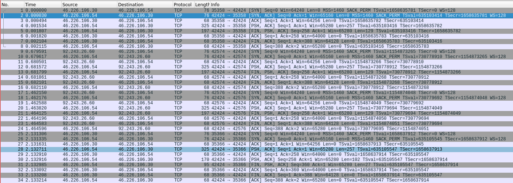
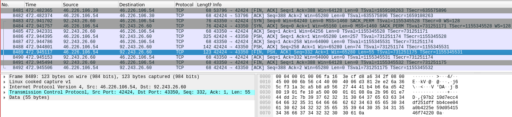
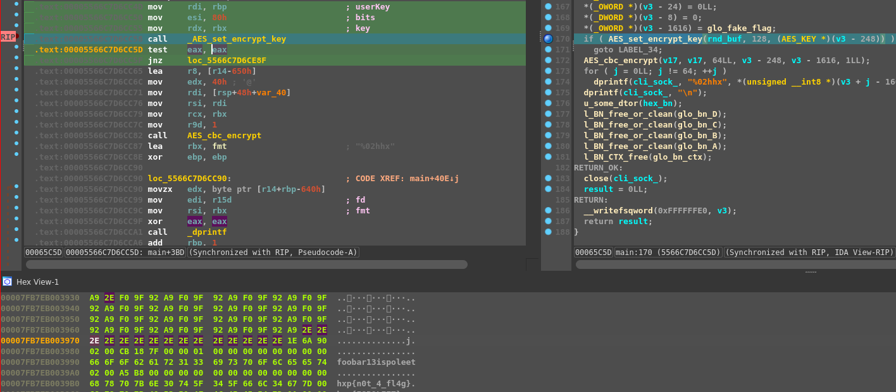

## HXP CTF 2022 - Required (Misc/RE/Crypto 417)
### 10-12/03/2023 (48hr)
___

## Description
 
**Difficulty estimate:** easy - easy

**Points:** round(1000 · min(1, 10 / (9 + [15 solves]))) = 417 points

**Description:**

*With all that recent hype about VPNs and everything good ol’ hxp had to up their crypto game,*
*so we added network-based security to this flag dispenser. We think that–despite our age–we’re*
*still perfectly capable of producing flawless C code, but to be extra safe,*
*we cranked up the compiler-based defenses during compilation of the server and enabled clang’s*
*safe stack.*

*Besides the server we provide captured traffic from and to that port for you to analyse,*
*could you please check that we got it right?*

**Note:** *We did not modify the source code of the statically linked crypto library.*

**Download:**
```
secure_flag_dispenser-3e953071990b9bd6.tar.xz (1.5 MiB)
```
___

## Solution

Let's start from the `main` routine of `dispense` binary (we cleanup the code a little and we
rename the functions):
```c
__int64 __fastcall main(int a1, char **a2, char **a3) {
  /* ... */
  v3 = __readfsqword(0xFFFFFFE0);
  __writefsqword(0xFFFFFFE0, v3 - 1680);
  *(_QWORD *)(v3 - 1632) = 0xB8A50002LL;        // port 42424
  *(_QWORD *)(v3 - 1624) = 0LL;
  memset((void *)(v3 - 1280), 0, 0x401uLL);
  *(_OWORD *)(v3 - 1600) = 0LL;
  *(_OWORD *)(v3 - 1584) = 0LL;
  *(_OWORD *)(v3 - 1568) = 0LL;
  *(_OWORD *)(v3 - 1552) = 0LL;
  *(_OWORD *)(v3 - 1648) = 0LL;
  *(_OWORD *)(v3 - 1664) = 0LL;
  *(_DWORD *)(v3 - 4) = 16;
  *(_OWORD *)(v3 - 1680) = 0LL;
  fp_flag = fopen("flag.txt", "rb");
  if ( !fp_flag )
    goto FOPEN_ERR;
  fp_flag_ = fp_flag;
  rnd_buf = (const unsigned __int8 *)(v3 - 1680);
  if ( !fread((void *)(v3 - 1600), 1uLL, 0x40uLL, fp_flag) )
  {
FREAD_ERR:
    perror_msg = "fread\n";
    goto PERROR;
  }
  fclose(fp_flag_);
  fp_psk = fopen("psk", "rb");                  // pre-shared key
  if ( !fp_psk )
  {
FOPEN_ERR:
    perror_msg = "fopen\n";
PERROR:
    perror(perror_msg);
    result = 0xFFFFFFFFLL;
    goto RETURN;
  }
  fp_psk_ = fp_psk;
  if ( !fread((void *)(v3 - 1648), 1uLL, 0x10uLL, fp_psk) )
    goto FREAD_ERR;
  enc_buf = v3 - 1600;                          // 1600 ~> flag buffer
  fclose(fp_psk_);
  serv_sock = socket(AF_INET, SOCK_STREAM, 0);
  if ( serv_sock == -1 )
  {
    perror_msg = "socket";
    goto PERROR;
  }
  serv_sock_ = serv_sock;
  *(_DWORD *)(v3 - 252) = 1;
  if ( setsockopt(serv_sock, 1, 2, (const void *)(v3 - 252), 4u) == -1 )
  {
    perror_msg = "setsockopt";
    goto PERROR;
  }
  if ( bind(serv_sock_, (const struct sockaddr *)(v3 - 1632), 0x10u) == -1 )
  {
    perror_msg = "bind";
    goto PERROR;
  }
  if ( listen(serv_sock_, 1337) == -1 )
  {
    perror_msg = "listen";
    goto PERROR;
  }
  cli_sock = accept(serv_sock_, (struct sockaddr *)(v3 - 1664), (socklen_t *)(v3 - 4));
  if ( cli_sock == -1 )
  {
    perror_msg = "accept";
    goto PERROR;
  }
  cli_sock_ = cli_sock;
  if ( (unsigned int)getentropy(rnd_buf, 16LL) == -1 )
  {
    perror_msg = "getentropy";
    goto PERROR;
  }
  getnameinfo((const struct sockaddr *)(v3 - 1664), *(_DWORD *)(v3 - 4), (char *)(v3 - 1280), 0x401u, 0LL, 0, 8);
  // check if incomng connection is from a hxp.io domain
  if ( !(unsigned int)u_cmp_subdomain_probably(v3 - 1280, &glo_hxp_io) )
  {
    *(_OWORD *)(v3 - 1304) = 0LL;
    *(_OWORD *)(v3 - 1320) = 0LL;
    *(_OWORD *)(v3 - 1336) = 0LL;
    *(_OWORD *)(v3 - 1352) = 0LL;
    *(_OWORD *)(v3 - 1368) = 0LL;
    *(_OWORD *)(v3 - 1384) = 0LL;
    *(_OWORD *)(v3 - 1400) = 0LL;
    *(_OWORD *)(v3 - 1416) = 0LL;
    *(_OWORD *)(v3 - 1432) = 0LL;
    *(_OWORD *)(v3 - 1448) = 0LL;
    *(_OWORD *)(v3 - 1464) = 0LL;
    *(_OWORD *)(v3 - 1480) = 0LL;
    *(_OWORD *)(v3 - 1496) = 0LL;
    *(_OWORD *)(v3 - 1512) = 0LL;
    *(_OWORD *)(v3 - 1528) = 0LL;               // AES_Key
    *(_DWORD *)(v3 - 1288) = 0;
    *(_OWORD *)(v3 - 1616) = glo_fake_flag_as_IV;
    // AES_set_encrypt_key(const unsigned char *userKey, const int bits, AES_KEY *key);
    // Return 0 on success

    // 1648 ~> 16-byte Pre-Shared Key
    // 1616 ~> IV
    // enc_buf ~> flag

    // That is, encrypt flag with pre-shared key and send it back to client
    if ( !AES_set_encrypt_key((const unsigned __int8 *)(v3 - 1648), 128, (AES_KEY *)(v3 - 1528)) )
    {
      AES_cbc_encrypt(enc_buf, enc_buf, 64LL, v3 - 1528, v3 - 1616, 1LL);// last arg: 1 ~> encrypt
      for ( i = 0LL; i != 64; ++i )
        dprintf(cli_sock_, "%02hhx", *(unsigned __int8 *)(v3 + i - 1600));
      dprintf(cli_sock_, "\n");
      goto RETURN_OK;
    }
ENCRYPT_ERR:
    perror_msg = "enc";
    goto PERROR;
  }
  // Domain is not a *.hxp.io. Use Big Nums
  glo_bn_ctx = l_BN_CTX_new();
  if ( !glo_bn_ctx )
  {
    perror_msg = "BN_CTX_new";
    goto PERROR;
  }
  glo_bn_A = l_BN_new();
  glo_bn_B = l_BN_new();
  glo_bn_C = l_BN_new();
  glo_bn_D = l_BN_new();
  if ( !glo_bn_D || !glo_bn_A || !glo_bn_B || !glo_bn_C )
  {
    perror_msg = "BN_new";
    goto PERROR;
  }
  l_BN_hex2bn(
    &glo_bn_A,
    "6878703c33796f753c336878700000000000000000000000009debf6dfc0d75203bde49a1f3ba3d949f08fa84b6d0a770f730306c32d17956654"
    "4333df001dcf71d1030707aabf254b8777e1c9c0d857133d5ccabfa0232858588e17ba23dc2a34880ced41edb9f0814695e6ab4ba2d5fc758f43"
    "1de65e8e34b508a1facda541");
  l_BN_hex2bn(&glo_bn_B, "309");                // why not 65537? That's suspicious!
  glo_bn_C = l_BN_bin2bn(rnd_buf, 16LL, glo_bn_C);
  // A is modulo always
  // D is output
  l_BN_mod_exp(glo_bn_D, glo_bn_C, glo_bn_B, glo_bn_A, glo_bn_ctx);
  hex_bn = (char *)l_BN_bn2hex(glo_bn_D);
  dprintf(cli_sock_, "%s\n", hex_bn);           // send result back to client
  *(_OWORD *)(v3 - 248) = 0LL;                  // AES_KEY
  *(_OWORD *)(v3 - 232) = 0LL;
  *(_OWORD *)(v3 - 216) = 0LL;
  *(_OWORD *)(v3 - 200) = 0LL;
  *(_OWORD *)(v3 - 184) = 0LL;
  *(_OWORD *)(v3 - 168) = 0LL;
  *(_OWORD *)(v3 - 152) = 0LL;
  *(_OWORD *)(v3 - 136) = 0LL;
  *(_OWORD *)(v3 - 120) = 0LL;
  *(_OWORD *)(v3 - 104) = 0LL;
  *(_OWORD *)(v3 - 88) = 0LL;
  *(_OWORD *)(v3 - 72) = 0LL;
  *(_OWORD *)(v3 - 56) = 0LL;
  *(_OWORD *)(v3 - 40) = 0LL;
  *(_OWORD *)(v3 - 24) = 0LL;
  *(_DWORD *)(v3 - 8) = 0;
  *(_OWORD *)(v3 - 1616) = glo_fake_flag_as_IV;
  if ( AES_set_encrypt_key(rnd_buf, 128, (AES_KEY *)(v3 - 248)) )// use a random key
    goto ENCRYPT_ERR;
  AES_cbc_encrypt(enc_buf, enc_buf, 64LL, v3 - 248, v3 - 1616, 1LL);
  for ( j = 0LL; j != 64; ++j )
    dprintf(cli_sock_, "%02hhx", *(unsigned __int8 *)(v3 + j - 1600));
  dprintf(cli_sock_, "\n");
  u_some_dtor(hex_bn);
  l_BN_free_or_clean(glo_bn_D);
  l_BN_free_or_clean(glo_bn_C);
  l_BN_free_or_clean(glo_bn_B);
  l_BN_free_or_clean(glo_bn_A);
  l_BN_CTX_free(glo_bn_ctx);
RETURN_OK:
  close(cli_sock_);
  result = 0LL;
RETURN:
  __writefsqword(0xFFFFFFE0, v3);
  return result;
}
```

The binary binds a TCP server at port `42424` and waits for incoming connections. When a client
connects to it uses `getnameinfo` to get the domain name and then calls `u_cmp_subdomain_probably`
to compare it against `🔒.hxp.io`. If the domain matches (i.e., the domain is `🔒.hxp.io`) then
program encrypts the flag using AES-128 in CBC mode. The encryption key, is the Pre-Shared Key
stored in `psk` file. The ciphertext (encrypted flag) is sent back to the client using `dprint`.

If the domain is anything else, it generates a random key (stored in `rnd_buf`) using `getentropy`
and encrypts it in RSA style: `rnd_buf ** e mod = n`, with `e = 777` and
`n = 0x6878703c33796f753c336878700000000000000000000000009debf6dfc0d75203bde49a1f3ba3d949f08fa84b6d0a770f730306c32d179566544333df001dcf71d1030707aabf254b8777e1c9c0d857133d5ccabfa0232858588e17ba23dc2a34880ced41edb9f0814695e6ab4ba2d5fc758f431de65e8e34b508a1facda541`
and sends it to the client (using `dprint`). Then it uses the generated key in `rnd_buf`to encrypt
the flag using AES128 in CBC mode again and sends the ciphertext back to the client.


### Analyzing the PCAP File

There is also a `t.pcap` file that comes along with the challenge that contains a lot of traffic
exchanged with the server:






### The Failed approach

In the pcap file there are 772 messages exchanged. The public exponent `e` is also `777`, so I
thought it cannot be a coincidence. I spend hours looking for various RSA attacks on how to
recover part of the message (i.e., the encryption key), but it end up nowhere as none of the
existing attacks would fit in our case. Then I asked for help and I got a hint:
*You fell for the usual hxp illusion*

Given that the primary category of this challenge is "Misc", there must be something else that I
was missing.


### The Correct approach

I start looking in the code more carefully until I reached `u_cmp_subdomain_probably`. This function
does more than a `strcmp`:
```c
__int64 __fastcall u_cmp_subdomain_probably(const char *a1, const char *a2) {
  /* ... */
  v2 = __readfsqword(0xFFFFFFE0);
  __writefsqword(0xFFFFFFE0, v2 - 528);
  *(_QWORD *)(v2 - 520) = 512LL;
  if ( (int)u_punycode_maybe(a1, (_BYTE *)(v2 - 512), (_QWORD *)(v2 - 520)) <= 0 )
    result = 0xFFFFFFFFLL;
  else
    result = strcmp((const char *)(v2 - 512), a2) != 0;
  __writefsqword(0xFFFFFFE0, v2);
  return result;
}
```

There a function `u_punycode_maybe` that does some changes to `a1` and the compares the modified 
result with the `a2`. This function must be successful otherwise it returns **-1**. At the 
top of the function there is something very interesting:
```c
__int64 __fastcall u_punycode_maybe(const char *src, _BYTE *dest, _QWORD *a3) {
  /* ... */

  v3 = dest;
  v5 = __readfsqword(0xFFFFFFE0);
  __writefsqword(0xFFFFFFE0, v5 - 2064);
  v6 = dest != 0LL;
  v7 = 0LL;
  while ( 1 )
  {
    v9 = strchr(src, 46);
    v17 = v9;
    v10 = v9 ? v9 - src : strlen(src);
    if ( !strncmp(src, "xn--", 4uLL) )   // <~~ Punycode!
      break;
    /* ... */
```

I remember (from another CTF challenge) that the `xn--` string corresponds to to
[Punycode](https://en.wikipedia.org/wiki/Punycode) encoding. That is, 
**challenge has something to do with the domains**.
Maybe we could trick the server thinking we are coming from the `🔒.hxp.io` and give us the flag.
But we still do not know the contents of the `psk` file...


#### Analyzing the PCAP File (again)

Let's go back to the pcap file and find all different IPs (we actually use
[Scapy](https://scapy.net/) to quickly process the file):
```
92.243.26.60
46.226.106.54
46.226.106.30
```

Let's `dig` into them:
```
ispo@ispo-glaptop2:~/ctf/hxp_2022/secure_flag_dispenser$ dig -x 92.243.26.60

; <<>> DiG 9.18.8-1-Debian <<>> -x 92.243.26.60
;; global options: +cmd
;; Got answer:
;; ->>HEADER<<- opcode: QUERY, status: NOERROR, id: 20441
;; flags: qr rd ra; QUERY: 1, ANSWER: 1, AUTHORITY: 0, ADDITIONAL: 1
dig: 'xn--ls8haaaaaaaaaaaaaaaaaaaaaaaaaaaaaaaaaaaaaaaaaaaaaaaaaaaaaaa.xn--ls8haaaaaaaaaaaaaaaaaaaaaaaaaaaaaaaaaaaaaaaaaaaaaaaaaaaaaaa.xn--ls8haaaaaaaaaaaaaa.xn--a.xn--a.xn--a.xn--a.xn--a.xn--a.xn--a.xn--a.xn--a.xn--a.xn--a.xn--a.xn--a.xn--a.kirschju.re.' is not a legal IDNA2008 name (string contains a disallowed character), use +noidnout


ispo@ispo-glaptop2:~/ctf/hxp_2022/secure_flag_dispenser$ dig -x 46.226.106.54

; <<>> DiG 9.18.8-1-Debian <<>> -x 46.226.106.54
;; global options: +cmd
;; Got answer:
;; ->>HEADER<<- opcode: QUERY, status: NOERROR, id: 47279
;; flags: qr rd ra; QUERY: 1, ANSWER: 1, AUTHORITY: 0, ADDITIONAL: 1

;; OPT PSEUDOSECTION:
; EDNS: version: 0, flags:; udp: 4096
;; QUESTION SECTION:
;54.106.226.46.in-addr.arpa.  IN  PTR

;; ANSWER SECTION:
54.106.226.46.in-addr.arpa. 3600 IN PTR xvm-106-54.dc0.ghst.net.

;; Query time: 300 msec
;; SERVER: 172.16.255.1#53(172.16.255.1) (UDP)
;; WHEN: Mon Mar 13 23:01:52 PDT 2023
;; MSG SIZE  rcvd: 92


ispo@ispo-glaptop2:~/ctf/hxp_2022/secure_flag_dispenser$ dig -x 46.226.106.30

; <<>> DiG 9.18.8-1-Debian <<>> -x 46.226.106.30
;; global options: +cmd
;; Got answer:
;; ->>HEADER<<- opcode: QUERY, status: NOERROR, id: 3243
;; flags: qr rd ra; QUERY: 1, ANSWER: 1, AUTHORITY: 0, ADDITIONAL: 1

;; OPT PSEUDOSECTION:
; EDNS: version: 0, flags:; udp: 4096
;; QUESTION SECTION:
;30.106.226.46.in-addr.arpa.  IN  PTR

;; ANSWER SECTION:
30.106.226.46.in-addr.arpa. 3600 IN PTR xvm-106-30.dc0.ghst.net.

;; Query time: 316 msec
;; SERVER: 172.16.255.1#53(172.16.255.1) (UDP)
;; WHEN: Mon Mar 13 23:02:13 PDT 2023
;; MSG SIZE  rcvd: 92
```

The first one is really interesting. Since domain starts with `xn--`, we use a
[Punycode Converter](https://www.punycoder.com/) to decode it. THis is what we get:
```
💩💩💩💩💩💩💩💩💩💩💩💩💩💩💩💩💩💩💩💩💩💩💩💩💩💩💩💩💩💩💩💩💩💩💩💩💩💩💩💩💩💩💩💩💩💩💩💩💩💩💩💩💩💩💩💩.💩💩💩💩💩💩💩💩💩💩💩💩💩💩💩💩💩💩💩💩💩💩💩💩💩💩💩💩💩💩💩💩💩💩💩💩💩💩💩💩💩💩💩💩💩💩💩💩💩💩💩💩💩💩💩💩.💩💩💩💩💩💩💩💩💩💩💩💩💩💩💩
```

Okay, so what happens if a client with this domain gets connected to it? We set a breakpoint right
before the `u_cmp_subdomain_probably` and we modify the contents of the pointer stored in `rdi`:
```assembly
.text:0000000000065AB2        lea     rsi, glo_hxp_io
.text:0000000000065AB9        mov     rdi, r13        ; patch me!
.text:0000000000065ABC        call    u_cmp_subdomain_probably
```

Then we connect to the server:
```
nc 127.0.0.1 42424 -vv
```

Once the breakpoint is triggered we, run the following IDAPython lines to change the contents of
the resolved domain:
```python
domain = b'xn--ls8haaaaaaaaaaaaaaaaaaaaaaaaaaaaaaaaaaaaaaaaaaaaaaaaaaaaaaa.xn--ls8haaaaaaaaaaaaaaaaaaaaaaaaaaaaaaaaaaaaaaaaaaaaaaaaaaaaaaa.xn--ls8haaaaaaaaaaaaaa.xn--a.xn--a.xn--a.xn--a.xn--a.xn--a.xn--a.xn--a.xn--a.xn--a.xn--a.xn--a.xn--a.xn--a.kirschju.re.'
for i, b in enumerate(domain): ida_bytes.patch_byte(idaapi.get_reg_val('rdi') + i, b)
```


Then something really interesting happens:



The AES key is overwritten with `.` ! That is, **13** out of **16** key bytes are set to `.` due
to some overflow probably. That is, we only need to bruteforce the remaining **3** characters to
get the flag. We select any ciphertext (let's say `b9058638622df4e3bb39dcd056394fbbb6a0af5ddb7dc98ffca30584b6320f0f5d8d0ad9d127b5d4a7ba1d355b71f4ff13e6bcd9ede5851cafef176cb2a8f882`)
and we bruteforce the renaming **3** characters from the key:
`2E-2E-2E-2E-2E-2E-2E-2E-2E-2E-2E-2E-2E-4D-16-0B`, until we get a plain text that starts with `hxp{`.

So the flag is: `hxp{th3y_pr0m153d_cr1t1c4l_but_0nly_g4v3_h1gh}`

For more details, please take a look at the [secure_flag_dispenser_crack.py](./secure_flag_dispenser_crack.py) script.

___
