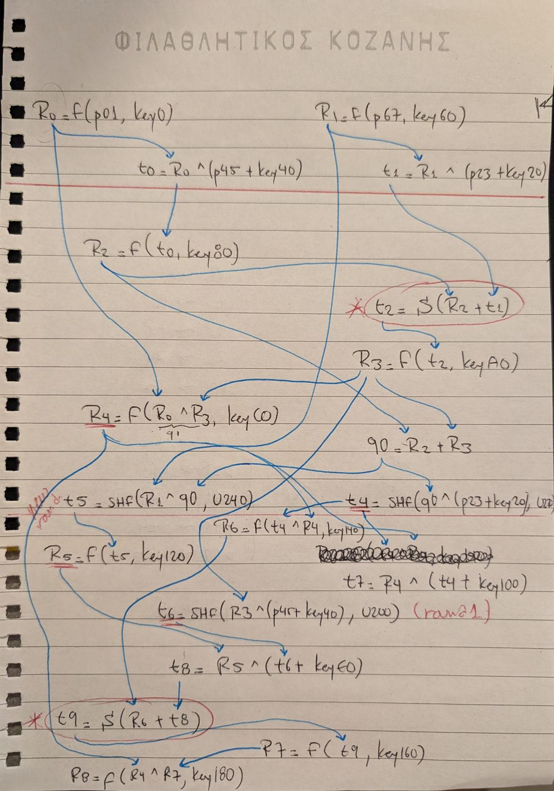
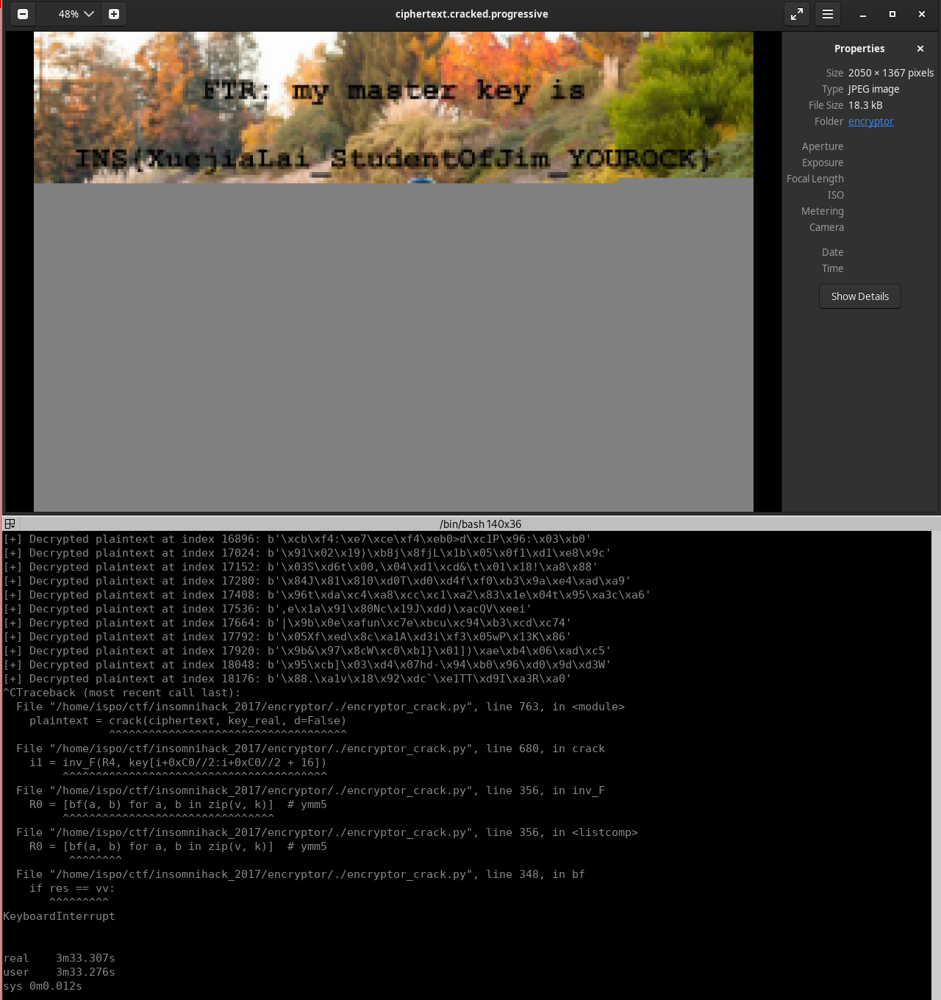

## Insomni'Hack Teaser 2017 - Encryptor (RE/Crypto 400pt)
##### 21/01 - 22/01/2017 (36hr)
___
### Description

**We need your skillz because one G\*\*gle car has become mad and tries to kill as many pedestrians**
**as possible. Fortunately, we have recovered an encryptor that it uses to protect its firmware**
**thanks to a master key of type INS{...}. Please help us, implement the corresponding decryptor**
**and recover the master key that can be found in the provided ciphertext.**
___
### Solution

In this challenge we are given an `encryptor` binary that takes as input the contents of the 
`/tmp/plaintext` file, encrypts them using a custom algorithm and stores the encrypted result
back to `/tmp/ciphertext`. We are also given a target `ciphertext` file which is the file that we
have to decrypt. Hence, our goal is to understand the encryption algorithm, inverse it, create the
decryptor, and use it to decrypt the `ciphertext` file.

We load the binary on IDA and we see it is full of AVX
([Advanced Vector Extensions](https://en.wikipedia.org/wiki/Advanced_Vector_Extensions))
instructions, which are SIMD instruction that use `xmm` and `ymm` registers. For example:
```assembly
  vmovd   xmm2, dword ptr [rbp-0B54h]
    vmovdqa ymmword ptr [rbp-790h], ymm0
    vmovdqa ymm0, cs:ymmword_402400
    vpinsrw xmm3, xmm2, word ptr [rax+1Ch], 1
    vmovdqa ymmword ptr [rbp-770h], ymm0
```

The problem with these instructions is that decompilation fails on them, so we have to deal with the
assembly directly. Let's start from `main` at `400660h`:
```c
int __fastcall main(int argc, char **argv, char **argp) {
  /* ... */
  __asm { vpxor   xmm0, xmm0, xmm0 }
  v256[1] = retaddr;
  _RBP = v256;
  v255 = &v258;
  __asm {
    vmovdqa ymmword ptr [rbp-930h], ymm0
    vmovdqa ymm0, cs:ymmword_402260
  }
  canary = __readfsqword(0x28u);
  __asm {
    vmovdqa ymmword ptr [rbp-910h], ymm0
    vmovdqa ymm0, cs:ymmword_402280
    /* ... MORE AVX INSTRUCTIONS ... */
    vmovdqa ymmword ptr [rbp-0AF0h], ymm0
    vzeroupper
  }
 
  u_key_gen((__int64)key_maybe, (__int64)&v248, (__int64)v252);

  if ( __xstat(1, "/tmp/plaintext", &stat_buf) == -1 )
    return 1;
  st_size = stat_buf.st_size;
  plaintext_buf = (char *)malloc(stat_buf.st_size);
  if ( !plaintext_buf )
    return 1;
  ciphertext_buf = (char *)malloc(st_size);
  if ( !ciphertext_buf )
    return 1;
  fd = open("/tmp/plaintext", 0, *(double *)&_XMM0, *(double *)&_XMM1);
  fd_ = fd;
  if ( fd == -1 || st_size != read(fd, plaintext_buf, st_size) )
    return 1;
  close(fd_);

  if ( st_size <= 127 ) {  // Plaintext too small. Don't encrypt it.
    ciphertext_buf_ = ciphertext_buf;
    plaintext_buf_ = plaintext_buf;
    v236 = 0LL;
  } else {
    _R8 = ciphertext_buf;
    plaintext_buf__ = plaintext_buf;
    do {
      v132 = *((unsigned __int16 *)plaintext_buf__ + 15);
      v246 = _R8;
      plaintext_buf__ += 128;
      v247 = v132;
      __asm {
        vmovd   xmm2, dword ptr [rbp-0B54h]; xmm2 = 2H
        vpinsrw xmm3, xmm2, word ptr [r15-64h], 1; xmm3 = xmm2 | (2G << 1) (1 = word offset)
        /* ... MORE AVX INSTRUCTIONS ... */    
        vmovdqa ymmword ptr [rbp-0A70h], ymm0; store ymm0 on mem
        vzeroupper
      }

      u_encrypt(&encr, &tr_plain, key_maybe, v252);
      
      __asm {
        vmovdqa ymm0, ymmword ptr [rbp-0A50h]; ymm0 first 2 rows of ciphertext
        vextracti128 xmm1, ymm0, 1
      }
      _R8 = v246 + 128;
      __asm {
        vpextrw word ptr [r8-70h], xmm0, 7
        vpextrw word ptr [r8-6Eh], xmm0, 6
        /* ... MORE AVX INSTRUCTIONS ... */          
        vpextrw word ptr [r8-4], xmm0, 1
        vpextrw word ptr [r8-2], xmm0, 0
      }
    } while ( st_size > (__int64)&plaintext_buf__[127LL - (_QWORD)plaintext_buf] );

    v236 = ((st_size - 128) & 0xFFFFFFFFFFFFFF80LL) + 128;
    plaintext_buf_ = &plaintext_buf[v236];
    ciphertext_buf_ = &ciphertext_buf[v236];
    __asm { vzeroupper }
  }

  i = v236 + 1;
  if ( st_size >= (__int64)(v236 + 1) ) {
    v240 = -(__int64)v236;
    cipher_chunk = &ciphertext_buf_[v240];
    plain_chunk = &plaintext_buf_[v240];
    do {
      plaintext_buf_ = (char *)(unsigned __int8)plain_chunk[i - 1];
      cipher_chunk[i++ - 1] = (char)plaintext_buf_;
    } while ( st_size >= i );
  }

  fd_out = open("/tmp/ciphertext", 65, 420LL, plaintext_buf_);
  fd_out_ = fd_out;
  if ( fd_out == -1 || st_size != write(fd_out, ciphertext_buf, st_size) )
    return 1;
  
  close(fd_out_);
  free(plaintext_buf);
  free(ciphertext_buf);
  
  return 0;
}
```

First of all, `main` calls `u_key_gen` at `401440h` to generate the encryption key. `u_key_gen`
consists of only AVX instructions. Since the key generation does not depend on any plaintext input,
we do not have to analyze it all. We can simply collect the result.

After the key generation, we read the plaintext from `/tmp/plaintext` file. If the plaintext is
too small (**<128** bytes), there is no encryption at all. The ciphertext contains the plaintext.
Otherwise, `main` starts encrypting the plaintext in blocks of **128** bytes. Each block is
encrypted independently, i.e., we have ECB mode of encryption. If the last block is less than
**128** bytes, it does not get encrypted and it is appended as-it-is to the ciphertext.

Let's verify the above findings:
```
$ echo A1A2A3A4A5A6A7A8 > /tmp/plaintext; ./encryptor && hexdump -C /tmp/ciphertext 
00000000  41 31 41 32 41 33 41 34  41 35 41 36 41 37 41 38  |A1A2A3A4A5A6A7A8|
00000010  0a                                                |.|
00000011


$ echo A1A2A3A4A5A6A7A8B1B2B3B4B5B6B7B8C1C2C3C4C5C6C7C8D1D2D3D4D5D6D7D8E1E2E3E4E5E6E7E8F1F2F3F4F5F6F7F8G1G2G3G4G5G6G7G8H1H2H3H4H5H6H7H8 > /tmp/plaintext; ./encryptor && hexdump -C /tmp/ciphertext 
00000000  cc fc 07 18 1f 7e e0 10  d1 1f 55 07 45 6d ab df  |.....~....U.Em..|
00000010  c0 8f b7 9e 24 32 fe b6  27 09 09 77 de 05 65 87  |....$2..'..w..e.|
00000020  3a 77 8a 3f ce 2f f3 19  ca b3 0f 73 ad 66 cb c5  |:w.?./.....s.f..|
00000030  7c 00 45 9e 70 04 92 5a  34 20 e7 43 44 25 49 d5  ||.E.p..Z4 .CD%I.|
00000040  16 f8 83 6f 0f de 00 94  9f f8 d5 6c 47 88 eb 8e  |...o.......lG...|
00000050  0b da 43 45 15 d8 4f 94  fe 28 29 32 05 b0 db 57  |..CE..O..()2...W|
00000060  8f ba 84 59 b6 af f6 50  21 5c 81 80 fb 54 11 d8  |...Y...P!\...T..|
00000070  95 19 95 03 7d 00 16 c0  e6 a0 7f 5a 6a 77 7b 5b  |....}......Zjw{[|
00000080  0a                                                |.|
00000081


$ echo A1A2A3A4A5A6A7A8B1B2B3B4B5B6B7B8C1C2C3C4C5C6C7C8D1D2D3D4D5D6D7D8E1E2E3E4E5E6E7E8F1F2F3F4F5F6F7F8G1G2G3G4G5G6G7G8H1H2H3H4H5H6H7H8APPENDED_SMALL_BLOCK > /tmp/plaintext; ./encryptor && hexdump -C /tmp/ciphertext 
00000000  cc fc 07 18 1f 7e e0 10  d1 1f 55 07 45 6d ab df  |.....~....U.Em..|
00000010  c0 8f b7 9e 24 32 fe b6  27 09 09 77 de 05 65 87  |....$2..'..w..e.|
00000020  3a 77 8a 3f ce 2f f3 19  ca b3 0f 73 ad 66 cb c5  |:w.?./.....s.f..|
00000030  7c 00 45 9e 70 04 92 5a  34 20 e7 43 44 25 49 d5  ||.E.p..Z4 .CD%I.|
00000040  16 f8 83 6f 0f de 00 94  9f f8 d5 6c 47 88 eb 8e  |...o.......lG...|
00000050  0b da 43 45 15 d8 4f 94  fe 28 29 32 05 b0 db 57  |..CE..O..()2...W|
00000060  8f ba 84 59 b6 af f6 50  21 5c 81 80 fb 54 11 d8  |...Y...P!\...T..|
00000070  95 19 95 03 7d 00 16 c0  e6 a0 7f 5a 6a 77 7b 5b  |....}......Zjw{[|
00000080  41 50 50 45 4e 44 45 44  5f 53 4d 41 4c 4c 5f 42  |APPENDED_SMALL_B|
00000090  4c 4f 43 4b 0a                                    |LOCK.|
00000095


$ echo A1A2A3A4A5A6A7A8B1B2B3B4B5B6B7B8C1C2C3C4C5C6C7C8D1D2D3D4D5D6D7D8E1E2E3E4E5E6E7E8F1F2F3F4F5F6F7F8G1G2G3G4G5G6G7G8H1H2H3H4H5H6H7H8A1A2A3A4A5A6A7A8B1B2B3B4B5B6B7B8C1C2C3C4C5C6C7C8D1D2D3D4D5D6D7D8E1E2E3E4E5E6E7E8F1F2F3F4F5F6F7F8G1G2G3G4G5G6G7G8H1H2H3H4H5H6H7H8 > /tmp/plaintext; ./encryptor && hexdump -C /tmp/ciphertext 
00000000  cc fc 07 18 1f 7e e0 10  d1 1f 55 07 45 6d ab df  |.....~....U.Em..|
00000010  c0 8f b7 9e 24 32 fe b6  27 09 09 77 de 05 65 87  |....$2..'..w..e.|
00000020  3a 77 8a 3f ce 2f f3 19  ca b3 0f 73 ad 66 cb c5  |:w.?./.....s.f..|
00000030  7c 00 45 9e 70 04 92 5a  34 20 e7 43 44 25 49 d5  ||.E.p..Z4 .CD%I.|
00000040  16 f8 83 6f 0f de 00 94  9f f8 d5 6c 47 88 eb 8e  |...o.......lG...|
00000050  0b da 43 45 15 d8 4f 94  fe 28 29 32 05 b0 db 57  |..CE..O..()2...W|
00000060  8f ba 84 59 b6 af f6 50  21 5c 81 80 fb 54 11 d8  |...Y...P!\...T..|
00000070  95 19 95 03 7d 00 16 c0  e6 a0 7f 5a 6a 77 7b 5b  |....}......Zjw{[|

00000080  cc fc 07 18 1f 7e e0 10  d1 1f 55 07 45 6d ab df  |.....~....U.Em..|
00000090  c0 8f b7 9e 24 32 fe b6  27 09 09 77 de 05 65 87  |....$2..'..w..e.|
000000a0  3a 77 8a 3f ce 2f f3 19  ca b3 0f 73 ad 66 cb c5  |:w.?./.....s.f..|
000000b0  7c 00 45 9e 70 04 92 5a  34 20 e7 43 44 25 49 d5  ||.E.p..Z4 .CD%I.|
000000c0  16 f8 83 6f 0f de 00 94  9f f8 d5 6c 47 88 eb 8e  |...o.......lG...|
000000d0  0b da 43 45 15 d8 4f 94  fe 28 29 32 05 b0 db 57  |..CE..O..()2...W|
000000e0  8f ba 84 59 b6 af f6 50  21 5c 81 80 fb 54 11 d8  |...Y...P!\...T..|
000000f0  95 19 95 03 7d 00 16 c0  e6 a0 7f 5a 6a 77 7b 5b  |....}......Zjw{[|
00000100  0a                                                |.|
00000101
```

It is also interesting to delve into these AVX instructions that we have omitted from `main`:
```assembly
.text:0000000000400C68 Input is in the form:
.text:0000000000400C68
.text:0000000000400C68 A1B1C1D1E1F1G1H1
.text:0000000000400C68 A2B2C2D2E2F2G2H2
.text:0000000000400C68 A3B3C3D3E3F3G3H3
.text:0000000000400C68 A4B4C4D4E4F4G4H4
.text:0000000000400C68 A5B5C5D5E5F5G5H5
.text:0000000000400C68 A6B6C6D6E6F6G6H6
.text:0000000000400C68 A7B7C7D7E7F7G7H7
.text:0000000000400C68 A8B8C8D8E8F8G8H8
.text:0000000000400C68
.text:0000000000400C68 A9B9C9D9E9F9G9H9 (2nd block)
.text:0000000000400C68 AxBxCxDxExFxGxHx
.text:0000000000400C68
.text:0000000000400C68 ENCRYPT_BLOCK_LOOP:                               ; CODE XREF: main+C18↓j
.text:0000000000400C68         movzx   edx, word ptr [r15+1Eh]
.text:0000000000400C6D         mov     [rbp-0B60h], r8
.text:0000000000400C74         sub     r15, 0FFFFFFFFFFFFFF80h
.text:0000000000400C78         mov     rcx, r12                          ; RCX
.text:0000000000400C7B         mov     [rbp-0B54h], edx
.text:0000000000400C81         movzx   edx, word ptr [r15-66h]
.text:0000000000400C86         vmovd   xmm2, dword ptr [rbp-0B54h]       ; xmm2 = 2H
.text:0000000000400C8E         vpinsrw xmm3, xmm2, word ptr [r15-64h], 1 ; xmm3 = xmm2 | (2G << 1) (1 = word offset)
.text:0000000000400C95         mov     [rbp-0B54h], edx
.text:0000000000400C9B         movzx   edx, word ptr [r15-6Ah]
.text:0000000000400CA0         vmovd   xmm1, dword ptr [rbp-0B54h]       ; xmm1 = 2F
.text:0000000000400CA8         vpinsrw xmm1, xmm1, word ptr [r15-68h], 1 ; xmm1 = 2F | (2E << 1)
.text:0000000000400CAF         mov     [rbp-0B54h], edx
.text:0000000000400CB5         movzx   edx, word ptr [r15-6Eh]
.text:0000000000400CBA         vmovd   xmm4, dword ptr [rbp-0B54h]
.text:0000000000400CC2         vpinsrw xmm4, xmm4, word ptr [r15-6Ch], 1 ; xmm4 = 2D | (2C << 1)
.text:0000000000400CC9         mov     [rbp-0B54h], edx
.text:0000000000400CCF         movzx   edx, word ptr [r15-72h]
.text:0000000000400CD4         vmovd   xmm0, dword ptr [rbp-0B54h]       ; xmm0 = 2B
.text:0000000000400CDC Interleave low-order doublewords from xmm3 and xmm1 into xmm2
.text:0000000000400CDC         vpunpckldq xmm2, xmm3, xmm1               ; xmm2 = 2H 2G 2F 2E
.text:0000000000400CE0         vpinsrw xmm0, xmm0, word ptr [r15-70h], 1 ; xmm0 = 2B | (2A << 1)
.text:0000000000400CE7         mov     [rbp-0B54h], edx
.text:0000000000400CED         movzx   edx, word ptr [r15-76h]
.text:0000000000400CF2         vpunpckldq xmm0, xmm4, xmm0               ; xmm0 = 2D 2C 2B 2A
.text:0000000000400CF6 Interleave low-order quadword from xmm2 and xmm0 into xmm1
.text:0000000000400CF6         vpunpcklqdq xmm1, xmm2, xmm0              ; xmm1 = 2H 2G 2F 2E 2D 2C 2B 2A
.text:0000000000400CFA ----------------------------------------------------
.text:0000000000400CFA Repeat with the 1st row of the plaintext
.text:0000000000400CFA         vmovd   xmm2, dword ptr [rbp-0B54h]
.text:0000000000400D02         mov     [rbp-0B54h], edx
.text:0000000000400D08         movzx   edx, word ptr [r15-7Ah]
.text:0000000000400D0D         vpinsrw xmm3, xmm2, word ptr [r15-74h], 1
.text:0000000000400D14         vmovd   xmm2, dword ptr [rbp-0B54h]
.text:0000000000400D1C         vpinsrw xmm2, xmm2, word ptr [r15-78h], 1
.text:0000000000400D23         mov     [rbp-0B54h], edx
.text:0000000000400D29         movzx   edx, word ptr [r15-7Eh]
.text:0000000000400D2E         vmovd   xmm4, dword ptr [rbp-0B54h]
.text:0000000000400D36         vpinsrw xmm4, xmm4, word ptr [r15-7Ch], 1
.text:0000000000400D3D         mov     [rbp-0B54h], edx
.text:0000000000400D43         vmovd   xmm0, dword ptr [rbp-0B54h]
.text:0000000000400D4B         vpunpckldq xmm2, xmm3, xmm2
.text:0000000000400D4F         vpinsrw xmm0, xmm0, word ptr [r15-80h], 1
.text:0000000000400D56         movzx   edx, word ptr [r15-42h]
.text:0000000000400D5B         mov     [rbp-0B54h], edx
.text:0000000000400D61         movzx   edx, word ptr [r15-46h]
.text:0000000000400D66         vpunpckldq xmm0, xmm4, xmm0
.text:0000000000400D6A         vpunpcklqdq xmm0, xmm2, xmm0              ; xmm0 = 1H 1G 1F 1E 1D 1C 1B 1A
.text:0000000000400D6E ---------------------------------------------------
.text:0000000000400D6E Repeat for the 4th row of the plaintext
.text:0000000000400D6E         vmovd   xmm2, dword ptr [rbp-0B54h]
.text:0000000000400D76         mov     [rbp-0B54h], edx
.text:0000000000400D7C         movzx   edx, word ptr [r15-4Ah]
.text:0000000000400D81         vpinsrw xmm3, xmm2, word ptr [r15-44h], 1
.text:0000000000400D88 Insert 128 bits of integer data from xmm0 and the remaining values from ymm1 into ymm0
.text:0000000000400D88         vinserti128 ymm0, ymm1, xmm0, 1           ; ymm0 = 2G 2F ... 2A 1G 1F ... 1A
.text:0000000000400D8E         vmovd   xmm1, dword ptr [rbp-0B54h]
.text:0000000000400D96         mov     [rbp-0B54h], edx
.text:0000000000400D9C         movzx   edx, word ptr [r15-4Eh]
.text:0000000000400DA1         vmovd   xmm4, dword ptr [rbp-0B54h]
.text:0000000000400DA9         vpinsrw xmm1, xmm1, word ptr [r15-48h], 1
.text:0000000000400DB0         vmovdqa ymmword ptr [rbp-0AD0h], ymm0     ; store ymm0 on mem
.text:0000000000400DB8         vpinsrw xmm4, xmm4, word ptr [r15-4Ch], 1
.....
.text:0000000000400E6C         mov     [rbp-0B54h], edx
.text:0000000000400E72         movzx   edx, word ptr [r15-2Ah]
.text:0000000000400E77         vpinsrw xmm3, xmm2, word ptr [r15-24h], 1
.text:0000000000400E7E         vinserti128 ymm0, ymm1, xmm0, 1           ; ymm0 = 4th and 3rd rows
.text:0000000000400E84         vmovd   xmm1, dword ptr [rbp-0B54h]
.text:0000000000400E8C         mov     [rbp-0B54h], edx
.text:0000000000400E92         movzx   edx, word ptr [r15-2Eh]
.text:0000000000400E97         vmovd   xmm4, dword ptr [rbp-0B54h]
.text:0000000000400E9F -------------------------------------------------
.text:0000000000400E9F Repeat for rows 6 and 5
.text:0000000000400E9F         vpinsrw xmm1, xmm1, word ptr [r15-28h], 1
.text:0000000000400EA6         vmovdqa ymmword ptr [rbp-0AB0h], ymm0     ; store ymm0 on mem
.text:0000000000400EAE         vpinsrw xmm4, xmm4, word ptr [r15-2Ch], 1
.text:0000000000400EB5         mov     [rbp-0B54h], edx
.text:0000000000400EBB         vmovd   xmm0, dword ptr [rbp-0B54h]
.text:0000000000400EC3         movzx   edx, word ptr [r15-32h]
.text:0000000000400EC8         vpunpckldq xmm2, xmm3, xmm1
.text:0000000000400ECC         vpinsrw xmm0, xmm0, word ptr [r15-30h], 1
.....
.text:0000000000400F62         mov     [rbp-0B54h], edx
.text:0000000000400F68         movzx   edx, word ptr [r15-0Ah]
.text:0000000000400F6D         vpinsrw xmm3, xmm2, word ptr [r15-4], 1
.text:0000000000400F74         vinserti128 ymm0, ymm1, xmm0, 1
.text:0000000000400F7A ---------------------------------------------------
.text:0000000000400F7A Repeat for rows 7 and 8
.text:0000000000400F7A         vmovd   xmm1, dword ptr [rbp-0B54h]
.text:0000000000400F82         mov     [rbp-0B54h], edx
.text:0000000000400F88         movzx   edx, word ptr [r15-0Eh]
.text:0000000000400F8D         vmovd   xmm4, dword ptr [rbp-0B54h]
.text:0000000000400F95         vpinsrw xmm1, xmm1, word ptr [r15-8], 1
.text:0000000000400F9C         vmovdqa ymmword ptr [rbp-0A90h], ymm0     ; store ymm0 on mem
.text:0000000000400FA4         vpinsrw xmm4, xmm4, word ptr [r15-0Ch], 1
.....
.text:000000000040102D         mov     rsi, [rbp-0B70h]                  ; RSI
.text:0000000000401034         vpunpckldq xmm2, xmm3, xmm2
.text:0000000000401038         mov     rdi, [rbp-0B68h]                  ; RDI
.text:000000000040103F         vpinsrw xmm0, xmm0, word ptr [r15-20h], 1
.text:0000000000401046         mov     rdx, r13                          ; RDX
.text:0000000000401049         vpunpckldq xmm0, xmm4, xmm0
.text:000000000040104D         vpunpcklqdq xmm0, xmm2, xmm0
.text:0000000000401051         vinserti128 ymm0, ymm1, xmm0, 1
.text:0000000000401057         vmovdqa ymmword ptr [rbp-0A70h], ymm0     ; store ymm0 on mem
.text:000000000040105F Zero bits in positions 128 and higher of some YMM registers
.text:000000000040105F         vzeroupper
.text:0000000000401062 Transformed plaintext block:
.text:0000000000401062
.text:0000000000401062 H2G2F2E2D2C2B2A2
.text:0000000000401062 H1G1F1E1D1C1B1A1
.text:0000000000401062 H4G4F4E4D4C4B4A4
.text:0000000000401062 H3G3F3E3D3C3B3A3
.text:0000000000401062 H6G6F6E6D6C6B6A6
.text:0000000000401062 H5G5F5E5D5C5B5A5
.text:0000000000401062 H8G8F8E8D8C8B8A8
.text:0000000000401062 H7G7F7E7D7C7B7A7
.text:0000000000401062         call    u_encrypt
.text:0000000000401067         mov     r8, [rbp-0B60h]
.text:000000000040106E         vmovdqa ymm0, ymmword ptr [rbp-0A50h]     ; ymm0 first 2 rows of ciphertext
.text:0000000000401076 Transform result:
.text:0000000000401076   01 02 03 04 05 06 07 08  09 0A 0B 0C 0D 0E 0F 10
.text:0000000000401076   11 12 13 14 15 16 17 18  19 1A 1B 1C 1D 1E 1F 20
.text:0000000000401076   21 22 23 24 25 26 27 28  29 2A 2B 2C 2D 2E 2F 30
.text:0000000000401076   31 32 33 34 35 36 37 38  39 3A 3B 3C 3D 3E 3F 40
.text:0000000000401076   41 42 43 44 45 46 47 48  49 4A 4B 4C 4D 4E 4F 50
.text:0000000000401076   51 52 53 54 55 56 57 58  59 5A 5B 5C 5D 5E 5F 60
.text:0000000000401076   61 62 63 64 65 66 67 68  69 6A 6B 6C 6D 6E 6F 70
.text:0000000000401076   71 72 73 74 75 76 77 78  79 7A 7B 7C 7D 7E 7F 80
.text:0000000000401076
.text:0000000000401076 Becomes (which is also ciphertext):
.text:0000000000401076   1F 20 1D 1E 1B 1C 19 1A  17 18 15 16 13 14 11 12
.text:0000000000401076   0F 10 0D 0E 0B 0C 09 0A  07 08 05 06 03 04 01 02
.text:0000000000401076   3F 40 3D 3E 3B 3C 39 3A  37 38 35 36 33 34 31 32
.text:0000000000401076   2F 30 2D 2E 2B 2C 29 2A  27 28 25 26 23 24 21 22
.text:0000000000401076   5F 60 5D 5E 5B 5C 59 5A  57 58 55 56 53 54 51 52
.text:0000000000401076   4F 50 4D 4E 4B 4C 49 4A  47 48 45 46 43 44 41 42
.text:0000000000401076   7F 80 7D 7E 7B 7C 79 7A  77 78 75 76 73 74 71 72
.text:0000000000401076   6F 70 6D 6E 6B 6C 69 6A  67 68 65 66 63 64 61 62
.text:0000000000401076         vextracti128 xmm1, ymm0, 1
.text:000000000040107C         sub     r8, 0FFFFFFFFFFFFFF80h
.text:0000000000401080         vpextrw word ptr [r8-70h], xmm0, 7
.text:0000000000401087         vpextrw word ptr [r8-6Eh], xmm0, 6
.text:000000000040108E         vpextrw word ptr [r8-6Ch], xmm0, 5
.text:0000000000401095         vpextrw word ptr [r8-6Ah], xmm0, 4
.....
.text:0000000000401247         vpextrw word ptr [r8-0Ah], xmm0, 4
.text:000000000040124E         vpextrw word ptr [r8-8], xmm0, 3
.text:0000000000401255         mov     rax, [rbp-0B78h]
.text:000000000040125C         vpextrw word ptr [r8-6], xmm0, 2
.text:0000000000401263         vpextrw word ptr [r8-4], xmm0, 1
.text:000000000040126A         lea     rdx, [r15+rax]
.text:000000000040126E         cmp     rbx, rdx
.text:0000000000401271         vpextrw word ptr [r8-2], xmm0, 0
.text:0000000000401278         jg      ENCRYPT_BLOCK_LOOP
.text:000000000040127E         lea     rax, [rbx-80h]
.....
.text:00000000004012B1 COPY_LEFTOVER_BLK:                                ; CODE XREF: main+C61↓j
.text:00000000004012B1         movzx   ecx, byte ptr [rdx+rax-1]
.text:00000000004012B6         mov     [rsi+rax-1], cl
.text:00000000004012BA         add     rax, 1
.text:00000000004012BE         cmp     rbx, rax
.text:00000000004012C1         jge     short COPY_LEFTOVER_BLK
.text:00000000004012C3
.text:00000000004012C3 loc_4012C3:                                       ; CODE XREF: main+C46↑j
.text:00000000004012C3         lea     rdi, aTmpCiphertext               ; "/tmp/ciphertext"
.text:00000000004012CA         xor     eax, eax
.text:00000000004012CC         mov     edx, 1A4h
.text:00000000004012D1         mov     esi, 41h ; 'A'                    ; oflag
.text:00000000004012D6         call    _open
.....
```

As you can see the plaintext is transformed before the `u_encrypt` is called, and the ciphertext
that is returned is also transformed. We keep this in mind when we build our **decryptor tool**.


### The Anti-Debugging Protection

To get the generated key, we set a breakpoint at `u_encrypt` at `401570h` and then we type the
following commands to IDA python window:
```python
key = [ida_bytes.get_word(get_reg_value('rdx') + i) for i in range(0, 0x680, 2)]
for i in range(0, len(key), 8): print(', '.join(f'0x{key[i+j]:04x}' for j in range(8)) + ',')
```

The key is **0x680** bytes long:
```python
key = [
    0xc516, 0x6ffd, 0xc52a, 0x6ffd, 0xc501, 0x6ffd, 0xc552, 0x41e5,
    0x8948, 0x55f8, 0x72ff, 0x41e0, 0xe483, 0x4808, 0x2454, 0x8dcc,
    0xebed, 0xc560, 0x626f, 0xfdc5, 0xf1f9, 0xcdc5, 0xdb75, 0xfdc5,
    0xd9d9, 0xcdc5, 0xf5d5, 0xedc5, 0xcde4, 0xedc5, 0x6046, 0x6f7d,
    0xc5f0, 0x75cd, 0xc5de, 0xfde5, 0xc50f, 0xd371, 0xe5c5, 0xe4eb,
    0xbdc5, 0xccd5, 0x3dc5, 0xfce4, 0xbdc5, 0x405e, 0x6f7d, 0xc5d5,
    # ....
    0x35c0, 0xbf44, 0x0a9e, 0x0037, 0x6bdd, 0xbd3b, 0x5bbb, 0xad37,
    0xc92a, 0x07a0, 0xd2f8, 0xe6e9, 0xe9ff, 0x471d, 0xcab1, 0x9537,
    0xfa15, 0x0b70, 0x2771, 0x1584, 0x4441, 0xd2b2, 0x8e68, 0x130d,
]
```

However, there is an anti-debugging protection:
```assembly
.text:000000000040075E ANTI DEBUG!!!
.text:000000000040075E
.text:000000000040075E If you add breakpoints to `u_encrypt` the key will be different!!
.text:000000000040075E         lea     rax, u_encrypt
.text:0000000000400765         vmovdqa ymmword ptr [rbp-7D0h], ymm0
.text:000000000040076D         movzx   edx, word ptr [rax+1Eh]
.text:0000000000400771         vmovdqa ymm0, cs:ymmword_4023C0
.text:0000000000400779         vmovdqa ymmword ptr [rbp-7B0h], ymm0
.text:0000000000400781         vmovdqa ymm0, cs:ymmword_4023E0
.text:0000000000400789         mov     [rbp-0B54h], edx
.text:000000000040078F         movzx   edx, word ptr [rax+1Ah]
.text:0000000000400793         vmovd   xmm2, dword ptr [rbp-0B54h]
.text:000000000040079B         vmovdqa ymmword ptr [rbp-790h], ymm0
.text:00000000004007A3         vmovdqa ymm0, cs:ymmword_402400
.text:00000000004007AB         vpinsrw xmm3, xmm2, word ptr [rax+1Ch], 1
.text:00000000004007B1         vmovdqa ymmword ptr [rbp-770h], ymm0
.....
.text:0000000000400B38         vmovd   xmm4, dword ptr [rbp-0B54h]
.text:0000000000400B40         vpinsrw xmm4, xmm4, word ptr [rax+64h], 1
.text:0000000000400B46         mov     [rbp-0B54h], edx
.text:0000000000400B4C         mov     rdx, r12
.text:0000000000400B4F         vmovd   xmm0, dword ptr [rbp-0B54h]
.text:0000000000400B57         vpunpckldq xmm2, xmm3, xmm2
.text:0000000000400B5B         vpinsrw xmm0, xmm0, word ptr [rax+60h], 1
.text:0000000000400B61         vpunpckldq xmm0, xmm4, xmm0
.text:0000000000400B65         vpunpcklqdq xmm0, xmm2, xmm0
.text:0000000000400B69         vinserti128 ymm0, ymm1, xmm0, 1
.text:0000000000400B6F         vmovdqa ymmword ptr [rbp-0AF0h], ymm0
.text:0000000000400B77         vzeroupper
.text:0000000000400B7A         call    u_key_gen
```

The offset of `u_encrypt` function is loaded into `rax` register and then program reads its assembly
opcodes (e.g., `movzx edx, word ptr [rax+1Eh]`). That is, if we set a breakpoint inside `u_encrypt`,
an instruction will be replaced with an `int 3` (`CCh`) and the generated key will be different.

To get the correct key, we remove all the breakpoints from `u_encrypt` and we set a breakpoint in 
`main` at `401062h` (right before the `u_encrypt` is called) and we rerun the same IDA Python
instructions. Then we get the correct key which as you can see is slightly different:
```python
key = [
    0xc516, 0x6ffd, 0xc52a, 0x6ffd, 0xc501, 0x6ffd, 0xc552, 0x41e5,
    0x8948, 0x55f8, 0x72ff, 0x41e0, 0xe483, 0x4808, 0x2454, 0x8d4c,
    0xebed, 0xc560, 0x626f, 0xfdc5, 0xf1f9, 0xcdc5, 0xdb75, 0xfdc5,
    0xd9d9, 0xcdc5, 0xf5d5, 0xedc5, 0xcde4, 0xedc5, 0x6046, 0x6f7d,
    0xc5f0, 0x75cd, 0xc5de, 0xfde5, 0xc50f, 0xd371, 0xe5c5, 0xe4eb,
    0xbdc5, 0xccd5, 0x3dc5, 0xfce4, 0xbdc5, 0x405e, 0x6f7d, 0xc5d5,
    0x566f, 0xfdc5, 0xeedb, 0xedc5, 0x0000, 0x00c0, 0xaa6f, 0x7dc5,
    0xc875, 0xf5c5, 0x405a, 0xfd25, 0xc5cf, 0xf935, 0xc5cf, 0xd9b5,
    0xeff1, 0x4e56, 0x3864, 0x30c1, 0xba98, 0xd7e2, 0x1ab0, 0x5ffb,
    0x4d1d, 0x7ae6, 0x0ee3, 0xfdb5, 0xdc2e, 0x54a2, 0x6217, 0xffd1,
    0xf021, 0x6b61, 0x62e3, 0x4c81, 0xb3b3, 0xf125, 0x3bb0, 0x71c3,
    0x7245, 0x05af, 0x8975, 0xbac1, 0xbcc6, 0x73b1, 0x77f9, 0xeed0,
    0x4f1d, 0x8393, 0x7f68, 0xa5ae, 0xa98f, 0x5317, 0x9faa, 0x376c,
    0x6358, 0x05d0, 0x409c, 0x8e49, 0xfd61, 0x24c7, 0x6111, 0xbbd1,
    0xd9ad, 0xe576, 0xa646, 0x2f8b, 0x70d8, 0x5906, 0xb643, 0xb5a1,
    0x57ce, 0x30d9, 0xfe71, 0xb3a9, 0xdb3a, 0xed4b, 0x1d5e, 0xb374,
    0x22e3, 0xcb00, 0x222f, 0x71bd, 0xcbfa, 0xe9ea, 0x85f3, 0xa763,
    0xf56c, 0x5f85, 0x318c, 0x1be2, 0x229d, 0x711f, 0xb3f6, 0x502d,
    0x4e76, 0x981f, 0x25da, 0x5378, 0xce28, 0xea8d, 0x3506, 0xfab0,
    0x94f7, 0x9715, 0x24bd, 0x0076, 0x0bbb, 0x57ff, 0xf319, 0xec22,
    0x251a, 0xe66c, 0xaf5a, 0x5749, 0x8412, 0x69a5, 0x1ad9, 0xaaab,
    0xbdd8, 0xcff1, 0xf902, 0x7df0, 0x7e7a, 0xc58b, 0xb922, 0xf06e,
    0x93b5, 0xa486, 0x3a6e, 0xbb24, 0x9285, 0x4e5f, 0x8a74, 0x80d5,
    0x3334, 0xfc46, 0x64ce, 0x3f22, 0xe376, 0x88f1, 0x5ab2, 0xc1fb,
    0xf781, 0x578b, 0xee2b, 0x273b, 0x6289, 0xe8f6, 0x9e55, 0x5b1a,
    0x3f45, 0x6c7a, 0x847b, 0x6f31, 0xa6fc, 0xe827, 0x9aff, 0xe589,
    0xca85, 0x6f13, 0x3e8a, 0x5ca8, 0x5281, 0x1c15, 0x9d8b, 0x0de6,
    0xbf75, 0x1673, 0x1f5a, 0x35fa, 0x50e2, 0x37eb, 0xa6b6, 0xfe93,
    0x6897, 0x5b9c, 0xb1e9, 0x0d3d, 0x9d00, 0x1017, 0x9e8f, 0xcaa6,
    0xf643, 0xfe9e, 0x3519, 0xd769, 0x1930, 0xf684, 0x42b1, 0x5bbb,
    0x8c66, 0xe6ca, 0x8a4d, 0x5dd9, 0x0264, 0xf425, 0xd944, 0xa9ed,
    0x60a8, 0x82dd, 0x1acc, 0x74b1, 0x85dd, 0x73c4, 0xc81c, 0x8c28,
    0x07a5, 0x87e0, 0x24f0, 0x1c4a, 0x0141, 0xfa1e, 0x94b6, 0x2e29,
    0x34b9, 0x3418, 0x7a3f, 0x559c, 0xd0f6, 0xfc90, 0x8c99, 0x19b1,
    0x6bbd, 0xd6f6, 0xf072, 0xa35d, 0xda1f, 0x1e3e, 0x9098, 0x571c,
    0x3510, 0x4832, 0x85fb, 0x1d0b, 0x7be3, 0x077c, 0x4e4f, 0x2db6,
    0x3546, 0x9f6e, 0x7258, 0xca77, 0x94e5, 0x17b6, 0x5b78, 0x9f9f,
    0xc499, 0x2a27, 0xd8c2, 0x9209, 0x4d19, 0x7cf1, 0xd0d0, 0xeab0,
    0x8f4e, 0x5eff, 0x4666, 0x0832, 0xa624, 0x1480, 0x96d0, 0x8798,
    0xb99a, 0x4f2b, 0x5f61, 0xbbad, 0x4a26, 0xad6e, 0xaed3, 0x077e,
    0xd0aa, 0x7d4e, 0xadb1, 0xfe12, 0x0b85, 0x5b5f, 0x5a43, 0xb162,
    0x6a51, 0x248b, 0x771a, 0x0faf, 0x1cfc, 0x83ca, 0x5fab, 0xc519,
    0x97e4, 0x65a0, 0xc066, 0x748c, 0xfd2e, 0xd5f8, 0xb287, 0xcfeb,
    0xbd92, 0xa8de, 0xba73, 0x2346, 0x8583, 0xf66c, 0x75f4, 0x1093,
    0xc28a, 0x1d7f, 0xd1fd, 0x51ab, 0x74a6, 0x68dc, 0x4a8a, 0x922b,
    0x3191, 0xd9ef, 0x6f92, 0x53b9, 0x0de4, 0x7974, 0x97dd, 0x8af9,
    0xe510, 0xe0bf, 0xb4f3, 0x8d39, 0x8b8f, 0x3ca5, 0xc396, 0xce3c,
    0x3542, 0x8c49, 0x1b0b, 0x8b8d, 0x91dc, 0x00c1, 0xb319, 0x909c,
    0x7f9b, 0x6f3b, 0x9ebb, 0x8ab8, 0x0b56, 0x833a, 0x3541, 0x1439,
    0x47bc, 0x7cbd, 0xff19, 0x96b5, 0x9e73, 0x9936, 0x0bbf, 0xe2b4,
    0x7ad1, 0x72c4, 0x69d2, 0x33de, 0x7d7e, 0x634f, 0x45b6, 0xc2d7,
    0x0400, 0x066a, 0x346b, 0x6c22, 0x12e2, 0x2440, 0x5c13, 0x3bb2,
    0xcf57, 0xd58c, 0xa1de, 0x7ce1, 0xc83d, 0x876e, 0xa2cf, 0x27e5,
    0x99c7, 0x6a8d, 0xce79, 0x2b88, 0xdcd2, 0xf97c, 0x7b91, 0x2d10,
    0xef78, 0xd729, 0xb2a7, 0x2133, 0xf2cf, 0xe932, 0x9276, 0xa43f,
    0xb451, 0x3367, 0x8082, 0x9291, 0xae2f, 0x9ba2, 0x23bc, 0x7c2c,
    0xab3c, 0x3339, 0x4bb5, 0x2454, 0x3633, 0xcca9, 0xbb4a, 0x19c0,
    0x541a, 0x4ee9, 0xb3b5, 0x9589, 0x9af2, 0xfef4, 0x3329, 0x86d9,
    0x3c2e, 0x2dba, 0x5197, 0x0fa0, 0x3bfe, 0xa232, 0xacff, 0xe09f,
    0x65a2, 0x8061, 0xc1a1, 0xae78, 0xd223, 0xd2b2, 0x74d7, 0xe4fe,
    0x7508, 0xf3a7, 0xb482, 0xf5ab, 0x5853, 0xa339, 0x616c, 0x1ddd,
    0x224a, 0xfdd8, 0x2913, 0x2cf2, 0x40a8, 0xc188, 0x5eda, 0x1f6d,
    0x51e7, 0x7bea, 0xc12c, 0xf0c2, 0x9f50, 0x8f54, 0x1603, 0xf044,
    0xfce4, 0xea2d, 0xdd5d, 0x54a7, 0x8368, 0xcbde, 0x41d9, 0x3640,
    0x01ba, 0x240f, 0x2b8d, 0xcdb7, 0x6821, 0x11c9, 0x8f94, 0x071a,
    0xdd69, 0x381a, 0xa7a9, 0x58c3, 0x58a3, 0xfe32, 0x636e, 0x7991,
    0x3d0d, 0xafaf, 0x3882, 0xdeab, 0xe715, 0xeaaf, 0x9a8e, 0x5424,
    0xdbe9, 0xabc0, 0x0ffd, 0x842c, 0x8522, 0xf523, 0x164e, 0x8cdb,
    0x8c0d, 0x36de, 0x754b, 0x0633, 0xe516, 0xa9b9, 0x41de, 0xdd3e,
    0x48ac, 0x1591, 0x5794, 0xd040, 0xd55b, 0x473d, 0xcb55, 0xf479,
    0x1282, 0x5a55, 0xd02e, 0x6f39, 0xbd7f, 0x8a16, 0x5064, 0x1ab6,
    0xe168, 0x9fbb, 0x41d5, 0x37e8, 0xce2d, 0xdc3c, 0x813d, 0x5b61,
    0x49ae, 0x6a92, 0x239b, 0xf564, 0x5db0, 0x4e98, 0x66f1, 0x5340,
    0x48ef, 0xb55b, 0xd6c9, 0x8867, 0xc7d5, 0xc249, 0xd68c, 0x60fa,
    0x1cfb, 0x1fa1, 0x5abd, 0xf967, 0x271d, 0xeb35, 0x78ea, 0x1958,
    0x246f, 0x167f, 0xbdc6, 0x9019, 0x9a7a, 0x48b4, 0xcbe6, 0x3955,
    0x6c8a, 0x0576, 0xacb0, 0x494c, 0xca2a, 0x73e8, 0xcf6c, 0xeab4,
    0xc78f, 0x5424, 0x23b7, 0xab81, 0xd4e2, 0x90a6, 0xff6b, 0xc315,
    0x3637, 0x9c26, 0xc02d, 0x7da4, 0x48c4, 0x891e, 0x10ef, 0xd384,
    0xad64, 0x7258, 0xabeb, 0x771e, 0x476a, 0x30d5, 0x0294, 0xb4e1,
    0x6f59, 0x79d1, 0xfb0d, 0x5920, 0x87c1, 0xc44b, 0xd59a, 0x2e86,
    0x8ee5, 0x6e37, 0xe5c2, 0x7e08, 0x8256, 0x0579, 0x5c85, 0x6977,
    0xb8c6, 0x4eaf, 0x07f4, 0xe668, 0xf991, 0xbef4, 0xd6d6, 0xe940,
    0xbe1b, 0x08e3, 0x1f7b, 0x2097, 0x3e49, 0x4bf0, 0x1af7, 0x2f96,
    0x5f5e, 0xbf37, 0xb216, 0xa9f5, 0xc6f4, 0x9f9e, 0xf5d1, 0xb2ca,
    0xb5df, 0x24c7, 0x9956, 0xd27c, 0xf3fa, 0x312b, 0x05dd, 0x7d70,
    0xd208, 0x30ec, 0xeda0, 0x98b9, 0x449c, 0xf794, 0xeb5e, 0x256d,
    0x1a4d, 0x3209, 0x05af, 0x0787, 0x57cf, 0x3d07, 0x9e68, 0x8663,
    0xaf67, 0x488a, 0xd9a2, 0x41c2, 0xce5c, 0xc255, 0x7ed8, 0x9e10,
    0x8156, 0x689c, 0x2906, 0x84c8, 0x94cb, 0x49aa, 0x38e2, 0xe658,
    0x43c0, 0x2e2a, 0xa407, 0xe11c, 0x2748, 0x3d61, 0x3fdc, 0x590e,
    0xf0f4, 0xd574, 0xd4ba, 0xe76a, 0x4dc1, 0x5f4b, 0xae45, 0x9e01,
    0x951d, 0xa68e, 0xfd1e, 0x5498, 0x0b6a, 0x4c5a, 0x92fe, 0xd737,
    0xe80d, 0x8ebd, 0x93b8, 0x0419, 0xa0b1, 0xdfaf, 0x9156, 0xb4eb,
    0x307e, 0xc845, 0x0fda, 0x8e90, 0x8419, 0x7f64, 0xc566, 0x33ef,
    0xe4f4, 0x0ade, 0xc972, 0xb2bd, 0x9f8e, 0xe084, 0xb955, 0x73c9,
    0xf4f6, 0x7d73, 0xfa86, 0xc527, 0x2e33, 0xd820, 0x2112, 0xf60b,
    0x00ac, 0x8a27, 0xd605, 0xf608, 0x04e3, 0x6e0b, 0xc84b, 0x3d34,
    0x6c91, 0xc4c4, 0xdeb4, 0xb57d, 0x8bfe, 0x8935, 0xd95e, 0xf170,
    0x597f, 0x8990, 0x043a, 0xea7b, 0x27d0, 0xe3ca, 0x5800, 0x55fc,
    0xe8e9, 0xc9aa, 0x6656, 0x93bc, 0xaea1, 0x99e4, 0x0d81, 0x9b14,
    0x35c0, 0xbf44, 0x0a9e, 0x0037, 0x5147, 0x3b9b, 0x4ea1, 0xcb70,
    0xc92a, 0x07a0, 0xd2f8, 0xe6e9, 0xe9ff, 0x471d, 0xcab1, 0x9537,
    0xfa15, 0x0b70, 0x2771, 0x1584, 0xc265, 0xf120, 0x5163, 0x90df,
]
```


### Reversing the Encryption Algorithm

So far, it was easy. Now we move on to the **real** challenge of this binary. The `u_encrypt`.
Function takes as input **4** arguments:
  * `rdi`: ciphertext (output)
  * `rsi`: plaintext (**128** bytes)
  * `rdx`: encryption key (**0x680** bytes)
  * `rcx`: various constants used through the algorithm (we call them "unknowns")


Function consists of only AVX instructions (i.e., no decompilation is available). There are no
loops or conditional jumps; in fact there is a loop but the code is unrolled and everything is a
huge basic block. All operations are on **16-bit** WORDs:
```assembly
.text:0000000000401570 ; void __fastcall u_encrypt(_BYTE *RDI, _BYTE *RSI, _BYTE *RDX, _BYTE *RCX)
.text:0000000000401570 u_encrypt proc near                               ; CODE XREF: main+A02↑p
.text:0000000000401570                                                   ; DATA XREF: main+FE↑o
.text:0000000000401570
.text:0000000000401570 arg_0   = byte ptr  8
.text:0000000000401570
.text:0000000000401570 ; __unwind {
.text:0000000000401570         lea     r10, [rsp+arg_0]
.text:0000000000401575 this is loop unrolled :) ???
.text:0000000000401575
.text:0000000000401575 We have SIMD code
.text:0000000000401575
.text:0000000000401575 Important Observation: All operations take place at the WORD level
.text:0000000000401575         and     rsp, 0FFFFFFFFFFFFFFE0h
.text:0000000000401579         push    qword ptr [r10-8]
.text:000000000040157D         push    rbp
.text:000000000040157E         mov     rbp, rsp
.text:0000000000401581         push    r10
.text:0000000000401583         vmovdqa ymm0, ymmword ptr [rcx]           ; ymm0 = 0 = ? = let unkn = CONST; ymm0 NEVER changes
.text:0000000000401587         vmovdqa ymm5, ymmword ptr [rdx]           ; ymm5 = key (it's huge; 0x680 bytes)
.text:000000000040158B         vmovdqa ymm2, ymmword ptr [rsi]           ; ymm2 = plain (rows 1, 2)
.text:000000000040158F         vmovdqa ymm8, ymmword ptr [rsi+60h]       ; ymm8 = plain (rows 7, 8)
.text:0000000000401594 Multiply the packed unsigned word integers in ymm2 and ymm5, and store the high 16 bits of the results in ymm1
.text:0000000000401594         vpmulhuw ymm1, ymm2, ymm5                 ; ymm1 = (p01 * key) >> 16 (WORD level)
.text:0000000000401598 Multiply the packed signed word integers in ymm2 and ymm5, and store the low 16 bits of the results in ymm6
.text:0000000000401598         vpmullw ymm6, ymm2, ymm5                  ; ymm6 = (p01 * key) & 0xFFFF
.text:000000000040159C Subtract packed unsigned word integers in ymm1 from packed unsigned word integers in ymm6 and saturate result
.text:000000000040159C If WORD in ymm6 is < WORD in ymm1 result is 0!
.text:000000000040159C (When an individual word result is less than zero, the saturated value of 0000H is written to the destination operand.)
.text:000000000040159C         vpsubusw ymm3, ymm6, ymm1                 ; ymm3 = ((p01 * key) & 0xFFFF) - ((p01 * key) >> 16) if >0 else zero = As (tmp)
.text:00000000004015A0 Compare packed words in ymm3 and ymm0 for equality (if a pair is equal set to all 1s; otherwise, set to all 0s)
.text:00000000004015A0         vpcmpeqw ymm3, ymm0, ymm3                 ; ymm3 = As == unkn ? ~> if As == 0 then set to 0xFFFF else set to 0 = Ae
.text:00000000004015A4         vpsubw  ymm6, ymm6, ymm1                  ; ymm6 = ((p01 * key) & 0xFFFF) - ((p01 * key) >> 16) = A
.text:00000000004015A8         vmovdqa ymm4, ymmword ptr [rdx+60h]       ; ymm4 = key60
.text:00000000004015AD         vpor    ymm2, ymm2, ymm5                  ; ymm2 = p01 | key0
.text:00000000004015B1         vmovdqa ymm11, ymmword ptr [rsi+40h]      ; ymm11 = next plain = p45
.text:00000000004015B6         vpmulhuw ymm7, ymm8, ymm4                 ; ymm7 = (p67 * key60) >> 16
.text:00000000004015BA         vpmullw ymm9, ymm8, ymm4                  ; ymm9 = (p67 * key60) & 0xFFFF
.text:00000000004015BE         vpor    ymm4, ymm8, ymm4                  ; ymm4 = key60 | p67
.text:00000000004015C2 Shift words in ymm3 right by 0xF while shifting in 0s
.text:00000000004015C2         vpsrlw  ymm3, ymm3, 0Fh                   ; Ae >> 15 ~> Keep MSB when Ae = 0xFFFF ~> CARRY MAYBE ???
.text:00000000004015C7         vpaddw  ymm3, ymm3, ymm6                  ; ymm3 = MSB(Ae) + A (2's complement?)
.text:00000000004015CB         vpcmpeqw ymm6, ymm6, ymm0                 ; ymm6 = A == unkn ? ~> if A == 0 then set 0xFFFF = Az
.text:00000000004015CF         vpsubusw ymm1, ymm9, ymm7                 ; ymm1 = ((p67 * key60) & 0xFFFF) - ((p67 * key60) >> 16) = Bs (SATURATED) find negative WORDs
.text:00000000004015D3         vpsubw  ymm9, ymm9, ymm7                  ; ymm9 = ((p67 * key60) & 0xFFFF) - ((p67 * key60) >> 16) = B
.text:00000000004015D7         vpaddw  ymm11, ymm11, ymmword ptr [rdx+40h] ; ymm11 = p45 + key40
.text:00000000004015DC         vpcmpeqw ymm1, ymm1, ymm0                 ; ymm1 = Bs == unkn ? ~> if Bs == 0 then set to 0xFFFF = Be
.text:00000000004015E0         vmovdqa ymm13, ymmword ptr [rdx+0C0h]     ; ymm13 = keyC0
.text:00000000004015E8         vpand   ymm5, ymm2, ymm6                  ; ymm5 = (p01 | key0) & Az
.text:00000000004015EC         vmovdqa ymm2, ymmword ptr [rsi+20h]       ; ymm2 = p23
.text:00000000004015F1         vpsrlw  ymm1, ymm1, 0Fh                   ; ymm2 = Be >> 15
.text:00000000004015F6         vpaddw  ymm1, ymm1, ymm9                  ; ymm1 = MSB(Be) + B (2s complement maybe????)
.text:00000000004015FB         vpaddw  ymm2, ymm2, ymmword ptr [rdx+20h] ; ymm2 = p23 + key20
.text:0000000000401600         vpsubw  ymm5, ymm3, ymm5                  ; ymm5 = (A + MSB(Ae)) - ((p01 | key0) & Az) = R0 ~> LET: F(p01, key0)
.text:0000000000401600                                                   ;     Final result; only R0 used from now on
.text:0000000000401604 ----------------------------------------------------------------
.text:0000000000401604         vpcmpeqw ymm3, ymm9, ymm0                 ; ymm3 = B == 0 ? and set to 0xFFFF = Bz
.text:0000000000401608         vpxor   ymm7, ymm11, ymm5                 ; ymm7 = (p56 + key40) ^ R0 = t0 (story repeats w/ t0 now)
.text:000000000040160C         vpand   ymm4, ymm4, ymm3                  ; ymm4 = (key60 | p67) & Bz
.text:0000000000401610         vmovdqa ymm3, ymmword ptr [rdx+80h]       ; ymm3 = key80
.text:0000000000401618         vpmullw ymm6, ymm7, ymm3                  ; ymm6 = (t0 * key80) & 0xFFFF
.text:000000000040161C         vpsubw  ymm10, ymm1, ymm4                 ; ymm10 = (B + MSB(Be)) - ((key60 | p67) & Bx) = R1;
.text:000000000040161C                                                   ;     final result used from now on only
.text:0000000000401620         vpmulhuw ymm1, ymm7, ymm3                 ; ymm1 = (t0 * key80) >> 16
.text:0000000000401624         vpor    ymm3, ymm3, ymm7                  ; ymm3 = key80 | t0
.text:0000000000401628         vpsubusw ymm4, ymm6, ymm1                 ; ymm4 = ((t0 * key80) & 0xFFFF) - ((t0 * key80) >> 16) = Cs (SATURATED)
.text:000000000040162C         vpsubw  ymm6, ymm6, ymm1                  ; ymm6 = ((t0 * key80) & 0xFFFF) - ((t0 * key80) >> 16) = C
.text:0000000000401630         vpcmpeqw ymm1, ymm6, ymm0                 ; ymm1 = C == 0 ? if yes set to 0xFFFF = Cz
.text:0000000000401634         vpxor   ymm8, ymm10, ymm2                 ; ymm8 = R1 ^ (p23 + key20) = t1
.text:0000000000401638         vmovdqa ymm7, ymmword ptr [rcx+40h]       ; ymm7 = unkn2D
.text:000000000040163D         vpcmpeqw ymm4, ymm4, ymm0                 ; ymm4 = Cs == 0? if yes set to 0xFFFF = Ce
.text:0000000000401641         vpand   ymm3, ymm3, ymm1                  ; ymm3 = (key80 | t0) & Dz
.text:0000000000401645         vpsrlw  ymm4, ymm4, 0Fh                   ; ymm4 = Ce >> 15
.text:000000000040164A         vpaddw  ymm4, ymm4, ymm6                  ; ymm4 = (Ce >> 15) + C
.text:000000000040164E         vpsubw  ymm1, ymm4, ymm3                  ; ymm1 = (C + MSB(Ce)) - ((key80 | t0) & Cz) = R2
.text:0000000000401652         vpaddw  ymm8, ymm1, ymm8                  ; ymm8 = R2 + t1
.text:0000000000401657 Shuffle the high words in ymm8 based on the encoding 0x93 and store the result in ymm6
.text:0000000000401657 Each 2-bit field in the immediate operand selects the contents of one word location in the high quadword of the destination operand
.text:0000000000401657         vpshufhw ymm6, ymm8, 93h                  ; ymm6 = SHFh(R2 + t1, 0x93)
.text:000000000040165D         vmovdqa ymm4, ymmword ptr [rcx+20h]       ; ymm4 = unkn8000 = 0x8000
.text:0000000000401662         vpshuflw ymm6, ymm6, 93h                  ; SHFl(SHFh(R2 + t1, 0x93), 0x93) = SHF93(R2 + t1)
.text:0000000000401667         vpxor   ymm8, ymm6, ymm8                  ; ymm8 = SHF93(R2 + t1) ^ (R2 + t1) = s1
.text:000000000040166C Shift words in ymm8 left by 1 while shifting in 0s
.text:000000000040166C         vpsllw  ymm9, ymm8, 1                     ; ymm9 = s1 << 1
.text:0000000000401672         vpshufhw ymm3, ymm8, 4Eh ; 'N'            ; ymm3 = SHFh(s1, 0x4E)
.text:0000000000401678         vpand   ymm8, ymm4, ymm8                  ; ymm8 = s1 & 0x8000
.text:000000000040167D         vpxor   ymm6, ymm6, ymm9                  ; ymm6 = SHF93(R2 + t1) ^ (s1 << 1)
.text:0000000000401682         vmovdqa ymm9, ymmword ptr [rdx+0A0h]      ; ymm9 = keyA0
.text:000000000040168A         vpshuflw ymm3, ymm3, 4Eh ; 'N'            ; ymm3 = SHFl(SHFh(s1, 0x4E), 0x4E) = SHF4E(s1)
.text:000000000040168F         vpcmpeqw ymm8, ymm8, ymm4                 ; ymm8 = s1 & 0x8000 == 0x8000 ? if yes set to 0xFFFF = Dz
.text:0000000000401693         vpxor   ymm3, ymm6, ymm3                  ; ymm3 = (SHF93(R2 + t1) ^ (s1 << 1)) ^ SHF4E(s1)
.text:0000000000401697         vpand   ymm8, ymm7, ymm8                  ; ymm8 = Dz & 0x2D
.text:000000000040169C         vpxor   ymm3, ymm8, ymm3                  ; ymm3 = (Dz & 0x2D) ^ ((SHF93(R2 + t1) ^ (s1 << 1)) ^ SHF4E(s1)) = t2 (END OF SHUFFLING)
.text:000000000040169C                                                   ; ~~~ Pattern Starts Repeating ~~~
.text:00000000004016A0         vpmullw ymm8, ymm3, ymm9                  ; ymm8 = (t2 * keyA0) & 0xFFFF
.text:00000000004016A5         vpmulhuw ymm12, ymm3, ymm9                ; ymm12 = (t2 * keyA0) >> 16
.text:00000000004016AA         vpsubusw ymm6, ymm8, ymm12                ; ymm6 = ((t2 * keyA0) & 0xFFFF) - ((t2 * keyA0) >> 16) = Es
.text:00000000004016AF         vpcmpeqw ymm6, ymm6, ymm0                 ; ymm6 = Es == 0 ? if yes set to 0xFFFF = Ez
.text:00000000004016B3         vpsubw  ymm12, ymm8, ymm12                ; ymm12 = ((t2 * keyA0) & 0xFFFF) - ((t2 * keyA0) >> 16) = E
.text:00000000004016B8         vpor    ymm3, ymm9, ymm3                  ; ymm3 = t2 | keyA0
.text:00000000004016BC         vmovdqa ymm9, ymmword ptr [rcx+200h]      ; ymm9 = unkn200 = 7 6 0 1 3 2 5 4 F E 9 8 B A D C
.text:00000000004016C4         vpsrlw  ymm6, ymm6, 0Fh                   ; ymm6 = Ez >> 15
.text:00000000004016C9         vpaddw  ymm8, ymm6, ymm12                 ; ymm8 = E + (Ez >> 15)
.text:00000000004016CE         vpcmpeqw ymm6, ymm12, ymm0                ; ymm6 = E == 0 ? if yes set to 0xFFFF = Ez
.text:00000000004016D2         vpand   ymm6, ymm3, ymm6                  ; ymm6 = (t2 | keyA0) & Ez
.text:00000000004016D6         vmovdqa ymm3, ymmword ptr [rcx+240h]      ; ymm3 = unkn240 = 3 2 5 4 7 6 1 0 B A D C F E 9 8
.text:00000000004016DE         vmovdqa ymmword ptr [rbp-30h], ymm3       ; v_30 = unkn240 (store)
.text:00000000004016E3         vpsubw  ymm6, ymm8, ymm6                  ; ymm6 = (E + MSB(Ez)) - ((t2 | keyA0) & Ez) = R3
.text:00000000004016E7         vpxor   ymm5, ymm5, ymm6                  ; ymm5 = R0 ^ R3 = q1
.text:00000000004016EB         vpaddw  ymm1, ymm6, ymm1                  ; ymm1 = R3 + R2 = q0
.text:00000000004016EF         vpxor   ymm2, ymm2, ymm1                  ; ymm2 = (p23 + key20) ^ q0
.text:00000000004016F3         vmovdqa ymm8, ymmword ptr [rcx+220h]      ; ymm8 = unkn220 = 5 4 7 6 1 0 3 2 D C F E 9 8 B A
.text:00000000004016FB         vpxor   ymm1, ymm10, ymm1                 ; ymm1 = R1 ^ q0
.text:00000000004016FF         vpmullw ymm14, ymm5, ymm13                ; ymm14 = (q0 * keyC0) & 0xFFFF
.text:0000000000401704         vpxor   ymm6, ymm11, ymm6                 ; ymm6 = (p45 + key40) ^ R3
.text:0000000000401708         vmovdqa ymm11, ymmword ptr [rdx+120h]     ; ymm11 = key120
.text:0000000000401710 Shuffle bytes in ymm2 according to contents of ymm3/m256.
.text:0000000000401710         vpshufb ymm2, ymm2, ymm8                  ; ymm2 = SHF((p23 + key20) ^ q0, unkn220) = t4
.text:0000000000401715         vpshufb ymm1, ymm1, ymm3                  ; ymm1 = SHF((R3 + R2) ^ R1, unkn240) = t5
.text:000000000040171A         vpmulhuw ymm3, ymm5, ymm13                ; ymm3 = (q1 * keyC0) >> 16
.text:000000000040171F         vpsubusw ymm10, ymm14, ymm3               ; ymm10 = (q1 * keyC0) & 0xFFFF - (q1 * keyC0) >> 16 = Fs (sat)
.text:0000000000401723         vpcmpeqw ymm10, ymm10, ymm0               ; Fs == 0 ? = Fe
.text:0000000000401727         vpsubw  ymm14, ymm14, ymm3                ; ymm14 = (q1 * keyC0) & 0xFFFF - (q1 * keyC0) >> 16 = F
.text:000000000040172B         vpor    ymm5, ymm13, ymm5                 ; ymm5 = q1 | keyC0
.text:000000000040172F         vpaddw  ymm2, ymm2, ymmword ptr [rdx+100h] ; ymm2 = t4 + key100
.text:0000000000401737         vmovdqa ymm13, ymmword ptr [rdx+140h]     ; ymm13 = key140
.text:000000000040173F         vpshufb ymm6, ymm6, ymm9                  ; ymm6 = SHF((p45 + key40) ^ R3, unkn200) = t6
.text:0000000000401744         vpmullw ymm15, ymm1, ymm11                ; ymm15 = (t5 * key120) & 0xFFFF
.text:0000000000401749         vpmulhuw ymm12, ymm1, ymm11               ; ymm12 = (t5 * key120) >> 16
.text:000000000040174E         vpsubusw ymm3, ymm15, ymm12               ; ymm3 = (t5 * key120) & 0xFFFF - (t5 * key120) >> 16 = Gs
.text:0000000000401753         vpsrlw  ymm10, ymm10, 0Fh                 ; ymm10 = Fe >> 15
.text:0000000000401759         vpcmpeqw ymm3, ymm3, ymm0                 ; ymm3 = Gs == 0? = Ge
.text:000000000040175D         vpaddw  ymm10, ymm10, ymm14               ; ymm10 = F + (Fe >> 15)
.text:0000000000401762         vpsubw  ymm12, ymm15, ymm12               ; ymm12 = (t5 * key120) & 0xFFFF - (t5 * key120) >> 16 = G
.text:0000000000401767         vpor    ymm1, ymm11, ymm1                 ; ymm1 = t5 | key120
.text:000000000040176B         vpaddw  ymm6, ymm6, ymmword ptr [rdx+0E0h] ; ymm6 = t6 + keyE0
.text:0000000000401773         vpcmpeqw ymm14, ymm14, ymm0               ; ymm14 = F == 0 ? = Fz
.text:0000000000401777         vpsrlw  ymm3, ymm3, 0Fh                   ; ymm3 = Ge >> 15
.text:000000000040177C         vpaddw  ymm3, ymm3, ymm12                 ; ymm3 = G + (Ge >>15)
.text:0000000000401781         vpcmpeqw ymm12, ymm12, ymm0               ; ymm12 = G == 0 ? = Gz
.text:0000000000401785         vpand   ymm5, ymm5, ymm14                 ; ymm5 = (q1 | keyC0) & Fz
.text:000000000040178A         vpand   ymm12, ymm1, ymm12                ; ymm12 = (t5 | key120) & Gz
.text:000000000040178F         vpsubw  ymm5, ymm10, ymm5                 ; ymm5 = (F + MSB(Fe)) - ((q1 | keyC0) & Fz) = F(q1, keyC0) = R4
.text:0000000000401793         vpxor   ymm10, ymm2, ymm5                 ; ymm10 = (t4 + key100) ^ R4 = t7
.text:0000000000401797         vpsubw  ymm3, ymm3, ymm12                 ; ymm3 = (G + MSB(Ge)) - ((t5 | key120) & Gz) = F(t5, key120) = R5
.text:000000000040179C         vpmulhuw ymm1, ymm10, ymm13               ; ymm1 = (t7 * key140) >> 16
.text:00000000004017A1         vpmullw ymm11, ymm10, ymm13               ; ymm11 = (t7 * key140) & 0xFFFF
.text:00000000004017A6         vpsubusw ymm12, ymm11, ymm1               ; ymm12 = (t7 * key140) & 0xFFFF - (t7 * key140) >> 16 = Hs (sat)
.text:00000000004017AA         vpcmpeqw ymm12, ymm12, ymm0               ; ymm12 = Hs == 0 ? = He
.text:00000000004017AE         vpsubw  ymm11, ymm11, ymm1                ; ymm11 = (t7 * key140) & 0xFFFF - (t7 * key140) >> 16 = H
.text:00000000004017B2         vpor    ymm10, ymm13, ymm10               ; ymm10 = (t4 ^ R4) | key140
.text:00000000004017B7         vpsrlw  ymm12, ymm12, 0Fh                 ; ymm12 = He >> 15
.text:00000000004017BD         vpaddw  ymm12, ymm12, ymm11               ; ymm12 = H + (He >> 15)
.text:00000000004017C2         vpcmpeqw ymm11, ymm11, ymm0               ; ymm11 = H == 0 ? = Hz
.text:00000000004017C6         vpand   ymm1, ymm10, ymm11                ; ymm1 = ((t4 ^ R4) | key140) & Hz
.text:00000000004017CB         vpsubw  ymm1, ymm12, ymm1                 ; ymm1 = (H + MSB(He)) - ((t7 | key140) & Hz) = R6
.text:00000000004017CF         vpxor   ymm12, ymm3, ymm6                 ; ymm12 = R5 ^ (t6 + keyE0) = t8
.text:00000000004017D3 -------------------------------------------------------------------
.text:00000000004017D3         vpaddw  ymm12, ymm1, ymm12                ; ymm12 = R6 + t8
.text:00000000004017D8         vpshufhw ymm11, ymm12, 93h                ; ymm11 = SHFh(R6 + t8, 0x93)
.text:00000000004017DE         vpshuflw ymm11, ymm11, 93h                ; ymm11 = SHFl(SHFh(R6 + t8, 0x93), 0x93) = SHF93(R6 + t8)
.text:00000000004017E4         vpxor   ymm12, ymm11, ymm12               ; ymm12 = (R6 + t8) ^ SHF93(R6 + t8) = s2
.text:00000000004017E9         vpand   ymm10, ymm12, ymm4                ; ymm10 = s2 & 0x8000
.text:00000000004017ED         vpsllw  ymm14, ymm12, 1
.text:00000000004017F3         vpshufhw ymm13, ymm12, 4Eh ; 'N'
.text:00000000004017F9         vpxor   ymm11, ymm11, ymm14
.text:00000000004017FE         vpcmpeqw ymm10, ymm10, ymm4
.text:0000000000401802         vpshuflw ymm13, ymm13, 4Eh ; 'N'
.text:0000000000401808         vpand   ymm10, ymm7, ymm10
.text:000000000040180D         vpxor   ymm13, ymm11, ymm13
.text:0000000000401812         vpxor   ymm10, ymm10, ymm13               ; ymm10 = ... = t9 = S(R6 + t8)
.text:0000000000401817         vmovdqa ymm13, ymmword ptr [rdx+160h]     ; ymm13 = key160
.text:000000000040181F         vpmullw ymm11, ymm10, ymm13               ; ymm11 = (t9 * key160) & 0xFFFF
.text:0000000000401824         vpmulhuw ymm12, ymm10, ymm13              ; ....
.text:0000000000401829         vpsubusw ymm15, ymm11, ymm12
.text:000000000040182E         vpcmpeqw ymm15, ymm15, ymm0
.text:0000000000401832         vpsubw  ymm12, ymm11, ymm12
.text:0000000000401837         vmovdqa ymm11, ymmword ptr [rdx+180h]     ; ymm11 = key180
.text:000000000040183F         vpor    ymm10, ymm13, ymm10
.text:0000000000401844         vmovdqa ymm13, ymmword ptr [rdx+1E0h]     ; ymm11 = key1E0
.text:000000000040184C         vpsrlw  ymm15, ymm15, 0Fh
.text:0000000000401852         vpaddw  ymm15, ymm15, ymm12
.text:0000000000401857         vpcmpeqw ymm12, ymm12, ymm0
.text:000000000040185B         vpand   ymm10, ymm10, ymm12
.text:0000000000401860         vpsubw  ymm15, ymm15, ymm10               ; ymm15 = F(t9, key160) = R7
.text:0000000000401865         vpxor   ymm5, ymm5, ymm15                 ; ymm5 = R4 ^ R7 = q3
.text:000000000040186A         vpaddw  ymm1, ymm15, ymm1                 ; ymm1 = R6 + R7 = q2
.text:000000000040186E         vpxor   ymm6, ymm6, ymm1                  ; ymm6 = (t6 + keyE0) ^ q2
.text:0000000000401872         vpxor   ymm3, ymm3, ymm1                  ; ymm3 = R5 ^ (R6 + R7)
.text:0000000000401876         vpmullw ymm14, ymm5, ymm11
.text:000000000040187B         vpmulhuw ymm1, ymm5, ymm11
.text:0000000000401880         vpsubusw ymm10, ymm14, ymm1
.text:0000000000401884         vpcmpeqw ymm10, ymm10, ymm0
.text:0000000000401888         vpsubw  ymm14, ymm14, ymm1
.text:000000000040188C         vpshufb ymm3, ymm3, ymmword ptr [rbp-30h] ; ymm3 = SHF(R5 ^ (R6 + R7), unkn240) = t10
.text:0000000000401892         vpor    ymm5, ymm11, ymm5
.text:0000000000401896         vpsrlw  ymm10, ymm10, 0Fh
.text:000000000040189C         vpaddw  ymm10, ymm10, ymm14
.text:00000000004018A1         vpcmpeqw ymm14, ymm14, ymm0
.text:00000000004018A5         vpmulhuw ymm1, ymm3, ymm13
.text:00000000004018AA         vpxor   ymm2, ymm2, ymm15                 ; ymm2 = t4 ^ R7
.text:00000000004018AF         vpmullw ymm15, ymm3, ymm13
.text:00000000004018B4         vpshufb ymm6, ymm6, ymm8                  ; ymm6 = SHF((t6 + keyE0) ^ q2, unkn220) = t11
.text:00000000004018B9         vpsubusw ymm12, ymm15, ymm1
.text:00000000004018BD         vpcmpeqw ymm12, ymm12, ymm0
.text:00000000004018C1         vpand   ymm5, ymm5, ymm14
.text:00000000004018C6         vpsubw  ymm15, ymm15, ymm1
.text:00000000004018CA         vpor    ymm3, ymm13, ymm3
.text:00000000004018CE         vpaddw  ymm6, ymm6, ymmword ptr [rdx+1C0h] ; ymm6 = t11 + key1C0
.text:00000000004018D6         vpsrlw  ymm12, ymm12, 0Fh
.text:00000000004018DC         vpaddw  ymm12, ymm12, ymm15
.text:00000000004018E1         vpsubw  ymm10, ymm10, ymm5
.text:00000000004018E5         vpcmpeqw ymm15, ymm15, ymm0
.text:00000000004018E9         vmovdqa ymm1, ymmword ptr [rdx+200h]      ; ymm1 = key200
.text:00000000004018F1         vpxor   ymm11, ymm6, ymm10
.text:00000000004018F6         vpshufb ymm2, ymm2, ymm9
.text:00000000004018FB         vpand   ymm15, ymm3, ymm15
.text:0000000000401900         vpmulhuw ymm13, ymm11, ymm1
.text:0000000000401904         vpmullw ymm3, ymm11, ymm1
.text:0000000000401908         vpsubusw ymm5, ymm3, ymm13
.text:000000000040190D         vpcmpeqw ymm5, ymm5, ymm0
.text:0000000000401911         vpsubw  ymm3, ymm3, ymm13
.text:0000000000401916         vpaddw  ymm2, ymm2, ymmword ptr [rdx+1A0h]
.....
.text:0000000000401FF8         vpshufb ymm1, ymm1, ymm9
.text:0000000000401FFD         vpcmpeqw ymm12, ymm12, ymm0
.text:0000000000402001         vpand   ymm6, ymm6, ymm14
.text:0000000000402006         vmovdqa ymm14, ymmword ptr [rdx+600h]
.text:000000000040200E         vpaddw  ymm1, ymm1, ymmword ptr [rdx+560h]
.text:0000000000402016         vpand   ymm12, ymm2, ymm12
.text:000000000040201B         vmovdqa ymm2, ymmword ptr [rdx+5C0h]
.text:0000000000402023         vpsubw  ymm5, ymm5, ymm6
.text:0000000000402027 -------------------------------------------------------------------
.text:0000000000402027         vpxor   ymm6, ymm5, ymm3                  ; CHECKPOINT: ymm6 = t0 of Round 8
.text:000000000040202B         vpsubw  ymm10, ymm10, ymm12
.text:0000000000402030         vpmulhuw ymm13, ymm6, ymm2
.text:0000000000402034         vpmullw ymm11, ymm2, ymm6
.text:0000000000402038         vpor    ymm6, ymm2, ymm6
.text:000000000040203C         vpsubusw ymm12, ymm11, ymm13
.text:0000000000402041         vpsubw  ymm11, ymm11, ymm13
.text:0000000000402046         vpcmpeqw ymm2, ymm11, ymm0
.text:000000000040204A         vpxor   ymm13, ymm1, ymm10
.text:000000000040204F         vpcmpeqw ymm12, ymm12, ymm0
.text:0000000000402053         vpand   ymm2, ymm6, ymm2
.text:0000000000402057         vpsrlw  ymm12, ymm12, 0Fh
.text:000000000040205D         vpaddw  ymm12, ymm12, ymm11
.text:0000000000402062         vpsubw  ymm12, ymm12, ymm2
.text:0000000000402066         vpaddw  ymm13, ymm12, ymm13
.text:000000000040206B         vpshufhw ymm2, ymm13, 93h
.text:0000000000402071         vpshuflw ymm2, ymm2, 93h
.text:0000000000402076         vpxor   ymm13, ymm2, ymm13
.text:000000000040207B         vpsllw  ymm11, ymm13, 1
.text:0000000000402081         vpshufhw ymm6, ymm13, 4Eh ; 'N'
.text:0000000000402087         vpand   ymm13, ymm13, ymm4
.text:000000000040208B         vpshuflw ymm6, ymm6, 4Eh ; 'N'
.text:0000000000402090         vpcmpeqw ymm4, ymm13, ymm4
.text:0000000000402094         vpand   ymm4, ymm7, ymm4
.text:0000000000402098         vpxor   ymm7, ymm2, ymm11
.text:000000000040209D         vpxor   ymm7, ymm7, ymm6
.text:00000000004020A1         vpxor   ymm7, ymm4, ymm7                  ; ymm7 = t2
.text:00000000004020A5         vmovdqa ymm4, ymmword ptr [rdx+5E0h]      ; ymm4 = key5E0
.text:00000000004020AD         vpmulhuw ymm11, ymm7, ymm4
.text:00000000004020B1         vpmullw ymm2, ymm4, ymm7
.text:00000000004020B5         vpor    ymm7, ymm4, ymm7
.text:00000000004020B9         vpsubusw ymm6, ymm2, ymm11
.text:00000000004020BE         vpsubw  ymm2, ymm2, ymm11
.text:00000000004020C3         vpcmpeqw ymm4, ymm2, ymm0
.text:00000000004020C7         vpcmpeqw ymm6, ymm6, ymm0
.text:00000000004020CB         vpand   ymm4, ymm7, ymm4
.text:00000000004020CF         vpsrlw  ymm6, ymm6, 0Fh
.text:00000000004020D4         vpaddw  ymm6, ymm6, ymm2
.text:00000000004020D8         vpsubw  ymm4, ymm6, ymm4                  ; R3
.text:00000000004020DC         vpaddw  ymm12, ymm12, ymm4                ; q0
.text:00000000004020E0         vpxor   ymm1, ymm12, ymm1
.text:00000000004020E4         vpxor   ymm12, ymm12, ymm10
.text:00000000004020E9         vmovdqa ymm10, ymmword ptr [rdx+660h]     ; ymm10 = key660
.text:00000000004020F1         vpxor   ymm5, ymm4, ymm5
.text:00000000004020F5         vpxor   ymm3, ymm4, ymm3
.text:00000000004020F9         vpshufb ymm12, ymm12, ymmword ptr [rbp-30h]
.text:00000000004020FF         vpmullw ymm4, ymm14, ymm5
.text:0000000000402103         vpshufb ymm8, ymm1, ymm8                  ; ymm8 = t4 (ciphertext +40)
.text:0000000000402108         vpmulhuw ymm1, ymm5, ymm14
.text:000000000040210D         vpshufb ymm9, ymm3, ymm9                  ; ymm9 = t6
.text:0000000000402112         vpsubusw ymm2, ymm4, ymm1
.text:0000000000402116         vpsubw  ymm4, ymm4, ymm1
.text:000000000040211A         vpmullw ymm6, ymm10, ymm12
.text:000000000040211F         vpmulhuw ymm3, ymm12, ymm10
.text:0000000000402124         vpor    ymm14, ymm14, ymm5
.text:0000000000402128         vpsubusw ymm1, ymm6, ymm3
.text:000000000040212C         vpcmpeqw ymm5, ymm4, ymm0
.text:0000000000402130         vpsubw  ymm3, ymm6, ymm3
.text:0000000000402134         vpor    ymm10, ymm10, ymm12
.text:0000000000402139         vpaddw  ymm9, ymm9, ymmword ptr [rdx+620h] ; (ciphertext +20)
.text:0000000000402141         vpaddw  ymm8, ymm8, ymmword ptr [rdx+640h]
.text:0000000000402149         vpcmpeqw ymm2, ymm2, ymm0
.text:000000000040214D         vmovdqa ymmword ptr [rdi+20h], ymm9
.text:0000000000402152         vpand   ymm5, ymm14, ymm5
.text:0000000000402156         vmovdqa ymmword ptr [rdi+40h], ymm8
.text:000000000040215B         vpcmpeqw ymm1, ymm1, ymm0
.text:000000000040215F         vpsrlw  ymm2, ymm2, 0Fh
.text:0000000000402164         vpaddw  ymm2, ymm2, ymm4
.text:0000000000402168         vpcmpeqw ymm0, ymm3, ymm0
.text:000000000040216C         vpsubw  ymm5, ymm2, ymm5                  ; ymm5 = R4 (ciphertext +0)
.text:0000000000402170         vmovdqa ymmword ptr [rdi], ymm5           ; store ciphertext
.text:0000000000402174         vpsrlw  ymm1, ymm1, 0Fh
.text:0000000000402179         vpaddw  ymm1, ymm1, ymm3
.text:000000000040217D         vpand   ymm0, ymm10, ymm0
.text:0000000000402181         vpsubw  ymm0, ymm1, ymm0                  ; ymm0 = R1 of next round (round 9)
.text:0000000000402185         vmovdqa ymmword ptr [rdi+60h], ymm0
.text:000000000040218A         vzeroupper
.text:000000000040218D         pop     r10
.text:000000000040218F         pop     rbp
.text:0000000000402190         lea     rsp, [r10-8]
.text:0000000000402194         retn
.text:0000000000402194 ; } // starts at 401570
.text:0000000000402194 u_encrypt endp
```

The comments explain what the code does. To simplify the code, we define some functions and some
intermediate variables:
```
# NOTE: This function can be further simplified, but I'm not sure what exactly it is :\
F(p01, key):
    A = ((p01 * key) & 0xFFFF) - ((p01 * key) >> 16)
    As = ((p01 * key) & 0xFFFF) - ((p01 * key) >> 16) if >0 else zero = As (SATURATED)
    Ae = if As == 0 then set to 0xFFFF else set to 0 
    Az = if A == 0 then set 0xFFFF
    (A + MSB(Ae)) - ((p01 | key) & Az) = R0 
    return R0

S(v):
    v = R2 + t1
    s1 = SHF93(R2 + t1) ^ (R2 + t1)
    Dz = s1 & 0x8000 == 0x8000 ? if yes set to 0xFFFF
    t2 = (Dz & 0x2D) ^ ((SHF93(R2 + t1) ^ (s1 << 1)) ^ SHF4E(s1))
    return t2

SHF(p, k, q, unkn):
    return shuffle((p + k) ^ q, unkn)  # unkn is an ymm that defines the shuffling.
```

The drawing below shows the data flow of the encryption algorithm (it actually shows **2** rounds):




In total we have **8** rounds. The variables `R4`, `R5`, `t4` and `t6` indicate the end of the round.
That is, `R5` is the `R1` or round **2**, `R4` is `R0` of round **2** and so on.
Below is the decompiled version of the algorithm:
```python
def u_encrypt(plain, key, d=False):
    p01 = plain[:0x10]
    p23 = plain[0x10:0x20]
    p45 = plain[0x20:0x30]
    p67 = plain[0x30:0x40]
    i = 0    

    for i in range(0, 0x600 // 2, 0xC0 // 2):
        if d: print('--------------------------- NEW ROUND: ', hex(i), hex(i<<1)) 
        if d: print('p01 :', dbg(p01))
        if d: print('p23 :', dbg(p23))
        if d: print('p45 :', dbg(p45))
        if d: print('p67 :', dbg(p67))

        R0 = F(p01, key[i:i+0x10])
        if d: print('R0  :', dbg(R0))

        t0 = T(R0, p45, key[i+0x20:i+0x30])
        if d: print('t0  :', dbg(t0))

        R1 = F(p67, key[i+0x30:i+0x40])
        if d: print('R1  :', dbg(R1))

        t1 = T(R1, p23, key[i+0x10:i+0x20])
        if d: print('t1  :', dbg(t1))
        
        R2 = F(t0, key[i+0x40:i+0x50])
        if d: print('R2  :', dbg(R2))

        R2t1 = [(a + b) & 0xFFFF for a, b in zip(R2, t1)]

        t2 = S(R2t1)
        if d: print('t2  :', dbg(t2))

        R3 = F(t2, key[i+0x50:i+0x60])
        if d: print('R3  :', dbg(R3))

        q0 = [(a + b) & 0xFFFF for a, b in zip(R2, R3)]
        if d: print('q0  :', dbg(q0))

        t4 = SHF(p23, key[i+0x10:i+0x20], q0, unkn_220)
        if d: print('t4  :', dbg(t4))

        t5 = SHF(R2, R3, R1, unkn_240)
        if d: print('t5  :', dbg(t5))

        t6 = SHF(p45, key[i+0x20:i+0x30], R3, unkn_200)
        if d: print('t6  :', dbg(t6))

        q1 = [a ^ b for a, b in zip(R0, R3)]    
        R4 = F(q1, key[i+0x60:i+0x70])
        if d: print('R4  :', dbg(R4))

        R5 = F(t5, key[i+0x90:i+0xA0])  # This is R1 of the next round
        if d: print('R5  :', dbg(R5))

        '''
        # That's round 2.

        t7 = T(R4, t4, key[i+0x80:i+0x90])
        if d: print('t7  :', dbg(t7))

        R5 = F(t5, key[i+0x90:i+0xA0])
        if d: print('R5  :', dbg(R5))

        R6 = F(t7, key[i+0xa0:i+0xb0])
        if d: print('R6  :', dbg(R6))

        t8 = T(R5, t6, key[i+0x70:i+0x80])
        if d: print('t8  :', dbg(t8))

        R6t8 = [(a + b) & 0xFFFF for a, b in zip(R6, t8)]
        t9 = S(R6t8)
        if d: print('t9  :', dbg(t9))

        R7 = F(t9, key[i+0xb0:i+0xc0])
        if d: print('R7  :', dbg(R7))

        q2 = [(a + b) & 0xFFFF for a, b in zip(R6, R7)]
        if d: print('q2  :', dbg(q2))

        t10 = SHF(R6, R7, R5, unkn_240)
        if d: print('t10 :', dbg(t10))

        t11 = SHF(t6, key[i+0x70:i+0x80], q2, unkn_220)
        if d: print('t11 :', dbg(t11))
        '''

        p01 = [a ^ b for a, b in zip(R0, R3)]
        p23 = t6[:]
        p45 = t4[:]
        p67 = t5[:] 

    # Ciphertext: 
    #   +0  ~> R4
    #   +20 ~> t6 + key620
    #   +40 ~> t4 + key640
    #   +60 ~> R5 (or R1 of next round)
    add20 = [(a + b) & 0xFFFF for a, b in zip(t6, key[0x310:0x320])]
    add40 = [(a + b) & 0xFFFF for a, b in zip(t4, key[0x320:0x330])]
    
    ciphertext = R4 + add20 + add40 + R5
    print('Ciphertext:', dbg(ciphertext))

    # Ciphertext's ymm words are inverted.
    ciphertext = R4[::-1] + add20[::-1] + add40[::-1] + R5[::-1]

    ciphertext_bytes = []    
    for c in ciphertext:
        ciphertext_bytes.append(c & 0xFF)
        ciphertext_bytes.append(c >> 8)

    return ciphertext_bytes
```

The encryption algorithm be further simplified, but it is good for now :)


### Cracking the Code

To crack the ciphertext, we need to inverse the encryption algorithm first. Let's start with the
equations of the encryption algorithm:
```
p01, p23, p34, p67 = plaintext (32 bytes each)

R0 = F(p01, key0)
R1 = F(p67, key60)

t0 = R0 ^ (p45 + key40)
t1 = R1 ^ (p23 + key20)

R2 = F(t0, key80)

t2 = S(R2 + t1)
R3 = F(t2, keyA0)

R4 = F(R0 ^ R3, keyC0)

t4 = SHF((R2 + R3) ^ (p23 + key20), unkn_220)
t5 = SHF(R1 ^ (R2 + R3), unkn_240)
t6 = SHF(R3 ^ (p45 + key40), unkn_200)

R5 = F(t5, key120)


For next round:
  p01 = R0 ^R3
  p23 = t6
  p45 = t4
  p67 = t5

  key += 0xC0

At the end of encryption:
    c01 = R4          (inverted)
    c23 = t6 + key620 (inverted)
    c45 = t4 + key640 (inverted)
    c67 = R5 (or R1 of next round)
```

Our goal is, starting from `c01`, `c23`, `c45`, `c67` to work backwards and recover, 
`p01`, `p23`, `p45` and `p67`.


Let `Finv` and `SHFinv` be the inverse functions of `F` and `SHF` respectively
(`S` does not have to be inverted). The inverses of the `unkn_200`, `unkn_220` and `unkn_240`
constants are `unkn_240`, `unkn_220` and `unkn_200` (e.g., if we shuffle a vector with `unkn_200`
and then we shuffle it again with `unkn_240` we get the original vector). Then we have:
```
R4 = c01          (inverted)
R5 = c67          (inverted)
t6 = c23 - key620 (inverted)
t4 = c45 - key640 (inverted)


R5 = F(t5, key120) => t5 = Finv(R5, key120)   (1)

t5 = SHF(R1 ^ (R2 + R3), unkn_240) => R1 ^ (R2 + R3) = SHFinv(t5 unkn_200) (2)

t1 = R1 ^ (p23 + key20) => (p23 + key20 = t1 ^ R1 (3)

t4 = SHF((R2 + R3) ^ (p23 + key20), unkn_220) => (3) =>
t4 = SHF((R2 + R3) ^ t1 ^ R1, unkn_220) =>
SHFinv(t4, unkn_220) = (R2 + R3) ^ t1 ^ R1 =>
SHFinv(t4, unkn_220) ^ t1 = (R2 + R3) ^ R1 => (2) =>
SHFinv(t4, unkn_220) ^ t1 = SHFinv(t5 unkn_200) =>
t1 = SHFinv(t4, unkn_220) ^ SHFinv(t5 unkn_200) (4)

We know t5 from (1), so we can find t1 from (4)


We work similarly, to find t0:

R4 = F(R0 ^ R3, keyC0) => R0 ^ R3 = Finv(R4, keyC0) (1)

t0 = R0 ^ (p45 + key40) => t0 ^ R0 = (p45 + key40) (2)

t6 = SHF(R3 ^ (p45 + key40), unkn_200) => (2) =>
t6 = SHF(R3 ^ t0 ^ R0, unkn_200) =>
R3 ^ t0 ^ R0 = SHFinv(t6, unkn_240) =>
t0 ^ R0 ^ R3 = SHFinv(t6, unkn_240) => (1) =>
t0 ^ Finv(R4, keyC0) = SHFinv(t6, unkn_240) =>
t0 = Finv(R4, keyC0) ^ SHFinv(t6, unkn_240) (3)


At this point we have recovered t0 and t1.
We also know R4, R5, t4 and t6. Therefore we can find the remaining values:

R2 = F(t0, key80)

t2 = S(R2 + t1)

R3 = F(t2, keyA0)

R4 = F(R0 ^ R3, keyC0) =>
R0 ^ R3 = Finv(R4, keyC0) =>
R0 = Finv(R4, keyC0) ^ R3

p01 = Finv(R0, key0)

t0 = R0 ^ (p45 + key40) =>
p45 = *t0 ^ R0) - key40

t4 = SHF((R2 + R3) ^ (p23 + key20), unkn_220) =>
(R2 + R3) ^ (p23 + key20) = SHFinv(t4, unkn_220) =>
(p23 + key20) = SHFinv(t4, unkn_220) ^ (R2 + R3) =>
p23 = (SHFinv(t4, unkn_220) ^ (R2 + R3)) - key20

t1 = R1 ^ (p23 + key20) =>
R1 = (p23 + key20) ^ t1

p67 = Finv(R1, key60)


At the end of all 8 rounds we have:

plaintext = p01[::-1] + p23[::-1] + p45[::-1] + p67[::-1]
```

At this point we have all the equations we need run the encryption algorithm backwards and write
the decryption tool. The ciphertext that we want to decrypt is fairly big (**413KB**), so the
decryption tool is somewhat slow for **3** reasons:
  * The `Finv` function, simply brute forces all **65536** input values to `F` to find which one
    returns the correct return value.
  * Our equations can be further simplified.
  * We use lists as vectors instead of using big numbers.

Nevertheless the decryption tool takes **~83** minutes to decrypt the image. However, there is 
a caveat: After running the decryption tool for a few minutes, we will have a half-generated
image of low resolution, where the flag is readable:




As the time goes the resolution of the image improves. After **~83** minutes we can get the
complete, decrypted image:


We can verify that the decrypted image is correct:
```
$ cp ciphertext.cracked.jpg /tmp/plaintext

$ ./encryptor

$ md5sum /tmp/ciphertext INTERNAL/ciphertext
b2082cac9fdf88d738a789205b1dd0e1  /tmp/ciphertext
b2082cac9fdf88d738a789205b1dd0e1  INTERNAL/ciphertext
```


For more details, please refer to the [encryptor_crack.py](encryptor_crack.py) script.

So, the flag is: `INS{XuejiaLai_StudentOfJim_YOUROCK}`
___
