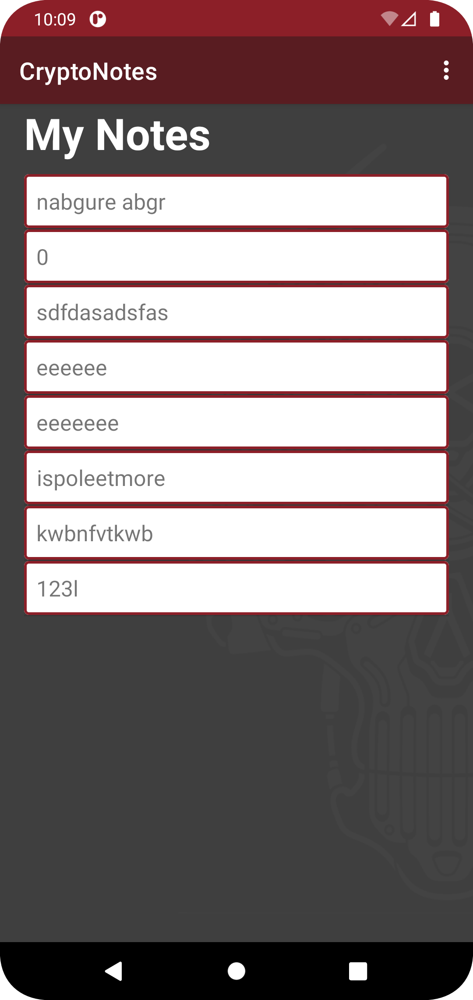
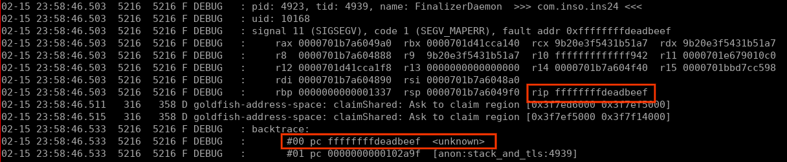
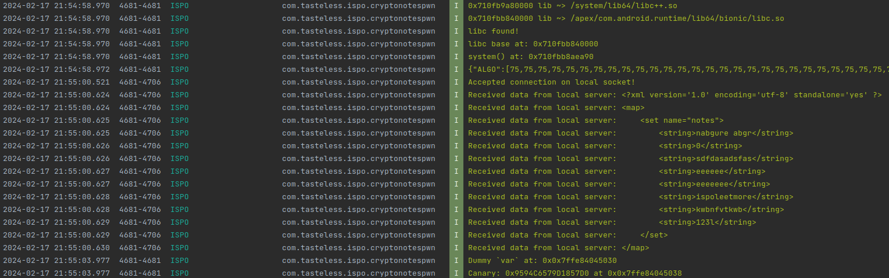
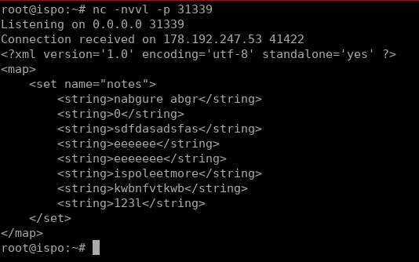

## Insomni'Hack Teaser 2024 - CryptoNotes (mobile 345)
##### 20/01 - 21/01/2024 (24hr)
___

### Description

***NOTE:** I solved this challenge after the CTF was over. I tested the exploit only locally.*


System Running:
```
system-images;android-30;google_apis_playstore;x86_64
```
___

### Solution


We're given an App that implements a simple note-keeping service. User can add or delete notes.
Notes are saved in preference data (`com.inso.ins24.mynotes`) as plaintext or encrypted using
**Vigenere Cipher** or **ROT13**. App also comes with a native library `libins24.so`:




After the initial analysis, we found a buffer overflow in the `get_algo()` function:
```c
char *__fastcall get_algo(__int64 a1, __int64 a2, __int64 a3, int a4) {
  unsigned __int64 i; // [rsp+10h] [rbp-70h]
  _BYTE *ByteArrayElements; // [rsp+18h] [rbp-68h]
  char ovfl_buf[56]; // [rsp+40h] [rbp-40h] BYREF
  unsigned __int64 canary; // [rsp+78h] [rbp-8h]

  canary = __readfsqword(0x28u);
  ByteArrayElements = (_BYTE *)_JNIEnv::GetByteArrayElements(a1, a3, 0LL);
  for ( i = 0LL; i < a4; ++i )
    ovfl_buf[i] = ByteArrayElements[i];
  return ovfl_buf;
}
```

The `get_algo()` is called from `docipher()`:
```c
__int64 __fastcall Java_com_inso_ins24_utils_CryptoConfig_docipher(
        _JNIEnv *env,
        __int64 jobject,
        __int64 ALGO,
        __int64 IN) {
  char *algo; // [rsp+0h] [rbp-80h]
  int ArrayLength; // [rsp+Ch] [rbp-74h]
  char *v7; // [rsp+10h] [rbp-70h]
  char *v8; // [rsp+10h] [rbp-70h]
  char *StringUTFChars; // [rsp+18h] [rbp-68h]

  StringUTFChars = (char *)_JNIEnv::GetStringUTFChars((__int64)env, IN, 0LL);
  ArrayLength = _JNIEnv::GetArrayLength((__int64)env, ALGO);
  algo = get_algo((__int64)env, jobject, ALGO, ArrayLength);
  if ( strstr(algo, "ALG1") ) {
    v7 = (char *)do_vigenere(StringUTFChars);
    return _JNIEnv::NewStringUTF(env, v7);
  } else if ( strstr(algo, "ALG2") ) {
    v8 = (char *)rot13(StringUTFChars);
    return _JNIEnv::NewStringUTF(env, v8);
  } else {
    return _JNIEnv::NewStringUTF(env, StringUTFChars);
  }
}
```


The `docipher()` is exported in `CryptoConfig` class:
```java
package com.inso.ins24.utils;

public class CryptoConfig {
    private byte[] ALGO;
    private String IN;

    public static native String docipher(byte[] arg0, String arg1) {
    }

    @Override
    protected void finalize() throws Throwable {
        super.finalize();
        CryptoConfig.docipher(this.ALGO, this.IN);
    }
}
```


The overflow is in the `ALGO` field, however it only takes predefined values that user cannot control. However there is an interesting problem in `MainActivity`:
```java
package com.inso.ins24;

import android.app.AlertDialog.Builder;
/* ..... */
import java.util.List;

public class MainActivity extends AppCompatActivity {
    static ArrayAdapter adapter;
    static String cryptoConfig;
    static CryptoConfig cryptoconf;
    TextView emptyTv;
    static Gson gson;
    static List notes2;
    ListView notesListView;
    SharedPreferences sharedPreferences;

    static {
        MainActivity.cryptoConfig = "{\'ALGO\':[65,76,71,79,49],\'IN\':\'this is a notes\'}";
        Gson gson0 = new Gson();
        MainActivity.gson = gson0;
        MainActivity.cryptoconf = (CryptoConfig)gson0.fromJson("{\'ALGO\':[65,76,71,79,49],\'IN\':\'this is a notes\'}", CryptoConfig.class);
    }

    public static String encrypt(String note, byte[] algo) {
        return CryptoConfig.docipher(algo, note);
    }

    @Override  // androidx.fragment.app.FragmentActivity
    protected void onCreate(Bundle savedInstanceState) {
        super.onCreate(savedInstanceState);
        this.setContentView(0x7F0B001C);  // layout:activity_main
        this.notesListView = (ListView)this.findViewById(0x7F080140);  // id:notes_ListView
        this.emptyTv = (TextView)this.findViewById(0x7F0800B1);  // id:emptyTv
        System.loadLibrary("ins24");
        if(this.getIntent().hasExtra("exit")) {
            this.finish();
        }

        this.sharedPreferences = this.getSharedPreferences("com.inso.ins24.mynotes", 0);
        MainActivity.notes2 = new ArrayList();
        HashSet noteSet2 = (HashSet)this.sharedPreferences.getStringSet("notes", null);
        if(noteSet2 != null && !noteSet2.isEmpty()) {
            this.emptyTv.setVisibility(8);
            MainActivity.notes2 = new ArrayList(noteSet2);
        }
        else {
            this.emptyTv.setVisibility(0);
        }

        /* ..... */
    }

    /* ..... */
}
```

If we start the `CryptoNotes` App using an intent and we pass an `exit` extra, App terminates and
the dtor is called. This is a known issue and is described in detail in
[this](https://blog.oversecured.com/Exploiting-memory-corruption-vulnerabilities-on-Android/)
blog post.


If we send an intent to `CryptoNotes` that contains a serialized `CryptoConfig` object, then 
`hasExtra()` has to deserialize it, even if it not needed. Since this object is now deserialized,
upon `MainActivity`'s `finish()`, the object destructor (`finalize()`) is called which calls
`docipher()`. Since we can pass any `CryptoNotes` object we have full control of the `ALGO` and `IN`
fields. Therefore we can trigger the buffer overflow.
  
The
[Android – Pass Parcelable Object From One Activity to Another Using PutExtra]
(https://www.geeksforgeeks.org/android-pass-parcelable-object-from-one-activity-to-another-using-putextra/)
blog post describes in detail how to send Parcelable objects to another App.


Since both our Pwn App and the `CryptoNotes` App are forked from Zygote process, they will have
the same `canary` value and their `libc.so` will be located in the same address. Therefore, we 
can bypass the canary and do a ROP to execute an arbitrary shell command.


The goal is to read the content of the `/data/data/com.inso.ins24/shared_prefs/com.inso.ins24.mynotes.xml`
file. We cannot write anything to the filesystem (App doesn't have permission) so we have to
read the contents and pipe them into a netcat channel. Our pwn app can listen that address so, it
can get the data and forward them to our remote server.


The first step is to control `rip`:




Then, we build our ROP payload and we can see the results in the logcat:




On our remote server side `ispo.gr` we can see the contents of the `com.inso.ins24.mynotes.xml`
file:




For more details please refer to the [Pwn App source code](./CryptoNotesPwn).
___
