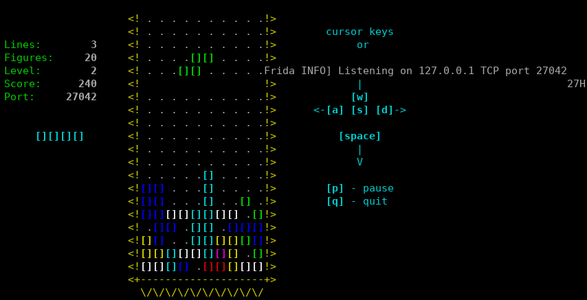
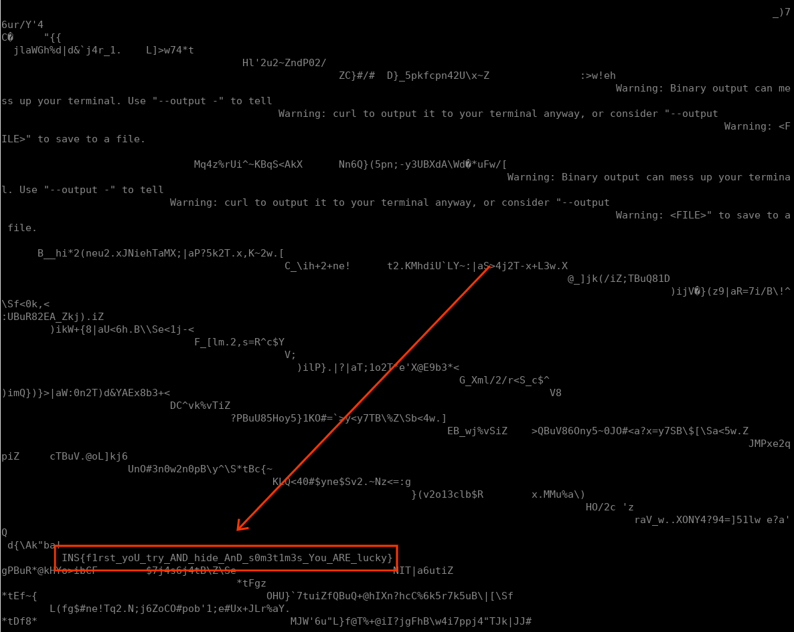

## Insomni'Hack Teaser 2024 - frown (RE 102)
##### 20/01 - 21/01/2024 (24hr)
___

### Description

*How REALLY good is your Tetris? Connect, win, and reveal the flag!*

```
ssh user@frown-revenge.insomnihack.ch -p24

password: 1nsomn1h4cker
```
___

### Solution

This challenge is the same as
[frown](https://github.com/ispoleet/ctf-writeups/tree/master/insomnihack_2024/frown),
with some small differences. We repeat the same process until we spawn a Frida server:



We also use the same script to get the binaries.
The function that prints the key is slightly different:
```c
__int64 __fastcall sub_2DC8(__int64 a1) {
  /* ... */
  v1 = 21LL;
  v3 = &v19;
  v18 = 0LL;
  while ( v1 ) {
    *v3++ = 0;
    --v1;
  }
  if ( *(_DWORD *)(a1 + 128) > glo_const_500 ) {
    hdl = dlopen("libttyris.so", 2);
    hdl_ = hdl;
    if ( hdl )
    {
      flag_key = dlsym(hdl, "flag_key");
      buf = malloc(0x64uLL);
      v8 = 25LL;
      buf_1 = buf;
      buf_2 = buf;
      while ( v8 ) {                            // bzero
        *buf_2++ = 0;
        --v8;
      }
      buf_3 = buf;
      ((void (__fastcall *)(_QWORD, _DWORD *, __int64))flag_key)(*(unsigned int *)(a1 + 128), buf, 100LL);
      dlclose(hdl_);
      u_do_curl_request("http://frown-service/", buf_1, flag);
      fmt = " [flag] %s";
      if ( flag[0] != 'I' || flag[1] != 'N' || flag[2] != 'S' || (flag_ = flag, flag[3] != '{') )
        flag_ = "incorrect flag";
    } else {
      fmt = " [flag] not found %s";
      flag_ = dlerror();
    }
    sprintf((char *)&v18, fmt, flag_);
  }
  v13 = alloca(strlen((const char *)&v18) + 133);
  strcpy(
    &v15,
    "  cursor keys\n"
    "       or\n"
    "\n"
    "     rotate\n"
    "       |\n"
    "      [w]\n"
    "<-[a] [s] [d]->\n"
    "\n"
    "    [space]\n"
    "       |\n"
    "       V\n"
    "\n"
    "  [p] - pause\n"
    "  [q] - quit\n"
    "\n");
  strcat(&v15, (const char *)&v18);
  sub_2028();
  sub_2161(55LL, 3LL, 6LL, &v15);
  sub_1837(a1);
  sub_2DBE(a1 + 112);
  sub_19E8(a1 + 56);
  return sub_19E8(a1);
}
```

As you can see there is an extra check to ensure that flag starts with `INS{`.

`flag_key` in `libttyris.so` is also a little bit different:
```c
void __fastcall flag_key(int a1, char *a2, int a3) {
  unsigned __int64 v3; // rbp
  unsigned __int64 i; // rbx
  int key; // eax

  v3 = a3;
  for ( i = 0LL; i < flag_size() && i < v3; ++i )
  {
    key = a1 ^ glo_xor_key[i];
    if ( (unsigned int)(key - 1) >= 0xFE )
      LOBYTE(key) = 0;
    a2[i] = key;
  }
}
```

```assembly
.rodata:0000000000002000 ; _DWORD glo_xor_key[32]
.rodata:0000000000002000 glo_xor_key     dd 23BEh, 23EFh, 23BAh, 23B9h, 23BFh, 23EAh, 23ECh, 23BFh
.rodata:0000000000002000                                         ; DATA XREF: LOAD:00000000000000C0↑o
.rodata:0000000000002000                                         ; flag_key+23↑o
.rodata:0000000000002020                 dd 23E3h, 23EDh, 23E9h, 23E2h, 23EBh, 23E3h, 23E9h, 23BEh
.rodata:0000000000002040                 dd 23BFh, 23B8h, 23E9h, 23B8h, 23E2h, 2 dup(23BFh), 23E8h
.rodata:0000000000002060                 dd 23E3h, 23B8h, 23BFh, 23EAh, 23EDh, 23BAh, 23EEh, 23B8h
.rodata:0000000000002060 _rodata         ends
```

We can also brute force the score to get all flag keys:
```python
buf2 = [
    0xbe, 0xef, 0xba, 0xb9, 0xbf, 0xea, 0xec, 0xbf,
    0xe3, 0xed, 0xe9, 0xe2, 0xeb, 0xe3, 0xe9, 0xbe,
    0xbf, 0xb8, 0xe9, 0xb8, 0xe2, 0xbf, 0xbf, 0xe8,
    0xe3, 0xb8, 0xbf, 0xea, 0xed, 0xba, 0xee, 0xb8
]
   
for i in range(256):
   flag_key = ''.join(chr((b ^ i) & 0xff) for b in buf2)
   if all(a >= '!' and a <= '~' for a in flag_key):
       print(f'Flag Key: {flag_key}')
   
```

This gives us the following keys:
```
Flag Key: >o:9?jl?cmibkci>?8i8b??hc8?jm:n8
Flag Key: ?n;8>km>blhcjbh?>9h9c>>ib9>kl;o9
Flag Key: <m8;=hn=aok`iak<=:k:`==ja:=ho8l:
Flag Key: =l9:<io<`njah`j=<;j;a<<k`;<in9m;
Flag Key: :k>=;nh;gimfogm:;<m<f;;lg<;ni>j<
Flag Key: ;j?<:oi:fhlgnfl;:=l=g::mf=:oh?k=
Flag Key: 8i<?9lj9ekodmeo89>o>d99ne>9lk<h>
Flag Key: 9h=>8mk8djneldn98?n?e88od?8mj=i?
Flag Key: 6g217bd7keajcka670a0j77`k07be2f0
Flag Key: 7f306ce6jd`kbj`761`1k66aj16cd3g1
Flag Key: 4e035`f5igchaic452c2h55bi25`g0d2
Flag Key: 5d124ag4hfbi`hb543b3i44ch34af1e3
Flag Key: 2c653f`3oaengoe234e4n33do43fa6b4
Flag Key: 3b742ga2n`dofnd325d5o22en52g`7c5
Flag Key: 0a471db1mcglemg016g6l11fm61dc4`6
Flag Key: 1`560ec0lbfmdlf107f7m00gl70eb5a7
Flag Key: %t!"$qw$xvrypxr%$#r#y$$sx#$qv!u#
Flag Key: z+~}{.({')-&/'-z{|-|&{{,'|{.)~*|
Flag Key: n?jio:<o3=92;39noh9h2oo83ho:=j>h
Flag Key: o>khn;=n2<83:28oni8i3nn92in;<k?i
Flag Key: l=hkm8>m1?;091;lmj;j0mm:1jm8?h<j
Flag Key: m<ijl9?l0>:180:mlk:k1ll;0kl9>i=k
Flag Key: j;nmk>8k79=6?7=jkl=l6kk<7lk>9n:l
Flag Key: k:olj?9j68<7>6<kjm<m7jj=6mj?8o;m
Flag Key: h9loi<:i5;?4=5?hin?n4ii>5ni<;l8n
Flag Key: i8mnh=;h4:>5<4>iho>o5hh?4oh=:m9o
Flag Key: f7bag24g;51:3;1fg`1`:gg0;`g25b6`
Flag Key: g6c`f35f:40;2:0gfa0a;ff1:af34c7a
Flag Key: d5`ce06e9738193deb3b8ee29be07`4b
Flag Key: e4abd17d8629082edc2c9dd38cd16a5c
Flag Key: b3fec60c?15>7?5bcd5d>cc4?dc61f2d
Flag Key: c2gdb71b>04?6>4cbe4e?bb5>eb70g3e
Flag Key: `1dga42a=37<5=7`af7f<aa6=fa43d0f
Flag Key: a0ef`53`<26=4<6a`g6g=``7<g`52e1g
```

We send each of these keys to the server and eventually we see the flag in the
challenge window:



So, the flag is: `INS{f1rst_yoU_try_AND_hide_AnD_s0m3t1m3s_You_ARE_lucky}`

For more details, please refer to the [frown_revenge_crack.py](./frown_revenge_crack.py) script.

___

