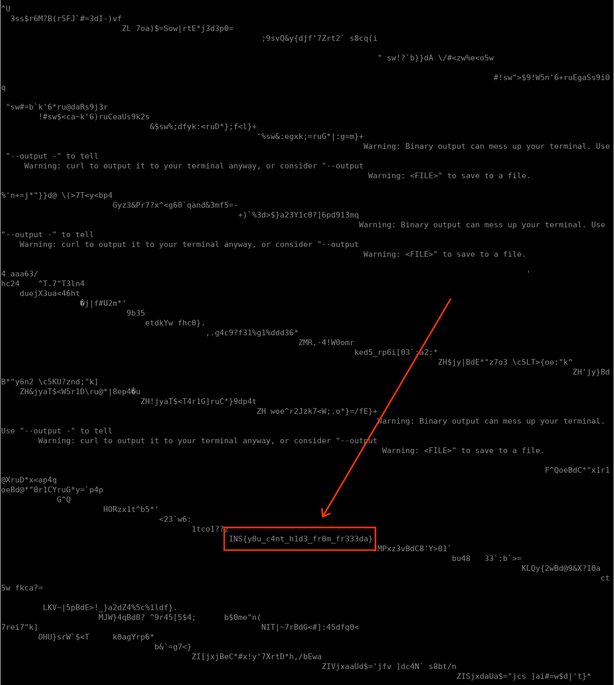

## Insomni'Hack Teaser 2024 - frown (RE 57)
##### 20/01 - 21/01/2024 (24hr)
___

### Description

*How good is your Tetris? Connect, win, and reveal the flag!*

```
ssh user@frown.insomnihack.ch -p24

password: 1nsomn1h4cker
```

___

### Solution

We connect to the server and we have a tetris game. After we solve **3** lines,
we get an interesting message: `[Frida INFO] Listening on 127.0.0.1 TCP port 27042`:


This spawns a Frida server on the remote server. To access it, we re-connect but this
time we set a **local port forwarding**:
```
ssh -L 27042:127.0.0.1:27042 frown.insomnihack.ch -p24 -l user
```

After the Frida server is spawned with press the `p` key to pause. We run our script
and we see there is only one active process named `Gadget`:
```
[+] Enumerating process: Process(pid=18, name="Gadget", parameters={})
``

Then we can connect to the server from our local machine:
```
frida -R Gadget
```

The first step is to check all the loaded modules:
```
[Remote::Gadget ]-> Process.enumerateModules()
[
    {
        "base": "0x560884170000",
        "name": "tetris",
        "path": "/usr/local/bin/tetris",
        "size": 29920
    },
    {
        "base": "0x7ffe54cf2000",
        "name": "linux-vdso.so.1",
        "path": "linux-vdso.so.1",
        "size": 3533
    },
    {
        "base": "0x7fd8723f5000",
        "name": "libcurl.so.4.8.0",
        "path": "/usr/lib/x86_64-linux-gnu/libcurl.so.4.8.0",
        "size": 719480
    },
    {
        "base": "0x7fd872214000",
        "name": "libc.so.6",
        "path": "/usr/lib/x86_64-linux-gnu/libc.so.6",
        "size": 1970000
    },

[..... MORE MODULES THAT WE DO NOT CARE ABOUT .....]

    {
        "base": "0x7fd8721e5000",
        "name": "libnghttp2.so.14.24.1",
        "path": "/usr/lib/x86_64-linux-gnu/libnghttp2.so.14.24.1",
        "size": 188912
    },
    {
        "base": "0x7fd86f8ca000",
        "name": "libpthread.so.0",
        "path": "/usr/lib/x86_64-linux-gnu/libpthread.so.0",
        "size": 16400
    },
    {
        "base": "0x7fd86c57a000",
        "name": "libttyris.so",
        "path": "/usr/lib/libttyris.so",
        "size": 16408
    }
]
```

The important modules here are the `tetris` (challenge binary) which is located
at `/usr/local/bin/tetris` and the `libttyris.so` helper library which is located
at `/usr/lib/libttyris.so`.


If we continue playing (after score becomes greater than **500**) random flags will start
showing up:


We also managed to crash the program:
```
/usr/bin/timeout: the monitored command dumped core
/usr/sbin/tetris.sh: line 11:    18 Segmentation fault      /usr/bin/timeout `# if you can see this, this is not a memory corruption challenge` `# the command you are seeing now is simply challenge plumbing` --foreground --preserve-status 8h /usr/local/bin/tetris
```


#### Fetching Challenge Binaries

The next is to fetch the binary (and the library) from the server so we can understand how
program works. Since `libc.so` is already loaded at `0x7fd872214000`, we can use it to
find the address of `system` and execute shell commands, using the following script:
```javascript
var sysPtr = Module.findExportByName('libc.so.6', 'system');
console.log('[+] libc.system() at:' + sysPtr);

var system = new NativeFunction(sysPtr, 'int', ['pointer']);
var retv = system(Memory.allocUtf8String('ls -la'));
console.log('[+] libc.system() return value:' + retv);

send('Script finished successfully.');
```

Then we run the following shell commands:
```python
    exec_shell_cmd('cat /usr/local/bin/tetris | base64')
    exec_shell_cmd('cat /usr/lib/libttyris.so | base64')
```

These commands will print the base64 encoding of the challenge binaries to the ssh window.
We copy (using the cursor) and decode them. The final binaries are:
[tetris](./tetris.bin) and [libttyris.so](./libttyris.so).


We also get the `/usr/sbin/tetris.sh` script (even though it's not needed):
```bash
# run tetris for 8 hours maximum. this will help clean up stale containers
# that lost it's SSH connection while also not being too frustrating.
/usr/bin/timeout \
    `# if you can see this, this is not a memory corruption challenge` \
    `# the command you are seeing now is simply challenge plumbing` \
        --foreground \
        --preserve-status 8h \
        /usr/local/bin/tetris
```


#### Reversing Tetris Binary

We open the `tetris.bin` binary and we look for interesting strings (more specifically
we look for the `flag`). We find `[flag] %s` which is used to print the (random) flags.
There only **1** XREF in `2DC8h`:
```
__int64 __fastcall u_IMPORTANT(__int64 a1) {
  /* ... */
  v1 = 21LL;
  v3 = &v18;
  v17 = 0LL;
  while ( v1 ) {
    *v3++ = 0;
    --v1;
  }

  if ( *(_DWORD *)(a1 + 128) > glo_const_500 ) {  // a1 + 128 ~> current score probably
    hdl = dlopen("libttyris.so", 2);
    hdl_ = hdl;
    if ( hdl )
    {
      flag_key = dlsym(hdl, "flag_key");
      buf = malloc(0x64uLL);
      buflen = 25LL;
      buf_1 = buf;
      buf_2 = buf;
      while ( buflen ) {                       // bzero
        *buf_2++ = 0;
        --buflen;
      }
      buf_ = buf;
      ((void (__fastcall *)(_QWORD, _DWORD *, __int64))flag_key)(*(unsigned int *)(a1 + 128), buf, 100LL);
      dlclose(hdl_);
      u_do_curl_request("http://frown-service/", buf_1, flag);
      sprintf((char *)&v17, " [flag] %s", flag);
    } else {
      v11 = dlerror();
      sprintf((char *)&v17, " [flag] not found %s", v11);
    }
  }

  v12 = alloca(strlen((const char *)&v17) + 133);
  strcpy(
    &v14,
    "  cursor keys\n"
    "       or\n"
    "\n"
    "     rotate\n"
    "       |\n"
    "      [w]\n"
    "<-[a] [s] [d]->\n"
    "\n"
    "    [space]\n"
    "       |\n"
    "       V\n"
    "\n"
    "  [p] - pause\n"
    "  [q] - quit\n"
    "\n");
  strcat(&v14, (const char *)&v17);
  sub_2028();
  sub_2161(55LL, 3LL, 6LL, &v14);
  sub_1837(a1);
  sub_2DBE(a1 + 112);
  sub_19E8(a1 + 56);
  return sub_19E8(a1);
}
```

Pretty interesting: This function loads (dynamically) function `flag_key` from `libttyris.so`
and invokes it by passing the current score as a parameter. This function sets the
contents of `buf` which are passed to `u_do_curl_request()` that makes a CURL request
to `http://frown-service/` to get a flag,

Let's find out what `flag_key` does:
```c
void __fastcall flag_key(int a1_key, char *a2_buf, int a3_len) {
  unsigned __int64 len; // rbp
  unsigned __int64 i; // rbx

  len = a3_len;
  for ( i = 0LL; i < flag_size() && i < len; ++i )
    a2_buf[i] = a1_key ^ glo_xor_key[4 * i];
}
```

```assembly
.rodata:0000000000002000 glo_xor_key     db 5Fh, 7Ah, 2 dup(0), 5Ch, 7Ah, 2 dup(0), 58h, 7Ah, 2 dup(0)
.rodata:0000000000002000                                         ; DATA XREF: LOAD:00000000000000C0↑o
.rodata:0000000000002000                                         ; flag_key+23↑o
.rodata:000000000000200C                 db 5Dh, 7Ah, 2 dup(0), 5Ah, 7Ah, 2 dup(0), 0Fh, 7Ah, 2 dup(0)
.rodata:0000000000002018                 db 58h, 7Ah, 2 dup(0), 51h, 7Ah, 2 dup(0), 5Dh, 7Ah, 2 dup(0)
.rodata:0000000000002024                 db 5Ch, 7Ah, 2 dup(0), 8, 7Ah, 2 dup(0), 0Ch, 7Ah, 2 dup(0)
.rodata:0000000000002030                 db 0Dh, 7Ah, 2 dup(0), 59h, 7Ah, 2 dup(0), 0Fh, 7Ah, 2 dup(0)
.rodata:000000000000203C                 db 0Fh, 7Ah, 2 dup(0), 5Fh, 7Ah, 2 dup(0), 59h, 7Ah, 2 dup(0)
.rodata:0000000000002048                 db 58h, 7Ah, 2 dup(0), 5Dh, 7Ah, 2 dup(0), 5Fh, 7Ah, 2 dup(0)
.rodata:0000000000002054                 db 0Bh, 7Ah, 2 dup(0), 0Ah, 7Ah, 2 dup(0), 5Dh, 7Ah, 2 dup(0)
.rodata:0000000000002060                 db 0Dh, 7Ah, 2 dup(0), 0Ch, 7Ah, 2 dup(0), 50h, 7Ah, 2 dup(0)
.rodata:000000000000206C                 db 0Fh, 7Ah, 2 dup(0), 0Ah, 7Ah, 2 dup(0), 50h, 7Ah, 2 dup(0)
.rodata:0000000000002078                 db 0Ch, 7Ah, 2 dup(0), 59h, 7Ah, 2 dup(0)
.rodata:0000000000002078 _rodata         ends
```

Okay, so the LSByte of the score is used to XOR a fixed array and generate a "flag key" which is
send to a server and based on that it returns a flag.


#### Brute-Forcing Flag Key

Let's brute force the score it to get all the flag keys (they should be ASCII printable).
There are 2 ways to do this:

**First** we can write the following python script:
```python
buf = [
    0x5f, 0x5c, 0x58, 0x5d, 0x5a, 0x0f, 0x58, 0x51,
    0x5d, 0x5c, 0x08, 0x0c, 0x0d, 0x59, 0x0f, 0x0f,
    0x5f, 0x59, 0x58, 0x5d, 0x5f, 0x0b, 0x0a, 0x5d,
    0x0d, 0x0c, 0x50, 0x0f, 0x0a, 0x50, 0x0c, 0x59
]

for i in range(256):
    flag_key = ''.join(chr((b ^ i) & 0xff) for b in buf)
    if all(a >= '!' and a <= '~' for a in flag_key):
        print(f'Flag Key: {flag_key}')
```

This gives us the following keys:
```
Flag Key: ~}y|{.yp|})-,x..~xy|~*+|,-q.+q-x
Flag Key: {x|y~+|uyx,()}++{}|y{/.y)(t+.t(}
Flag Key: vuqts&qxtu!%$p&&vpqtv"#t$%y&#y%p
Flag Key: olhmj?haml8<=i??oihmo;:m=<`?:`<i
Flag Key: nmilk>i`lm9=<h>>nhiln:;l<=a>;a=h
Flag Key: mnjoh=jcon:>?k==mkjom98o?>b=8b>k
Flag Key: lokni<kbno;?>j<<ljknl89n>?c<9c?j
Flag Key: khlin;leih<89m;;kmlik?>i98d;>d8m
Flag Key: jimho:mdhi=98l::jlmhj>?h89e:?e9l
Flag Key: ijnkl9ngkj>:;o99ionki=<k;:f9<f:o
Flag Key: hkojm8ofjk?;:n88hnojh<=j:;g8=g;n
Flag Key: gd`eb7`ied045a77ga`eg32e54h72h4a
Flag Key: feadc6ahde154`66f`adf23d45i63i5`
Flag Key: efbg`5bkgf267c55ecbge10g76j50j6c
Flag Key: dgcfa4cjfg376b44dbcfd01f67k41k7b
Flag Key: c`daf3dma`401e33cedac76a10l36l0e
Flag Key: bae`g2el`a510d22bde`b67`01m27m1d
Flag Key: abfcd1focb623g11agfca54c32n14n2g
Flag Key: `cgbe0gnbc732f00`fgb`45b23o05o3f
Flag Key: ?<8=:o81=<hlm9oo?98=?kj=ml0oj0l9
Flag Key: >=9<;n90<=iml8nn>89<>jk<lm1nk1m8
Flag Key: =>:?8m:3?>jno;mm=;:?=ih?on2mh2n;
Flag Key: <?;>9l;2>?kon:ll<:;><hi>no3li3o:
Flag Key: ;8<9>k<598lhi=kk;=<9;on9ih4kn4h=
Flag Key: :9=8?j=489mih<jj:<=8:no8hi5jo5i<
Flag Key: 9:>;<i>7;:njk?ii9?>;9ml;kj6il6j?
Flag Key: 8;?:=h?6:;okj>hh8>?:8lm:jk7hm7k>
Flag Key: 74052g0954`de1gg71057cb5ed8gb8d1
Flag Key: 65143f1845aed0ff60146bc4de9fc9e0
Flag Key: 56270e2;76bfg3ee53275a`7gf:e`:f3
Flag Key: 47361d3:67cgf2dd42364`a6fg;da;g2
Flag Key: 30416c4=10d`a5cc35413gf1a`<cf<`5
Flag Key: 21507b5<01ea`4bb24502fg0`a=bg=a4
Flag Key: 12634a6?32fbc7aa17631ed3cb>ad>b7
Flag Key: 03725`7>23gcb6``06720de2bc?`e?c6
Flag Key: )*.+,y.'+*~z{/yy)/.+)}|+{z&y|&z/
Flag Key: $'#&!t#*&'swv"tt$"#&$pq&vw+tq+w"
Flag Key: !"&#$q&/#"vrs'qq!'&#!ut#sr.qt.r'
```

**Second**, we can directly invoke `flag_key` from Frida (so we don't have to reverse it):
```javascript
var dlopenPtr = Module.findExportByName("libc.so.6", "dlopen");
const dlopen = new NativeFunction(dlopenPtr, 'pointer', ['pointer', 'int']);

var dlsymPtr = Module.findExportByName("libc.so.6", "dlsym");
const dlsym = new NativeFunction(dlsymPtr, 'pointer', ['pointer', 'pointer']);

var hdl = dlopen(Memory.allocUtf8String("libttyris.so"), 2);
var flag_key = dlsym(hdl, Memory.allocUtf8String("flag_key"));

var flag_keyPtr = Module.findExportByName("libttyris.so", "flag_key");
var flag_key = new NativeFunction(flag_keyPtr, 'void', ['int', 'pointer', 'uint64']);

var buf = Memory.alloc(100);
flag_key({key}, ptr(buf), 100);

var res = Memory.readByteArray(ptr(buf), 32);

var flag = String.fromCharCode.apply(null, new Uint8Array(res))
send(flag);
```

Both approaches work fine.


#### Getting the Flag

Now, for each candidate flag key, we need to send it to the server and get the flag.
Since we already have the functionality to execute shell commands, we can do this
easily:
```python
    for i in range(256):
        flag_key = send_flag_key(i)
        if all(a >= '!' and a <= '~' for a in flag_key):
            # Flag key is ASCII printable. Send it to the frown server.
            print(f'[+] Key: {i:X}h produces flag key: {flag_key!r} (see other window for flag)')

            flag_key = urllib.parse.quote(flag_key)
            
            # Send flag key to server and check the response in the tetris window.
            exec_shell_cmd(f'echo ""')  # Just add a newline.           
            exec_shell_cmd(f'curl -X POST http://frown-service/ -d "{flag_key}"')
```

After we run the script, we can see the flag eventually printed on the challenge window:




So, the flag is: `INS{y0u_c4nt_h1d3_fr0m_fr333da}`

For more details, please refer to the [frown_crack.py](./frown_crack.py) script.
___

