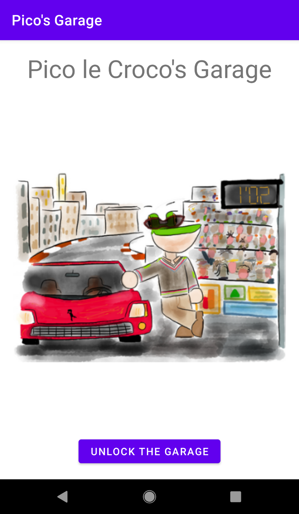

## Insomni'Hack CTF Finals 2022 - Pico's Garage (RE)
##### 25/03/2022 (10hr)
___

For this challenge we use [JEB Pro](https://www.pnfsoftware.com/) and a real, rooted,
Pixel XL device (no need for [Frida](https://frida.re/)). We start by looking at the
manifest file of the APK:
```xml
<?xml version="1.0" encoding="UTF-8"?>
<manifest android:compileSdkVersion="32" android:compileSdkVersionCodename="12" android:versionCode="1" android:versionName="1.0" package="ctf.insomnihack.garage" platformBuildVersionCode="32" platformBuildVersionName="12" xmlns:android="http://schemas.android.com/apk/res/android">
  <uses-sdk android:minSdkVersion="24" android:targetSdkVersion="28"/>
  <application android:allowBackup="true" android:appComponentFactory="androidx.core.app.CoreComponentFactory" android:extractNativeLibs="false" android:icon="@mipmap/app_icon" android:label="@string/app_name" android:roundIcon="@mipmap/app_icon_round" android:supportsRtl="true" android:theme="@style/Theme.MyApplication">
    <activity android:exported="true" android:name="ctf.insomnihack.garage.CarActivity"/>
    <activity android:exported="true" android:name="ctf.insomnihack.garage.MainActivity">
      <intent-filter>
        <action android:name="android.intent.action.MAIN"/>
        <category android:name="android.intent.category.LAUNCHER"/>
      </intent-filter>
    </activity>
    <provider android:authorities="ctf.insomnihack.garage.androidx-startup" android:exported="false" android:name="androidx.startup.InitializationProvider">
      <meta-data android:name="androidx.emoji2.text.EmojiCompatInitializer" android:value="androidx.startup"/>
      <meta-data android:name="androidx.lifecycle.ProcessLifecycleInitializer" android:value="androidx.startup"/>
    </provider>
  </application>
</manifest>
```

The interesting stuff here, are the [AppComponentFactory](https://developer.android.com/reference/android/app/AppComponentFactory)
(which we can ignore for this challenge) and the `ctf.insomnihack.garage.CarActivity` and
`ctf.insomnihack.garage.MainActivity` classes.

The **MainActiviy** starts when app is launched (we can infer that from `android.intent.action.MAIN`
intent filter). To launch the activity on the device we use `adb`:
```
am start ctf.insomnihack.garage/.MainActivity
```



Activity has a single button, where when pressed it simply displays a toast:


If we look at the code of the `MainActivity` it indeed does very little:
```java
public class MainActivity extends ctf implements View.OnClickListener {
    public static final String ski = "INS22";

    @Override  // android.view.View$OnClickListener
    public void onClick(View arg3) {
        if(arg3.getId() == 0x7F080062) {  // id:button
            Toast.makeText(this.getApplicationContext(), 0x7F0F002D, 1).show();  // string:garage_secure "Obviously, the garage is secured!"
        }
    }

    @Override  // androidx.fragment.app.gorgonzola
    public void onCreate(Bundle arg1) {
        super.onCreate(arg1);
        this.setContentView(0x7F0B001D);  // layout:activity_main
        ((Button)this.findViewById(0x7F080062)).setOnClickListener(this);  // id:button
    }
}
```

The **CarActivity** is more interesting, but there is no way to trigger from **MainActivity**,
so we use `adb` again:
```
am start ctf.insomnihack.garage/.CarActivity
```

However **CarActivity** does not start and app crashes. If we take a look at the **logcat** we can see why:
```
I ActivityManager: Start proc 25482:ctf.insomnihack.garage/u0a192 for activity {ctf.insomnihack.garage/ctf.insomnihack.garage.CarActivity}
I omnihack.garag: The ClassLoaderContext is a special shared library.
D OpenGLRenderer: Skia GL Pipeline
D AndroidRuntime: Shutting down VM
E AndroidRuntime: FATAL EXCEPTION: main
E AndroidRuntime: Process: ctf.insomnihack.garage, PID: 25482
E AndroidRuntime: java.lang.RuntimeException: Unable to start activity ComponentInfo{ctf.insomnihack.garage/ctf.insomnihack.garage.CarActivity}:
        java.lang.NullPointerException: Attempt to invoke virtual method 'boolean java.lang.String.equals(java.lang.Object)' on a null object reference
E AndroidRuntime: 	at android.app.ActivityThread.performLaunchActivity(ActivityThread.java:3165)
E AndroidRuntime: 	at android.app.ActivityThread.handleLaunchActivity(ActivityThread.java:3301)
E AndroidRuntime: 	at android.app.servertransaction.LaunchActivityItem.execute(LaunchActivityItem.java:82)
E AndroidRuntime: 	at android.app.servertransaction.TransactionExecutor.executeCallbacks(TransactionExecutor.java:135)
E AndroidRuntime: 	at android.app.servertransaction.TransactionExecutor.execute(TransactionExecutor.java:95)
E AndroidRuntime: 	at android.app.ActivityThread$H.handleMessage(ActivityThread.java:1916)
E AndroidRuntime: 	at android.os.Handler.dispatchMessage(Handler.java:107)
E AndroidRuntime: 	at android.os.Looper.loop(Looper.java:214)
E AndroidRuntime: 	at android.app.ActivityThread.main(ActivityThread.java:7156)
E AndroidRuntime: 	at java.lang.reflect.Method.invoke(Native Method)
E AndroidRuntime: 	at com.android.internal.os.RuntimeInit$MethodAndArgsCaller.run(RuntimeInit.java:492)
E AndroidRuntime: 	at com.android.internal.os.ZygoteInit.main(ZygoteInit.java:925)
E AndroidRuntime: Caused by: java.lang.NullPointerException: Attempt to invoke virtual method 'boolean java.lang.String.equals(java.lang.Object)' on a null object reference
E AndroidRuntime: 	at ctf.insomnihack.garage.CarActivity.onCreate(Unknown Source:26)
E AndroidRuntime: 	at android.app.Activity.performCreate(Activity.java:7696)
E AndroidRuntime: 	at android.app.Activity.performCreate(Activity.java:7685)
E AndroidRuntime: 	at android.app.Instrumentation.callActivityOnCreate(Instrumentation.java:1299)
E AndroidRuntime: 	at android.app.ActivityThread.performLaunchActivity(ActivityThread.java:3140)
E AndroidRuntime: 	... 11 more
W ActivityTaskManager:   Force finishing activity ctf.insomnihack.garage/.CarActivity
W ActivityTaskManager: Activity top resumed state loss timeout for ActivityRecord{be2b391 u0 ctf.insomnihack.garage/.CarActivity t-1 f}
```

The problem is that we try to invoke `equals()` method on a NULL object.
Le'ts take a closer look at `onCreate()` of **CarActivity**:
```java
@Override  // androidx.fragment.app.gorgonzola
public void onCreate(Bundle arg2) {
    super.onCreate(arg2);
    this.setContentView(0x7F0B001C);  // layout:activity_car
    if(!this.getIntent().getStringExtra("PASSWORD").equals(this.getString(0x7F0F002E))) {  // string:gruyere "Pico le Croco is smart"
        this.finish();
    }

    /* ... */
}
```

The problem is that `getStringExtra()` returns a NULL because we did not set this field in launching intent.
We can try again, but this time we set the `PASSWORD` field to `Pico le Croco is smart`
(this value is in the `res` directory, but JEB does a good job adding it as a comment to the code):
```
am start -n ctf.insomnihack.garage/.CarActivity --es "PASSWORD" "Pico le Croco is smart"                                                                                                                                                                                      
```

This time the activity launches successfully:


We type the password and then we click the button (I renamed method `x` to `ferrari_button_click`):
```java
@Override  // android.view.View$OnClickListener
public void onClick(View arg2) {
    if(arg2.getId() == 0x7F0800B7) {  // id:ferrariBtn
        this.ferrari_button_click(this.getApplicationContext(), this.ski.getText().toString());
    }
}
```

Method `ferrari_button_click` (or `x`) does all the work:
```java
private void ferrari_button_click(Context arg18, String password) {
    /**
     * Do some anti-debugging checks (which we don't care b/c we are on a real device.
     */
    Log.i("INS22", "Ok system looks clean");
    int v4_3 = password.length();
    if(v4_3 % 4 != 0) {
        return;  // password must be multiple of 4
    }

    byte[] pw_arr = new byte[v4_3 * 3 / 4];
    int step_4 = 0;
    int i;
    for(i = 0; step_4 < v4_3; i += 3) {
        // read the next 4 characters and substitute them as below
        byte[] sub_arr = new byte[4];
        int j;
        for(j = 0; j < 4; ++j) {
            int v13 = step_4 + j;
            sub_arr[j] = (byte)"ABCDEFINS_+*!{}0123456789abcdefghijklmnopqrstuvwxyz".indexOf(password.charAt(v13));  // position of the 1st char
            if(password.charAt(v13) < 0) {
                return;
            }
        }

        pw_arr[i] = (byte)(sub_arr[0] << 2 | sub_arr[1] >> 4 & 3);
        int v12_1 = i + 1;
        pw_arr[v12_1] = (byte)(((int)Math.abs(-0.245252 + ((double)(v4_3 * 10)))));
        pw_arr[v12_1] = (byte)((sub_arr[1] & 15) << 4 | sub_arr[2] >> 2 & 15);
        pw_arr[i + 2] = (byte)((sub_arr[2] & 3) << 6 | sub_arr[3] & 0x3F);
        sub_arr[0] = (byte)(sub_arr[0] ^ 0x70);
        sub_arr[1] = (byte)(sub_arr[1] ^ 0x1A4);
        sub_arr[2] = (byte)(sub_arr[2] ^ 0x630);
        sub_arr[3] = (byte)(sub_arr[3] ^ 0x1BC0);
        step_4 += 4;
    }

    // Original method name: v
    byte[] target = CarActivity.hexstring_to_byte_array(new String(Base64.decode(this.getString(0x7F0F0026), 0)));  // string:cheese "MTg3MjBkZGVhZDFjNjQ5ODZiMjU5YmM0YWNmOTVkMjhhMGE3OTlmYTkzYmVlZjBl"
    target[3] = 0x7A;
    target[4] = (byte)(target[17] - 3);
    target[target.length - 3] = (byte)0xB2;
    target[target.length - 2] = (byte)(target[target.length - 3] + 1);
    if(Arrays.equals(pw_arr, target)) {
        this.piste = true;
        this.set_objects_success(arg18);  // original method name: w
        StringBuilder v0_4 = androidx.activity.ctf.roquefort("Congrats! ferrari_flag=");
        v0_4.append(this.piste);
        Log.d("INS22", v0_4.toString());
        return;
    }

    Toast.makeText(arg18, "Sorry, your key is incorrect", 1).show();
}
```

The algorithm works as follows: First, it splts the password into groups of `4`. Then converts each
group into a hex array. To do that, it substitutes each character from the group with its first
(and unique) index in the string `ABCDEFINS_+*!{}0123456789abcdefghijklmnopqrstuvwxyz`.
Then it uses this hex array to perform some shift operatios and produce the next `3` characters from
the final ciphertext. The (simplified) encryption algorithm is shown below:
```python
def encrypt_example(password):
    assert(len(password) % 4 == 0)

    print(f'[+] Encryption example for: {password}')

    pw_arr = [0]*(len(password)*3 // 4)
    k = 0;

    for i in range(0, len(password), 4):
        sub_arr = [
            "ABCDEFINS_+*!{}0123456789abcdefghijklmnopqrstuvwxyz".index(password[i + j])
            for j in range(4)
        ]
            
        print(f'[+] Substitution array for index {k}: {sub_arr}')

        pw_arr[k]     = (sub_arr[0] << 2) | (sub_arr[1] >> 4 & 3)
        pw_arr[k + 1] = (sub_arr[1] & 15) << 4 | (sub_arr[2] >> 2 & 15)
        pw_arr[k + 2] = (sub_arr[2] & 3) << 6 | (sub_arr[3] & 0x3F)

        k += 3
        
    print(f'[+] Password array: {pw_arr}')
    print(f'[+] Final ciphertext:', ''.join('%02x' % p for p in pw_arr))
```

Our goal is to crack the ciphertext `18720ddead1c64986b259bc4acf95d28a0a799fa93beef0e` 
(which is derived from the base64 decoding of `MTg3MjBkZGVhZDFjNjQ5ODZiMjU5YmM0YWNmOTVkMjhhMGE3OTlmYTkzYmVlZjBl`).
We start from the end and we work backwards. All operations are invertable. But, there is a small
caveat: Not all bits from `sub_arr` are used in `pw_arr`. Therefore, given `3` bytes from `pw_arr` we
miss in `8` bits from `sub_arr` (which is `4` bytes). However, the bits we are missing are mostly the
most siginificant bits which we know they are `0` (password is a printable ASCII). So we miss in `5`
bits in total which we can easily brute force. At the end, it turns out that all solutions yield to
the same password, so there is a unique solution.

We run the crack and we get the flag: `INS{fr1da_is_awEs0me++Congr4ts!}`

We can also test that the password is correct:


The success results are also shown in **logcat**:
```
I INS22   : Ok system looks clean
D INS22   : Congrats! ferrari_flag=true
```

For more details please refer to [picos_garage_crack.py](./picos_garage_crack.py) file.

Ironically, the challenge is about unlocking a Ferrari, but the app shows a
Lamborghini Aventador :P
