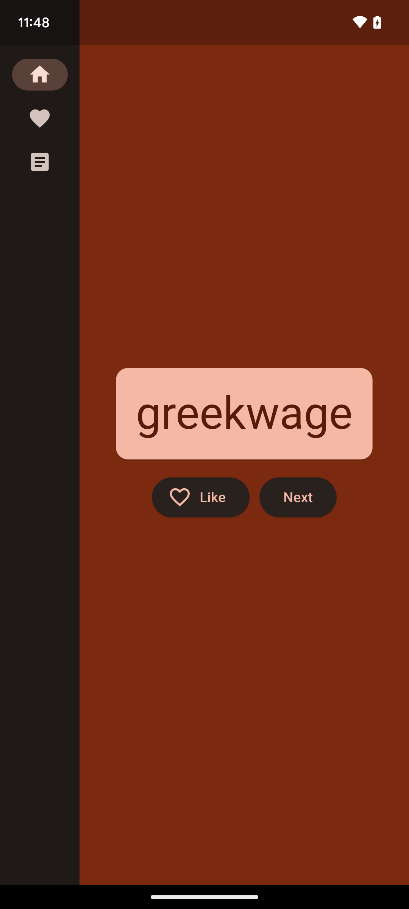
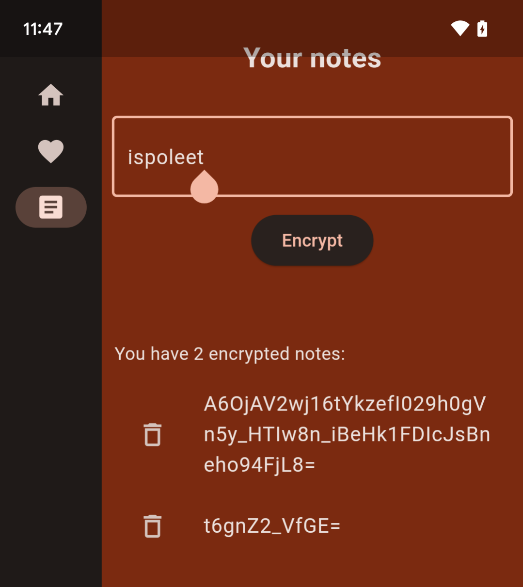

##  Insomni'Hack CTF Finals 2024 - InsoStasher (mobile, reversing)
##### 26/04/2024 (10hr)
___

### Description

*My friend has developed an app to store notes securely because he doesn't trust the ones that are*
*already on the play store.*
*But to be honest, I don't trust him.*
*He is so sure of himself that he gave me the app with one of his encrypted note. Can you check please?*

```
app-release-826e219a7cc19a78deb327673a90f4fe7c5ab3371cced452d15ce33ed3335e10.apk
```
___

### Solution

This challenge was a super simple Android App. In the **home** screen, it presents some random,
composite words:



You have the option to like some of these words. All the words that you like appear in the
**favorites** page.


Finally, there is also a **notes** page, where you can encrypt a message of your choice:



The goal is to decrypt the encrypted note that is already stored there:
```
    A6OjAV2wj16tYkzefI029h0gVn5y_HTIw8n_iBeHk1FDIcJsBneho94FjL8=
```

This looks like a **base64** encoding but it's not as it contains underscores (`_`).

A quick look at APK contents, shows that this is a flutter App:
```
┌─[23:06:34]─[ispo@ispo-glaptop2]─[~/ctf/insomnihack_finals_2024/InsoStasher]
└──> tree contents/lib/
contents/lib/
├── arm64-v8a
│             ├── libapp.so
│             ├── libapp.so.i64
│             ├── libapp.so.id0
│             ├── libapp.so.id1
│             ├── libapp.so.nam
│             ├── libapp.so.til
│             └── libflutter.so
├── armeabi-v7a
│             ├── libapp.so
│             └── libflutter.so
└── x86_64
    ├── libapp.so
    ├── libapp.so.i64
    └── libflutter.so

4 directories, 12 files
```

Reversing flutter apps is hard, however the are some resources that can help us:
* [Reverse engineering Flutter apps (Part 1)](https://blog.tst.sh/reverse-engineering-flutter-apps-part-1/)
* [Reverse engineering Flutter apps (Part 2)](https://blog.tst.sh/reverse-engineering-flutter-apps-part-2/)
* [Reversing an Android sample which uses Flutter](https://cryptax.medium.com/reversing-an-android-sample-which-uses-flutter-23c3ff04b847)
* [Introduction to Dart VM](https://mrale.ph/dartvm/)


According to the above resources, we start by identifying the *flutter snapshot hash*, which is
`ee1eb666c76a5cb7746faf39d0b97547`:
```assembly
.rodata:0000000000000200
.rodata:0000000000000200 ; Segment type: Pure data
.rodata:0000000000000200         AREA .rodata, DATA, READONLY, ALIGN=6
.rodata:0000000000000200         ; ORG 0x200
.rodata:0000000000000200         EXPORT _kDartVmSnapshotData
.rodata:0000000000000200 _kDartVmSnapshotData DCD 0xDCDCF5F5         ; DATA XREF: LOAD:0000000000184478↓o
.rodata:0000000000000204         DCD 0x377D
.rodata:0000000000000208         DCD 0
.rodata:000000000000020C         DCD 3
.rodata:0000000000000210         DCD 0
.rodata:0000000000000214 aEe1eb666c76a5c DCB "ee1eb666c76a5cb7746faf39d0b97547product no-code_comments no-dwar"
.rodata:0000000000000254         DCB "f_stack_traces_mode no-lazy_dispatchers dedup_instructions no-ts"
.rodata:0000000000000294         DCB "an no-asserts arm64 android compressed-pointers null-safety",0
```

The problem is that each snapshot can have a different format, so a tool may not support the current
snapshot version. We google the snapshot hash and the only result we find is for
[reFlutter](https://github.com/Impact-I/reFlutter). That is, that's the only tool that we can
actually use at the moment.


We follow the steps on
[Reversing an Android sample which uses Flutter](https://cryptax.medium.com/reversing-an-android-sample-which-uses-flutter-23c3ff04b847). We start by locating the address
of `_kDartIsolateSnapshotInstructions` that contains the actual code from the App:
```
Symbol table '.dynsym' contains 6 entries:
   Num:    Value          Size Type    Bind   Vis      Ndx Name
     0: 0000000000000000     0 NOTYPE  LOCAL  DEFAULT  UND 
     1: 0000000000190000 91488 OBJECT  GLOBAL DEFAULT    7 _kDartVmSnapshotInstructions
     2: 00000000001a6580 0x2a7e60 OBJECT  GLOBAL DEFAULT    7 _kDartIsolateSnapshotInstructions
     3: 0000000000000200 15696 OBJECT  GLOBAL DEFAULT    2 _kDartVmSnapshotData
     4: 0000000000003f80 0x1803e0 OBJECT  GLOBAL DEFAULT    2 _kDartIsolateSnapshotData
     5: 00000000000001c8    32 OBJECT  GLOBAL DEFAULT    1 _kDartSnapshotBuildId
```


Then we use **reFlutter** to patch the APK so we can dump all the method names and offsets in the
snapshot:
```
┌─[22:42:54]─[ispo@ispo-glaptop2]─[~/ctf/insomnihack_finals_2024/InsoStasher]
└──> reflutter app-release-826e219a7cc19a78deb327673a90f4fe7c5ab3371cced452d15ce33ed3335e10.apk 

 Choose an option: 

 1. Traffic monitoring and interception 
 2. Display absolute code offset for functions

 [1/2]? 1

Example: (192.168.1.154) etc.
Please enter your BurpSuite IP: 192.168.1.107

 Wait...


SnapshotHash: ee1eb666c76a5cb7746faf39d0b97547
The resulting apk file: ./release.RE.apk
Please sign,align the apk file

Configure Burp Suite proxy server to listen on *:8083
Proxy Tab -> Options -> Proxy Listeners -> Edit -> Binding Tab

Then enable invisible proxying in Request Handling Tab
Support Invisible Proxying -> true
```

```
┌─[22:43:34]─[ispo@ispo-glaptop2]─[~/ctf/insomnihack_finals_2024/InsoStasher]
└──> java -jar uber-apk-signer-1.2.1.jar --allowResign -a release.RE.apk
source:
	/home/ispo/ctf/insomnihack_finals_2024/InsoStasher
zipalign location: PATH 
	/usr/bin/zipalign
keystore:
	[0] 161a0018 /tmp/temp_9408538102635015672_debug.keystore (DEBUG_EMBEDDED)

01. release.RE.apk

	SIGN
	file: /home/ispo/ctf/insomnihack_finals_2024/InsoStasher/release.RE.apk (29.14 MiB)
	checksum: 917de508ece8e1ec585e6370a978eb4c8c8293f6bb892b0a94582b3a9286f519 (sha256)
	- zipalign success
	- sign success

	VERIFY
	file: /home/ispo/ctf/insomnihack_finals_2024/InsoStasher/release.RE-aligned-debugSigned.apk (29.15 MiB)
	checksum: b445c420e29819b7593f024738fe21e4067a03030a2b7608213738812b4c5242 (sha256)
	- zipalign verified
	- signature verified [v1, v2, v3] 
		20 warnings
		Subject: CN=Android Debug, OU=Android, O=US, L=US, ST=US, C=US
		SHA256: 1e08a903aef9c3a721510b64ec764d01d3d094eb954161b62544ea8f187b5953 / SHA256withRSA
		Expires: Thu Mar 10 20:10:05 GMT 2044

[Sun Jun 23 22:43:41 BST 2024][v1.2.1]
Successfully processed 1 APKs and 0 errors in 0.96 seconds.
```

After that we uninstall the current app, and install the patched one:
```
┌─[22:44:41]─[ispo@ispo-glaptop2]─[~/ctf/insomnihack_finals_2024/InsoStasher]
└──> adb install release.RE-aligned-debugSigned.apk
Performing Streamed Install
Success
```

Then we run the app (we also interact with it) and reFlutter creates a `dump.dart` file located
under `/data/data/ch.insomnihack.inso_stasher`. This is a JSON file (we pretty-print it) that
looks like this:
```json
// .....
{
  "method_name": "createState",
  "offset": "0x0000000000138ab8",
  "library_url": "package:provider/src/provider.dart",
  "class_name": "_CreateInheritedProvider"
}
{
  "method_name": "<anonymous closure>",
  "offset": "0x0000000000138bf8",
  "library_url": "package:inso_stasher/main.dart",
  "class_name": "_NotesPageState"
}
{
  "method_name": "addEncryptedNote",
  "offset": "0x0000000000138c5c",
  "library_url": "package:inso_stasher/main.dart",
  "class_name": "MyAppState"
}
{
  "method_name": "encrypt",
  "offset": "0x0000000000138e6c",
  "library_url": "package:inso_stasher/secret_stasher.dart",
  "class_name": "SecretStasher"
}
{
  "method_name": "encode",
  "offset": "0x0000000000138f68",
  "library_url": "dart:convert",
  "class_name": "Codec"
}
{
  "method_name": "longsToShortsU",
  "offset": "0x0000000000138fe4",
  "library_url": "package:inso_stasher/utilities.dart",
  "class_name": "FormatUtilities"
}
{
  "method_name": "encode",
  "offset": "0x000000000013912c",
  "library_url": "package:inso_stasher/secret_stasher.dart",
  "class_name": "SecretStasher"
}
{
  "method_name": "shortToLongsU",
  "offset": "0x00000000001393f4",
  "library_url": "package:inso_stasher/utilities.dart",
  "class_name": "FormatUtilities"
}
{
  "method_name": "<anonymous closure>",
  "offset": "0x0000000000139694",
  "library_url": "package:inso_stasher/main.dart",
  "class_name": "_NotesPageState"
}
{
  "method_name": "dispose",
  "offset": "0x00000000001396e4",
  "library_url": "package:flutter/src/cupertino/button.dart",
  "class_name": "_CupertinoButtonState"
}
{
  "method_name": "dispose",
  "offset": "0x000000000013974c",
  "library_url": "package:flutter/src/cupertino/button.dart",
  "class_name": "__CupertinoButtonState&State&SingleTickerProviderStateMixin"
}
// .....
```

The method names are not obfuscated so we can easily find out which are the important methods. Here
for example, the method `MyAppState.addEncryptedNote()` from `main.dart` is located at offset
`0x138c5c + 0x1a6580 = 0x2df1dc` in the binary. We search for all packages that are not library code
(they start with the `inso_stasher/*` prefix) and we rename these functions in IDA. 


### Reversing Encryption Algorithm

We start reversing from `MyAppState.addEncryptedNote()`:
```c
__int64 __usercall u_main_MyAppState_addEncryptedNote@<X0>(
        __int64 a1@<X0>,
        __int64 a2@<X1>,
        __int64 a3@<X2>,
        __int64 a4@<X3>,
        __int64 a5@<X4>,
        __int64 a6@<X5>,
        __int64 a7@<X6>,
        __int64 a8@<X7>,
        __int64 a9@<X8>) {
  /* ... */
  *(_QWORD *)(v9 - 16) = v14;
  *(_QWORD *)(v9 - 8) = v15;
  v16 = v9 - 16;
  if ( (unsigned __int64)(v9 - 56) <= *(_QWORD *)(v11 + 56) )
    u_unknown_4331A8(a1, a2, a3, a4, a5, a6, a7, a8, a9);
  v17 = *(_QWORD *)(v16 + 16);
  if ( !*(_DWORD *)(v17 + 7) )
    return v10;
  *(_QWORD *)(v16 - 8) = *(unsigned int *)(*(_QWORD *)(v16 + 24) + 43LL) + (v13 << 32);
  v18 = sub_4330AC(v17, v12[260], 32LL);
  *(_QWORD *)(v16 - 16) = v18;
  *(_DWORD *)(v18 + 15) = v12[7762];
  *(_DWORD *)(v18 + 19) = v12[7763];
  *(_DWORD *)(v18 + 23) = 0x3A581B8E;
  *(_DWORD *)(v18 + 27) = 0x66021D54;
  *(_DWORD *)(v18 + 31) = 0xCC18A2E;
  *(_DWORD *)(v18 + 35) = 1214232854;
  *(_DWORD *)(v18 + 39) = v12[7764];
  *(_DWORD *)(v18 + 43) = 559796118;
  *(_DWORD *)(v18 + 47) = 46374618;
  *(_DWORD *)(v18 + 51) = v12[7765];
  *(_DWORD *)(v18 + 55) = 1518860492;
  *(_DWORD *)(v18 + 59) = v12[7766];
  *(_DWORD *)(v18 + 63) = v12[7767];
  *(_DWORD *)(v18 + 67) = v12[7768];
  *(_DWORD *)(v18 + 71) = 1227108240;
  *(_DWORD *)(v18 + 75) = v12[7769];
  v19 = sub_432298();
  *(_DWORD *)(v19 + 15) = *(_QWORD *)(v16 - 16);
  *(_DWORD *)(v19 + 11) = 32;
  v20 = *(_QWORD *)(v16 + 16);
  *v21 = v19;
  v21[1] = v20;
  v29 = u_secret_stasher_SecretStasher_encrypt(32LL, v19, v22, v23, v24, v25, v26, v27, v28);
  v43 = *(_QWORD *)(v16 - 8);
  *(_QWORD *)(v16 - 16) = v29;
  v44 = *(unsigned int *)&byte_9[*(unsigned int *)(v43 + 15) + 2 + (v13 << 32)] + (v13 << 32);
  v45 = (__int64)((*(unsigned int *)(v43 + 11) + (v13 << 32)) << 32) >> 33;
  *(_QWORD *)(v16 - 24) = v45;
  v46 = (__int64)(int)v44 >> 1;
  if ( v45 == v46 )
  {
    *v34 = v43;
    u_core_List__growToNextCapacity(v43, v29, v46, v45, v44, v30, v31, v32, v33);
  }
  v47 = *(_QWORD *)(v16 - 8);
  v48 = *(_QWORD *)(v16 - 24);
  *(_DWORD *)(v47 + 11) = 2 * (v48 + 1);
  if ( v48 < v48 + 1 )
  {
    v49 = *(unsigned int *)(v47 + 15) + (v13 << 32);
    v50 = *(_QWORD *)(v16 - 16);
    *(_DWORD *)&byte_9[4 * v48 + 6 + v49] = v50;
    if ( (v50 & 1) != 0
      && (*(unsigned __int8 *)(v50 - 1) & ((unsigned __int64)*(unsigned __int8 *)(v49 - 1) >> 2) & HIDWORD(v13)) != 0 )
    {
      sub_4316C0(v50, v49, v47, v48, v44, v30, v31, v32, v33, v35, v36, v37, v38, v39, v40, v41, v42);
    }
    *v34 = *(_QWORD *)(v16 + 24);
    u_change_notifier_ChangeNotifier_notifyListener(v50, v49, v47, v48, v44, v30, v31, v32, v33);
    return v10;
  }
  result = sub_4335F0(v48 + 1, v48, v47, v48, v44, v30, v31, v32, v33);
  if ( (result & 1) == 0 || (unsigned int)*(_QWORD *)(result - 1) >> 12 != 1080LL )
    return (*(__int64 (**)(void))(v11 + 616))();
  return result;
}
```

The decompiled code is a mess because Dart VM uses a virtual stack instead of the traditional one.
Nevertheless we can still see that it calls `SecretStasher.encrypt()`:
```assembly
.text:00000000002DF3EC u_secret_stasher_SecretStasher_encrypt      ; CODE XREF: u_main_MyAppState_addEncryptedNote+130↑p
.text:00000000002DF3EC fp_ = X29
.text:00000000002DF3EC thr = X26
.text:00000000002DF3EC brm = X28
.text:00000000002DF3EC pp = X27
.text:00000000002DF3EC dsp = X15
.text:00000000002DF3EC ip0 = X16
.text:00000000002DF3EC         STP             fp_, X30, [dsp,#-0x10]!
.text:00000000002DF3F0         MOV             fp_, dsp
.text:00000000002DF3F4         SUB             dsp, dsp, #0x40 ; '@'
.text:00000000002DF3F8         LDR             ip0, [thr,#0x38]
.text:00000000002DF3FC         CMP             dsp, ip0
.text:00000000002DF400         B.LS            loc_2DF4E0
.text:00000000002DF404
.text:00000000002DF404 loc_2DF404                                  ; CODE XREF: u_secret_stasher_SecretStasher_encrypt+F8↓j
.text:00000000002DF404         LDR             X0, [fp_,#0x18]
.text:00000000002DF408         LDUR            W1, [X0,#7]
.text:00000000002DF40C         ADD             X1, X1, brm,LSL#32
.text:00000000002DF410         CBNZ            W1, MOVE_ON
.text:00000000002DF414         LDR             X0, [pp,#0x1F0]
.text:00000000002DF418         MOV             dsp, fp_
.text:00000000002DF41C         LDP             fp_, X30, [dsp],#0x10
.text:00000000002DF420         RET
.text:00000000002DF424 ; ---------------------------------------------------------------------------
.text:00000000002DF424
.text:00000000002DF424 MOVE_ON                                     ; CODE XREF: u_secret_stasher_SecretStasher_encrypt+24↑j
.text:00000000002DF424         LDR             X1, [fp_,#0x10]
.text:00000000002DF428         LDR             ip0, [pp,#0xED0]
.text:00000000002DF42C         STP             X0, ip0, [dsp]
.text:00000000002DF430         LDR             X4, [pp,#0x188]
.text:00000000002DF434 final encodedSample = utf8Encoder.convert(sample);
.text:00000000002DF434         BL              u_convert_Utf8Encoder_convert
.text:00000000002DF438         STR             X0, [dsp]
.text:00000000002DF43C         BL              u_utilities_formatUtilities_shortToLongsU
.text:00000000002DF440         MOV             X1, X0
.text:00000000002DF444         LDR             X0, [fp_,#0x10]
.text:00000000002DF448         STUR            X1, [fp_,#-0x18]
.text:00000000002DF44C         LDUR            W4, [X0,#0xB]
.text:00000000002DF450         ADD             X4, X4, brm,LSL#32
.text:00000000002DF454         STUR            X4, [fp_,#-0x10]
.text:00000000002DF458         SBFX            X2, X4, #1, #0x1F
.text:00000000002DF45C         STUR            X2, [fp_,#-8]
.text:00000000002DF460         TBNZ            X2, #0x3F, loc_2DF46C ; '?'
.text:00000000002DF464         CMP             X2, X2
.text:00000000002DF468         B.LE            loc_2DF47C
.text:00000000002DF46C
.text:00000000002DF46C loc_2DF46C                                  ; CODE XREF: u_secret_stasher_SecretStasher_encrypt+74↑j
.text:00000000002DF46C         STP             X4, XZR, [dsp,#8]
.text:00000000002DF470         STR             X2, [dsp]
.text:00000000002DF474         LDR             X4, [pp,#0x190]
.text:00000000002DF478 static int checkValidRange(int start, int? end, int length,[String? startName, String? endName, String? message]);
.text:00000000002DF478
.text:00000000002DF478         BL              u_core_RangeError_checkValidRange
.text:00000000002DF47C
.text:00000000002DF47C loc_2DF47C                                  ; CODE XREF: u_secret_stasher_SecretStasher_encrypt+7C↑j
.text:00000000002DF47C         LDUR            X0, [fp_,#-8]
.text:00000000002DF480         LDUR            X4, [fp_,#-0x10]
.text:00000000002DF484         BL              u_zero_buffer_maybe
.text:00000000002DF488         STUR            X0, [fp_,#-0x10]
.text:00000000002DF48C         STP             XZR, X0, [dsp,#0x18]
.text:00000000002DF490         LDUR            X1, [fp_,#-8]
.text:00000000002DF494         LDR             ip0, [fp_,#0x10]
.text:00000000002DF498         STP             ip0, X1, [dsp,#8]
.text:00000000002DF49C         STR             XZR, [dsp]
.text:00000000002DF4A0 Maybe: void setRange(int start, int end, Iterable<E> iterable, [int skipCount = 0])
.text:00000000002DF4A0 this copies encryption key: A7 CF C7 AA 17 8B 6A CB  6D F7 66 3C 89 97 C8 30
.text:00000000002DF4A0         BL              u_typed_data___Uint8List__TypedList__IntListMixin__TypedIntListMixin__slowSetRange
.text:00000000002DF4A4         LDUR            ip0, [fp_,#-0x10]
.text:00000000002DF4A8         STR             ip0, [dsp]
.text:00000000002DF4AC         BL              u_utilities_formatUtilities_shortToLongsU
.text:00000000002DF4B0         LDUR            ip0, [fp_,#-0x18]
.text:00000000002DF4B4         STP             X0, ip0, [dsp]
.text:00000000002DF4B8         BL              u_secret_stasher_SecretStasher_encode
.text:00000000002DF4BC         STR             X0, [dsp]
.text:00000000002DF4C0         BL              u_utilities_formatUtilities_longsToShortsU
.text:00000000002DF4C4         ADD             ip0, pp, #0xF,LSL#12
.text:00000000002DF4C8         LDR             ip0, [ip0,#0x2D0]
.text:00000000002DF4CC         STP             X0, ip0, [dsp]
.text:00000000002DF4D0 T encode(S input) => encoder.convert(input);
.text:00000000002DF4D0 Call custom encoder (base64)
.text:00000000002DF4D0         BL              u_convert_Codec_encode
.text:00000000002DF4D4         MOV             dsp, fp_
.text:00000000002DF4D8         LDP             fp_, X30, [dsp],#0x10
.text:00000000002DF4DC         RET
```

This method first converts the input text into bytes (`utf8Encoder.convert()`), then it loads the
*secret key* and calls the `SecretStasher.encode()` to actually encrypt the text. Finally, it uses
`encoder.convert()` to encode the ciphertext:
```c
__int64 __usercall u_convert_Codec_encode@<X0>(
        __int64 a1@<X0>,
        __int64 a2@<X1>,
        __int64 a3@<X2>,
        __int64 a4@<X3>,
        __int64 a5@<X4>,
        __int64 a6@<X5>,
        __int64 a7@<X6>,
        __int64 a8@<X7>,
        __int64 a9@<X8>) {
  /* ... */
  if ( *(_DWORD *)(v17 + 7) != (_DWORD)v10 )
    (*(void (__fastcall **)(_QWORD, __int64))&byte_7[*(unsigned int *)((char *)&dword_14
                                                                     + *(unsigned int *)(v17 + 7)
                                                                     + (v12 << 32)
                                                                     + 3)
                                                   + (v12 << 32)])(
      *(_QWORD *)(v15 + 16),
      v10);
  v19 = *(_QWORD *)(v15 + 24);
  v20 = *(unsigned int *)(v19 + 11) + (v12 << 32);
  *v16 = *(_QWORD *)(v15 + 16);
  v16[1] = v20;
  return u_convert_Base64Encoder_convert(v19, v20, v18, v17, a5, a6, a7, a8, a9);
}
```

As you can see encoding is simply a **Base64** encoding. However, if we look
[here](https://stackoverflow.com/questions/66910584/base64-decode-invalid-encoding-before-padding),
we can see that Dart replaces `/` with `_` and `+` with `-`. For example, `ispoleet` encodes to
`t6gnZ2_VfGE=`:
```
┌─[19:07:22]─[ispo@ispo-glaptop2]─[~/ctf/insomnihack_finals_2024/InsoStasher]
└──> echo 't6gnZ2_VfGE=' | base64 --decode | hexdump -C
base64: invalid input
00000000  b7 a8 27 67                                       |..'g|
00000004

┌─[19:07:39]─[ispo@ispo-glaptop2]─[~/ctf/insomnihack_finals_2024/InsoStasher]
└──> echo 't6gnZ2/VfGE=' | base64 --decode | hexdump -C
00000000  b7 a8 27 67 6f d5 7c 61                           |..'go.|a|
00000008
```

We debug the App and set a breakpoint after `SecretStasher.encode()` and we verify it returns
`b7 a8 27 67 6f d5 7c 61`. 

> [!NOTE]  
> Debugging this Apps using IDA and a real device is sad. The App randomly crashes and throws
> segmentation faults. So here are some tips to make debugging more stable:
>   * Ensure that mobile phone's screen doesn't go off (you can change this from settings)
>   * Once execution reaches the `encrypt`/`encode` method, suspend all threads except the current one
>   * Rebase program to zero
>   * Disable ASLR


Now let's look at the `SecretStasher.encode()`:
```assembly
.text:00000000002DF6AC u_secret_stasher_SecretStasher_encode       ; CODE XREF: u_secret_stasher_SecretStasher_encrypt+CC↑p
.text:00000000002DF6AC fp_ = X29
.text:00000000002DF6AC lr_ = X30
.text:00000000002DF6AC brm = X28
.text:00000000002DF6AC pp = X27
.text:00000000002DF6AC ip1 = X17
.text:00000000002DF6AC ip0 = X16
.text:00000000002DF6AC dsp = X15
.text:00000000002DF6AC thr = X26
.text:00000000002DF6AC         STP             fp_, lr_, [dsp,#-0x10]!
.text:00000000002DF6B0         MOV             fp_, dsp
.text:00000000002DF6B4         SUB             dsp, dsp, #8
.text:00000000002DF6B8         LDR             X0, [fp_,#0x18]
.text:00000000002DF6BC         LDUR            W1, [X0,#0x13]
.text:00000000002DF6C0         ADD             X1, X1, brm,LSL#32
.text:00000000002DF6C4         SBFX            X2, X1, #1, #0x1F
.text:00000000002DF6C8         STUR            X2, [fp_,#-8]

[..... TRUNCATED FOR BREVITY .....]

.text:00000000002DF788         TBZ             W5, #0, loc_2DF790
.text:00000000002DF78C         LDUR            X7, [X5,#7]
.text:00000000002DF790
.text:00000000002DF790 loc_2DF790                                  ; CODE XREF: u_secret_stasher_SecretStasher_encode+DC↑j
.text:00000000002DF790         UBFX            X8, X8, #0, #0x20 ; ' '
.text:00000000002DF794         LDUR            W5, [X2,#0x13]
.text:00000000002DF798         ADD             X5, X5, brm,LSL#32
.text:00000000002DF79C         SBFX            X9, X5, #1, #0x1F
.text:00000000002DF7A0         MOV             X10, X7
.text:00000000002DF7A4         MOV             X7, #0              ; sum = 0
.text:00000000002DF7A8         MOV             X5, #3
.text:00000000002DF7AC
.text:00000000002DF7AC loc_2DF7AC                                  ; CODE XREF: u_secret_stasher_SecretStasher_encode+21C↓j
.text:00000000002DF7AC         LDR             ip0, [thr,#0x38]
.text:00000000002DF7B0         CMP             dsp, ip0
.text:00000000002DF7B4         B.LS            loc_2DF91C
.text:00000000002DF7B8
.text:00000000002DF7B8 loc_2DF7B8                                  ; CODE XREF: u_secret_stasher_SecretStasher_encode+274↓j
.text:00000000002DF7B8         CMP             X10, #0
.text:00000000002DF7BC         B.LE            FUNC_RETN
.text:00000000002DF7C0 TEA! ~> https://en.wikipedia.org/wiki/Tiny_Encryption_Algorithm
.text:00000000002DF7C0         MOV             ip1, #0x9E3779B9    ; delta = 0x9E3779B9
.text:00000000002DF7C8         ADD             X11, X7, ip1        ; x11 = sum += delta
.text:00000000002DF7CC         ASR             X7, X11, #2         ; x11 = delta >> 2 ~> that's not TEA ~> that's XXTEA!
.text:00000000002DF7D0         UBFX            X7, X7, #0, #0x20 ; ' ' ; Unsigned Bitfield Extract.
.text:00000000002DF7D4         AND             X12, X7, X5         ; x12 = e = (delta >> 2) & 3
.text:00000000002DF7D8         MOV             X7, #0              ; p = 0
.text:00000000002DF7DC
.text:00000000002DF7DC OUTER_LOOP                                  ; CODE XREF: u_secret_stasher_SecretStasher_encode+20C↓j
.text:00000000002DF7DC         LDR             ip0, [thr,#0x38]
.text:00000000002DF7E0         CMP             dsp, ip0
.text:00000000002DF7E4         B.LS            IGNORE_ME
.text:00000000002DF7E8
.text:00000000002DF7E8 INNER_LOOP                                  ; CODE XREF: u_secret_stasher_SecretStasher_encode+27C↓j
.text:00000000002DF7E8         CMP             X7, X6              ; if p >= n then break
.text:00000000002DF7EC         B.GE            loc_2DF8BC
.text:00000000002DF7F0         ADD             X13, X7, #1         ; x13 = p++
.text:00000000002DF7F4         CBZ             X6, loc_2DF92C
.text:00000000002DF7F8         SDIV            X19, X13, X6        ; ?
.text:00000000002DF7FC         MSUB            X14, X19, X6, X13
.text:00000000002DF800         CMP             X14, XZR
.text:00000000002DF804         B.LT            loc_2DF958
.text:00000000002DF808
.text:00000000002DF808 loc_2DF808                                  ; CODE XREF: u_secret_stasher_SecretStasher_encode+2BC↓j
.text:00000000002DF808         MOV             X0, X6
.text:00000000002DF80C         MOV             X1, X14
.text:00000000002DF810         CMP             X1, X0
.text:00000000002DF814         B.CS            loc_2DF96C
.text:00000000002DF818         ADD             ip0, X3, X14,LSL#2
.text:00000000002DF81C         LDUR            W19, [ip0,#0x17]    ; w19 = v[p + 1]
.text:00000000002DF820         ASR             X14, X8, #5         ; compute MX
.text:00000000002DF824         UBFX            X19, X19, #0, #0x20 ; ' '
.text:00000000002DF828         LSL             X20, X19, #2
.text:00000000002DF82C         EOR             X23, X14, X20
.text:00000000002DF830         ASR             X14, X19, #3
.text:00000000002DF834         LSL             X20, X8, #4
.text:00000000002DF838         EOR             X24, X14, X20
.text:00000000002DF83C         ADD             X14, X23, X24
.text:00000000002DF840         EOR             X20, X11, X19
.text:00000000002DF844         MOV             X19, X7
.text:00000000002DF848         UBFX            X19, X19, #0, #0x20 ; ' '
.text:00000000002DF84C         AND             X23, X19, X5
.text:00000000002DF850         MOV             X19, X12
.text:00000000002DF854         UBFX            X19, X19, #0, #0x20 ; ' '
.text:00000000002DF858         UBFX            X23, X23, #0, #0x20 ; ' '
.text:00000000002DF85C         EOR             X24, X23, X19
.text:00000000002DF860         MOV             X0, X9
.text:00000000002DF864         MOV             X1, X24
.text:00000000002DF868         CMP             X1, X0
.text:00000000002DF86C         B.CS            loc_2DF970
.text:00000000002DF870         ADD             ip0, X2, X24,LSL#2
.text:00000000002DF874         LDUR            W1, [ip0,#0x17]     ; w1 = key[(p & 3) ^ e]
.text:00000000002DF878         UBFX            X1, X1, #0, #0x20 ; ' '
.text:00000000002DF87C         EOR             X19, X1, X8
.text:00000000002DF880         ADD             X1, X20, X19
.text:00000000002DF884         EOR             X19, X14, X1
.text:00000000002DF888         ADD             ip0, X3, X7,LSL#2
.text:00000000002DF88C         LDUR            W1, [ip0,#0x17]
.text:00000000002DF890         UBFX            X1, X1, #0, #0x20 ; ' '
.text:00000000002DF894         ADD             X14, X1, X19
.text:00000000002DF898         UBFX            X14, X14, #0, #0x20 ; ' ' ; x14 = z
.text:00000000002DF89C         ADD             X1, X3, X7,LSL#2
.text:00000000002DF8A0         STUR            W14, [X1,#0x17]     ; write cipher
.text:00000000002DF8A4         ADD             ip0, X3, X7,LSL#2
.text:00000000002DF8A8         LDUR            W1, [ip0,#0x17]
.text:00000000002DF8AC         UBFX            X1, X1, #0, #0x20 ; ' '
.text:00000000002DF8B0         MOV             X8, X1
.text:00000000002DF8B4         MOV             X7, X13
.text:00000000002DF8B8         B               OUTER_LOOP
.text:00000000002DF8BC ; ---------------------------------------------------------------------------
.text:00000000002DF8BC
.text:00000000002DF8BC loc_2DF8BC                                  ; CODE XREF: u_secret_stasher_SecretStasher_encode+140↑j
.text:00000000002DF8BC         SUB             X0, X10, #1
.text:00000000002DF8C0         MOV             X10, X0
.text:00000000002DF8C4         MOV             X7, X11
.text:00000000002DF8C8         B               loc_2DF7AC
.text:00000000002DF8CC ; ---------------------------------------------------------------------------
.text:00000000002DF8CC
.text:00000000002DF8CC FUNC_RETN                                   ; CODE XREF: u_secret_stasher_SecretStasher_encode+110↑j
.text:00000000002DF8CC         MOV             X0, X3
.text:00000000002DF8D0         MOV             dsp, fp_
.text:00000000002DF8D4         LDP             fp_, lr_, [dsp],#0x10
.text:00000000002DF8D8         RET
.text:00000000002DF8DC ; ---------------------------------------------------------------------------
.text:00000000002DF8DC
.text:00000000002DF8DC loc_2DF8DC                                  ; CODE XREF: u_secret_stasher_SecretStasher_encode+40↑j
.text:00000000002DF8DC         BL              sub_4335F0
.text:00000000002DF8E0
.text:00000000002DF8E0 loc_2DF8E0                                  ; CODE XREF: u_secret_stasher_SecretStasher_encode+8C↑j
.text:00000000002DF8E0                                             ; u_secret_stasher_SecretStasher_encode+9C↑j
.text:00000000002DF8E0         STR             Q1, [dsp,#-0x10]!
.text:00000000002DF8E4         STP             X3, X4, [dsp,#-0x10]!
.text:00000000002DF8E8         STR             X2, [dsp,#-8]!
.text:00000000002DF8EC         FMOV            D0, D1
.text:00000000002DF8F0         MOV             X0, #0xE0
.text:00000000002DF8F4         LDR             lr_, [pp,#0x26E0]
.text:00000000002DF8F8         LDUR            lr_, [lr_,#7]
.text:00000000002DF8FC         BLR             lr_
.text:00000000002DF900         MOV             X5, X0
.text:00000000002DF904         LDR             X2, [dsp],#8
.text:00000000002DF908         LDP             X3, X4, [dsp],#0x10
.text:00000000002DF90C         LDR             Q1, [dsp],#0x10
.text:00000000002DF910         B               loc_2DF750
.text:00000000002DF914 ; ---------------------------------------------------------------------------
.text:00000000002DF914
.text:00000000002DF914 loc_2DF914                                  ; CODE XREF: u_secret_stasher_SecretStasher_encode+B8↑j
.text:00000000002DF914         BL              sub_4335F0
.text:00000000002DF918
.text:00000000002DF918 loc_2DF918                                  ; CODE XREF: u_secret_stasher_SecretStasher_encode+D0↑j
.text:00000000002DF918         BL              sub_4335F0
.text:00000000002DF91C
.text:00000000002DF91C loc_2DF91C                                  ; CODE XREF: u_secret_stasher_SecretStasher_encode+108↑j
.text:00000000002DF91C         BL              u_unknown_4331A8
.text:00000000002DF920         B               loc_2DF7B8
.text:00000000002DF924 ; ---------------------------------------------------------------------------
.text:00000000002DF924
.text:00000000002DF924 IGNORE_ME                                   ; CODE XREF: u_secret_stasher_SecretStasher_encode+138↑j
.text:00000000002DF924         BL              u_unknown_4331A8
.text:00000000002DF928         B               INNER_LOOP          ; if p >= n then break
.text:00000000002DF92C ; ---------------------------------------------------------------------------
.text:00000000002DF92C
.text:00000000002DF92C loc_2DF92C                                  ; CODE XREF: u_secret_stasher_SecretStasher_encode+148↑j
.text:00000000002DF92C         STP             X12, X13, [dsp,#-0x10]!
.text:00000000002DF930         STP             X10, X11, [dsp,#-0x10]!
.text:00000000002DF934         STP             X8, X9, [dsp,#-0x10]!
.text:00000000002DF938         STP             X6, X7, [dsp,#-0x10]!
.text:00000000002DF93C         STP             X4, X5, [dsp,#-0x10]!
.text:00000000002DF940         STP             X2, X3, [dsp,#-0x10]!
.text:00000000002DF944         LDR             X5, [thr,#0x448]
.text:00000000002DF948         MOV             X4, #0
.text:00000000002DF94C         LDR             lr_, [thr,#0x1F8]
.text:00000000002DF950         BLR             lr_
.text:00000000002DF954         BRK             #0
.text:00000000002DF958
.text:00000000002DF958 loc_2DF958                                  ; CODE XREF: u_secret_stasher_SecretStasher_encode+158↑j
.text:00000000002DF958         CMP             X6, XZR
.text:00000000002DF95C         SUB             X19, X14, X6
.text:00000000002DF960         ADD             X14, X14, X6
.text:00000000002DF964         CSEL            X14, X19, X14, LT
.text:00000000002DF968         B               loc_2DF808
.text:00000000002DF96C ; ---------------------------------------------------------------------------
.text:00000000002DF96C
.text:00000000002DF96C loc_2DF96C                                  ; CODE XREF: u_secret_stasher_SecretStasher_encode+168↑j
.text:00000000002DF96C         BL              sub_4335F0
.text:00000000002DF970
.text:00000000002DF970 loc_2DF970                                  ; CODE XREF: u_secret_stasher_SecretStasher_encode+1C0↑j
.text:00000000002DF970         BL              sub_4335F0
.text:00000000002DF970 ; End of function u_secret_stasher_SecretStasher_encode
```

This method takes two parameters: the text (in bytes) that we want to encrypt and
the **encryption key**:
```
A7 CF C7 AA 17 8B 6A CB  6D F7 66 3C 89 97 C8 30
```

A quick glance at the code, reveals a magic constant `0x9E3779B9`:
```assembly
.text:00000000002DF7C0         MOV             ip1, #0x9E3779B9    ; delta = 0x9E3779B9
```

After we quick google search, we find that this constant is used in
[Tiny Encryption Algorithm](https://en.wikipedia.org/wiki/Tiny_Encryption_Algorithm).
However, this is a little bit different from *TEA* because of `delta >> 2`:
```assembly
.text:00000000002DF7C0         MOV             ip1, #0x9E3779B9    ; delta = 0x9E3779B9
.text:00000000002DF7C8         ADD             X11, X7, ip1        ; x11 = sum += delta
.text:00000000002DF7CC         ASR             X7, X11, #2         ; x11 = delta >> 2 ~> that's not TEA
```

After some more searching, we find that this is a *TEA* variation, called *Corrected Block TEA*,
or [XXTEA](https://en.wikipedia.org/wiki/XXTEA):
```c
  #include <stdint.h>
  #define DELTA 0x9e3779b9
  #define MX (((z>>5^y<<2) + (y>>3^z<<4)) ^ ((sum^y) + (key[(p&3)^e] ^ z)))
  
  void btea(uint32_t *v, int n, uint32_t const key[4]) {
    uint32_t y, z, sum;
    unsigned p, rounds, e;
    if (n > 1) {          /* Coding Part */
      rounds = 6 + 52/n;
      sum = 0;
      z = v[n-1];
      do {
        sum += DELTA;
        e = (sum >> 2) & 3;
        for (p=0; p<n-1; p++) {
          y = v[p+1]; 
          z = v[p] += MX;
        }
        y = v[0];
        z = v[n-1] += MX;
      } while (--rounds);
    } else if (n < -1) {  /* Decoding Part */
      n = -n;
      rounds = 6 + 52/n;
      sum = rounds*DELTA;
      y = v[0];
      do {
        e = (sum >> 2) & 3;
        for (p=n-1; p>0; p--) {
          z = v[p-1];
          y = v[p] -= MX;
        }
        z = v[n-1];
        y = v[0] -= MX;
        sum -= DELTA;
      } while (--rounds);
    }
  }
```


We tried the online tools/libraries for *XXTEA* encryption/decryption but the results were
different. Hence, we implemented our own version based on the above code (perhaps that's a slightly
modified version of XXTEA?):
```python
def my_xxtea(v, n, key, d=False):
    """(Slightly) modified implementation of XXTEA.
    Code taken from here: https://en.wikipedia.org/wiki/XXTEA
    """
    DELTA = 0x9e3779b9
    def MX():
        mx = (((z>>5^y<<2) + (y>>3^z<<4)) ^ ((sum_^y) + (key[((p)&3)^e] ^ z)))
        return mx & 0xFFFFFFFF

    # With 2 blocks ~> 0x20 rounds
    #      3 blocks ~> 0x17 rounds
    rounds = 6 + 52 // n 

    # ~ ~ ~ ~ ~ Encryption ~ ~ ~ ~ ~
    if n > 1: 

      sum_ = 0
      z = v[n-1]
      while rounds > 0:
        if d: print(f"[+]  R:{rounds:2d}, SUM:{sum_:08X}, v:[{', '.join(f'{i:08X}' for i in v)}]")
        sum_ = (sum_ + DELTA) & 0xFFFFFFFF
        e = (sum_ >> 2) & 3

        for p in range(0, n, 1):
          y = v[(p + 1) % n]
          v[p] = (v[p] + MX()) & 0xFFFFFFFF
          z = v[p]
          if d: print(f'[+]    p:{p} y:{y:08X}, k:{key[(p&3)^e]:08X} MX:{MX():08X}, z:{z:08X}',
                      f"v:[{', '.join(f'{i:08X}' for i in v)}]")
        rounds -= 1

    # ~ ~ ~ ~ ~ Decryption ~ ~ ~ ~ ~
    elif n < -1:
      n = -n
      rounds = 6 + 52 // n 
      sum_ = rounds*DELTA
      y = v[0]
      while rounds > 0:
        if d: print(f"[+]  R:{rounds:2d}, SUM:{sum_:08X}, v:[{', '.join(f'{i:08X}' for i in v)}]")
        e = (sum_ >> 2) & 3
        for p in range(n-1, -1, -1):
          z = v[(p-1)]
          v[p] = (v[p] - MX()) & 0xFFFFFFFF
          y = v[p]
          if d: print(f'[+]    p:{p} y:{y:08X}, k:{key[(p&3)^e]:08X} MX:{MX():08X}, z:{z:08X}',
                      f"v:[{', '.join(f'{i:08X}' for i in v)}]")

        sum_ = (sum_ - DELTA) & 0xFFFFFFFF
        rounds -= 1
   
    return v
```

This code seems to encrypt and decrypt sample texts correctly. We use this function to decrypt the
encrypted note `A6OjAV2wj16tYkzefI029h0gVn5y_HTIw8n_iBeHk1FDIcJsBneho94FjL8=`, 
which has the following bytes:
```
  03 A3 A3 01 5D B0 8F 5E AD 62 4C DE 7C 8D 36 F6
  1D 20 56 7E 72 FC 74 C8 C3 C9 FF 88 17 87 93 51
  43 21 C2 6C 06 77 A1 A3 DE 05 8C BF
```

And we get the flag.


For more details, please take a look at the [insostasher_crack.py](./insostasher_crack.py) script.

So, the flag is: `INS{m4yb3_1_5h0uln'7_h4v3_h4rdc0d3d_7h3_k3y}`
___
