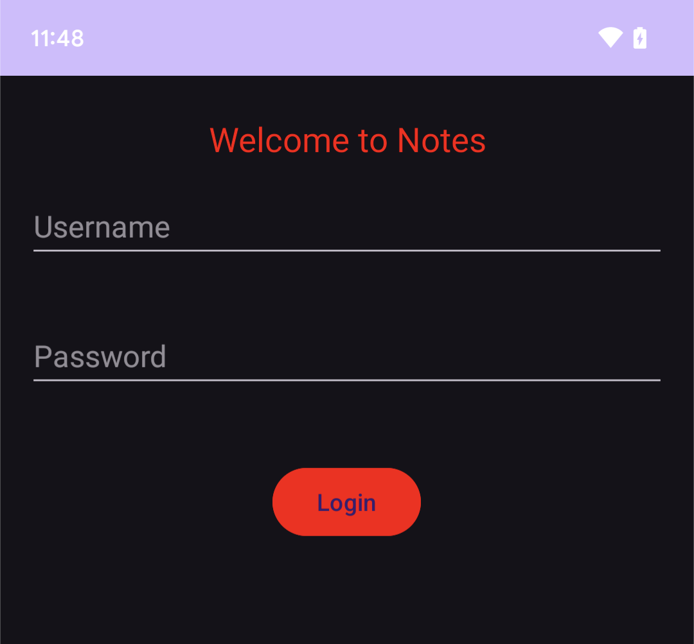
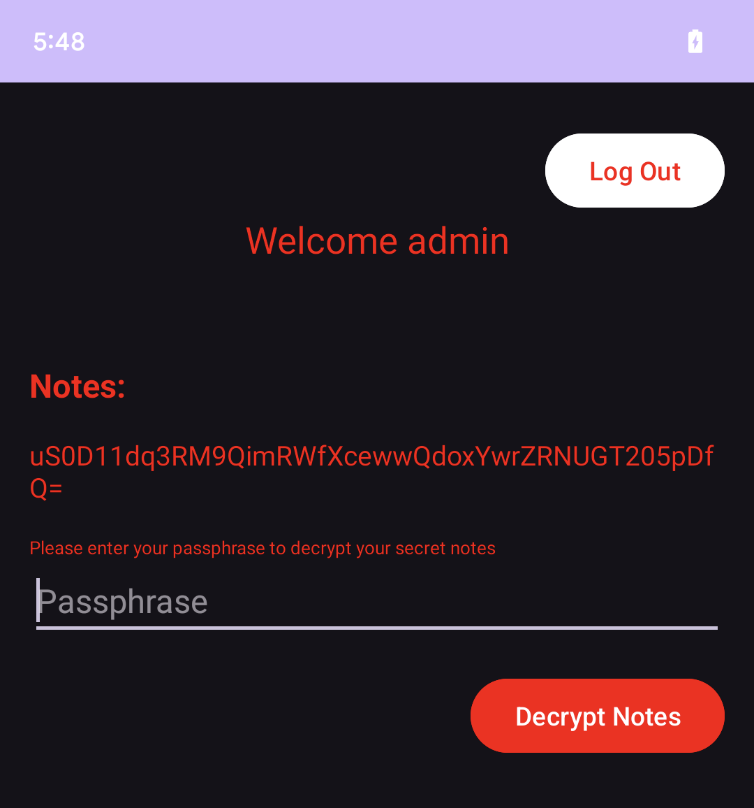
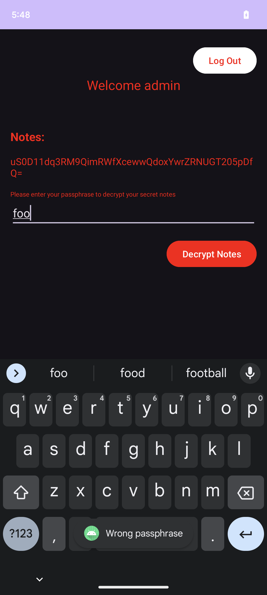
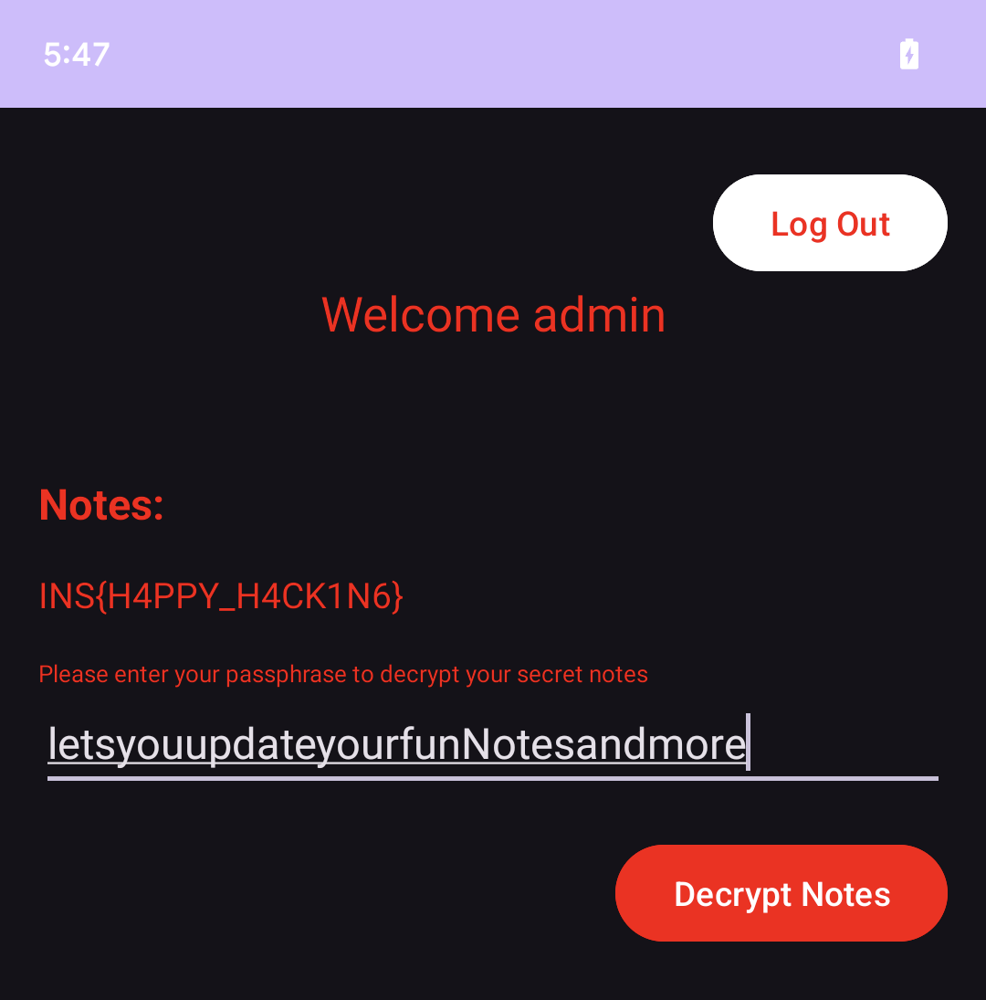

##  Insomni'Hack CTF Finals 2023 - Notes (mobile, warmup)
##### 26/04/2024 (10hr)
___

### Description

*Hi there,*

*thanks for testing my new notes app. I know it's not done yet, but the military-grade encryption*
*is implemented, so let's see if you can read my note.*


```
Notes.apk
```

**UPDATE: ever heard of rockyou.txt?**

___

### Solution


This is a simple app. We install it on a test device and we see it presents a login screen:



We load APK into [JEB](https://www.pnfsoftware.com/).
Everything starts from `com.example.firstjavaapplication.MainActivity`.
```java
package com.example.firstjavaapplication;

/* ... */

public class MainActivity extends AppCompatActivity {
    private Button buttonLogin;
    private EditText editTextPassword;
    private EditText editTextUsername;

    @Override  // androidx.fragment.app.FragmentActivity
    protected void onCreate(Bundle bundle0) {
        super.onCreate(bundle0);
        this.setContentView(layout.activity_main);
        this.editTextUsername = (EditText)this.findViewById(id.editTextUsername);
        this.editTextPassword = (EditText)this.findViewById(id.editTextPassword);
        Button button0 = (Button)this.findViewById(id.buttonLogin);
        this.buttonLogin = button0;
        button0.setOnClickListener(new View.OnClickListener() {
            private boolean isValidCredentials(String s, String s1) {
                return (s.equals("admin")) && (s1.equals("fbG6pXd0wm1cz"));
            }

            @Override  // android.view.View$OnClickListener
            public void onClick(View view0) {
                String s = MainActivity.this.editTextUsername.getText().toString().trim();
                String s1 = MainActivity.this.editTextPassword.getText().toString().trim();
                if(!s.isEmpty() && !s1.isEmpty()) {
                    if(this.isValidCredentials(s, s1)) {
                        Intent intent0 = new Intent(MainActivity.this, Part1.class);
                        intent0.putExtra("password", s1);
                        MainActivity.this.startActivity(intent0);
                        return;
                    }

                    Toast.makeText(MainActivity.this, "Wrong Username or Password", 0).show();
                    return;
                }

                Toast.makeText(MainActivity.this, "Please enter username and password", 0).show();
            }
        });
    }
}
```

The correct credentials as `admin` and `fbG6pXd0wm1cz`. We type them and we move on to the admin
page which is handled by `com.example.firstjavaapplication.Part1` class:




The goal here is to enter the correct passphrase and decrypt the note. Let's see the most important
parts of `Part1`:
```java
package com.example.firstjavaapplication;

/* ... */

public class Part1 extends AppCompatActivity {
    private Button buttonLogin;
    private Button buttonLogout;
    private EditText editTextPassphrase;

    private String generateFlag(String s) {
        StringBuffer stringBuffer0;
        try {
            MessageDigest messageDigest0 = MessageDigest.getInstance("MD5");
            messageDigest0.update(s.getBytes());
            byte[] arr_b = messageDigest0.digest();
            stringBuffer0 = new StringBuffer();
            for(int v = 0; v < arr_b.length; ++v) {
                stringBuffer0.append(String.format("%02X", ((byte)arr_b[v])));
            }
        }
        catch(NoSuchAlgorithmException noSuchAlgorithmException0) {
            noSuchAlgorithmException0.printStackTrace();
            return "";
        }

        return "FLAG1: INS{" + stringBuffer0.toString() + "}";
    }

    public static String getJSONData(Context context0, String s) {
        StringBuilder stringBuilder0 = new StringBuilder();
        try {
            BufferedReader bufferedReader0 = new BufferedReader(new InputStreamReader(context0.getAssets().open(s), "UTF-8"));
            while(true) {
                String s1 = bufferedReader0.readLine();
                if(s1 == null) {
                    break;
                }

                stringBuilder0.append(s1);
            }

            bufferedReader0.close();
            return stringBuilder0.toString();
        }
        catch(IOException iOException0) {
            iOException0.printStackTrace();
            return stringBuilder0.toString();
        }
    }

    @Override  // androidx.fragment.app.FragmentActivity
    protected void onCreate(Bundle bundle0) {
        String s1;
        super.onCreate(bundle0);
        this.setContentView(layout.activity_part1);
        this.editTextPassphrase = (EditText)this.findViewById(id.editTextPassphrase);
        this.buttonLogin = (Button)this.findViewById(id.buttonLogin);
        this.buttonLogout = (Button)this.findViewById(id.buttonLogout);
        String s = Part1.getJSONData(this, "storage.json");
        try {
            s1 = new JSONObject(s).getString("note");
        }
        catch(Exception exception0) {
            exception0.printStackTrace();
            s1 = "";
        }

        TextView textView0 = (TextView)this.findViewById(id.textViewFLAG2);
        textView0.setText(s1);
        this.buttonLogin.setOnClickListener(new View.OnClickListener() {
            private String MD5(String s) {
                StringBuffer stringBuffer0;
                try {
                    MessageDigest messageDigest0 = MessageDigest.getInstance("MD5");
                    messageDigest0.update(s.getBytes());
                    byte[] arr_b = messageDigest0.digest();
                    stringBuffer0 = new StringBuffer();
                    for(int v = 0; v < arr_b.length; ++v) {
                        stringBuffer0.append(String.format("%02X", ((byte)arr_b[v])));
                    }
                }
                catch(Exception exception0) {
                    exception0.printStackTrace();
                    return "";
                }

                return stringBuffer0.toString();
            }

            private String decrypt(String s, String s1) throws Exception {
                SecretKeySpec secretKeySpec0 = new SecretKeySpec(s1.getBytes(), "AES/ECB/PKCS7Padding");
                byte[] arr_b = Base64.decode(s, 0);
                Cipher cipher0 = Cipher.getInstance("AES/ECB/NoPadding");
                cipher0.init(2, secretKeySpec0);
                for(int v = 0; v < 313370; ++v) {
                    arr_b = cipher0.doFinal(arr_b);
                }

                Cipher cipher1 = Cipher.getInstance("AES/ECB/PKCS7Padding");
                cipher1.init(2, secretKeySpec0);
                return new String(cipher1.doFinal(arr_b), "UTF-8");
            }

            @Override  // android.view.View$OnClickListener
            public void onClick(View view0) {
                String s = Part1.this.editTextPassphrase.getText().toString().trim();
                if(!s.isEmpty()) {
                    try {
                        ((TextView)Part1.this.findViewById(id.textViewFLAG2)).setText(this.decrypt(s1, s));
                    }
                    catch(Exception exception0) {
                        exception0.printStackTrace();
                        textView0.setText(s1);
                        Toast.makeText(Part1.this, "Wrong passphrase", 0).show();
                    }

                    return;
                }

                Toast.makeText(Part1.this, "Please enter a password", 0).show();
            }
        });
        this.buttonLogout.setOnClickListener(new View.OnClickListener() {
            @Override  // android.view.View$OnClickListener
            public void onClick(View view0) {
                Intent intent0 = new Intent(Part1.this, MainActivity.class);
                Part1.this.startActivity(intent0);
            }
        });
    }
}
```

As you may noticed, the code is incomplete. For instance `MainActivity` sends the password
`fbG6pXd0wm1cz` using an intent on `Part1` but it is never being used. There are also methods such
as `generateFlag` and `MD5` that are not used at all. That makes sense because the challenge 
description clearly states that: `[...] I know it's not done yet [...]`.

We type a random password and we get the `Wrong passphrase` toast:




Looking at the code, when the Activity starts, it loads `note` object from `storage.json`:
```
┌─[11:11:37]─[ispo@ispo-glaptop2]─[~/ctf/insomnihack_finals_2024/Notes]
└──> cat contents/assets/storage.json 
{
  "AES-Type": "256",
  "note": "uS0D11dq3RM9QimRWfXcewwQdoxYwrZRNUGT205pDfQ="
}
```

We also get a hint that encryption is `AES-256`. When we enter a passphrase, `onClick` is called:
```java
@Override  // android.view.View$OnClickListener
public void onClick(View view0) {
	String s = Part1.this.editTextPassphrase.getText().toString().trim();
    if(!s.isEmpty()) {
        try {
            ((TextView)Part1.this.findViewById(id.textViewFLAG2)).setText(this.decrypt(s1, s));
        }
        catch(Exception exception0) {
            exception0.printStackTrace();
            textView0.setText(s1);
            Toast.makeText(Part1.this, "Wrong passphrase", 0).show();
        }

        return;
    }

    Toast.makeText(Part1.this, "Please enter a password", 0).show();
}
```

This invokes `decrypt` using the note `uS0D11dq3RM9QimRWfXcewwQdoxYwrZRNUGT205pDfQ=` and the
passphrase we enter. To decrypt the note successfully, we have to make sure that no exception
is raised:
```java
private String decrypt(String s, String s1) throws Exception {
    SecretKeySpec secretKeySpec0 = new SecretKeySpec(s1.getBytes(), "AES/ECB/PKCS7Padding");
    byte[] arr_b = Base64.decode(s, 0);
    Cipher cipher0 = Cipher.getInstance("AES/ECB/NoPadding");
    cipher0.init(2, secretKeySpec0);
    for(int v = 0; v < 313370; ++v) {
        arr_b = cipher0.doFinal(arr_b);
    }

    Cipher cipher1 = Cipher.getInstance("AES/ECB/PKCS7Padding");
    cipher1.init(2, secretKeySpec0);
    return new String(cipher1.doFinal(arr_b), "UTF-8");
}
```

Note gets decoded using Base64 and then it gets decrypted **313370+1** times using `AES-256` (we
only have a single block so `ECB` is used). We also use `NoPadding` option to avoid throwing
exceptions during the multiple decryptions. At the last decryption we use `PKCS7Padding` to make
sure decryption is correct (if not an exception is thrown).

To find the correct passphrase we use the hint and we do a dictionary attack using
[rockyou.txt](https://github.com/brannondorsey/naive-hashcat/releases/download/data/rockyou.txt).
The problem we have is that it is too slow. `rockyou.txt` has **14.344.391** passwords and we have
to run decryption **313371** times for each password. Therefore we need to somehow optimize it.


If we type a random password, we can see that an exception like this is thrown in the `logcat`:
```
05-01 12:31:12.896  1683  1699 I native  : I0000 00:00:1714555872.896480    1699 tf_lite_classifier.cc:383] Event stream classified as kNone
05-01 12:31:12.901  8595  8595 W System.err: java.security.InvalidKeyException: Unsupported key size: 4 bytes
05-01 12:31:12.902  8595  8595 W System.err: 	at com.android.org.conscrypt.OpenSSLEvpCipherAES$AES.checkSupportedKeySize(OpenSSLEvpCipherAES.java:154)
05-01 12:31:12.902  8595  8595 W System.err: 	at com.android.org.conscrypt.OpenSSLCipher.checkAndSetEncodedKey(OpenSSLCipher.java:480)
05-01 12:31:12.902  8595  8595 W System.err: 	at com.android.org.conscrypt.OpenSSLCipher.engineInit(OpenSSLCipher.java:295)
05-01 12:31:12.902  8595  8595 W System.err: 	at javax.crypto.Cipher.tryTransformWithProvider(Cipher.java:2985)
05-01 12:31:12.902  8595  8595 W System.err: 	at javax.crypto.Cipher.tryCombinations(Cipher.java:2892)
05-01 12:31:12.902  8595  8595 W System.err: 	at javax.crypto.Cipher$SpiAndProviderUpdater.updateAndGetSpiAndProvider(Cipher.java:2797)
05-01 12:31:12.902  8595  8595 W System.err: 	at javax.crypto.Cipher.chooseProvider(Cipher.java:774)
05-01 12:31:12.902  8595  8595 W System.err: 	at javax.crypto.Cipher.init(Cipher.java:1144)
05-01 12:31:12.902  8595  8595 W System.err: 	at javax.crypto.Cipher.init(Cipher.java:1085)
05-01 12:31:12.902  8595  8595 W System.err: 	at com.example.firstjavaapplication.Part1$1.decrypt(Part1.java:138)
05-01 12:31:12.902  8595  8595 W System.err: 	at com.example.firstjavaapplication.Part1$1.onClick(Part1.java:103)
05-01 12:31:12.902  8595  8595 W System.err: 	at android.view.View.performClick(View.java:7506)
05-01 12:31:12.902  8595  8595 W System.err: 	at com.google.android.material.button.MaterialButton.performClick(MaterialButton.java:1218)
05-01 12:31:12.902  8595  8595 W System.err: 	at android.view.View.performClickInternal(View.java:7483)
05-01 12:31:12.902  8595  8595 W System.err: 	at android.view.View.-$$Nest$mperformClickInternal(Unknown Source:0)
05-01 12:31:12.902  8595  8595 W System.err: 	at android.view.View$PerformClick.run(View.java:29335)
05-01 12:31:12.902  8595  8595 W System.err: 	at android.os.Handler.handleCallback(Handler.java:942)
05-01 12:31:12.902  8595  8595 W System.err: 	at android.os.Handler.dispatchMessage(Handler.java:99)
05-01 12:31:12.902  8595  8595 W System.err: 	at android.os.Looper.loopOnce(Looper.java:201)
05-01 12:31:12.902  8595  8595 W System.err: 	at android.os.Looper.loop(Looper.java:288)
05-01 12:31:12.902  8595  8595 W System.err: 	at android.app.ActivityThread.main(ActivityThread.java:7898)
05-01 12:31:12.902  8595  8595 W System.err: 	at java.lang.reflect.Method.invoke(Native Method)
05-01 12:31:12.902  8595  8595 W System.err: 	at com.android.internal.os.RuntimeInit$MethodAndArgsCaller.run(RuntimeInit.java:548)
05-01 12:31:12.902  8595  8595 W System.err: 	at com.android.internal.os.ZygoteInit.main(ZygoteInit.java:936)
05-01 12:31:12.904   819  2307 D audio_hw_waves: waves_usecase_event: low-latency-playback stream info change
```

That is, the passphrase that we try must be of the "correct size" to avoid the 
`Unsupported key size: 4 bytes` exception. Since we are on `AES-256` the correct size is **32**
characters long.

At the point we have two options. The first one is to `MD5` each password from the wordlist so
all passwords become **32** bytes. The intuition is that there is an `MD5` method which is not being
used. However this approach was still very slow. The second approach is to filter out all passwords
from the wordlist which are not **32** bytes long.


We try the second approach and after a minute, we get the correct passphrase (and the flag):
```
letsyouupdateyourfunNotesandmore
```

We can also verify it in the app:



For more details, please refer to the [notes_crack.py](./notes_crack.py) file.

So, the flag is: `INS{H4PPY_H4CK1N6}`
___
