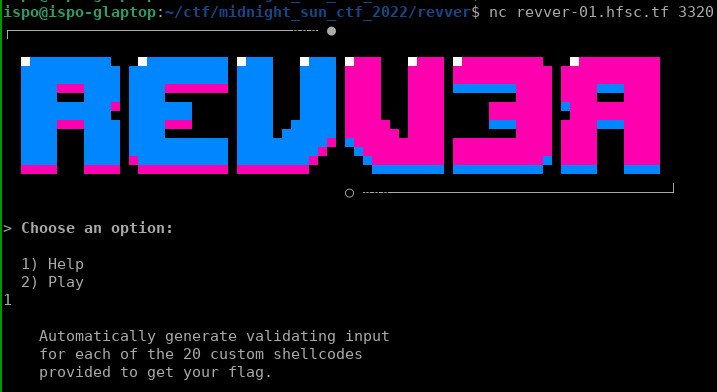
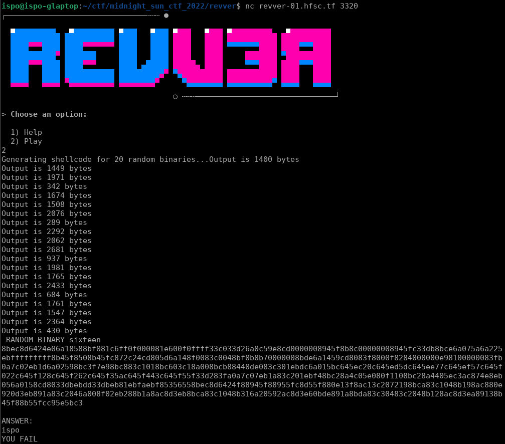

## Midnight Sun CTF 2022 - REVVER (Reversing 588)
##### 02/03 - 03/03/2022 (24hr)
___

### Description: 

```
nc revver-01.hfsc.tf 3320
```

Automated reversing is a solved problem, right.

___


### Solution

This was a pretty sad challenge (had too many problems).


First we connect to server to get the welcome message:



If we ask for a binary, we get something like this:



Server generates random shellcodes and we have to find the correct "answer" to them.
There are `20` different binaries. Each time, server randomizes the constant data
inside the shellcode, while keeping the same structure. That is, all binaries named
`seven` have the exact same structure, but their constant data are different.


The first challenge is to determine if the shellcode is x86 or x64. We pick a
random binary (`nine` in our case) and we check a random decompiled function:

As x64:
```c
__int64 __fastcall sub_4EF(__int64 a1)
{
  int v1; // eax
  unsigned int v2; // esp
  __int64 v3; // rbp
  unsigned int v4; // eax
  __int64 v6; // [rsp+0h] [rbp-14h] BYREF

  v3 = v2;
  *(_DWORD *)(v3 - 8) = v1;
  *(_DWORD *)(v2 - 12LL) = sub_C(a1, (*(_DWORD *)(v3 - 8) + 4099) & 0xFFFFF000, 0LL, 12);
  *(_DWORD *)(v2 - 4LL) = 192;
  v6 = *(unsigned int *)(v2 - 12LL);
  v4 = *(_DWORD *)(v2 - 4LL);
  _InterlockedExchange((volatile __int32 *)&v6, v3);
  __asm { int     80h; LINUX - }
  *(_DWORD *)v4 = *(_DWORD *)(v6 - 8);
  return v4 + 4;
}
```

And as x86:
```
// write access to const memory has been detected, the output may be wrong!
__int64 __usercall sub_4EF@<edx:eax>(int a1@<eax>)
{
  __int32 v2; // [esp+0h] [ebp-10h] BYREF
  int v3; // [esp+4h] [ebp-Ch]
  int v4; // [esp+8h] [ebp-8h]
  int v5; // [esp+Ch] [ebp-4h]
  __int128 savedregs; // [esp+10h] [ebp+0h] BYREF

  v4 = a1;
  v3 = sub_C(0, 0, 12);
  v5 = 192;
  v2 = v3;
  _InterlockedExchange(&v2, (__int32)&savedregs);
  __asm { int     80h; LINUX - }
  loc_C0 = *(_DWORD *)(v2 - 8);
  return 0x7000000C4LL;
}
```

Obviously, the x86 version makes much more sense, so we have to deal with x86 shellcodes.

The next step is to analyze each of the shellcodes. Some shellcodes are broken
(i.e., if we execute them they will crash as they depend on some registers whose values are unknown).
However, shellcodes are very simple, so we can reverse them just by looking at them.

Among the `20` different binaries, there are only `5` different types of shellcodes, with each one
appearing exactly `4` times, in intervals of `5`. Below we analyze each shellcode type.

### Type #1: Constant String in .rodata

**Binaries:** `five`, `ten`, `fiveteen`, `twenty`.

This is the simplest case. The answer is a just a random, constant string located at the
end of the shellcode:
```c
void __noreturn sub_0() {
  int v0; // ecx
  int v1; // ebx
  void *v2; // eax
  char v3[48]; // [esp+0h] [ebp-30h] BYREF

  v0 = sys_open("swag.key", 2, 0);
  if ( !v0 )
  {
    sub_5F9();
    sys_exit(-1);
  }
  sub_54A((int)v3, 45, v0);
  v1 = 0;
  v2 = (void *)sub_625(45);
  qmemcpy(v2, "61fEALbiiK9O5o1tFcUv9qwZ2Ai9JN41YHkrVfS2eW1H1", 0x2Du);
  if ( !u_strcmp((int)v2, (int)v3) )
    v1 = 1;
  sys_exit(v1);
}
```

The challenge here, is to locate that constant string in the shellcode. We know that all data
are located at the end of the shellcode, so we start processing the shellcode backwards,
until we hit the code. The last function in all binaries, always has the same epilogue:
```
    A)  seg000:0000037B C9    leave
        seg000:0000037C 5F    pop     edi
        seg000:0000037D 5E    pop     esi
        seg000:0000037E 5B    pop     ebx
        seg000:0000037F C3    retn

    B)  seg000:0000059C C9    leave
        seg000:0000059D C3    retn
```

Therefore, the first occurence of the sequence `C3 .* C9` (working backwards) indicates the end of
shellcode data. Strings are null terminated, so we split data on NULL bytes. Some binaries
contain more than one constant strings, such as:
```
flag.txt
/midnightsunctf-2022/quals/revver/answer3.bin
Error!\n
%s
```

We create a *blacklist* with all known strings appear in the binaries. After we drop all
blacklisted strings, there should be exactly one string left which is our answer, for example:
```
4bdTE1flxSsX1FGTO1H2hDGMtM0EbtgtAiFA97coYg6ZCMWJDbFHHrzoprOdcp0Q3I
```

### Type #2: Constant in mov instructions, XOR

**Binaries:** `one`, `six`, `eleven`, `sixteen`.

In this type, the answer is stored byte-by-byte into a sequence of `mov` instructions
and then is XORed with an 1-byte key:
```c
void __noreturn sub_0() {
  int v0; // edi
  int i; // esi
  int v2; // ebx
  int j; // edx
  char v4; // al
  char v5[12]; // [esp+0h] [ebp-18h]
  char v6[6]; // [esp+Ch] [ebp-Ch] BYREF
  char v7[4]; // [esp+12h] [ebp-6h] BYREF
  char addr[2]; // [esp+16h] [ebp-2h] BYREF

  v0 = sys_open("flag.txt", 2, 0);
  if ( !v0 )
  {
    sub_51C(v5[0]);
    sub_548(-1);
  }
  for ( i = 0; i < 10; ++i )
  {
    if ( sys_read(v0, addr, 1u) > 0 )
      v4 = addr[0];
    else
      v4 = -1;
    v5[i] = v4;
  }
  v2 = 1;
  qmemcpy(v6, "\"1In]", 5);
  v6[5] = 127;
  qmemcpy(v7, "Sk9|", sizeof(v7));
  for ( j = 0; j < 10; ++j )
  {
    if ( ((unsigned __int8)v5[j] ^ 0xC) != v6[j] )
      v2 = 0;
  }
  sub_548(v2);
}
```

If we take a look at the assembly we can see the pattern:
```assembly
seg000:00000049                 mov     [ebp+var_C], 22h ; '"'
seg000:0000004D                 mov     [ebp+var_B], 31h ; '1'
seg000:00000051                 mov     [ebp+var_A], 49h ; 'I'
seg000:00000055                 mov     [ebp+var_9], 6Eh ; 'n'
seg000:00000059                 mov     [ebp+var_8], 5Dh ; ']'
seg000:0000005D                 mov     [ebp+var_7], 7Fh
seg000:00000061                 mov     [ebp+var_6], 53h ; 'S'
seg000:00000065                 mov     [ebp+var_5], 6Bh ; 'k'
seg000:00000069                 mov     [ebp+var_4], 39h ; '9'
seg000:0000006D                 mov     [ebp+var_3], 7Ch ; '|'
seg000:00000071                 xor     edx, edx
seg000:00000073

...

seg000:00000085                 xor     cl, 0Ch
```

To extract these values, we use capstone to get a disassembly listing of the shellcode
and the we use regural expressions. Once we have all data we do the XOR.

### Type #3: Constant in mov instructions, SUB

**Binaries:** `four`, `nine`, `fourteen`, `nineteen`.

This case is similar to the previous one:
```c
int sub_5A0()
{
  char *v0; // esi
  signed int i; // ebx
  int v2; // edi
  signed int j; // ecx
  __int16 A[36]; // [esp+0h] [ebp-98h]
  __int16 B[36]; // [esp+48h] [ebp-50h]
  unsigned int v8; // [esp+94h] [ebp-4h]

  if ( !sub_4EE(0, 2) )
  {
    sub_504(A[0]);
    sub_595();
  }
  v0 = (char *)sub_530();
  memset(v0, 255, 0x48u);
  for ( i = 0; i < (int)strlen(v0); ++i )
    v0[i] = sub_4A0();
  v8 = strlen(v0);
  v2 = 1;
  A[0] = 0xC36D;
  A[1] = 0xCFD4;
  A[2] = 0xD539;
  A[3] = 0xDC5A;
  A[4] = 0xEA9C;
  A[5] = 0xFDC6;
  A[6] = 0xEEC5;
  A[7] = 0xDD2E;
  A[8] = 0xD6E2;
  A[9] = 0xE5F6;
  A[10] = 0xC7D8;
  A[11] = 0xF0AB;
  A[12] = 0xE6E7;
  A[13] = 0xC402;
  A[14] = 0xF1A2;
  A[15] = 0xD3A6;
  A[16] = 0xC175;
  A[17] = 0xC38F;
  A[18] = 0xF783;
  A[19] = 0xD90D;
  A[20] = 0xFDBA;
  A[21] = 0xE9DB;
  A[22] = 0xCC78;
  A[23] = 0xEB3E;
  A[24] = 0xC306;
  A[25] = 0xE44A;
  A[26] = 0xE101;
  A[27] = 0xC42A;
  A[28] = 0xFD9D;
  A[29] = 0xC980;
  A[30] = 0xC8A6;
  A[31] = 0xC2FA;
  A[32] = 0xC116;
  A[33] = 0xFADE;
  A[34] = 0xEC4F;
  A[35] = 0xE081;
  B[0] = 0x34C0;
  B[1] = 0x423D;
  B[2] = 0x25B3;
  B[3] = 0x29A5;
  B[4] = 0x4FFD;
  B[5] = 0x7540;
  B[6] = 0x563D;
  B[7] = 0x4FA6;
  B[8] = 0x2B39;
  B[9] = 0x3D38;
  B[10] = 0x1E52;
  B[11] = 0x48F7;
  B[12] = 0x534E;
  B[13] = 0x3278;
  B[14] = 0x6011;
  B[15] = 0x1908;
  B[16] = 0x8EC;
  B[17] = 0x2CFD;
  B[18] = 0x50FA;
  B[19] = 0x2981;
  B[20] = 0x6E05;
  B[21] = 0x531D;
  B[22] = 0x1EE5;
  B[23] = 0x2F94;
  B[24] = 0x2C4C;
  B[25] = 0x37A2;
  B[26] = 0x5475;
  B[27] = 0x898;
  B[28] = 0x49F4;
  B[29] = 0x42C6;
  B[30] = 0x4120;
  B[31] = 0x393E;
  B[32] = 0x3965;
  B[33] = 0x4C4F;
  B[34] = 0x65A4;
  B[35] = 0x39E5;
  for ( j = 0; j < (int)(v8 / 2); ++j )
  {
    if ( A[j] + v0[2 * j + 1] != B[j] )
      v2 = 0;
  }
  return v2;
}
```

If we look at the assembly, we can see that the constants are stored in `mov` instructions:
```assembly
seg000:00000639                 mov     [ebp+A], 0C36Dh
seg000:00000642                 mov     [ebp+var_96], 0CFD4h
seg000:0000064B                 mov     [ebp+var_94], 0D539h
seg000:00000654                 mov     [ebp+var_92], 0DC5Ah
seg000:0000065D                 mov     [ebp+var_90], 0EA9Ch
seg000:00000666                 mov     [ebp+var_8E], 0FDC6h
seg000:0000066F                 mov     [ebp+var_8C], 0EEC5h
seg000:00000678                 mov     [ebp+var_8A], 0DD2Eh
seg000:00000681                 mov     [ebp+var_88], 0D6E2h
seg000:0000068A                 mov     [ebp+var_86], 0E5F6h
seg000:00000693                 mov     [ebp+var_84], 0C7D8h
seg000:0000069C                 mov     [ebp+var_82], 0F0ABh
seg000:000006A5                 mov     [ebp+var_80], 0E6E7h
seg000:000006AB                 mov     [ebp+var_7E], 0C402h
seg000:000006B1                 mov     [ebp+var_7C], 0F1A2h
seg000:000006B7                 mov     [ebp+var_7A], 0D3A6h
seg000:000006BD                 mov     [ebp+var_78], 0C175h
seg000:000006C3                 mov     [ebp+var_76], 0C38Fh
seg000:000006C9                 mov     [ebp+var_74], 0F783h
seg000:000006CF                 mov     [ebp+var_72], 0D90Dh
seg000:000006D5                 mov     [ebp+var_70], 0FDBAh
seg000:000006DB                 mov     [ebp+var_6E], 0E9DBh
seg000:000006E1                 mov     [ebp+var_6C], 0CC78h
seg000:000006E7                 mov     [ebp+var_6A], 0EB3Eh
seg000:000006ED                 mov     [ebp+var_68], 0C306h
seg000:000006F3                 mov     [ebp+var_66], 0E44Ah
seg000:000006F9                 mov     [ebp+var_64], 0E101h
seg000:000006FF                 mov     [ebp+var_62], 0C42Ah
seg000:00000705                 mov     [ebp+var_60], 0FD9Dh
seg000:0000070B                 mov     [ebp+var_5E], 0C980h
seg000:00000711                 mov     [ebp+var_5C], 0C8A6h
seg000:00000717                 mov     [ebp+var_5A], 0C2FAh
seg000:0000071D                 mov     [ebp+var_58], 0C116h
seg000:00000723                 mov     [ebp+var_56], 0FADEh
seg000:00000729                 mov     [ebp+var_54], 0EC4Fh
seg000:0000072F                 mov     [ebp+var_52], 0E081h
seg000:00000735                 mov     [ebp+B], 34C0h
seg000:0000073B                 mov     [ebp+var_4E], 423Dh
seg000:00000741                 mov     [ebp+var_4C], 25B3h
seg000:00000747                 mov     [ebp+var_4A], 29A5h
seg000:0000074D                 mov     [ebp+var_48], 4FFDh
seg000:00000753                 mov     [ebp+var_46], 7540h
seg000:00000759                 mov     [ebp+var_44], 563Dh
seg000:0000075F                 mov     [ebp+var_42], 4FA6h
seg000:00000765                 mov     [ebp+var_40], 2B39h
seg000:0000076B                 mov     [ebp+var_3E], 3D38h
seg000:00000771                 mov     [ebp+var_3C], 1E52h
seg000:00000777                 mov     [ebp+var_3A], 48F7h
seg000:0000077D                 mov     [ebp+var_38], 534Eh
seg000:00000783                 mov     [ebp+var_36], 3278h
seg000:00000789                 mov     [ebp+var_34], 6011h
seg000:0000078F                 mov     [ebp+var_32], 1908h
seg000:00000795                 mov     [ebp+var_30], 8ECh
seg000:0000079B                 mov     [ebp+var_2E], 2CFDh
seg000:000007A1                 mov     [ebp+var_2C], 50FAh
seg000:000007A7                 mov     [ebp+var_2A], 2981h
seg000:000007AD                 mov     [ebp+var_28], 6E05h
seg000:000007B3                 mov     [ebp+var_26], 531Dh
seg000:000007B9                 mov     [ebp+var_24], 1EE5h
seg000:000007BF                 mov     [ebp+var_22], 2F94h
seg000:000007C5                 mov     [ebp+var_20], 2C4Ch
seg000:000007CB                 mov     [ebp+var_1E], 37A2h
seg000:000007D1                 mov     [ebp+var_1C], 5475h
seg000:000007D7                 mov     [ebp+var_1A], 898h
seg000:000007DD                 mov     [ebp+var_18], 49F4h
seg000:000007E3                 mov     [ebp+var_16], 42C6h
seg000:000007E9                 mov     [ebp+var_14], 4120h
seg000:000007EF                 mov     [ebp+var_12], 393Eh
seg000:000007F5                 mov     [ebp+var_10], 3965h
seg000:000007FB                 mov     [ebp+var_E], 4C4Fh
seg000:00000801                 mov     [ebp+var_C], 65A4h
seg000:00000807                 mov     [ebp+var_A], 39E5h
```

We first extract all constants using capstone + regular expressions. Then we know that the
first half belongs to array `A` and the next half to array `B`. We substract them and we
get the plaintext. For example:
```
1159 - CE15 = 4344
5792 - E720 = 7072
2CF4 - C29E = 6A56
68B6 - EF62 = 7954
41E0 - FB8A = 4656
305 - C1AC = 4159
363C - C1D1 = 746B
5A9B - E223 = 7878
6042 - EED3 = 716F
4DC6 - FF6F = 4E57
6288 - EF35 = 7353
A5B - C80C = 424F
604D - F20A = 6E43
6165 - FAF1 = 6674
3570 - DD1B = 5855
31EE - CE8C = 6362
35DD - E683 = 4F5A
4F2E - DFB5 = 6F79
2FC3 - D870 = 5753
2E24 - CCDC = 6148
24A4 - DE2B = 4679
31BC - CA79 = 6743
4960 - D3F0 = 7570
2934 - E3CA = 456A

Answer (in ASCII): CDprjVyTFVAYtkxxqoNWsSBOnCftXUcbOZoyWSaHFygCupEj
```

### Type #4: RC4 Decryption

**Binaries:** `three`, `eight`, `thirteen`, `eighteen`.

This type is a vanilla RC4 decryption:
```c
int sub_79D()
{
  int fd; // ebx
  void *v1; // edx
  int v2; // ebx
  int *target_hash; // edx
  char v5[260]; // [esp+0h] [ebp-108h] BYREF
  char *v6; // [esp+104h] [ebp-4h]

  fd = sys_open(0, 2, "/midnightsunctf-2022/quals/revver/answer3.bin");
  if ( !fd )
  {
    sub_701(v5[0]);                             // garbage
    sys_exit(-1);
  }
  v1 = sub_72D(28);
  memset(v1, 255, 0x1Cu);
  v6 = u_read_from_file(v1, strlen(v1), fd);
  u_do_rc4(v5, "isuGZEJzYCbVkzEaY", strlen("isuGZEJzYCbVkzEaY"));
  u_do_xor(strlen(v6), v6, v5);
  v2 = 0;
  target_hash = sub_72D(28);
  qmemcpy(target_hash, &dword_8AF, 0x1Cu);
  if ( !u_strcmp(v6, target_hash) )
    return 1;
  return v2;
}
```

The only challenge is to find the ciphertext and the key. Both of them are "data",
so they are stored at the end of the shellcode. The heuristic here, is that the key
is always ASCII-printable and the ciphertext is not. After dropping all blacklisted
strings, we should be left with one printable and one nonprintable string. For example:
```
RC4 decryption key: FabBlhzcdYBRZuARz
RC4 ciphertext: '|çe[z¦Ýf\x94ÍZG8¼ä¡¡ý©ºÏ\x9c'
RC4 plaintext: lNjsMMkIxEzjfWwUQYZbNg
```

However, there is one caveat here: A ciphertext may contain a NULL byte. In that case,
our script will mistakenly split it into two (or more) ciphertexts. In that case, we
simply merge all nonprintable strings into one and we do the decryption.

### Type #5: CRC32 Crack

**Binaries:** `two`, `seven`, `twelve`, `seventeen`.

This is the final and the most difficult case:
```c
_BOOL4 sub_D4()
{
  char v1[104]; // [esp+0h] [ebp-6Ch] BYREF
  char *v2; // [esp+68h] [ebp-4h] BYREF

  memset(&v1[100], 0, 0x64u);
  v2 = v1;
  sys_getcwd((char *)&v2, 0x15u);
  return sub_E((int)v1, 0x15u) == 0x7E195C06;
}

int __usercall sub_E@<eax>(int a1@<eax>, unsigned int a2@<edx>)
{
  unsigned int i; // esi
  unsigned int v4; // edi
  int j; // ecx
  unsigned int v6; // esi
  unsigned int k; // eax
  int v9[256]; // [esp+0h] [ebp-404h]
  int v10; // [esp+400h] [ebp-4h]

  v10 = 0xEDB88320;
  for ( i = 0; i < 0x100; ++i )
  {
    v4 = i;
    for ( j = 8; j; --j )
    {
      if ( (v4 & 1) != 0 )
        v4 = v10 ^ (v4 >> 1);
      else
        v4 >>= 1;
    }
    v9[i] = v4;
  }
  v6 = -1;
  for ( k = 0; k < a2; ++k )
    v6 = v9[(unsigned __int8)(*(_BYTE *)(k + a1) ^ v6)] ^ (v6 >> 8);
  return ~v6;
}
```

Here, we have to give a string of specific input (here `0x15` bytes) whose CRC32 checksum
is equal to a constant value (here `0x7E195C06`). Cracking CRC32 is not hard and be done
either using a z3 solver, or the 
[old school](https://stackoverflow.com/questions/9285898/reversing-crc32/13394385#13394385)
way (we use the second).

To extract the target CRC32 and the input size, we use capstone + regular expressions as
before (we look for a constant in a `mov` followed by a `push`):
```
seg000:000000FF                 xor     ebx, ebx
seg000:00000101                 mov     esi, 14F123CEh
seg000:00000106                 lea     eax, [ebp+var_6C]
seg000:00000109                 push    16h
seg000:0000010B                 pop     edx
seg000:0000010C                 call    sub_E
```

However, if our answer contains non ASCII characters, server throws a unicode related exception:
```
Traceback (most recent call last):
  File "./challenge.py", line 245, in <module>
    main()
  File "./challenge.py", line 241, in main
    play()
  File "./challenge.py", line 206, in play
    if len(xxx) == value[1] and value[0] == (zlib.crc32(bytes(xxx,'utf-8')) & 0xffffffff):
UnicodeEncodeError: 'utf-8' codec can't encode character '\udca6' in position 21: surrogates not allowed
```

The best way to deal with this problem is to simply not generate answers with non ASCII characters.
We keep generating random solutions until we find a good one. For example:
```
[+] Target CRC32: 14F123CEh
[+] Input size: 22
[+] Generating random string: YCFV8AQWRIXSX5M8WG
[+] Current CRC32: 56DFC86A
[+] CRC32 successfully cracked: BF-65-D0-90
[+] Generating random string: FNZM26F43QGD2DFQ54
[+] Current CRC32: AEEAA64C
[+] CRC32 successfully cracked: 99-0B-E5-68
[+] Generating random string: D0ZZ6NTVI4MVZLAH47
[+] Current CRC32: 0CF651C9
[+] CRC32 successfully cracked: 1C-FC-F9-CA
[+] Generating random string: FDXG63F1FG5VUASCDO
[+] Current CRC32: 8CB45F25
[+] CRC32 successfully cracked: F0-F2-BB-4A
[+] Generating random string: CZFD180TZFWJQYWAZ4
[+] Current CRC32: CD3B9836
[+] CRC32 successfully cracked: E3-35-34-0B
[+] Generating random string: 7KXCLQ7B4B9PAXOINR
[+] Current CRC32: 9FFAB8DB
[+] CRC32 successfully cracked: 0E-15-F5-59
[+] Generating random string: 36GKT87FATZ3JYSDV1
[+] Current CRC32: 11D8984A
[+] CRC32 successfully cracked: 9F-35-D7-D7
[+] Generating random string: Q3C1YOFT2QD593R4QQ
[+] Current CRC32: 668103E0
[+] CRC32 successfully cracked: 35-AE-8E-A0
[+] Generating random string: C4X2CXMZUPN77LMMN3
[+] Current CRC32: C0DBF42E
[+] CRC32 successfully cracked: FB-59-D4-06
[+] Generating random string: 4ZQHH4C3L5QXN105JR
[+] Current CRC32: DA869343
[+] CRC32 successfully cracked: 96-3E-89-1C
[+] Generating random string: H1VGKG1RFDBK93L5G0
[+] Current CRC32: 4D999D3F
[+] CRC32 successfully cracked: EA-30-96-8B
[+] Generating random string: K80OKPJZOZT4EE34Q0
[+] Current CRC32: 590815E1
[+] CRC32 successfully cracked: 34-B8-07-9F
[+] Generating random string: VW386YKRMEYBZD3F5X
[+] Current CRC32: C7C82805
[+] CRC32 successfully cracked: D0-85-C7-01
[+] Generating random string: Q114WQ7FRH8DCLQE69
[+] Current CRC32: 8AFFBB8D
[+] CRC32 successfully cracked: 58-16-F0-4C
[+] Generating random string: B4XASG4KX0F0BPF1XI
[+] Current CRC32: 7C74EFE9
[+] CRC32 successfully cracked: 3C-42-7B-BA
[+] Generating random string: P37PBMQCO84RDW0DIQ
[+] Current CRC32: 4227695A
[+] CRC32 successfully cracked: 8F-C4-28-84
[+] Generating random string: JIAKDA6H9C2TIO2UC6
[+] Current CRC32: 7DAFB46F
[+] CRC32 successfully cracked: BA-19-A0-BB
[+] Generating random string: Y2VHJ60XQWX7LIM5IV
[+] Current CRC32: F4F22640
[+] CRC32 successfully cracked: 95-8B-FD-32
[+] Generating random string: 95FS97SMUSRQ7ITBRL
[+] Current CRC32: E050315D
[+] CRC32 successfully cracked: 88-9C-5F-26
[+] Generating random string: KS0ZFCFZXM9GS5CAT0
[+] Current CRC32: A02DB521
[+] CRC32 successfully cracked: F4-18-22-66
[+] Generating random string: X7N0FYCM1EFMESWROT
[+] Current CRC32: 8923DEF8
[+] CRC32 successfully cracked: 2D-73-2C-4F
[+] Collison found: 'X7N0FYCM1EFMESWROT-s,O'
[+] Verifying CRC32: 14F123CE
[+] Shellcode answer (16h bytes): 'X7N0FYCM1EFMESWROT-s,O'
```

`NOTE:` The binary `seven` seems to use only the input bytes that are multiples of **4**:
```c
_BOOL4 __usercall sub_535@<eax>(int a1@<eax>, char *a2@<edx>)
{
  int i; // ebx
  char v4[104]; // [esp+0h] [ebp-68h] BYREF

  if ( a1 < 17 )
  {
    sub_4FE(v4[0]);
    sub_52A();
  }
  memset(&v4[100], 0, 0x64u);
  for ( i = 0; i < 100; ++i )
  {
    v4[i] = **(_BYTE **)&a2[4 * i + 4];
    if ( !v4[i] )
      break;
  }
  return u_do_crc32() == 0x177FDC5D;
}
```

However, if we generate valid answers such as `....a...b...c...d...e`, they are not
accepted by the server. It turns out that we should send the same asnwers as the other binaries.

### Putting all together

Finally, we put all types of binaries together in [revver_crack.py](./revver_crack.py) script
and we get the flag.


The flag is: `midnight{Reversing_got_alot_easier_with_backup_cameras}`.

___

