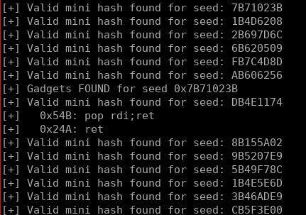
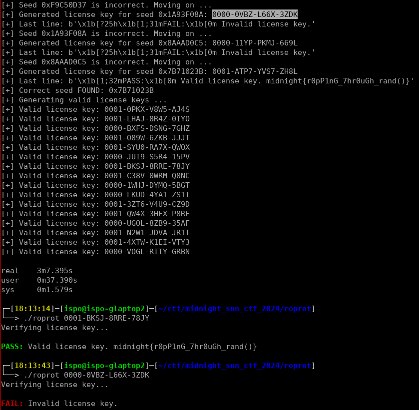

## Midnight Sun CTF 2024 - roprot (Reversing 417)
##### 20/04 - 21/04/2024 (24hr)
___

### Description

*Unlocking this binary's secrets is the key to your success. Can you find the right combination?*

___

### Solution

In this challenge, we are given 2 binaries: `tool` and `roprot`. The goal is to enter a valid
license key in the `roprot` binary and get the flag.

#### Reversing the tool binary

Let's start with the `tool` binary which is simple:
```c
int __fastcall main(int argc, char **argv, char **argp) {
  /* ... */
  for ( seed = 0; ; seed = atoi(optarg) ) {
    opt_chr = getopt(argc, argv, "s:");
    if ( opt_chr == -1 )
      break;
    if ( opt_chr != 's' )
      goto ERROR;
  }
  if ( argc - optind != 2 ) {
ERROR:
    fprintf(stderr, "Usage: %s [-s seed] <command> <hex_bytes>\n", *argv);
    return 1;
  }
  command = argv[optind];                       // next element = command
  hex_bytes = argv[optind + 1];
  rand_buf = (unsigned __int8 *)u_create_rand_mem(seed);
  if ( !rand_buf )
    return 1;
  hex_bytes_len = (strlen(hex_bytes) + 1) / 3;
  hex_ptr = malloc(hex_bytes_len);
  for ( i = 0; i < hex_bytes_len; ++i )
    __isoc99_sscanf(&hex_bytes[3 * i], "%02hhx", &hex_ptr[i]);
  // 1st command: xor
  if ( !strcmp(command, "xor") ) {
    for ( j = 0x20000000 - hex_bytes_len; (j & 0x80000000) == 0; --j ) {
      for ( k = j - 1; (k & 0x80000000) == 0; --k ) {
        mismatch = 1;
        for ( key_idx = 0; key_idx < hex_bytes_len; ++key_idx ) {
          if ( (rand_buf[k + key_idx] ^ rand_buf[j + key_idx]) != hex_ptr[key_idx] ) {
            mismatch = 0;
            break;
          }
        }
        if ( mismatch ) {
          puts("Match:");
          printf("    ");
          for ( m = 0; m < hex_bytes_len; ++m )
            printf("%02x ", rand_buf[j + m]);
          printf("@ offset 0x%08x\n", j);
          printf("    ");
          for ( n = 0; n < hex_bytes_len; ++n )
            printf("%02x ", rand_buf[k + n]);
          printf("@ offset 0x%08x == '%s'\n", k, hex_bytes);
        }
      }
    }
  } else {
    // 2nd command: find
    if ( strcmp(command, "find") ) {
      fprintf(stderr, "Invalid command: %s\n", command);
      return 1;
    }
    for ( ii = 0; (int)ii <= 0x2000000 - hex_bytes_len; ++ii ) {
      found = 1;
      for ( jj = 0; jj < hex_bytes_len; ++jj ) {
        if ( rand_buf[ii + jj] != hex_ptr[jj] ) {
          found = 0;
          break;
        }
      }
      if ( found )
        printf("0x%08x: '%s'\n", ii, hex_bytes);
    }
  }
  munmap(rand_buf, 0x20000000uLL);
  free(hex_ptr);
  return 0;
}
```

Function `u_create_rand_mem` creates a huge buffer (of size **0x2000000**) and fills it in with
random data:
```c
int *__fastcall u_create_rand_mem(unsigned int seed) {
  /* ... */
  addr = (int *)mmap(0LL, 0x2000000uLL, 2, 0x22, -1, 0LL);// PROT_WRITE, MAP_ANONYMOUS|MAP_PRIVATE
  addr_ = addr;
  if ( addr == (int *)-1LL ) {
    perror("mmap");
    return 0LL;
  } else {
    srand(seed);
    for ( i = 0; i <= 61695; ++i ) {
      ptr = addr_++;
      *ptr = rand();
    }
    mprotect(addr, 0x2000000uLL, 1);            // PROT_READ
    return addr;
  }
}
```

`tool` binary takes **2** commands: `find` and `xor`. The `find` command searches in the random
buffer for a given pattern. The `xor` command searches in the random buffer to find two locations
where their XOR results the given pattern. For example:
```
┌─[17:10:46]─[ispo@ispo-glaptop2]─[~/ctf/midnight_sun_ctf_2024/roprot]
└──> ./tool -s 31337 find 11-22-33-44
0x0754fa0c: '11-22-33-44'

┌─[17:31:08]─[ispo@ispo-glaptop2]─[~/ctf/midnight_sun_ctf_2024/roprot]
└──> ./tool -s 31337 xor 11-22-33-44
Match:
    da e6 15 47 @ offset 0x1ffffff5
    cb c4 26 03 @ offset 0x13956468 == '11-22-33-44'
Match:
    60 f8 95 15 @ offset 0x1fffffe3
    71 da a6 51 @ offset 0x090e02c8 == '11-22-33-44'
Match:
    3d 04 60 f8 @ offset 0x1fffffe1
    2c 26 53 bc @ offset 0x00eb20a5 == '11-22-33-44'
[.....]
```

This binary is a helper tool. It is used to find ROP gadgets in the random buffer.

#### Reversing the roprot binary

Let's now move to the `roprot` binary:
```c
int __fastcall main(int argc, char **argv, char **argp) {
  /* ... */
  u_init();
  if ( argc != 2 )
    goto INVALID_LIC_KEY;
  buf = 0LL;
  buf_2 = 0LL;
  if ( (unsigned int)u_verify_license_key(argv[1]) == -1 )
    goto INVALID_LIC_KEY;
  addr = mmap(0LL, 0x20000000uLL, 2, 34, -1, 0LL);// PROT_WRITE, MAP_ANONYMOUS|MAP_PRIVATE
  addr_ = (int *)addr;
  if ( addr == (void *)-1LL )
    goto INVALID_LIC_KEY;
  for ( i = 0; i <= 0x7FFFFFF; ++i )            // same as u_create_rand_mem in "tool" binary
  {
    ptr = addr_++;
    *ptr = rand();
  }
  mprotect(addr, 0x20000000uLL, 5);             // make R+X
  if ( getrandom(&buf, 8uLL, 1u) != 8           // 1 = GRND_NONBLOCK
    || (buf = (void *)((unsigned __int64)buf & 0x7FFFFFFFF000LL),
        buf_2 = mmap(buf, 0x1000uLL, 3, 0x132, -1, 0LL),// MAP_ANONYMOUS|MAP_FIXED|MAP_PRIVATE
        buf_2 == (_QWORD *)-1LL) ) {
INVALID_LIC_KEY:
    u_abort("\x1B[1;31mFAIL:\x1B[0m Invalid license key.");
  }
  u_build_rop_chain_noreturn(buf_2, (__int64)addr);
  return 0;
}
```

The `u_init` function registers some handlers to display the `FAIL: Invalid license key.` message
when various signals (e.g., segmentation fault, illegal instruction) are raised:
```c
void __fastcall u_init() {
  setvbuf(stdin, 0LL, 2, 0LL);
  setvbuf(stdout, 0LL, 2, 0LL);
  signal(2, (__sighandler_t)handler);           // SIGINT
  signal(11, (__sighandler_t)handler);          // SIGSEGV
  signal(4, (__sighandler_t)handler);           // SIGILL
  signal(8, (__sighandler_t)handler);           // SIGFPE
  signal(6, (__sighandler_t)handler);           // SIGABRT
  signal(5, (__sighandler_t)handler);           // ?
  alarm(0x3Cu);
  u_display_matrix_message();
}
```

Function `u_display_matrix_message` constantly displays random characters until the message 
`Verifying license key` is revealed. More specifically, it contains a star buffer
`*********************`. Every once in a while, it randomly chooses an index and reveal a character
from the `Verifying license key` string. This character is written to the star buffer.
If a character from the star buffer is not `*` then the character in this location is printed
to stdout. Otherwise a random character is printed. Eventually, there are no `*` characters in the
star buffer, so all characters are revealed and function returns:
```c
void __fastcall u_display_matrix_message() {
  /* ... */
  strcpy(matrix_msg, "*********************");
  *(_WORD *)&matrix_msg[22] = 0;
  v11 = 0LL;
  strcpy(s, "Verifying license key");
  *(_WORD *)&s[22] = 0;
  v13 = 0LL;
  rnd_buf = (char *)malloc(0x100uLL);
  if ( !rnd_buf )
    _exit(1);
  printf("\x1B[?25l");
  for ( i = 0; i <= 4095; ++i ) {
    memset(rnd_buf, 0, 0x100uLL);
    for ( j = 0; j <= 20; ++j ) {
      if ( matrix_msg[j] == '*' ) {
        rnd_chr = (&glo_char_ptr_map)[rand() % 218];
        strcat(rnd_buf, rnd_chr);
      } else {
        rnd_buf[strlen(rnd_buf)] = matrix_msg[j];
      }
    }
    v1 = strlen(rnd_buf);
    printf("%s\x1B[%ldD", rnd_buf, v1);
    usleep(10000u);
    v3 = 0;
    for ( k = matrix_msg; *k; ++k )
      v3 += *k == '*';
    if ( !v3 ) {
      printf("%s", s);
      for ( m = 0; m <= 2; ++m ) {
        usleep(350000u);
        putchar('.');
      }
      usleep(350000u);
      puts("\n\x1B[?25h");
      return;
    }
    if ( i > 128 && (i & 3) == 0 ) {
      v2 = rand();
      star_cnt = v2 % strlen(s);
      matrix_msg[star_cnt] = s[star_cnt];       // add a correct character from target message
    }
  }
}
```

Let's move on to the interesting part:
```c
__int64 __fastcall u_verify_license_key(const char *lic_key) {
  /* ... */
  if ( strlen(lic_key) != 19 )                  // license key size: 19 bytes
    return 0xFFFFFFFFLL;
  chksum = 0LL;
  for ( i = 0; i <= 18; ++i ) {
    // License Key format: XXXX-YYYY-ZZZZ-WWWW
    if ( i <= 0 || (i + 1) % 5 ) {
      // enum
      // {
      //   _ISupper = _ISbit (0),        /* UPPERCASE.  */
      //   _ISlower = _ISbit (1),        /* lowercase.  */
      //   _ISalpha = _ISbit (2),        /* Alphabetic.  */
      //   _ISdigit = _ISbit (3),        /* Numeric.  */
      //   _ISxdigit = _ISbit (4),       /* Hexadecimal numeric.  */
      //   _ISspace = _ISbit (5),        /* Whitespace.  */
      //   _ISprint = _ISbit (6),        /* Printing.  */
      //   _ISgraph = _ISbit (7),        /* Graphical.  */
      //   _ISblank = _ISbit (8),        /* Blank (usually SPC and TAB).  */
      //   _IScntrl = _ISbit (9),        /* Control character.  */
      //   _ISpunct = _ISbit (10),       /* Punctuation.  */
      //   _ISalnum = _ISbit (11)        /* Alphanumeric.  */
      // };
      if ( ((*__ctype_b_loc())[lic_key[i]] & 8) == 0 )// is not alphanumeric
        return 0xFFFFFFFFLL;
      // reject lowercase.
      if ( ((*__ctype_b_loc())[lic_key[i]] & 0x400) != 0 && ((*__ctype_b_loc())[lic_key[i]] & 0x100) == 0 ) // is lowercase
        return 0xFFFFFFFFLL;
      if ( ((*__ctype_b_loc())[lic_key[i]] & 0x800) != 0 ) // is numeric
        val = lic_key[i] - '0';                 // 0-9 ~> make int
      else
        val = lic_key[i] - '7';                 // A-Z ~> make hex int
      chksum = 36 * chksum + val;
    } else if ( lic_key[i] != '-' ) {           // we need a dash every 5 chars
      return 0xFFFFFFFFLL;
    }
  }
  seed_xor = HIDWORD(chksum) ^ (unsigned int)chksum;
  hash = u_minihash_chksum(seed_xor);
  if ( hash != (unsigned __int16)u_minihash_chksum(0xBAC9AB0C) )
    return 0xFFFFFFFFLL;
  srand(seed_xor);
  return 0LL;
}
```

This function takes as input a license key and checks whether it is valid. First of all, it checks
if it is in the format `XXXX-YYYY-ZZZZ-WWWW` (**19** characters, **4** groups separated with
dashes `-`). Then it computes a special checksum in **base 36**. That is the valid characters are
`0-9A-Z` (`A` maps to 11, `Z` to 35 and so on). At the end, the top **32-bits** are XORed with the
low **32-bits** and the result is passed to the `u_minihash_chksum`:
```c
__int16 __fastcall u_minihash_chksum(int num) {
  /* ... */
  num_ = num;
  chksum = 0xFFFF;
  c_1021 = 0x1021;
  p_num = (unsigned __int8 *)&num_;
  for ( i = 0LL; i <= 3; ++i ) {
    chksum ^= p_num[i] << 8;
    // looks like Galois Fields
    for ( j = 0; j <= 7; ++j ) {
      if ( chksum >= 0 )
        chksum *= 2;
      else
        chksum = (2 * chksum) ^ c_1021;
    }
  }
  return chksum;
}
```

This looks like a multiplication using Galois Fields, but it's not important right now. The takeaway
is that this function generates a **16-bit** mini-hash from the **32-bit** checksum. If the final
mini-hash is equal to the mini-hash of `0xBAC9AB0C`, which is `0x2cc2`) then the license key is
valid.

If the license key is valid, the **32-bit** checksum is used as a random seed: `srand(seed_xor)`.
Moving back to `main()`, function generates a huge random buffer using that seed, just like the
`tool` binary. Then it calls `u_build_rop_chain_noreturn` and ROPs:
```c
void __fastcall u_build_rop_chain_noreturn(_QWORD *a1_out, char *a2_in) {
  unsigned int i; // [rsp+10h] [rbp-18h]

  for ( i = 0; i < 295; ++i )
    a1_out[i] = &a2_in[glo_rop_offsets[i]];
}
```

Global `glo_rop_offsets` contains the ROP chain.
```assembly
.data:0000555555559020 ; unsigned int glo_rop_offsets[296]
.data:0000555555559020 glo_rop_offsets dd 54Bh, 1016F5C4h, 25990D7h, 0E834D4Fh, 1F95825Ch, 1FFDE5CDh
.data:0000555555559020                                         ; DATA XREF: u_build_rop_chain_noreturn+37↑o
.data:0000555555559038         dd 1377E78Ah, 662D9F7h, 0FB48668h, 1FEB9364h, 1497F292h, 0A93A6BAh
.data:0000555555559050         dd 14ADB22Bh, 192902C2h, 10F51A18h, 5BB42FBh, 19F2AB2Bh, 53B09F8h
.data:0000555555559068         dd 14ADB22Bh, 4 dup(11FBAB82h), 1FBF5CDFh, 10DA21D8h, 25990D7h
.data:0000555555559088         dd 0E834D4Fh, 1F95825Ch, 1F5A19A5h, 1377E78Ah, 662D9F7h, 14ADB22Bh
.data:00005555555590A0         dd 53B09F8h, 14ADB22Bh, 4 dup(11FBAB82h), 1FBF5CDFh, 1FF81BF5h
.data:00005555555590C0         dd 25990D7h, 0E834D4Fh, 1F95825Ch, 1A59E0EDh, 1377E78Ah, 662D9F7h
.data:00005555555590D8         dd 14ADB22Bh, 53B09F8h, 14ADB22Bh, 4 dup(11FBAB82h), 1FBF5CDFh
.data:00005555555590F8         dd 1FED946Fh, 25990D7h, 0E834D4Fh, 1F95825Ch, 0B527D17h, 1377E78Ah
.data:0000555555559110         dd 662D9F7h, 14ADB22Bh, 53B09F8h, 14ADB22Bh, 4 dup(11FBAB82h)
.data:0000555555559130         dd 1FBF5CDFh, 9E15DF0h, 25990D7h, 0E834D4Fh, 1F95825Ch, 1B8C0063h
.data:0000555555559148         dd 1377E78Ah, 662D9F7h, 14ADB22Bh, 53B09F8h, 14ADB22Bh, 4 dup(11FBAB82h)
.data:000055555555916C         dd 1FBF5CDFh, 1FF0F345h, 25990D7h, 0E834D4Fh, 1F95825Ch, 1FE8B2DFh
.data:0000555555559184         dd 1377E78Ah, 662D9F7h, 14ADB22Bh, 53B09F8h, 14ADB22Bh, 4 dup(11FBAB82h)
.data:00005555555591A8         dd 1FBF5CDFh, 1EF8EF7Fh, 25990D7h, 0E834D4Fh, 1F95825Ch, 144D2925h
.data:00005555555591C0         dd 1377E78Ah, 662D9F7h, 14ADB22Bh, 53B09F8h, 14ADB22Bh, 4 dup(11FBAB82h)
.data:00005555555591E4         dd 1FBF5CDFh, 1FBC4570h, 25990D7h, 0E834D4Fh, 1F95825Ch, 1F884A2Dh
.data:00005555555591FC         dd 1377E78Ah, 662D9F7h, 14ADB22Bh, 53B09F8h, 14ADB22Bh, 4 dup(11FBAB82h)
.data:0000555555559220         dd 1FBF5CDFh, 0F58515Fh, 25990D7h, 0E834D4Fh, 1F95825Ch, 1EF25B7Ch
.data:0000555555559238         dd 1377E78Ah, 662D9F7h, 14ADB22Bh, 53B09F8h, 14ADB22Bh, 4 dup(11FBAB82h)
.data:000055555555925C         dd 1FBF5CDFh, 0D0856B3h, 25990D7h, 0E834D4Fh, 1F95825Ch, 1EF98881h
.data:0000555555559274         dd 1377E78Ah, 662D9F7h, 14ADB22Bh, 53B09F8h, 14ADB22Bh, 4 dup(11FBAB82h)
.data:0000555555559298         dd 1FBF5CDFh, 1EA09AC9h, 25990D7h, 0E834D4Fh, 1F95825Ch, 19CEA5DFh
.data:00005555555592B0         dd 1377E78Ah, 662D9F7h, 14ADB22Bh, 53B09F8h, 14ADB22Bh, 4 dup(11FBAB82h)
.data:00005555555592D4         dd 1FBF5CDFh, 3324AE7h, 25990D7h, 0E834D4Fh, 1F95825Ch, 1EF1D2E3h
.data:00005555555592EC         dd 1377E78Ah, 662D9F7h, 14ADB22Bh, 53B09F8h, 14ADB22Bh, 4 dup(11FBAB82h)
.data:0000555555559310         dd 1FBF5CDFh, 16B485FBh, 25990D7h, 0E834D4Fh, 1F95825Ch, 0A96D3F9h
.data:0000555555559328         dd 1377E78Ah, 662D9F7h, 14ADB22Bh, 53B09F8h, 14ADB22Bh, 4 dup(11FBAB82h)
.data:000055555555934C         dd 1FBF5CDFh, 154D117Bh, 25990D7h, 0E834D4Fh, 1F95825Ch, 1EFE0777h
.data:0000555555559364         dd 1377E78Ah, 662D9F7h, 14ADB22Bh, 53B09F8h, 14ADB22Bh, 4 dup(11FBAB82h)
.data:0000555555559388         dd 1FBF5CDFh, 9DB3EFDh, 25990D7h, 0E834D4Fh, 1F95825Ch, 1E813A09h
.data:00005555555593A0         dd 1377E78Ah, 662D9F7h, 14ADB22Bh, 53B09F8h, 14ADB22Bh, 4 dup(11FBAB82h)
.data:00005555555593C4         dd 1FBF5CDFh, 1F9FCFB6h, 25990D7h, 0E834D4Fh, 1F95825Ch, 14DD3F4Ah
.data:00005555555593DC         dd 1377E78Ah, 662D9F7h, 14ADB22Bh, 53B09F8h, 14ADB22Bh, 4 dup(11FBAB82h)
.data:0000555555559400         dd 1FBF5CDFh, 1E4C9219h, 25990D7h, 0E834D4Fh, 1F95825Ch, 1C206E44h
.data:0000555555559418         dd 1377E78Ah, 662D9F7h, 14ADB22Bh, 53B09F8h, 14ADB22Bh, 4 dup(11FBAB82h)
.data:000055555555943C         dd 1FBF5CDFh, 16973E01h, 25990D7h, 0E834D4Fh, 1F95825Ch, 1F7F034Eh
.data:0000555555559454         dd 1377E78Ah, 662D9F7h, 14ADB22Bh, 53B09F8h, 25990D7h, 49B5228h
.data:000055555555946C         dd 1565070Eh, 1F95825Ch, 1C719B06h, 2C6094h, 1133C3DDh, 0D343B2Ah
.data:0000555555559484         dd 0B3596Fh, 1F95825Ch, 1BFAD75Ah, 1DEEB516h, 4B83147h, 4BE2FC4h
.data:000055555555949C         dd 1C656534h, 0D343B2Ah, 6 dup(24Ah), 0
.data:00005555555594C0 glo_char_ptr_map dq offset asc_555555557051
```

### Bruteforcing the Correct Seed

Obviously there are many license keys that make `u_verify_license_key` succeed, but they return
a badboy message. The reason is that they generate a checksum which generates a random buffer
with invalid ROP gadgets.

Since the random seed is **32-bits** we can brute force it. First we find all values whose
mini-hash is `0x2cc2` and then we check if they contain "valid" gadgets. We can use the `tool`
binary for this, however it is too slow because it generates a huge random buffer.

We can optimize this. We see in `glo_rop_offsets` that we have 2 ROP gadgets at the small addresses
`54Bh` and `24Ah`. Therefore, we do not have to generate the whole random buffer. We can only
generate the first `0x570` random bytes and check if addresses `54Bh` and `24Ah` contain valid
ROP gadgets. 

The first attempt was to check for the opcdes `F3-0F-1E-FA` (`endbr64`) and
`55-48-89-EC` (`push rbp; mov rsp, rbp`). However, nothing was found.

The second attempt was to use capstone and check if the `54Bh` and `24Ah` dissassemble to valid
instructions that end with `ret`. This takes some time, but by using multi-threading
(**16** threads), we can get all random seeds that produce valid ROP gadgets. After running the
script for a few hours, we find **32** valid seeds:
```
538183840, 1345518218, 2973588323, 2438371556,
562022454, 2984624310, 1125593590, 1395313444,
3819725501, 2760119933, 1685967536, 1956841705,
2494143538, 899781690, 3877712327, 2008972776,
933641209, 1475285266, 411045332, 4190440759,
445902986, 2326450373, 2071003707, 2333784035,
194363547, 1004420728, 1821095982, 3435999293,
1562580955, 1301982477, 1304361379, 3461275642
```

However, not all of these seeds are correct, because we haven't checked if all addresses in the ROP
chain contain valid ROP gadgets (we only checked the first two). For example:
```
[+] Valid mini hash found for seed: 3E213AAE
[+] Gadgets FOUND for seed 0xCE4EDFFA
[+]   0x54B: movabs al, byte ptr [0x91487b6bc50eafc9];ret
[+]   0x24A: cwdeadc dh, dl;add edx, ecx;ret
```

Therefore, we have to try all of them, one by one, to find the correct one (which is shown below):




For more details, please refer to the [roprot_seed_crack.py](./roprot_seed_crack.py) script.

### Generating valid License Keys

To generate a valid license key, we start from a correct seed. Then we get a random number and we
XOR these two numbers to compute a valid **64-bit** checksum. Then we take each digit (remember
we are in **base 36**) and we prepend it to the license key (we work backwards):
```python
def license_keygen(correct_seed, debug=True):
    """Generates a valid license key from a "correct" seed."""
    if debug:
        print(f'[+] Generating a valid license key for seed: 0x{correct_seed:08X}')

    rand = random.randint(0, 0x7FFFFFFF)
    xor = correct_seed ^ rand
    chksum = (rand << 32) | xor

    if debug:
        print(f'[+] Choosing a random number: {rand:08X}')
        print(f'[+] Reconstructing 64-bit checksum: 0x{chksum:016X}')

    # Run hash_license_key() in reverse.
    lic_key = ''

    for i in range(19):
        if i > 0 and (i+1) % 5 == 0:
            lic_key = '-' + lic_key
            continue
 
        c = chksum % 36
        chksum //= 36

        if c >= 0 and c <= 9:
            lic_key = chr(0x30 + c) + lic_key
        else:
            lic_key = chr(0x41 + c - 10) + lic_key
        
    if debug:
        print(f'[+] License Key: {lic_key}')

    return lic_key

```

Once we have a valid license key, we can test it to the `roprot` binary to see if it is correct.
We can automate this. After a few minutes we find that the correct seed is `0x7B71023B`. Then we 
can generate a bunch of valid license keys which make the binary print the flag (the ROP chain
simply XORs a part from the random buffer to reveal the flag, just like the `xor` command of the
`tool` binary):
```
0000-V61R-UX7F-ZBH9
0000-18HF-TMDH-WJKS
0001-C475-GC0C-AUWX
0001-ICLF-591Z-EHH5
0001-JHG9-GWVX-2LEI
0000-04K4-2CHW-GRU1
0001-WGEP-8DVH-X1S0
0001-999H-MKKX-J5YY
0000-FDQG-6997-OEUO
0000-FS3K-JULA-M8B7
0000-MA16-OEI8-1YZH
0000-FEYP-DWLH-EBQ1
0001-3BP2-AQIW-8KT7
0001-44VO-D72I-7YXO
0000-ZXHR-XE1U-I57P
0001-K30L-KRN0-QX6W
```

For more details, please refer to the [roprot_keygen.py](./roprot_keygen.py) script.

We test the keys to see if they work:



So, the flag is: `midnight{r0pP1nG_7hr0uGh_rand()}`.
___

