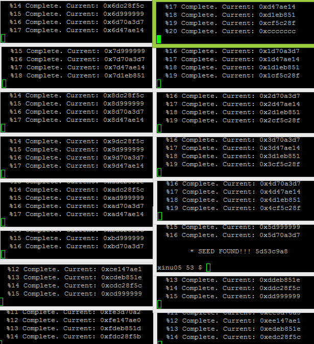

## Tokey Westerns/MMA CTF 2nd 2016 - Cello Rule (RE 250pt)
##### 03/09 - 05/09/2016 (48hr)
___

### Description: 
	cello_rule.7z
___
### Solution

Binary for this challenge was very big (240KB) and had many interesting strings:
```
The `Alloc` class can be used to override how memory is allocated for a given data...
struct Alloc {\n  var (*alloc)(void);\n  void (*dealloc)(var);\n};
var x = new(Array, Float, $F(5.2), $F(7.1), $F(2.2));
...
```

This is a strong indication that an external library was used. If we google one of the "good" 
strings, we'll easily find that lib cello (http://libcello.org) is used. Lib Cello is high-level C
library.

The first thing we do is to identify library functions (we don't want to spent time on reversing
library code). So, we download and compile the latest version of the library, and we use FLAIR 
(an IDA pro feature), to generate signatures for each exported function. Then we can apply these
signatures to the binary in order to name all library functions. Unfortunately, only a small 
part of functions was identified correctly. This means that we had to manually identify some
functions, by comparing the disassembly listings of the original binary and the library. 


I wont' get into too much detail on libcello internals. Generated assembly was a mess, and
even the simplest operations ended in giant assembly listings. Let's see an example:

```assembly
.text:004030D0 48 8B 05 99 3E 23+    mov     rax, cs:Terminal_636F70     ; cello terminal object
.text:004030D7 48 89 85 E0 FC FF+    mov     [rbp+var_320], rax
.text:004030DE 48 8D 85 E0 FC FF+    lea     rax, [rbp+var_320]
.text:004030E5 48 89 85 F0 FC FF+    mov     [rbp+Var_310], rax
.text:004030EC 48 8B 0D 8D 76 23+    mov     rcx, cs:Tuple_63A780
.text:004030F3 48 C7 85 60 FE FF+    mov     [rbp+var_1A0], 0
.text:004030FE 48 C7 85 68 FE FF+    mov     [rbp+var_198], 0
.text:00403109 48 C7 85 70 FE FF+    mov     [rbp+var_190], 0
.text:00403114 48 C7 85 78 FE FF+    mov     [rbp+var_188], 0
.text:0040311F 48 8D 85 60 FE FF+    lea     rax, [rbp+var_1A0]
.text:00403126 BA 02 00 00 00        mov     edx, 2                      ; arg3: alloc: allocation mode (maybe?)
.text:0040312B 48 89 CE              mov     rsi, rcx                    ; arg2: type: Tuple
.text:0040312E 48 89 C7              mov     rdi, rax                    ; arg1: head:
.text:00403131 E8 E7 05 00 00        call    header_init_40371D          ; var_310 = tuple(_TERMINAL_)
.text:00403136 48 89 C3              mov     rbx, rax
.text:00403139 48 8B 85 F0 FC FF+    mov     rax, [rbp+Var_310]
.text:00403140 48 89 03              mov     [rbx], rax
.text:00403143 48 C7 85 D0 FC FF+    mov     [rbp+func_1_330], offset GET_RAND_401AFA
.text:0040314E 48 8B 0D 0B 33 23+    mov     rcx, cs:Function_636460
.text:00403155 48 C7 85 40 FE FF+    mov     [rbp+var_1C0], 0
.text:00403160 48 C7 85 48 FE FF+    mov     [rbp+var_1B8], 0
.text:0040316B 48 C7 85 50 FE FF+    mov     [rbp+var_1B0], 0
.text:00403176 48 C7 85 58 FE FF+    mov     [rbp+var_1A8], 0
.text:00403181 48 8D 85 40 FE FF+    lea     rax, [rbp+var_1C0]
.text:00403188 BA 02 00 00 00        mov     edx, 2
.text:0040318D 48 89 CE              mov     rsi, rcx
.text:00403190 48 89 C7              mov     rdi, rax
.text:00403193 E8 85 05 00 00        call    header_init_40371D          ; func1 = $(Function, GET_RAND)
.text:00403198 48 8B 95 D0 FC FF+    mov     rdx, [rbp+func_1_330]
.text:0040319F 48 89 10              mov     [rax], rdx
.text:004031A2 48 89 DE              mov     rsi, rbx
.text:004031A5 48 89 C7              mov     rdi, rax
.text:004031A8 E8 AA 71 00 00        call    call_with_40A357            ; call($(Function, GET_RAND));
```

From the above code, only need to keep that function GET_RAND_401AFA is called. The goal here,
is not to fully reverse and understand the code. We're only interested in the actual execution,
so we can ignore many details. Although very big, get_rand() function does something very simple:
It reads a 4 byte random number and generates a 64 bit random seed from it. Just to give you
and idea on how terrible is the reversing on that binary take a look at the beggining of get_rand():

```assembly
.text:00401B13 31 C0                 xor     eax, eax
.text:00401B15 48 C7 85 B0 FE FF+    mov     [rbp+var_150], offset aDevUrandom ; "/dev/urandom"
.text:00401B20 48 8B 0D 49 7F 23+    mov     rcx, cs:String_639A70
.text:00401B27 48 C7 85 60 FF FF+    mov     [rbp+var_A0], 0
.text:00401B32 48 C7 85 68 FF FF+    mov     [rbp+var_98], 0
.text:00401B3D 48 C7 85 70 FF FF+    mov     [rbp+var_90], 0
.text:00401B48 48 C7 85 78 FF FF+    mov     [rbp+var_88], 0
.text:00401B53 48 8D 85 60 FF FF+    lea     rax, [rbp+var_A0]
.text:00401B5A BA 02 00 00 00        mov     edx, 2
.text:00401B5F 48 89 CE              mov     rsi, rcx
.text:00401B62 48 89 C7              mov     rdi, rax
.text:00401B65 E8 B3 1B 00 00        call    header_init_40371D          ; file = $(String, "/dev/urandom");
.text:00401B6A 48 8B 95 B0 FE FF+    mov     rdx, [rbp+var_150]
.text:00401B71 48 89 10              mov     [rax], rdx                  ; store /dev/urandom in return obj (alloced mem)
.text:00401B74 48 89 85 20 FF FF+    mov     [rbp+file_E0], rax
.text:00401B7B 48 C7 85 C0 FE FF+    mov     [rbp+var_140], offset aRb   ; "rb"
.text:00401B86 48 8B 0D E3 7E 23+    mov     rcx, cs:String_639A70
.text:00401B8D 48 C7 45 80 00 00+    mov     [rbp+var_80], 0
.text:00401B95 48 C7 45 88 00 00+    mov     [rbp+var_78], 0
.text:00401B9D 48 C7 45 90 00 00+    mov     [rbp+var_70], 0
.text:00401BA5 48 C7 45 98 00 00+    mov     [rbp+var_68], 0
.text:00401BAD 48 8D 45 80           lea     rax, [rbp+var_80]
.text:00401BB1 BA 02 00 00 00        mov     edx, 2
.text:00401BB6 48 89 CE              mov     rsi, rcx
.text:00401BB9 48 89 C7              mov     rdi, rax
.text:00401BBC E8 5C 1B 00 00        call    header_init_40371D          ; mode = $(String, "rb");
.text:00401BC1 48 8B 95 C0 FE FF+    mov     rdx, [rbp+var_140]
.text:00401BC8 48 89 10              mov     [rax], rdx
.text:00401BCB 48 89 85 28 FF FF+    mov     [rbp+mode_D8], rax
.text:00401BD2 48 8B 05 97 53 23+    mov     rax, cs:Terminal_636F70
.text:00401BD9 48 89 85 30 FF FF+    mov     [rbp+var_D0], rax
.text:00401BE0 48 8D 85 20 FF FF+    lea     rax, [rbp+file_E0]
.text:00401BE7 48 89 85 D0 FE FF+    mov     [rbp+var_130], rax
.text:00401BEE 48 8B 0D 8B 8B 23+    mov     rcx, cs:Tuple_63A780
.text:00401BF5 48 C7 85 40 FF FF+    mov     [rbp+var_C0], 0
.text:00401C00 48 C7 85 48 FF FF+    mov     [rbp+var_B8], 0
.text:00401C0B 48 C7 85 50 FF FF+    mov     [rbp+var_B0], 0
.text:00401C16 48 C7 85 58 FF FF+    mov     [rbp+var_A8], 0
.text:00401C21 48 8D 85 40 FF FF+    lea     rax, [rbp+var_C0]
.text:00401C28 BA 02 00 00 00        mov     edx, 2
.text:00401C2D 48 89 CE              mov     rsi, rcx
.text:00401C30 48 89 C7              mov     rdi, rax
.text:00401C33 E8 E5 1A 00 00        call    header_init_40371D          ; tuple($S("/dev/urandom"), $S("rb"));
.text:00401C38 48 8B 95 D0 FE FF+    mov     rdx, [rbp+var_130]
.text:00401C3F 48 89 10              mov     [rax], rdx
.text:00401C42 48 8B 15 9F 41 23+    mov     rdx, cs:FILE_635DE8
.text:00401C49 48 89 C6              mov     rsi, rax                    ; arg2: tuple
.text:00401C4C 48 89 D7              mov     rdi, rdx
.text:00401C4F E8 16 24 00 00        call    new_40406A                  ; var stream = new(File, $S("/dev/urandom"), $S("rb"));
.text:00401C54 48 89 85 08 FF FF+    mov     [rbp+stream_F8], rax
```

All this mess can be combined in a single line of C:
```c
	var stream = new(File, $S("/dev/urandom"), $S("rb"));
```

If we continue we can see how the seed is generated:
```assembly
.text:00401C5B 48 8D 8D 00 FF FF+    lea     rcx, [rbp+seed_100]
.text:00401C62 48 8B 85 08 FF FF+    mov     rax, [rbp+stream_F8]
.text:00401C69 BA 04 00 00 00        mov     edx, 4
.text:00401C6E 48 89 CE              mov     rsi, rcx
.text:00401C71 48 89 C7              mov     rdi, rax
.text:00401C74 E8 57 64 00 00        call    sread_4080D0                ; sread(stream, &urand, 4);
.text:00401C79 48 8B 85 00 FF FF+    mov     rax, [rbp+seed_100]
.text:00401C80 48 F7 D0              not     rax
.text:00401C83 48 C1 E0 20           shl     rax, 20h
.text:00401C87 48 89 C2              mov     rdx, rax                    ; rdx = ~urand << 32
.text:00401C8A 48 8B 85 00 FF FF+    mov     rax, [rbp+seed_100]
.text:00401C91 48 09 D0              or      rax, rdx
.text:00401C94 48 89 85 00 FF FF+    mov     [rbp+seed_100], rax         ; seed = (~urand << 32) | urand
.text:00401C9B 48 8B 85 08 FF FF+    mov     rax, [rbp+stream_F8]
.text:00401CA2 48 89 C7              mov     rdi, rax
.text:00401CA5 E8 E7 62 00 00        call    sclose_407F91               ; sclose( stream )
```

So, the 8 byte seed is generated as follows:
```c
	seed = (~urand << 32) | urand
```
___

After generating the seed, LOAD_FILE_40158 is called with the obvious operation:

```assembly
.....
.text:00401791 48 89 10              mov     [rax], rdx
.text:00401794 48 8B 15 4D 46 23+    mov     rdx, cs:FILE_635DE8
.text:0040179B 48 89 C6              mov     rsi, rax
.text:0040179E 48 89 D7              mov     rdi, rdx
.text:004017A1 E8 C4 28 00 00        call    new_40406A                  ; open input file
.text:004017A6 48 89 85 30 FE FF+    mov     [rbp+stream_1D0], rax
.text:004017AD 48 8B 85 30 FE FF+    mov     rax, [rbp+stream_1D0]
.text:004017B4 BA 02 00 00 00        mov     edx, 2
.text:004017B9 BE 00 00 00 00        mov     esi, 0
.text:004017BE 48 89 C7              mov     rdi, rax
.text:004017C1 E8 08 68 00 00        call    sseek_407FCE                ; sseek(stream, 0, SEEK_END);
.text:004017C6 48 8B 85 30 FE FF+    mov     rax, [rbp+stream_1D0]
.text:004017CD 48 89 C7              mov     rdi, rax
.text:004017D0 E8 44 68 00 00        call    stell_408019                ; stell(stream);
.text:004017D5 48 89 85 38 FE FF+    mov     [rbp+filesize_1C8], rax
.text:004017DC 48 8B 85 30 FE FF+    mov     rax, [rbp+stream_1D0]
.text:004017E3 BA 00 00 00 00        mov     edx, 0
.text:004017E8 BE 00 00 00 00        mov     esi, 0
.text:004017ED 48 89 C7              mov     rdi, rax
.text:004017F0 E8 D9 67 00 00        call    sseek_407FCE                ; sseek(stream, 0 SEEK_SET)
.text:004017F5 48 8B 85 38 FE FF+    mov     rax, [rbp+filesize_1C8]
.text:004017FC 48 C1 E8 03           shr     rax, 3
.text:00401800 48 89 85 F0 FD FF+    mov     [rbp+counter_210], rax      ; process file in blocks of 8 bytes
.text:00401807 48 8B 0D B2 6E 23+    mov     rcx, cs:FLOAT_6386C0
.....
.text:00401956 4C 8B 05 13 5A 23+    mov     r8, cs:SLICE_637370         ; slice: iteratable element
.text:0040195D 48 8D 75 B0           lea     rsi, [rbp+var_50]
.....
.text:00401A07                   LOOP_START_401A07:                      ; CODE XREF: LOAD_FILE_40158D+533j
.text:00401A07 48 8D 8D 18 FE FF+    lea     rcx, [rbp+qword_1E8]
.text:00401A0E 48 8B 85 30 FE FF+    mov     rax, [rbp+stream_1D0]
.text:00401A15 BA 08 00 00 00        mov     edx, 8
.text:00401A1A 48 89 CE              mov     rsi, rcx
.text:00401A1D 48 89 C7              mov     rdi, rax
.text:00401A20 E8 AB 66 00 00        call    sread_4080D0                ; read 8 bytes
.text:00401A25 48 8B 85 18 FE FF+    mov     rax, [rbp+qword_1E8]
.text:00401A2C 48 89 85 10 FE FF+    mov     [rbp+input_1F0], rax
.text:00401A33 48 8B 0D 96 19 23+    mov     rcx, cs:ALLOC_6333D0
.text:00401A3A 48 C7 45 90 00 00+    mov     [rbp+var_70], 0
.text:00401A42 48 C7 45 98 00 00+    mov     [rbp+var_68], 0
.text:00401A4A 48 C7 45 A0 00 00+    mov     [rbp+var_60], 0
.text:00401A52 48 C7 45 A8 00 00+    mov     [rbp+var_58], 0
.text:00401A5A 48 8D 45 90           lea     rax, [rbp+var_70]
.text:00401A5E BA 02 00 00 00        mov     edx, 2
.text:00401A63 48 89 CE              mov     rsi, rcx
.text:00401A66 48 89 C7              mov     rdi, rax
.text:00401A69 E8 AF 1C 00 00        call    header_init_40371D
.text:00401A6E 48 8B 95 10 FE FF+    mov     rdx, [rbp+input_1F0]
.text:00401A75 48 89 10              mov     [rax], rdx                  ; read 8 bytes from input file
.text:00401A78 48 8B 95 28 FE FF+    mov     rdx, [rbp+var_1D8]
.text:00401A7F 48 89 C6              mov     rsi, rax
.text:00401A82 48 89 D7              mov     rdi, rdx
.text:00401A85 E8 4C F1 00 00        call    push_410BD6                 ; push the 8 bytes to current object
.text:00401A8A 48 8B 85 48 FE FF+    mov     rax, [rbp+var_1B8]
.text:00401A91 48 8B 40 08           mov     rax, [rax+8]
.text:00401A95 48 8B 8D 20 FE FF+    mov     rcx, [rbp+curr_iter_1E0]
.text:00401A9C 48 8B 95 40 FE FF+    mov     rdx, [rbp+var_1C0]
.text:00401AA3 48 89 CE              mov     rsi, rcx
.text:00401AA6 48 89 D7              mov     rdi, rdx
.text:00401AA9 FF D0                 call    rax                         ; get next range element
.text:00401AAB 48 89 85 20 FE FF+    mov     [rbp+curr_iter_1E0], rax
.text:00401AB2
.text:00401AB2                   LOOP_END_401AB2:                        ; CODE XREF: LOAD_FILE_40158D+475j
```

Program reads 8byte blocks from file and stores it in a special list.
___
After loading the file, ENCRYPT_4025A2 is called, which encrypts the file. The only interesting
part from there is this:

```assembly
.text:00402960 48 C7 85 20 FE FF+    mov     [rbp+var_1E0], offset GET_KEY_BYTES_401D95
.text:0040296B 48 8B 0D EE 3A 23+    mov     rcx, cs:Function_636460
.text:00402972 48 C7 85 70 FF FF+    mov     [rbp+var_90], 0
.text:0040297D 48 C7 85 78 FF FF+    mov     [rbp+var_88], 0
.text:00402988 48 C7 45 80 00 00+    mov     [rbp+var_80], 0
.text:00402990 48 C7 45 88 00 00+    mov     [rbp+var_78], 0
.text:00402998 48 8D 85 70 FF FF+    lea     rax, [rbp+var_90]
.text:0040299F BA 02 00 00 00        mov     edx, 2
.text:004029A4 48 89 CE              mov     rsi, rcx
.text:004029A7 48 89 C7              mov     rdi, rax
.text:004029AA E8 6E 0D 00 00        call    header_init_40371D
.text:004029AF 48 8B 95 20 FE FF+    mov     rdx, [rbp+var_1E0]
.text:004029B6 48 89 10              mov     [rax], rdx
.text:004029B9 48 89 DE              mov     rsi, rbx
.text:004029BC 48 89 C7              mov     rdi, rax
.text:004029BF E8 93 79 00 00        call    call_with_40A357            ; get a random number
.text:004029C4 48 8B 00              mov     rax, [rax]
.text:004029C7 4C 31 E0              xor     rax, r12                    ; XOR with original binary
.text:004029CA 48 89 85 40 FE FF+    mov     [rbp+xored_1C0], rax
```

Here, GET_KEY_BYTES_401D95 is called to generate an 8 byte pseudo-random key from the seed and
then it's XORed with the 8 bytes from the file. Yes it's a custom stream cipher! After XOR, the
seed is also updated, in order to make encryption stronger.
___

The hardest part here is get_key_bytes() which generates a key from the seed:

```assembly
.text:00401D95 55                    push    rbp
.text:00401D96 48 89 E5              mov     rbp, rsp
.text:00401D99 41 54                 push    r12
.text:00401D9B 53                    push    rbx
.text:00401D9C 48 81 EC 60 03 00+    sub     rsp, 360h
.text:00401DA3 48 89 BD 98 FC FF+    mov     [rbp+var_368], rdi
.....
.text:004020F1 E8 48 95 01 00        call    instance_41B63E
.text:004020F6 48 89 85 70 FD FF+    mov     [rbp+var_290], rax
.text:004020FD 48 8B 85 70 FD FF+    mov     rax, [rbp+var_290]
.text:00402104 48 8B 00              mov     rax, [rax]
.text:00402107 48 8B 95 68 FD FF+    mov     rdx, [rbp+var_298]
.text:0040210E 48 89 D7              mov     rdi, rdx
.text:00402111 FF D0                 call    rax                         ; Range_Iter_Init
.text:00402113 48 89 85 50 FD FF+    mov     [rbp+iter_i_2B0], rax       ; 64 reps; start from 63
.text:0040211A E9 64 03 00 00        jmp     LOOP_END_402483
.text:0040211F                   ; ---------------------------------------------------------------------------
.text:0040211F
.text:0040211F                   LOOP_40211F:                            ; CODE XREF: GET_KEY_BYTES_401D95+6FCj
.text:0040211F 48 8B 85 60 FD FF+    mov     rax, [rbp+seed_2A0]
.text:00402126 48 8B 00              mov     rax, [rax]                  ; get random seed
.text:00402129 48 89 85 78 FD FF+    mov     [rbp+orig_seed_288], rax
.text:00402130 48 8B 85 78 FD FF+    mov     rax, [rbp+orig_seed_288]    ; orig_seed = seed
.text:00402137 83 E0 01              and     eax, 1
.text:0040213A 48 89 C3              mov     rbx, rax                    ; rbx = seed & 1
.text:0040213D 48 8B 85 50 FD FF+    mov     rax, [rbp+iter_i_2B0]
.text:00402144 48 89 C7              mov     rdi, rax
.text:00402147 E8 0F E0 00 00        call    c_int_41015B
.text:0040214C 89 C1                 mov     ecx, eax                    ; ecx = i
.text:0040214E 48 D3 E3              shl     rbx, cl
.text:00402151 48 89 D8              mov     rax, rbx
.text:00402154 48 09 85 48 FD FF+    or      [rbp+key_2B8], rax          ; key |= (seed & 1) << i
.text:0040215B 48 8B 85 60 FD FF+    mov     rax, [rbp+seed_2A0]
.text:00402162 48 C7 00 00 00 00+    mov     qword ptr [rax], 0          ; clear seed
.text:00402169 48 C7 85 10 FD FF+    mov     [rbp+iter_bound_2F0], 40h
.text:00402174 48 8B 0D 45 65 23+    mov     rcx, cs:FLOAT_6386C0
.text:0040217B 48 C7 85 10 FF FF+    mov     [rbp+var_F0], 0
.text:00402186 48 C7 85 18 FF FF+    mov     [rbp+var_E8], 0
.text:00402191 48 C7 85 20 FF FF+    mov     [rbp+var_E0], 0
.text:0040219C 48 C7 85 28 FF FF+    mov     [rbp+var_D8], 0
.text:004021A7 48 8D 85 10 FF FF+    lea     rax, [rbp+var_F0]
.....
.text:0040234C E8 ED 92 01 00        call    instance_41B63E
.text:00402351 48 89 85 88 FD FF+    mov     [rbp+var_278], rax
.text:00402358 48 8B 85 88 FD FF+    mov     rax, [rbp+var_278]
.text:0040235F 48 8B 00              mov     rax, [rax]
.text:00402362 48 8B 95 80 FD FF+    mov     rdx, [rbp+var_280]
.text:00402369 48 89 D7              mov     rdi, rdx
.text:0040236C FF D0                 call    rax                         ; Range_Iter_Init
.text:0040236E 48 89 85 58 FD FF+    mov     [rbp+iter_j_2A8], rax
.text:00402375 E9 CD 00 00 00        jmp     INNER_LOOP_END_402447       ; 64 reps
.text:0040237A                   ; ---------------------------------------------------------------------------
.text:0040237A
.text:0040237A                   INNER_LOOP_START_40237A:                ; CODE XREF: GET_KEY_BYTES_401D95+6C0j
.text:0040237A 48 8B 85 60 FD FF+    mov     rax, [rbp+seed_2A0]
.text:00402381 48 8B 40 08           mov     rax, [rax+8]                ; 0x1e = 30
.text:00402385 48 89 C3              mov     rbx, rax
.text:00402388 48 8B 85 58 FD FF+    mov     rax, [rbp+iter_j_2A8]
.text:0040238F 48 89 C7              mov     rdi, rax
.text:00402392 E8 C4 DD 00 00        call    c_int_41015B                ; get j
.text:00402397 83 E8 01              sub     eax, 1
.text:0040239A 48 8B 95 78 FD FF+    mov     rdx, [rbp+orig_seed_288]
.text:004023A1 89 C1                 mov     ecx, eax
.text:004023A3 48 D3 EA              shr     rdx, cl
.text:004023A6 48 89 D0              mov     rax, rdx
.text:004023A9 41 89 C4              mov     r12d, eax                   ; r12 = seed >> (j - 1) & 0xffffffff
.text:004023AC 48 8B 85 58 FD FF+    mov     rax, [rbp+iter_j_2A8]
.text:004023B3 48 89 C7              mov     rdi, rax
.text:004023B6 E8 A0 DD 00 00        call    c_int_41015B                ; get j
.text:004023BB BA 41 00 00 00        mov     edx, 41h
.text:004023C0 29 C2                 sub     edx, eax
.text:004023C2 89 D0                 mov     eax, edx                    ; eax = 0x41 - j
.text:004023C4 48 8B 95 78 FD FF+    mov     rdx, [rbp+orig_seed_288]
.text:004023CB 89 C1                 mov     ecx, eax
.text:004023CD 48 D3 E2              shl     rdx, cl                     ; rdx = seed << (0x41 - j)
.text:004023D0 48 89 D0              mov     rax, rdx
.text:004023D3 44 09 E0              or      eax, r12d                   ; shf (32bit) = seed >> (j - 1) | seed << (0x41 - j)
.text:004023D6 83 E0 07              and     eax, 7                      ; this is like a ROL
.text:004023D9 89 C1                 mov     ecx, eax
.text:004023DB 48 D3 EB              shr     rbx, cl
.text:004023DE 48 89 D8              mov     rax, rbx
.text:004023E1 83 E0 01              and     eax, 1
.text:004023E4 48 85 C0              test    rax, rax                    ; 30 >> (shf & 7) & 1 == 0 ?
.text:004023E7 74 36                 jz      short EVEN_SEED_40241F
.text:004023E9 48 8B 85 60 FD FF+    mov     rax, [rbp+seed_2A0]
.text:004023F0 48 8B 18              mov     rbx, [rax]
.text:004023F3 48 8B 85 58 FD FF+    mov     rax, [rbp+iter_j_2A8]
.text:004023FA 48 89 C7              mov     rdi, rax
.text:004023FD E8 59 DD 00 00        call    c_int_41015B
.text:00402402 BA 01 00 00 00        mov     edx, 1
.text:00402407 89 C1                 mov     ecx, eax
.text:00402409 48 D3 E2              shl     rdx, cl                     ; rdx = 1 << j
.text:0040240C 48 89 D0              mov     rax, rdx
.text:0040240F 48 09 C3              or      rbx, rax                    ; seed |= 1 << j
.text:00402412 48 89 DA              mov     rdx, rbx
.text:00402415 48 8B 85 60 FD FF+    mov     rax, [rbp+seed_2A0]
.text:0040241C 48 89 10              mov     [rax], rdx
.text:0040241F
.text:0040241F                   EVEN_SEED_40241F:                       ; CODE XREF: GET_KEY_BYTES_401D95+652j
.text:0040241F 48 8B 85 88 FD FF+    mov     rax, [rbp+var_278]
.text:00402426 48 8B 40 08           mov     rax, [rax+8]
.text:0040242A 48 8B 8D 58 FD FF+    mov     rcx, [rbp+iter_j_2A8]
.text:00402431 48 8B 95 80 FD FF+    mov     rdx, [rbp+var_280]
.text:00402438 48 89 CE              mov     rsi, rcx
.text:0040243B 48 89 D7              mov     rdi, rdx
.text:0040243E FF D0                 call    rax                         ; Range_Iter_Next
.text:00402440 48 89 85 58 FD FF+    mov     [rbp+iter_j_2A8], rax
.text:00402447
.text:00402447                   INNER_LOOP_END_402447:                  ; CODE XREF: GET_KEY_BYTES_401D95+5E0j
.text:00402447 48 8B 05 22 4B 23+    mov     rax, cs:Terminal_636F70
.text:0040244E 48 39 85 58 FD FF+    cmp     [rbp+iter_j_2A8], rax
.text:00402455 0F 85 1F FF FF FF     jnz     INNER_LOOP_START_40237A
.text:0040245B 48 8B 85 70 FD FF+    mov     rax, [rbp+var_290]
.text:00402462 48 8B 40 08           mov     rax, [rax+8]
.text:00402466 48 8B 8D 50 FD FF+    mov     rcx, [rbp+iter_i_2B0]
.text:0040246D 48 8B 95 68 FD FF+    mov     rdx, [rbp+var_298]
.text:00402474 48 89 CE              mov     rsi, rcx
.text:00402477 48 89 D7              mov     rdi, rdx
.text:0040247A FF D0                 call    rax                         ; Range_Iter_Next
.text:0040247C 48 89 85 50 FD FF+    mov     [rbp+iter_i_2B0], rax
.text:00402483
.text:00402483                   LOOP_END_402483:                        ; CODE XREF: GET_KEY_BYTES_401D95+385j
.text:00402483 48 8B 05 E6 4A 23+    mov     rax, cs:Terminal_636F70
.text:0040248A 48 39 85 50 FD FF+    cmp     [rbp+iter_i_2B0], rax
.text:00402491 0F 85 88 FC FF FF     jnz     LOOP_40211F
```

The above assembly doesn't say too much, but the decompiled code is much better:
```c
	for( int i=63; i>=0; --i )
    {
        key |= (seed & 1) << i;

        orig_seed = seed;
        seed      = 0;

        for( int j=0; j<64; ++j )
        {
            uint shf = (orig_seed >> (j - 1)) | (orig_seed << (64 - (j - 1)));

            if( (0x1e >> (shf & 7)) & 1 )
                seed |= (ullong)(1) << j;
        }
    }
```
___
After encryption, extension ".enc" is appended to the file and the encrypted blocks are written
to a new file. Note that the input file size must be a multple of 8. Otherwise, we'll lose the 
leftovers.


### Cracking the file
We know that the encrypted file is a png image. The first 8 bytes of a png image have fixed values:
```
	root@nogirl:~/ctf/mmactf_16/cello_rule# hexdump -C flag.png -n 8
	00000000  89 50 4e 47 0d 0a 1a 0a                           |.PNG....|
	00000008
```

So, we can easily verify whether the decryption key was correct or not, just by looking at the 
first 8 bytes of the decrypted flag file.

The problem here is that the random seed is small; We can brute force all possible 32-bit values,
and generate all possible 4 billion keys. Then we'll look which key can decrypt correctly the first
8 bytes of the flag file. Note that we only need to check the first 8 bytes; Therefore we don't
apply the whole algorithm, we just generate the 1st key. This speeds up our computations.

Although the search space is small, the computations for each random seed is not negligible: 
2 nested loops with 64 reps each. Brute forcing the whole 32 bit address space takes around
~30 hours. However, if we distribute the load across a set of machines, we can speed up our
cracking process.

I used 16 machines from my lab, each one bruteforing a part of the random seed. For example:
```
	root@pc_01:~/# ./cello_crack 0x0 0x10000000
	root@pc_02:~/# ./cello_crack 0x10000000 0x20000000
	root@pc_03:~/# ./cello_crack 0x20000000 0x30000000
	...
	root@pc_0f:~/# ./cello_crack 0xf0000000 0xffffffff
```

After ~40 minutes, machine #5 found the correct seed: 0x5d53c9a8



Knowing the seed, we can easily decrypt flag.png.enc, and get the flag image


So our flag is: **TWCTF{RNG_OF_RULE30_CA}**

Unfortunately this challenge was solved right after the ctf due a small mistake in initial seed
calculation from urandom. Many thanks to @_N4NU_ for his hint.
___
