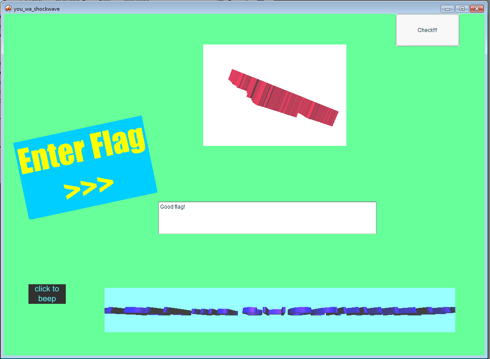

## Plaid CTF 2020 - YOU wa SHOCKWAVE (Reversing 250)
##### 17/04 - 19/04/2020 (48hr)
___


### Description: 

Feeling stifled by the large crowd gathered in the entrance plaza, you open up your minimap and
try to find somewhere to search far away from the entrance gate. Ah, perfect—there’s some kind
of library on the other side of the Sanctum. A nice, quiet place to search alone for a bit.

Entering the library, you find that your guess the library would be quiet was… rather faulty.
As the door swings closed behind you, instead of a soft bell that one might expect to hear,
you’re greeted with the wail of an electric guitar, quickly followed by some heavy drums.
Perhaps not a great place to sit quietly, but at least it seems like you’ve got the place
to yourself!

You find yourself drawn to a section labeled “anime” (perhaps this is some sort of multimedia
collection?), and everything there is spinning and flashing and generally making your eyes
hurt a little. But there’s got to be a flag hiding somewhere behind the seizure-inducing mess,
right?

```
you_wa_shockwave-cd93e87bfc18b8efe106cac3672c99ace8755767bc4315889996e130647528dd.tar.gz
```

___


### Solution

*This challenge solved together with m from Tasteless*

We have to deal with an old school Adobe *shockwave* application, which is written in *Lingo*.
We're interested in `you_wa_shockwave.dcr` which is essentially the Lingo Bytecode, is a stack based VM.

A quick search online reveals [Schockabsorber](https://github.com/eriksoe/Schockabsorber),
a (debugging) tool for running shockwave applications. We run the script it as follows:
```
./Schockabsorber/shockabsorber.py bin/you_wa_shockwave.dcr 
```

And we get the following error:
```
Traceback (most recent call last):
  File "./Schockabsorber/shockabsorber.py", line 4, in <module>
    main()
  File "/home/ispo/ctf/plaid_ctf_2020/YOU_wa_SHOCKWAVE/Schockabsorber/shockabsorber/main.py", line 47, in main
    movie = loader.load_movie(sys.argv[1])
  File "/home/ispo/ctf/plaid_ctf_2020/YOU_wa_SHOCKWAVE/Schockabsorber/shockabsorber/loader/loader.py", line 195, in load_movie
    (loader_context, sections_map, castlibs, castidx_order) = load_file(f)
  File "/home/ispo/ctf/plaid_ctf_2020/YOU_wa_SHOCKWAVE/Schockabsorber/shockabsorber/loader/loader.py", line 228, in load_file
    sections_map = shockabsorber.loader.dcr_envelope.create_section_map(f, loader_context)
  File "/home/ispo/ctf/plaid_ctf_2020/YOU_wa_SHOCKWAVE/Schockabsorber/shockabsorber/loader/dcr_envelope.py", line 167, in create_section_map
    raise "unknown repr_mode: %d" % e.repr_mode
TypeError: exceptions must be old-style classes or derived from BaseException, not str
```

We can go to `Schockabsorber/shockabsorber/loader/dcr_envelope.py:166` and fix the script:
```python
        else:
            #raise "unknown repr_mode: %d" % e.repr_mode
            print "unknown repr_mode ispo"
            continue
            # entries_by_nr[snr] = (e.tag,sdata)
```            

This is fix is not the best, since application crashes after a while, however it prints all the
useful output. The first interesting part is the local function table:
```
DB| Lscr.literals: {0: 'flag_input', 1: 'Good flag!', 2: 'Bad flag!'}
DB| * handler_name = 'zz_helper' (0x380)
DB|   subsections = [(276, 107), (384, 3), (390, 3), (396, 0), (396, 11)]
DB|   handler extras = [12, 1, 4]
DB| * handler_name = 'zz' (0x36a)
DB|   subsections = [(408, 22), (430, 1), (432, 0), (432, 0), (432, 1)]
DB|   handler extras = [204, 15, 4]
DB| * handler_name = 'check_flag' (0x372)
DB|   subsections = [(434, 789), (1224, 1), (1226, 9), (1244, 0), (1244, 27)]
DB|   handler extras = [254, 19, 25]
DB| * handler_name = 'click' (0x1b0)
DB|   subsections = [(1272, 57), (1330, 0), (1330, 1), (1332, 0), (1332, 8)]
DB|   handler extras = [1457, 48, 2]
```

Let's start with function `check_flag`:
```
DB| handler check_flag:
DB|    code: (0, 'Push-parameter', [(0, 'flag')])
DB|    code: (2, 'Get-field', ['length'])
DB|    code: (5, 'Push-int', [42])
DB|    code: (7, 'Not-equals', [])                      ; flag.legth != 42 ?
DB|    code: (8, 'Jump-relative-unless', [(8, 16)])     ; if yes goto #16
DB|    code: (11, 'Push-int-0', [])
DB|    code: (12, 'Set-arg-count-void', [1])
DB|    code: (14, 'Call', ['return'])                   ; return 0 (false)
; -----------------------------------------------------------------------------
LOOP_1:
DB|    code: (16, 'Push-int-0', [])
DB|    code: (17, 'Store-local', [(0, 'checksum')])     ; checksum = 0
DB|    code: (19, 'Push-int', [1])
DB|    code: (21, 'Store-local', [(1, 'i')])            ; i = 1
DB|    code: (23, 'Push-local', [(1, 'i')])
DB|    code: (25, 'Push-int', [21])                     ; 21 <= i ?
DB|    code: (27, 'Less-than-or-equals', [])
DB|    code: (28, 'Jump-relative-unless', [(71, 99)])   ; if yes goto #99
DB|    code: (31, 'Push-local', [(0, 'checksum')])
DB|    code: (33, 'Push-parameter', [(0, 'flag')])
DB|    code: (35, 'Push-symbol', ['char'])
DB|    code: (38, 'Push-local', [(1, 'i')])
DB|    code: (40, 'Push-int', [2])
DB|    code: (42, 'Multiply', [])
DB|    code: (43, 'Push-int', [1])
DB|    code: (45, 'Subtract', [])
DB|    code: (46, 'Set-arg-count-return', [3])
DB|    code: (48, 'Call-method', ['getProp'])           ; getProp(flag, 2*i+1, char)
DB|    code: (50, 'Set-arg-count-return', [1])
DB|    code: (52, 'Call', ['charToNum'])
DB|    code: (55, 'Push-int', [256])
DB|    code: (58, 'Multiply', [])                       ; charToNum(flag[2*i + 1]) * 256
DB|    code: (59, 'Push-parameter', [(0, 'flag')])
DB|    code: (61, 'Push-symbol', ['char'])
DB|    code: (64, 'Push-local', [(1, 'i')])
DB|    code: (66, 'Push-int', [2])
DB|    code: (68, 'Multiply', [])
DB|    code: (69, 'Set-arg-count-return', [3])
DB|    code: (71, 'Call-method', ['getProp'])
DB|    code: (73, 'Set-arg-count-return', [1])
DB|    code: (75, 'Call', ['charToNum'])                ; charToNum(flag[2*i])
DB|    code: (78, 'Add', [])                            ; charToNum(flag[2*i + 1]) * 256 + charToNum(flag[2*i])
DB|    code: (79, 'Set-arg-count-return', [1])
DB|    code: (81, 'Call-local', [1])                    ; call loca function #1 (zz)
DB|    code: (83, 'Set-arg-count-return', [2])
DB|    code: (85, 'Call', ['bitXor'])                   
DB|    code: (88, 'Store-local', [(0, 'checksum')])     ; checksum ^= zz(charToNum(flag[2*i + 1]) * 256 + charToNum(flag[2*i]))
DB|    code: (90, 'Push-int', [1])
DB|    code: (92, 'Push-local', [(1, 'i')])
DB|    code: (94, 'Add', [])
DB|    code: (95, 'Store-local', [(1, 'i')])            ; ++i
DB|    code: (97, 'Jump-relative-back', [(74, 23)])     ; goto LOOP_1
; -----------------------------------------------------------------------------
DB|    code: (99, 'Push-local', [(0, 'checksum')])
DB|    code: (101, 'Push-int-32?', [5803878])
DB|    code: (106, 'Not-equals', [])                    ; checksum != 5803878 ?
DB|    code: (107, 'Jump-relative-unless', [(8, 115)])  ; if not goto #115
DB|    code: (110, 'Push-int-0', [])
DB|    code: (111, 'Set-arg-count-void', [1])
DB|    code: (113, 'Call', ['return'])                  ; return 0 (false)
; -----------------------------------------------------------------------------
DB|    code: (115, 'Push-int', [2])
DB|    code: (117, 'Push-int', [5])
DB|    code: (119, 'Push-int', [12])
DB|    code: (121, 'Push-int', [19])
DB|    code: (123, 'Push-int-32?', [3749774])
DB|    code: (128, 'Set-arg-count-return', [5])
DB|    code: (130, 'Construct-linear-array', [])        ; create array (3749774, 19, 12, 5, 2)
DB|    code: (131, 'Push-int', [2])
DB|    code: (133, 'Push-int', [9])
DB|    code: (135, 'Push-int', [12])
DB|    code: (137, 'Push-int', [17])
DB|    code: (139, 'Push-int-32?', [694990])
DB|    code: (144, 'Set-arg-count-return', [5])
DB|    code: (146, 'Construct-linear-array', [])        ; create array (694990, 17, 12, 9, 2)
DB|    code: (147, 'Push-int', [1])
DB|    code: (149, 'Push-int', [3])
DB|    code: (151, 'Push-int', [4])
DB|    code: (153, 'Push-int', [13])
DB|    code: (155, 'Push-int', [5764])
DB|    code: (158, 'Set-arg-count-return', [5])
DB|    code: (160, 'Construct-linear-array', [])
DB|    code: (161, 'Push-int', [5])
DB|    code: (163, 'Push-int', [7])
DB|    code: (165, 'Push-int', [11])
DB|    code: (167, 'Push-int', [12])
DB|    code: (169, 'Push-int-32?', [299886])
DB|    code: (174, 'Set-arg-count-return', [5])
DB|    code: (176, 'Construct-linear-array', [])
DB|    code: (177, 'Push-int', [4])
DB|    code: (179, 'Push-int', [5])
DB|    code: (181, 'Push-int', [13])
DB|    code: (183, 'Push-int', [14])
DB|    code: (185, 'Push-int-32?', [5713094])
DB|    code: (190, 'Set-arg-count-return', [5])
DB|    code: (192, 'Construct-linear-array', [])
DB|    code: (193, 'Push-int-0', [])
DB|    code: (194, 'Push-int', [6])
DB|    code: (196, 'Push-int', [8])
DB|    code: (198, 'Push-int', [14])
DB|    code: (200, 'Push-int-32?', [430088])
DB|    code: (205, 'Set-arg-count-return', [5])
DB|    code: (207, 'Construct-linear-array', [])
DB|    code: (208, 'Push-int', [7])
DB|    code: (210, 'Push-int', [9])
DB|    code: (212, 'Push-int', [10])
DB|    code: (214, 'Push-int', [17])
DB|    code: (216, 'Push-int-32?', [3676754])
DB|    code: (221, 'Set-arg-count-return', [5])
DB|    code: (223, 'Construct-linear-array', [])
DB|    code: (224, 'Push-int-0', [])
DB|    code: (225, 'Push-int', [11])
DB|    code: (227, 'Push-int', [16])
DB|    code: (229, 'Push-int', [17])
DB|    code: (231, 'Push-int-32?', [7288576])
DB|    code: (236, 'Set-arg-count-return', [5])
DB|    code: (238, 'Construct-linear-array', [])
DB|    code: (239, 'Push-int', [5])
DB|    code: (241, 'Push-int', [9])
DB|    code: (243, 'Push-int', [10])
DB|    code: (245, 'Push-int', [12])
DB|    code: (247, 'Push-int-32?', [5569582])
DB|    code: (252, 'Set-arg-count-return', [5])
DB|    code: (254, 'Construct-linear-array', [])
DB|    code: (255, 'Push-int', [7])
DB|    code: (257, 'Push-int', [12])
DB|    code: (259, 'Push-int', [14])
DB|    code: (261, 'Push-int', [20])
DB|    code: (263, 'Push-int-32?', [7883270])
DB|    code: (268, 'Set-arg-count-return', [5])
DB|    code: (270, 'Construct-linear-array', [])
DB|    code: (271, 'Push-int-0', [])
DB|    code: (272, 'Push-int', [2])
DB|    code: (274, 'Push-int', [6])
DB|    code: (276, 'Push-int', [18])
DB|    code: (278, 'Push-int-32?', [5277110])
DB|    code: (283, 'Set-arg-count-return', [5])
DB|    code: (285, 'Construct-linear-array', [])
DB|    code: (286, 'Push-int', [3])
DB|    code: (288, 'Push-int', [8])
DB|    code: (290, 'Push-int', [12])
DB|    code: (292, 'Push-int', [14])
DB|    code: (294, 'Push-int-32?', [437608])
DB|    code: (299, 'Set-arg-count-return', [5])
DB|    code: (301, 'Construct-linear-array', [])
DB|    code: (302, 'Push-int', [4])
DB|    code: (304, 'Push-int', [7])
DB|    code: (306, 'Push-int', [12])
DB|    code: (308, 'Push-int', [16])
DB|    code: (310, 'Push-int-32?', [3184334])
DB|    code: (315, 'Set-arg-count-return', [5])
DB|    code: (317, 'Construct-linear-array', [])
DB|    code: (318, 'Push-int', [3])
DB|    code: (320, 'Push-int', [12])
DB|    code: (322, 'Push-int', [13])
DB|    code: (324, 'Push-int', [20])
DB|    code: (326, 'Push-int-32?', [2821934])
DB|    code: (331, 'Set-arg-count-return', [5])
DB|    code: (333, 'Construct-linear-array', [])
DB|    code: (334, 'Push-int', [3])
DB|    code: (336, 'Push-int', [5])
DB|    code: (338, 'Push-int', [14])
DB|    code: (340, 'Push-int', [16])
DB|    code: (342, 'Push-int-32?', [5306888])
DB|    code: (347, 'Set-arg-count-return', [5])
DB|    code: (349, 'Construct-linear-array', [])
DB|    code: (350, 'Push-int', [4])
DB|    code: (352, 'Push-int', [13])
DB|    code: (354, 'Push-int', [16])
DB|    code: (356, 'Push-int', [18])
DB|    code: (358, 'Push-int-32?', [5634450])
DB|    code: (363, 'Set-arg-count-return', [5])
DB|    code: (365, 'Construct-linear-array', [])
DB|    code: (366, 'Push-int', [11])
DB|    code: (368, 'Push-int', [14])
DB|    code: (370, 'Push-int', [17])
DB|    code: (372, 'Push-int', [18])
DB|    code: (374, 'Push-int-32?', [6221894])
DB|    code: (379, 'Set-arg-count-return', [5])
DB|    code: (381, 'Construct-linear-array', [])
DB|    code: (382, 'Push-int', [1])
DB|    code: (384, 'Push-int', [4])
DB|    code: (386, 'Push-int', [9])
DB|    code: (388, 'Push-int', [18])
DB|    code: (390, 'Push-int-32?', [5290664])
DB|    code: (395, 'Set-arg-count-return', [5])
DB|    code: (397, 'Construct-linear-array', [])
DB|    code: (398, 'Push-int', [2])
DB|    code: (400, 'Push-int', [9])
DB|    code: (402, 'Push-int', [13])
DB|    code: (404, 'Push-int', [15])
DB|    code: (406, 'Push-int-32?', [6404568])
DB|    code: (411, 'Set-arg-count-return', [5])
DB|    code: (413, 'Construct-linear-array', [])
DB|    code: (414, 'Push-int', [2])
DB|    code: (416, 'Push-int', [5])
DB|    code: (418, 'Push-int', [9])
DB|    code: (420, 'Push-int', [12])
DB|    code: (422, 'Push-int-32?', [3390622])
DB|    code: (427, 'Set-arg-count-return', [5])
DB|    code: (429, 'Construct-linear-array', [])        ; create array (3390622, 12, 9, 5, 2)
DB|    code: (430, 'Set-arg-count-return', [20])
DB|    code: (432, 'Construct-linear-array', [])        ; create and array of these arrays (2D)
; -----------------------------------------------------------------------------
DB|    code: (433, 'Store-local', [(2, 'check_data')])  ; check_data = our 2D array
DB|    code: (435, 'Push-local', [(2, 'check_data')])
DB|    code: (437, 'Dup', [0])
DB|    code: (439, 'Set-arg-count-return', [1])
DB|    code: (441, 'Call', ['count'])                   ; count = 20 = len(check_data)
DB|    code: (444, 'Push-int', [1])

LOOP_2:
DB|    code: (446, 'Dup', [0])
DB|    code: (448, 'Dup', [2])
DB|    code: (450, 'Less-than-or-equals', [])           ; if 1 <= count the goto #780
DB|    code: (451, 'Jump-relative-unless', [(329, 780)])

DB|    code: (454, 'Dup', [2])
DB|    code: (456, 'Dup', [1])
DB|    code: (458, 'Set-arg-count-return', [2])
DB|    code: (460, 'Call', ['getAt'])
DB|    code: (463, 'Store-local', [(3, 'x')])           ; x = getAt(2, 1) = check_data[count] = 1 row
DB|    code: (465, 'Push-local', [(3, 'x')])
DB|    code: (467, 'Push-int', [1])
DB|    code: (469, 'Set-arg-count-return', [2])
DB|    code: (471, 'Call-method', ['getAt'])
DB|    code: (474, 'Store-local', [(1, 'i')])           ; i = getAt(x, 1)
DB|    code: (476, 'Push-local', [(3, 'x')])
DB|    code: (478, 'Push-int', [2])
DB|    code: (480, 'Set-arg-count-return', [2])
DB|    code: (482, 'Call-method', ['getAt'])
DB|    code: (485, 'Store-local', [(4, 'j')])           ; j = getAt(x, 2)
DB|    code: (487, 'Push-local', [(3, 'x')])
DB|    code: (489, 'Push-int', [3])
DB|    code: (491, 'Set-arg-count-return', [2])
DB|    code: (493, 'Call-method', ['getAt'])
DB|    code: (496, 'Store-local', [(5, 'k')])           ; k = getAt(x, 3)
DB|    code: (498, 'Push-local', [(3, 'x')])
DB|    code: (500, 'Push-int', [4])
DB|    code: (502, 'Set-arg-count-return', [2])
DB|    code: (504, 'Call-method', ['getAt'])
DB|    code: (507, 'Store-local', [(6, 'l')])           ; l = getAt(x, 4)
DB|    code: (509, 'Push-local', [(3, 'x')])
DB|    code: (511, 'Push-int', [5])
DB|    code: (513, 'Set-arg-count-return', [2])
DB|    code: (515, 'Call-method', ['getAt'])
DB|    code: (518, 'Store-local', [(7, 'target')])      ; target = getAt(x, 5)

DB|    code: (520, 'Push-parameter', [(0, 'flag')])
DB|    code: (522, 'Push-symbol', ['char'])
DB|    code: (525, 'Push-local', [(1, 'i')])
DB|    code: (527, 'Push-int', [2])
DB|    code: (529, 'Multiply', [])
DB|    code: (530, 'Push-int', [1])
DB|    code: (532, 'Add', [])
DB|    code: (533, 'Set-arg-count-return', [3])
DB|    code: (535, 'Call-method', ['getProp'])
DB|    code: (537, 'Set-arg-count-return', [1])
DB|    code: (539, 'Call', ['charToNum'])
DB|    code: (542, 'Push-int', [256])
DB|    code: (545, 'Multiply', [])                      ; charToNum(flag[2*i + 1) * 256
DB|    code: (546, 'Push-parameter', [(0, 'flag')])
DB|    code: (548, 'Push-symbol', ['char'])
DB|    code: (551, 'Push-local', [(1, 'i')])
DB|    code: (553, 'Push-int', [2])
DB|    code: (555, 'Multiply', [])
DB|    code: (556, 'Push-int', [2])
DB|    code: (558, 'Add', [])
DB|    code: (559, 'Set-arg-count-return', [3])
DB|    code: (561, 'Call-method', ['getProp'])
DB|    code: (563, 'Set-arg-count-return', [1])
DB|    code: (565, 'Call', ['charToNum'])               ; charToNum(flag[2*i + 2)
DB|    code: (568, 'Add', [])
DB|    code: (569, 'Set-arg-count-return', [1])
DB|    code: (571, 'Call-local', [1])                   ; zz(charToNum(flag[2*i + 1) * 256 + charToNum(flag[2*i + 2))
DB|    code: (573, 'Store-local', [(8, 'sum')])
DB|    code: (575, 'Push-local', [(8, 'sum')])          ; sum = zz(charToNum(flag[2*i + 1) * 256 + charToNum(flag[2*i + 2))
DB|    code: (577, 'Push-parameter', [(0, 'flag')])
DB|    code: (579, 'Push-symbol', ['char'])
DB|    code: (582, 'Push-local', [(4, 'j')])
DB|    code: (584, 'Push-int', [2])
DB|    code: (586, 'Multiply', [])
DB|    code: (587, 'Push-int', [1])
DB|    code: (589, 'Add', [])
DB|    code: (590, 'Set-arg-count-return', [3])
DB|    code: (592, 'Call-method', ['getProp'])
DB|    code: (594, 'Set-arg-count-return', [1])
DB|    code: (596, 'Call', ['charToNum'])
DB|    code: (599, 'Push-int', [256])
DB|    code: (602, 'Multiply', [])                      ; charToNum(flag[2*j + 1) * 256
DB|    code: (603, 'Push-parameter', [(0, 'flag')])
DB|    code: (605, 'Push-symbol', ['char'])
DB|    code: (608, 'Push-local', [(4, 'j')])
DB|    code: (610, 'Push-int', [2])
DB|    code: (612, 'Multiply', [])
DB|    code: (613, 'Push-int', [2])
DB|    code: (615, 'Add', [])
DB|    code: (616, 'Set-arg-count-return', [3])
DB|    code: (618, 'Call-method', ['getProp'])
DB|    code: (620, 'Set-arg-count-return', [1])
DB|    code: (622, 'Call', ['charToNum'])               ; charToNum(flag[2*j + 2)
DB|    code: (625, 'Add', [])
DB|    code: (626, 'Set-arg-count-return', [1])
DB|    code: (628, 'Call-local', [1])
DB|    code: (630, 'Set-arg-count-return', [2])
DB|    code: (632, 'Call', ['bitXor'])                  
DB|    code: (635, 'Store-local', [(8, 'sum')])         ; sum ^= zz(charToNum(flag[2*j + 1) * 256 + charToNum(flag[2*j + 2))
DB|    code: (637, 'Push-local', [(8, 'sum')])
DB|    code: (639, 'Push-parameter', [(0, 'flag')])
DB|    code: (641, 'Push-symbol', ['char'])
DB|    code: (644, 'Push-local', [(5, 'k')])
DB|    code: (646, 'Push-int', [2])
DB|    code: (648, 'Multiply', [])
DB|    code: (649, 'Push-int', [1])
DB|    code: (651, 'Add', [])
DB|    code: (652, 'Set-arg-count-return', [3])
DB|    code: (654, 'Call-method', ['getProp'])
DB|    code: (656, 'Set-arg-count-return', [1])
DB|    code: (658, 'Call', ['charToNum'])
DB|    code: (661, 'Push-int', [256])
DB|    code: (664, 'Multiply', [])
DB|    code: (665, 'Push-parameter', [(0, 'flag')])
DB|    code: (667, 'Push-symbol', ['char'])
DB|    code: (670, 'Push-local', [(5, 'k')])
DB|    code: (672, 'Push-int', [2])
DB|    code: (674, 'Multiply', [])
DB|    code: (675, 'Push-int', [2])
DB|    code: (677, 'Add', [])
DB|    code: (678, 'Set-arg-count-return', [3])
DB|    code: (680, 'Call-method', ['getProp'])
DB|    code: (682, 'Set-arg-count-return', [1])
DB|    code: (684, 'Call', ['charToNum'])
DB|    code: (687, 'Add', [])
DB|    code: (688, 'Set-arg-count-return', [1])
DB|    code: (690, 'Call-local', [1])
DB|    code: (692, 'Set-arg-count-return', [2])
DB|    code: (694, 'Call', ['bitXor'])
DB|    code: (697, 'Store-local', [(8, 'sum')])         ; sum ^= zz(charToNum(flag[2*k + 1) * 256 + charToNum(flag[2*k + 2))
DB|    code: (699, 'Push-local', [(8, 'sum')])
DB|    code: (701, 'Push-parameter', [(0, 'flag')])
DB|    code: (703, 'Push-symbol', ['char'])
DB|    code: (706, 'Push-local', [(6, 'l')])
DB|    code: (708, 'Push-int', [2])
DB|    code: (710, 'Multiply', [])
DB|    code: (711, 'Push-int', [1])
DB|    code: (713, 'Add', [])
DB|    code: (714, 'Set-arg-count-return', [3])
DB|    code: (716, 'Call-method', ['getProp'])
DB|    code: (718, 'Set-arg-count-return', [1])
DB|    code: (720, 'Call', ['charToNum'])
DB|    code: (723, 'Push-int', [256])
DB|    code: (726, 'Multiply', [])
DB|    code: (727, 'Push-parameter', [(0, 'flag')])
DB|    code: (729, 'Push-symbol', ['char'])
DB|    code: (732, 'Push-local', [(6, 'l')])
DB|    code: (734, 'Push-int', [2])
DB|    code: (736, 'Multiply', [])
DB|    code: (737, 'Push-int', [2])
DB|    code: (739, 'Add', [])
DB|    code: (740, 'Set-arg-count-return', [3])
DB|    code: (742, 'Call-method', ['getProp'])
DB|    code: (744, 'Set-arg-count-return', [1])
DB|    code: (746, 'Call', ['charToNum'])
DB|    code: (749, 'Add', [])
DB|    code: (750, 'Set-arg-count-return', [1])
DB|    code: (752, 'Call-local', [1])
DB|    code: (754, 'Set-arg-count-return', [2])
DB|    code: (756, 'Call', ['bitXor'])
DB|    code: (759, 'Store-local', [(8, 'sum')])
DB|    code: (761, 'Push-local', [(8, 'sum')])          ; sum ^= zz(charToNum(flag[2*l + 1) * 256 + charToNum(flag[2*l + 2))
DB|    code: (763, 'Push-local', [(7, 'target')])
DB|    code: (765, 'Not-equals', [])                    ; sum != target ?
DB|    code: (766, 'Jump-relative-unless', [(8, 774)])  ; if not goto #774
; -----------------------------------------------------------------------------
DB|    code: (769, 'Push-int-0', [])
DB|    code: (770, 'Set-arg-count-void', [1])
DB|    code: (772, 'Call', ['return'])                  ; return 0 (false)
; -----------------------------------------------------------------------------
DB|    code: (774, 'Push-int', [1])                     ; count++
DB|    code: (776, 'Add', [])
DB|    code: (777, 'Jump-relative-back', [(331, 446)])  ; goto LOOP_2
; -----------------------------------------------------------------------------
DB|    code: (780, 'Pop', [3])
DB|    code: (782, 'Push-int', [1])
DB|    code: (784, 'Set-arg-count-void', [1])
DB|    code: (786, 'Call', ['return'])
DB|    code: (788, 'Return', [])                        ; return 1 (true)
```

So what's going on here? First flag must be `42` characters. Characters are checked in pairs.
The first check is the following:
```python    
    _sum = 0
    
    for i in range(1, 21+1):
        _sum ^= zz( flag[2*i - 1]*256 + flag[2*i])
    
    if _sum != 5803878:
        return false
```    

Then program creates a 2D array:
```python
    array = [
         [2, 5, 12, 19, 3749774],
         [2, 9, 12, 17, 694990],
         [1, 3, 4, 13, 5764],
         [5, 7, 11, 12, 299886],
         [4, 5, 13, 14, 5713094],
         [0, 6, 8, 14, 430088],
         [7, 9, 10, 17, 3676754],
         [0, 11, 16, 17, 7288576],
         [5, 9, 10, 12, 5569582],
         [7, 12, 14, 20, 7883270],
         [0, 2, 6, 18, 5277110],
         [3, 8, 12, 14, 437608],
         [4, 7, 12, 16, 3184334],
         [3, 12, 13, 20, 2821934],
         [3, 5, 14, 16, 5306888],
         [4, 13, 16, 18, 5634450],
         [11, 14, 17, 18, 6221894],
         [1, 4, 9, 18, 5290664],
         [2, 9, 13, 15, 6404568],
         [2, 5, 9, 12, 3390622]
     ]
```

And performs the following checks for each row:
```python
    for (i, j, k, l, target) in array:        
        if (zz(flag[2*i + 1]*256 + flag[2*i + 2]) ^
            zz(flag[2*j + 1]*256 + flag[2*j + 2]) ^
            zz(flag[2*k + 1]*256 + flag[2*k + 2]) ^
            zz(flag[2*l + 1]*256 + flag[2*l + 2]) != target):
                return false
    
```

Now let's look at `zz`:
```
DB| handler zz:
DB|    code: (0, 'Push-int', [1])
DB|    code: (2, 'Push-int', [1])
DB|    code: (4, 'Push-parameter', [(0, 'x')])
DB|    code: (6, 'Set-arg-count-return', [3])
DB|    code: (8, 'Call-local', [0])                     ; call local #0 (zz_helper)
DB|    code: (10, 'Push-int', [1])                      ; zz_helper(1, 1, x)
DB|    code: (12, 'Set-arg-count-return', [2])
DB|    code: (14, 'Call-method', ['getAt'])
DB|    code: (17, 'Set-arg-count-void', [1])
DB|    code: (19, 'Call', ['return'])                   ; return getAT(zz_helper(1, 1, x), 1)
DB|    code: (21, 'Return', [])                         ; (first argument of zz_helper)
```

`zz` is actuall a wrapper for `zz_helper`:
```
vars=['x', 'y', 'z']
locals=['c', 'a', 'b']

DB| handler zz_helper:
DB|    code: (0, 'Push-parameter', [(1, 'y')])
DB|    code: (2, 'Push-parameter', [(2, 'z')])
DB|    code: (4, 'Greater-than', [])                    ; y > z ?
DB|    code: (5, 'Jump-relative-unless', [(17, 22)])    ; if not goto RECURSION
DB|    code: (8, 'Push-int', [1])                       ; 1 on stack
DB|    code: (10, 'Push-parameter', [(2, 'z')])
DB|    code: (12, 'Push-parameter', [(0, 'x')])
DB|    code: (14, 'Subtract', [])                       ; z - x
DB|    code: (15, 'Set-arg-count-return', [2])          ; return a tuple!
DB|    code: (17, 'Construct-linear-array', [])
DB|    code: (18, 'Set-arg-count-void', [1])
DB|    code: (20, 'Call', ['return'])                   ; return (1, z-x)
; -----------------------------------------------------------------------------
RECURSION:
DB|    code: (22, 'Push-parameter', [(1, 'y')])
DB|    code: (24, 'Push-parameter', [(0, 'x')])
DB|    code: (26, 'Push-parameter', [(1, 'y')])
DB|    code: (28, 'Add', [])
DB|    code: (29, 'Push-parameter', [(2, 'z')])
DB|    code: (31, 'Set-arg-count-return', [3])
DB|    code: (33, 'Call-local', [0])                    ; call zz_helper! (we have recursion)
DB|    code: (35, 'Store-local', [(0, 'c')])            ; c = zz_helper(y, x + y, z)
DB|    code: (37, 'Push-local', [(0, 'c')])
DB|    code: (39, 'Push-int', [1])
DB|    code: (41, 'Set-arg-count-return', [2])
DB|    code: (43, 'Call-method', ['getAt'])
DB|    code: (46, 'Store-local', [(1, 'a')])            ; a = getAt(c, 1)
DB|    code: (48, 'Push-local', [(0, 'c')])
DB|    code: (50, 'Push-int', [2])
DB|    code: (52, 'Set-arg-count-return', [2])
DB|    code: (54, 'Call-method', ['getAt'])
DB|    code: (57, 'Store-local', [(2, 'b')])            ; b = getAt(c, 2) (zz_helper returns 2 vals)
DB|    code: (59, 'Push-local', [(2, 'b')])
DB|    code: (61, 'Push-parameter', [(0, 'x')])
DB|    code: (63, 'Greater-than-or-equals', [])         ; b >= x ?
DB|    code: (64, 'Jump-relative-unless', [(26, 90)])   ; if not goto #90
DB|    code: (67, 'Push-int', [2])
DB|    code: (69, 'Push-local', [(1, 'a')])
DB|    code: (71, 'Multiply', [])
DB|    code: (72, 'Push-int', [1])
DB|    code: (74, 'Add', [])                            ; 2*a + 1
DB|    code: (75, 'Push-local', [(2, 'b')])
DB|    code: (77, 'Push-parameter', [(0, 'x')])
DB|    code: (79, 'Subtract', [])                       ; b - x
DB|    code: (80, 'Set-arg-count-return', [2])
DB|    code: (82, 'Construct-linear-array', [])
DB|    code: (83, 'Set-arg-count-void', [1])
DB|    code: (85, 'Call', ['return'])                   ; return (2*a+1, b-x)
DB|    code: (87, 'Jump-relative', [(19, 106)])         ; goto end
; -----------------------------------------------------------------------------
DB|    code: (90, 'Push-int', [2])
DB|    code: (92, 'Push-local', [(1, 'a')])
DB|    code: (94, 'Multiply', [])
DB|    code: (95, 'Push-int-0', [])
DB|    code: (96, 'Add', [])                            ; 2*a + 0 = 2*a
DB|    code: (97, 'Push-local', [(2, 'b')])
DB|    code: (99, 'Set-arg-count-return', [2])
DB|    code: (101, 'Construct-linear-array', [])
DB|    code: (102, 'Set-arg-count-void', [1])
DB|    code: (104, 'Call', ['return'])                  ; return (2*a, b)
; -----------------------------------------------------------------------------
DB|    code: (106, 'Return', [])
```

Let's decompile them:
```python
def zz_helper(x, y, z):
    if y > z:
        return (1, z - x) 

    a, b = zz_helper(y, x + y, z)
  
    if b >= x:
        return (2*a + 1, b - x)
    
    return (2*a, b)
    
def zz(x):
    return zz_helper(1, 1, x)[0]
```

### Breaking the code

Now we have everything we need to find the flag. All we have to do is to simply feed all these
equations into **z3 solver**:
```
ispo@leet:~/ctf/plaid_ctf_2020/YOU_wa_SHOCKWAVE$ ./shockwave_crack.py 
[+] shockwave crack started.
[+] Creating symbolic zz() function ...
[+] Initializing flag syms ...
[+] Adding initial constraints
[+] Adding array constraints ...
[+] Adding constraint: i=2, j=5, k=12, l=19, target=3749774
[+] Adding constraint: i=2, j=9, k=12, l=17, target=694990
[+] Adding constraint: i=1, j=3, k=4, l=13, target=5764
[+] Adding constraint: i=5, j=7, k=11, l=12, target=299886
[+] Adding constraint: i=4, j=5, k=13, l=14, target=5713094
[+] Adding constraint: i=0, j=6, k=8, l=14, target=430088
[+] Adding constraint: i=7, j=9, k=10, l=17, target=3676754
[+] Adding constraint: i=0, j=11, k=16, l=17, target=7288576
[+] Adding constraint: i=5, j=9, k=10, l=12, target=5569582
[+] Adding constraint: i=7, j=12, k=14, l=20, target=7883270
[+] Adding constraint: i=0, j=2, k=6, l=18, target=5277110
[+] Adding constraint: i=3, j=8, k=12, l=14, target=437608
[+] Adding constraint: i=4, j=7, k=12, l=16, target=3184334
[+] Adding constraint: i=3, j=12, k=13, l=20, target=2821934
[+] Adding constraint: i=3, j=5, k=14, l=16, target=5306888
[+] Adding constraint: i=4, j=13, k=16, l=18, target=5634450
[+] Adding constraint: i=11, j=14, k=17, l=18, target=6221894
[+] Adding constraint: i=1, j=4, k=9, l=18, target=5290664
[+] Adding constraint: i=2, j=9, k=13, l=15, target=6404568
[+] Adding constraint: i=2, j=5, k=9, l=12, target=3390622
[+] Checking sat....
[+] Checking sat ...
[+] Valid solution found!
[+]   X_1 = 0x50 (P)
[+]   X_2 = 0x43 (C)
[+]   X_3 = 0x54 (T)
[+]   X_4 = 0x46 (F)
[+]   X_5 = 0x7b ({)
[+]   X_6 = 0x47 (G)
[+]   X_7 = 0x72 (r)
[+]   X_8 = 0x34 (4)
[+]   X_9 = 0x70 (p)
[+]   X_10 = 0x68 (h)
[+]   X_11 = 0x31 (1)
[+]   X_12 = 0x43 (C)
[+]   X_13 = 0x53 (S)
[+]   X_14 = 0x5f (_)
[+]   X_15 = 0x44 (D)
[+]   X_16 = 0x33 (3)
[+]   X_17 = 0x53 (S)
[+]   X_18 = 0x69 (i)
[+]   X_19 = 0x47 (G)
[+]   X_20 = 0x6e (n)
[+]   X_21 = 0x5f (_)
[+]   X_22 = 0x49 (I)
[+]   X_23 = 0x73 (s)
[+]   X_24 = 0x5f (_)
[+]   X_25 = 0x74 (t)
[+]   X_26 = 0x52 (R)
[+]   X_27 = 0x55 (U)
[+]   X_28 = 0x6c (l)
[+]   X_29 = 0x59 (Y)
[+]   X_30 = 0x5f (_)
[+]   X_31 = 0x4d (M)
[+]   X_32 = 0x79 (y)
[+]   X_33 = 0x5f (_)
[+]   X_34 = 0x50 (P)
[+]   X_35 = 0x61 (a)
[+]   X_36 = 0x73 (s)
[+]   X_37 = 0x35 (5)
[+]   X_38 = 0x69 (i)
[+]   X_39 = 0x6f (o)
[+]   X_40 = 0x4e (N)
[+]   X_41 = 0x21 (!)
[+] Flag: PCTF{Gr4ph1CS_D3SiGn_Is_tRUlY_My_Pas5ioN!
```

For more details take a look at the crack script: [shockwave_crack.py](./shockwave_crack.py)

The flag is `PCTF{Gr4ph1CS_D3SiGn_Is_tRUlY_My_Pas5ioN!`. We verify it:



___
