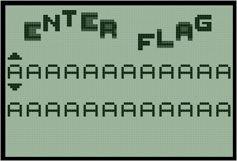
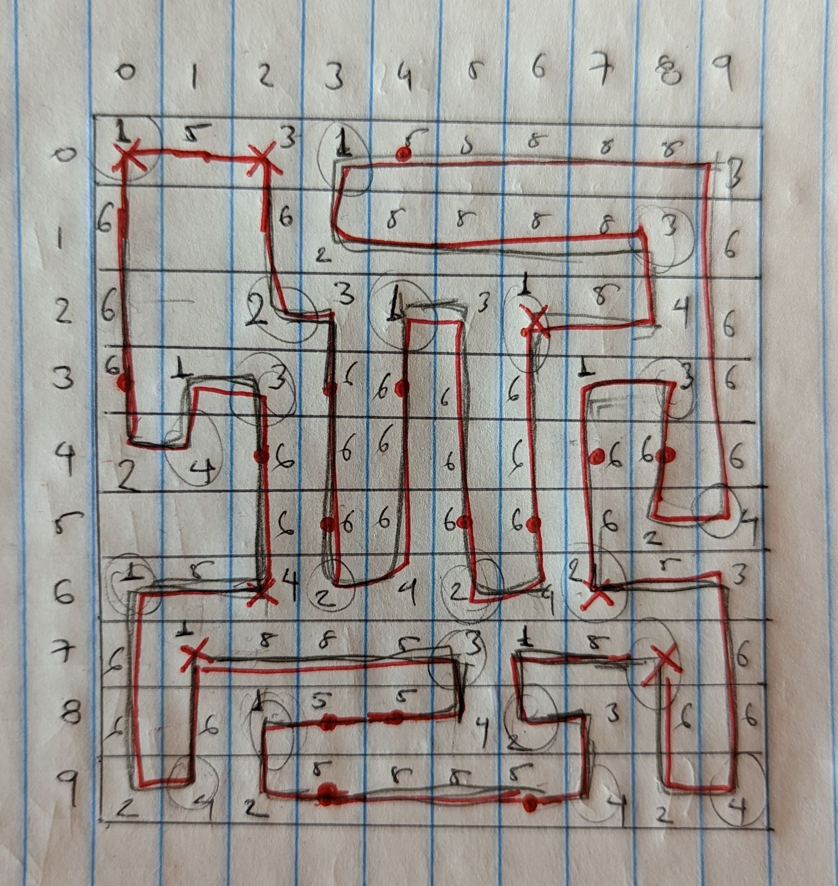
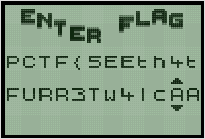

## PlaidCTF 2021 - Mini Pokemon (RE 450)
##### 16/04 - 18/04/2021 (48hr)
___


### Description


*Enter the world of minipokemon!*

**Episodes:**

*The Fast and Furretous! (450 points): I heard there's a Furret hiding in this program that might appear if you enter the flag!*
___


### Solution


This is a [Pokémon Mini](https://en.wikipedia.org/wiki/Pok%C3%A9mon_Mini) challenge.
We will use the [PokeMini](https://sourceforge.net/projects/pokemini/) emulator that
comes with a debugger (`PokeminiD`). The emulator (along with a lot of other useful resources
can be found in [pokemon-mini.net](https://www.pokemon-mini.net/)). Let's run the challenge image:
```
pokemini_060_linux32dev/PokeMini dist/minipokemon.min
```




The [Pokémon Mini](https://en.wikipedia.org/wiki/Pok%C3%A9mon_Mini) runs on an **EPSON S1C88** CPU.
We use the [mindis2](https://github.com/pokemon-mini/mindis2) disassembler. To understand and
reverse the assembly, we need to first understand the processor architecture, the instruction set,
and the I/O interrupts. All this information is available in the
[Reference Manual](https://www.rayslogic.com/Software/TimexUSB/Docs/s1c88%20core%20cpu%20manual.pdf).


Below is the reversed assembly of the `minipokemon.min` file. First, we have the IRQ handlers:
```assembly
DEFSECT ".rom0", CODE AT 2100H
SECT ".rom0"
; ----------------------
    ASCII "MN"
; ---------------------- ; 2100
reset_vector:
    LD NB,#00h ; 2102
    JRL loc_0x002264
; ---------------------- ; 2105
prc_frame_copy_irq:
    LD NB,#00h ; 2108
    JRL loc_0x00230E
; ---------------------- ; 210b
prc_render_irq:
    LD NB,#00h ; 210e
    JRL loc_0x002381
; ---------------------- ; 2111
timer_2h_underflow_irq:
    LD NB,#00h ; 2114
    JRL loc_0x002384
; ---------------------- ; 2117
timer_2l_underflow_irq:
    LD NB,#00h ; 211a
    JRL loc_0x002387
; ---------------------- ; 211d
timer_1h_underflow_irq:
    LD NB,#00h ; 2120
    JRL loc_0x00238A
; ---------------------- ; 2123
timer_1l_underflow_irq:
    LD NB,#00h ; 2126
    JRL loc_0x00238D
; ---------------------- ; 2129
timer_3h_underflow_irq:
    LD NB,#00h ; 212c
    JRL loc_0x0024D0
; ---------------------- ; 212f
timer_3_cmp_irq:
    LD NB,#00h ; 2132
    JRL loc_0x002514
; ---------------------- ; 2135
timer_32hz_irq:
    LD NB,#00h ; 2138
    JRL loc_0x002517
; ---------------------- ; 213b
timer_8hz_irq:
    LD NB,#00h ; 213e
    JRL loc_0x00251A
; ---------------------- ; 2141
timer_2hz_irq:
    LD NB,#00h ; 2144
    JRL loc_0x00251D
; ---------------------- ; 2147
timer_1hz_irq:
    LD NB,#00h ; 214a
    JRL loc_0x002520
; ---------------------- ; 214d
ir_rx_irq:
    LD NB,#00h ; 2150
    JRL loc_0x002523
; ---------------------- ; 2153
shake_irq:
    LD NB,#00h ; 2156
    JRL loc_0x002526
; ---------------------- ; 2159
key_power_irq:
    LD NB,#00h ; 215c
    JRL loc_0x002529
; ---------------------- ; 215f
key_right_irq:
    LD NB,#00h ; 2162
    JRL loc_0x002543
; ---------------------- ; 2165
key_left_irq:
    LD NB,#00h ; 2168
    JRL loc_0x0025C8
; ---------------------- ; 216b
key_down_irq:
    LD NB,#00h ; 216e
    JRL loc_0x00264B
; ---------------------- ; 2171
key_up_irq:
    LD NB,#00h ; 2174
    JRL loc_0x002680
; ---------------------- ; 2177
key_c_irq:
    LD NB,#00h ; 217a
    JRL loc_0x0026B6
; ---------------------- ; 217d
key_b_irq:
    LD NB,#00h ; 2180
    JRL loc_0x0026B9
; ---------------------- ; 2183
key_a_irq:
    LD NB,#00h ; 2186
    JRL loc_0x0026BC
; ---------------------- ; 2189
unknown_irq0:
    LD NB,#00h ; 218c
    JRL loc_0x002707
; ---------------------- ; 218f
unknown_irq1:
    LD NB,#00h ; 2192
    JRL loc_0x002707
; ---------------------- ; 2195
unknown_irq2:
    LD NB,#00h ; 2198
    JRL loc_0x002707
; ---------------------- ; 219b
cartridge_irq:
    LD NB,#00h ; 219e
    JRL loc_0x00270A
; ---------------------- ; 21a1
    ASCIZ "NINTENDO"
    ASCIZ "MPKM"
    ASCIZ "minipokemon" ; 21a4
    ASCIZ "2P" ; 21bc
    DB 00h, 00h, 00h, 00h, 00h, 00h, 00h, 00h ; 21bf
    DB 00h, 00h, 00h, 00h, 00h, 00h, 00h, 00h ; 21c7
    DB 00h
```

Then we have the actual code and then the data. We first check the handlers for `key_up_irq` and 
`key_down_irq`. These handlers are invoked when the up/down keys are pressed and they modify a
character from the flag:
```assembly
; ==============================================================================
; Interrupt to handle "Key Down" event.
;
; This procedure will reveal where the flag is stored
;
loc_0x00264B:                       ; push all registers on stack
    PUSH ALE ; 264b                 ; clear expand page register
    LD EP,#00h ; 264d               ; A = *(0x14E9) = Cursor index = cur_idx
    LD A,[14E9h] ; 2650             ; B = 0xC   ~> 12
    LD B,#0Ch ; 2654                ; L = A
    LD L,A ; 2656                   ; A ^= 0x80
    XOR A,#80h ; 2657               ; B ^= 0x80
    XOR B,#80h ; 2659               ; A VS B = 12 (index)
    CP A,B ; 265c                   ; NB = 0
    LD NB,#00h ; 265d               ;

    JRS LT,loc_0x002668 ; 2660      ; if Α < 12 then skip
    LD A,#14h ; 2663                ; A = 0x14 = 20
    LD B,L ; 2665                   ; B = cur_idx
    ADD A,B ; 2666                  ; A = cur_idx + 20 
    LD L,A ; 2667                   ; L = A ~> Must be the cursor index

loc_0x002668:                       ; A = cur_idx (or cur_idx + 20)
    LD A,L ; 2668                   ; B = 0
    LD B,#00h ; 2669                ; HL = 0x1390   => Flag is stored at 0x1390
    LD HL,#1390h ; 266b             ; HL += BA      => HL = &flag[cur_idx]
    ADD HL,BA ; 266e                ; B = *HL       => B = flag[cur_idx]
    LD B,[HL] ; 2670                ; B
    DEC B ; 2671                    ; B--           => decrement
    LD A,#3Fh ; 2672                ; A = 0x3F
    AND A,B ; 2674                  ; A = flag[cur_idx] & 0x3F
    LD B,A ; 2675                   ; *flag[cur_idx]--
    LD [HL],B ; 2676                ; L = 0x10
    LD L,#10h ; 2677                ; *0x2029 = 0x10 => Set ctrl signal maybe
    LD [2029h],L ; 2679             ; IRQ_ACT3
    POP ALE ; 267d                  ; restore stack frame
    RETE
; ==============================================================================
```

The important part here is that the flag is stored at `0x1390`. Then we look at which function
*reads* from address `0x1390` as this should be the flag verification function. There is only one
big function and is located `0x002C95`:
```assembly
; ==============================================================================
; def proc_B(IX, IY):
;   if IY == 0: return
;
;   xp = 16
;   if IX == 0: return
;
;   if IX >> 8 == 0:
;       IX = IX << 8
;       xp -= 8
;
;   BA = 0
;   for i in range(xp, -1, -1):
;       BA, IX = ((BA << 16) | IX) << 1
;
;       if BA > IY:  # full value fits, so subtract we from divisor
;           BA -= IY
;           ++IX     # increment quotient
;
;   return BA, IX (as HL)
;
; ---------------- SIMPLIFIED VERSION: IT'S DIVISION :) ----------------
; def div(IX, IY):
;   if IY == 0: return 
;
;   a = IX  # 0 extend to 32-bits
;   for i in range(16):
;       a *= 2
;       if a >= IY << 16:  # 0xA0000:
;           a -= IY << 16  # 0xA0000
;           ++a
;       
;   return a
;
loc_0x0021D0:                       ;
    ADD IY,#0000h ; 21d0            ; arg2 += 0 (do that just to set flags)
    JRS NZ,loc_0x0021D8 ; 21d3      ; if arg2 is NULL abort (arg2 is always 10)
    OR SC,#04h ; 21d5               ;
    RET                             ;
loc_0x0021D8:                       ;
    PUSH EP ; 21d8                  ;
    LD EP,#00h ; 21d9               ;
    PUSH IX ; 21dc                  ; 
    LD BA,#0000h ; 21dd             ; BA = 0
    PUSH BA ; 21e0                  ; StacK: [0, 0, X, I, P, E]
    LD XP,#10h ; 21e1               ; XP = 0x10 = 16
    LD B,#02h ; 21e4                ; B = 2
    LD HL,SP ; 21e6                 ; 
    ADD HL,#0003h ; 21e8            ; 
    LD A,[HL] ; 21eb                ; A = "I" of IX = IX >> 8 (arg1)

loc_0x0021EC:                       ; do {  // do 2 iterations ~> get the non-zero value?
    OR A,#00h ; 21ec                ;
    JRS NZ,loc_0x002201 ; 21ee      ; if A != 0 break ~> A must be 0
    LD A,XP ; 21f0                  ;
    SUB A,#08h ; 21f2               ;
    LD XP,A ; 21f4                  ; XP -= 8
    DEC HL ; 21f6                   ;
    LD A,#00h ; 21f7                ;
    EX A,[HL] ; 21f9                ; A = "X" = IX & 0xFF = 0, StacK: [A, B, 0, I, P, E]
    INC HL ; 21fa                   ; HL = advance SP (+1)
    LD [HL],A ; 21fb                ; StacK: [A, B, 0, X, P, E] (I was 0 since we entered the loop)
    DEC B ; 21fc                    ; --B
    JRS NZ,loc_0x0021EC ; 21fd      ; } while (B);
    JRS loc_0x002237                ; if both values are 0 then return

loc_0x002201:                       ; do { // rotate IX by 1
    LD B,#02h ; 2201                ; B = 2 = j
    LD HL,SP ; 2203                 ; StacK: [0, 0, X, I, P, E] or [0, 0, 0, X, P, E]
    ADD HL,#0002h ; 2205            ; HL = [X, I]
    AND SC,#0FDh ; 2208             ; clear carry flag
loc_0x00220A:                       ; do {  // rotate 0 by 1 = 0
    RL [HL] ; 220a                  ; rol(HL[j], 1) with carry
    INC HL ; 220c                   ; ++j
    DEC B ; 220d                    ; i--
    JRS NZ,loc_0x00220A ; 220e      ; } while (i > 0);  // 2 iterations

    LD B,#02h ; 2210                ; same loop but for AB this time
    LD HL,SP ; 2212                 ; (it will become non zero after many shifts)
loc_0x002214:                       ; (carry flag is not cleared)
    RL [HL] ; 2214                  ;
    INC HL ; 2216                   ;
    DEC B ; 2217                    ;
    JRS NZ,loc_0x002214 ; 2218      ;

    LD HL,SP ; 221a                 ;
    LD BA,[HL] ; 221c               ;
    SUB BA,IY ; 221e                ; BA = BA - arg2 = A - 10
    JRS C,loc_0x002230 ; 2220       ; if negative skip

    LD HL,SP ; 2222                 ;
    ADD HL,#0002h ; 2224            ; 
    INC [HL] ; 2227                 ; IX++
    LD HL,SP ; 2228                 ;
    LD BA,[HL] ; 222a               ; BA = BA
    SUB BA,IY ; 222c                ;
    LD [HL],BA ; 222e               ; BA -= arg2 = 10
loc_0x002230:                       ;
    LD A,XP ; 2230                  ; A = XP (16, 8 or 0)
    DEC A ; 2232                    ;
    LD XP,A ; 2233                  ; XP -= 1
    JRS NZ,loc_0x002201 ; 2235      ; } while (xp > 0);

loc_0x002237:                       ; restore stack frame
    POP BA ; 2237                   ; (ret val#1)
    POP HL ; 2238                   ; (ret val#2)
    POP EP ; 2239                   ;
    RET                             ;
; ==============================================================================
; def bigmul(arg1, arg2):
;   B = (arg1_hi * arg2_lo) & 0xFF + ((arg1_lo * arg2_lo) >> 8) + (arg1_lo * arg2_hi) & 0xFF
;   A = (ardg1_lo * arg2_lo) & 0xFF
;   
; This is a 16-bit by 16-bit modulo 16-bit multiplication
;
loc_0x00223B:                       ; proc_A()
    PUSH IP ; 223b                  ;
    LD BA,IY ; 223c                 ; BA = IY (arg2)
    PUSH B ; 223e                   ; B on stack
    LD HL,IX ; 2240                 ; HL = IX (arg1)
    MLT ; 2242                      ; HL = L * A = arg2 * arg1 (8 LSB) = arg1_lo * arg2_lo
    EX BA,HL ; 2244                 ; swap(BA, HL) ~> B = (arg1_lo * arg2_lo) >> 8 (hi)
    LD YP,A ; 2245                  ; YP = A = (L before swap) = (arg1_lo * arg2_lo) & 0xFF
    LD A,L ; 2247                   ; A = L = (HL <~> BA) = IY = arg2_lo
    LD HL,IX ; 2248                 ; HL = IX = arg1
    LD L,H ; 224a                   ; L = arg1_hi
    MLT ; 224b                      ; HL = L * A = arg1_hi * arg2_lo
    LD A,L ; 224d                   ;
    ADD A,B ; 224e                  ; A += B
    LD XP,A ; 224f                  ; XP = A + B = (arg1_hi * arg2_lo) & 0xFF + ((arg1_lo * arg2_lo) >> 8) = tmp
    LD B,H ; 2251                   ; B = H = (arg1_hi * arg2_lo) >> 8
    JRS NC,loc_0x002255 ; 2252      ; Do we have carry?
    INC B ; 2254                    ; B++ = ((arg1_hi * arg2_lo) >> 8)++

loc_0x002255:                       ; 
    LD HL,IX ; 2255                 ; HL = IX = arg1
    POP A ; 2257                    ; A = B = arg2_hi
    MLT ; 2259                      ; HL = L * A = arg1_lo * arg2_hi
    LD A,XP ; 225b                  ; A = tmp
    LD B,L ; 225d                   ; 
    ADD A,B ; 225e                  ; A = tmp + (arg1_lo * arg2_hi) & 0xFF
    LD B,A ; 225f                   ; B = tmp + (arg1_lo * arg2_hi) & 0xFF
    LD A,YP ; 2260                  ; A = YP = (arg1_lo * arg2_lo) & 0xFF (Return value?)
    POP IP ; 2262                   ; 
    RET                             ;

; ==============================================================================
;
;
;
; MORE CODE THAT WE DON'T CARE ABOUT
;
;
;
; ==============================================================================
; FLAG CHECK
;
loc_0x002C95:
    SUB SP,#000Dh ; 2c95            ; alloc stack frame
    LD A,#00h ; 2c99                ;
    LD XP,A ; 2c9b                  ; XP = 0
    LD IX,#14ECh ; 2c9d             ; IX = 0x14EC = buf_a
    ; ----------------------------------------------------------
    ; for i in range(12):
    ;   buf_a[i] = flag_pt1[i]
    ;   buf_a[i + 12] = flag_pt2[i]
    ; ----------------------------------------------------------
loc_0x002CA0:                       ; do {  // Copy LOOP
    LD A,XP ; 2ca0                  ; A = 0 = i
    LD L,A ; 2ca2                   ;
    LD H,#00h ; 2ca3                ; 
    LD IY,#1390h ; 2ca5             ; IY = 0x1390 = & flag_pt1
    LD [SP+0Bh],HL ; 2ca8           ; sp_0b = (0 << 8) | i (16 bit)
    ADD IY,HL ; 2cab                ; IY = &flag[i]
    LD YP,#00h ; 2cad               ; 
    LD B,[IY] ; 2cb0                ; B = flag[i]
    LD HL,IX ; 2cb1                 ; 
    LD EP,#00h ; 2cb3               ;
    LD [HL],B ; 2cb6                ; *buf_a = B = flag[i]
    LD IX,HL ; 2cb7                 ;
    LD IY,#13B0h ; 2cb9             ; IY = 0x13B0 = & flag_pt2
    LD HL,[SP+0Bh] ; 2cbc           ; HL = sp_0b = i
    ADD IY,HL ; 2cbf                ; IY = flag_pt2[i]
    LD YP,#00h ; 2cc1               ;
    LD B,[IY] ; 2cc4                ; B = flag_pt2[i]
    LD HL,#000Ch ; 2cc5             ; HL = 0xC
    ADD HL,IX ; 2cc8                ; HL = buf_a + 0xC
    LD [HL],B ; 2cca                ; *(buf_a + 0xC) = flag_pt2[i]
    INC IX ; 2ccb                   ; buf_a++
    LD HL,IX ; 2ccc                 ; HL = buf_a++
    INC A ; 2cce                    ; ++i
    LD XP,A ; 2ccf                  ;
    LD IX,HL ; 2cd1                 ; IX = buf_a++
    LD BA,#14F8h ; 2cd3             ; BA = 0x14F8
    XOR H,#80h ; 2cd6               ; clear MSBits to make comparison unsigned
    XOR B,#80h ; 2cd9               ;
    CP HL,BA ; 2cdc                 ; buf_a VS 0x14F8 ? (buf_a initialized to 0x14EC)
    JRS LT,loc_0x002CA0 ; 2cde      ; } while(buf_a < 0x14F8);  // do 12 iterations
    ; ----------------------------------------------------------
    ; buf_a = [buf_a[j] ^ xor_buf[j] for j in range(24)]
    ; ----------------------------------------------------------
    LD IY,#14ECh ; 2ce1             ; IY = 0x14EC = buf_a
    LD IX,#665Dh ; 2ce4             ; IB = 0x665D = xor_buf
    LD XP,#00h ; 2ce7               ; j = 0

loc_0x002CEA:
    LD YP,#00h ; 2cea               ; do {  // XOR loop
    LD A,[IY] ; 2ced                ; A = buf_a[j]
    LD B,[IX] ; 2cee                ; B = xor_buf[j]
    XOR A,B ; 2cef                  ; A = buf_a[j] ^ xor_buf[j]
    LD HL,IY ; 2cf0                 ;
    LD B,A ; 2cf2                   ;
    LD [HL],B ; 2cf3                ; buf_a[j] ^= xor_buf[j]
    LD IY,HL ; 2cf4                 ;
    INC IX ; 2cf6                   ; buf_a++
    INC IY ; 2cf7                   ; xor_buf++ (i.e., j++)
    LD HL,IY ; 2cf8                 ;
    LD BA,#1504h ; 2cfa             ; BA = 0x1504
    LD IY,HL ; 2cfd                 ;
    XOR H,#80h ; 2cff               ;
    XOR B,#80h ; 2d02               ;
    CP HL,BA ; 2d05                 ; buf_a VS 0x1504 ? (buf_a initialized to 0x14EC)
    JRS LT,loc_0x002CEA ; 2d07      ; } while(buf_a < 0x1504);  // do 24 iterations
    ; ----------------------------------------------------------
    ; for i in range(42):
    ;   a = 0
    ;   for j in range(24):
    ;       a = buf_a[j] + bigmul(a, 64)
    ;
    ;       _, quotient = div(a, 10)
    ;       buf_a[j] = quotient & 0xFF
    ;
    ;       remainder, _ = div(a, 10)
    ;       a = remainder
    ;
    ;   buf_b[i] = a & 0xFF
    ;
    ; # Simplified:
    ; for i in range(42):
    ;   a = 0
    ;   for j in range(24):
    ;       a = buf_a[j] + a*64
    ;
    ;       buf_a[j] = a // 10
    ;       a %= 10
    ;
    ;   buf_b[i] = a  # buf_b has values in range 0-9
    ; ----------------------------------------------------------
    LD IY,#1504h ; 2d0a             ; IY = 0x1504 = end of buf_a = buf_b
    LD [SP+0Bh],IY ; 2d0d           ; sp_0b = 0x1504

loc_0x002D10:                       ; do {  // outer loop
    LD IX,#0000h ; 2d10             ; IX = 0 = a
    LD IY,#14ECh ; 2d13             ; IY = 0x14EC = buf_a
    LD [SP+09h],IY ; 2d16           ; sp_09 = buf_a

loc_0x002D19:                       ; do {  // inner loop
    LD IY,#0040h ; 2d19             ; IY = 0x40 = 64 ~> charset length! [A-Za-z0-9{}]
    CARL loc_0x00223B ; 2d1c        ; retv = proc_A(IX, IY) => BA = bigmul(a, 0x40)
    LD HL,BA ; 2d1f                 ; HL = retv = b
    LD IY,[SP+09h] ; 2d21           ; IY = sp_09 = buf_a
    LD YP,#00h ; 2d24               ;
    LD A,[IY] ; 2d27                ; A = buf_a[j]
    LD B,#00h ; 2d28                ; B = 0
    LD IX,BA ; 2d2a                 ; IX = buf_a[j] (extended to 16 bits)
    ADD IX,HL ; 2d2c                ; a = buf_a[j] + b

    LD IY,#000Ah ; 2d2e             ;
    CARL loc_0x0021D0 ; 2d31        ; BA, HL = div(a, 10) = remainder, quotient
                                    ; a = IX is intact

    LD B,L ; 2d34                   ; B = L = quotient & 0xFF
    LD HL,[SP+09h] ; 2d35           ; HL = sp_09 = buf_a
    LD EP,#00h ; 2d38               ;
    LD [HL],B ; 2d3b                ; buf_a[j] = quotient & 0xFF

    LD IY,#000Ah ; 2d3c             ;
    CARL loc_0x0021D0 ; 2d3f        ; BA, HL = div(a, 10) = remainder, quotient

    LD IX,BA ; 2d42                 ; IX = a = BA = remainder
    LD IY,[SP+09h] ; 2d44           ; IY = sp_09 = buf_a
    INC IY ; 2d47                   ; ++buf_a
    LD [SP+09h],IY ; 2d48           ; sp_09 = buf_a ~> increment buffer pointer
    LD BA,#1504h ; 2d4b             ; BA = 0x1504
    LD HL,[SP+09h] ; 2d4e           ; HL = buf_a
    XOR H,#80h ; 2d51               ; clear MSBits to make comparison unsigned
    XOR B,#80h ; 2d54               ;
    CP HL,BA ; 2d57                 ; HL VS BA ?
    LD EP,#00h ; 2d59               ;
    JRS LT,loc_0x002D19 ; 2d5c      ; } while(buf_a < 0x1504);  // do 24 iterations

    LD BA,IX ; 2d5f                 ; BA = r_c
    LD B,A ; 2d61                   ;
    LD HL,[SP+0Bh] ; 2d62           ;
    LD [HL],B ; 2d65                ; buf_b[i] = r_c & 0xFF
    LD IY,HL ; 2d66                 ;
    INC IY ; 2d68                   ;
    LD [SP+0Bh],IY ; 2d69           ; ++buf_b   
    LD BA,#152Eh ; 2d6c             ;
    LD HL,[SP+0Bh] ; 2d6f           ;
    XOR H,#80h ; 2d72               ;
    XOR B,#80h ; 2d75               ;
    CP HL,BA ; 2d78                 ;
    JRS LT,loc_0x002D10 ; 2d7a      ; } while (buf_b < 0x152E);  // do 152E-1504 = 42 iterations

    ; ----------------------------------------------------------
    ; Check whether buf_a is zero'ed out. If not abort
    ; ----------------------------------------------------------
    LD IY,#14ECh ; 2d7d             ; IY = buf_a
loc_0x002D80:                       ; do {
    LD YP,#00h ; 2d80               ;
    LD A,[IY] ; 2d83                ; A = buf_a[i]
    CP A,#00h ; 2d84                ;
    JRS Z,loc_0x002D8E ; 2d86       ; if buf_a[i] != 0 then error
    LD BA,#0002h ; 2d88             ; RetVal = 2
    JRL loc_0x00344C                ; Abort!

loc_0x002D8E:                       ;
    INC IY ; 2d8e                   ; ++buf_a 
    LD HL,IY ; 2d8f                 ;
    LD BA,#1504h ; 2d91             ;
    LD IY,HL ; 2d94                 ;
    XOR H,#80h ; 2d96               ;
    XOR B,#80h ; 2d99               ;
    CP HL,BA ; 2d9c                 ;
    JRS LT,loc_0x002D80 ; 2d9e      ; } while(buf_a < 0x1504);  // do 24 iterations

    ; ----------------------------------------------------------
    ; for i in range(4):
    ;   buf_b[42 + i] = buf_b[i]
    ; ----------------------------------------------------------
    LD IY,#1504h ; 2da1             ; IY = 0x1504 = buf_b
loc_0x002DA4:                       ; do {
    LD YP,#00h ; 2da4               ; YP = 0
    LD B,[IY] ; 2da7                ; B = buf_b[i]
    LD HL,#002Ah ; 2da8             ;
    ADD HL,IY ; 2dab                ; 
    LD [HL],B ; 2dad                ; buf_b[0x2A + i] = buf_b[i]
    INC IY ; 2dae                   ; ++buf_b
    LD HL,IY ; 2daf                 ;
    LD BA,#1508h ; 2db1             ;
    LD IY,HL ; 2db4                 ;
    XOR H,#80h ; 2db6               ;
    XOR B,#80h ; 2db9               ;
    CP HL,BA ; 2dbc                 ;
    JRS LT,loc_0x002DA4 ; 2dbe      ; } while (buf_b != 0x1508); // do 4 iterations

    ; ----------------------------------------------------------
    ; c0 = buf_b[2]*10 + buf_b[3]
    ; for i in range(0, 21):
    ;   c1 = buf_b[2*i - 1]*10 + buf_b[2*i]
    ;   if c1 < c0: abort()
    ;
    ;   c2 = buf_b[2*i + 1]*10 + buf_b[2*i]
    ;   if c2 < c0: abort()
    ; ----------------------------------------------------------
    LD A,[1506h] ; 2dc1             ; A = buf_b[2] ~> buf_b starts at 0x1504
    LD L,#0Ah ; 2dc5                ; L = 10
    MLT ; 2dc7                      ; HL = L * A = buf_b[2] * 10
    LD A,L ; 2dc9                   ;
    LD B,[1507h] ; 2dca             ; B = buf_b[3]
    ADD A,B ; 2dce                  ; A = (buf_b[2] * 10 + buf_b[3]) & 0xFF = c0 ~> make 2 digit decimal
    LD XP,#00h ; 2dcf               ;
    LD IX,SP ; 2dd2                 ;
    LD [IX+0Ch],A ; 2dd4            ; sp_0c = c0
    LD A,[1505h] ; 2dd7             ;
    LD XP,A ; 2ddb                  ; XP = buf_b[1]  ~> 2*i - 1 (i start from 1)
    LD IY,#1506h ; 2ddd             ; IY = &buf_b[2] ~> 2*i

loc_0x002DE0:                       ; do {
    LD [SP+0Ah],IY ; 2de0           ; sp_0a = IY = &buf_b[2*i]
    LD YP,#00h ; 2de3               ;
    LD A,[IY] ; 2de6                ; A = buf_b[2*i]
    LD YP,A ; 2de7                  ;
    LD A,XP ; 2de9                  ;
    LD B,#00h ; 2deb                ; B = 0
    LD IY,#000Ah ; 2ded             ; IY = 10
    LD IX,BA ; 2df0                 ; IX = buf_b[2*i - 1] (extended to 16 bits)
    CARL loc_0x00223B ; 2df2        ; BA = bigmul(buf_b[2*i - 1], 10)
    LD HL,BA ; 2df5                 ; HL = retv
    LD A,YP ; 2df7                  ;
    LD B,#00h ; 2df9                ;
    LD [SP+08h],BA ; 2dfb           ; sp_08 = buf_b[2*i]
    ADD HL,BA ; 2dfe                ; HL = buf_b[2*i - 1]*10 + buf_b[2*i] = c1
    LD YP,#00h ; 2e00               ;
    LD IY,SP ; 2e03                 ;
    LD A,[IY+0Ch] ; 2e05            ; A = sp_0c = c0
    LD B,#00h ; 2e08                ; B = 0
    LD [SP+06h],BA ; 2e0a           ; sp_06 = c0 (extended to 16 bits)
    CP HL,BA ; 2e0d                 ; 
    JRS GE,loc_0x002E18 ; 2e0f      ; if c1 >= c0 then no abort
    LD BA,#0002h ; 2e12             ; return value
    JRL loc_0x00344C                ; Abort!

loc_0x002E18:                       ;
    LD IY,#0001h ; 2e18             ; IY = 1
    LD HL,[SP+0Ah] ; 2e1b           ; HL = sp_0a = &buf_b[2*i]
    ADD IY,HL ; 2e1e                ; IY = &buf_b[2*i + 1] (1507h)
    LD YP,#00h ; 2e20               ;
    LD L,[IY] ; 2e23                ; 
    LD A,L ; 2e24                   ;
    LD XP,A ; 2e25                  ; XP = buf_b[2*i + 1]
    LD B,#00h ; 2e27                ;
    LD IY,#000Ah ; 2e29             ; IY = 10
    LD IX,BA ; 2e2c                 ; IX = buf_b[2*i + 1] (extended to 16 bits)
    CARL loc_0x00223B ; 2e2e        ; BA = bigmul(buf_b[2*i + 1], 10)
    LD IY,[SP+08h] ; 2e31           ; IY = buf_b[2*i]
    ADD BA,IY ; 2e34                ; BA = buf_b[2*i + 1]*10 + buf_b[2*i] = c2
    LD IY,[SP+06h] ; 2e36           ; IY = sp_06 = c0
    CP BA,IY ; 2e39                 ;
    JRS GE,loc_0x002E44 ; 2e3b      ; if c2 >= c0 then no abort
    LD BA,#0002h ; 2e3e             ;
    JRL loc_0x00344C                ; Abort!

loc_0x002E44:                       ;
    LD HL,[SP+0Ah] ; 2e44           ; HL = sp_0a = &buf_b[2*i]
    ADD HL,#0002h ; 2e47            ; ++i (step: 2)
    LD BA,#1530h ; 2e4a             ;
    LD IY,HL ; 2e4d                 ; IY <~ sp_0a += 2
    XOR H,#80h ; 2e4f               ;
    XOR B,#80h ; 2e52               ;
    CP HL,BA ; 2e55                 ;
    LD EP,#00h ; 2e57               ;
    JRS LT,loc_0x002DE0 ; 2e5a      ; } while (&buf_b[2*i] < 0x1530);  // do (0x1530-0x1506)/2 = 42/2 = 21 iterations

    ; ----------------------------------------------------------
    ; for i in range(1, 22):
    ;   if buf_b[2*i]     == buf_b[2*i + 2]: abort()
    ;   if buf_b[2*i + 1] == buf_b[2*i + 3]: abort()
    ; ----------------------------------------------------------
    LD IY,#1506h ; 2e5d             ; IY = &buf_b[2]

loc_0x002E60:                       ; do {
    LD HL,IY ; 2e60                 ;
    LD YP,#00h ; 2e62               ;
    LD A,[IY] ; 2e65                ; A = buf_b[2*i]
    LD IY,#0002h ; 2e66             ;
    ADD IY,HL ; 2e69                ;
    LD YP,#00h ; 2e6b               ;
    LD B,[IY] ; 2e6e                ; B = buf_b[2*i + 2]
    CP A,B ; 2e6f                   ;
    JRS Z,loc_0x002E87 ; 2e70       ; if A == B then abort
    LD IY,#0001h ; 2e72             ;
    ADD IY,HL ; 2e75                ;
    LD YP,#00h ; 2e77               ;
    LD A,[IY] ; 2e7a                ; A = buf_b[2*i + 1]
    LD IY,#0003h ; 2e7b             ;
    ADD IY,HL ; 2e7e                ;
    LD YP,#00h ; 2e80               ;
    LD B,[IY] ; 2e83                ; B = buf_b[2*i + 3]
    CP A,B ; 2e84                   ;
    JRS NZ,loc_0x002E8D ; 2e85      ; if A == B then abort

loc_0x002E87:                       ;
    LD BA,#0002h ; 2e87             ;
    JRL loc_0x00344C                ; Abort!

loc_0x002E8D:                       ; ++i
    ADD HL,#0002h ; 2e8d            ;
    LD BA,#1530h ; 2e90             ;
    LD IY,HL ; 2e93                 ;
    XOR H,#80h ; 2e95               ;
    XOR B,#80h ; 2e98               ;
    CP HL,BA ; 2e9b                 ;
    JRS LT,loc_0x002E60 ; 2e9d      ; } while (&buf_b[2] < 0x1530); // do 0x1530-0x1506/2 = 21 iterations

    ; ----------------------------------------------------------
    ; c4 = 2
    ; for i in range(1, 22):
    ;   c5 = buf_b[2*i + 1]*10 + buf_b[2*i]
    ;   if buf_c[c5] != 0: abort()
    ;
    ;   if buf_b[2*i] < buf_b[2*i + 2]:
    ;       if buf_b[c4 - 1] < buf_b[2*i + 1]:
    ;           buf_c[c5] = 2
    ;       else:
    ;           buf_c[c5] = 1
    ;
    ;       for j in range(1, buf_b[2*i + 2] - buf_b[2*i]):
    ;           if buf_c[c5 + j] != 0: abort()
    ;           buf_c[c5 + j] = 5
    ;
    ;   else:   
    ;       if buf_c[2*i - 1] < buf_b[2*i + 1]:
    ;           buf_c[c5] = 4
    ;       else:
    ;           buf_c[c5] = 3
    ;
    ;       for j in range(1, buf_b[2*i] - buf_b[2*i + 2]):
    ;           if buf_c[c5 - j] != 0: abort()
    ;           buf_c[c5 - j] = 5
    ;
    ;   # ... Continued ...
    ;
    ; ----------------------------------------------------------
    LD L,#02h ; 2ea0                ; L = 2
    LD XP,#00h ; 2ea2               ; XP = 0
    LD IX,SP ; 2ea5                 ;
    LD [IX+0Ch],L ; 2ea7            ; sp_0c = 2 = c4
    LD IX,#1506h ; 2eaa             ; IX = &buf_b[2] = 0x1506

loc_0x002EAD:                       ; do { // big loop begins
    LD IY,#0001h ; 2ead             ; IY = 1
    LD HL,IX ; 2eb0                 ;
    LD [SP+0Ah],HL ; 2eb2           ; sp_0a = &buf_b[2*i]
    ADD IY,HL ; 2eb5                ;
    LD [SP+08h],IY ; 2eb7           ; sp_08 = &buf_b[2*i + 1]
    LD YP,#00h ; 2eba               ;
    LD A,[IY] ; 2ebd                ; A = buf_b[2*i + 1]
    LD L,#0Ah ; 2ebe                ; L = 10
    LD XP,#00h ; 2ec0               ;
    LD IX,SP ; 2ec3                 ;
    LD [IX+07h],A ; 2ec5            ; sp_07 = buf_b[2*i + 1]
    MLT ; 2ec8                      ; HL = L * A = buf_b[2*i + 1] * 10
    LD IY,[SP+0Ah] ; 2eca           ; IY = sp_0a = &buf_b[2*i]
    LD YP,#00h ; 2ecd               ;
    LD B,[IY] ; 2ed0                ; B = buf_b[2*i]
    PUSH A ; 2ed1                   ;
    LD A,B ; 2ed3                   ;
    LD YP,A ; 2ed4                  ; YP = buf_b[2*i]
    POP A ; 2ed6                    ;
    LD A,L ; 2ed8                   ;
    ADD A,B ; 2ed9                  ; A = (buf_b[2*i + 1]*10 + buf_b[2*i]) & 0xFF = c5
    LD XP,#00h ; 2eda               ;
    LD IX,SP ; 2edd                 ;
    LD [IX+06h],A ; 2edf            ; sp_06 = c5
    LD L,A ; 2ee2                   ;
    LD H,#00h ; 2ee3                ;
    ADD HL,#1532h ; 2ee5            ; HL = 0x1532 + c5
    LD A,[HL] ; 2ee8                ; A = buf_c[c5]
    CP A,#00h ; 2ee9                ;
    JRS Z,loc_0x002EF3 ; 2eeb       ; if buf_c[c5] != 0 then abort
    LD BA,#0002h ; 2eed             ;
    JRL loc_0x00344C                ; Abort!

loc_0x002EF3:                       ;
    LD IX,#0002h ; 2ef3             ; IX = 2
    LD BA,[SP+0Ah] ; 2ef6           ; BA = sp_0a = &buf_b[2*i]
    ADD IX,BA ; 2ef9                ; IX = &buf_b[2*i + 2]
    LD XP,#00h ; 2efb               ;
    LD B,[IX] ; 2efe                ; B = buf_b[2*i + 2]
    LD A,YP ; 2eff                  ;
    XOR A,#80h ; 2f01               ;
    XOR B,#80h ; 2f03               ;
    CP A,B ; 2f06                   ;
    JRS LT,loc_0x002F0D ; 2f07      ; if buf_b[2*i] < buf_b[2*i + 2] then enter if
    JRL loc_0x002F9E                ; otherwise, skip if
; ----------------------------------------------------------
loc_0x002F0D:                       ; if case #1
    LD YP,#00h ; 2f0d               ;
    LD IY,SP ; 2f10                 ; A = c4
    LD A,[IY+0Ch] ; 2f12            ; B = 0
    LD B,#00h ; 2f15                ; IY = c4 (extended to 16 bits)
    LD IY,BA ; 2f17                 ;
    ADD IY,#1503h ; 2f19            ; IY = &buf_b[-1] + c4
    LD YP,#00h ; 2f1c               ;
    LD A,[IY] ; 2f1f                ; A = buf_b[c4 - 1]
    LD YP,#00h ; 2f20               ;
    LD IY,SP ; 2f23                 ;
    LD B,[IY+07h] ; 2f25            ; B = sp_07 = buf_b[2*i + 1]
    XOR A,#80h ; 2f28               ; make comparison unsigned
    XOR B,#80h ; 2f2a               ;
    CP A,B ; 2f2d                   ;
    JRS GE,loc_0x002F36 ; 2f2e      ; if buf_b[c4 - 1] < buf_b[2*i + 1] then
    LD B,#02h ; 2f31                ; 
    LD [HL],B ; 2f33                ; buf_c[c5] = 2
    JRS loc_0x002F39                ;
loc_0x002F36:                       ; else:
    LD B,#01h ; 2f36                ;
    LD [HL],B ; 2f38                ; buf_c[c5] = 1

    ; ------------------------------------------------------
    ; c6 = 1
    ; while True:
    ;   if c6 >= buf_b[2*i + 2] - buf_b[2*i]: break
    ;
    ;   if buf_c[c5 + c6] != 0: abort()
    ;   buf_c[c5 + c6] = 5
    ;
    ;   c6 += 1
    ;
    ; # Simplified:
    ; for j in range(1, buf_b[2*i] - buf_b[2*i + 2]):    
    ;   if buf_c[c5 + i] != 0: abort()
    ;   buf_c[c5 + i] = 5   
    ; ------------------------------------------------------
loc_0x002F39:                       ;
    LD A,#01h ; 2f39                ; A = 1
    JRS loc_0x002F70                ;

loc_0x002F3D:                       ; do {
    LD YP,#00h ; 2f3d               ; YP = 0
    LD IY,SP ; 2f40                 ;
    LD A,[IY+06h] ; 2f42            ; A = c5
    LD L,A ; 2f45                   ;
    LD H,#00h ; 2f46                ;
    LD YP,#00h ; 2f48               ;
    LD IY,SP ; 2f4b                 ;
    LD A,[IY+07h] ; 2f4d            ; A = sp_07 (initialized to 1)
    LD B,#00h ; 2f50                ; B = 0
    ADD HL,BA ; 2f52                ;
    ADD HL,#1532h ; 2f54            ;
    LD A,[HL] ; 2f57                ; A = buf_c (0x1532) + sp_07 + c5
    CP A,#00h ; 2f58                ;
    JRS Z,loc_0x002F62 ; 2f5a       ; if buf_c[sp_07 + c5] != 0 then abort
    LD BA,#0002h ; 2f5c             ;
    JRL loc_0x00344C                ; Abort!

loc_0x002F62:
    LD B,#05h ; 2f62                ; B = 5
    LD [HL],B ; 2f64                ; buf_c[c5 + sp_07] = 5
    LD A,#01h ; 2f65                ; A = 1
    LD YP,#00h ; 2f67               ;
    LD IY,SP ; 2f6a                 ;
    LD B,[IY+07h] ; 2f6c            ; B = sp_07
    ADD A,B ; 2f6f                  ; A = sp_07 + 1

loc_0x002F70:                       ;
    PUSH IX ; 2f70                  ; SP has been moved!
    LD XP,#00h ; 2f71               ;
    LD IX,SP ; 2f74                 ;
    LD [IX+09h],A ; 2f76            ; sp_07 = 1 or sp_07 + 1
    POP IX ; 2f79                   ;
    LD B,#00h ; 2f7a                ;
    LD [SP+04h],BA ; 2f7c           ; sp_04 = c6 (extended to 16 bits)
    LD XP,#00h ; 2f7f               ;
    LD A,[IX] ; 2f82                ; A = buf_b[2*i + 2]
    LD L,A ; 2f83                   ;
    LD H,#00h ; 2f84                ; HL = buf_b[2*i] (extended to 16 bits)
    LD IY,[SP+0Ah] ; 2f86           ; IY = sp_0a
    LD YP,#00h ; 2f89               ;
    LD A,[IY] ; 2f8c                ; A = buf_b[2*i]
    LD B,#00h ; 2f8d                ;
    LD IY,HL ; 2f8f                 ;
    SUB IY,BA ; 2f91                ; IY = buf_b[2*i + 2] - buf_b[2*i]
    LD HL,[SP+04h] ; 2f93           ; HL = c6
    CP HL,IY ; 2f96                 ;
    JRS LT,loc_0x002F3D ; 2f98      ; } while (c6 < buf_b[2*i + 2] - buf_b[2*i]); 

    JRL loc_0x00302B                ; go to after
; ----------------------------------------------------------
loc_0x002F9E:                       ; else case #2
    LD YP,#00h ; 2f9e               ;
    LD IY,SP ; 2fa1                 ;
    LD A,[IY+0Ch] ; 2fa3            ; A = sp_0c = c4
    LD B,#00h ; 2fa6                ; B = 0
    LD IY,BA ; 2fa8                 ;
    ADD IY,#1503h ; 2faa            ; IY = &buf_b[-1] + c4  // buf_b at 0x1504
    LD YP,#00h ; 2fad               ;
    LD A,[IY] ; 2fb0                ; A = buf_c[c4 - 1]
    LD IY,[SP+08h] ; 2fb1           ; IY = sp_08
    LD YP,#00h ; 2fb4               ;
    LD B,[IY] ; 2fb7                ; B = sp_08 = buf_b[2*i + 1]
    XOR A,#80h ; 2fb8               ;
    XOR B,#80h ; 2fba               ;
    CP A,B ; 2fbd                   ; 
    JRS GE,loc_0x002FC6 ; 2fbe      ; if buf_c[c4 - 1] < buf_b[2*i + 1] then
    LD B,#04h ; 2fc1                ;
    LD [HL],B ; 2fc3                ; buf_c[c5] = 4
    JRS loc_0x002FC9                ;

loc_0x002FC6:                       ;
    LD B,#03h ; 2fc6                ;
    LD [HL],B ; 2fc8                ; buf_c[c5] = 3

loc_0x002FC9:                       ; loop is the same as above
    LD A,#01h ; 2fc9                ;
    JRS loc_0x003000                ;

loc_0x002FCD:                       ;
    LD YP,#00h ; 2fcd               ;
    LD IY,SP ; 2fd0                 ;
    LD A,[IY+06h] ; 2fd2            ;
    LD L,A ; 2fd5                   ;
    LD H,#00h ; 2fd6                ;
    LD YP,#00h ; 2fd8               ;
    LD IY,SP ; 2fdb                 ;
    LD A,[IY+07h] ; 2fdd            ;
    LD B,#00h ; 2fe0                ;
    SUB HL,BA ; 2fe2                ; DIFFERENCE! (- instead of +)
    ADD HL,#1532h ; 2fe4            ;
    LD A,[HL] ; 2fe7                ;
    CP A,#00h ; 2fe8                ;
    JRS Z,loc_0x002FF2 ; 2fea       ;
    LD BA,#0002h ; 2fec             ;
    JRL loc_0x00344C                ; Abort!

loc_0x002FF2:                       ;
    LD B,#05h ; 2ff2                ;
    LD [HL],B ; 2ff4                ;
    LD A,#01h ; 2ff5                ;
    LD YP,#00h ; 2ff7               ;
    LD IY,SP ; 2ffa                 ;
    LD B,[IY+07h] ; 2ffc            ;
    ADD A,B ; 2fff                  ;

loc_0x003000:                       ;
    PUSH IX ; 3000                  ;
    LD XP,#00h ; 3001               ;
    LD IX,SP ; 3004                 ;
    LD [IX+09h],A ; 3006            ;
    POP IX ; 3009                   ;
    LD B,#00h ; 300a                ;
    LD [SP+04h],BA ; 300c           ;
    LD IY,[SP+0Ah] ; 300f           ;
    LD YP,#00h ; 3012               ;
    LD A,[IY] ; 3015                ;
    LD L,A ; 3016                   ;
    LD H,#00h ; 3017                ;
    LD XP,#00h ; 3019               ;
    LD A,[IX] ; 301c                ;
    LD B,#00h ; 301d                ;
    LD IY,HL ; 301f                 ;
    SUB IY,BA ; 3021                ;
    LD HL,[SP+04h] ; 3023           ;
    CP HL,IY ; 3026                 ;
    JRS LT,loc_0x002FCD ; 3028      ;

; ----------------------------------------------------------
; # ... see previous decompiled snippet
;
;   c7 = buf_b[2*i + 1]*10 + buf_b[2*i + 2]
;   if buf_c[c7] != 0: abort()
;
;   if buf_b[2*i + 1] < buf_b[2*i + 3]:
;       if buf_b[2*i] < buf_b[2*i + 2]:
;           buf_c[c7] = 3
;       else:
;           buf_c[c7] = 1
;
;       for j in range(1, buf_b[2*i + 3] - buf_b[2*i + 1]):
;           if buf_c[c7 + i*10] != 0: abort()
;           buf_c[c5 + i*10] = 6
;   else:
;       if buf_b[2*i] < buf_b[2*i + 2]:
;           buf_c[c7] = 4
;       else:
;           buf_c[c7] = 2
;
;       for j in range(1, buf_b[2*i + 1] - buf_b[2*i + 3]):
;           if buf_c[c7 - i*10] != 0: abort()
;           buf_c[c5 - i*10] = 6
;
;   c4 += 2
; ----------------------------------------------------------
loc_0x00302B:                       ;
    LD IY,[SP+08h] ; 302b           ; IY = sp_08 = &buf_b[2*i + 1]
    LD YP,#00h ; 302e               ;
    LD A,[IY] ; 3031                ; A = buf_b[2*i + 1]
    LD L,#0Ah ; 3032                ; L = 10
    PUSH IX ; 3034                  ;
    LD XP,#00h ; 3035               ;
    LD IX,SP ; 3038                 ;
    LD [IX+09h],A ; 303a            ; sp_09 = buf_b[2*i + 1]
    POP IX ; 303d                   ;
    MLT ; 303e                      ; HL = L * A = buf_b[2*i + 1] * 10
    LD XP,#00h ; 3040               ;
    LD B,[IX] ; 3043                ; Β = &buf_b[2*i + 2]
    PUSH IX ; 3044                  ; stack pointer moved!
    LD XP,#00h ; 3045               ;
    LD IX,SP ; 3048                 ;
    LD [IX+08h],B ; 304a            ; sp_06 = buf_b[2*i + 2]
    POP IX ; 304d                   ;
    LD A,L ; 304e                   ; A = (buf_b[2*i + 1] * 10) & 0xFF
    ADD A,B ; 304f                  ; B = (buf_b[2*i + 1]*10 + buf_b[2*i + 2]) & 0xFF = c7
    LD XP,A ; 3050                  ; XP = c7
    LD L,A ; 3052                   ;
    LD H,#00h ; 3053                ;
    ADD HL,#1532h ; 3055            ; HL = buf_c (0x1532) + c7
    LD [SP+04h],HL ; 3058           ; sp_04 = &buf_c[c7]
    LD A,[HL] ; 305b                ; A = buf_c[c7]
    CP A,#00h ; 305c                ;
    JRS Z,loc_0x003066 ; 305e       ; if buf_c[c7] != 0 then abort
    LD BA,#0002h ; 3060             ;
    JRL loc_0x00344C                ; Abort!

loc_0x003066:                       ; is NULL
    LD IY,#0003h ; 3066             ; HL = sp_0a = &buf_b[2*i]
    LD HL,[SP+0Ah] ; 3069           ;
    ADD IY,HL ; 306c                ;
    LD [SP+02h],IY ; 306e           ; sp_02 = &buf_b[2*i] + 3 = &buf_b[2*i + 3]
    LD YP,#00h ; 3071               ;
    LD B,[IY] ; 3074                ; B = buf_b[2*i + 3]
    LD YP,#00h ; 3075               ;
    LD IY,SP ; 3078                 ;
    LD A,[IY+07h] ; 307a            ; A = sp_07 = buf_b[2*i + 1]
    XOR A,#80h ; 307d               ;
    XOR B,#80h ; 307f               ;
    CP A,B ; 3082                   ;
    JRS LT,loc_0x003089 ; 3083      ; if buf_b[2*i + 1] < buf_b[2*i + 3] goto if below
    JRL loc_0x00311F                ; otherwise jump to else

loc_0x003089:                       ; if case #2
    LD IY,[SP+0Ah] ; 3089           ; IY = &buf_b[2*i]
    LD YP,#00h ; 308c               ;
    LD A,[IY] ; 308f                ; A = buf_b[2*i]
    LD YP,#00h ; 3090               ;
    LD IY,SP ; 3093                 ;
    LD B,[IY+06h] ; 3095            ; B = sp_06 = buf_b[2*i + 2]
    XOR A,#80h ; 3098               ;
    XOR B,#80h ; 309a               ;
    CP A,B ; 309d                   ;
    JRS GE,loc_0x0030A9 ; 309e      ; if buf_b[2*i] < buf_b[2*i + 2] then
    LD B,#03h ; 30a1                ;
    LD HL,[SP+04h] ; 30a3           ;
    LD [HL],B ; 30a6                ; buf_c[c7] = 3
    JRS loc_0x0030AF                ;

loc_0x0030A9:                       ; else
    LD B,#01h ; 30a9                ;
    LD HL,[SP+04h] ; 30ab           ;
    LD [HL],B ; 30ae                ; buf_c[c7] = 1
    ; ------------------------------------------------------
    ; c7 = 1
    ; while True:
    ;   if c7 >= buf_b[2*i + 3] - buf_b[2*i - 2]: break
    ;
    ;   if buf_c[buf_b[2*i + 1]*10 + c7] != 0: abort()
    ;   buf_c[buf_b[2*i + 1]*10 + c7] = 6
    ;
    ;   c7 = buf_b[2*i + 1] + 1
    ; ------------------------------------------------------
loc_0x0030AF:                       ;
    LD A,#01h ; 30af                ; A = 1
    JRS loc_0x0030F0                ;

loc_0x0030B3:                       ; do {
    LD A,XP ; 30b3                  ;
    LD B,#00h ; 30b5                ;
    LD [SP+00h],BA ; 30b7           ; sp_0 = c7
    LD YP,#00h ; 30ba               ;
    LD IY,SP ; 30bd                 ; A = sp_07 = buf_b[2*i + 1]
    LD A,[IY+07h] ; 30bf            ;
    LD B,#00h ; 30c2                ;
    LD IY,#000Ah ; 30c4             ;
    LD IX,BA ; 30c7                 ;
    CARL loc_0x00223B ; 30c9        ; BA = bigmul(buf_b[2*i + 1], 10)
    LD HL,[SP+00h] ; 30cc           ; 
    ADD HL,BA ; 30cf                ;
    ADD HL,#1532h ; 30d1            ; HL = buf_c (0x1532) + buf_b[2*i + 1]*10 + c7
    LD EP,#00h ; 30d4               ;
    LD A,[HL] ; 30d7                ; A = buf_c[buf_b[2*i + 1]*10 + c7]
    CP A,#00h ; 30d8                ;
    JRS Z,loc_0x0030E2 ; 30da       ; if buf_c[buf_b[2*i + 1]*10 + c7] != then abort
    LD BA,#0002h ; 30dc             ;
    JRL loc_0x00344C                ; Abort!

loc_0x0030E2:                       ;
    LD B,#06h ; 30e2                ;
    LD [HL],B ; 30e4                ; buf_c[buf_b[2*i + 1]*10 + c7] = 6
    LD A,#01h ; 30e5                ; A = 1
    LD YP,#00h ; 30e7               ;
    LD IY,SP ; 30ea                 ;
    LD B,[IY+07h] ; 30ec            ; B = buf_b[2*i + 1]
    ADD A,B ; 30ef                  ; A = buf_b[2*i + 1] + 1

loc_0x0030F0:                       ;
    PUSH IP ; 30f0                  ;
    LD XP,#00h ; 30f1               ;
    LD IX,SP ; 30f4                 ;
    LD [IX+09h],A ; 30f6            ; sp_09 = 1 OR buf_b[2*i + 1] + 1 = c7
    POP IP ; 30f9                   ;
    LD B,#00h ; 30fa                ; B = 0
    LD IX,BA ; 30fc                 ;
    LD IY,[SP+02h] ; 30fe           ; IY = sp_02 = &buf_b[2*i + 3]
    LD YP,#00h ; 3101               ;
    LD A,[IY] ; 3104                ; A = buf_b[2*i + 3]
    LD L,A ; 3105                   ;
    LD H,#00h ; 3106                ;
    LD IY,[SP+08h] ; 3108           ; IY = sp_08 = &buf_b[2*i + 2]
    LD YP,#00h ; 310b               ;
    LD A,[IY] ; 310e                ; A = buf_b[2*i + 2]
    LD B,#00h ; 310f                ;
    LD IY,HL ; 3111                 ;
    SUB IY,BA ; 3113                ; IY = buf_b[2*i + 3] - buf_b[2*i + 2]
    LD HL,IX ; 3115                 ;
    CP HL,IY ; 3117                 ;
    JRS LT,loc_0x0030B3 ; 3119      ; } while (c7 < buf_b[2*i + 3] - buf_b[2*i + 2]); 

    JRL loc_0x0031B0                ; go to big loop end
; --------------------------------------------------------------
loc_0x00311F:                       ; else case #2 
    LD IY,[SP+0Ah] ; 311f           ; IY = sp_0a
    LD YP,#00h ; 3122               ;
    LD A,[IY] ; 3125                ; A = buf_b[2*i]
    LD IY,IX ; 3126                 ;
    LD YP,#00h ; 3128               ;
    LD B,[IY] ; 312b                ; B = c7
    XOR A,#80h ; 312c               ;
    XOR B,#80h ; 312e               ;
    CP A,B ; 3131                   ; if buf_b[2*i] < c7 then
    JRS GE,loc_0x00313D ; 3132      ;
    LD B,#04h ; 3135                ;
    LD HL,[SP+04h] ; 3137           ;
    LD [HL],B ; 313a                ; buf_c[c7] = 4
    JRS loc_0x003143                ;

loc_0x00313D:                       ; else 
    LD B,#02h ; 313d                ;
    LD HL,[SP+04h] ; 313f           ;
    LD [HL],B ; 3142                ; buf_c[c7] = 2

loc_0x003143:                       ; same as the if case
    LD A,#01h ; 3143                ;
    JRS loc_0x003184                ;

loc_0x003147:                       ;
    LD A,XP ; 3147                  ;
    LD B,#00h ; 3149                ;
    LD [SP+05h],BA ; 314b           ;
    LD YP,#00h ; 314e               ;
    LD IY,SP ; 3151                 ;
    LD A,[IY+07h] ; 3153            ;
    LD B,#00h ; 3156                ;
    LD IY,#000Ah ; 3158             ;
    LD IX,BA ; 315b                 ;
    CARL loc_0x00223B ; 315d        ;
    LD HL,[SP+05h] ; 3160           ;
    SUB HL,BA ; 3163                ;
    ADD HL,#1532h ; 3165            ;
    LD EP,#00h ; 3168               ;
    LD A,[HL] ; 316b                ;
    CP A,#00h ; 316c                ;
    JRS Z,loc_0x003176 ; 316e       ;
    LD BA,#0002h ; 3170             ;
    JRL loc_0x00344C                ; Abort!

loc_0x003176:                       ;
    LD B,#06h ; 3176                ;
    LD [HL],B ; 3178                ;
    LD A,#01h ; 3179                ;
    LD YP,#00h ; 317b               ;
    LD IY,SP ; 317e                 ;
    LD B,[IY+07h] ; 3180            ;
    ADD A,B ; 3183                  ;
loc_0x003184:                       ;
    PUSH IP ; 3184                  ;
    LD XP,#00h ; 3185               ;
    LD IX,SP ; 3188                 ;
    LD [IX+09h],A ; 318a            ;
    POP IP ; 318d                   ;
    LD B,#00h ; 318e                ;
    LD IX,BA ; 3190                 ;
    LD IY,[SP+08h] ; 3192           ;
    LD YP,#00h ; 3195               ;
    LD A,[IY] ; 3198                ;
    LD L,A ; 3199                   ;
    LD H,#00h ; 319a                ;
    LD IY,[SP+02h] ; 319c           ;
    LD YP,#00h ; 319f               ;
    LD A,[IY] ; 31a2                ;
    LD B,#00h ; 31a3                ;
    LD IY,HL ; 31a5                 ;
    SUB IY,BA ; 31a7                ;
    LD HL,IX ; 31a9                 ;
    CP HL,IY ; 31ab                 ;
    JRS LT,loc_0x003147 ; 31ad      ;

loc_0x0031B0:                       ; big loop end
    LD IY,[SP+0Ah] ; 31b0           ;
    ADD IY,#0002h ; 31b3            ;
    LD [SP+0Ah],IY ; 31b6           ; sp_0a += 2
    LD A,#02h ; 31b9                ;
    LD YP,#00h ; 31bb               ;
    LD IY,SP ; 31be                 ;
    LD B,[IY+0Ch] ; 31c0            ;
    ADD A,B ; 31c3                  ; A = sp_0c + 2
    LD XP,#00h ; 31c4               ;
    LD IX,SP ; 31c7                 ;
    LD [IX+0Ch],A ; 31c9            ; sp_0c = c4 += 2
    LD HL,#1530h ; 31cc             ; HL = 0x1530 = buf_b extended end
    LD BA,[SP+0Ah] ; 31cf           ;
    LD IX,BA ; 31d2                 ;
    XOR B,#80h ; 31d4               ;
    XOR H,#80h ; 31d7               ;
    CP BA,HL ; 31da                 ;
    JRS GE,loc_0x0031E2 ; 31dc      ; break cond
    JRL loc_0x002EAD                ; } while (&buf_b[2] < 0x1530); // 0x1530 - 0x1506 / 2 = 42/2 = 21 iterations

; ----------------------------------------------------------
; for i in range(0, 14, 2):
;   x0 = (buf_x[2*i + 1]*10 + buf_x[2*i]) & 0xFF
;   switch(buf_c[x0]) {  // looks like moving up/down/left/right in a 2D map
;     case 1:
;       if buf_c[x0 + 1]  != 5 and buf_c[x0 + 1]  != 6: abort()
;       if buf_c[x0 + 10] != 5 and buf_c[x0 + 10] != 6: abort()
;       break;
;
;     case 2:
;       if buf_c[x0 + 1]  != 5 and buf_c[x0 + 1]  != 6: abort()
;       if buf_c[x0 - 10] != 5 and buf_c[x0 - 10] != 6: abort()
;       break;
;
;     case 3:
;       if buf_c[x0 - 1]  != 5 and buf_c[x0 - 1]  != 6: abort()
;       if buf_c[x0 + 10] != 5 and buf_c[x0 + 10] != 6: abort()
;       break;
;
;     case 4:
;       if buf_c[x0 - 1]  != 5 and buf_c[x0 - 1]  != 6: abort()
;       if buf_c[x0 - 10] != 5 and buf_c[x0 - 10] != 6: abort()
;       break;
;
;     default:
;       abort();
;   }
; ----------------------------------------------------------
loc_0x0031E2:
    LD A,#00h ; 31e2                ; A = 0
    LD XP,A ; 31e4                  ; XP = 0
    LD IY,#6675h ; 31e6             ; IY = buf_x[0] = 0x6675
    LD YP,#00h ; 31e9               ; YP = 0
    LD [SP+0Ah],IY ; 31ec           ; sp_0a = buf_x[0]
    LD A,YP ; 31ef                  ;
    PUSH IP ; 31f1                  ;
    LD XP,#00h ; 31f2               ; XP = 0 = i
    LD IX,SP ; 31f5                 ;
    LD [IX+0Eh],A ; 31f7            ; sp_0e = 0
    POP IP ; 31fa                   ;

loc_0x0031FB:                       ; do {  // big loop no2
    LD YP,#00h ; 31fb               ; YP = 0
    LD IY,SP ; 31fe                 ;
    LD A,[IY+0Ch] ; 3200            ; A = sp_0c
    LD HL,[SP+0Ah] ; 3203           ; HL = &sp_0a
    LD EP,A ; 3206                  ;
    LD L,[HL] ; 3208                ; L = sp_0a = buf_x[2*i]
    LD A,L ; 3209                   ;
    LD YP,A ; 320a                  ; YP = buf_x
    LD A,XP ; 320c                  ; A = XP = i
    LD B,#00h ; 320e                ; B = 0
    LD IX,#0002h ; 3210             ; IX = 2
    LD IY,BA ; 3213                 ;
    CARL loc_0x00223B ; 3215        ; BA = bigmul(i, 2) = 2*i
    LD IY,BA ; 3218                 ;
    INC IY ; 321a                   ; IY = retv + 1
    LD HL,#6675h ; 321b             ; HL = buf_x
    LD A,#00h ; 321e                ; A = 0
    ADD HL,IY ; 3220                ; HL = &buf_x[2*i + 1]
    LD EP,A ; 3222                  ;
    LD A,[HL] ; 3224                ; A = buf_x[2*i + 1]
    LD L,#0Ah ; 3225                ; L = 10
    MLT ; 3227                      ; HL = L * A = buf_x[2*i + 1] * 10
    LD A,YP ; 3229                  ;
    LD B,L ; 322b                   ; 
    ADD A,B ; 322c                  ; A = (buf_x[2*i + 1]*10 + buf_x[2*i]) & 0xFF = x0
    LD L,A ; 322d                   ;
    LD H,#00h ; 322e                ; HL = x0
    LD IY,HL ; 3230                 ; 
    ADD IY,#1532h ; 3232            ; IY = 0x1532 = &buf_c[x0]
    LD YP,#00h ; 3235               ;
    LD A,[IY] ; 3238                ; A = buf_c[x0]
    CP A,#01h ; 3239                ; switch(A)
    JRS Z,loc_0x00324D ; 323b       ;   case 1:
    CP A,#02h ; 323d                ;
    JRS Z,loc_0x00327D ; 323f       ;   case 2:
    CP A,#03h ; 3241                ;
    JRS Z,loc_0x0032AB ; 3243       ;   case 3:
    CP A,#04h ; 3245                ;
    JRL Z,loc_0x0032D9 ; 3247       ;   case 4:
    JRL loc_0x003307                ;   default:
; ----------------------------------------------------------
loc_0x00324D:                       ; CASE #1:
    LD IY,#1533h ; 324d             ;
    ADD IY,HL ; 3250                ; IY = &buf_c[x0 + 1] 
    LD YP,#00h ; 3252               ; YP = 0
    LD A,[IY] ; 3255                ; A = buf_c[x0 + 1]
    CP A,#05h ; 3256                ;
    JRS Z,loc_0x003264 ; 3258       ;
    CP A,#06h ; 325a                ;
    JRS Z,loc_0x003264 ; 325c       ; if A == 5 || A == 6 then we're good
    LD BA,#0002h ; 325e             ;
    JRL loc_0x00344C                ; Abort!

loc_0x003264:                       ; A is 5 || 6
    LD IY,#153Ch ; 3264             ;
    ADD IY,HL ; 3267                ;
    LD YP,#00h ; 3269               ;
    LD A,[IY] ; 326c                ; A = buf_c[10 + x0] 
    CP A,#05h ; 326d                ;
    JRL Z,loc_0x00330D ; 326f       ;
    CP A,#06h ; 3272                ;
    JRL Z,loc_0x00330D ; 3274       ; if A == 5 || A == 6: break switch
    LD BA,#0002h ; 3277             ;
    JRL loc_0x00344C                ; Abort!
; ----------------------------------------------------------
loc_0x00327D:                       ; CASE #2: Same as case #1
    LD IY,#1533h ; 327d             ; 
    ADD IY,HL ; 3280                ;
    LD YP,#00h ; 3282               ;
    LD A,[IY] ; 3285                ;
    CP A,#05h ; 3286                ;
    JRS Z,loc_0x003294 ; 3288       ;
    CP A,#06h ; 328a                ;
    JRS Z,loc_0x003294 ; 328c       ;
    LD BA,#0002h ; 328e             ;
    JRL loc_0x00344C                ; Abort!

loc_0x003294:                       ;
    LD IY,#1528h ; 3294             ; only difference!
    ADD IY,HL ; 3297                ;
    LD YP,#00h ; 3299               ;
    LD A,[IY] ; 329c                ; A = buf_c[-10 + x0] 
    CP A,#05h ; 329d                ;
    JRS Z,loc_0x00330D ; 329f       ;
    CP A,#06h ; 32a1                ;
    JRS Z,loc_0x00330D ; 32a3       ;
    LD BA,#0002h ; 32a5             ;
    JRL loc_0x00344C                ; Abort!
; ----------------------------------------------------------
loc_0x0032AB:                       ; CASE #3: Same as case #1
    LD IY,#1531h ; 32ab             ; difference!
    ADD IY,HL ; 32ae                ;
    LD YP,#00h ; 32b0               ;
    LD A,[IY] ; 32b3                ; A = buf_c[x0 - 1] 
    CP A,#05h ; 32b4                ;
    JRS Z,loc_0x0032C2 ; 32b6       ;
    CP A,#06h ; 32b8                ;
    JRS Z,loc_0x0032C2 ; 32ba       ;
    LD BA,#0002h ; 32bc             ;
    JRL loc_0x00344C                ; Abort!

loc_0x0032C2:                       ;
    LD IY,#153Ch ; 32c2             ; difference!
    ADD IY,HL ; 32c5                ;
    LD YP,#00h ; 32c7               ;
    LD A,[IY] ; 32ca                ;
    CP A,#05h ; 32cb                ;
    JRS Z,loc_0x00330D ; 32cd       ;
    CP A,#06h ; 32cf                ;
    JRS Z,loc_0x00330D ; 32d1       ;
    LD BA,#0002h ; 32d3             ;
    JRL loc_0x00344C                ; Abort!
; ----------------------------------------------------------
loc_0x0032D9:                       ; CASE #4: Same as case #2
    LD IY,#1531h ; 32d9             ; difference!
    ADD IY,HL ; 32dc                ;
    LD YP,#00h ; 32de               ;
    LD A,[IY] ; 32e1                ; A = buf_c[x0 - 1] 
    CP A,#05h ; 32e2                ;
    JRS Z,loc_0x0032F0 ; 32e4       ;
    CP A,#06h ; 32e6                ;
    JRS Z,loc_0x0032F0 ; 32e8       ;
    LD BA,#0002h ; 32ea             ;
    JRL loc_0x00344C                ; Abort!

loc_0x0032F0:                       ;
    LD IY,#1528h ; 32f0             ;
    ADD IY,HL ; 32f3                ;
    LD YP,#00h ; 32f5               ;
    LD A,[IY] ; 32f8                ; A = buf_c[-10 + x0] 
    CP A,#05h ; 32f9                ;
    JRS Z,loc_0x00330D ; 32fb       ;
    CP A,#06h ; 32fd                ;
    JRS Z,loc_0x00330D ; 32ff       ;
    LD BA,#0002h ; 3301             ;
    JRL loc_0x00344C                ; Abort!
; ----------------------------------------------------------
loc_0x003307:                       ; DEFAULT CASE
    LD BA,#0002h ; 3307             ; Return 2
    JRL loc_0x00344C                ; Abort!

; ----------------------------------------------------------
loc_0x00330D:                       ; after switch
    LD YP,#00h ; 330d               ;
    LD IY,SP ; 3310                 ;
    LD A,[IY+0Ch] ; 3312            ;
    LD HL,[SP+0Ah] ; 3315           ;
    ADD HL,#0002h ; 3318            ;
    LD [SP+0Ah],HL ; 331b           ; sp_0a += 2
    PUSH IP ; 331e                  ;
    LD XP,#00h ; 331f               ;
    LD IX,SP ; 3322                 ;
    LD [IX+0Eh],A ; 3324            ; sp_0e = sp_0c
    POP IP ; 3327                   ;
    LD A,#01h ; 3328                ; A = 1
    PUSH A ; 332a                   ;
    LD A,XP ; 332c                  ;
    LD B,A ; 332e                   ;
    POP A ; 332f                    ;
    ADD A,B ; 3331                  ;
    LD XP,A ; 3332                  ;
    LD IY,#6683h ; 3334             ; IY = 0x6683 = end of buf_x
    LD YP,#00h ; 3337               ;
    PUSH IP ; 333a                  ;
    LD XP,#00h ; 333b               ;
    LD IX,SP ; 333e                 ;
    LD A,[IX+0Eh] ; 3340            ; A = sp_0e = sp_0c
    POP IP ; 3343                   ;
    LD HL,[SP+0Ah] ; 3344           ; HL = sp_0a = buf_x[2*i]
    LD B,A ; 3347                   ;
    LD A,YP ; 3348                  ;
    EX A,B ; 334a                   ;
    CP A,B ; 334b                   ;
    JRS NZ,loc_0x003350 ; 334c      ;
    CP HL,IY ; 334e                 ;

loc_0x003350:                       ;
    LD EP,#00h ; 3350               ;
    JRS GE,loc_0x003359 ; 3353      ;
    JRL loc_0x0031FB                ; } while (buf_x[2*i] < 0x6683);  // 6683 - 6675 / 2 = E / 2 = 7 iterations

; --------------------------------------------------------------
; # final loop
; # for buf_z in range(0x6683, 0x669f, 2):
;
; for i in range(0, 28, 2):
;   z0 = buf_z[2*i] + (buf_z[2*i + 1] * 10) & 0xFF
;
;   if buf_c[z0] == 5:
;       if buf_c[z0 + 1] != 5:
;           break
;       if buf_c[z0 - 1] != 5:
;           break
;       abort()
;
;   elif buf_c[z0] == 6:
;       if buf_c[z0 + 10] != 6:
;           break
;       if buf_c[z0 - 10] != 6:
;           break
;       abort()
;
;   else:
;     abort()
;
; Goodboy message :)
; --------------------------------------------------------------
loc_0x003359:                       ;
    LD A,#00h ; 3359                ;
    LD XP,A ; 335b                  ; XP = 0
    LD IY,#6683h ; 335d             ;
    LD YP,#00h ; 3360               ;
    LD [SP+0Ah],IY ; 3363           ; sp_0a = 0x6683 = buf_z
    LD A,YP ; 3366                  ;
    PUSH IP ; 3368                  ;
    LD XP,#00h ; 3369               ; XP = 0 = i
    LD IX,SP ; 336c                 ;
    LD [IX+0Eh],A ; 336e            ; sp_0e = 0
    POP IP ; 3371                   ;

loc_0x003372:                       ; do {
    LD YP,#00h ; 3372               ; YP = 0
    LD IY,SP ; 3375                 ;
    LD A,[IY+0Ch] ; 3377            ; A = sp_0c
    LD HL,[SP+0Ah] ; 337a           ; HL = sp_0a = &buf_z[2*i]
    LD EP,A ; 337d                  ;
    LD L,[HL] ; 337f                ; L = buf_z[2*i]
    LD A,L ; 3380                   ;
    LD YP,A ; 3381                  ; YP = buf_z[2*i]
    LD A,XP ; 3383                  ;
    LD B,#00h ; 3385                ; B = 0
    LD IX,#0002h ; 3387             ; IX = 2
    LD IY,BA ; 338a                 ; IY = i
    CARL loc_0x00223B ; 338c        ; BA = bigmul(2, i)
    LD IY,BA ; 338f                 ;
    INC IY ; 3391                   ; IY = retv + 1
    LD HL,#6683h ; 3392             ; HL = &buf_z
    LD A,#00h ; 3395                ; A = 0
    ADD HL,IY ; 3397                ; HL = &buf_z + bigmul(2, i) + 1
    LD EP,A ; 3399                  ;
    LD A,[HL] ; 339b                ; A = buf_z[2*i + 1]
    LD L,#0Ah ; 339c                ; L = 10
    MLT ; 339e                      ; HL = L * A = buf_z[2*i + 1] * 10
    LD A,YP ; 33a0                  ; A = buf_z[2*i]
    LD B,L ; 33a2                   ; B = (buf_z[2*i + 1] * 10) & 0xFF
    ADD A,B ; 33a3                  ; 
    LD L,A ; 33a4                   ; L = buf_z[2*i] + (buf_z[2*i + 1] * 10) & 0xFF = z0
    LD H,#00h ; 33a5                ; H = 0
    LD IY,HL ; 33a7                 ; IY = z0 (extended to 16 bits)
    ADD IY,#1532h ; 33a9            ; IY = &buf_c[0] (0x1532 = buf_c)
    LD YP,#00h ; 33ac               ;
    LD A,[IY] ; 33af                ; A = buf_c[z0]
    CP A,#05h ; 33b0                ;
    JRS Z,loc_0x0033BA ; 33b2       ; if A == 5 goto case #1
    CP A,#06h ; 33b4                ;
    JRS Z,loc_0x0033D9 ; 33b6       ; if A == 6 goto case #2
    JRS loc_0x0033F8                ; otherwise abort

loc_0x0033BA:                       ; CASE #1: A is 5
    LD IY,#1533h ; 33ba             ; IY = &buf_c[1]
    ADD IY,HL ; 33bd                ; c0
    LD YP,#00h ; 33bf               ;
    LD A,[IY] ; 33c2                ; A = buf_c[1 + z0]
    CP A,#05h ; 33c3                ;
    JRS NZ,loc_0x0033FD ; 33c5      ; if A != 5 break
    LD IY,#1531h ; 33c7             ; IY = &buf_c[-1]
    ADD IY,HL ; 33ca                ;
    LD YP,#00h ; 33cc               ;
    LD A,[IY] ; 33cf                ; A = buf_c[-1 + z0]
    CP A,#05h ; 33d0                ;
    JRS NZ,loc_0x0033FD ; 33d2      ; if A != 5 don't abort
    LD BA,#0002h ; 33d4             ;
    JRS loc_0x00344C                ; Abort!

loc_0x0033D9:                       ; CASE #2:
    LD IY,#153Ch ; 33d9             ; IY = &buf_c[10]
    ADD IY,HL ; 33dc                ;
    LD YP,#00h ; 33de               ;
    LD A,[IY] ; 33e1                ; A = buf_c[10 + z0]
    CP A,#06h ; 33e2                ;
    JRS NZ,loc_0x0033FD ; 33e4      ; if A != 6 break
    LD IY,#1528h ; 33e6             ; IY = &buf
    ADD IY,HL ; 33e9                ;
    LD YP,#00h ; 33eb               ;
    LD A,[IY] ; 33ee                ; A = buf_c[-10 + z0]
    CP A,#06h ; 33ef                ;
    JRS NZ,loc_0x0033FD ; 33f1      ; if A != 6 break
    LD BA,#0002h ; 33f3             ;
    JRS loc_0x00344C                ; Abort!

loc_0x0033F8:                       ;
    LD BA,#0002h ; 33f8             ;
    JRS loc_0x00344C                ; Abort!
; --------------------------------------------------------------
loc_0x0033FD:                       ; after if/else
    LD YP,#00h ; 33fd               ; YP = 0
    LD IY,SP ; 3400                 ;
    LD A,[IY+0Ch] ; 3402            ; A = sp_0c
    LD HL,[SP+0Ah] ; 3405           ; HL = sp_0a = &buf_z
    ADD HL,#0002h ; 3408            ;
    LD [SP+0Ah],HL ; 340b           ; sp_0a += 2 ~> advance buf_z
    PUSH IP ; 340e                  ;
    LD XP,#00h ; 340f               ; XP = 0
    LD IX,SP ; 3412                 ; sp_0e = sp_0c
    LD [IX+0Eh],A ; 3414            ;
    POP IP ; 3417                   ; A = 1
    LD A,#01h ; 3418                ;
    PUSH A ; 341a                   ;
    LD A,XP ; 341c                  ;
    LD B,A ; 341e                   ;
    POP A ; 341f                    ;
    ADD A,B ; 3421                  ;
    LD XP,A ; 3422                  ; XP++
    LD IY,#669Fh ; 3424             ; IY = 0x669f
    LD YP,#00h ; 3427               ;
    PUSH IP ; 342a                  ;
    LD XP,#00h ; 342b               ;
    LD IX,SP ; 342e                 ;
    LD A,[IX+0Eh] ; 3430            ; A = sp_0e
    POP IP ; 3433                   ; HL = sp_a
    LD HL,[SP+0Ah] ; 3434           ;
    LD B,A ; 3437                   ; B = sp_0e
    LD A,YP ; 3438                  ; A = 0
    EX A,B ; 343a                   ;
    CP A,B ; 343b                   ;
    JRS NZ,loc_0x003440 ; 343c      ; if sp_0e != NULL skip
    CP HL,IY ; 343e                 ; sp_0a VS 0x669f
loc_0x003440:                       ;
    LD EP,#00h ; 3440               ; EP = 0 
    JRS GE,loc_0x003449 ; 3443      ; if sp_0a >= 0x669f goto GoodBoy
    JRL loc_0x003372                ; } while (sp_0a < 0x669f);  // 669f - 6683 / 2 = 1C / 2 = 14 iterations

; --------------------------------------------------------------
loc_0x003449:                       ; GoodBoy
    LD BA,#0001h ; 3449             ; Return 1

loc_0x00344C:                       ; BadBoy
    ADD SP,#000Dh ; 344c            ; restore stack frame
    RET                             ;
```


There is a lot of code here. Let's simplify it and rewrite it in Python:
```python
# Step 1: Convert each character from flag into a [0, 63] value.
buf_a = [charmap.index(f) for f in flag_pt1 + flag_pt2]

# Step 2: XOR buf_a with a constant array.
# (author did this step to easily map any flag value to the correct solution)
buf_a = [buf_a[j] ^ xor_buf[j] for j in range(24)]

# Step 3: Convert buf_a into a set of coordinates (x, y)
# This is a division modulo 10 on a 64-base system.
buf_b = [0]*46

for i in range(42):
    a = 0
    for j in range(24):
        a = buf_a[j] + a*64
        buf_a[j] = a // 10
        a %= 10

    buf_b[i] = a  # a is in range 0-9.

# Check 1: Ensure that buf_a has no leftovers.
if not all(a == 0 for a in buf_a): abort()

# Step 4: Append the first 4 points at the end.
# (It's because we start from offset 2).
for i in range(4): 
    buf_b[42 + i] = buf_b[i]

# Check 2: Ensure that all points are "after" the first.
# All points form a circle. We need to have an order in them.
c0 = buf_b[2]*10 + buf_b[3]
for i in range(1, 22):
    c1 = buf_b[2*i - 1]*10 + buf_b[2*i]
    if c1 < c0: abort()

    c2 = buf_b[2*i + 1]*10 + buf_b[2*i]
    if c2 < c0: abort()

# Check 3: Ensure that both directions are changing in each step.
for i in range(1, 22):
    if buf_b[2*i]     == buf_b[2*i + 2]: abort()        
    if buf_b[2*i + 1] == buf_b[2*i + 3]: abort()
 
# Step 5 (final): Connect the points! (draw lines)
# Numbers in buf_b are in range [0, 10), so buf_c has size 10x10.
buf_c = [0]*100
for i in range(1, 22):
    c5 = buf_b[2*i + 1]*10 + buf_b[2*i]  # (x, y)
    print('[+] Iter #{4}. Connecting points: ({0},{1}) ~> ({2},{3})'.format(
        buf_b[2*i], buf_b[2*i + 1], buf_b[2*i + 2], buf_b[2*i + 3], i))

    if buf_c[c5] != 0: abort()

    # Check we move to the right or to the left.
    if buf_b[2*i] < buf_b[2*i + 2]:
        if buf_b[2*i - 1] < buf_b[2*i + 1]:
            buf_c[c5] = 2  # right + up
        else:                
            buf_c[c5] = 1  # right + down

        # Draw the line over x axis.        
        for j in range(1, buf_b[2*i + 2] - buf_b[2*i]):
            # We can imply that lines can't overlap!                
            if buf_c[c5 + j] != 0: abort()
            buf_c[c5 + j] = 5
    else:   
        if buf_c[2*i - 1] < buf_b[2*i + 1]:                
            buf_c[c5] = 4  # left + up
        else:                
            buf_c[c5] = 3  # left + down

        for j in range(1, buf_b[2*i] - buf_b[2*i + 2]):
            if buf_c[c5 - j] != 0: abort()
            buf_c[c5 - j] = 5

    # Now, draw the line on the y axis.
    c7 = buf_b[2*i + 1]*10 + buf_b[2*i + 2]
    if buf_c[c7] != 0: abort()
    
    if buf_b[2*i + 1] < buf_b[2*i + 3]:
        if buf_b[2*i] < buf_b[2*i + 2]:
            buf_c[c7] = 3  # down + left
        else:
            buf_c[c7] = 1  # down + right

        for j in range(1, buf_b[2*i + 3] - buf_b[2*i + 1]):
            if buf_c[c7 + j*10] != 0: abort()
            buf_c[c7 + j*10] = 6
    else:
        if buf_b[2*i] < buf_b[2*i + 2]:
            buf_c[c7] = 4  # up + left
        else:
            buf_c[c7] = 2  # up + right

        for j in range(1, buf_b[2*i + 1] - buf_b[2*i + 3]):
            if buf_c[c7 - j*10] != 0: abort()
            buf_c[c7 - j*10] = 6
    
# Final Check 1: Verify corner location.
for i in range(0, 7):
    x0 = corners[2*i + 1]*10 + corners[2*i]

    # Looks like we're moving up/down/left/right in a 2D map.
    if buf_c[x0] == 1:
        if buf_c[x0 + 1]  != 5 and buf_c[x0 + 1]  != 6: abort()
        if buf_c[x0 + 10] != 5 and buf_c[x0 + 10] != 6: abort()

    elif buf_c[x0] == 2:
        if buf_c[x0 + 1]  != 5 and buf_c[x0 + 1]  != 6: abort()
        if buf_c[x0 - 10] != 5 and buf_c[x0 - 10] != 6: abort()

    elif buf_c[x0] == 3:
        if buf_c[x0 - 1]  != 5 and buf_c[x0 - 1]  != 6: abort()
        if buf_c[x0 + 10] != 5 and buf_c[x0 + 10] != 6: abort()

    elif buf_c[x0] == 4:
        if buf_c[x0 - 1]  != 5 and buf_c[x0 - 1]  != 6: abort()
        if buf_c[x0 - 10] != 5 and buf_c[x0 - 10] != 6: abort()
    else:
        abort()

# Final Check 2: Verify edge location.
for i in range(0, 14):
    z0 = edges[2*i] + edges[2*i + 1] * 10

    # This cell must be the first or the last in the edge.
    if buf_c[z0] == 5:
        if buf_c[z0 + 1] != 5: break
        if buf_c[z0 - 1] != 5: break
         abort()

    elif buf_c[z0] == 6:
        if buf_c[z0 + 10] != 6: break
        if buf_c[z0 - 10] != 6: break
         abort()

    else:
         abort()

# return Goodboy message :)
```

Program coverts flag into a set of points and connects them using elbow lines in a **10x10** grid.
These lines *must not overlap*. To verify the flag, i.e., to check if the points are connected
properly to each other, program only verifies a certain set of points which are actually corners
and edges (located at `0x6675` and `0x6683`):
```python
corners = [
    0x00, 0x00,
    0x02, 0x00,
    0x06, 0x02,
    0x02, 0x06,
    0x07, 0x06,
    0x01, 0x07,
    0x08, 0x07
]

edges = [
    0x04, 0x00,
    0x00, 0x03,
    0x03, 0x03,
    0x04, 0x03,
    0x02, 0x04,
    0x07, 0x04,
    0x08, 0x04,
    0x03, 0x05,
    0x05, 0x05,
    0x06, 0x05,
    0x03, 0x08,
    0x04, 0x08,
    0x03, 0x09,
    0x06, 0x09,
]
```

I tried to do this by hand but I failed. After some research I found that this is actually a 
[Masyu](https://en.wikipedia.org/wiki/Masyu) puzzle. The solution to this puzzle is shown below:





Once we have that, it is simple to move back and  find the set of points
(i.e, the contents of `buf_b`) that generate this grip
(remember that we first move right/left and then up/down):
```
    1, 4,
    0, 0,
    2 ,2,
    3, 6,
    4, 2,
    5, 6,
    6, 2,
    8, 1,
    3, 0,
    9, 5,
    8, 3,
    7, 6,
    9, 9,
    8, 7,
    6, 8,
    7, 9,
    2, 8,
    5, 7,
    1, 9,
    0, 6,
    2, 3
```

The last step is to recover the initial flag from `buf_b`:
```python
def coords_to_flag(buf_b):
    """Converts a buf_b back to an initial flag."""
    assert len(buf_b) == 42  # Consider buf_b before the appending.

    print('[+] Converting:', ' '.join('%d' % x for x in buf_b))
    buf_a = [0]*24
    for n in buf_b[::-1]:
        buf_a = [a*10 for a in buf_a]
        buf_a[0] += n

        # Adjust numbers.
        for i in range(len(buf_a)): 
            if buf_a[i] >= 64:
                buf_a[i+1] += buf_a[i] // 64
                buf_a[i]    = buf_a[i] %  64                

    print('[+] buf_a (inverted):', ' '.join('%d' % x for x in buf_b))
    buf_a = buf_a[::-1]

    buf_a = [buf_a[j] ^ xor_buf[j] for j in range(24)]
    print('[+] buf_a (XORed):', ' '.join('%02d' % x for x in buf_a))

    flag = ''.join(charmap[a] for a in buf_a)
    
    print('[+] Flag:', flag)

    return flag
```

We run this code and we get the flag: `PCTF{5EEth4tFURR3Tw4lcc}`.

We can also test the flag in the binary:



For more details, please take a look at [minipokemon_crack.py](./minipokemon_crack.py).
___
