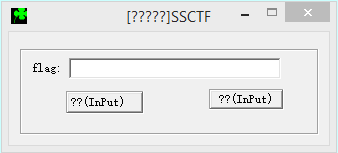
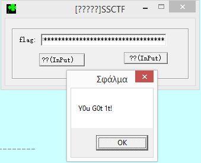

## SSCTF 2016 - Re3 (Reversing 300)
##### 26/02 - 28/02/2016 (48hr)
___


First we open program with CFF explorer. We see that is compressed with UPX. We download UPX 
and we decompress it. Then we open program in IDA pro.

### Analyzing the decoy

When we click the "input" button, the following code is invoked:
```assembly
.text:00401E60 loc_401E60:                             ; DATA XREF: Stack[00001470]:0018F59Co
.text:00401E60         push    ebp
.text:00401E61         mov     ebp, esp
.text:00401E63         push    0FFFFFFFFh
.text:00401E65         push    offset loc_417B98
.text:00401E6A         mov     eax, large fs:0
.text:00401E70         push    eax
.text:00401E71         mov     large fs:0, esp
.text:00401E78         sub     esp, 8
.text:00401E7B         push    esi
.text:00401E7C         push    edi
.text:00401E7D         mov     esi, ecx
.text:00401E7F         call    ds:IsDebuggerPresent
.text:00401E85         test    eax, eax
.text:00401E87         jz      short NO_DEBUGGER_401EA4
.text:00401E89         push    0
.text:00401E8B         push    offset Caption          ; "[ T-__-_--Lτ¦ά¦_-"
.text:00401E90         push    offset unk_41F194
.text:00401E95         push    0
.text:00401E97         call    ds:MessageBoxA
.text:00401E9D         push    0
.text:00401E9F         call    _exit
.text:00401EA4 ; ---------------------------------------------------------------------------
.text:00401EA4
.text:00401EA4 NO_DEBUGGER_401EA4:                     ; CODE XREF: .text:00401E87j
.text:00401EA4         mov     eax, off_41F3E0
.....
.text:00401EDB         popfw
.text:00401EDD         lea     ecx, [ebp-10h]
.text:00401EE0         push    ecx                     ; struct CString *
.text:00401EE1         lea     ecx, [esi+0ACh]         ; this
.text:00401EE7         call    ?GetWindowTextA@CWnd@@QBEXAAVCString@@@Z ; CWnd::GetWindowTextA(CString &)
.text:00401EEC         mov     edx, [ebp-10h]
.text:00401EEF         push    edx                     ; char *
.text:00401EF0         call    _atoi                   ; get password
.text:00401EF5         mov     edi, ds:MessageBoxA
.text:00401EFB         add     esp, 4
.text:00401EFE         cmp     eax, 92381221h          ; password should start with 2453148193
.text:00401F03         jnz     short BAD_BOY_401F47
.text:00401F05         push    ecx
.text:00401F06         lea     eax, [ebp-10h]
.text:00401F09         mov     ecx, esp
.text:00401F0B         mov     [ebp-14h], esp
.text:00401F0E         push    eax
.text:00401F0F         call    sub_4140E9
.text:00401F14         mov     ecx, esi
.text:00401F16         call    hash_flag_401990        ; hash_flag(char* flag)
.text:00401F1B         push    ecx                     ; unsigned __int8 *
.text:00401F1C         add     esi, 64h
.text:00401F1F         mov     ecx, esp
.text:00401F21         mov     [ebp-14h], esp
.text:00401F24         push    esi
.text:00401F25         call    sub_4140E9
.text:00401F2A         call    compare_flag_401DF0
.text:00401F2F         add     esp, 4
.text:00401F32         cmp     eax, 1
.text:00401F35         jnz     short BAD_BOY_401F47
.text:00401F37         push    0                       ; uType
.text:00401F39         push    offset Caption          ; "[ T-__-_--Lτ¦ά¦_-"
.text:00401F3E         push    offset Text             ; "-ή_χ+T!Y0u W1n"
.text:00401F43         push    0                       ; hWnd
.text:00401F45         call    edi ; MessageBoxA
.text:00401F47
.text:00401F47 BAD_BOY_401F47:                         ; CODE XREF: check_flag_401EC2+41j
.text:00401F47                                         ; check_flag_401EC2+73j
.text:00401F47         push    0                       ; uType
.text:00401F49         push    offset Caption          ; "[ T-__-_--Lτ¦ά¦_-"
.text:00401F4E         push    offset aPlsTryAg@in     ; "Pls Try  ag@in!"
.text:00401F53         push    0                       ; hWnd
.text:00401F55         call    edi ; MessageBoxA
.....
```

After we bypass the anti-debugger check at 0x00401E87, we enter to the actual flag verification
routine. Flag should start with `2453148193`. Then code enters `hash_flag_401990`, which generates
the MD5 hash of the flag. Then, `compare_flag_401DF0` compares the generated hash with this:
`4850B7446BBB20AAD140E7B0A964A57D`. If they are equal we get the good boy message.


However a quick look on [hashkiller.co.uk](https://hashkiller.co.uk/md5-decrypter.aspx) reveals
that this hash is already cracked:
```
4850b7446bbb20aad140e7b0a964a57d MD5 : sakjflks
```

Wait a minute! The flag that gives this hash is "sakjflks", but the it should start with
2453148193. That's odd, unless we're looking for a collision :P. 
Even we bypass the first check and give "sakjflks" as input, the generated hash will be
`4850B7446Bbb20aaD140E7b0A964A57d` (notice that some letters are lowercase). This is
because `hash_flag_401990` casts raw bytes to hex string using two different format
strings: `%02x` and `%02X`:
```C
    v7 = 0;
    do {
        if ( v7 % 2 )
            sub_40F7D0((int)&v10, &v19, *(&pbData + v7));   // v19 = "%02X"
        else
            sub_40F7D0((int)&v10, &v14, *(&pbData + v7));   // v14 = "%02x"
        
        CString::operator+=(&v10);
        ++v7;
    } while ( v7 < 16 );
```

Ok something is really odd here. It seems that this is a decoy... Fortunately we didn't waste
that much time on it :)


### Cracking the real code

So, if the previous code was just a decoy, where's the real code? We assume that the real code
will invoke `MessageBox` upon success, so we check the "XREFs to" (cross references to `MessageBox`):
```
Direction Type Address              Text                       
--------- ---- -------              ----                       
Up        r    check_flag_401EC2+33 mov     edi, ds:MessageBoxA
Up        p    check_flag_401EC2+83 call    edi ; MessageBoxA  
Up        p    check_flag_401EC2+93 call    edi ; MessageBoxA  
Up        p    sub_401BB0+1FA       call    ds:MessageBoxA     
Up        p    .text:00401E97       call    ds:MessageBoxA     
Up        p    sub_4159B3+B2        call    ds:MessageBoxA     
Up        r    sub_401BB0+1FA       call    ds:MessageBoxA     
Up        r    .text:00401E97       call    ds:MessageBoxA     
Up        r    sub_4159B3+B2        call    ds:MessageBoxA     
```

One of these XREFs leads to the real code.
```Assembly
.text:00401D84         mov     eax, [esp+64h+arg_0]
.text:00401D88         mov     ecx, [esp+64h+var_50]
.text:00401D8C         push    eax                     ; unsigned __int8 *
.text:00401D8D         push    ecx                     ; unsigned __int8 *
.text:00401D8E         call    __mbscmp                ; compare flags
.text:00401D93         add     esp, 14h
.text:00401D96         test    eax, eax
.text:00401D98         pop     edi
.text:00401D99         push    ebx                     ; uType
.text:00401D9A         push    ebx                     ; lpCaption
.text:00401D9B         jnz     short loc_401DA4
.text:00401D9D         lea     edx, [esp+5Ch+var_4C]
.text:00401DA1         push    edx
.text:00401DA2         jmp     short loc_401DA9
.text:00401DA4
.text:00401DA4 loc_401DA4:                             ; CODE XREF: sub_401BB0+1EBj
.text:00401DA4         lea     eax, [esp+5Ch+Text]
.text:00401DA8         push    eax                     ; lpText
.text:00401DA9
.text:00401DA9 loc_401DA9:                             ; CODE XREF: sub_401BB0+1F2j
.text:00401DA9         push    ebx                     ; hWnd
.text:00401DAA         call    ds:MessageBoxA
```

This code is at the end of `sub_401BB0`, which invoked from ` sub_401F80`, which in turn
is invoked from `sub_401FE0`, which is invoked from nowhere! That is there's a hidden
code pointer that invokes this function.


So from where the hell this function is invoked? If we take a look at the imported functions,
we'll notice something special: `ShowWindow`. When this function is invoked and the second
argument _nCmdShow_ is 0 (`SW_HIDE`), then it hides the window identified by the first argument
(_hWnd_). So, we set a breakpoint at `sub_41276E` (which is the only place that `ShowWindow` is
called):
```Assembly
.text:0041276E ; int __stdcall sub_41276E(int nCmdShow)
.text:0041276E nCmdShow= dword ptr  4
.text:0041276E
.text:0041276E         mov     eax, [ecx+38h]
.text:00412771         test    eax, eax
.text:00412773         jnz     short loc_412784
.text:00412775         push    [esp+nCmdShow]          ; nCmdShow
.text:00412779         push    dword ptr [ecx+1Ch]     ; hWnd
.text:0041277C         call    ds:ShowWindow
.text:00412782         jmp     short locret_412792
```

If we set a breakpoint here and we skip the call to `ShowWindow`, we will see a second
button appearing on the program!



So if we click the left button, we proper code is executed. First there's function
`sub_401740` that checks whether flag starts with `SSCTF{`, ends with `}` and is 0x27
characters long:
```C
 if ( *(_DWORD *)(a2 - 8) < 0x27u
    || *(_BYTE *)a2 != 83
    || *(_BYTE *)(a2 + 1) != 83
    || *(_BYTE *)(a2 + 2) != 67
    || *(_BYTE *)(a2 + 3) != 84
    || *(_BYTE *)(a2 + 4) != 70
    || *(_BYTE *)(a2 + 5) != 123
    || *(_BYTE *)(a2 + 38) != 125 )
  {
    // ...
    result = 0;
  }
  else
  {
    // ... 
    result = 1;
  }

  return result;
```

If we pass the first check, then `sub_401860` is invoked. First `_mbschr` is called to search
for "0" and it initializes v5 properly:
```C
  v5 = mbschr_wrapper_41458E(&a2, *(_DWORD *)(a2 - 8) ^ 0x10);
  v11 = v5;
  if ( v5 < 0 )
  {
    v5 = 3;
    v11 = 3;
  }
```

Then, it executes the following code:
```C
  v6 = *(_DWORD *)(a2 - 8) - DISPLACEMENT_41F130 - 2;
  if ( *(_DWORD *)(a2 - 8) > 0 )
  {
    do
    {
      v7 = v4[v3];
      v8 = 0;
      if ( v7 > 57 || v7 < 48 )
      {
        if ( v7 > 122 || v7 < 97 )
        {
          if ( v7 <= 90 && v7 >= 65 )
            v7 -= 65;
        }
        else
        {
          v7 -= 97;
          v8 = 1;
        }
        v9 = (v6 + v5 * v7) % 26 + ((v6 + v5 * v7) % 26 < 0 ? 0x1A : 0);
        if ( v8 )
        {
          if ( v8 == 1 )
            LOBYTE(v9) = v9 + 97;
        }
        else
        {
          LOBYTE(v9) = v9 + 65;
        }
        v4[v3] = v9;
        v5 = v11;
      }
      ++v3;
    }
    while ( v3 < *(_DWORD *)(a2 - 8) );
    v2 = v12;
  }
  CString::ReleaseBuffer((CString *)&a2, -1);
  sub_4143CB((CString *)((char *)v2 + 100), (int)&a2);
  CString::Empty((CString *)((char *)v2 + 96));
  sub_414374(&a2);
  return 1;
}
```

The above modifies password character by characters. Numbers remain intact, while
characters are "rotated" circularly, while their case is preserved. The above code
can be summarized into the following python script:
```Python
flag   = 'SSCTF{g5c760c64E867618gGfG48GeF92C4f5e}'
flag   = flag[6:-1]
output = ''

D = len(flag) - 7 - 2

v5 = flag.find('0')
if v5 == -1: v5 = 3


for ch in flag:
    if ch >= '0' and ch <= '9':
        output += ch
    else:
        if ch >= 'a' and ch <= 'z':
            output += chr( (D + v5 * (ord(ch) - ord('a'))) % 26 + ord('a') )
        else:
            output += chr( (D + v5 * (ord(ch) - ord('A'))) % 26 + ord('A') )

print 'SSCTF{' + output + '}'
```    

At the end, the generated flag is compared against the following hash: 
`b5h760h64R867618bBwB48BrW92H4w5r`. Algorithm is trivial to break. First we know that
numbers stay intact, so `v5 == 5` (the first '0' is at position 5). We also know that
`D == 23` as the flag must be 0x27 characters long (see `sub_401740`). Let's get the
flag:
```python
charmap = { }
for f in range(26):
    ch = (23 + 5 * f) % 26
    charmap[ chr(ch+0x61) ] = chr(f + 0x61)
    charmap[ chr(ch+0x41) ] = chr(f + 0x41)

flag = ''
for ch in 'b5h760h64R867618bBwB48BrW92H4w5r':
    if ch >= '0' and ch <= '9':
        flag += ch
    else:
        flag += charmap[ch]
    
print 'SSCTF{' + flag + '}'
```

Running the above code, gives us the flag: `SSCTF{g5c760c64E867618gGfG48GeF92C4f5e}`,
which is accepted by the program:



But not in the site. After some effort I found that D (0x41F130), is initialized at two different
points in the program. The first one initializes it to 7, but the second one:
```assembly
.text:00401594         mov     eax, large fs:30h
.text:0040159A         mov     al, [eax+2]
.text:0040159D         mov     [ebp+var_1], al
.text:004015A0         pop     eax
.text:004015A1         mov     dl, [ebp+var_1]
.text:004015A4         push    226h                    ; dwMilliseconds
.text:004015A9         neg     dl
.text:004015AB         sbb     edx, edx
.text:004015AD         and     edx, 5
.text:004015B0         add     edx, 2
.text:004015B3         mov     DISPLACEMENT_41F130, edx
```

It initializes D to 7 if debugger is present `(fs:30h -> +2) is 1/0 if debugger is present or not)` 
or to 2 if debugger is not. Therefore we set D to **28** instead of 23, and we re-run the code to get 
the correct flag: `SSCTF{f5b760b64D867618fFeF48FdE92B4e5d}`, which is accepted from the website :)

___