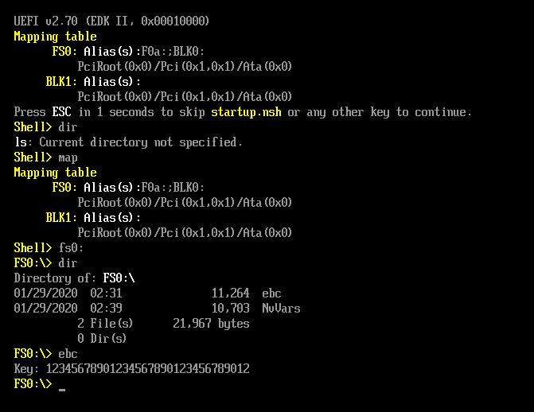
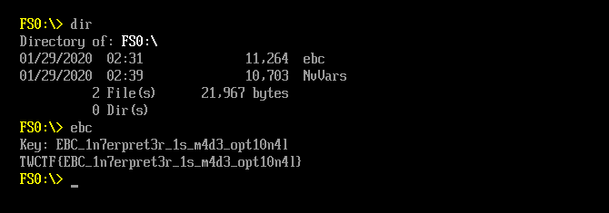

## TokyoWesterns CTF 5th 2019 - EBC (RE 232)
##### 31-02/09/2019 (48hr)
___

### Running the binary

As the name suggests, binary is in **EFI Byte Code (EBC)** format:
```
ispo@leet:~/ctf/tokyowesterns_ctf_2019/EBC$ file ebc
    ebc: PE32+ executable (DLL) (EFI application) EFI byte code, for MS Windows
```

The first challenge is to actually run the binary. First we download and build 
[EDK2](https://github.com/tianocore/edk2) with [OVMF](https://github.com/tianocore/tianocore.github.io/wiki/OVMF).
Unfortunately, build fails. However somewhere in the trace we see the following error:
```
/home/ispo/virtual/edk2/OvmfPkg/IoMmuDxe/AmdSevIoMmu.c:42:1: error: ‘mBusMasterOperationName’ defined but not used [-Werror=unused-const-variable=]
   42 | mBusMasterOperationName[EdkiiIoMmuOperationMaximum] = {
      | ^~~~~~~~~~~~~~~~~~~~~~~
```

So we open `edk2/OvmfPkg/IoMmuDxe/AmdSevIoMmu.c` and we comment out the declaration of
`mBusMasterOperationName`:
```c
#define COMMON_BUFFER_SIG SIGNATURE_64 ('C', 'M', 'N', 'B', 'U', 'F', 'F', 'R')

//
// ASCII names for EDKII_IOMMU_OPERATION constants, for debug logging.
//
//STATIC CONST CHAR8 * CONST
//mBusMasterOperationName[EdkiiIoMmuOperationMaximum] = {
//  "Read",
//  "Write",
//  "CommonBuffer",
//  "Read64",
//  "Write64",
//  "CommonBuffer64"
//};
```

After our small fix, build is successful, so we can launch OVMF:
```
ispo@leet:~/virtual$ qemu-system-x86_64 -m 4096 -bios edk2/Build/OvmfX64/RELEASE_GCC48/FV/OVMF.fd
```

The next step is to run the binary inside emulator. To do this, first we create a file (disk)
full of zeros:
```
ispo@leet:~/virtual$ dd if=/dev/zero of=foo.img count=50 bs=1M
```

Then we create a partition on this file (we stick to the default options):
```
ispo@leet:~/virtual$ fdisk foo.img

Welcome to fdisk (util-linux 2.34).
Changes will remain in memory only, until you decide to write them.
Be careful before using the write command.

Device does not contain a recognized partition table.
Created a new DOS disklabel with disk identifier 0x41c5ff7c.

Command (m for help): o
Created a new DOS disklabel with disk identifier 0xeec51ff0.

Command (m for help): n
Partition type
   p   primary (0 primary, 0 extended, 4 free)
   e   extended (container for logical partitions)
Select (default p): p
Partition number (1-4, default 1): 1
First sector (2048-102399, default 2048): 2048
Last sector, +/-sectors or +/-size{K,M,G,T,P} (2048-102399, default 102399): 102399

Created a new partition 1 of type 'Linux' and of size 49 MiB.

Command (m for help): t
Selected partition 1
Hex code (type L to list all codes): c
Changed type of partition 'Linux' to 'W95 FAT32 (LBA)'.

Command (m for help): w
The partition table has been altered.
Syncing disks.
```

Once we have the partition we create a FAT file system:
```
ispo@leet:~/virtual$ mkfs.vfat foo.img 
```

Then we mount it and we copy the **ebc** binary into it:
```
ispo@leet:~/virtual$ sudo mkdir /mnt/foo
ispo@leet:~/virtual$ sudo mount foo.img /mnt/foo/
ispo@leet:~/virtual$ sudo cp ~/ctf/tokyowesterns_ctf_2019/EBC/ebc /mnt/foo
```

Finally we start the emulator again, but this time we add the new disk that contains the binary:
```
ispo@leet:~/virtual$ qemu-system-x86_64 -drive file=/home/ispo/virtual/foo.img,format=raw -m 4096 -bios edk2/Build/OvmfX64/RELEASE_GCC48/FV/OVMF.fd
```



As you an see binary takes exactly **32** characters as a key and then program halts.
___


### Reversing the (main) binary

Unfortunately we have to deal with more issues, since IDA (version 6.8) fails to properly load the binary:
```assembly
.text:000000000040111C
.text:000000000040111C                                   public start
.text:000000000040111C                   start:
.text:000000000040111C
.text:000000000040111C                   arg_8           =  0x18
.text:000000000040111C                   arg_20          =  0x30
.text:000000000040111C
.text:000000000040111C                   ; FUNCTION CHUNK AT .text:0000000000401352 SIZE 00000002 BYTES
.text:000000000040111C
.text:000000000040111C 79 01 E0 0E                       MOVRELw     R1, unk_402000
.text:0000000000401120 72 89 41 10                       MOVnw       [R1], [SP+arg_8]
.text:0000000000401124 79 01 D8 0F                       MOVRELw     R1, aKey    ; "Key: "
.text:0000000000401124                   ; ---------------------------------------------------------------------------
.text:0000000000401128 6B                                db 0x6B ; k
.text:0000000000401129 01 83 10 D0 FE FF+                db 1, 0x83, 0x10, 0xD0, 0xFE, 2 dup(0xFF)
.text:0000000000401130 6C                                db 0x6C ; l
.text:0000000000401131 01 83 10 A8 FF FF+                db 1, 0x83, 0x10, 0xA8, 3 dup(0xFF)
.text:0000000000401138                   ; ---------------------------------------------------------------------------
.text:0000000000401138 79 01 BE 0F                       MOVRELw     R1, asc_4020F8+2 ; "\r\n"
```

This is a bug that got fixed in [version 7.4](https://www.hex-rays.com/products/ida/7.4/):
```
BUGFIX: EBC: IDA could fail to disassemble some EBC instructions
```

Ghidra doesn't seem to disassemble the binary either. Luckily there's the
[efivm](https://github.com/jagg-ix/efivm) which provides a disassembler and a (lame) emulator. 
After make, `tools/disas` provides a nice dissasembly listing. Radare2 can also disassemble the
binary, but we'll use [efivm](https://github.com/jagg-ix/efivm).

Before we start, the EFI Byte Code VM instruction manual is available
[here](https://uefi.org/sites/default/files/resources/UEFI%202_5.pdf) (Chapter 21, page 985).
Program starts from `efi_main()` and takes 2 arguments (register `R0` points at the beginning
of the stack):
```c
    IN EFI_HANDLE ImageHandle,
    IN EFI_SYSTEM_TABLE * SystemTable
```

The disassembly listing of the main binary (after my analysis is shown below):
```assembly

; --------------------------------------------------------------------------------------------------
; Function A: Print a string
; --------------------------------------------------------------------------------------------------
0x04006000: 79 01 fc 0f         MOVREL R1, 0x0ffc       ; R1 = 0x04006000+4 + 0xffc = 0x4007000
0x04006004: 20 91               MOVqw R1, @R1           ; R1 = *0x4007000 (8 bytes) = SystemTable
0x04006006: 72 91 85 21         MOVnw R1, @R1 (+5, +24) ; R1 = *(R1 +5*8 +24) = SystemTable.ConOut
0x0400600a: b5 08 10 00         PUSHn @R0 (+0, +16)     ; R0 + 16 (=arg0) on stack
0x0400600e: 35 01               PUSHn R1                ; 
0x04006010: 83 29 01 00 00 10   CALLEXa @R1 (+1, +0)    ; SystemTable.ConOut->OutputString(arg0)
0x04006016: 60 00 02 10         MOVqw R0, R0 (+2, +0)   ; R0 = R0 + 2*8 --> (pop arg from stack)
0x0400601a: 04 00               RET                     ; return value on R7

; --------------------------------------------------------------------------------------------------
; Function B: Decoy. We don't know and we don't care what it does
; --------------------------------------------------------------------------------------------------
0x0400601c: 56 66               XOR R6, R6              ;
0x0400601e: 20 63               MOVqw R3, R6            ;
0x04006020: 4a 64               NOT R4, R6              ;
0x04006022: 79 07 2a 10         MOVREL R7, 0x102a       ;
0x04006026: 6b 07               PUSH R7                 ;
0x04006028: 60 81 18 00         MOVqw R1, @R0 (+0, +24) ;
0x0400602c: 02 0a               JMP8 0x0a               ;
0x0400602e: 56 66               XOR R6, R6              ;
0x04006030: 77 33 08 00         MOVIqw R3, 0x0008       ;
0x04006034: 0a 64               NOT R4, R6              ;
0x04006036: 79 07 fc 0f         MOVREL R7, 0x0ffc       ;
0x0400603a: 6b 07               PUSH R7                 ;
0x0400603c: 60 81 18 00         MOVqw R1, @R0 (+0, +24) ;
0x04006040: 54 41               AND R1, R4              ;
0x04006042: 6b 01               PUSH R1                 ;
0x04006044: cc 67 04 00         ADD R7, R6 (0x0004)     ;
0x04006048: 79 05 ca 0f         MOVREL R5, 0x0fca       ;
0x0400604c: 20 81               MOVqw R1, @R0           ;
0x0400604e: 77 32 04 00         MOVIqw R2, 0x0004       ;
0x04006052: ce 32 f1 ff         MUL R2, R3 (0xfff1)     ;
0x04006056: 4b 22               NEG R2, R2              ;
0x04006058: 58 21               SHR R1, R2              ;
0x0400605a: 4c 11               ADD R1, R1              ;
0x0400605c: 6b 05               PUSH R5                 ;
0x0400605e: 4c 15               ADD R5, R1              ;
0x04006060: 1e df               MOVww @R7, @R5          ;
0x04006062: cc 67 02 00         ADD R7, R6 (0x0002)     ;
0x04006066: 6c 05               POP R5                  ;
0x04006068: d8 64 04 00         SHR R4, R6 (0x0004)     ;
0x0400606c: 54 48               AND @R0, R4             ; 
0x0400606e: cc 63 01 00         ADD R3, R6 (0x0001)     ;
0x04006072: 6f 03 10 00         CMPIgte R3, (0x0010)    ;
0x04006076: 82 ea               JMP8cc 0xea             ;
0x04006078: 6c 01               POP R1                  ;
0x0400607a: 83 10 80 ff ff ff   CALL R0 (0xffffff80)    ;
0x04006080: 6c 01               POP R1                  ;
0x04006082: 04 00               RET                     ;

; --------------------------------------------------------------------------------------------------
; Function C: Read a single key stroke from console input and store it at 0x04007010
; --------------------------------------------------------------------------------------------------
0x04006084: 79 01 78 0f         MOVREL R1, 0x0f78       ; R1 = 0x04006088 + 0x0f78 = 0x04007000
0x04006088: 20 91               MOVqw R1, @R1           ; R1 = *0x04007000 = SystemTable
0x0400608a: 72 91 63 10         MOVnw R1, @R1 (+3, +24) ; R1 = SystemTable.ConIn
0x0400608e: 77 32 00 00         MOVIqw R2, 0x0000       ; R2 = 0
0x04006092: 35 02               PUSHn R2                ; arg2: no diagnostics
0x04006094: 35 01               PUSHn R1                ; arg1: SystemTable.ConIn
0x04006096: 03 29               CALLEXa @R1             ; SystemTable.Reset(SystemTable.ConIn, 0)
0x04006098: 36 01               POPn R1                 ; (Reset the input device)
0x0400609a: 36 02               POPn R2                 ; (R1-R3 are preserved)

0x0400609c: 79 03 60 0f M       MOVREL R3, 0x0f60       ; R3 = 0x4007000
0x040060a0: 20 b3               MOVqw R3, @R3           ; R3 = *0x4007000 = SystemTable
0x040060a2: 72 b3 89 21         MOVnw R3, @R3 (+9, +24) ; R3 = SystemTable.BootServices
0x040060a6: 79 02 5e 0f         MOVREL R2, 0x0f5e       ; R2 = 0x040060aa + 0x0f5e = 0x04007008
0x040060aa: 35 02               PUSHn R2                ; arg3: 0x04007008 (Index)
0x040060ac: 60 11 02 10         MOVqw R1, R1 (+2, +0)   ; R1 = R1 +2*8 = SystemTable.ConOut (?)
0x040060b0: 35 01               PUSHn R1                ; arg2: SystemTable.ConOut (Event)
0x040060b2: 77 31 01 00         MOVIqw R1, 0x0001       ;
0x040060b6: 35 01               PUSHn R1                ; arg1: 1 (NumberOfEvents)
0x040060b8: 83 2b 89 01 00 10   CALLEXa @R3 (+9, +24)   ; SystemTable.BootServices->WaitForEvent()
0x040060be: 60 00 03 10         MOVqw R0, R0 (+3, +0)   ; pop 3 args from stack

; wait till a keystroke is pressed

0x040060c2: 79 01 3a 0f         MOVREL R1, 0x0f3a       ; R1 = 0x040060c6 + 0x0f3a = 0x04007000
0x040060c6: 20 91               MOVqw R1, @R1           ; R1 = *0x04007000 = SystemTable
0x040060c8: 72 91 63 10         MOVnw R1, @R1 (+3, +24) ; R1 = SystemTable.ConIn
0x040060cc: 79 02 40 0f         MOVREL R2, 0x0f40       ; R2 = 0x040060d0 + 0x0f40 = 0x04007010
0x040060d0: 35 02               PUSHn R2                ; 
0x040060d2: 35 01               PUSHn R1                ;
0x040060d4: 83 29 01 00 00 10   CALLEXa @R1 (+1, +0)    ; SystemTable.ConIn->ReadKeyStroke(SystemTable.ConIn, 0x04007010)
0x040060da: 36 01               POPn R1                 ; pop args
0x040060dc: 36 02               POPn R2                 ;
0x040060de: 04 00               RET                     ;

; --------------------------------------------------------------------------------------------------
; Function D: Read keystokes in a loop (with echo)
; --------------------------------------------------------------------------------------------------
0x040060e0: 77 33 00 00         MOVIqw R3, 0x0000       ; R3 = 0 = i
0x040060e4: 77 34 20 00         MOVIqw R4, 0x0020       ; R4 = 32

0x040060e8: 6b 03               PUSH R3                 ;
0x040060ea: 6b 04               PUSH R4                 ; (these are not args; just preserve regs)
0x040060ec: 83 10 92 ff ff ff   CALL R0 (0xffffff92)    ; func_C()
0x040060f2: 6c 04               POP R4                  ;
0x040060f4: 6c 03               POP R3                  ; 
0x040060f6: 79 01 18 0f         MOVREL R1, 0x0f18       ; R1 = 0x040060fa + 0x0f18 = 0x04007012 (?)
0x040060fa: 6b 01               PUSH R1                 ;
0x040060fc: 83 10 fe fe ff ff   CALL R0 (0xfffffefe)    ; func_A(0x04007012) (echo key back)
0x04006102: 6c 01               POP R1                  ;
0x04006104: 79 01 0a 0f         MOVREL R1, 0x0f0a       ; R1 = 0x04006108 + 0x0f0a = 0x04007012
0x04006108: 79 02 76 0f         MOVREL R2, 0x0f76       ; R2 = 0x0400610c + 0x0f76 = 0x04007082
0x0400610c: 4c 32               ADD R2, R3              ; R2 += i
0x0400610e: 1d 9a               MOVbw @R2, @R1          ; *(0x04007082 + i) = *0x04007012 (move char)
0x04006110: 77 31 01 00         MOVIqw R1, 0x0001       ; R1 = 1
0x04006114: 4c 13               ADD R3, R1              ; ++R3
0x04006116: 45 43               CMPeq R3, R4            ; R3 == R4 (32) ?
0x04006118: 82 e7               JMP8cc 0xe7             ; jump to 0x040060e8 if CMP was false (cc)
0x0400611a: 04 00               RET                     ;

; --------------------------------------------------------------------------------------------------
; efi_main():
;
; (R0 points to the top of the stack (SP))
;   IN EFI_HANDLE ImageHandle,
;   IN EFI_SYSTEM_TABLE * SystemTable
; --------------------------------------------------------------------------------------------------
0x0400611c: 79 01 e0 0e         MOVREL R1, 0x0ee0       ; R1 = 0x0400611c+4 + 0x0ee0 = 0x04007000
0x04006120: 72 89 41 10         MOVnw @R1, @R0 (+1, +16); *0x04007000 = *(SP +1*8 +16) = EFI_SYSTEM_TABLE
0x04006124: 79 01 d8 0f         MOVREL R1, 0x0fd8       ; R1 = 0x04006128 + 0x0fd8 = 0x04007100
0x04006128: 6b 01               PUSH R1                 ; arg1: 0x04007100 = & "Key:"
0x0400612a: 83 10 d0 fe ff ff   CALL R0 (0xfffffed0)    ; func_A("Key: ") (cdelc)
                                                        ; (register operand in call always ignored)
0x04006130: 6c 01               POP R1                  ; -
0x04006132: 83 10 a8 ff ff ff   CALL R0 (0xffffffa8)    ; func_D() read with echo
0x04006138: 79 01 be 0f         MOVREL R1, 0x0fbe       ; R1 = 0x0400613c + 0x0fbe = 0x04070fc
0x0400613c: 6b 01               PUSH R1                 ; arg1: 0x04070fc = "\r\n"
0x0400613e: 83 10 bc fe ff ff   CALL R0 (0xfffffebc)    ; func_A("\r\n")
0x04006144: 6c 01               POP R1                  ;

; -----------------------------------------------------------------------------
; Decrypt payload stage 1
;
; XOR-decode of payload at 0x04007114. Size is 0x2c0.
; Write results to 0x04006354 an call it
; -----------------------------------------------------------------------------
0x04006146: 79 02 ca 0f         MOVREL R2, 0x0fca       ; R2 = 0x0400614a + 0x0fca = 0x04007114 = A
0x0400614a: 79 03 06 02         MOVREL R3, 0x0206       ; R3 = 0x0400614e + 0x0206 = 0x04006354 = CODE
0x0400614e: 79 04 ba 0f         MOVREL R4, 0x0fba       ; R4 = 0x04006152 + 0x0fba = 0x0400710c
0x04006152: 20 c4               MOVqw R4, @R4           ; R4 = *0x0400710c = 0x2c0 = len(A)
0x04006154: 77 35 00 00         MOVIqw R5, 0x0000       ; R5 = 0
0x04006158: 79 06 1e 0f         MOVREL R6, 0x0f1e       ; R6 = 0x0400615c + 0x0f1e = 0x0400707A = xor-key
0x0400615c: 1f e6               MOVdw R6, @R6           ; R6 = *0x0400707A = 0x06D35BCD

0x0400615e: 1f a1               MOVdw R1, @R2           ; R1 = *(0x04007114 + i) = c
0x04006160: 16 61               XOR R1, R6              ; R1 = 0x16D1DAAD ^ 0x06D35BCD = 0x10028160
0x04006162: 1f 1b               MOVdw @R3, R1           ; CODE[i] = c ^ key
0x04006164: 77 31 04 00         MOVIqw R1, 0x0004       ; R1 = 4 (next DWORD)
0x04006168: 4c 12               ADD R2, R1              ; R2 += 4
0x0400616a: 4c 13               ADD R3, R1              ; R3 += 4
0x0400616c: 4c 15               ADD R5, R1              ; R5 += 4
0x0400616e: 45 54               CMPeq R4, R5            ; 
0x04006170: 82 f6               JMP8cc 0xf6             ; jump to 0x04006172 - ~(0xf6+1)*2 = 0x0400615e

0x04006172: 79 01 0c 0f         MOVREL R1, 0x0f0c       ; R1 = 0x04006176 + 0x0f0c = 0x04007082
0x04006176: 20 91               MOVqw R1, @R1           ; R1 = *0x04007082 
0x04006178: 6b 01               PUSH R1                 ; arg1: first part of the key
0x0400617a: 83 10 d4 01 00 00   CALL R0 (0x000001d4)    ; call payload (0x04006354)
0x04006180: 6c 01               POP R1                  ;
0x04006182: 77 31 01 00         MOVIqw R1, 0x0001       ; R1 = 1
0x04006186: 45 71               CMPeq R1, R7            ; 1 == return value ?
0x04006188: 81 90 c4 01 00 00   JMPcc R0 (0x000001c4)   ; if not goto to (0x0400618e +0x01c4 =RET)

; -----------------------------------------------------------------------------
; Now, update XOR key
;
; xor-key = CRC32(first 8 characters from the key)
; -----------------------------------------------------------------------------
0x0400618e: 79 03 6e 0e         MOVREL R3, 0x0e6e       ; R3 = 0x04006192 + 0x0e6e = 0x04007000
0x04006192: 20 b3               MOVqw R3, @R3           ; R3 = *0x4007000 = SystemTable
0x04006194: 72 b3 89 21         MOVnw R3, @R3 (+9, +24) ; R3 = SystemTable.BootServices
0x04006198: 79 01 de 0e         MOVREL R1, 0x0ede       ; R1 = 0x0400619c + 0x0ede = 0x0400707a
0x0400619c: 35 01               PUSHn R1                ; arg3: 0x0400707a (Crc32 OUT)
0x0400619e: 77 31 08 00         MOVIqw R1, 0x0008       ; 
0x040061a2: 35 01               PUSHn R1                ; arg2: 8 (data size)
0x040061a4: 79 01 da 0e         MOVREL R1, 0x0eda       ; R1 = 0x040061a8 + 0x0eda = 0x04007082
0x040061a8: 35 01               PUSHn R1                ; arg1: 0x04007082 = first characters from key
0x040061aa: 83 2b 28 18 00 20   CALLEXa @R3 (+40, +24)  ; SystemTable.BootServices->CalculateCrc32()
0x040061b0: 60 00 03 10         MOVqw R0, R0 (+3, +0)   ;

; -----------------------------------------------------------------------------
; Decrypt payload stage 2
;
; The exact same process with stage 1. But:
; Encoded payload at: 0x040073dc with size 0x760
; -----------------------------------------------------------------------------
0x040061b4: 79 02 24 12         MOVREL R2, 0x1224       ; R2 = 0x040061b8 + 0x1224 = 0x040073dc = B
0x040061b8: 79 03 98 01         MOVREL R3, 0x0198       ; R3 = 0x040061bc + 0x0198 = 0x04006354
0x040061bc: 79 04 14 12         MOVREL R4, 0x1214       ; R4 = 0x040061c0 + 0x1214 = 0x040073d4
0x040061c0: 20 c4               MOVqw R4, @R4           ; R4 = *0x040073d4 = 0x760 = len(B)
0x040061c2: 77 35 00 00         MOVIqw R5, 0x0000       ; 
0x040061c6: 79 06 b0 0e         MOVREL R6, 0x0eb0       ;
0x040061ca: 1f e6               MOVdw R6, @R6           ;

0x040061cc: 1f a1               MOVdw R1, @R2           ;
0x040061ce: 16 61               XOR R1, R6              ;
0x040061d0: 1f 1b               MOVdw @R3, R1           ;
0x040061d2: 77 31 04 00         MOVIqw R1, 0x0004       ;
0x040061d6: 4c 12               ADD R2, R1              ; 
0x040061d8: 4c 13               ADD R3, R1              ;
0x040061da: 4c 15               ADD R5, R1              ;
0x040061dc: 45 54               CMPeq R4, R5            ;
0x040061de: 82 f6               JMP8cc 0xf6             ;

0x040061e0: 79 01 a6 0e         MOVREL R1, 0x0ea6       ; R1 = 0x040061e4 + 0x0ea6 = 0x0400708a
0x040061e4: 20 91               MOVqw R1, @R1           ; R1 = *(0x04007082 + 8) = key[8:]
0x040061e6: 6b 01               PUSH R1                 ;
0x040061e8: 83 10 66 01 00 00   CALL R0 (0x00000166)    ; call payload (0x04006354)
0x040061ee: 6c 01               POP R1                  ;

0x040061f0: 77 31 01 00         MOVIqw R1, 0x0001       ; update xor-key
0x040061f4: 45 71               CMPeq R1, R7            ;
0x040061f6: 81 90 56 01 00 00   JMPcc R0 (0x00000156)   ;
0x040061fc: 79 03 00 0e         MOVREL R3, 0x0e00       ;
0x04006200: 20 b3               MOVqw R3, @R3           ;
0x04006202: 72 b3 89 21         MOVnw R3, @R3 (+9, +24) ;
0x04006206: 79 01 70 0e         MOVREL R1, 0x0e70       ;
0x0400620a: 35 01               PUSHn R1                ; 
0x0400620c: 77 31 08 00         MOVIqw R1, 0x0008       ;
0x04006210: 35 01               PUSHn R1                ;
0x04006212: 79 01 74 0e         MOVREL R1, 0x0e74       ;
0x04006216: 35 01               PUSHn R1                ;
0x04006218: 83 2b 28 18 00 20   CALLEXa @R3 (+40, +24)  ;
0x0400621e: 60 00 03 10         MOVqw R0, R0 (+3, +0)   ;

; -----------------------------------------------------------------------------
; Decrypt payload stage 3
;
; The exact same process with stages 1 and 2. But:
; Encoded payload at: 0x04007b44 with size 0x830
; -----------------------------------------------------------------------------
0x04006222: 79 02 1e 19         MOVREL R2, 0x191e       ; R2 = 0x04006226 + 0x191e = 0x04007b44 = C
0x04006226: 79 03 2a 01         MOVREL R3, 0x012a       ; R3 = 0x0400622a + 0x012a = 0x04006354
0x0400622a: 79 04 0e 19         MOVREL R4, 0x190e       ; R4 = 0x0400622e + 0x190e = 0x04007b3c
0x0400622e: 20 c4               MOVqw R4, @R4           ; R4 = *0x04007b3c = 0x830 = len(C)
0x04006230: 77 35 00 00         MOVIqw R5, 0x0000       ; R5 = 0
0x04006234: 79 06 42 0e         MOVREL R6, 0x0e42       ; R6 = 0x04006238 + 0x0e42 = 0x0400707a
0x04006238: 1f e6               MOVdw R6, @R6           ; R6 = *0x0400707a = 0x6D35BCD

0x0400623a: 1f a1               MOVdw R1, @R2           ;
0x0400623c: 16 61               XOR R1, R6              ;
0x0400623e: 1f 1b               MOVdw @R3, R1           ;
0x04006240: 77 31 04 00         MOVIqw R1, 0x0004       ;
0x04006244: 4c 12               ADD R2, R1              ;
0x04006246: 4c 13               ADD R3, R1              ;
0x04006248: 4c 15               ADD R5, R1              ;
0x0400624a: 45 54               CMPeq R4, R5            ;
0x0400624c: 82 f6               JMP8cc 0xf6             ;

0x0400624e: 79 01 40 0e         MOVREL R1, 0x0e40       ;
0x04006252: 20 91               MOVqw R1, @R1           ;
0x04006254: 6b 01               PUSH R1                 ;
0x04006256: 83 10 f8 00 00 00   CALL R0 (0x000000f8)    ;
0x0400625c: 6c 01               POP R1                  ;
0x0400625e: 77 31 01 00         MOVIqw R1, 0x0001       ;
0x04006262: 45 71               CMPeq R1, R7            ;
0x04006264: 82 76               JMP8cc 0x76             ;

0x04006266: 79 03 96 0d         MOVREL R3, 0x0d96       ;
0x0400626a: 20 b3               MOVqw R3, @R3           ;
0x0400626c: 72 b3 89 21         MOVnw R3, @R3 (+9, +24) ;
0x04006270: 79 01 06 0e         MOVREL R1, 0x0e06       ;
0x04006274: 35 01               PUSHn R1                ;
0x04006276: 77 31 08 00         MOVIqw R1, 0x0008       ;
0x0400627a: 35 01               PUSHn R1                ;
0x0400627c: 79 01 12 0e         MOVREL R1, 0x0e12       ;
0x04006280: 35 01               PUSHn R1                ;
0x04006282: 83 2b 28 18 00 20   CALLEXa @R3 (+40, +24)  ;
0x04006288: 60 00 03 10         MOVqw R0, R0 (+3, +0)   ;

; -----------------------------------------------------------------------------
; Decrypt payload stage 4
;
; The exact same process with stages 1, 2 and 3. But:
; Encoded payload at: 0x0400837c with size 0x930
;
; Also decoded payload takes 2 arguments:
;   1) the last 8 characters from key
;   2) the CRC32 of the last 8 characters of the key
; -----------------------------------------------------------------------------
0x0400628c: 79 02 ec 20         MOVREL R2, 0x20ec       ; R2 = 0x04006290 + 0x20ec = 0x0400837c = D
0x04006290: 79 03 c0 00         MOVREL R3, 0x00c0       ; R3 = 0x04006294 + 0x00c0 = 0x04006354
0x04006294: 79 04 dc 20         MOVREL R4, 0x20dc       ; R4 = 0x04006298 + 0x20dc = 0x04008374
0x04006298: 20 c4               MOVqw R4, @R4           ; R4 = *0x04008374 = 0x930 = len(D)
0x0400629a: 77 35 00 00         MOVIqw R5, 0x0000       ;
0x0400629e: 79 06 d8 0d         MOVREL R6, 0x0dd8       ;
0x040062a2: 1f e6               MOVdw R6, @R6           ;
0x040062a4: 1f a1               MOVdw R1, @R2           ;

0x040062a6: 16 61               XOR R1, R6              ;
0x040062a8: 1f 1b               MOVdw @R3, R1           ;
0x040062aa: 77 31 04 00         MOVIqw R1, 0x0004       ;
0x040062ae: 4c 12               ADD R2, R1              ;
0x040062b0: 4c 13               ADD R3, R1              ;
0x040062b2: 4c 15               ADD R5, R1              ;
0x040062b4: 45 54               CMPeq R4, R5            ;
0x040062b6: 82 f6               JMP8cc 0xf6             ;

0x040062b8: 79 03 44 0d         MOVREL R3, 0x0d44       ; update CRC32 using the last 8 characters
0x040062bc: 20 b3               MOVqw R3, @R3           ; from the key
0x040062be: 72 b3 89 21         MOVnw R3, @R3 (+9, +24) ;
0x040062c2: 79 01 b4 0d         MOVREL R1, 0x0db4       ;
0x040062c6: 35 01               PUSHn R1                ;
0x040062c8: 77 31 08 00         MOVIqw R1, 0x0008       ;
0x040062cc: 35 01               PUSHn R1                ;
0x040062ce: 79 01 c8 0d         MOVREL R1, 0x0dc8       ;
0x040062d2: 35 01               PUSHn R1                ;
0x040062d4: 83 2b 28 18 00 20   CALLEXa @R3 (+40, +24)  ;
0x040062da: 60 00 03 10         MOVqw R0, R0 (+3, +0)   ;

0x040062de: 79 01 98 0d         MOVREL R1, 0x0d98       ; R1 = 0x040062e2 + 0x0d98 = 0x0400707a = key
0x040062e2: 77 32 00 00         MOVIqw R2, 0x0000       ; R2 = 0
0x040062e6: 1f 92               MOVdw R2, @R1           ; R2 = *0x0400707a = 0x6D35BCD
0x040062e8: 35 02               PUSHn R2                ; arg2: latest key's CRC32
0x040062ea: 79 01 ac 0d         MOVREL R1, 0x0dac       ; R1 = 0x040062ee + 0x0dac = 0x0400709a
0x040062ee: 20 91               MOVqw R1, @R1           ; R1 = *0x0400709a
0x040062f0: 6b 01               PUSH R1                 ;
0x040062f2: 83 10 5c 00 00 00   CALL R0 (0x0000005c)    ; 0x040062f8 + 0x5c = 0x04006354
0x040062f8: 60 00 02 10         MOVqw R0, R0 (+2, +0)   ; 

0x040062fc: 77 31 01 00         MOVIqw R1, 0x0001       ; R1 = 1
0x04006300: 45 71               CMPeq R1, R7            ; rval == 1 ?
0x04006302: 82 27               JMP8cc 0x27             ; 0x04006304 + 0x27*2 = 0x04006352 (exit)

; -----------------------------------------------------------------------------
; If you reach this point key is correct
; -----------------------------------------------------------------------------
0x04006304: 79 02 7a 0d         MOVREL R2, 0x0d7a       ; R2 = 0x04006308 + 0x0d7a = 0x04007082
0x04006308: 79 03 96 0d         MOVREL R3, 0x0d96       ; R3 = 0x0400630c + 0x0d96 = 0x040070a2
0x0400630c: 77 34 00 00         MOVIqw R4, 0x0000       ; R4 = 0
0x04006310: 77 35 20 00         MOVIqw R5, 0x0020       ; R5 = 32

0x04006314: 1d ab               MOVbw @R3, @R2          ; *(0x040070a2 + j) = *(0x04007082 + i)
0x04006316: 77 31 01 00         MOVIqw R1, 0x0001       ; R1 = 1
0x0400631a: 4c 12               ADD R2, R1              ; ++R2
0x0400631c: 4c 14               ADD R4, R1              ; ++R4
0x0400631e: 77 31 02 00         MOVIqw R1, 0x0002       ;
0x04006322: 4c 13               ADD R3, R1              ; R3 += 2
0x04006324: 45 54               CMPeq R4, R5            ; i += 1, j += 2
0x04006326: 82 f6               JMP8cc 0xf6             ; cast key to unicode ?

0x04006328: 79 01 be 0d         MOVREL R1, 0x0dbe       ; R1 = 0x0400632c + 0x0dbe = 0x40070EA
0x0400632c: 6b 01               PUSH R1                 ; arg1: "TWCTF{"
0x0400632e: 83 10 cc fc ff ff   CALL R0 (0xfffffccc)    ; func_A("TWCTF{")
0x04006334: 6c 01               POP R1                  ;
0x04006336: 79 01 68 0d         MOVREL R1, 0x0d68       ; R1 = 0x0400633a + 0x0d68 = 0x040070a2
0x0400633a: 6b 01               PUSH R1                 ;
0x0400633c: 83 10 be fc ff ff   CALL R0 (0xfffffcbe)    ; func_A(key) (unicode)
0x04006342: 6c 01               POP R1                  ;
0x04006344: 79 01 b0 0d         MOVREL R1, 0x0db0       ; R1 = 0x04006348 + 0x0db0 = 0x40070f8
0x04006348: 6b 01               PUSH R1                 ;
0x0400634a: 83 10 b0 fc ff ff   CALL R0 (0xfffffcb0)    ; func_A("}")
0x04006350: 6c 01               POP R1                  ;
0x04006352: 04 00               RET                     ;
0x04006354: 00 00               BREAK 0                 ;
0x04006356: 00 00               BREAK 0                 ;
; --------------------------------------------------------------------------------------------------
; End
; --------------------------------------------------------------------------------------------------
```

The following data structs were used during reversing:
```c
typedef struct {
    EFI_TABLE_HEADER Hdr;
    uint16_t *FirmwareVendor;
    uint32_t FirmwareRevision;
    EFI_HANDLE ConsoleInHandle;
    EFI_SIMPLE_TEXT_INPUT_PROTOCOL *ConIn;
    EFI_HANDLE ConsoleOutHandle;
    EFI_SIMPLE_TEXT_OUTPUT_PROTOCOL *ConOut;
    EFI_HANDLE StandardErrorHandle;
    EFI_SIMPLE_TEXT_OUTPUT_PROTOCOL *StdErr;
    EFI_RUNTIME_SERVICES *RuntimeServices;
    EFI_BOOT_SERVICES *BootServices;
    uintptr_t NumberOfTableEntries;
    EFI_CONFIGURATION_TABLE *ConfigurationTable;
} EFI_SYSTEM_TABLE;

typedef struct {        // size is 24 bytes so indexing like "@R1 (+3, +24)"" skips header
    uint64_t Signature;
    uint32_t Revision;
    uint32_t HeaderSize;
    uint32_t CRC32;
    uint32_t Reserved;
} EFI_TABLE_HEADER;

///
/// EFI Boot Services Table.
///
typedef struct {
    ///
    /// The table header for the EFI Boot Services Table.
    ///
    EFI_TABLE_HEADER                Hdr;

    //
    // Task Priority Services
    //
    EFI_RAISE_TPL                   RaiseTPL;
    EFI_RESTORE_TPL                 RestoreTPL;

    //
    // Memory Services
    //
    EFI_ALLOCATE_PAGES              AllocatePages;
    EFI_FREE_PAGES                  FreePages;
    EFI_GET_MEMORY_MAP              GetMemoryMap;
    EFI_ALLOCATE_POOL               AllocatePool;
    EFI_FREE_POOL                   FreePool;

    //
    // Event & Timer Services
    //
    EFI_CREATE_EVENT                  CreateEvent;
    EFI_SET_TIMER                     SetTimer;
    EFI_WAIT_FOR_EVENT                WaitForEvent;
    EFI_SIGNAL_EVENT                  SignalEvent;
    EFI_CLOSE_EVENT                   CloseEvent;
    EFI_CHECK_EVENT                   CheckEvent;

    //
    // Protocol Handler Services
    //
    EFI_INSTALL_PROTOCOL_INTERFACE    InstallProtocolInterface;
    EFI_REINSTALL_PROTOCOL_INTERFACE  ReinstallProtocolInterface;
    EFI_UNINSTALL_PROTOCOL_INTERFACE  UninstallProtocolInterface;
    EFI_HANDLE_PROTOCOL               HandleProtocol;
    VOID                              *Reserved;
    EFI_REGISTER_PROTOCOL_NOTIFY      RegisterProtocolNotify;
    EFI_LOCATE_HANDLE                 LocateHandle;
    EFI_LOCATE_DEVICE_PATH            LocateDevicePath;
    EFI_INSTALL_CONFIGURATION_TABLE   InstallConfigurationTable;

    //
    // Image Services
    //
    EFI_IMAGE_LOAD                    LoadImage;
    EFI_IMAGE_START                   StartImage;
    EFI_EXIT                          Exit;
    EFI_IMAGE_UNLOAD                  UnloadImage;
    EFI_EXIT_BOOT_SERVICES            ExitBootServices;

    //
    // Miscellaneous Services
    //
    EFI_GET_NEXT_MONOTONIC_COUNT      GetNextMonotonicCount;
    EFI_STALL                         Stall;
    EFI_SET_WATCHDOG_TIMER            SetWatchdogTimer;

    //
    // DriverSupport Services
    //
    EFI_CONNECT_CONTROLLER            ConnectController;
    EFI_DISCONNECT_CONTROLLER         DisconnectController;

    //
    // Open and Close Protocol Services
    //
    EFI_OPEN_PROTOCOL                 OpenProtocol;
    EFI_CLOSE_PROTOCOL                CloseProtocol;
    EFI_OPEN_PROTOCOL_INFORMATION     OpenProtocolInformation;

    //
    // Library Services
    //
    EFI_PROTOCOLS_PER_HANDLE          ProtocolsPerHandle;
    EFI_LOCATE_HANDLE_BUFFER          LocateHandleBuffer;
    EFI_LOCATE_PROTOCOL               LocateProtocol;
    EFI_INSTALL_MULTIPLE_PROTOCOL_INTERFACES    InstallMultipleProtocolInterfaces;
    EFI_UNINSTALL_MULTIPLE_PROTOCOL_INTERFACES  UninstallMultipleProtocolInterfaces;

    //
    // 32-bit CRC Services
    //
    EFI_CALCULATE_CRC32               CalculateCrc32;

    //
    // Miscellaneous Services
    //
    EFI_COPY_MEM                      CopyMem;
    EFI_SET_MEM                       SetMem;
    EFI_CREATE_EVENT_EX               CreateEventEx;
} EFI_BOOT_SERVICES;
```

The above code essentially decodes and executes a 4-stage payload. Each stage checks 8 bytes from
the key. A simple XOR enryption is used with a 32-bit key. After the successful execution of each
stage, the key is updated using the crc32 checksum of the 8 characters of the key. The only
exception is the last stage where the key and its crc32 are passed to the payload. If any
stage of the payload fails, program aborts. At the end if the key is valid, it gets
surrounded with `TWCTF{}` and it's echoed back to the console.


From the above code we can get the encrypted payloads. However we only know the first XOR-key
`0x06D35BCD`, so we can decode the first payload:
```
0x16D1DAAD, 0x2E21693A, 0x736BCE3B, 0x3524E090, 0xC0A02046, 0xD5D973A3, 0x57866F3A, 0x55DE06A5,
0x33244037, 0xD4DB6898, 0xA44F167E, 0x57E76D3A, 0x0B50E932, 0x3124F0C7, 0xE5BAF0F0, 0x6182D8F4,
0x579E3A81, 0x547D6C3A, 0x9E179079, 0x778581DF, 0x77853A80, 0x279E7A81, 0x6B39683A, 0xE091410B,
0x7785133D, 0x67853A80, 0x379E0A81, 0x17990A81, 0x9C4C6D3A, 0xFFF11A10, 0x778518CE, 0x33247A80,
0x46149A94, 0xE67A1DBA, 0x779E1A80, 0xF32E6D3A, 0xAD2F2DD5, 0x17990325, 0x78BA6D3A, 0x97686D75,
0x579F6ACA, 0x479E4A86, 0x5A196D3A, 0x6BE3C434, 0x6785B635, 0x479F7A80, 0x32246A9B, 0x767B7AD6,
0x9250AE85, 0x679E1A9B, 0x38F96D3A, 0x50712E38, 0x779EEA61, 0x1D796E3A, 0xB09CC3D0, 0x2785B348,
0x30246A80, 0x4BF2EB06, 0x0BB335C6, 0x57856A81, 0xA0B76C3A, 0x4A86D4B5, 0x179924C6, 0xCD066C3A,
0x3DE6E06D, 0x6785C64F, 0xEE5B6D3A, 0x3D1762C7, 0x6785FE18, 0x897C6D3A, 0x15525820, 0x779EB395,
0xF8EC683A, 0xD7D5FFB6, 0x379EB2B7, 0x30244A87, 0x37663668, 0x143AD8D0, 0x17984A87, 0x88546F3A,
0xF497D717, 0x779EB522, 0x31242A81, 0xDEBD5A2D, 0xDF25E76A, 0x679E1A80, 0x213B6D3A, 0xF1800409,
0x479E96CA, 0x46ED6F3A, 0xD122F77A, 0x479F81BA, 0x7F8A6E3A, 0xF09F73BD, 0x779E3137, 0x31241A81,
0x8D21E2C2, 0xC7724632, 0x279E4A86, 0x30243A81, 0x93725982, 0x91B70895, 0x17996A9B, 0x279F0A9B,
0x17992A9B, 0x342E6E3A, 0x2616AF14, 0x579F6D5E, 0x34241A80, 0xCB8DF1EB, 0x983E2DFA, 0x30244A86,
0x643FCDB5, 0x7D285A92, 0x17984A87, 0x37853A81, 0xFBDA6D3A, 0xFA20E933, 0x1799720C, 0x0C0E683A,
0xE9BC01C7, 0x279F446A, 0x31240A80, 0x5A93FE0A, 0xB04D7676, 0x17990A9B, 0x779E4A86, 0x57856A81,
0x30247A81, 0xE98B6BD0, 0x2518F090, 0x579E1A81, 0x579E1A9B, 0x579E0A81, 0x17981A80, 0xCF16693A,
0x4C81FF67, 0x3785CA94, 0xD47C683A, 0xA32602DA, 0x1798F662, 0xD6A9693A, 0x8EA734DE, 0x379FD6DF,
0xBFB66F3A, 0x384B5C1C, 0x378541FE, 0xF68B6D3A, 0x72200C2A, 0x379E648B, 0x7D5F683A, 0xE5E23E8C,
0x4785B2C6, 0x26556E3A, 0x09CAEC23, 0x6785DF48, 0x33246A81, 0x56968D03, 0x76EBF69F, 0x47850A9B,
0x32240A81, 0xD03011F7, 0x76ECCE73, 0x479E7A81, 0x779F2A80, 0x579E1A81, 0xFC3E6C3A, 0xFACA6BFF,
0x7796DB6A, 0x37A4584F, 0x04D15BCC, 0x06D36ABA, 0x06D74CED, 0x14C573F9, 0xC9F6A325, 0x73052A56
```

We use [ebc_decode_payload.py](./ebc_decode_payload.py) script to do the decoding. The idea is to
write the decoded payload at address `0x04006354` on the binary, and feed it again to
[efivm](https://github.com/jagg-ix/efivm). Let's see the [first](./payload_stage_1.asm) stage of
the payload:
```assembly
; --------------------------------------------------------------------------------------------------
; Decoded payload, stage 1
; --------------------------------------------------------------------------------------------------
0x04006354: 60 81 02 10                     MOVqw R1, @R0 (+2, +0)          ; arg1
0x04006358: f7 32 f2 28 f6 95 b8 75 5d bb   MOVIqq R2, 0xbb5d75b895f628f2   ;
0x04006362: f7 33 8b 7b 73 c6 6e 28 0a d3   MOVIqq R3, 0xd30a286ec6737b8b   ;
0x0400636c: f7 34 55 51 68 5d 0d 53 fa 1b   MOVIqq R4, 0x1bfa530d5d685155   ;
0x04006376: f7 35 55 33 08 d2 b3 4d 9c a2   MOVIqq R5, 0xa29c4db3d2083355   ;
0x04006380: f7 36 34 51 ff b2 83 0d 0a ab   MOVIqq R6, 0xab0a0d83b2ff5134   ;
0x0400638a: f7 37 3d ab 69 e3 39 83 51 67   MOVIqq R7, 0x67518339e369ab3d   ;
0x04006394: 4c 61                           ADD R1, R6                      ;
0x04006396: 4d 51                           SUB R1, R5                      ;
0x04006398: f7 37 ae 52 b4 cb c4 98 12 da   MOVIqq R7, 0xda1298c4cbb452ae   ;
0x040063a2: 56 71                           XOR R1, R7                      ;
0x040063a4: 4d 61                           SUB R1, R6                      ;
0x040063a6: 56 71                           XOR R1, R7                      ;
0x040063a8: 4c 21                           ADD R1, R2                      ;
0x040063aa: 4d 21                           SUB R1, R2                      ;
0x040063ac: f7 33 ea 6d c6 1a 42 e6 f0 48   MOVIqq R3, 0x48f0e6421ac66dea   ;
0x040063b6: 56 71                           XOR R1, R7                      ;
0x040063b8: 4d 61                           SUB R1, R6                      ;
0x040063ba: 56 61                           XOR R1, R6                      ;
0x040063bc: 4c 51                           ADD R1, R5                      ;
0x040063be: 4d 31                           SUB R1, R3                      ;
0x040063c0: 4c 51                           ADD R1, R5                      ;
0x040063c2: 4a 11                           NOT R1, R1                      ;
0x040063c4: f7 36 9f 9a dd 41 22 f9 03 43   MOVIqq R6, 0x4303f92241dd9a9f   ;
0x040063ce: 56 71                           XOR R1, R7                      ;
0x040063d0: 4d 21                           SUB R1, R2                      ;
0x040063d2: f7 35 59 c1 c7 40 77 46 a9 e0   MOVIqq R5, 0xe0a9467740c7c159   ;
0x040063dc: 4d 41                           SUB R1, R4                      ;
0x040063de: 4d 71                           SUB R1, R7                      ;
0x040063e0: f7 36 fd f5 18 76 fc ab e8 58   MOVIqq R6, 0x58e8abfc7618f5fd   ;
0x040063ea: 4a 11                           NOT R1, R1                      ;
0x040063ec: f7 36 69 7e b8 36 bb 91 07 31   MOVIqq R6, 0x310791bb36b87e69   ;
0x040063f6: 4c 51                           ADD R1, R5                      ;
0x040063f8: 4b 11                           NEG R1, R1                      ;
0x040063fa: 4d 41                           SUB R1, R4                      ;
0x040063fc: f7 36 ca 5c f9 9f 30 6d f8 ed   MOVIqq R6, 0xedf86d309ff95cca   ;
0x04006406: 56 61                           XOR R1, R6                      ;
0x04006408: 4d 21                           SUB R1, R2                      ;
0x0400640a: 4c 41                           ADD R1, R4                      ;
0x0400640c: 56 31                           XOR R1, R3                      ;
0x0400640e: f7 34 1b 21 a8 70 48 f5 83 94   MOVIqq R4, 0x9483f54870a8211b   ;
0x04006418: 56 41                           XOR R1, R4                      ;
0x0400641a: 4d 61                           SUB R1, R6                      ;
0x0400641c: f7 36 2a 3e f5 75 a2 56 ac b1   MOVIqq R6, 0xb1ac56a275f53e2a   ;
0x04006426: 4d 71                           SUB R1, R7                      ;
0x04006428: f7 35 aa 1b 1d 98 4f b6 85 e8   MOVIqq R5, 0xe885b64f981d1baa   ;
0x04006432: 56 21                           XOR R1, R2                      ;
0x04006434: 4d 31                           SUB R1, R3                      ;
0x04006436: f7 36 cb b0 21 4d 0b 6e 60 0d   MOVIqq R6, 0x0d606e0b4d21b0cb   ;
0x04006440: 4c 31                           ADD R1, R3                      ;
0x04006442: 56 51                           XOR R1, R5                      ;
0x04006444: f7 37 64 a6 78 8f 55 4c 0b 7f   MOVIqq R7, 0x7f0b4c558f78a664   ;
0x0400644e: 4a 11                           NOT R1, R1                      ;
0x04006450: f7 37 d5 cb a0 bb 35 3b 82 9d   MOVIqq R7, 0x9d823b35bba0cbd5   ;
0x0400645a: 56 61                           XOR R1, R6                      ;
0x0400645c: f7 36 88 e8 0a 39 c4 3b d5 a5   MOVIqq R6, 0xa5d53bc4390ae888   ;
0x04006466: 56 61                           XOR R1, R6                      ;
0x04006468: f7 36 af 8f ed 03 81 13 58 e8   MOVIqq R6, 0xe858138103ed8faf   ;
0x04006472: 4d 71                           SUB R1, R7                      ;
0x04006474: f7 33 3f fe 7b a4 06 d1 7a e9   MOVIqq R3, 0xe97ad106a47bfe3f   ;
0x0400647e: 4d 31                           SUB R1, R3                      ;
0x04006480: 4a 11                           NOT R1, R1                      ;
0x04006482: f7 36 a5 6d b5 31 1d 83 e9 12   MOVIqq R6, 0x12e9831d31b56da5   ;
0x0400648c: 4a 11                           NOT R1, R1                      ;
0x0400648e: 4b 11                           NEG R1, R1                      ;
0x04006490: f7 34 87 8e da 8c 44 f2 ef ee   MOVIqq R4, 0xeeeff2448cda8e87   ;
0x0400649a: 4d 71                           SUB R1, R7                      ;
0x0400649c: 4c 71                           ADD R1, R7                      ;
0x0400649e: f7 37 e0 01 6e d8 a7 bc f6 d9   MOVIqq R7, 0xd9f6bca7d86e01e0   ;
0x040064a8: 4d 41                           SUB R1, R4                      ;
0x040064aa: 4d 61                           SUB R1, R6                      ;
0x040064ac: f7 36 e8 27 c4 5f 53 f7 07 cd   MOVIqq R6, 0xcd07f7535fc427e8   ;
0x040064b6: 4d 41                           SUB R1, R4                      ;
0x040064b8: f7 34 3e 40 b7 ac f1 d7 77 da   MOVIqq R4, 0xda77d7f1acb7403e   ;
0x040064c2: 4c 41                           ADD R1, R4                      ;
0x040064c4: f7 35 59 79 70 28 4c f6 fa 6a   MOVIqq R5, 0x6afaf64c28707959   ;
0x040064ce: 4d 71                           SUB R1, R7                      ;
0x040064d0: 4c 41                           ADD R1, R4                      ;
0x040064d2: f7 37 0f b9 f2 8b ff 1d a1 c1   MOVIqq R7, 0xc1a11dff8bf2b90f   ;
0x040064dc: 4b 11                           NEG R1, R1                      ;
0x040064de: 4d 21                           SUB R1, R2                      ;
0x040064e0: 4c 61                           ADD R1, R6                      ;
0x040064e2: f7 36 4f 02 a1 95 58 53 64 97   MOVIqq R6, 0x9764535895a1024f   ;
0x040064ec: 56 31                           XOR R1, R3                      ;
0x040064ee: 4a 11                           NOT R1, R1                      ;
0x040064f0: 56 51                           XOR R1, R5                      ;
0x040064f2: 4c 21                           ADD R1, R2                      ;
0x040064f4: 56 71                           XOR R1, R7                      ;
0x040064f6: 4a 11                           NOT R1, R1                      ;
0x040064f8: f7 35 fd 32 d9 f4 c5 20 93 36   MOVIqq R5, 0x369320c5f4d932fd   ;
0x04006502: 4c 51                           ADD R1, R5                      ;
0x04006504: 4d 41                           SUB R1, R4                      ;
0x04006506: f7 32 26 aa 5e cd 37 76 ed 9e   MOVIqq R2, 0x9eed7637cd5eaa26   ;
0x04006510: 4b 11                           NEG R1, R1                      ;
0x04006512: f7 36 78 96 ec 62 5f 01 fb 7b   MOVIqq R6, 0x7bfb015f62ec9678   ;
0x0400651c: 4a 11                           NOT R1, R1                      ;
0x0400651e: 4b 11                           NEG R1, R1                      ;
0x04006520: 4c 61                           ADD R1, R6                      ;
0x04006522: 56 31                           XOR R1, R3                      ;
0x04006524: f7 36 09 fd fe b2 f3 fc c1 29   MOVIqq R6, 0x29c1fcf3b2fefd09   ;
0x0400652e: 4a 11                           NOT R1, R1                      ;
0x04006530: f7 33 dd 0a 0a 5a 6f ef a7 1f   MOVIqq R3, 0x1fa7ef6f5a0a0add   ;
0x0400653a: 4c 21                           ADD R1, R2                      ;
0x0400653c: 4d 51                           SUB R1, R5                      ;
0x0400653e: f7 37 c7 a5 40 5c bb 2d 9e b6   MOVIqq R7, 0xb69e2dbb5c40a5c7   ;
0x04006548: 56 51                           XOR R1, R5                      ;
0x0400654a: 4a 11                           NOT R1, R1                      ;
0x0400654c: 4b 11                           NEG R1, R1                      ;
0x0400654e: 4d 71                           SUB R1, R7                      ;
0x04006550: 4c 31                           ADD R1, R3                      ;
0x04006552: 56 51                           XOR R1, R5                      ;
0x04006554: 4c 21                           ADD R1, R2                      ;
0x04006556: f7 36 1d 30 58 ef 5d ab cb 23   MOVIqq R6, 0x23cbab5def58301d   ;
0x04006560: 4c 41                           ADD R1, R4                      ;
0x04006562: 4d 51                           SUB R1, R5                      ;
0x04006564: 56 41                           XOR R1, R4                      ;
0x04006566: 4d 51                           SUB R1, R5                      ;
0x04006568: 4c 51                           ADD R1, R5                      ;
0x0400656a: 4d 51                           SUB R1, R5                      ;
0x0400656c: 4d 41                           SUB R1, R4                      ;
0x0400656e: 4b 11                           NEG R1, R1                      ;
0x04006570: f7 32 c5 c9 aa a4 52 4a 59 91   MOVIqq R2, 0x91594a52a4aac9c5   ;
0x0400657a: 56 31                           XOR R1, R3                      ;
0x0400657c: f7 33 af d2 17 59 f5 a5 af ad   MOVIqq R3, 0xadafa5f55917d2af   ;
0x04006586: 4b 11                           NEG R1, R1                      ;
0x04006588: f7 32 7a d0 13 6f 74 88 12 8d   MOVIqq R2, 0x8d1288746f13d07a   ;
0x04006592: 4c 31                           ADD R1, R3                      ;
0x04006594: f7 34 65 b9 d1 07 98 3e 33 1a   MOVIqq R4, 0x1a333e9807d1b965   ;
0x0400659e: 56 31                           XOR R1, R3                      ;
0x040065a0: f7 36 58 f0 e7 57 f3 74 46 3f   MOVIqq R6, 0x3f4674f357e7f058   ;
0x040065aa: 4d 31                           SUB R1, R3                      ;
0x040065ac: f7 33 8c 7b 41 65 31 e3 0b e9   MOVIqq R3, 0xe90be33165417b8c   ;
0x040065b6: 56 41                           XOR R1, R4                      ;
0x040065b8: f7 35 86 20 ee b7 19 0f 85 84   MOVIqq R5, 0x84850f19b7ee2086   ;
0x040065c2: 56 61                           XOR R1, R6                      ;
0x040065c4: 4c 31                           ADD R1, R3                      ;
0x040065c6: f7 35 ce d6 45 50 52 ad 38 70   MOVIqq R5, 0x7038ad525045d6ce   ;
0x040065d0: 56 51                           XOR R1, R5                      ;
0x040065d2: 56 41                           XOR R1, R4                      ;
0x040065d4: 4c 51                           ADD R1, R5                      ;
0x040065d6: f7 34 3a 4a e3 d6 be 95 3f 70   MOVIqq R4, 0x703f95bed6e34a3a   ;
0x040065e0: 4c 21                           ADD R1, R2                      ;
0x040065e2: 4d 41                           SUB R1, R4                      ;
0x040065e4: 4d 71                           SUB R1, R7                      ;
0x040065e6: 4c 71                           ADD R1, R7                      ;
0x040065e8: 4c 41                           ADD R1, R4                      ;
0x040065ea: 4d 51                           SUB R1, R5                      ;
0x040065ec: f7 37 ed fa 32 30 19 fc a7 80   MOVIqq R7, 0x80a7fc193032faed   ;
0x040065f6: 45 71                           CMPeq R1, R7                    ;
0x040065f8: 82 03                           JMP8cc 0x03                     ;
0x040065fa: 77 31 01 00                     MOVIqw R1, 0x0001               ;
0x040065fe: 02 02                           JMP8 0x02                       ;
0x04006600: 77 31 00 00                     MOVIqw R1, 0x0000               ;
0x04006604: 20 17                           MOVqw R7, R1                    ;
0x04006606: 04 00                           RET                             ;
```

As you can see here, it's a long long sequence of computations. R1 has the first 8 characters from
the key and at the end is compared against constant `0x80a7fc193032faed`. These are all simple
operations, so we can leverage z3 for this. The only caveat here is versioning: Each time
a register gets assigned we should create a new variable, e.g., `R1_0`, `R1_1`, and so on. After
adding all the constraints to z3, we get a solution: `0x65376e315f434245`, which
decodes to `EBC_1n7e`. Great! This looks like our key! We can get its crc: `0x43451b65` and
decrypt the [second](./payload_stage_2.asm) stage of the payload.

This time the target value is `0x0fa64b5e994d9761`, which gives the solution `0x5f72337465727072`,
or `rpret3r_`.  We get its crc: `0x54aaf64b` and we decrypt the [third](./payload_stage_3.asm)
stage of the payload. However, this time we have 2 solutions: `0x5f3364346d5f7131` and
`0x5f3364346d5f7331`, which translate to `1q_m4d3_` and `1s_m4d3_`. We can easily infer that the
second one is correct, as it makes more "sense" to the whole key. However payload doesn't
know this, and performs some additional checks:
```assembly
; --------------------------------------------------------------------------------------------------
; Decoded payload, stage 3
; --------------------------------------------------------------------------------------------------
0x04006354: 60 81 02 10 MOVqw R1, @R0 (+2, +0)
0x04006358: f7 32 f2 28 f6 95 b8 75 5d bb   MOVIqq R2, 0xbb5d75b895f628f2
....
0x04006ad6: f7 37 a3 ff e5 fa ba 92 08 67   MOVIqq R7, 0x670892bafae5ffa3
0x04006ae0: 45 71   CMPeq R1, R7
0x04006ae2: 82 46   JMP8cc 0x46
0x04006ae4: 60 81 02 10 MOVqw R1, @R0 (+2, +0)
0x04006ae8: 77 37 00 00 MOVIqw R7, 0x0000
0x04006aec: 77 32 ff 00 MOVIqw R2, 0x00ff
0x04006af0: 77 34 00 00 MOVIqw R4, 0x0000
0x04006af4: 77 35 08 00 MOVIqw R5, 0x0008
0x04006af8: 77 36 39 05 MOVIqw R6, 0x0539
0x04006afc: 20 13   MOVqw R3, R1
0x04006afe: 58 43   SHR R3, R4
0x04006b00: 54 23   AND R3, R2
0x04006b02: 4f 67   MULU R7, R6
0x04006b04: 4c 37   ADD R7, R3
0x04006b06: 4c 54   ADD R4, R5
0x04006b08: 20 13   MOVqw R3, R1
0x04006b0a: 58 43   SHR R3, R4
0x04006b0c: 54 23   AND R3, R2
0x04006b0e: 4f 67   MULU R7, R6
0x04006b10: 4c 37   ADD R7, R3
0x04006b12: 4c 54   ADD R4, R5
0x04006b14: 20 13   MOVqw R3, R1
0x04006b16: 58 43   SHR R3, R4
0x04006b18: 54 23   AND R3, R2
0x04006b1a: 4f 67   MULU R7, R6
0x04006b1c: 4c 37   ADD R7, R3
0x04006b1e: 4c 54   ADD R4, R5
0x04006b20: 20 13   MOVqw R3, R1
0x04006b22: 58 43   SHR R3, R4
0x04006b24: 54 23   AND R3, R2
0x04006b26: 4f 67   MULU R7, R6
0x04006b28: 4c 37   ADD R7, R3
0x04006b2a: 4c 54   ADD R4, R5
0x04006b2c: 20 13   MOVqw R3, R1
0x04006b2e: 58 43   SHR R3, R4
0x04006b30: 54 23   AND R3, R2
0x04006b32: 4f 67   MULU R7, R6
0x04006b34: 4c 37   ADD R7, R3
0x04006b36: 4c 54   ADD R4, R5
0x04006b38: 20 13   MOVqw R3, R1
0x04006b3a: 58 43   SHR R3, R4
0x04006b3c: 54 23   AND R3, R2
0x04006b3e: 4f 67   MULU R7, R6
0x04006b40: 4c 37   ADD R7, R3
0x04006b42: 4c 54   ADD R4, R5
0x04006b44: 20 13   MOVqw R3, R1
0x04006b46: 58 43   SHR R3, R4
0x04006b48: 54 23   AND R3, R2
0x04006b4a: 4f 67   MULU R7, R6
0x04006b4c: 4c 37   ADD R7, R3
0x04006b4e: 4c 54   ADD R4, R5
0x04006b50: 20 13   MOVqw R3, R1
0x04006b52: 58 43   SHR R3, R4
0x04006b54: 54 23   AND R3, R2
0x04006b56: 4f 67   MULU R7, R6
0x04006b58: 4c 37   ADD R7, R3
0x04006b5a: 20 71   MOVqw R1, R7
0x04006b5c: f7 37 62 6f 11 44 64 aa 23 9f   MOVIqq R7, 0x9f23aa6444116f62
0x04006b66: 45 71   CMPeq R1, R7
0x04006b68: 82 03   JMP8cc 0x03
0x04006b6a: 77 31 01 00 MOVIqw R1, 0x0001
0x04006b6e: 02 02   JMP8 0x02
0x04006b70: 77 31 00 00 MOVIqw R1, 0x0000
0x04006b74: 20 17   MOVqw R7, R1
0x04006b76: 04 00   RET
```

As you can see here, a second round of checks is performed to distinguish between the two keys.
Finally, the [fourth](./payload_stage_4.asm) stage of the payload takes 2 arguments: The last
8 characters from the key and its crc. The target value for the last 8 characters is
`0xc652a134ee9daa02` and for its crc is `0x3b8a0c323fc86d82`. z3 finds thousands of solutions for
the first part (`0xc652a134ee9daa02`) so we need utilize its crc as well. 

This time, we start with the crc. That is, we first find the crc of the last 8 characters of the
key. [ebc_crack.py](./ebc_crack.py) quickly gives a solution: `0xc13fa3bb`. Now that we know the 
crc, we can add this to the constraints, narrow down the search space and crack the last part of
the key. Doing so, it gives us `0x6c346e303174706f` as a solution which maps back to `opt10n4l`.

Merging everything together, the final key will be `EBC_1n7erpret3r_1s_m4d3_opt10n4l` and 
therefore our flag is `TWCTF{EBC_1n7erpret3r_1s_m4d3_opt10n4l}`. We try it and it ineed works!




For more details please look at the [ebc_crack.py](./ebc_crack.py) script. 

### Notes

An interesting observation that I made afterward is that each of the 4 stages of the of the
payload starts with the exact same instruction:
```assembly
0x04006354: 60 81 02 10                     MOVqw R1, @R0 (+2, +0)          ; arg1
```

That is, the first four bytes of the decoded payload are always `0x10028160`. Knowing this, we
can XOR the first 4 bytes for each stage with `0x10028160` and get the xor keys (i.e., the
crc checksums for the first 3 parts of the key).
___

